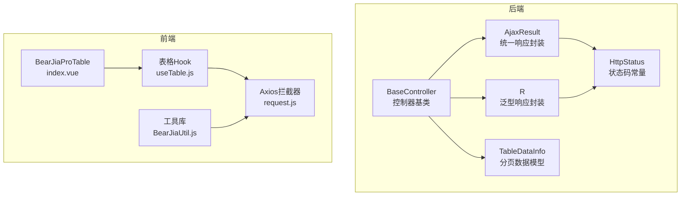
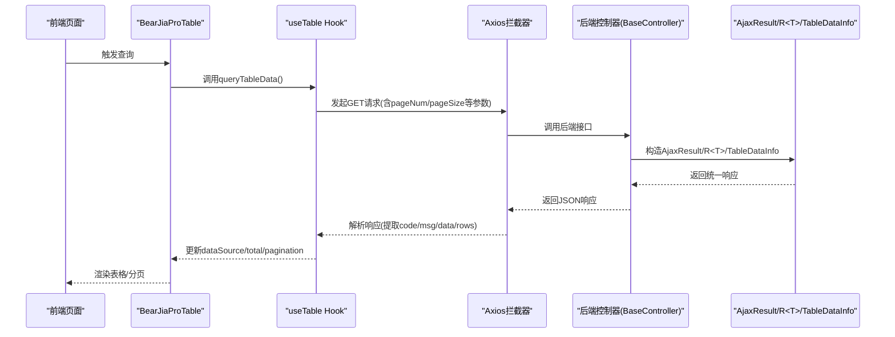
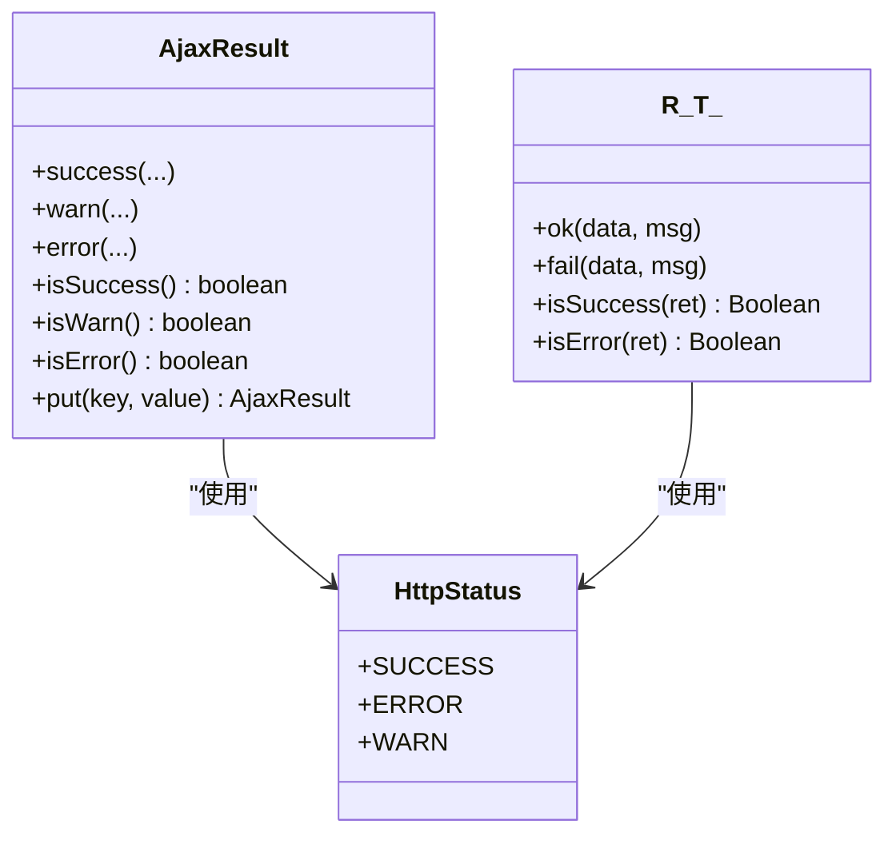
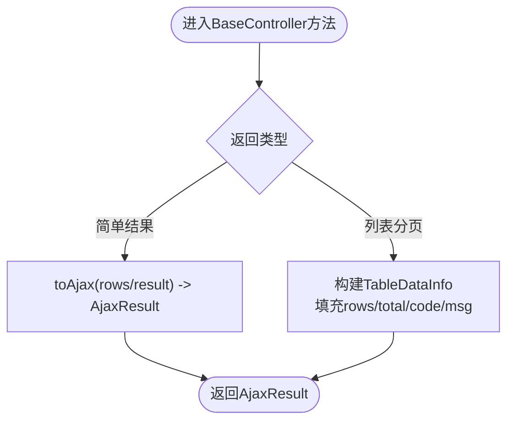
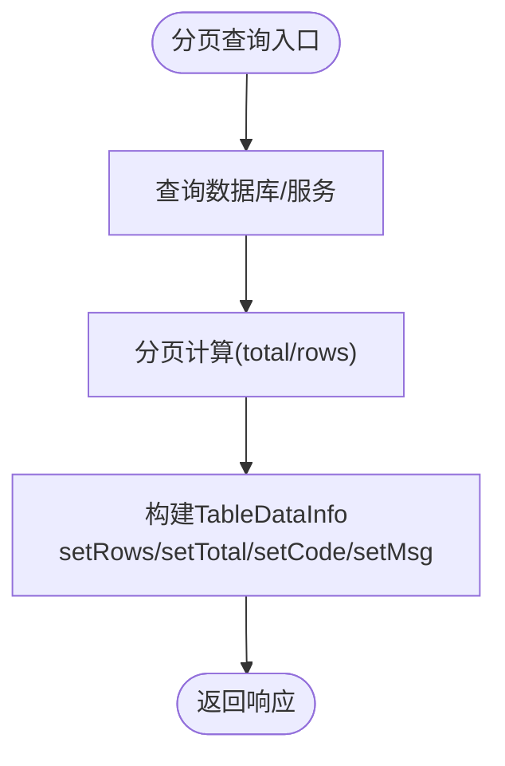
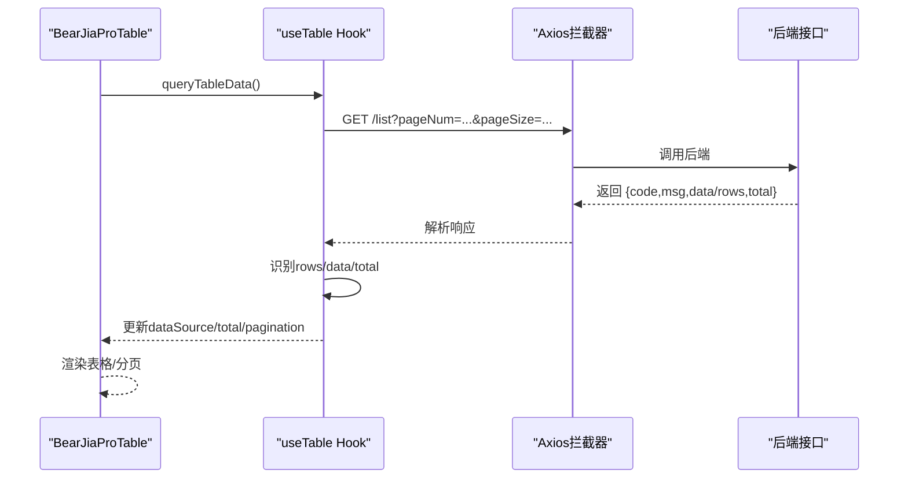
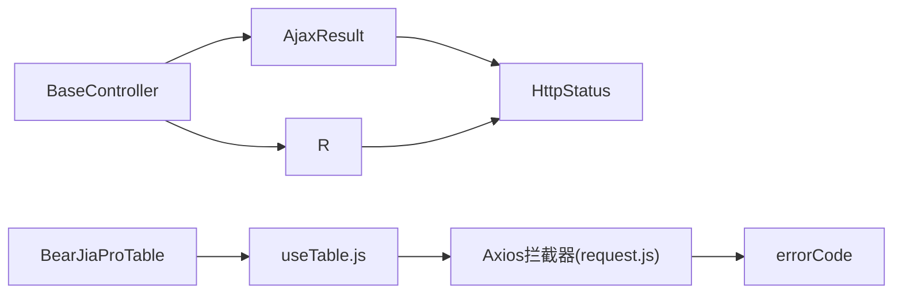

# API响应规范

<cite>
**本文档引用的文件**
- [AjaxResult.java](file://bearjia-admin-backend/src/main/java/com/javaxiaobear/base/framework/web/domain/AjaxResult.java)
- [R.java](file://bearjia-admin-backend/src/main/java/com/javaxiaobear/base/framework/web/domain/R.java)
- [HttpStatus.java](file://bearjia-admin-backend/src/main/java/com/javaxiaobear/base/common/constant/HttpStatus.java)
- [BaseController.java](file://bearjia-admin-backend/src/main/java/com/javaxiaobear/base/framework/web/controller/BaseController.java)
- [TableDataInfo.java](file://bearjia-admin-backend/src/main/java/com/javaxiaobear/base/framework/web/page/TableDataInfo.java)
- [request.js](file://bear-jia-vue3/src/utils/request.js)
- [BearJiaUtil.js](file://bear-jia-vue3/src/utils/BearJiaUtil.js)
- [useTable.js](file://bear-jia-vue3/src/composables/useTable.js)
- [index.vue](file://bear-jia-vue3/src/components/BearJiaProTable/index.vue)
- [ruoyi-usage.md](file://bear-jia-vue3/docs/ruoyi-usage.md)
</cite>

## 目录
1. [简介](#简介)
2. [项目结构](#项目结构)
3. [核心组件](#核心组件)
4. [架构总览](#架构总览)
5. [详细组件分析](#详细组件分析)
6. [依赖关系分析](#依赖关系分析)
7. [性能考虑](#性能考虑)
8. [故障排查指南](#故障排查指南)
9. [结论](#结论)
10. [附录](#附录)

## 简介
本规范文档面向后端与前端团队，系统化说明统一API响应格式的设计与实现，覆盖以下关键点：
- 后端统一响应封装：AjaxResult与R类的职责边界与使用方式
- 控制器层标准化：BaseController提供的success、error、warn、toAjax等方法
- 分页数据封装：TableDataInfo的total、rows字段生成逻辑
- 响应码设计：HttpStatus常量与HTTP语义的对应关系
- 前端BearJiaProTable组件对接：分页键位、rows/data字段兼容、错误处理
- 响应体版本控制策略：如何保证前后端兼容演进
- 性能与安全：响应数据脱敏、大字段懒加载等最佳实践

## 项目结构
后端采用Java Spring Boot工程，统一响应与分页模型位于框架模块；前端Vue3工程通过Axios拦截器与组合式工具对接后端统一响应格式。

图表来源
- [AjaxResult.java](file://bearjia-admin-backend/src/main/java/com/javaxiaobear/base/framework/web/domain/AjaxResult.java#L1-L216)
- [R.java](file://bearjia-admin-backend/src/main/java/com/javaxiaobear/base/framework/web/domain/R.java#L1-L116)
- [HttpStatus.java](file://bearjia-admin-backend/src/main/java/com/javaxiaobear/base/common/constant/HttpStatus.java#L1-L95)
- [BaseController.java](file://bearjia-admin-backend/src/main/java/com/javaxiaobear/base/framework/web/controller/BaseController.java#L1-L194)
- [TableDataInfo.java](file://bearjia-admin-backend/src/main/java/com/javaxiaobear/base/framework/web/page/TableDataInfo.java#L1-L85)
- [request.js](file://bear-jia-vue3/src/utils/request.js#L1-L165)
- [BearJiaUtil.js](file://bear-jia-vue3/src/utils/BearJiaUtil.js#L238-L273)
- [useTable.js](file://bear-jia-vue3/src/composables/useTable.js#L1-L238)
- [index.vue](file://bear-jia-vue3/src/components/BearJiaProTable/index.vue#L1-L448)

章节来源
- [AjaxResult.java](file://bearjia-admin-backend/src/main/java/com/javaxiaobear/base/framework/web/domain/AjaxResult.java#L1-L216)
- [R.java](file://bearjia-admin-backend/src/main/java/com/javaxiaobear/base/framework/web/domain/R.java#L1-L116)
- [HttpStatus.java](file://bearjia-admin-backend/src/main/java/com/javaxiaobear/base/common/constant/HttpStatus.java#L1-L95)
- [BaseController.java](file://bearjia-admin-backend/src/main/java/com/javaxiaobear/base/framework/web/controller/BaseController.java#L1-L194)
- [TableDataInfo.java](file://bearjia-admin-backend/src/main/java/com/javaxiaobear/base/framework/web/page/TableDataInfo.java#L1-L85)
- [request.js](file://bear-jia-vue3/src/utils/request.js#L1-L165)
- [BearJiaUtil.js](file://bear-jia-vue3/src/utils/BearJiaUtil.js#L238-L273)
- [useTable.js](file://bear-jia-vue3/src/composables/useTable.js#L1-L238)
- [index.vue](file://bear-jia-vue3/src/components/BearJiaProTable/index.vue#L1-L448)

## 核心组件
- AjaxResult：HashMap扩展的统一响应载体，提供success/warn/error静态工厂方法，支持链式put扩展字段，具备isSuccess/isWarn/isError判断能力。
- R<T>：泛型响应封装，用于携带泛型数据体，提供ok/fail静态工厂方法与isSuccess/isError判断。
- HttpStatus：统一的状态码常量集合，涵盖HTTP语义与系统自定义警告码。
- BaseController：控制器基类，提供success/error/warn/toAjax等便捷方法，统一处理分页列表返回TableDataInfo。
- TableDataInfo：分页数据模型，包含total、rows、code、msg字段，用于承载分页查询结果。

章节来源
- [AjaxResult.java](file://bearjia-admin-backend/src/main/java/com/javaxiaobear/base/framework/web/domain/AjaxResult.java#L1-L216)
- [R.java](file://bearjia-admin-backend/src/main/java/com/javaxiaobear/base/framework/web/domain/R.java#L1-L116)
- [HttpStatus.java](file://bearjia-admin-backend/src/main/java/com/javaxiaobear/base/common/constant/HttpStatus.java#L1-L95)
- [BaseController.java](file://bearjia-admin-backend/src/main/java/com/javaxiaobear/base/framework/web/controller/BaseController.java#L86-L161)
- [TableDataInfo.java](file://bearjia-admin-backend/src/main/java/com/javaxiaobear/base/framework/web/page/TableDataInfo.java#L1-L85)

## 架构总览
后端控制器通过BaseController输出统一响应；前端Axios拦截器解析后端响应，按约定提取code、msg、data/rows字段，并驱动BearJiaProTable渲染。

图表来源
- [BaseController.java](file://bearjia-admin-backend/src/main/java/com/javaxiaobear/base/framework/web/controller/BaseController.java#L86-L161)
- [AjaxResult.java](file://bearjia-admin-backend/src/main/java/com/javaxiaobear/base/framework/web/domain/AjaxResult.java#L1-L216)
- [R.java](file://bearjia-admin-backend/src/main/java/com/javaxiaobear/base/framework/web/domain/R.java#L1-L116)
- [TableDataInfo.java](file://bearjia-admin-backend/src/main/java/com/javaxiaobear/base/framework/web/page/TableDataInfo.java#L1-L85)
- [useTable.js](file://bear-jia-vue3/src/composables/useTable.js#L69-L124)
- [request.js](file://bear-jia-vue3/src/utils/request.js#L69-L123)

## 详细组件分析

### AjaxResult与R类的封装机制
- AjaxResult
  - 静态工厂：success/warn/error，支持带data或仅消息体
  - 字段：code/msg/data，其中data在非空时才放入响应
  - 判定：isSuccess/isWarn/isError基于code与HttpStatus常量对比
  - 扩展：put(key,value)支持链式追加自定义字段
- R<T>
  - 泛型封装：ok/fail静态工厂，支持data与自定义消息
  - 判断：isSuccess/isError基于code与SUCCESS/ERROR常量
  - 适用场景：需要明确返回数据类型的接口，便于前端TS类型推断

图表来源
- [AjaxResult.java](file://bearjia-admin-backend/src/main/java/com/javaxiaobear/base/framework/web/domain/AjaxResult.java#L1-L216)
- [R.java](file://bearjia-admin-backend/src/main/java/com/javaxiaobear/base/framework/web/domain/R.java#L1-L116)
- [HttpStatus.java](file://bearjia-admin-backend/src/main/java/com/javaxiaobear/base/common/constant/HttpStatus.java#L1-L95)

章节来源
- [AjaxResult.java](file://bearjia-admin-backend/src/main/java/com/javaxiaobear/base/framework/web/domain/AjaxResult.java#L62-L216)
- [R.java](file://bearjia-admin-backend/src/main/java/com/javaxiaobear/base/framework/web/domain/R.java#L27-L116)
- [HttpStatus.java](file://bearjia-admin-backend/src/main/java/com/javaxiaobear/base/common/constant/HttpStatus.java#L1-L95)

### BaseController标准化响应方法
- success()/success(message)/success(data)
- error()/error(message)
- warn(message)
- toAjax(int rows)/toAjax(boolean result)
- 列表分页：构造TableDataInfo，填充rows与total，设置code/msg

图表来源
- [BaseController.java](file://bearjia-admin-backend/src/main/java/com/javaxiaobear/base/framework/web/controller/BaseController.java#L86-L161)
- [TableDataInfo.java](file://bearjia-admin-backend/src/main/java/com/javaxiaobear/base/framework/web/page/TableDataInfo.java#L1-L85)

章节来源
- [BaseController.java](file://bearjia-admin-backend/src/main/java/com/javaxiaobear/base/framework/web/controller/BaseController.java#L93-L161)
- [TableDataInfo.java](file://bearjia-admin-backend/src/main/java/com/javaxiaobear/base/framework/web/page/TableDataInfo.java#L1-L85)

### TableDataInfo分页数据封装
- 字段：total、rows、code、msg
- 生成逻辑：列表查询时，将分页后的数据赋给rows，total由PageInfo或显式传入
- 前端消费：useTable根据响应结构自动识别rows或data字段，更新dataSource与total

图表来源
- [BaseController.java](file://bearjia-admin-backend/src/main/java/com/javaxiaobear/base/framework/web/controller/BaseController.java#L86-L91)
- [TableDataInfo.java](file://bearjia-admin-backend/src/main/java/com/javaxiaobear/base/framework/web/page/TableDataInfo.java#L1-L85)

章节来源
- [BaseController.java](file://bearjia-admin-backend/src/main/java/com/javaxiaobear/base/framework/web/controller/BaseController.java#L86-L91)
- [TableDataInfo.java](file://bearjia-admin-backend/src/main/java/com/javaxiaobear/base/framework/web/page/TableDataInfo.java#L1-L85)

### 响应码（HttpStatus）设计规范
- 常量覆盖：成功、创建、接受、无内容、重定向、未修改、参数错误、未授权、禁止访问、资源未找到、方法不允许、冲突、不支持类型、系统错误、未实现、系统警告
- 前端Axios拦截器依据code进行统一错误提示与登出处理
- 建议：后端接口返回code与HTTP状态码解耦，HTTP状态码用于传输层语义，业务状态码用于业务层语义

章节来源
- [HttpStatus.java](file://bearjia-admin-backend/src/main/java/com/javaxiaobear/base/common/constant/HttpStatus.java#L1-L95)
- [request.js](file://bear-jia-vue3/src/utils/request.js#L69-L123)

### 与前端BearJiaProTable组件的无缝对接
- 分页键位：前端useTable.js使用pageNum/pageSize作为分页参数键位
- 数据字段兼容：前端useTable.js支持三种响应结构
  - { rows, total }：标准分页结构
  - 数组：直接作为rows
  - { data, total? }：兼容后端R<T>或AjaxResult.data
- 分页渲染：useTable.js根据total与pageSize决定是否显示分页控件
- 错误处理：Axios拦截器对401/500等进行统一提示与登出

图表来源
- [useTable.js](file://bear-jia-vue3/src/composables/useTable.js#L69-L124)
- [request.js](file://bear-jia-vue3/src/utils/request.js#L69-L123)
- [index.vue](file://bear-jia-vue3/src/components/BearJiaProTable/index.vue#L1-L448)
- [ruoyi-usage.md](file://bear-jia-vue3/docs/ruoyi-usage.md#L383-L614)

章节来源
- [useTable.js](file://bear-jia-vue3/src/composables/useTable.js#L69-L124)
- [BearJiaUtil.js](file://bear-jia-vue3/src/utils/BearJiaUtil.js#L238-L273)
- [request.js](file://bear-jia-vue3/src/utils/request.js#L69-L123)
- [index.vue](file://bear-jia-vue3/src/components/BearJiaProTable/index.vue#L1-L448)
- [ruoyi-usage.md](file://bear-jia-vue3/docs/ruoyi-usage.md#L383-L614)

### 响应体版本控制策略
- 建议采用“向后兼容”的版本控制策略：
  - 在响应体中保留历史字段（如同时提供rows与data），避免破坏前端现有逻辑
  - 逐步引导前端迁移到新的字段命名（如统一使用data）
  - 通过HTTP头部或URL路径前缀区分版本，避免一次性变更造成大面积影响
- 前端Axios拦截器与useTable.js对字段兼容性做了适配，有助于平滑过渡

章节来源
- [AjaxResult.java](file://bearjia-admin-backend/src/main/java/com/javaxiaobear/base/framework/web/domain/AjaxResult.java#L1-L216)
- [R.java](file://bearjia-admin-backend/src/main/java/com/javaxiaobear/base/framework/web/domain/R.java#L1-L116)
- [useTable.js](file://bear-jia-vue3/src/composables/useTable.js#L88-L124)

### 实际代码示例（路径引用）
- AjaxResult成功/错误/警告工厂方法
  - [AjaxResult.success(...) / AjaxResult.error(...) / AjaxResult.warn(...)](file://bearjia-admin-backend/src/main/java/com/javaxiaobear/base/framework/web/domain/AjaxResult.java#L62-L171)
- R<T>泛型封装
  - [R.ok(...) / R.fail(...)](file://bearjia-admin-backend/src/main/java/com/javaxiaobear/base/framework/web/domain/R.java#L27-L65)
- BaseController分页与通用返回
  - [BaseController.buildTableDataInfo(...) 与 success()/error()/warn()/toAjax(...)](file://bearjia-admin-backend/src/main/java/com/javaxiaobear/base/framework/web/controller/BaseController.java#L86-L161)
- 前端useTable.js对响应结构的兼容处理
  - [useTable.js queryTableData 中的响应结构分支](file://bear-jia-vue3/src/composables/useTable.js#L88-L124)
- Axios拦截器对响应的统一处理
  - [request.js 响应拦截器](file://bear-jia-vue3/src/utils/request.js#L69-L123)

章节来源
- [AjaxResult.java](file://bearjia-admin-backend/src/main/java/com/javaxiaobear/base/framework/web/domain/AjaxResult.java#L62-L171)
- [R.java](file://bearjia-admin-backend/src/main/java/com/javaxiaobear/base/framework/web/domain/R.java#L27-L65)
- [BaseController.java](file://bearjia-admin-backend/src/main/java/com/javaxiaobear/base/framework/web/controller/BaseController.java#L86-L161)
- [useTable.js](file://bear-jia-vue3/src/composables/useTable.js#L88-L124)
- [request.js](file://bear-jia-vue3/src/utils/request.js#L69-L123)

## 依赖关系分析
- 后端依赖链
  - BaseController依赖AjaxResult/R<T>/TableDataInfo/HttpStatus
  - AjaxResult/R<T>依赖HttpStatus
- 前端依赖链
  - BearJiaProTable依赖useTable.js
  - useTable.js依赖Axios拦截器与BearJiaUtil.js
  - Axios拦截器依赖errorCode与store

图表来源
- [BaseController.java](file://bearjia-admin-backend/src/main/java/com/javaxiaobear/base/framework/web/controller/BaseController.java#L1-L194)
- [AjaxResult.java](file://bearjia-admin-backend/src/main/java/com/javaxiaobear/base/framework/web/domain/AjaxResult.java#L1-L216)
- [R.java](file://bearjia-admin-backend/src/main/java/com/javaxiaobear/base/framework/web/domain/R.java#L1-L116)
- [HttpStatus.java](file://bearjia-admin-backend/src/main/java/com/javaxiaobear/base/common/constant/HttpStatus.java#L1-L95)
- [index.vue](file://bear-jia-vue3/src/components/BearJiaProTable/index.vue#L1-L448)
- [useTable.js](file://bear-jia-vue3/src/composables/useTable.js#L1-L238)
- [request.js](file://bear-jia-vue3/src/utils/request.js#L1-L165)

章节来源
- [BaseController.java](file://bearjia-admin-backend/src/main/java/com/javaxiaobear/base/framework/web/controller/BaseController.java#L1-L194)
- [AjaxResult.java](file://bearjia-admin-backend/src/main/java/com/javaxiaobear/base/framework/web/domain/AjaxResult.java#L1-L216)
- [R.java](file://bearjia-admin-backend/src/main/java/com/javaxiaobear/base/framework/web/domain/R.java#L1-L116)
- [HttpStatus.java](file://bearjia-admin-backend/src/main/java/com/javaxiaobear/base/common/constant/HttpStatus.java#L1-L95)
- [index.vue](file://bear-jia-vue3/src/components/BearJiaProTable/index.vue#L1-L448)
- [useTable.js](file://bear-jia-vue3/src/composables/useTable.js#L1-L238)
- [request.js](file://bear-jia-vue3/src/utils/request.js#L1-L165)

## 性能考虑
- 响应数据脱敏
  - 对敏感字段在序列化阶段进行脱敏处理，避免泄露
  - 前端仅展示必要字段，避免渲染大字段
- 大字段懒加载
  - 列表页仅返回轻量字段，详情页或点击后再拉取完整字段
  - 使用虚拟滚动渲染大数据集，降低DOM压力
- 分页与排序
  - 后端分页参数严格校验，避免超大offset导致慢查询
  - 前端排序参数仅传递必要字段，避免全量排序
- 响应体积优化
  - 合并冗余字段，避免同时返回rows与data
  - 使用压缩传输（gzip/br），减少网络开销

[本节为通用指导，无需特定文件引用]

## 故障排查指南
- 前端Axios拦截器
  - 401：触发登出流程并跳转登录页
  - 500：统一错误提示，阻断后续流程
  - 其他非200：根据code映射错误文案并提示
- BearJiaProTable
  - 加载失败：显示错误状态与重试按钮
  - 分页不生效：检查后端是否返回total与rows/data字段
- BaseController
  - toAjax返回值不符合预期：确认rows>0与布尔值分支
  - 分页total缺失：检查TableDataInfo是否正确设置total

章节来源
- [request.js](file://bear-jia-vue3/src/utils/request.js#L69-L123)
- [index.vue](file://bear-jia-vue3/src/components/BearJiaProTable/index.vue#L1-L448)
- [BaseController.java](file://bearjia-admin-backend/src/main/java/com/javaxiaobear/base/framework/web/controller/BaseController.java#L147-L161)

## 结论
通过AjaxResult/R<T>与BaseController的统一封装，结合HttpStatus的规范状态码与前端BearJiaProTable的兼容处理，实现了前后端一致的响应契约。遵循本文档的版本控制策略与性能建议，可在保障兼容性的前提下持续演进API设计，提升整体开发效率与用户体验。

[本节为总结，无需特定文件引用]

## 附录
- 关键字段说明
  - code：业务状态码
  - msg：提示信息
  - data：业务数据体
  - rows：分页列表数据
  - total：分页总数
- 前端分页键位
  - pageNum：当前页
  - pageSize：每页条数
- 常见响应结构
  - { code, msg, data }
  - { code, msg, rows, total }
  - { code, msg, data, total }

[本节为概览，无需特定文件引用]