# API服务

<cite>
**本文档引用文件**  
- [BaseController.java](file://bearjia-admin-backend/src/main/java/com/javaxiaobear/base/framework/web/controller/BaseController.java)
- [AjaxResult.java](file://bearjia-admin-backend/src/main/java/com/javaxiaobear/base/framework/web/domain/AjaxResult.java)
- [R.java](file://bearjia-admin-backend/src/main/java/com/javaxiaobear/base/framework/web/domain/R.java)
- [TableDataInfo.java](file://bearjia-admin-backend/src/main/java/com/javaxiaobear/base/framework/web/page/TableDataInfo.java)
- [GlobalExceptionHandler.java](file://bearjia-admin-backend/src/main/java/com/javaxiaobear/base/framework/web/exception/GlobalExceptionHandler.java)
- [HttpStatus.java](file://bearjia-admin-backend/src/main/java/com/javaxiaobear/base/common/constant/HttpStatus.java)
</cite>

## 目录
1. [引言](#引言)
2. [统一响应格式设计](#统一响应格式设计)
3. [分页查询实现机制](#分页查询实现机制)
4. [全局异常处理策略](#全局异常处理策略)
5. [API版本管理与URL设计](#api版本管理与url设计)
6. [文件上传下载接口实现](#文件上传下载接口实现)
7. [Swagger文档集成](#swagger文档集成)
8. [API设计最佳实践](#api设计最佳实践)
9. [性能优化建议](#性能优化建议)
10. [结论](#结论)

## 引言

本API服务文档详细阐述了后端RESTful API的设计规范与实现机制。系统采用Spring Boot框架构建，通过统一的响应封装、标准化的异常处理和完善的分页机制，为前端提供稳定可靠的接口服务。文档重点分析了BaseController中AjaxResult/R的封装机制、TableDataInfo分页实现、全局异常处理器的工作原理，以及文件上传下载等核心功能的实现方案。

**文档来源**
- [BaseController.java](file://bearjia-admin-backend/src/main/java/com/javaxiaobear/base/framework/web/controller/BaseController.java)
- [AjaxResult.java](file://bearjia-admin-backend/src/main/java/com/javaxiaobear/base/framework/web/domain/AjaxResult.java)

## 统一响应格式设计

### 响应封装机制

系统通过`AjaxResult`和`R`两个类实现统一的响应数据封装，确保所有API接口返回格式标准化。

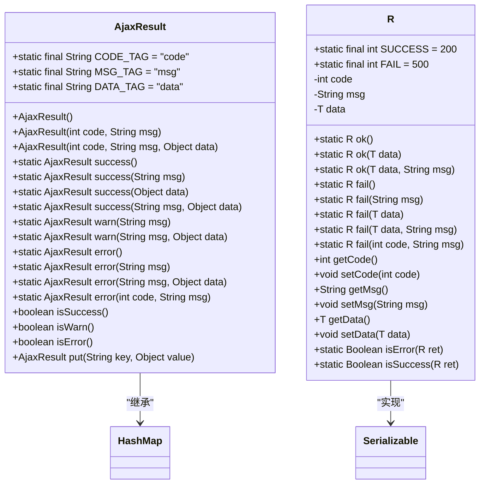

**图示来源**  
- [AjaxResult.java](file://bearjia-admin-backend/src/main/java/com/javaxiaobear/base/framework/web/domain/AjaxResult.java)
- [R.java](file://bearjia-admin-backend/src/main/java/com/javaxiaobear/base/framework/web/domain/R.java)

### 响应状态码定义

系统定义了标准化的HTTP状态码，通过`HttpStatus`常量类统一管理：

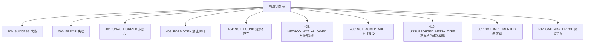

**图示来源**  
- [HttpStatus.java](file://bearjia-admin-backend/src/main/java/com/javaxiaobear/base/common/constant/HttpStatus.java)

### BaseController响应方法

`BaseController`提供了便捷的响应方法，简化控制器的开发：

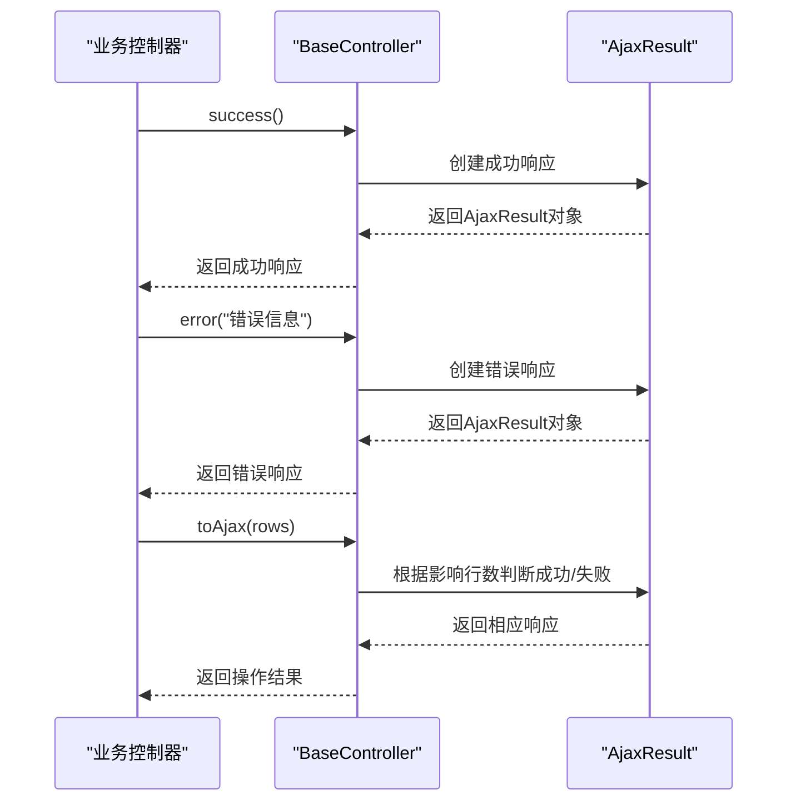

**图示来源**  
- [BaseController.java](file://bearjia-admin-backend/src/main/java/com/javaxiaobear/base/framework/web/controller/BaseController.java)
- [AjaxResult.java](file://bearjia-admin-backend/src/main/java/com/javaxiaobear/base/framework/web/domain/AjaxResult.java)

**本节来源**  
- [BaseController.java](file://bearjia-admin-backend/src/main/java/com/javaxiaobear/base/framework/web/controller/BaseController.java)
- [AjaxResult.java](file://bearjia-admin-backend/src/main/java/com/javaxiaobear/base/framework/web/domain/AjaxResult.java)
- [R.java](file://bearjia-admin-backend/src/main/java/com/javaxiaobear/base/framework/web/domain/R.java)

## 分页查询实现机制

### TableDataInfo分页封装

`TableDataInfo`类专门用于封装表格分页数据，包含总记录数、数据列表、状态码和消息内容。

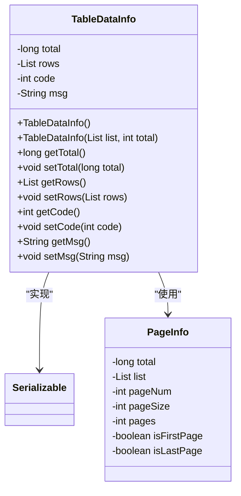

**图示来源**  
- [TableDataInfo.java](file://bearjia-admin-backend/src/main/java/com/javaxiaobear/base/framework/web/page/TableDataInfo.java)

### 分页实现流程

系统通过PageHelper实现分页查询，流程如下：

```mermaid
flowchart TD
A[前端请求] --> B["携带分页参数<br/>pageNum, pageSize,<br/>orderBy等"]
B --> C[控制器调用startPage()]
C --> D[PageHelper拦截SQL]
D --> E[自动添加LIMIT子句]
E --> F[执行分页查询]
F --> G[获取PageInfo对象]
G --> H[封装为TableDataInfo]
H --> I[返回分页结果]
I --> J[前端表格组件渲染]
```

**图示来源**  
- [BaseController.java](file://bearjia-admin-backend/src/main/java/com/javaxiaobear/base/framework/web/controller/BaseController.java)
- [TableDataInfo.java](file://bearjia-admin-backend/src/main/java/com/javaxiaobear/base/framework/web/page/TableDataInfo.java)

### 分页API使用示例

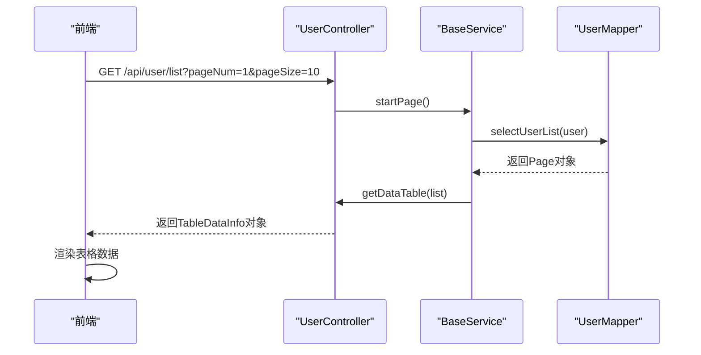

**图示来源**  
- [BaseController.java](file://bearjia-admin-backend/src/main/java/com/javaxiaobear/base/framework/web/controller/BaseController.java)
- [TableDataInfo.java](file://bearjia-admin-backend/src/main/java/com/javaxiaobear/base/framework/web/page/TableDataInfo.java)

**本节来源**  
- [BaseController.java](file://bearjia-admin-backend/src/main/java/com/javaxiaobear/base/framework/web/controller/BaseController.java)
- [TableDataInfo.java](file://bearjia-admin-backend/src/main/java/com/javaxiaobear/base/framework/web/page/TableDataInfo.java)
- [PageUtils.java](file://bearjia-admin-backend/src/main/java/com/javaxiaobear/base/common/utils/PageUtils.java)

## 全局异常处理策略

### GlobalExceptionHandler架构

系统通过`@RestControllerAdvice`注解实现全局异常处理，捕获各类异常并返回结构化错误信息。

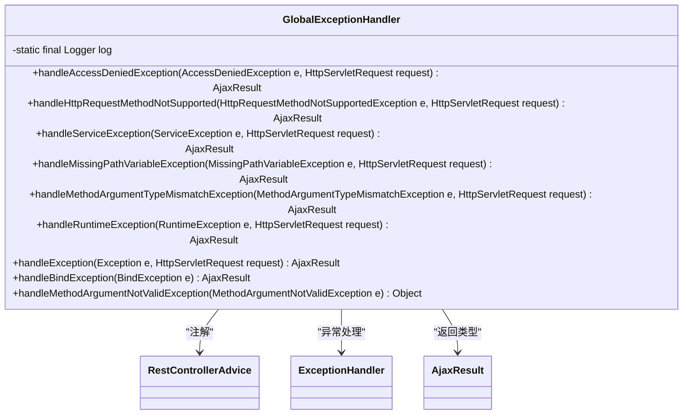

**图示来源**  
- [GlobalExceptionHandler.java](file://bearjia-admin-backend/src/main/java/com/javaxiaobear/base/framework/web/exception/GlobalExceptionHandler.java)

### 异常处理流程

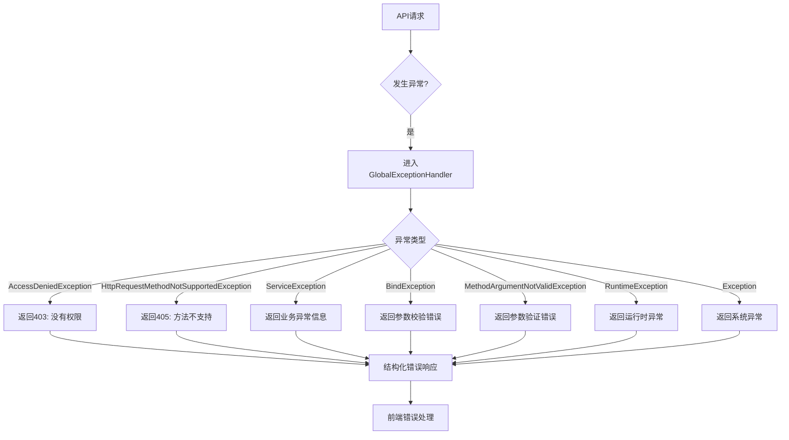

**图示来源**  
- [GlobalExceptionHandler.java](file://bearjia-admin-backend/src/main/java/com/javaxiaobear/base/framework/web/exception/GlobalExceptionHandler.java)

### 业务异常处理

系统定义了`ServiceException`作为业务异常基类，支持自定义错误码和消息：

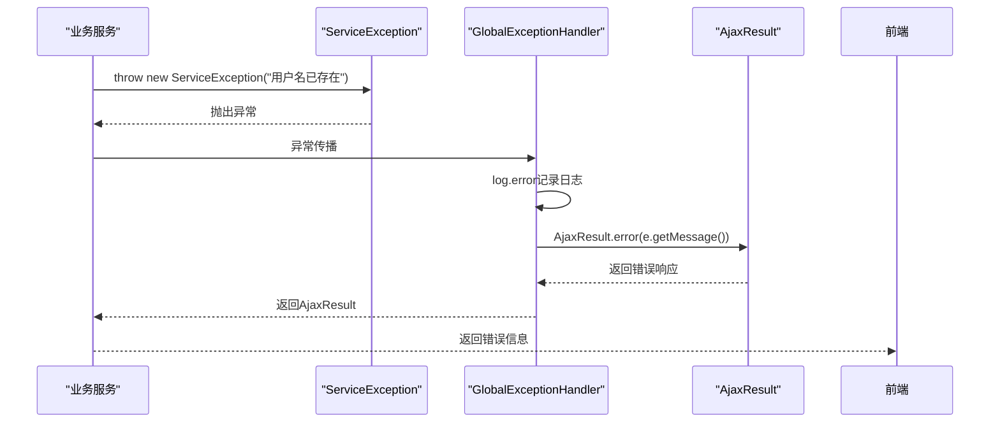

**图示来源**  
- [GlobalExceptionHandler.java](file://bearjia-admin-backend/src/main/java/com/javaxiaobear/base/framework/web/exception/GlobalExceptionHandler.java)
- [ServiceException.java](file://bearjia-admin-backend/src/main/java/com/javaxiaobear/base/common/exception/ServiceException.java)

**本节来源**  
- [GlobalExceptionHandler.java](file://bearjia-admin-backend/src/main/java/com/javaxiaobear/base/framework/web/exception/GlobalExceptionHandler.java)
- [ServiceException.java](file://bearjia-admin-backend/src/main/java/com/javaxiaobear/base/common/exception/ServiceException.java)
- [AjaxResult.java](file://bearjia-admin-backend/src/main/java/com/javaxiaobear/base/framework/web/domain/AjaxResult.java)

## API版本管理与URL设计

### URL路径设计规范

系统遵循RESTful设计原则，采用清晰的URL路径结构：

```mermaid
flowchart TD
A[API根路径] --> B[/api/v1]
B --> C[模块划分]
C --> D["/system: 系统管理"]
C --> E["/monitor: 系统监控"]
C --> F["/tool: 工具模块"]
D --> G["/user: 用户管理"]
D --> H["/role: 角色管理"]
D --> I["/menu: 菜单管理"]
G --> J["GET /api/v1/system/user: 查询用户列表"]
G --> K["GET /api/v1/system/user/{id}: 获取用户详情"]
G --> L["POST /api/v1/system/user: 新增用户"]
G --> M["PUT /api/v1/system/user: 修改用户"]
G --> N["DELETE /api/v1/system/user/{id}: 删除用户"]
```

### API版本管理策略

系统采用URL路径版本控制策略，确保API的向后兼容性：

```mermaid
classDiagram
class APIVersioning {
+/api/v1/* : 当前稳定版本
+/api/v2/* : 新版本(开发中)
+/api/latest/* : 最新版本(不推荐生产使用)
}
APIVersioning --> "版本迁移策略"
APIVersioning --> "向后兼容保证"
APIVersioning --> "废弃API标记"
APIVersioning --> "文档同步更新"
```

**本节来源**  
- [UserController.java](file://bearjia-admin-backend/src/main/java/com/javaxiaobear/module/system/controller/UserController.java)
- [MenuController.java](file://bearjia-admin-backend/src/main/java/com/javaxiaobear/module/system/controller/MenuController.java)

## 文件上传下载接口实现

### 文件处理架构

系统通过专门的文件控制器处理文件上传下载，支持本地存储和OSS集成：

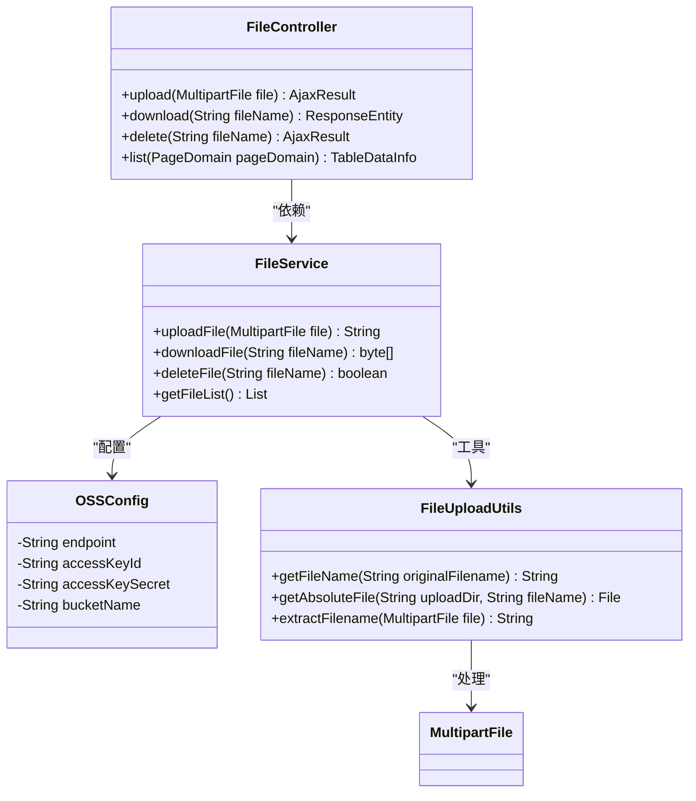

### 大文件处理方案

系统采用分片上传和断点续传机制处理大文件：

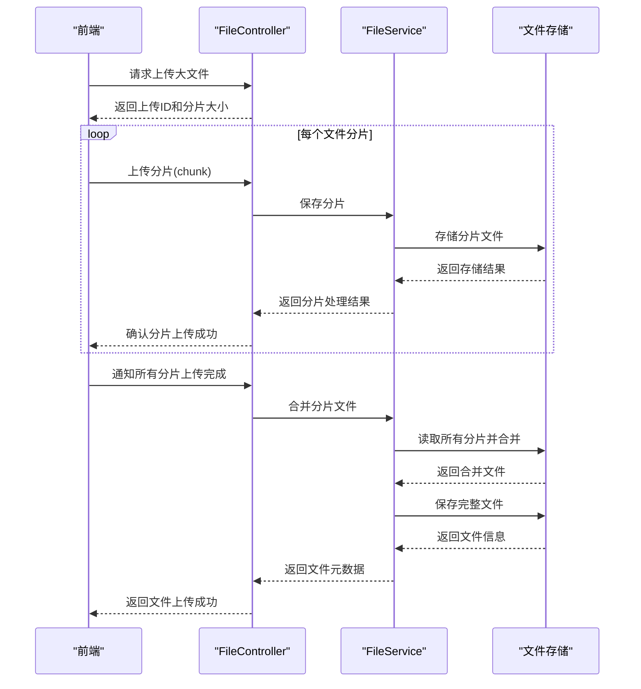

**本节来源**  
- [FileController.java](file://bearjia-admin-backend/src/main/java/com/javaxiaobear/module/system/controller/FileController.java)
- [OssController.java](file://bearjia-admin-backend/src/main/java/com/javaxiaobear/module/system/controller/OssController.java)
- [FileUploadUtils.java](file://bearjia-admin-backend/src/main/java/com/javaxiaobear/base/common/utils/file/FileUploadUtils.java)

## Swagger文档集成

### Swagger配置

系统集成Swagger2生成API文档，通过注解自动生成接口文档：

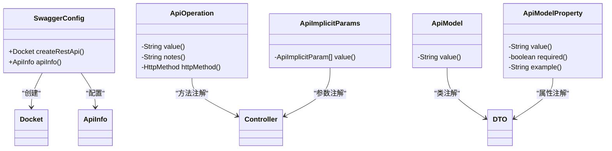

### 文档访问路径

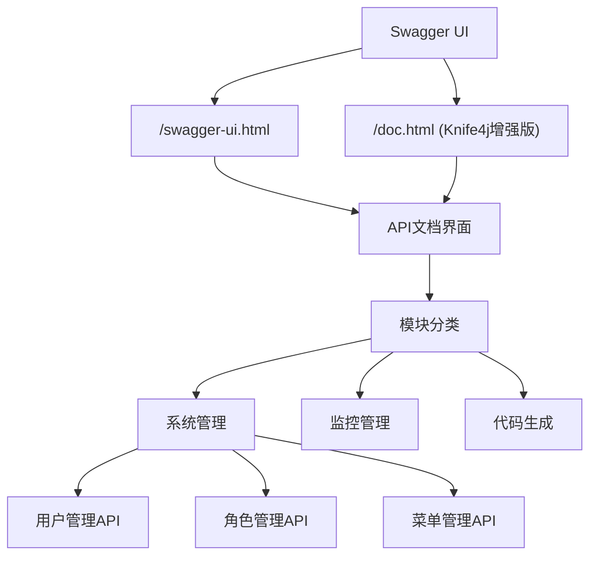

**本节来源**  
- [SwaggerConfig.java](file://bearjia-admin-backend/src/main/java/com/javaxiaobear/base/framework/config/SwaggerConfig.java)
- [UserController.java](file://bearjia-admin-backend/src/main/java/com/javaxiaobear/module/system/controller/UserController.java)

## API设计最佳实践

### HTTP状态码使用规范

| 状态码 | 含义 | 使用场景 |
|--------|------|----------|
| 200 | OK | 请求成功，返回数据 |
| 201 | Created | 资源创建成功 |
| 204 | No Content | 删除操作成功，无返回内容 |
| 400 | Bad Request | 请求参数错误 |
| 401 | Unauthorized | 未授权访问 |
| 403 | Forbidden | 禁止访问（权限不足） |
| 404 | Not Found | 请求资源不存在 |
| 405 | Method Not Allowed | 请求方法不支持 |
| 409 | Conflict | 资源冲突（如用户名重复） |
| 422 | Unprocessable Entity | 请求语义正确但无法处理 |
| 500 | Internal Server Error | 服务器内部错误 |

### 请求参数校验

系统采用Spring Validation进行参数校验：

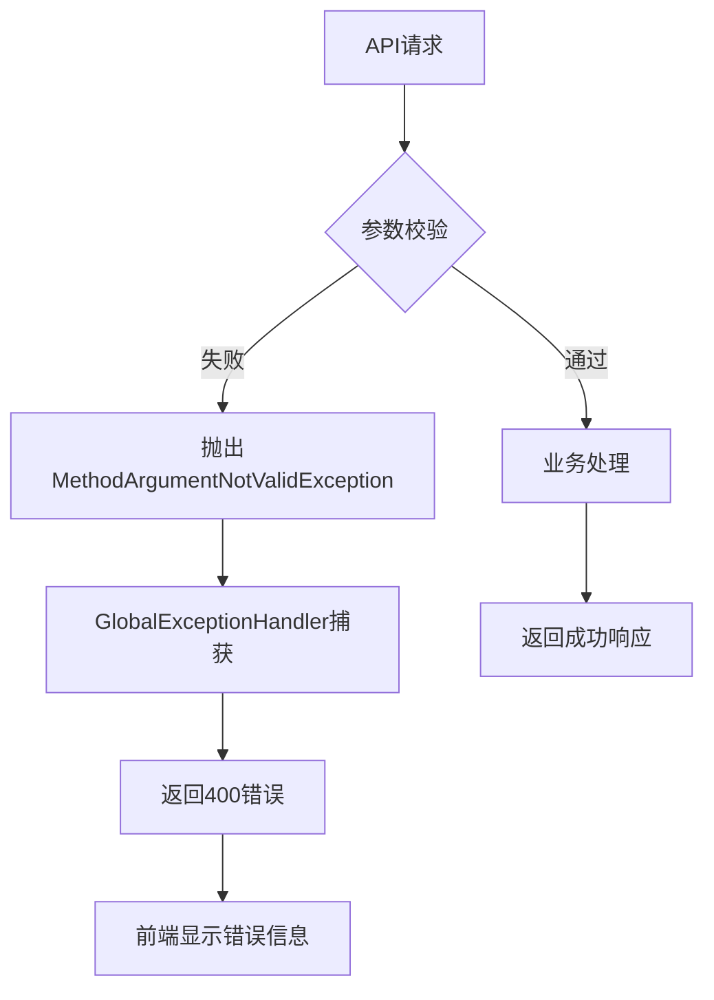

### 敏感数据脱敏

系统对敏感信息进行脱敏处理：

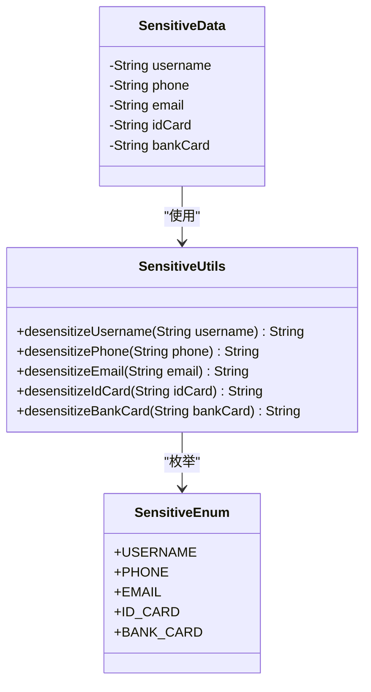

**本节来源**  
- [BaseController.java](file://bearjia-admin-backend/src/main/java/com/javaxiaobear/base/framework/web/controller/BaseController.java)
- [GlobalExceptionHandler.java](file://bearjia-admin-backend/src/main/java/com/javaxiaobear/base/framework/web/exception/GlobalExceptionHandler.java)
- [StringUtils.java](file://bearjia-admin-backend/src/main/java/com/javaxiaobear/base/common/utils/StringUtils.java)

## 性能优化建议

### 接口缓存策略

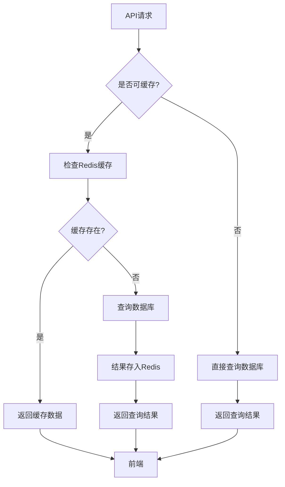

### 异步处理机制

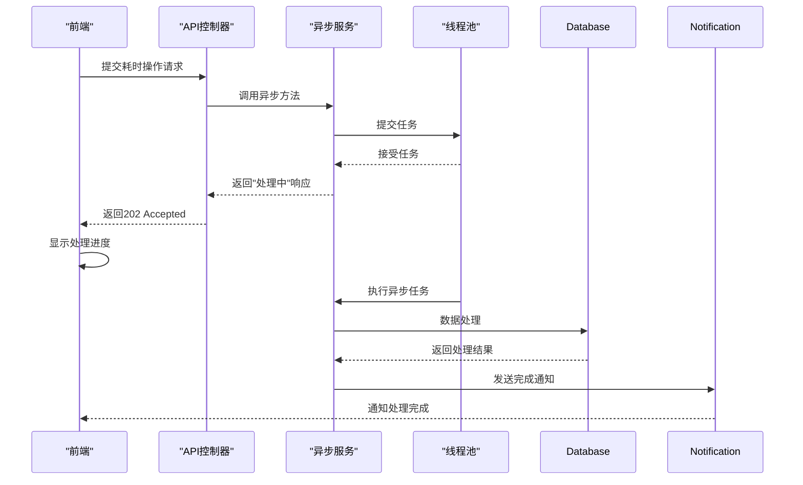

### 数据库优化建议

1. **索引优化**：为常用查询字段创建索引
2. **分页优化**：避免使用OFFSET分页，采用游标分页
3. **查询优化**：避免N+1查询问题，使用JOIN或批量查询
4. **连接池配置**：合理配置数据库连接池参数
5. **慢查询监控**：启用慢查询日志，定期分析优化

**本节来源**  
- [BaseController.java](file://bearjia-admin-backend/src/main/java/com/javaxiaobear/base/framework/web/controller/BaseController.java)
- [RedisConfig.java](file://bearjia-admin-backend/src/main/java/com/javaxiaobear/base/framework/config/RedisConfig.java)
- [ThreadPoolConfig.java](file://bearjia-admin-backend/src/main/java/com/javaxiaobear/base/framework/config/ThreadPoolConfig.java)

## 结论

本文档详细阐述了API服务的设计规范与实现机制。系统通过`BaseController`提供统一的响应封装，`AjaxResult`和`R`类标准化成功与错误响应格式。分页查询通过`TableDataInfo`封装分页元数据，与前端表格组件无缝对接。全局异常处理器`GlobalExceptionHandler`捕获各类异常并返回结构化错误信息，提升系统健壮性。

API版本管理采用URL路径版本控制策略，Swagger文档集成提供完善的接口文档。文件上传下载接口支持大文件分片处理和OSS集成。在API设计上，遵循HTTP状态码使用规范，实施请求参数校验和敏感数据脱敏。性能优化方面，建议采用接口缓存策略和异步处理机制，提升系统响应速度和用户体验。

这些设计和实现机制共同构建了一个稳定、高效、易用的API服务框架，为前后端分离架构提供了坚实的基础。