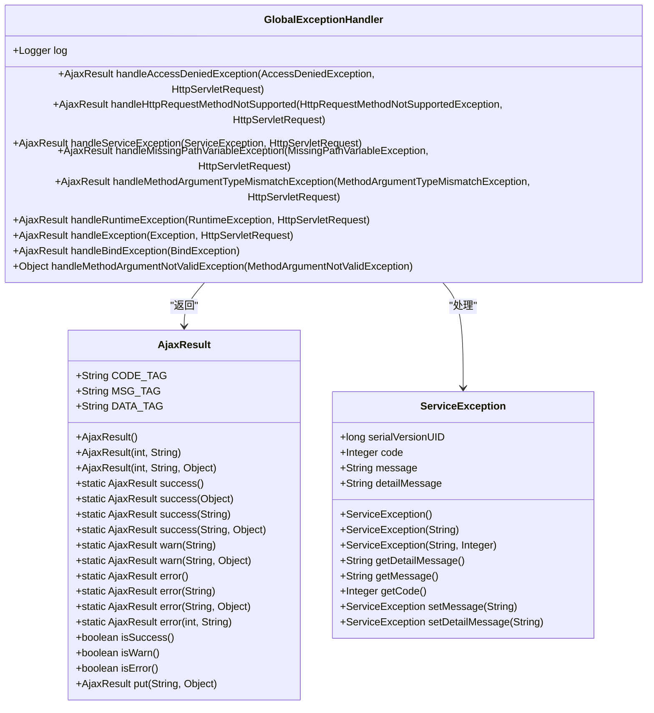
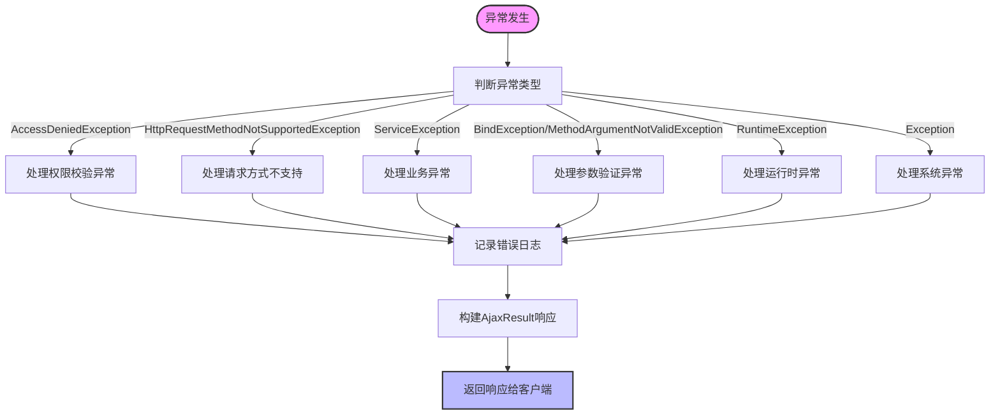
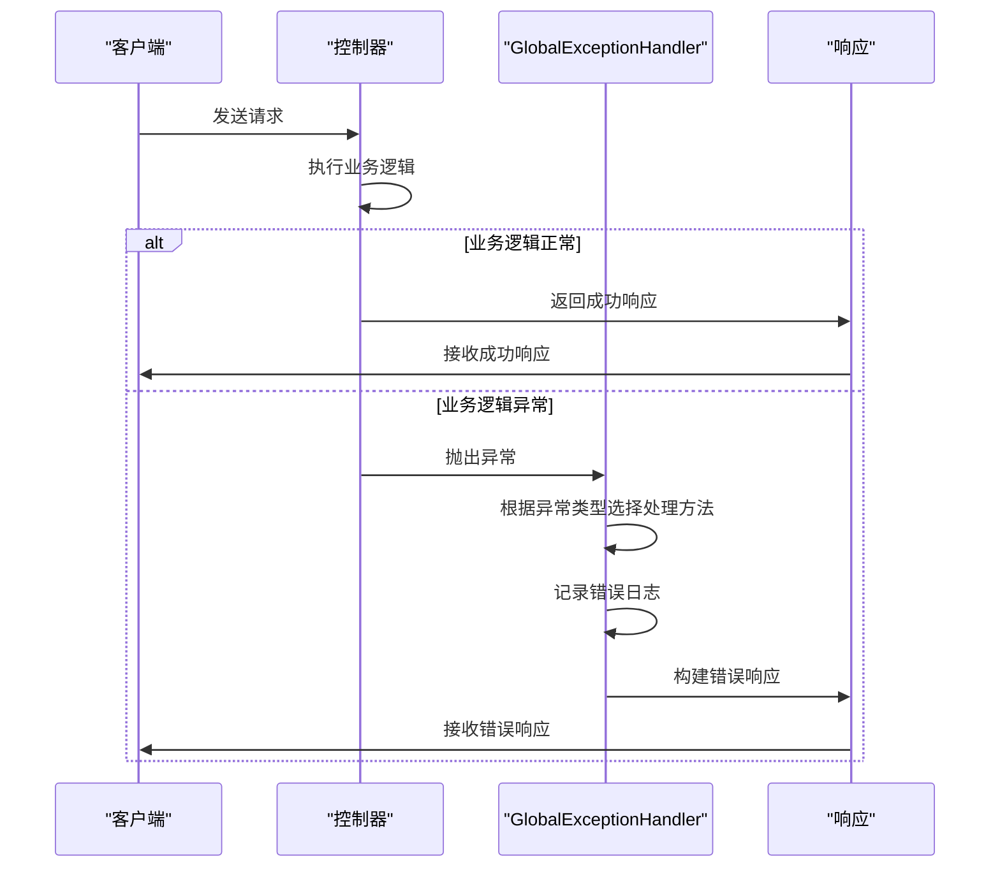
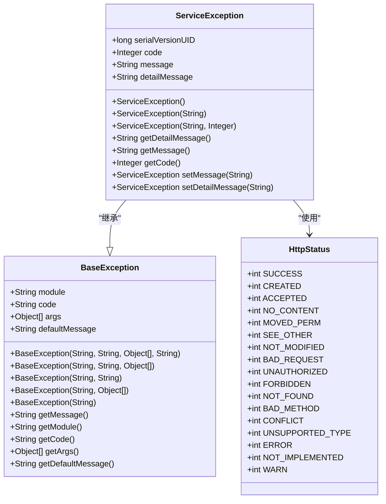
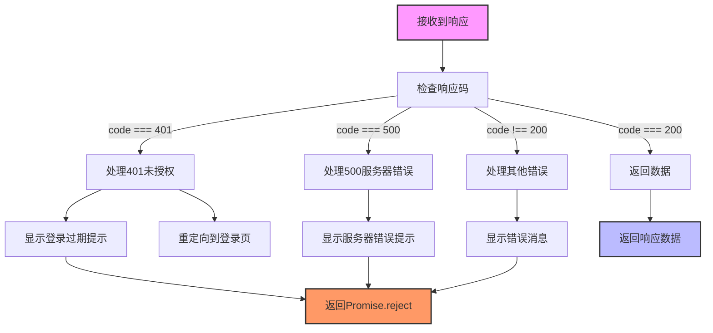
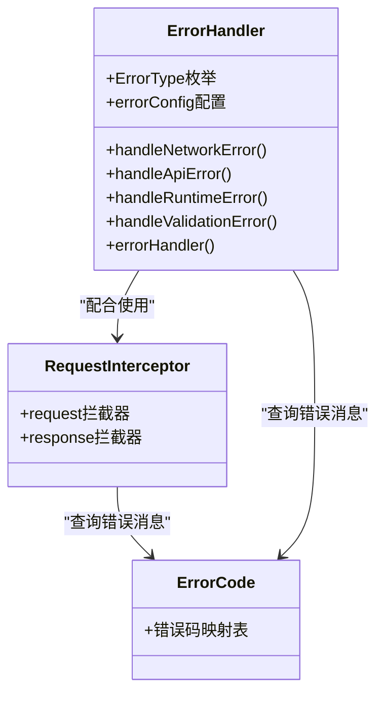
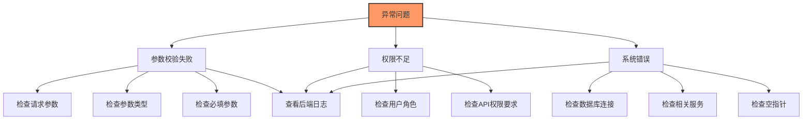

# 异常处理机制

<cite>
**本文档引用文件**   
- [GlobalExceptionHandler.java](file://bearjia-admin-backend/src/main/java/com/javaxiaobear/base/framework/web/exception/GlobalExceptionHandler.java)
- [ServiceException.java](file://bearjia-admin-backend/src/main/java/com/javaxiaobear/base/common/exception/ServiceException.java)
- [AjaxResult.java](file://bearjia-admin-backend/src/main/java/com/javaxiaobear/base/framework/web/domain/AjaxResult.java)
- [HttpStatus.java](file://bearjia-admin-backend/src/main/java/com/javaxiaobear/base/common/constant/HttpStatus.java)
- [AuthenticationEntryPointImpl.java](file://bearjia-admin-backend/src/main/java/com/javaxiaobear/base/framework/security/handle/AuthenticationEntryPointImpl.java)
- [LogAspect.java](file://bearjia-admin-backend/src/main/java/com/javaxiaobear/base/framework/aspectj/LogAspect.java)
- [request.js](file://bear-jia-vue3/src/utils/request.js)
- [errorHandler.js](file://bear-jia-vue3/src/plugins/errorHandler.js)
- [errorCode.js](file://bear-jia-vue3/src/utils/errorCode.js)
</cite>

## 目录
1. [简介](#简介)
2. [全局异常处理器实现原理](#全局异常处理器实现原理)
3. [各类异常处理策略](#各类异常处理策略)
4. [异常捕获优先级与RestControllerAdvice机制](#异常捕获优先级与restcontrolleradvice机制)
5. [自定义业务异常处理流程](#自定义业务异常处理流程)
6. [前端异常响应解析与友好提示](#前端异常响应解析与友好提示)
7. [常见异常场景排查指南](#常见异常场景排查指南)
8. [自定义异常处理器扩展最佳实践](#自定义异常处理器扩展最佳实践)
9. [总结](#总结)

## 简介
本系统采用Spring Boot框架构建的后端服务，实现了完善的异常处理机制。通过`@RestControllerAdvice`注解实现全局异常处理，统一处理系统中各类异常，确保API响应格式的一致性。异常处理机制涵盖了权限校验、请求方式、业务逻辑、参数验证等多个方面，同时与前端进行良好的配合，为用户提供友好的错误提示。

**Section sources**
- [GlobalExceptionHandler.java](file://bearjia-admin-backend/src/main/java/com/javaxiaobear/base/framework/web/exception/GlobalExceptionHandler.java)

## 全局异常处理器实现原理
系统通过`GlobalExceptionHandler`类实现全局异常处理，该类使用`@RestControllerAdvice`注解，使其能够拦截整个应用程序中抛出的异常。当控制器方法抛出异常时，Spring会根据异常类型匹配相应的`@ExceptionHandler`方法，并执行对应的异常处理逻辑。

`GlobalExceptionHandler`类中的每个`@ExceptionHandler`方法都针对特定类型的异常进行处理，如`AccessDeniedException`、`HttpRequestMethodNotSupportedException`、`ServiceException`等。这些方法接收异常对象和HTTP请求作为参数，记录错误日志，并返回标准化的错误响应。



**Diagram sources **
- [GlobalExceptionHandler.java](file://bearjia-admin-backend/src/main/java/com/javaxiaobear/base/framework/web/exception/GlobalExceptionHandler.java)
- [AjaxResult.java](file://bearjia-admin-backend/src/main/java/com/javaxiaobear/base/framework/web/domain/AjaxResult.java)
- [ServiceException.java](file://bearjia-admin-backend/src/main/java/com/javaxiaobear/base/common/exception/ServiceException.java)

**Section sources**
- [GlobalExceptionHandler.java](file://bearjia-admin-backend/src/main/java/com/javaxiaobear/base/framework/web/exception/GlobalExceptionHandler.java)

## 各类异常处理策略
系统针对不同类型的异常提供了专门的处理策略，确保每种异常都能得到恰当的处理。

### 权限校验异常处理
当用户访问需要特定权限的资源但未获得授权时，系统会抛出`AccessDeniedException`。`GlobalExceptionHandler`中的`handleAccessDeniedException`方法会捕获此异常，记录错误日志，并返回403状态码和"没有权限，请联系管理员授权"的提示信息。

### 请求方式不支持异常处理
当客户端使用不支持的HTTP方法访问某个端点时，会抛出`HttpRequestMethodNotSupportedException`。系统会捕获此异常，记录请求地址和不支持的请求方法，并返回相应的错误信息。

### 业务异常处理
`ServiceException`是系统自定义的业务异常类，用于处理业务逻辑中的各种错误情况。当抛出`ServiceException`时，系统会检查异常对象中的错误码，如果有定义错误码，则使用该错误码和错误消息构建响应；否则仅使用错误消息构建响应。

### 参数验证异常处理
系统使用`BindException`和`MethodArgumentNotValidException`来处理参数验证失败的情况。当请求参数不符合验证规则时，会抛出这些异常。系统会提取第一个错误的默认消息，并将其作为错误提示返回给客户端。

### 系统异常处理
对于未预期的运行时异常和普通异常，系统提供了兜底的处理策略。`handleRuntimeException`方法处理所有`RuntimeException`及其子类，而`handleException`方法作为最后的防线，处理所有其他类型的异常。



**Diagram sources **
- [GlobalExceptionHandler.java](file://bearjia-admin-backend/src/main/java/com/javaxiaobear/base/framework/web/exception/GlobalExceptionHandler.java)

**Section sources**
- [GlobalExceptionHandler.java](file://bearjia-admin-backend/src/main/java/com/javaxiaobear/base/framework/web/exception/GlobalExceptionHandler.java)

## 异常捕获优先级与RestControllerAdvice机制
Spring的异常处理机制遵循特定的优先级规则。当一个异常被抛出时，Spring会按照从具体到一般的顺序查找匹配的`@ExceptionHandler`方法。

`@RestControllerAdvice`是一个组合注解，它结合了`@ControllerAdvice`和`@ResponseBody`的功能。`@ControllerAdvice`使得该类能够应用于所有控制器，而`@ResponseBody`确保返回值会被直接写入响应体，而不是解析为视图名称。

异常捕获的优先级顺序如下：
1. 最具体的异常类型优先
2. 继承层次中更具体的子类优先
3. 没有继承关系的异常按声明顺序
4. 最后是通用的Exception处理

例如，当抛出`ServiceException`时，即使`handleException(Exception e)`方法也能处理，但Spring会优先选择更具体的`handleServiceException(ServiceException e)`方法。



**Diagram sources **
- [GlobalExceptionHandler.java](file://bearjia-admin-backend/src/main/java/com/javaxiaobear/base/framework/web/exception/GlobalExceptionHandler.java)

**Section sources**
- [GlobalExceptionHandler.java](file://bearjia-admin-backend/src/main/java/com/javaxiaobear/base/framework/web/exception/GlobalExceptionHandler.java)

## 自定义业务异常处理流程
系统通过`ServiceException`类实现自定义业务异常处理。该异常类继承自`RuntimeException`，包含错误码、错误消息和详细信息等属性。

### ServiceException类结构
`ServiceException`类提供了多个构造函数，支持不同的使用场景：
- 无参构造函数：用于反序列化
- 单字符串参数构造函数：只设置错误消息
- 字符串和整数参数构造函数：设置错误消息和错误码

### 错误码和消息传递
当业务逻辑中需要抛出异常时，可以创建`ServiceException`实例并指定错误码和消息。例如：
```java
throw new ServiceException("用户不存在", 1001);
```

在`GlobalExceptionHandler`中，`handleServiceException`方法会检查异常对象的错误码，如果有定义错误码，则使用该错误码构建响应；否则使用默认的500错误码。

### 异常抛出与处理示例
在业务逻辑中，可以通过以下方式抛出业务异常：
```java
if (user == null) {
    throw new ServiceException("用户不存在", 1001);
}
```

前端接收到响应后，可以根据错误码显示相应的提示信息，实现错误信息的国际化和统一管理。



**Diagram sources **
- [ServiceException.java](file://bearjia-admin-backend/src/main/java/com/javaxiaobear/base/common/exception/ServiceException.java)
- [BaseException.java](file://bearjia-admin-backend/src/main/java/com/javaxiaobear/base/common/exception/base/BaseException.java)
- [HttpStatus.java](file://bearjia-admin-backend/src/main/java/com/javaxiaobear/base/common/constant/HttpStatus.java)

**Section sources**
- [ServiceException.java](file://bearjia-admin-backend/src/main/java/com/javaxiaobear/base/common/exception/ServiceException.java)

## 前端异常响应解析与友好提示
前端通过axios拦截器和全局错误处理插件实现对后端异常响应的解析和用户友好提示。

### 响应拦截器处理
前端在`request.js`中配置了响应拦截器，用于处理后端返回的异常响应。拦截器会检查响应数据中的`code`字段，根据不同的状态码执行相应的处理逻辑：



**Diagram sources **
- [request.js](file://bear-jia-vue3/src/utils/request.js)

### 全局错误处理插件
系统提供了`errorHandler.js`插件，用于处理不同类型的前端错误，包括网络错误、API错误、运行时错误和验证错误。该插件通过Vue的`errorHandler`配置和`unhandledrejection`事件监听器捕获各种错误。

### 错误码映射
前端通过`errorCode.js`文件维护错误码与错误消息的映射关系，实现错误消息的集中管理。当后端返回未定义的错误码时，使用默认的错误消息。



**Diagram sources **
- [errorHandler.js](file://bear-jia-vue3/src/plugins/errorHandler.js)
- [request.js](file://bear-jia-vue3/src/utils/request.js)
- [errorCode.js](file://bear-jia-vue3/src/utils/errorCode.js)

**Section sources**
- [request.js](file://bear-jia-vue3/src/utils/request.js)
- [errorHandler.js](file://bear-jia-vue3/src/plugins/errorHandler.js)
- [errorCode.js](file://bear-jia-vue3/src/utils/errorCode.js)

## 常见异常场景排查指南
### 参数校验失败
**现象**：前端收到400错误或参数验证错误提示
**排查步骤**：
1. 检查请求参数是否符合API文档要求
2. 检查参数类型是否正确（如字符串、数字、布尔值）
3. 检查必填参数是否缺失
4. 查看后端日志中的具体错误信息

**解决方案**：
- 确保前端表单验证与后端验证规则一致
- 使用`@Valid`注解标记需要验证的参数
- 在DTO类中使用JSR-303验证注解（如`@NotBlank`、`@Size`等）

### 权限不足
**现象**：前端收到403错误或"没有权限"提示
**排查步骤**：
1. 检查当前用户角色和权限
2. 检查访问的API是否需要特殊权限
3. 查看后端日志中的请求地址和权限校验失败信息

**解决方案**：
- 确认用户已被授予相应角色
- 检查控制器方法上的权限注解（如`@PreAuthorize`）
- 联系管理员分配所需权限

### 系统错误
**现象**：前端收到500错误或"操作失败"提示
**排查步骤**：
1. 查看后端应用日志，定位具体错误堆栈
2. 检查数据库连接是否正常
3. 检查相关服务是否可用
4. 检查是否有空指针异常或数据访问异常

**解决方案**：
- 根据日志信息修复代码逻辑错误
- 确保数据库连接配置正确
- 添加适当的空值检查和异常处理
- 使用事务管理确保数据一致性



**Section sources**
- [GlobalExceptionHandler.java](file://bearjia-admin-backend/src/main/java/com/javaxiaobear/base/framework/web/exception/GlobalExceptionHandler.java)
- [LogAspect.java](file://bearjia-admin-backend/src/main/java/com/javaxiaobear/base/framework/aspectj/LogAspect.java)

## 自定义异常处理器扩展最佳实践
### 创建新的异常类型
当需要处理特定业务场景的异常时，可以创建新的异常类。建议遵循以下原则：
1. 继承`ServiceException`或`BaseException`
2. 提供有意义的异常名称
3. 包含必要的异常信息字段
4. 提供适当的构造函数

### 添加新的异常处理器
在`GlobalExceptionHandler`中添加新的`@ExceptionHandler`方法：
```java
@ExceptionHandler(CustomBusinessException.class)
public AjaxResult handleCustomBusinessException(CustomBusinessException e, HttpServletRequest request) {
    log.error("自定义业务异常: {}", e.getMessage(), e);
    return AjaxResult.error(e.getCode(), e.getMessage());
}
```

### 异常处理最佳实践
1. **日志记录**：在处理异常时记录详细的错误信息，包括请求地址、异常消息和堆栈跟踪
2. **用户友好**：向用户返回易于理解的错误消息，避免暴露系统内部细节
3. **安全考虑**：不要在错误消息中泄露敏感信息，如数据库结构、文件路径等
4. **一致性**：保持异常响应格式的一致性，便于前端统一处理
5. **监控告警**：对于严重的系统错误，应触发监控告警，及时通知开发人员

### 异常处理扩展示例
```java
// 自定义文件上传异常
public class FileUploadException extends ServiceException {
    private String fileName;
    private long fileSize;
    
    public FileUploadException(String message, String fileName, long fileSize) {
        super(message);
        this.fileName = fileName;
        this.fileSize = fileSize;
    }
    
    // getter和setter方法
}

// 在GlobalExceptionHandler中添加处理方法
@ExceptionHandler(FileUploadException.class)
public AjaxResult handleFileUploadException(FileUploadException e, HttpServletRequest request) {
    log.error("文件上传失败: 文件名={}, 大小={} bytes, 原因={}", e.getFileName(), e.getFileSize(), e.getMessage());
    return AjaxResult.error(2001, "文件上传失败: " + e.getMessage());
}
```

**Section sources**
- [GlobalExceptionHandler.java](file://bearjia-admin-backend/src/main/java/com/javaxiaobear/base/framework/web/exception/GlobalExceptionHandler.java)
- [ServiceException.java](file://bearjia-admin-backend/src/main/java/com/javaxiaobear/base/common/exception/ServiceException.java)

## 总结
本系统的异常处理机制通过`@RestControllerAdvice`实现了全局异常处理，统一处理各类异常，确保API响应的一致性。后端通过`GlobalExceptionHandler`对不同类型的异常进行精细化处理，前端通过拦截器和错误处理插件实现友好的用户提示。整个异常处理体系具有良好的扩展性，支持自定义异常类型和处理逻辑，为系统的稳定运行提供了有力保障。

**Section sources**
- [GlobalExceptionHandler.java](file://bearjia-admin-backend/src/main/java/com/javaxiaobear/base/framework/web/exception/GlobalExceptionHandler.java)