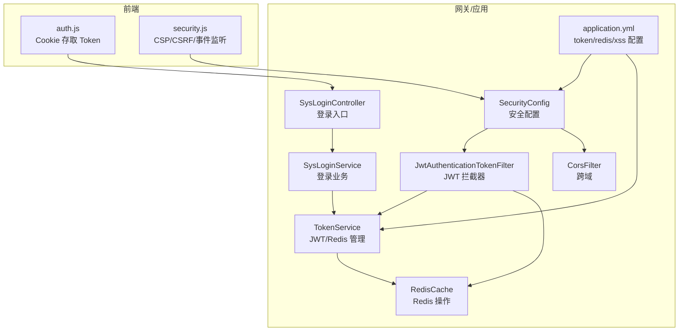
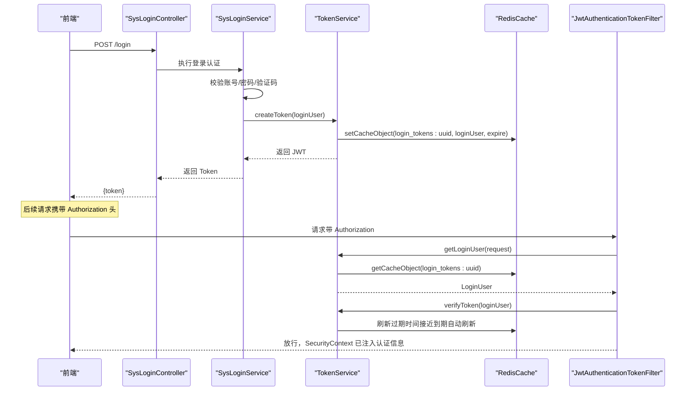
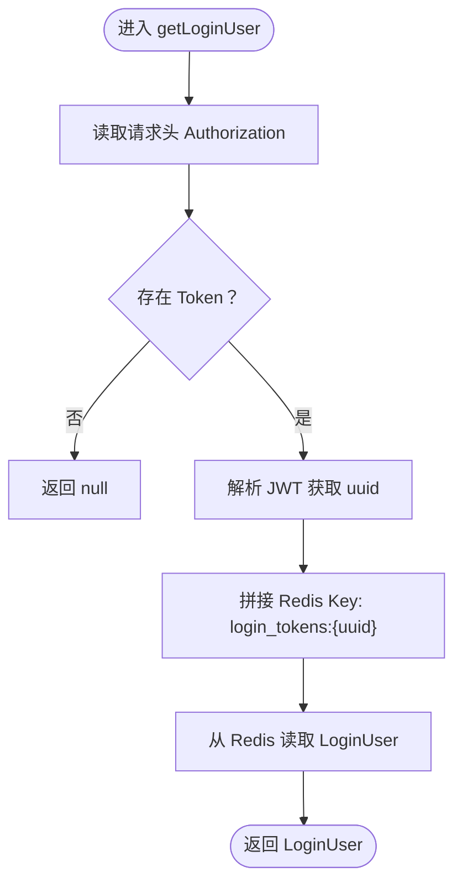
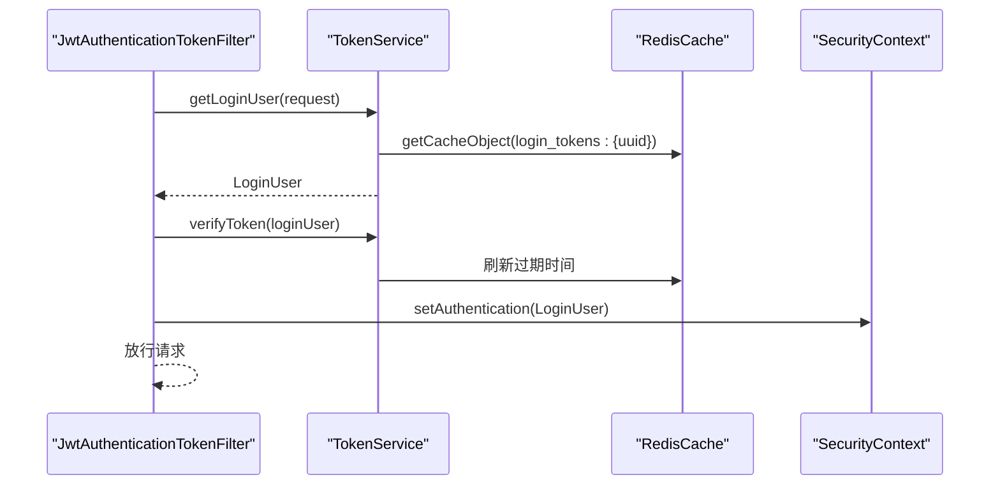
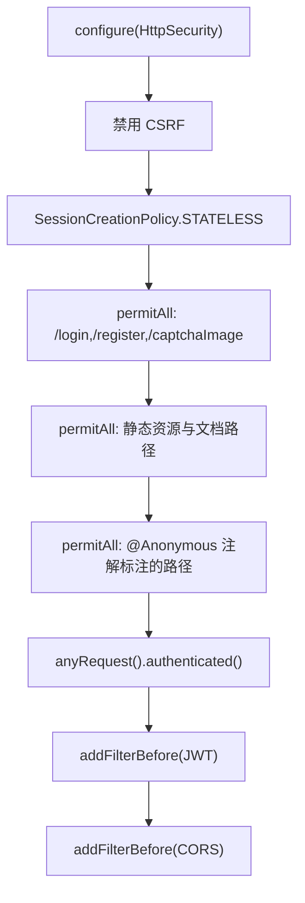
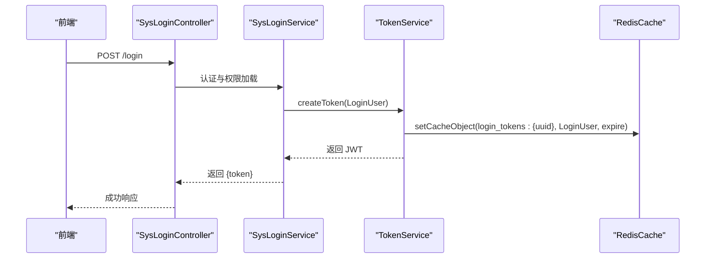
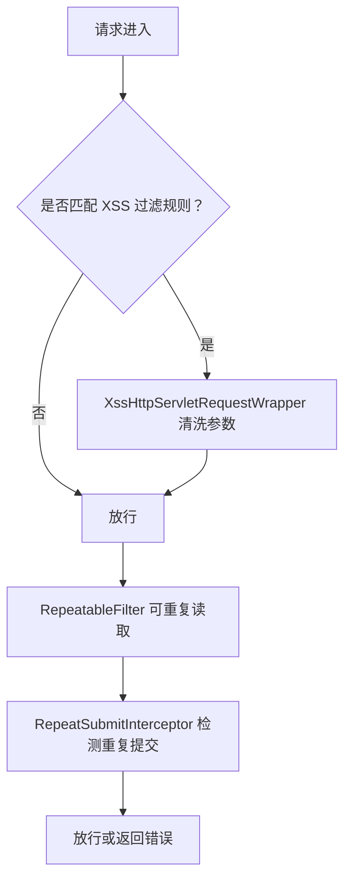
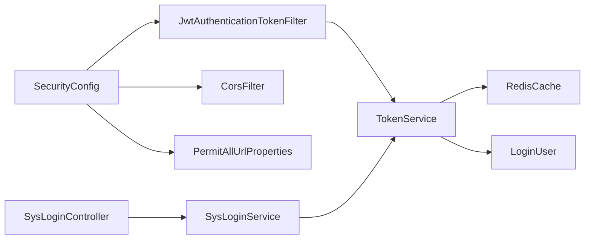

# 接口安全机制

<cite>
**本文引用的文件**
- [SecurityConfig.java](file://bearjia-admin-backend/src/main/java/com/javaxiaobear/base/framework/config/SecurityConfig.java)
- [JwtAuthenticationTokenFilter.java](file://bearjia-admin-backend/src/main/java/com/javaxiaobear/base/framework/security/filter/JwtAuthenticationTokenFilter.java)
- [TokenService.java](file://bearjia-admin-backend/src/main/java/com/javaxiaobear/base/framework/security/service/TokenService.java)
- [RedisCache.java](file://bearjia-admin-backend/src/main/java/com/javaxiaobear/base/framework/redis/RedisCache.java)
- [SysLoginController.java](file://bearjia-admin-backend/src/main/java/com/javaxiaobear/module/system/controller/SysLoginController.java)
- [SysLoginService.java](file://bearjia-admin-backend/src/main/java/com/javaxiaobear/base/framework/security/service/SysLoginService.java)
- [LoginUser.java](file://bearjia-admin-backend/src/main/java/com/javaxiaobear/base/framework/security/LoginUser.java)
- [FilterConfig.java](file://bearjia-admin-backend/src/main/java/com/javaxiaobear/base/framework/config/FilterConfig.java)
- [XssFilter.java](file://bearjia-admin-backend/src/main/java/com/javaxiaobear/base/common/filter/XssFilter.java)
- [XssHttpServletRequestWrapper.java](file://bearjia-admin-backend/src/main/java/com/javaxiaobear/base/common/filter/XssHttpServletRequestWrapper.java)
- [RepeatableFilter.java](file://bearjia-admin-backend/src/main/java/com/javaxiaobear/base/common/filter/RepeatableFilter.java)
- [RepeatSubmitInterceptor.java](file://bearjia-admin-backend/src/main/java/com/javaxiaobear/base/framework/interceptor/RepeatSubmitInterceptor.java)
- [application.yml](file://bearjia-admin-backend/src/main/resources/application.yml)
- [CacheConstants.java](file://bearjia-admin-backend/src/main/java/com/javaxiaobear/base/common/constant/CacheConstants.java)
- [CacheController.java](file://bearjia-admin-backend/src/main/java/com/javaxiaobear/module/monitor/controller/CacheController.java)
- [SysUserOnlineController.java](file://bearjia-admin-backend/src/main/java/com/javaxiaobear/module/monitor/controller/SysUserOnlineController.java)
- [auth.js](file://bearjia-admin-backend/src/main/resources/application.yml)
- [auth.js](file://bearjia-jia-vue3/src/utils/auth.js)
- [security.js](file://bearjia-jia-vue3/src/utils/security.js)
</cite>

## 目录
1. [简介](#简介)
2. [项目结构](#项目结构)
3. [核心组件](#核心组件)
4. [架构总览](#架构总览)
5. [详细组件分析](#详细组件分析)
6. [依赖关系分析](#依赖关系分析)
7. [性能考量](#性能考量)
8. [故障排查指南](#故障排查指南)
9. [结论](#结论)
10. [附录](#附录)

## 简介
本文件面向后端接口安全机制，围绕基于 JWT 的认证授权体系进行系统性说明。重点覆盖以下方面：
- TokenService 如何生成、解析与刷新 JWT 令牌，并与 Redis 缓存协同工作
- JwtAuthenticationTokenFilter 拦截器如何实现请求的自动鉴权
- SecurityConfig 中的安全配置，包括放行路径、权限控制与会话策略
- 登录流程中 Token 的发放机制与有效期管理
- 接口防重复提交、XSS 过滤等安全防护措施
- 安全漏洞防范建议（令牌泄露防护、暴力破解防御等）
- 第三方系统对接时的安全集成方案

## 项目结构
后端采用 Spring Security + JWT + Redis 的组合实现无状态认证。前端通过 Cookie 存储 Token 并在每次请求头中携带 Authorization 字段传递给后端。

图表来源
- [SecurityConfig.java](file://bearjia-admin-backend/src/main/java/com/javaxiaobear/base/framework/config/SecurityConfig.java#L95-L129)
- [JwtAuthenticationTokenFilter.java](file://bearjia-admin-backend/src/main/java/com/javaxiaobear/base/framework/security/filter/JwtAuthenticationTokenFilter.java#L1-L44)
- [TokenService.java](file://bearjia-admin-backend/src/main/java/com/javaxiaobear/base/framework/security/service/TokenService.java#L114-L124)
- [RedisCache.java](file://bearjia-admin-backend/src/main/java/com/javaxiaobear/base/framework/redis/RedisCache.java#L34-L50)
- [application.yml](file://bearjia-admin-backend/src/main/resources/application.yml#L92-L124)

章节来源
- [SecurityConfig.java](file://bearjia-admin-backend/src/main/java/com/javaxiaobear/base/framework/config/SecurityConfig.java#L95-L129)
- [application.yml](file://bearjia-admin-backend/src/main/resources/application.yml#L92-L124)

## 核心组件
- TokenService：负责 JWT 令牌的生成、解析、刷新与用户信息缓存；同时维护 Redis 中的登录用户对象。
- JwtAuthenticationTokenFilter：在每个请求进入时，从请求头提取 JWT，解析出用户标识，从 Redis 取回用户信息并注入到 Spring Security 上下文。
- SecurityConfig：定义放行路径、禁用 CSRF、设置无状态会话、添加 JWT 与 CORS 过滤器链。
- SysLoginController/SysLoginService：登录入口与业务，完成认证后调用 TokenService 生成并返回 Token。
- RedisCache：封装 Redis 操作，支撑 TokenService 的缓存读写。
- XSS/重复提交过滤器：在请求到达控制器前进行输入清洗与重复提交防护。

章节来源
- [TokenService.java](file://bearjia-admin-backend/src/main/java/com/javaxiaobear/base/framework/security/service/TokenService.java#L62-L83)
- [JwtAuthenticationTokenFilter.java](file://bearjia-admin-backend/src/main/java/com/javaxiaobear/base/framework/security/filter/JwtAuthenticationTokenFilter.java#L30-L44)
- [SecurityConfig.java](file://bearjia-admin-backend/src/main/java/com/javaxiaobear/base/framework/config/SecurityConfig.java#L95-L129)
- [SysLoginController.java](file://bearjia-admin-backend/src/main/java/com/javaxiaobear/module/system/controller/SysLoginController.java#L38-L42)
- [SysLoginService.java](file://bearjia-admin-backend/src/main/java/com/javaxiaobear/base/framework/security/service/SysLoginService.java#L90-L101)
- [RedisCache.java](file://bearjia-admin-backend/src/main/java/com/javaxiaobear/base/framework/redis/RedisCache.java#L34-L50)

## 架构总览
下面以序列图展示一次典型登录与后续请求鉴权流程。

图表来源
- [SysLoginController.java](file://bearjia-admin-backend/src/main/java/com/javaxiaobear/module/system/controller/SysLoginController.java#L38-L42)
- [SysLoginService.java](file://bearjia-admin-backend/src/main/java/com/javaxiaobear/base/framework/security/service/SysLoginService.java#L90-L101)
- [TokenService.java](file://bearjia-admin-backend/src/main/java/com/javaxiaobear/base/framework/security/service/TokenService.java#L114-L124)
- [TokenService.java](file://bearjia-admin-backend/src/main/java/com/javaxiaobear/base/framework/security/service/TokenService.java#L147-L154)
- [JwtAuthenticationTokenFilter.java](file://bearjia-admin-backend/src/main/java/com/javaxiaobear/base/framework/security/filter/JwtAuthenticationTokenFilter.java#L30-L44)

## 详细组件分析

### TokenService：JWT 生成、解析与刷新
- 令牌生成
  - 生成唯一 token 标识并写入 LoginUser
  - 将 LoginUser 以 login_tokens:{uuid} 为 key 写入 Redis，并设置过期时间
  - 构造 JWT，将 uuid 作为自定义声明放入 payload
- 令牌解析
  - 从请求头读取 Authorization，去除前缀后解析 JWT
  - 从 payload 中取出 uuid，拼接 Redis key，从 Redis 读取 LoginUser
- 令牌刷新
  - 当距离过期时间小于阈值时，自动刷新 LoginUser 的过期时间
- 用户代理信息
  - 记录 IP、浏览器、操作系统等信息，便于审计与风控

图表来源
- [TokenService.java](file://bearjia-admin-backend/src/main/java/com/javaxiaobear/base/framework/security/service/TokenService.java#L62-L83)
- [TokenService.java](file://bearjia-admin-backend/src/main/java/com/javaxiaobear/base/framework/security/service/TokenService.java#L147-L154)
- [CacheConstants.java](file://bearjia-admin-backend/src/main/java/com/javaxiaobear/base/common/constant/CacheConstants.java#L10-L14)

章节来源
- [TokenService.java](file://bearjia-admin-backend/src/main/java/com/javaxiaobear/base/framework/security/service/TokenService.java#L62-L83)
- [TokenService.java](file://bearjia-admin-backend/src/main/java/com/javaxiaobear/base/framework/security/service/TokenService.java#L114-L124)
- [TokenService.java](file://bearjia-admin-backend/src/main/java/com/javaxiaobear/base/framework/security/service/TokenService.java#L147-L154)
- [TokenService.java](file://bearjia-admin-backend/src/main/java/com/javaxiaobear/base/framework/security/service/TokenService.java#L211-L231)
- [CacheConstants.java](file://bearjia-admin-backend/src/main/java/com/javaxiaobear/base/common/constant/CacheConstants.java#L10-L14)

### JwtAuthenticationTokenFilter：请求自动鉴权
- 每次请求进入时，尝试从请求头解析 JWT，获取 LoginUser
- 若上下文中尚未存在认证信息，则将 LoginUser 注入 SecurityContext
- 在请求放行前完成认证注入，后续控制器可基于 @PreAuthorize/@Secured 等注解进行权限控制

图表来源
- [JwtAuthenticationTokenFilter.java](file://bearjia-admin-backend/src/main/java/com/javaxiaobear/base/framework/security/filter/JwtAuthenticationTokenFilter.java#L30-L44)
- [TokenService.java](file://bearjia-admin-backend/src/main/java/com/javaxiaobear/base/framework/security/service/TokenService.java#L132-L140)
- [RedisCache.java](file://bearjia-admin-backend/src/main/java/com/javaxiaobear/base/framework/redis/RedisCache.java#L34-L50)

章节来源
- [JwtAuthenticationTokenFilter.java](file://bearjia-admin-backend/src/main/java/com/javaxiaobear/base/framework/security/filter/JwtAuthenticationTokenFilter.java#L30-L44)

### SecurityConfig：安全配置与放行路径
- 禁用 CSRF，启用无状态会话（STATELESS）
- 允许匿名访问的路径：登录、注册、验证码、静态资源、Swagger/Druid 等
- 注解驱动的匿名放行：通过 PermitAllUrlProperties 扫描控制器/方法上的 @Anonymous 注解
- 添加 JWT 与 CORS 过滤器，确保在用户名密码过滤器之前执行

图表来源
- [SecurityConfig.java](file://bearjia-admin-backend/src/main/java/com/javaxiaobear/base/framework/config/SecurityConfig.java#L95-L129)
- [PermitAllUrlProperties.java](file://bearjia-admin-backend/src/main/java/com/javaxiaobear/base/framework/config/properties/PermitAllUrlProperties.java#L38-L65)

章节来源
- [SecurityConfig.java](file://bearjia-admin-backend/src/main/java/com/javaxiaobear/base/framework/config/SecurityConfig.java#L95-L129)
- [PermitAllUrlProperties.java](file://bearjia-admin-backend/src/main/java/com/javaxiaobear/base/framework/config/properties/PermitAllUrlProperties.java#L38-L65)

### 登录流程与 Token 发放机制
- 登录入口由 SysLoginController 提供，接收用户名/密码/验证码等参数
- SysLoginService 完成认证与权限加载，随后调用 TokenService.createToken 生成 JWT
- TokenService 将 LoginUser 写入 Redis，并返回 JWT 字符串
- 前端通过 Cookie 存储 Token，后续请求在 Authorization 头中携带

图表来源
- [SysLoginController.java](file://bearjia-admin-backend/src/main/java/com/javaxiaobear/module/system/controller/SysLoginController.java#L38-L42)
- [SysLoginService.java](file://bearjia-admin-backend/src/main/java/com/javaxiaobear/base/framework/security/service/SysLoginService.java#L90-L101)
- [TokenService.java](file://bearjia-admin-backend/src/main/java/com/javaxiaobear/base/framework/security/service/TokenService.java#L114-L124)
- [RedisCache.java](file://bearjia-admin-backend/src/main/java/com/javaxiaobear/base/framework/redis/RedisCache.java#L34-L50)

章节来源
- [SysLoginController.java](file://bearjia-admin-backend/src/main/java/com/javaxiaobear/module/system/controller/SysLoginController.java#L38-L42)
- [SysLoginService.java](file://bearjia-admin-backend/src/main/java/com/javaxiaobear/base/framework/security/service/SysLoginService.java#L90-L101)
- [TokenService.java](file://bearjia-admin-backend/src/main/java/com/javaxiaobear/base/framework/security/service/TokenService.java#L114-L124)

### XSS 过滤与重复提交防护
- XSS 过滤
  - FilterConfig 条件注册 XssFilter，按配置的 urlPatterns 与 excludes 生效
  - XssFilter 使用 XssHttpServletRequestWrapper 对参数值进行清洗与去空白
- 重复提交防护
  - RepeatableFilter：对 JSON 请求体进行可重复读取包装，避免流被消费后无法再次读取
  - RepeatSubmitInterceptor：基于方法上的 @RepeatSubmit 注解进行重复提交检测，命中则返回错误

图表来源
- [FilterConfig.java](file://bearjia-admin-backend/src/main/java/com/javaxiaobear/base/framework/config/FilterConfig.java#L30-L58)
- [XssFilter.java](file://bearjia-admin-backend/src/main/java/com/javaxiaobear/base/common/filter/XssFilter.java#L22-L46)
- [XssHttpServletRequestWrapper.java](file://bearjia-admin-backend/src/main/java/com/javaxiaobear/base/common/filter/XssHttpServletRequestWrapper.java#L20-L46)
- [RepeatableFilter.java](file://bearjia-admin-backend/src/main/java/com/javaxiaobear/base/common/filter/RepeatableFilter.java#L19-L52)
- [RepeatSubmitInterceptor.java](file://bearjia-admin-backend/src/main/java/com/javaxiaobear/base/framework/interceptor/RepeatSubmitInterceptor.java#L1-L34)

章节来源
- [FilterConfig.java](file://bearjia-admin-backend/src/main/java/com/javaxiaobear/base/framework/config/FilterConfig.java#L30-L58)
- [XssFilter.java](file://bearjia-admin-backend/src/main/java/com/javaxiaobear/base/common/filter/XssFilter.java#L22-L46)
- [XssHttpServletRequestWrapper.java](file://bearjia-admin-backend/src/main/java/com/javaxiaobear/base/common/filter/XssHttpServletRequestWrapper.java#L20-L46)
- [RepeatableFilter.java](file://bearjia-admin-backend/src/main/java/com/javaxiaobear/base/common/filter/RepeatableFilter.java#L19-L52)
- [RepeatSubmitInterceptor.java](file://bearjia-admin-backend/src/main/java/com/javaxiaobear/base/framework/interceptor/RepeatSubmitInterceptor.java#L1-L34)

### 前端 Token 存储与安全
- 前端使用 Cookie 存储 Token，避免明文存储在 localStorage
- security.js 提供 CSP、CSRF Token 管理、点击劫持防护等前端安全能力
- auth.js 提供 Token 的读取/设置/移除

章节来源
- [auth.js](file://bearjia-jia-vue3/src/utils/auth.js#L1-L15)
- [security.js](file://bearjia-jia-vue3/src/utils/security.js#L224-L243)

## 依赖关系分析
- 组件耦合
  - SecurityConfig 依赖 JwtAuthenticationTokenFilter、CorsFilter、PermitAllUrlProperties
  - JwtAuthenticationTokenFilter 依赖 TokenService
  - TokenService 依赖 RedisCache、LoginUser、配置项（token.header/token.secret/token.expireTime）
  - SysLoginController 依赖 SysLoginService
  - SysLoginService 依赖 TokenService 与验证码/配置等
- 外部依赖
  - Redis：用于 LoginUser 缓存与在线用户统计
  - JWT：用于无状态认证
  - Spring Security：提供认证失败处理、注销处理、方法级权限控制

图表来源
- [SecurityConfig.java](file://bearjia-admin-backend/src/main/java/com/javaxiaobear/base/framework/config/SecurityConfig.java#L95-L129)
- [JwtAuthenticationTokenFilter.java](file://bearjia-admin-backend/src/main/java/com/javaxiaobear/base/framework/security/filter/JwtAuthenticationTokenFilter.java#L24-L44)
- [TokenService.java](file://bearjia-admin-backend/src/main/java/com/javaxiaobear/base/framework/security/service/TokenService.java#L1-L56)
- [RedisCache.java](file://bearjia-admin-backend/src/main/java/com/javaxiaobear/base/framework/redis/RedisCache.java#L1-L33)
- [SysLoginController.java](file://bearjia-admin-backend/src/main/java/com/javaxiaobear/module/system/controller/SysLoginController.java#L25-L42)
- [SysLoginService.java](file://bearjia-admin-backend/src/main/java/com/javaxiaobear/base/framework/security/service/SysLoginService.java#L90-L101)

章节来源
- [SecurityConfig.java](file://bearjia-admin-backend/src/main/java/com/javaxiaobear/base/framework/config/SecurityConfig.java#L95-L129)
- [TokenService.java](file://bearjia-admin-backend/src/main/java/com/javaxiaobear/base/framework/security/service/TokenService.java#L1-L56)

## 性能考量
- 令牌解析与 Redis 访问
  - getLoginUser 仅做一次 Redis 读取，复杂度 O(1)，性能稳定
  - verifyToken 在接近过期时刷新，避免频繁重建用户对象
- 令牌有效期
  - 默认 30 分钟，结合“即将到期自动刷新”策略，减少频繁登录
- Redis 序列化
  - RedisCache 使用字符串键与通用值序列化，适合 LoginUser 缓存场景
- XSS/重复提交过滤
  - 仅对匹配的 URL 模式生效，避免对所有请求造成额外开销

章节来源
- [TokenService.java](file://bearjia-admin-backend/src/main/java/com/javaxiaobear/base/framework/security/service/TokenService.java#L132-L140)
- [TokenService.java](file://bearjia-admin-backend/src/main/java/com/javaxiaobear/base/framework/security/service/TokenService.java#L147-L154)
- [application.yml](file://bearjia-admin-backend/src/main/resources/application.yml#L92-L100)
- [FilterConfig.java](file://bearjia-admin-backend/src/main/java/com/javaxiaobear/base/framework/config/FilterConfig.java#L30-L58)

## 故障排查指南
- 无法登录或频繁掉线
  - 检查 token.expireTime 与 Redis 过期时间是否一致
  - 确认前端 Authorization 头是否正确携带，且未包含多余前缀
  - 查看 Redis 中 login_tokens:* 是否存在
- 认证失败
  - 检查 token.secret 是否与前端/后端一致
  - 确认 SecurityConfig 中是否正确添加了 JwtAuthenticationTokenFilter
- XSS 过滤误伤
  - 调整 xss.excludes 与 xss.urlPatterns，确保关键接口不过滤
- 重复提交误判
  - 检查 @RepeatSubmit 注解配置与业务幂等设计

章节来源
- [application.yml](file://bearjia-admin-backend/src/main/resources/application.yml#L92-L124)
- [CacheConstants.java](file://bearjia-admin-backend/src/main/java/com/javaxiaobear/base/common/constant/CacheConstants.java#L10-L14)
- [JwtAuthenticationTokenFilter.java](file://bearjia-admin-backend/src/main/java/com/javaxiaobear/base/framework/security/filter/JwtAuthenticationTokenFilter.java#L30-L44)
- [FilterConfig.java](file://bearjia-admin-backend/src/main/java/com/javaxiaobear/base/framework/config/FilterConfig.java#L30-L58)
- [RepeatSubmitInterceptor.java](file://bearjia-admin-backend/src/main/java/com/javaxiaobear/base/framework/interceptor/RepeatSubmitInterceptor.java#L1-L34)

## 结论
本项目通过 Spring Security + JWT + Redis 实现了高可用、低耦合的无状态认证体系。TokenService 将用户信息持久化至 Redis，配合 JwtAuthenticationTokenFilter 实现透明鉴权；SecurityConfig 明确放行路径与权限策略；XSS 与重复提交过滤器进一步强化了接口安全。建议在生产环境中：
- 使用更强的 token.secret 并通过环境变量注入
- 合理设置 token.expireTime 与刷新阈值
- 结合限流、登录失败锁定策略抵御暴力破解
- 前端完善 CSP、CSRF 与敏感信息掩码

## 附录

### 安全配置要点
- token 配置
  - token.header：请求头字段名
  - token.secret：签名密钥
  - token.expireTime：分钟
- Redis 配置
  - host/port/password/database/timeout/pool
- XSS 配置
  - xss.enabled：开关
  - xss.excludes：排除列表
  - xss.urlPatterns：生效模式

章节来源
- [application.yml](file://bearjia-admin-backend/src/main/resources/application.yml#L92-L124)

### 在线用户与缓存监控
- 通过 CacheController 与 SysUserOnlineController 可查看 login_tokens:* 等缓存键的分布与数量，辅助定位问题

章节来源
- [CacheController.java](file://bearjia-admin-backend/src/main/java/com/javaxiaobear/module/monitor/controller/CacheController.java#L33-L61)
- [SysUserOnlineController.java](file://bearjia-admin-backend/src/main/java/com/javaxiaobear/module/monitor/controller/SysUserOnlineController.java#L41-L63)