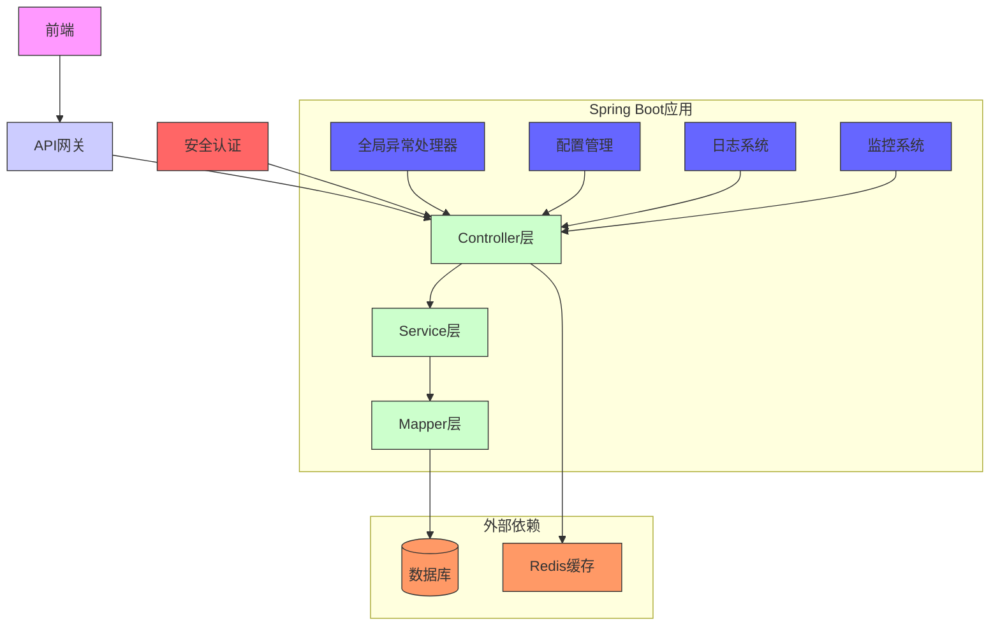

# 后端架构

<cite>
**本文档引用的文件**
- [JavaXiaoBearApplication.java](file://bearjia-admin-backend\src\main\java\com\javaxiaobear\JavaXiaoBearApplication.java)
- [application.yml](file://bearjia-admin-backend\src\main\resources\application.yml)
- [SecurityConfig.java](file://bearjia-admin-backend\src\main\java\com\javaxiaobear\base\framework\config\SecurityConfig.java)
- [MyBatisConfig.java](file://bearjia-admin-backend\src\main\java\com\javaxiaobear\base\framework\config\MyBatisConfig.java)
- [RedisConfig.java](file://bearjia-admin-backend\src\main\java\com\javaxiaobear\base\framework\config\RedisConfig.java)
- [DruidConfig.java](file://bearjia-admin-backend\src\main\java\com\javaxiaobear\base\framework\config\DruidConfig.java)
- [JwtAuthenticationTokenFilter.java](file://bearjia-admin-backend\src\main\java\com\javaxiaobear\base\framework\security\filter\JwtAuthenticationTokenFilter.java)
- [SysLoginController.java](file://bearjia-admin-backend\src\main\java\com\javaxiaobear\module\system\controller\SysLoginController.java)
- [BaseController.java](file://bearjia-admin-backend\src\main\java\com\javaxiaobear\base\framework\web\controller\BaseController.java)
- [GlobalExceptionHandler.java](file://bearjia-admin-backend\src\main\java\com\javaxiaobear\base\framework\web\exception\GlobalExceptionHandler.java)
- [pom.xml](file://bearjia-admin-backend\pom.xml)
- [mybatis-config.xml](file://bearjia-admin-backend\src\main\resources\mybatis\mybatis-config.xml)
</cite>

## 目录
1. [项目结构](#项目结构)
2. [分层架构设计](#分层架构设计)
3. [Spring Boot自动配置机制](#spring-boot自动配置机制)
4. [安全架构](#安全架构)
5. [数据访问层设计](#数据访问层设计)
6. [缓存机制](#缓存机制)
7. [异常处理机制](#异常处理机制)
8. [配置管理](#配置管理)
9. [系统架构图](#系统架构图)

## 项目结构

项目采用标准的Maven多模块结构，后端服务位于`bearjia-admin-backend`模块中。核心目录结构包括：
- `src/main/java/com/javaxiaobear`：Java源代码根目录
- `src/main/resources`：资源配置文件目录
- `src/main/resources/mybatis`：MyBatis映射文件目录
- `src/main/resources/sql`：SQL脚本目录
- `src/main/resources/vm`：Velocity模板目录

**文档来源**
- [pom.xml](file://bearjia-admin-backend\pom.xml)

## 分层架构设计

项目采用典型的Spring Boot分层架构，各层职责划分清晰：

### Controller层
位于`module/system/controller`等包中，负责处理HTTP请求，接收前端参数，调用Service层处理业务逻辑，并返回响应结果。所有Controller类均使用`@RestController`注解标记。

### Service层
位于`module/system/service`等包中，包含业务逻辑处理，分为接口定义和实现类。接口定义在`ISys*Service.java`文件中，实现类位于`impl`包下。Service层负责协调多个Mapper操作，实现复杂的业务流程。

### Mapper层
位于`module/system/mapper`等包中，使用MyBatis框架实现数据访问。Mapper接口定义数据库操作方法，通过XML映射文件或注解方式实现SQL语句。

### Domain层
位于`module/system/domain`等包中，包含实体类（Entity）、数据传输对象（DTO）和值对象（VO），用于在各层之间传递数据。

**文档来源**
- [SysLoginController.java](file://bearjia-admin-backend\src\main\java\com\javaxiaobear\module\system\controller\SysLoginController.java)
- [BaseController.java](file://bearjia-admin-backend\src\main\java\com\javaxiaobear\base\framework\web\controller\BaseController.java)

## Spring Boot自动配置机制

项目通过Spring Boot的自动配置机制集成多个关键组件：

### MyBatis集成
通过`MyBatisConfig`类配置MyBatis，主要配置包括：
- 扫描`com.javaxiaobear.module.**.domain`包下的实体类作为类型别名
- 加载`classpath*:mybatis/**/*Mapper.xml`路径下的所有映射文件
- 使用`mybatis-config.xml`作为全局配置文件

### Druid集成
通过`DruidConfig`类配置Druid数据库连接池，支持主从数据源配置。配置中还包含去除Druid监控页面广告的过滤器。

### Redis集成
通过`RedisConfig`类配置Redis，使用`FastJson2JsonRedisSerializer`作为序列化器，配置了StringRedisSerializer用于key的序列化。

**文档来源**
- [MyBatisConfig.java](file://bearjia-admin-backend\src\main\java\com\javaxiaobear\base\framework\config\MyBatisConfig.java)
- [DruidConfig.java](file://bearjia-admin-backend\src\main\java\com\javaxiaobear\base\framework\config\DruidConfig.java)
- [RedisConfig.java](file://bearjia-admin-backend\src\main\java\com\javaxiaobear\base\framework\config\RedisConfig.java)

## 安全架构

项目采用Spring Security框架实现全面的安全控制：

### Spring Security配置
`SecurityConfig`类配置了Spring Security的核心功能：
- 启用全局方法安全控制（`@EnableGlobalMethodSecurity`）
- 禁用CSRF保护（因使用JWT无状态认证）
- 配置无状态会话管理（`STATELESS`）
- 设置匿名访问路径（登录、注册、验证码等）
- 添加JWT认证过滤器和CORS过滤器

### JWT认证流程
1. 用户通过`/login`接口提交用户名密码
2. `SysLoginService`验证用户信息并生成JWT令牌
3. 客户端在后续请求中携带令牌（默认在Authorization头中）
4. `JwtAuthenticationTokenFilter`过滤器拦截请求，验证令牌有效性
5. 验证通过后，将用户信息存入Spring Security上下文中

### 权限控制实现
通过Spring Security的`prePostEnabled`和`securedEnabled`注解实现方法级别的权限控制。`SysPermissionService`负责获取用户的角色和权限集合。

### 登录拦截器
`JwtAuthenticationTokenFilter`作为核心拦截器，继承`OncePerRequestFilter`，确保每个请求只被过滤一次。它从请求中提取JWT令牌，验证其有效性，并将认证信息存入安全上下文。

**文档来源**
- [SecurityConfig.java](file://bearjia-admin-backend\src\main\java\com\javaxiaobear\base\framework\config\SecurityConfig.java)
- [JwtAuthenticationTokenFilter.java](file://bearjia-admin-backend\src\main\java\com\javaxiaobear\base\framework\security\filter\JwtAuthenticationTokenFilter.java)
- [SysLoginController.java](file://bearjia-admin-backend\src\main\java\com\javaxiaobear\module\system\controller\SysLoginController.java)

## 数据访问层设计

项目采用MyBatis作为持久层框架，实现方式如下：

### Mapper接口与XML映射
Mapper接口定义数据访问方法，如`SysUserMapper`中的`selectUserById`方法。对应的SQL语句在`mybatis/system/SysUserMapper.xml`文件中定义，通过`namespace`与接口关联。

### 动态数据源
通过`DynamicDataSource`类实现动态数据源切换，支持主从数据库配置。`DataSourceAspect`切面根据注解实现数据源的动态切换。

### 分页插件
集成PageHelper分页插件，在`application.yml`中配置`helperDialect: mysql`，在Controller中调用`startPage()`方法即可实现分页。

**文档来源**
- [MyBatisConfig.java](file://bearjia-admin-backend\src\main\java\com\javaxiaobear\base\framework\config\MyBatisConfig.java)
- [mybatis-config.xml](file://bearjia-admin-backend\src\main\resources\mybatis\mybatis-config.xml)

## 缓存机制

项目使用Redis作为主要缓存解决方案：

### Redis使用场景
- 用户会话信息缓存
- 系统配置信息缓存
- 验证码缓存
- 接口限流计数器
- 数据字典缓存

### 数据结构选择
- String类型：用于存储简单的键值对，如验证码、用户会话
- Hash类型：用于存储对象，如用户信息
- List类型：用于存储有序数据
- Set类型：用于存储无序唯一数据
- ZSet类型：用于存储有序唯一数据

### 序列化配置
使用`FastJson2JsonRedisSerializer`进行JSON序列化，保证对象的完整性和可读性。StringRedisSerializer用于key的序列化，确保key的可读性。

**文档来源**
- [RedisConfig.java](file://bearjia-admin-backend\src\main\java\com\javaxiaobear\base\framework\config\RedisConfig.java)
- [application.yml](file://bearjia-admin-backend\src\main\resources\application.yml)

## 异常处理机制

项目采用全局异常处理机制，提高系统的健壮性和用户体验：

### 全局异常处理器
`GlobalExceptionHandler`类使用`@RestControllerAdvice`注解，统一处理所有Controller层的异常。支持多种异常类型的处理：
- `AccessDeniedException`：权限不足异常
- `HttpRequestMethodNotSupportedException`：请求方法不支持
- `ServiceException`：业务异常
- `BindException`：参数绑定异常
- `RuntimeException`：运行时异常
- `Exception`：其他未捕获异常

### 统一响应格式
所有异常处理都返回`AjaxResult`对象，包含状态码、消息和数据，确保前端能够统一处理各种异常情况。

**文档来源**
- [GlobalExceptionHandler.java](file://bearjia-admin-backend\src\main\java\com\javaxiaobear\base\framework\web\exception\GlobalExceptionHandler.java)
- [BaseController.java](file://bearjia-admin-backend\src\main\java\com\javaxiaobear\base\framework\web\controller\BaseController.java)

## 配置管理

项目通过`application.yml`文件进行集中配置管理：

### 核心配置项
- `server.port`：服务端口，当前配置为8081
- `spring.redis`：Redis连接配置，包括host、port、database等
- `token.secret`：JWT密钥，支持通过环境变量JWT_SECRET覆盖
- `mybatis.typeAliasesPackage`：MyBatis类型别名包路径
- `pagehelper.helperDialect`：分页插件数据库方言

### 环境变量支持
多个配置项支持通过环境变量覆盖，如：
- `UPLOAD_PATH`：文件上传路径
- `JWT_SECRET`：JWT密钥
- `MYSQL_HOST`、`MYSQL_PORT`等数据库连接信息

### 多环境配置
通过`spring.profiles.active: druid`指定激活的配置文件，支持不同环境下的配置切换。

**文档来源**
- [application.yml](file://bearjia-admin-backend\src\main\resources\application.yml)

## 系统架构图

**图示来源**
- [JavaXiaoBearApplication.java](file://bearjia-admin-backend\src\main\java\com\javaxiaobear\JavaXiaoBearApplication.java)
- [application.yml](file://bearjia-admin-backend\src\main\resources\application.yml)