# 安全机制

<cite>
**本文档引用的文件**   
- [SecurityConfig.java](file://bearjia-admin-backend\src\main\java\com\javaxiaobear\base\framework\config\SecurityConfig.java)
- [JwtAuthenticationTokenFilter.java](file://bearjia-admin-backend\src\main\java\com\javaxiaobear\base\framework\security\filter\JwtAuthenticationTokenFilter.java)
- [TokenService.java](file://bearjia-admin-backend\src\main\java\com\javaxiaobear\base\framework\security\service\TokenService.java)
- [SysPermissionService.java](file://bearjia-admin-backend\src\main\java\com\javaxiaobear\base\framework\security\service\SysPermissionService.java)
- [PermissionService.java](file://bearjia-admin-backend\src\main\java\com\javaxiaobear\base\framework\security\service\PermissionService.java)
- [DataScope.java](file://bearjia-admin-backend\src\main\java\com\javaxiaobear\base\framework\aspectj\lang\annotation\DataScope.java)
- [DataScopeAspect.java](file://bearjia-admin-backend\src\main\java\com\javaxiaobear\base\framework\aspectj\DataScopeAspect.java)
- [SysLoginController.java](file://bearjia-admin-backend\src\main\java\com\javaxiaobear\module\system\controller\SysLoginController.java)
- [LoginUser.java](file://bearjia-admin-backend\src\main\java\com\javaxiaobear\base\framework\security\LoginUser.java)
- [GlobalExceptionHandler.java](file://bearjia-admin-backend\src\main\java\com\javaxiaobear\base\framework\web\exception\GlobalExceptionHandler.java)
- [FilterConfig.java](file://bearjia-admin-backend\src\main\java\com\javaxiaobear\base\framework\config\FilterConfig.java)
- [XssFilter.java](file://bearjia-admin-backend\src\main\java\com\javaxiaobear\base\common\filter\XssFilter.java)
- [RepeatableFilter.java](file://bearjia-admin-backend\src\main\java\com\javaxiaobear\base\common\filter\RepeatableFilter.java)
- [security.js](file://bear-jia-vue3\src\utils\security.js)
</cite>

## 目录
1. [安全架构概述](#安全架构概述)
2. [认证与授权机制](#认证与授权机制)
3. [JWT认证流程](#jwt认证流程)
4. [基于角色的访问控制(RBAC)](#基于角色的访问控制rbac)
5. [数据范围过滤](#数据范围过滤)
6. [安全防护措施](#安全防护措施)
7. [全局异常处理](#全局异常处理)
8. [安全组件协作关系](#安全组件协作关系)

## 安全架构概述

本系统采用Spring Security框架实现全面的安全控制，结合JWT（JSON Web Token）实现无状态认证，通过RBAC（基于角色的访问控制）模型管理用户权限。系统安全架构分为认证、授权、数据过滤和安全防护四个主要部分。

**Section sources**
- [SecurityConfig.java](file://bearjia-admin-backend\src\main\java\com\javaxiaobear\base\framework\config\SecurityConfig.java#L1-L148)

## 认证与授权机制

系统采用Spring Security框架实现认证与授权功能，通过自定义配置实现JWT令牌认证。`SecurityConfig`类配置了全局方法安全，启用`@PreAuthorize`注解支持，实现了基于表达式的访问控制。

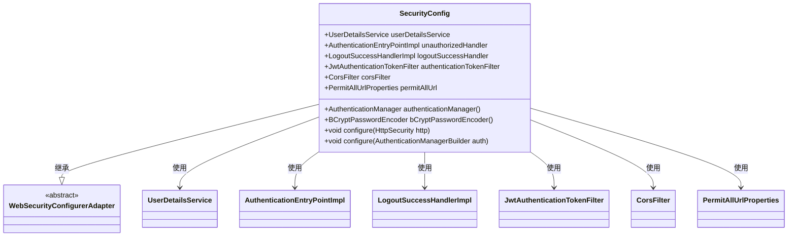

**Diagram sources **
- [SecurityConfig.java](file://bearjia-admin-backend\src\main\java\com\javaxiaobear\base\framework\config\SecurityConfig.java#L1-L148)

**Section sources**
- [SecurityConfig.java](file://bearjia-admin-backend\src\main\java\com\javaxiaobear\base\framework\config\SecurityConfig.java#L1-L148)

## JWT认证流程

JWT认证流程包括令牌生成、验证和刷新机制。系统通过`TokenService`类管理JWT令牌的整个生命周期，包括创建、验证和刷新操作。

### 令牌生成与验证

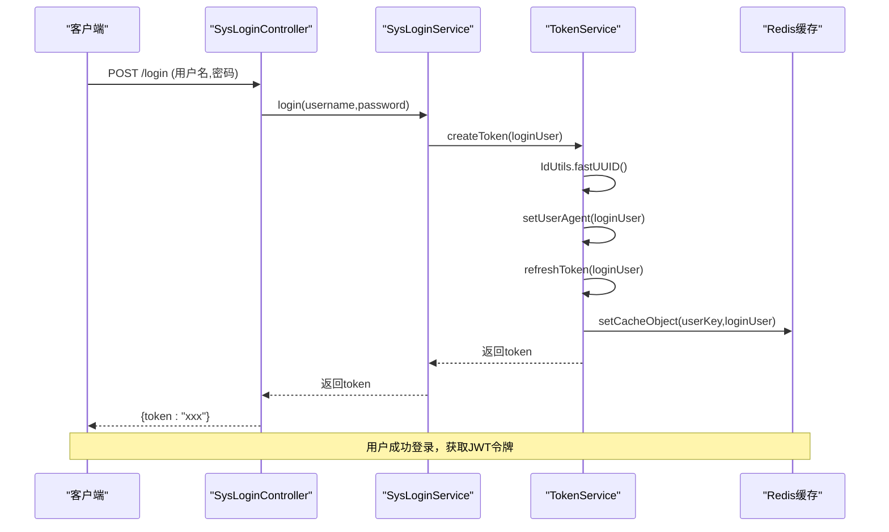

**Diagram sources **
- [SysLoginController.java](file://bearjia-admin-backend\src\main\java\com\javaxiaobear\module\system\controller\SysLoginController.java#L1-L87)
- [TokenService.java](file://bearjia-admin-backend\src\main\java\com\javaxiaobear\base\framework\security\service\TokenService.java#L1-L232)

### JWT过滤器实现

`JwtAuthenticationTokenFilter`是核心的JWT认证过滤器，负责在每次请求时验证令牌的有效性，并将用户信息设置到Spring Security上下文中。

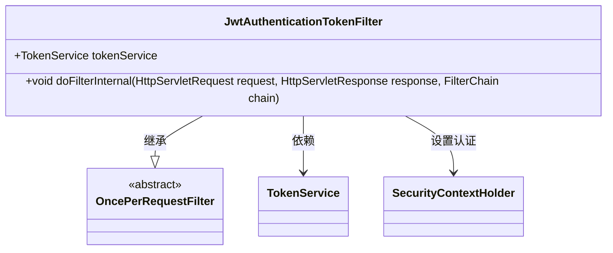

**Diagram sources **
- [JwtAuthenticationTokenFilter.java](file://bearjia-admin-backend\src\main\java\com\javaxiaobear\base\framework\security\filter\JwtAuthenticationTokenFilter.java#L1-L44)
- [TokenService.java](file://bearjia-admin-backend\src\main\java\com\javaxiaobear\base\framework\security\service\TokenService.java#L1-L232)

**Section sources**
- [JwtAuthenticationTokenFilter.java](file://bearjia-admin-backend\src\main\java\com\javaxiaobear\base\framework\security\filter\JwtAuthenticationTokenFilter.java#L1-L44)
- [TokenService.java](file://bearjia-admin-backend\src\main\java\com\javaxiaobear\base\framework\security\service\TokenService.java#L1-L232)

## 基于角色的访问控制(RBAC)

系统采用RBAC模型实现细粒度的权限控制，通过`PermissionService`和`SysPermissionService`类计算用户的权限集合。

### 权限服务实现

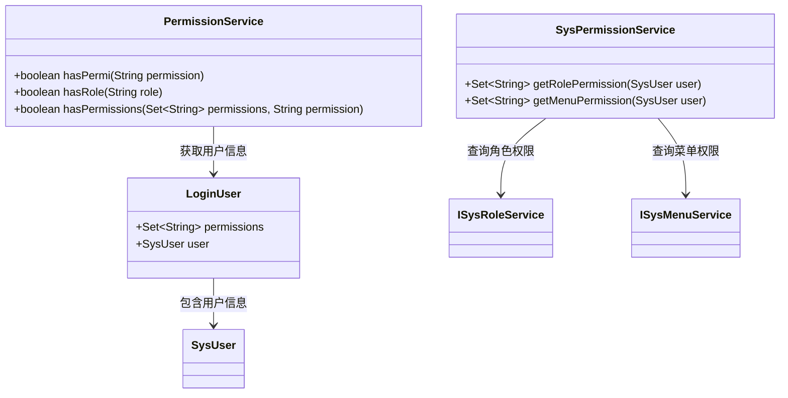

**Diagram sources **
- [PermissionService.java](file://bearjia-admin-backend\src\main\java\com\javaxiaobear\base\framework\security\service\PermissionService.java#L1-L42)
- [SysPermissionService.java](file://bearjia-admin-backend\src\main\java\com\javaxiaobear\base\framework\security\service\SysPermissionService.java#L1-L52)
- [LoginUser.java](file://bearjia-admin-backend\src\main\java\com\javaxiaobear\base\framework\security\LoginUser.java#L1-L267)

### 控制器权限检查

在控制器方法上使用`@PreAuthorize`注解进行权限检查，通过`@ss.hasPermi`表达式调用`PermissionService`的权限验证方法。

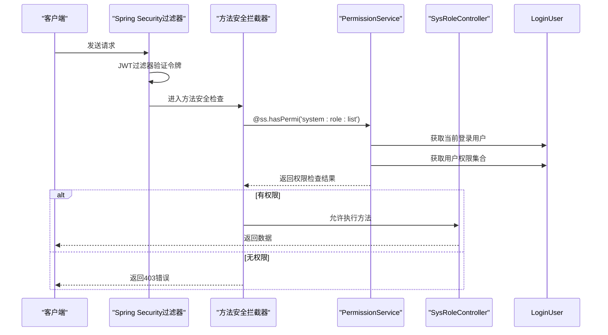

**Diagram sources **
- [SysRoleController.java](file://bearjia-admin-backend\src\main\java\com\javaxiaobear\module\system\controller\SysRoleController.java#L23-L64)
- [PermissionService.java](file://bearjia-admin-backend\src\main\java\com\javaxiaobear\base\framework\security\service\PermissionService.java#L1-L42)

**Section sources**
- [PermissionService.java](file://bearjia-admin-backend\src\main\java\com\javaxiaobear\base\framework\security\service\PermissionService.java#L1-L42)
- [SysPermissionService.java](file://bearjia-admin-backend\src\main\java\com\javaxiaobear\base\framework\security\service\SysPermissionService.java#L1-L52)

## 数据范围过滤

系统通过`DataScope`注解和AOP切面实现数据范围过滤，动态修改SQL查询条件以实现基于角色的数据权限控制。

### DataScope注解定义

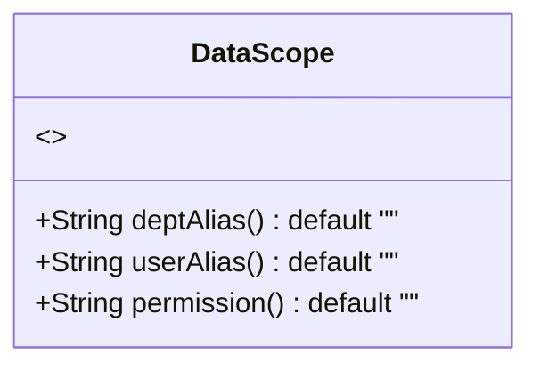

**Diagram sources **
- [DataScope.java](file://bearjia-admin-backend\src\main\java\com\javaxiaobear\base\framework\aspectj\lang\annotation\DataScope.java#L1-L33)

### 数据范围过滤实现

`DataScopeAspect`切面在方法执行前处理`DataScope`注解，根据用户角色和权限动态构建SQL过滤条件。

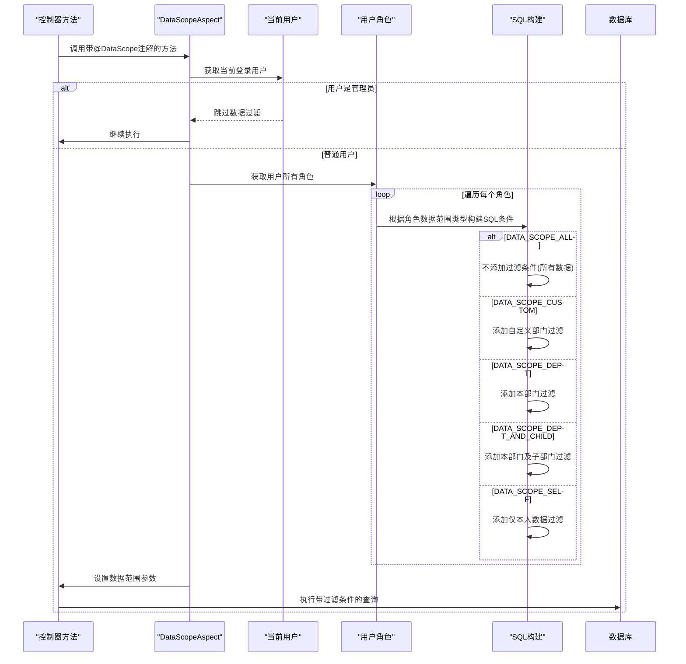

**Diagram sources **
- [DataScopeAspect.java](file://bearjia-admin-backend\src\main\java\com\javaxiaobear\base\framework\aspectj\DataScopeAspect.java#L1-L174)
- [DataScope.java](file://bearjia-admin-backend\src\main\java\com\javaxiaobear\base\framework\aspectj\lang\annotation\DataScope.java#L1-L33)

**Section sources**
- [DataScope.java](file://bearjia-admin-backend\src\main\java\com\javaxiaobear\base\framework\aspectj\lang\annotation\DataScope.java#L1-L33)
- [DataScopeAspect.java](file://bearjia-admin-backend\src\main\java\com\javaxiaobear\base\framework\aspectj\DataScopeAspect.java#L1-L174)

## 安全防护措施

系统实现了多种安全防护措施，包括XSS防护、CSRF防护、重复提交防护等，通过过滤器链在请求处理的各个阶段进行安全检查。

### XSS防护实现

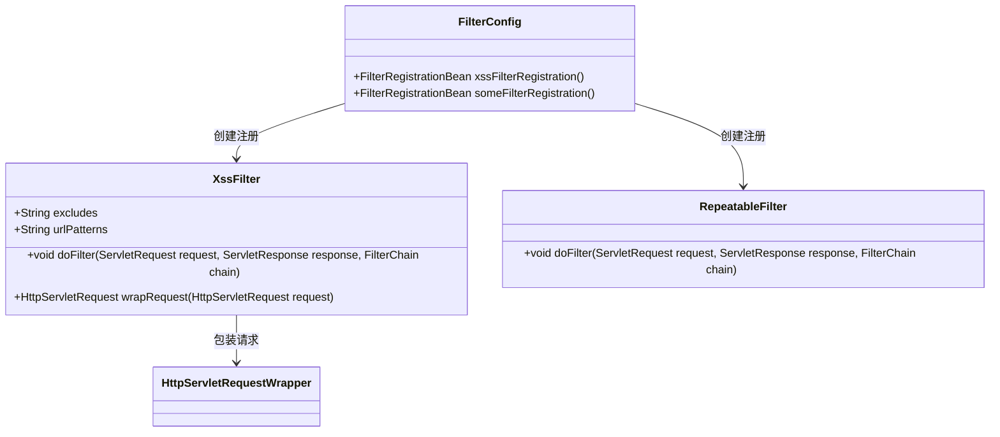

**Diagram sources **
- [XssFilter.java](file://bearjia-admin-backend\src\main\java\com\javaxiaobear\base\common\filter\XssFilter.java)
- [RepeatableFilter.java](file://bearjia-admin-backend\src\main\java\com\javaxiaobear\base\common\filter\RepeatableFilter.java)
- [FilterConfig.java](file://bearjia-admin-backend\src\main\java\com\javaxiaobear\base\framework\config\FilterConfig.java#L1-L59)

### 前端安全实现

前端通过`security.js`工具类实现CSRF令牌管理和内容安全策略。

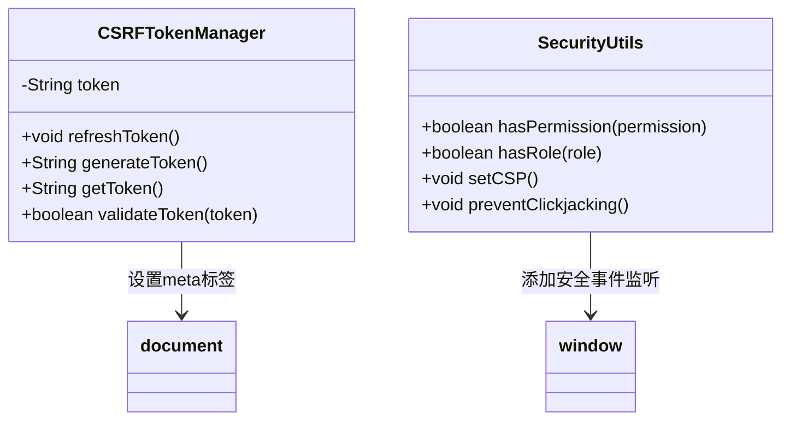

**Diagram sources **
- [security.js](file://bear-jia-vue3\src\utils\security.js#L83-L243)

**Section sources**
- [XssFilter.java](file://bearjia-admin-backend\src\main\java\com\javaxiaobear\base\common\filter\XssFilter.java)
- [RepeatableFilter.java](file://bearjia-admin-backend\src\main\java\com\javaxiaobear\base\common\filter\RepeatableFilter.java)
- [FilterConfig.java](file://bearjia-admin-backend\src\main\java\com\javaxiaobear\base\framework\config\FilterConfig.java#L1-L59)
- [security.js](file://bear-jia-vue3\src\utils\security.js#L83-L243)

## 全局异常处理

系统通过`GlobalExceptionHandler`类统一处理安全相关的异常，提供一致的错误响应格式。

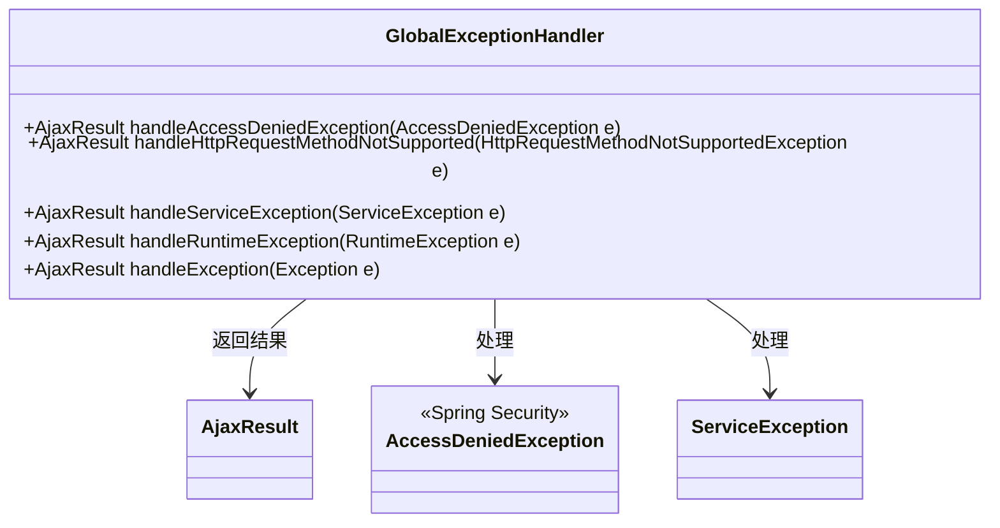

**Diagram sources **
- [GlobalExceptionHandler.java](file://bearjia-admin-backend\src\main\java\com\javaxiaobear\base\framework\web\exception\GlobalExceptionHandler.java#L1-L131)

**Section sources**
- [GlobalExceptionHandler.java](file://bearjia-admin-backend\src\main\java\com\javaxiaobear\base\framework\web\exception\GlobalExceptionHandler.java#L1-L131)

## 安全组件协作关系

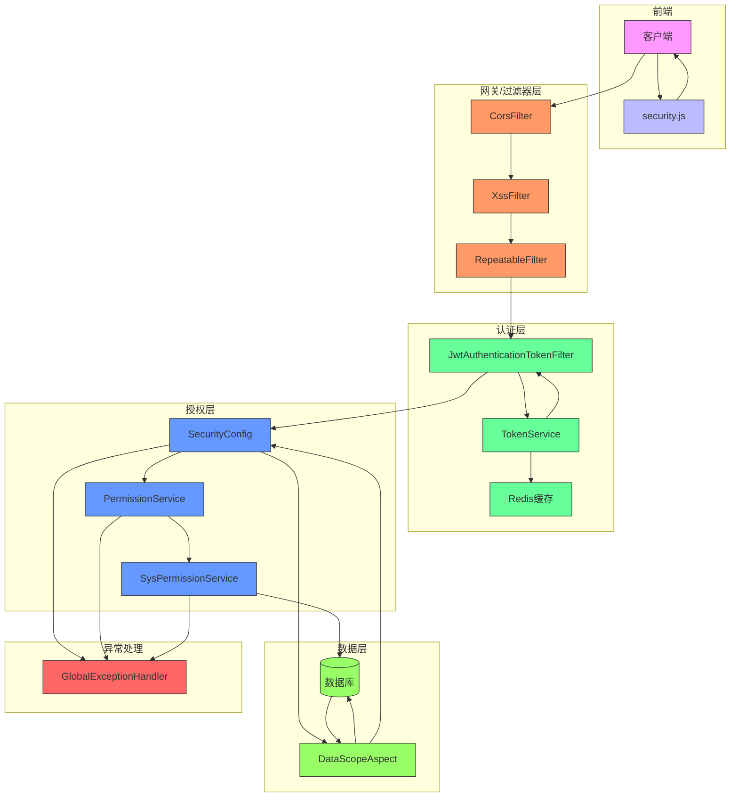

**Diagram sources **
- [SecurityConfig.java](file://bearjia-admin-backend\src\main\java\com\javaxiaobear\base\framework\config\SecurityConfig.java#L1-L148)
- [JwtAuthenticationTokenFilter.java](file://bearjia-admin-backend\src\main\java\com\javaxiaobear\base\framework\security\filter\JwtAuthenticationTokenFilter.java#L1-L44)
- [TokenService.java](file://bearjia-admin-backend\src\main\java\com\javaxiaobear\base\framework\security\service\TokenService.java#L1-L232)
- [PermissionService.java](file://bearjia-admin-backend\src\main\java\com\javaxiaobear\base\framework\security\service\PermissionService.java#L1-L42)
- [SysPermissionService.java](file://bearjia-admin-backend\src\main\java\com\javaxiaobear\base\framework\security\service\SysPermissionService.java#L1-L52)
- [DataScopeAspect.java](file://bearjia-admin-backend\src\main\java\com\javaxiaobear\base\framework\aspectj\DataScopeAspect.java#L1-L174)
- [GlobalExceptionHandler.java](file://bearjia-admin-backend\src\main\java\com\javaxiaobear\base\framework\web\exception\GlobalExceptionHandler.java#L1-L131)