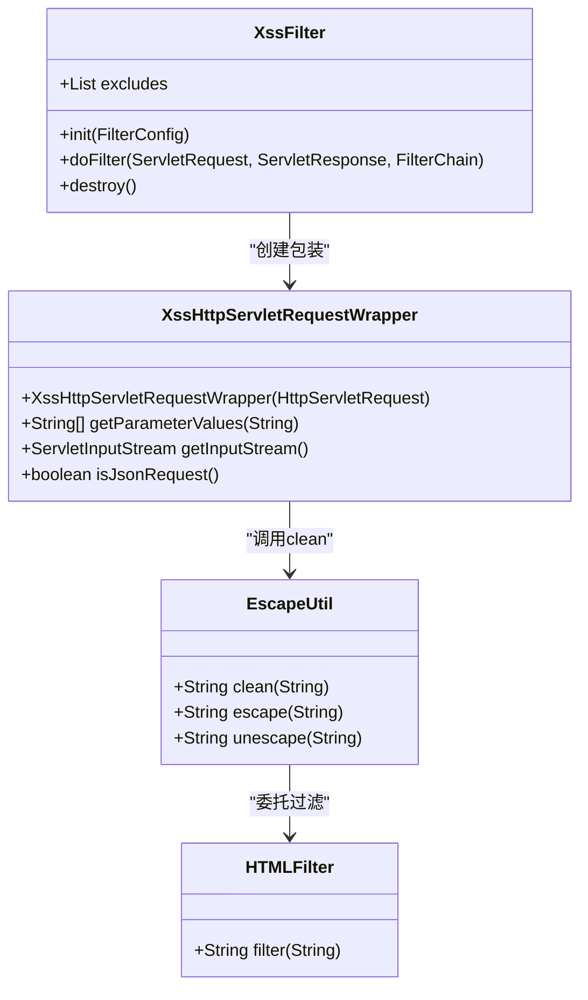
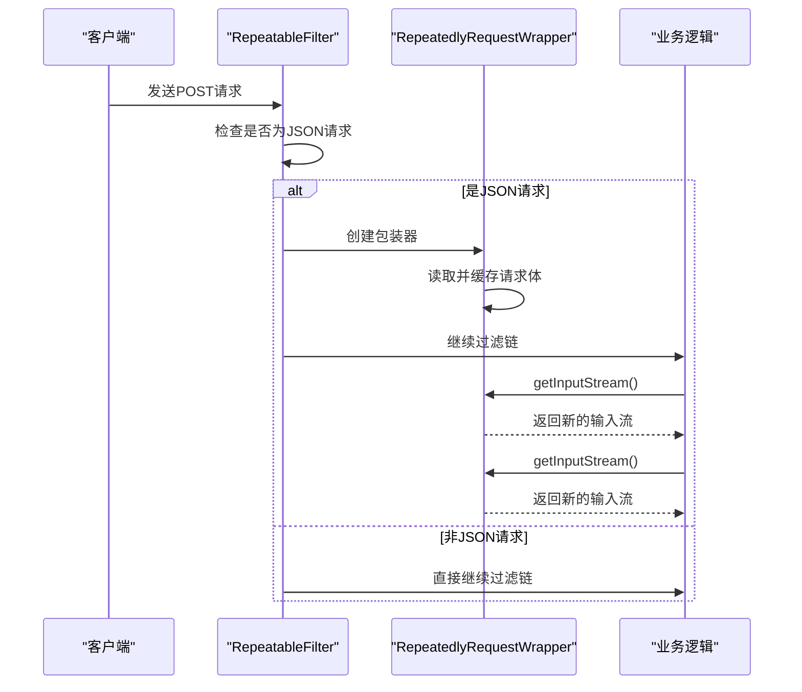
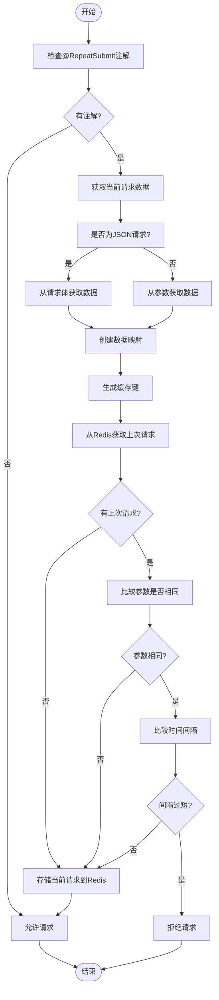
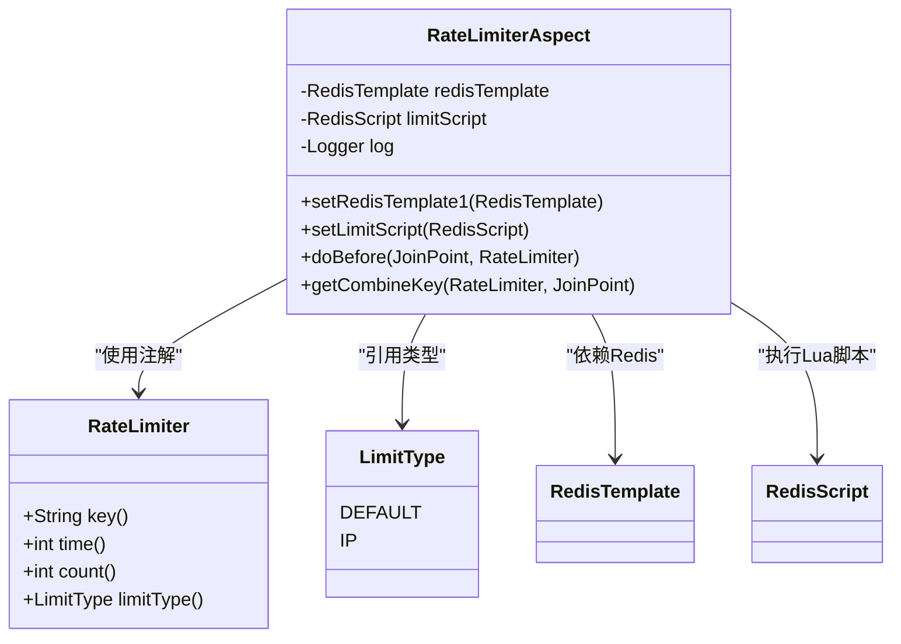
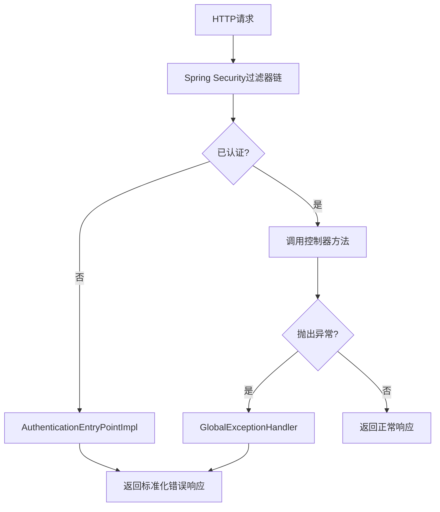
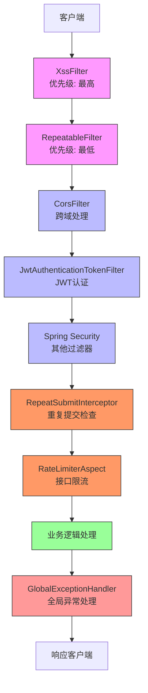

# 安全防护

<cite>
**本文档引用的文件**  
- [XssFilter.java](file://bearjia-admin-backend/src/main/java/com/javaxiaobear/base/common/filter/XssFilter.java)
- [XssHttpServletRequestWrapper.java](file://bearjia-admin-backend/src/main/java/com/javaxiaobear/base/common/filter/XssHttpServletRequestWrapper.java)
- [RepeatableFilter.java](file://bearjia-admin-backend/src/main/java/com/javaxiaobear/base/common/filter/RepeatableFilter.java)
- [RepeatedlyRequestWrapper.java](file://bearjia-admin-backend/src/main/java/com/javaxiaobear/base/common/filter/RepeatedlyRequestWrapper.java)
- [RepeatSubmitInterceptor.java](file://bearjia-admin-backend/src/main/java/com/javaxiaobear/base/framework/interceptor/RepeatSubmitInterceptor.java)
- [SameUrlDataInterceptor.java](file://bearjia-admin-backend/src/main/java/com/javaxiaobear/base/framework/interceptor/impl/SameUrlDataInterceptor.java)
- [RepeatSubmit.java](file://bearjia-admin-backend/src/main/java/com/javaxiaobear/base/framework/interceptor/annotation/RepeatSubmit.java)
- [RateLimiterAspect.java](file://bearjia-admin-backend/src/main/java/com/javaxiaobear/base/framework/aspectj/RateLimiterAspect.java)
- [RateLimiter.java](file://bearjia-admin-backend/src/main/java/com/javaxiaobear/base/framework/aspectj/lang/annotation/RateLimiter.java)
- [GlobalExceptionHandler.java](file://bearjia-admin-backend/src/main/java/com/javaxiaobear/base/framework/web/exception/GlobalExceptionHandler.java)
- [FilterConfig.java](file://bearjia-admin-backend/src/main/java/com/javaxiaobear/base/framework/config/FilterConfig.java)
- [ResourcesConfig.java](file://bearjia-admin-backend/src/main/java/com/javaxiaobear/base/framework/config/ResourcesConfig.java)
- [security.js](file://bear-jia-vue3/src/utils/security.js)
</cite>

## 目录
1. [引言](#引言)
2. [XSS防护机制](#xss防护机制)
3. [请求体可重复读取实现](#请求体可重复读取实现)
4. [防止表单重复提交](#防止表单重复提交)
5. [接口访问频率控制](#接口访问频率控制)
6. [全局异常处理](#全局异常处理)
7. [安全过滤器链协作](#安全过滤器链协作)
8. [安全配置建议与最佳实践](#安全配置建议与最佳实践)

## 引言

本项目构建了一套完整的安全防护体系，通过多层过滤器、拦截器和切面编程技术，实现了对XSS攻击、重复提交、接口限流等常见安全威胁的有效防护。系统采用前后端协同的安全策略，在前端通过内容安全策略（CSP）、点击劫持防护等手段增强客户端安全性，后端则通过请求过滤、参数校验、Redis缓存等机制保障服务端安全。各安全组件按照特定顺序协同工作，形成完整的防护链条，确保系统在面对各种安全威胁时具有足够的防御能力。

## XSS防护机制

项目通过`XssFilter`过滤器和`XssHttpServletRequestWrapper`请求包装器实现XSS攻击防护。`XssFilter`作为最外层的防护屏障，优先执行，其配置了最高优先级（HIGHEST_PRECEDENCE），确保在其他过滤器之前处理请求。该过滤器会检查请求方法和URL路径，对于GET和DELETE请求以及配置在排除列表中的URL路径不进行XSS过滤。

当需要进行XSS过滤时，`XssFilter`会创建一个`XssHttpServletRequestWrapper`实例来包装原始请求。这个包装器重写了`getParameterValues`和`getInputStream`方法，对所有请求参数和JSON格式的请求体内容进行XSS过滤。过滤的核心逻辑由`EscapeUtil.clean()`方法实现，该方法利用`HTMLFilter`类对HTML内容进行清理，移除或转义潜在的恶意脚本代码。

**图示来源**  
- [XssFilter.java](file://bearjia-admin-backend/src/main/java/com/javaxiaobear/base/common/filter/XssFilter.java)
- [XssHttpServletRequestWrapper.java](file://bearjia-admin-backend/src/main/java/com/javaxiaobear/base/common/filter/XssHttpServletRequestWrapper.java)
- [EscapeUtil.java](file://bearjia-admin-backend/src/main/java/com/javaxiaobear/base/common/utils/html/EscapeUtil.java)
- [HTMLFilter.java](file://bearjia-admin-backend/src/main/java/com/javaxiaobear/base/common/utils/html/HTMLFilter.java)

**本节来源**  
- [XssFilter.java](file://bearjia-admin-backend/src/main/java/com/javaxiaobear/base/common/filter/XssFilter.java#L1-L75)
- [XssHttpServletRequestWrapper.java](file://bearjia-admin-backend/src/main/java/com/javaxiaobear/base/common/filter/XssHttpServletRequestWrapper.java#L1-L111)

## 请求体可重复读取实现

为解决Servlet请求体只能读取一次的问题，项目实现了`RepeatableFilter`过滤器和`RepeatedlyRequestWrapper`请求包装器。`RepeatableFilter`的优先级设置为最低（LOWEST_PRECEDENCE），确保在XSS过滤等处理之后执行。

该过滤器会检查请求是否为HTTP请求且内容类型为JSON，如果是，则创建`RepeatedlyRequestWrapper`实例来包装原始请求。`RepeatedlyRequestWrapper`在构造时会一次性读取并保存整个请求体内容到内存中的字节数组中。后续对`getInputStream`和`getReader`方法的调用都会基于这个保存的字节数组创建新的输入流，从而实现请求体的可重复读取。

这一机制对于需要多次读取请求体的场景至关重要，例如在日志记录、参数校验和业务处理等多个环节都需要访问请求体内容时。通过将请求体内容缓存到内存中，避免了因流已关闭而导致的读取失败问题。

**图示来源**  
- [RepeatableFilter.java](file://bearjia-admin-backend/src/main/java/com/javaxiaobear/base/common/filter/RepeatableFilter.java)
- [RepeatedlyRequestWrapper.java](file://bearjia-admin-backend/src/main/java/com/javaxiaobear/base/common/filter/RepeatedlyRequestWrapper.java)

**本节来源**  
- [RepeatableFilter.java](file://bearjia-admin-backend/src/main/java/com/javaxiaobear/base/common/filter/RepeatableFilter.java#L1-L52)
- [RepeatedlyRequestWrapper.java](file://bearjia-admin-backend/src/main/java/com/javaxiaobear/base/common/filter/RepeatedlyRequestWrapper.java#L1-L42)

## 防止表单重复提交

项目通过`RepeatSubmitInterceptor`拦截器和`SameUrlDataInterceptor`实现防止表单重复提交的功能。`RepeatSubmitInterceptor`是一个抽象类，定义了防止重复提交的基本流程，而`SameUrlDataInterceptor`是其具体实现。

当在控制器方法上使用`@RepeatSubmit`注解时，拦截器会介入处理。`SameUrlDataInterceptor`的实现逻辑是：首先获取当前请求的参数数据（对于JSON请求从请求体获取，对于表单请求从参数获取），然后与上一次相同URL的请求数据进行比较。如果参数数据相同且两次请求的时间间隔小于配置的间隔时间（默认5秒），则判定为重复提交。

该机制利用Redis作为缓存存储，以"REPEAT_SUBMIT_KEY + URL + 提交密钥"作为缓存键，存储最近一次请求的参数和时间戳。这种基于URL和数据内容的双重判断机制，比单纯的请求间隔判断更加精确，能有效防止用户快速连续提交相同数据的情况。

**图示来源**  
- [RepeatSubmitInterceptor.java](file://bearjia-admin-backend/src/main/java/com/javaxiaobear/base/framework/interceptor/RepeatSubmitInterceptor.java)
- [SameUrlDataInterceptor.java](file://bearjia-admin-backend/src/main/java/com/javaxiaobear/base/framework/interceptor/impl/SameUrlDataInterceptor.java)
- [RepeatSubmit.java](file://bearjia-admin-backend/src/main/java/com/javaxiaobear/base/framework/interceptor/annotation/RepeatSubmit.java)

**本节来源**  
- [RepeatSubmitInterceptor.java](file://bearjia-admin-backend/src/main/java/com/javaxiaobear/base/framework/interceptor/RepeatSubmitInterceptor.java#L1-L56)
- [SameUrlDataInterceptor.java](file://bearjia-admin-backend/src/main/java/com/javaxiaobear/base/framework/interceptor/impl/SameUrlDataInterceptor.java#L1-L111)
- [RepeatSubmit.java](file://bearjia-admin-backend/src/main/java/com/javaxiaobear/base/framework/interceptor/annotation/RepeatSubmit.java#L1-L31)

## 接口访问频率控制

项目通过`RateLimiter`注解和`RateLimiterAspect`切面实现接口访问频率控制。`RateLimiter`是一个自定义注解，可以应用于任何需要限流的方法上，支持配置限流时间窗口（秒）和允许的访问次数。

`RateLimiterAspect`是一个AOP切面，使用`@Before`通知在目标方法执行前进行限流检查。其实现基于Redis和Lua脚本，确保了限流操作的原子性。系统支持两种限流模式：全局限流和基于IP的限流。全局限流对所有用户共享同一个计数器，而基于IP的限流则为每个IP地址维护独立的计数器。

限流的核心逻辑通过Redis的`INCR`和`EXPIRE`命令实现，使用Lua脚本保证这两个操作的原子性。当访问次数超过阈值时，系统会抛出`ServiceException`异常，由全局异常处理器统一处理并返回相应的错误信息。

**图示来源**  
- [RateLimiter.java](file://bearjia-admin-backend/src/main/java/com/javaxiaobear/base/framework/aspectj/lang/annotation/RateLimiter.java)
- [RateLimiterAspect.java](file://bearjia-admin-backend/src/main/java/com/javaxiaobear/base/framework/aspectj/RateLimiterAspect.java)
- [LimitType.java](file://bearjia-admin-backend/src/main/java/com/javaxiaobear/base/framework/aspectj/lang/enums/LimitType.java)

**本节来源**  
- [RateLimiter.java](file://bearjia-admin-backend/src/main/java/com/javaxiaobear/base/framework/aspectj/lang/annotation/RateLimiter.java#L1-L40)
- [RateLimiterAspect.java](file://bearjia-admin-backend/src/main/java/com/javaxiaobear/base/framework/aspectj/RateLimiterAspect.java#L1-L90)

## 全局异常处理

项目通过`@RestControllerAdvice`注解实现了全局异常处理器`GlobalExceptionHandler`，统一处理系统中抛出的各种异常，并返回标准化的错误响应。该处理器能够捕获多种类型的异常，包括权限校验异常、HTTP方法不支持异常、业务异常、运行时异常等。

对于安全相关的异常，如`AccessDeniedException`（访问拒绝异常），处理器会返回403状态码和相应的错误消息。对于`ServiceException`（业务异常），会根据异常中包含的错误码返回相应的响应。这种统一的异常处理机制不仅提高了系统的健壮性，也确保了错误信息的一致性和安全性，避免了敏感信息的泄露。

全局异常处理器与Spring Security的认证入口点`AuthenticationEntryPointImpl`协同工作，共同构成了系统的安全异常处理体系。当用户未认证时，由`AuthenticationEntryPointImpl`处理并返回401状态码；当用户认证但无权限时，由`GlobalExceptionHandler`处理并返回403状态码。

**图示来源**  
- [GlobalExceptionHandler.java](file://bearjia-admin-backend/src/main/java/com/javaxiaobear/base/framework/web/exception/GlobalExceptionHandler.java)
- [AuthenticationEntryPointImpl.java](file://bearjia-admin-backend/src/main/java/com/javaxiaobear/base/framework/security/handle/AuthenticationEntryPointImpl.java)

**本节来源**  
- [GlobalExceptionHandler.java](file://bearjia-admin-backend/src/main/java/com/javaxiaobear/base/framework/web/exception/GlobalExceptionHandler.java#L1-L132)
- [AuthenticationEntryPointImpl.java](file://bearjia-admin-backend/src/main/java/com/javaxiaobear/base/framework/security/handle/AuthenticationEntryPointImpl.java#L1-L34)

## 安全过滤器链协作

项目中的安全组件按照特定的顺序协同工作，形成了一个完整的请求处理链条。这个链条的执行顺序至关重要，决定了各个安全机制的生效逻辑。

最外层是`XssFilter`，它具有最高优先级，首先对请求进行XSS防护。接着是`RepeatableFilter`，它将可重复读取的请求包装器注入到过滤器链中。然后是Spring Security的过滤器链，包括JWT认证过滤器、CORS过滤器等。最后是Spring MVC的拦截器，包括防止重复提交的`RepeatSubmitInterceptor`。

这种分层设计确保了安全防护的全面性：XSS过滤在最前端阻止恶意脚本；请求体可重复读取为后续的多次读取提供了基础；安全认证确保只有合法用户才能访问；而重复提交拦截器则在业务处理前进行最后的校验。各组件通过合理的顺序安排，既保证了安全性，又避免了不必要的性能开销。

**图示来源**  
- [FilterConfig.java](file://bearjia-admin-backend/src/main/java/com/javaxiaobear/base/framework/config/FilterConfig.java)
- [ResourcesConfig.java](file://bearjia-admin-backend/src/main/java/com/javaxiaobear/base/framework/config/ResourcesConfig.java)
- [SecurityConfig.java](file://bearjia-admin-backend/src/main/java/com/javaxiaobear/base/framework/config/SecurityConfig.java)

**本节来源**  
- [FilterConfig.java](file://bearjia-admin-backend/src/main/java/com/javaxiaobear/base/framework/config/FilterConfig.java#L1-L58)
- [ResourcesConfig.java](file://bearjia-admin-backend/src/main/java/com/javaxiaobear/base/framework/config/ResourcesConfig.java#L1-L73)
- [SecurityConfig.java](file://bearjia-admin-backend/src/main/java/com/javaxiaobear/base/framework/config/SecurityConfig.java#L1-L148)

## 安全配置建议与最佳实践

根据项目现有的安全架构，提出以下配置建议和最佳实践：

1. **XSS防护配置**：合理配置`xss.excludes`参数，将不需要XSS过滤的接口（如富文本编辑器提交接口）添加到排除列表中，避免过度过滤影响正常功能。

2. **限流策略优化**：根据接口的重要性和资源消耗情况，设置不同的限流阈值。对于高消耗接口，应设置更严格的限流策略；对于公共接口，可适当放宽限制。

3. **Redis高可用**：由于重复提交和限流功能依赖Redis，建议配置Redis集群或哨兵模式，确保缓存服务的高可用性，避免因Redis故障导致安全机制失效。

4. **监控与告警**：建立安全事件监控体系，对频繁的XSS攻击尝试、大量重复提交请求、频繁的限流触发等异常行为进行监控和告警，及时发现潜在的安全威胁。

5. **前端安全增强**：在前端`security.js`中，建议启用禁用右键菜单和开发者工具快捷键的功能（目前为注释状态），进一步增强客户端安全性，防止信息泄露。

6. **定期安全审计**：定期审查安全配置和代码实现，确保没有安全漏洞。特别关注新添加的接口是否正确应用了必要的安全注解和过滤器。

7. **敏感信息保护**：在日志记录中避免记录完整的请求体和响应体，特别是包含敏感信息的请求，防止日志文件成为信息泄露的渠道。

通过遵循这些最佳实践，可以进一步提升系统的整体安全性，构建更加坚固的防护体系。

**本节来源**  
- [security.js](file://bear-jia-vue3/src/utils/security.js#L83-L243)
- [application.yml](file://bearjia-admin-backend/src/main/resources/application.yml)