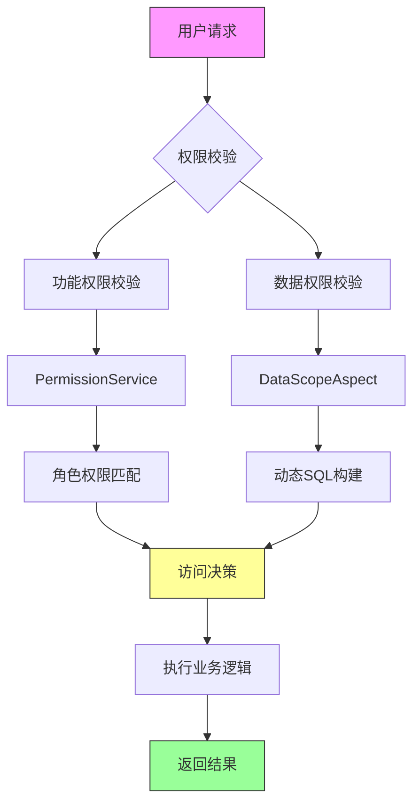
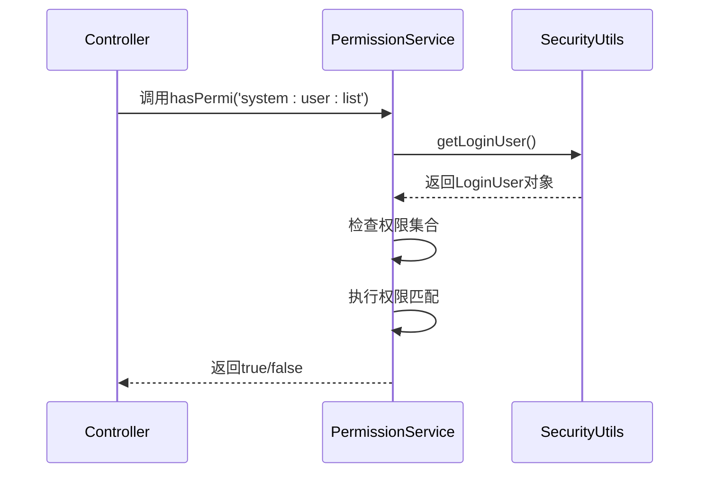
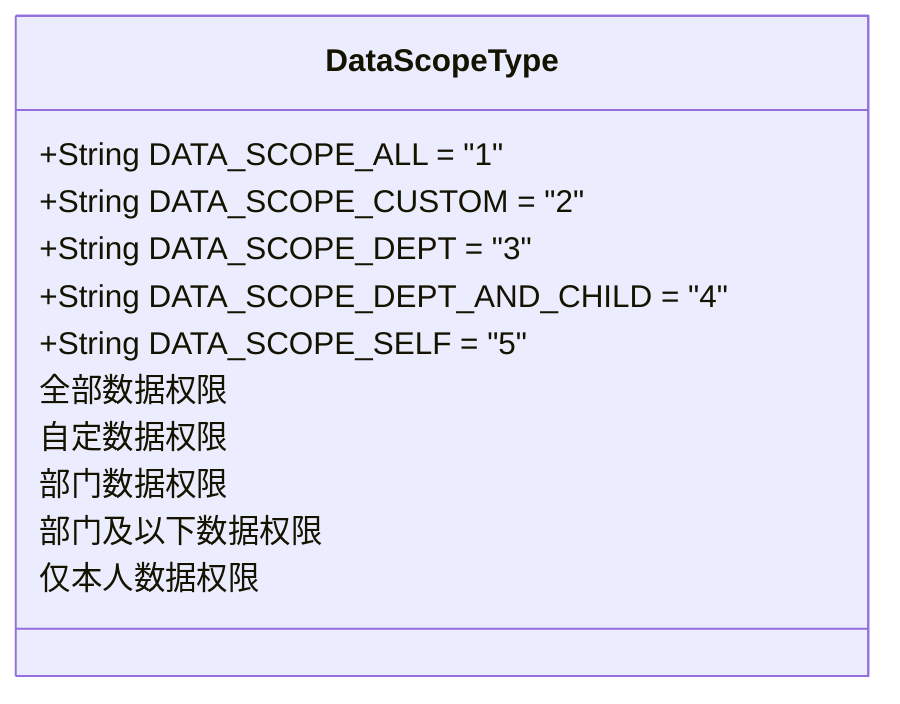
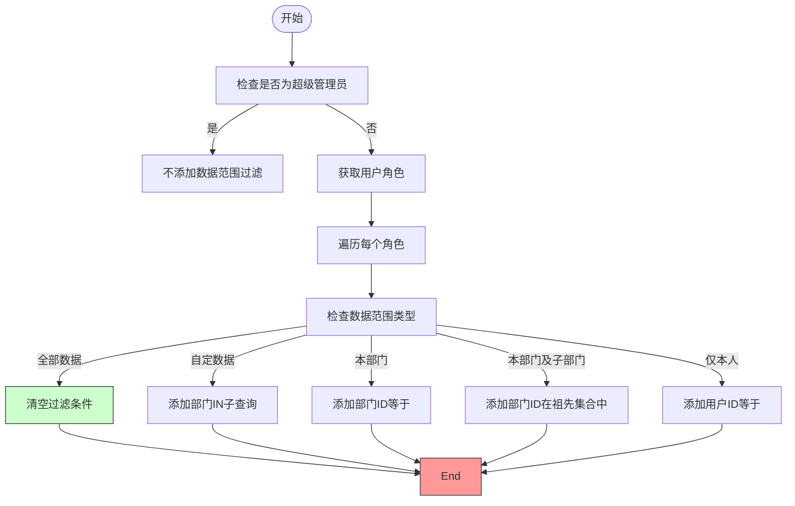
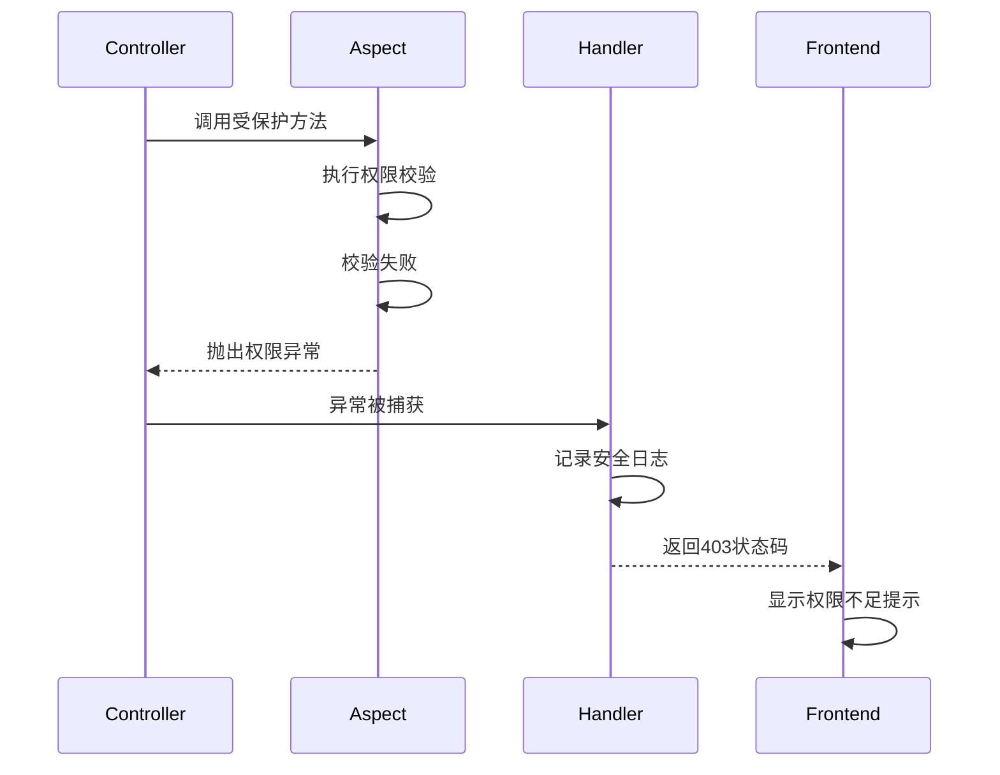
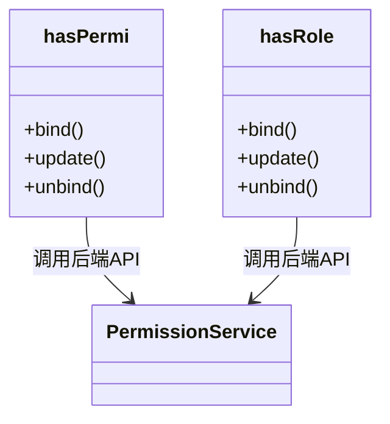

# 权限控制

<cite>
**本文档引用的文件**   
- [PermissionService.java](file://bearjia-admin-backend/src/main/java/com/javaxiaobear/base/framework/security/service/PermissionService.java)
- [DataScopeAspect.java](file://bearjia-admin-backend/src/main/java/com/javaxiaobear/base/framework/aspectj/DataScopeAspect.java)
- [DataScope.java](file://bearjia-admin-backend/src/main/java/com/javaxiaobear/base/framework/aspectj/lang/annotation/DataScope.java)
- [SysUserController.java](file://bearjia-admin-backend/src/main/java/com/javaxiaobear/module/system/controller/SysUserController.java)
- [hasPermi.js](file://bear-jia-vue3/src/directive/permission/hasPermi.js)
- [hasRole.js](file://bear-jia-vue3/src/directive/permission/hasRole.js)
</cite>

## 目录
1. [简介](#简介)
2. [权限控制架构](#权限控制架构)
3. [功能权限实现](#功能权限实现)
4. [数据权限实现](#数据权限实现)
5. [权限缓存机制](#权限缓存机制)
6. [权限校验失败处理](#权限校验失败处理)
7. [前端权限控制](#前端权限控制)
8. [实际应用示例](#实际应用示例)

## 简介
本系统采用基于角色的访问控制（RBAC）模型，实现了细粒度的功能权限和数据权限控制。权限系统由后端服务和前端指令共同构成，通过AOP切面技术实现权限校验，确保系统安全性和数据隔离性。

## 权限控制架构



**图示来源**
- [PermissionService.java](file://bearjia-admin-backend/src/main/java/com/javaxiaobear/base/framework/security/service/PermissionService.java)
- [DataScopeAspect.java](file://bearjia-admin-backend/src/main/java/com/javaxiaobear/base/framework/aspectj/DataScopeAspect.java)

## 功能权限实现

### PermissionService详解
`PermissionService`是系统权限控制的核心服务，负责判断用户是否具备特定权限。该服务通过`@Service("ss")`注解注册为Spring Bean，并提供多种权限校验方法。

主要功能包括：
- 单个权限校验：`hasPermi(String permission)`
- 多权限任意匹配：`hasAnyPermi(String permissions)`
- 角色校验：`hasRole(String role)`
- 多角色任意匹配：`hasAnyRoles(String roles)`

权限校验流程：
1. 获取当前登录用户信息
2. 检查用户权限集合
3. 进行权限字符串匹配
4. 返回校验结果



**图示来源**
- [PermissionService.java](file://bearjia-admin-backend/src/main/java/com/javaxiaobear/base/framework/security/service/PermissionService.java)
- [SecurityUtils.java](file://bearjia-admin-backend/src/main/java/com/javaxiaobear/base/common/utils/SecurityUtils.java)

**本节来源**
- [PermissionService.java](file://bearjia-admin-backend/src/main/java/com/javaxiaobear/base/framework/security/service/PermissionService.java)

## 数据权限实现

### DataScope注解与切面
数据权限通过`@DataScope`注解和`DataScopeAspect`切面实现，能够在不修改业务代码的情况下动态添加数据过滤条件。

#### DataScope注解参数
- `deptAlias`: 部门表别名
- `userAlias`: 用户表别名
- `permission`: 权限字符

#### 数据范围类型


**图示来源**
- [DataScopeAspect.java](file://bearjia-admin-backend/src/main/java/com/javaxiaobear/base/framework/aspectj/DataScopeAspect.java)

#### SQL条件构建机制
`DataScopeAspect`切面在方法执行前拦截，根据用户角色的数据权限类型动态构建SQL WHERE条件：



**图示来源**
- [DataScopeAspect.java](file://bearjia-admin-backend/src/main/java/com/javaxiaobear/base/framework/aspectj/DataScopeAspect.java)

**本节来源**
- [DataScopeAspect.java](file://bearjia-admin-backend/src/main/java/com/javaxiaobear/base/framework/aspectj/DataScopeAspect.java)
- [DataScope.java](file://bearjia-admin-backend/src/main/java/com/javaxiaobear/base/framework/aspectj/lang/annotation/DataScope.java)

## 权限缓存机制
系统通过以下方式优化权限性能：

1. **登录时加载权限**：用户登录后，一次性加载所有权限和角色信息到`LoginUser`对象
2. **内存缓存**：权限信息存储在用户会话中，避免重复查询数据库
3. **上下文传递**：使用`PermissionContextHolder`在线程上下文中传递权限信息

权限缓存优势：
- 减少数据库查询次数
- 提高权限校验速度
- 降低系统响应时间

**本节来源**
- [PermissionService.java](file://bearjia-admin-backend/src/main/java/com/javaxiaobear/base/framework/security/service/PermissionService.java)
- [PermissionContextHolder.java](file://bearjia-admin-backend/src/main/java/com/javaxiaobear/base/framework/security/context/PermissionContextHolder.java)

## 权限校验失败处理
当权限校验失败时，系统采用以下处理机制：

1. **返回标准错误码**：HTTP 403 Forbidden
2. **记录安全日志**：通过`LogAspect`记录未授权访问尝试
3. **前端友好提示**：显示"抱歉，您没有权限访问该功能"

异常处理流程：


**图示来源**
- [PermissionService.java](file://bearjia-admin-backend/src/main/java/com/javaxiaobear/base/framework/security/service/PermissionService.java)
- [LogAspect.java](file://bearjia-admin-backend/src/main/java/com/javaxiaobear/base/framework/aspectj/LogAspect.java)

## 前端权限控制
前端通过自定义指令实现UI层面的权限控制：

### 指令实现


**图示来源**
- [hasPermi.js](file://bear-jia-vue3/src/directive/permission/hasPermi.js)
- [hasRole.js](file://bear-jia-vue3/src/directive/permission/hasRole.js)

### 使用方式
- `v-hasPermi="'system:user:add'"`：控制按钮是否显示
- `v-hasRole="'admin'"`：控制特定功能是否可用

前端权限控制特点：
- 与后端权限体系保持一致
- 减少不必要的API调用
- 提升用户体验

**本节来源**
- [hasPermi.js](file://bear-jia-vue3/src/directive/permission/hasPermi.js)
- [hasRole.js](file://bear-jia-vue3/src/directive/permission/hasRole.js)

## 实际应用示例

### 控制器方法权限控制
```java
// 用户列表查询 - 需要'system:user:list'权限
@PreAuthorize("@ss.hasPermi('system:user:list')")
@GetMapping("/list")
public TableDataInfo list(SysUser user) {
    startPage();
    List<SysUser> list = userService.selectUserList(user);
    return getDataTable(list);
}

// 用户数据导出 - 需要'system:user:export'权限
// 并记录操作日志
@Log(title = "用户管理", businessType = BusinessType.EXPORT)
@PreAuthorize("@ss.hasPermi('system:user:export')")
@PostMapping("/export")
public void export(HttpServletResponse response, SysUser user) {
    List<SysUser> list = userService.selectUserList(user);
    ExcelUtil<SysUser> util = new ExcelUtil<SysUser>(SysUser.class);
    util.exportExcel(response, list, "用户数据");
}

// 部门树查询 - 应用数据权限过滤
// 只能查看自己部门及子部门的数据
@DataScope(deptAlias = "d", userAlias = "u")
@PreAuthorize("@ss.hasPermi('system:user:list')")
@GetMapping("/deptTree")
public AjaxResult deptTree(SysDept dept) {
    return success(deptService.selectDeptTreeList(dept));
}
```

**本节来源**
- [SysUserController.java](file://bearjia-admin-backend/src/main/java/com/javaxiaobear/module/system/controller/SysUserController.java)