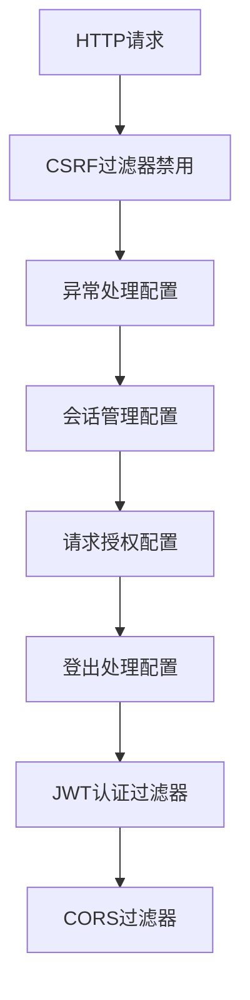
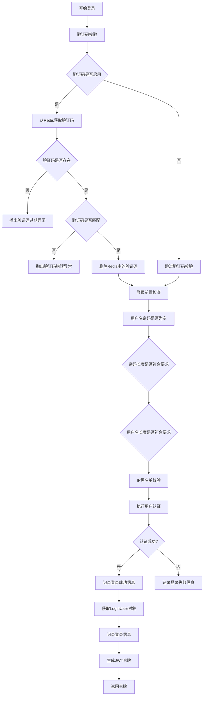
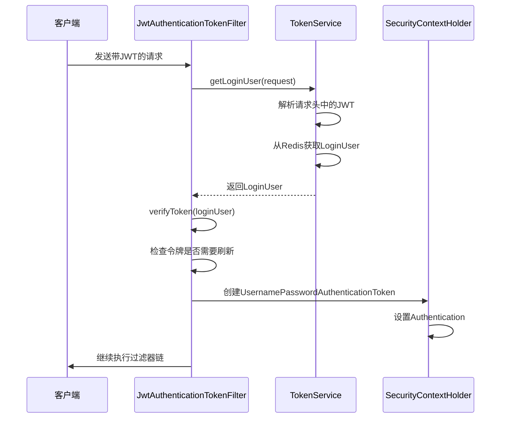
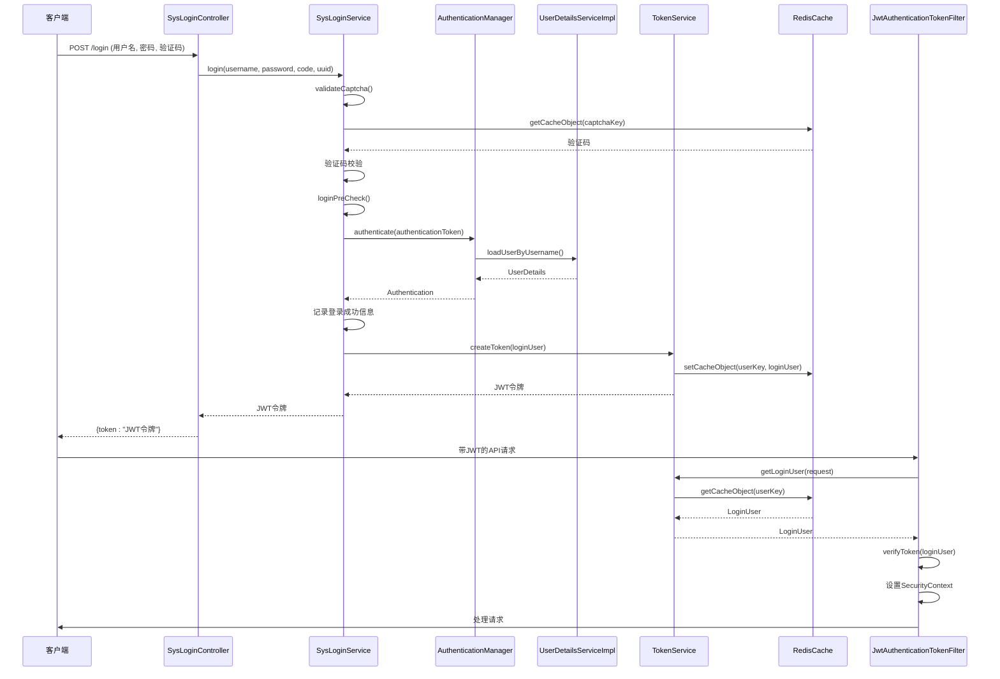
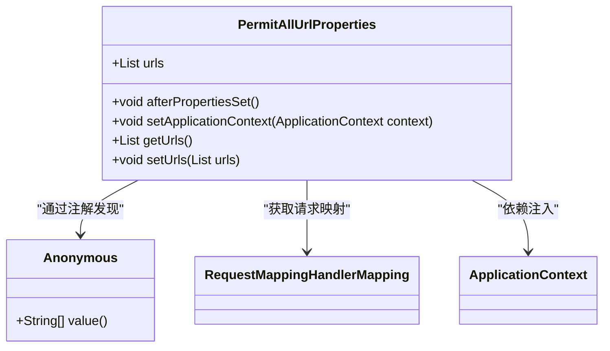

# 认证与授权

<cite>
**本文档引用的文件**   
- [SecurityConfig.java](file://bearjia-admin-backend/src/main/java/com/javaxiaobear/base/framework/config/SecurityConfig.java)
- [SysLoginService.java](file://bearjia-admin-backend/src/main/java/com/javaxiaobear/base/framework/security/service/SysLoginService.java)
- [TokenService.java](file://bearjia-admin-backend/src/main/java/com/javaxiaobear/base/framework/security/service/TokenService.java)
- [JwtAuthenticationTokenFilter.java](file://bearjia-admin-backend/src/main/java/com/javaxiaobear/base/framework/security/filter/JwtAuthenticationTokenFilter.java)
- [AuthenticationEntryPointImpl.java](file://bearjia-admin-backend/src/main/java/com/javaxiaobear/base/framework/security/handle/AuthenticationEntryPointImpl.java)
- [SysLoginController.java](file://bearjia-admin-backend/src/main/java/com/javaxiaobear/module/system/controller/SysLoginController.java)
- [SysRegisterController.java](file://bearjia-admin-backend/src/main/java/com/javaxiaobear/module/system/controller/SysRegisterController.java)
- [PermitAllUrlProperties.java](file://bearjia-admin-backend/src/main/java/com/javaxiaobear/base/framework/config/properties/PermitAllUrlProperties.java)
</cite>

## 目录
1. [简介](#简介)
2. [安全配置详解](#安全配置详解)
3. [用户登录流程](#用户登录流程)
4. [JWT令牌管理](#jwt令牌管理)
5. [安全过滤器机制](#安全过滤器机制)
6. [认证异常处理](#认证异常处理)
7. [认证流程时序图](#认证流程时序图)
8. [注册功能实现](#注册功能实现)

## 简介
本文档详细解析了基于Spring Security和JWT的认证与授权体系。系统采用无状态的JWT令牌认证机制，结合Spring Security框架实现全面的安全控制。认证体系包含用户登录验证、JWT令牌生成与验证、权限控制、异常处理等多个核心组件，确保系统的安全性和可靠性。

## 安全配置详解

本系统通过`SecurityConfig`类进行Spring Security的全面配置，定义了认证管理器、密码编码器、过滤器链等核心安全组件。

### 认证管理器配置

`SecurityConfig`类通过继承`WebSecurityConfigurerAdapter`并重写`configure`方法来配置认证管理器。系统使用自定义的`UserDetailsService`实现用户详情服务，并结合BCrypt密码编码器进行密码验证。

```java
@Override
protected void configure(AuthenticationManagerBuilder auth) throws Exception
{
    auth.userDetailsService(userDetailsService).passwordEncoder(bCryptPasswordEncoder());
}
```

**Section sources**
- [SecurityConfig.java](file://bearjia-admin-backend/src/main/java/com/javaxiaobear/base/framework/config/SecurityConfig.java#L143-L147)

### 密码编码器配置

系统采用BCryptPasswordEncoder作为密码编码器，提供强散列哈希加密，确保用户密码的安全存储。

```java
@Bean
public BCryptPasswordEncoder bCryptPasswordEncoder()
{
    return new BCryptPasswordEncoder();
}
```

**Section sources**
- [SecurityConfig.java](file://bearjia-admin-backend/src/main/java/com/javaxiaobear/base/framework/config/SecurityConfig.java#L134-L138)

### 过滤器链配置

安全配置中定义了完整的HTTP安全过滤器链，包括CSRF禁用、会话管理、请求授权等。系统采用无状态的JWT认证，因此禁用了会话创建。



**Diagram sources**
- [SecurityConfig.java](file://bearjia-admin-backend/src/main/java/com/javaxiaobear/base/framework/config/SecurityConfig.java#L103-L128)

**Section sources**
- [SecurityConfig.java](file://bearjia-admin-backend/src/main/java/com/javaxiaobear/base/framework/config/SecurityConfig.java#L96-L129)

## 用户登录流程

用户登录流程从客户端发起登录请求开始，经过控制器、服务层到安全组件的完整处理过程。

### 登录控制器实现

`SysLoginController`提供了登录接口，接收用户名、密码、验证码等登录信息，并调用`SysLoginService`进行验证。

```java
@PostMapping("/login")
public AjaxResult login(@RequestBody LoginBody loginBody)
{
    AjaxResult ajax = AjaxResult.success();
    String token = loginService.login(loginBody.getUsername(), loginBody.getPassword(), loginBody.getCode(),
            loginBody.getUuid());
    ajax.put(Constants.TOKEN, token);
    return ajax;
}
```

**Section sources**
- [SysLoginController.java](file://bearjia-admin-backend/src/main/java/com/javaxiaobear/module/system/controller/SysLoginController.java#L43-L52)

### 登录服务验证

`SysLoginService`负责登录的完整验证流程，包括验证码校验、登录前置检查和用户认证。



**Diagram sources**
- [SysLoginService.java](file://bearjia-admin-backend/src/main/java/com/javaxiaobear/base/framework/security/service/SysLoginService.java#L64-L101)

**Section sources**
- [SysLoginService.java](file://bearjia-admin-backend/src/main/java/com/javaxiaobear/base/framework/security/service/SysLoginService.java#L64-L182)

## JWT令牌管理

`TokenService`类负责JWT令牌的创建、验证、刷新和删除等全生命周期管理。

### 令牌创建过程

当用户成功登录后，系统会创建JWT令牌并将其与用户信息关联存储在Redis中。

```java
public String createToken(LoginUser loginUser)
{
    String token = IdUtils.fastUUID();
    loginUser.setToken(token);
    setUserAgent(loginUser);
    refreshToken(loginUser);

    Map<String, Object> claims = new HashMap<>();
    claims.put(Constants.LOGIN_USER_KEY, token);
    return createToken(claims);
}
```

**Section sources**
- [TokenService.java](file://bearjia-admin-backend/src/main/java/com/javaxiaobear/base/framework/security/service/TokenService.java#L114-L124)

### 令牌刷新机制

系统实现了智能的令牌刷新机制，当令牌有效期剩余不足20分钟时，自动刷新令牌的有效期。

```java
public void verifyToken(LoginUser loginUser)
{
    long expireTime = loginUser.getExpireTime();
    long currentTime = System.currentTimeMillis();
    if (expireTime - currentTime <= MILLIS_MINUTE_TEN)
    {
        refreshToken(loginUser);
    }
}
```

**Section sources**
- [TokenService.java](file://bearjia-admin-backend/src/main/java/com/javaxiaobear/base/framework/security/service/TokenService.java#L132-L140)

### 令牌失效策略

系统采用双重令牌管理策略：JWT令牌本身有过期时间，同时在Redis中存储令牌的详细信息。登出时，系统会从Redis中删除令牌信息，实现即时失效。

```java
public void delLoginUser(String token)
{
    if (StringUtils.isNotEmpty(token))
    {
        String userKey = getTokenKey(token);
        redisCache.deleteObject(userKey);
    }
}
```

**Section sources**
- [TokenService.java](file://bearjia-admin-backend/src/main/java/com/javaxiaobear/base/framework/security/service/TokenService.java#L99-L106)

## 安全过滤器机制

`JwtAuthenticationTokenFilter`是系统的核心安全过滤器，负责拦截请求、解析JWT令牌并设置安全上下文。

### 过滤器执行流程



**Diagram sources**
- [JwtAuthenticationTokenFilter.java](file://bearjia-admin-backend/src/main/java/com/javaxiaobear/base/framework/security/filter/JwtAuthenticationTokenFilter.java#L31-L43)
- [TokenService.java](file://bearjia-admin-backend/src/main/java/com/javaxiaobear/base/framework/security/service/TokenService.java#L62-L83)

**Section sources**
- [JwtAuthenticationTokenFilter.java](file://bearjia-admin-backend/src/main/java/com/javaxiaobear/base/framework/security/filter/JwtAuthenticationTokenFilter.java#L31-L43)

### 过滤器配置

在`SecurityConfig`中，JWT过滤器被添加到Spring Security过滤器链的适当位置，确保在用户名密码认证过滤器之前执行。

```java
httpSecurity.addFilterBefore(authenticationTokenFilter, UsernamePasswordAuthenticationFilter.class);
```

**Section sources**
- [SecurityConfig.java](file://bearjia-admin-backend/src/main/java/com/javaxiaobear/base/framework/config/SecurityConfig.java#L125)

## 认证异常处理

`AuthenticationEntryPointImpl`类负责处理认证失败的情况，当用户访问需要认证的资源但未提供有效凭证时，系统会返回相应的错误响应。

### 未认证访问处理

```java
@Override
public void commence(HttpServletRequest request, HttpServletResponse response, AuthenticationException e)
        throws IOException
{
    int code = HttpStatus.UNAUTHORIZED;
    String msg = StringUtils.format("请求访问：{}，认证失败，无法访问系统资源", request.getRequestURI());
    ServletUtils.renderString(response, JSON.toJSONString(AjaxResult.error(code, msg)));
}
```

**Section sources**
- [AuthenticationEntryPointImpl.java](file://bearjia-admin-backend/src/main/java/com/javaxiaobear/base/framework/security/handle/AuthenticationEntryPointImpl.java#L27-L33)

## 认证流程时序图



**Diagram sources**
- [SysLoginController.java](file://bearjia-admin-backend/src/main/java/com/javaxiaobear/module/system/controller/SysLoginController.java#L43-L52)
- [SysLoginService.java](file://bearjia-admin-backend/src/main/java/com/javaxiaobear/base/framework/security/service/SysLoginService.java#L64-L101)
- [JwtAuthenticationTokenFilter.java](file://bearjia-admin-backend/src/main/java/com/javaxiaobear/base/framework/security/filter/JwtAuthenticationTokenFilter.java#L31-L43)
- [TokenService.java](file://bearjia-admin-backend/src/main/java/com/javaxiaobear/base/framework/security/service/TokenService.java#L62-L83)

## 注册功能实现

系统提供了用户注册功能，通过`SysRegisterController`和`SysRegisterService`实现新用户注册。

### 注册控制器

```java
@RestController
public class SysRegisterController extends BaseController
{
    @Autowired
    private SysRegisterService registerService;

    @Autowired
    private ISysConfigService configService;

    @PostMapping("/register")
    public AjaxResult register(@RequestBody RegisterBody user)
    {
        if (!("true".equals(configService.selectConfigByKey("sys.account.registerUser"))))
        {
            return error("当前系统没有开启注册功能！");
        }
        String msg = registerService.register(user);
        return StringUtils.isEmpty(msg) ? success() : error(msg);
    }
}
```

**Section sources**
- [SysRegisterController.java](file://bearjia-admin-backend/src/main/java/com/javaxiaobear/module/system/controller/SysRegisterController.java#L1-L38)

### 匿名访问配置

系统通过`PermitAllUrlProperties`类配置允许匿名访问的URL，使用`@Anonymous`注解标记无需认证即可访问的接口。



**Diagram sources**
- [PermitAllUrlProperties.java](file://bearjia-admin-backend/src/main/java/com/javaxiaobear/base/framework/config/properties/PermitAllUrlProperties.java#L26-L102)
- [Anonymous.java](file://bearjia-admin-backend/src/main/java/com/javaxiaobear/base/framework/aspectj/lang/annotation/Anonymous.java)

**Section sources**
- [PermitAllUrlProperties.java](file://bearjia-admin-backend/src/main/java/com/javaxiaobear/base/framework/config/properties/PermitAllUrlProperties.java#L26-L102)