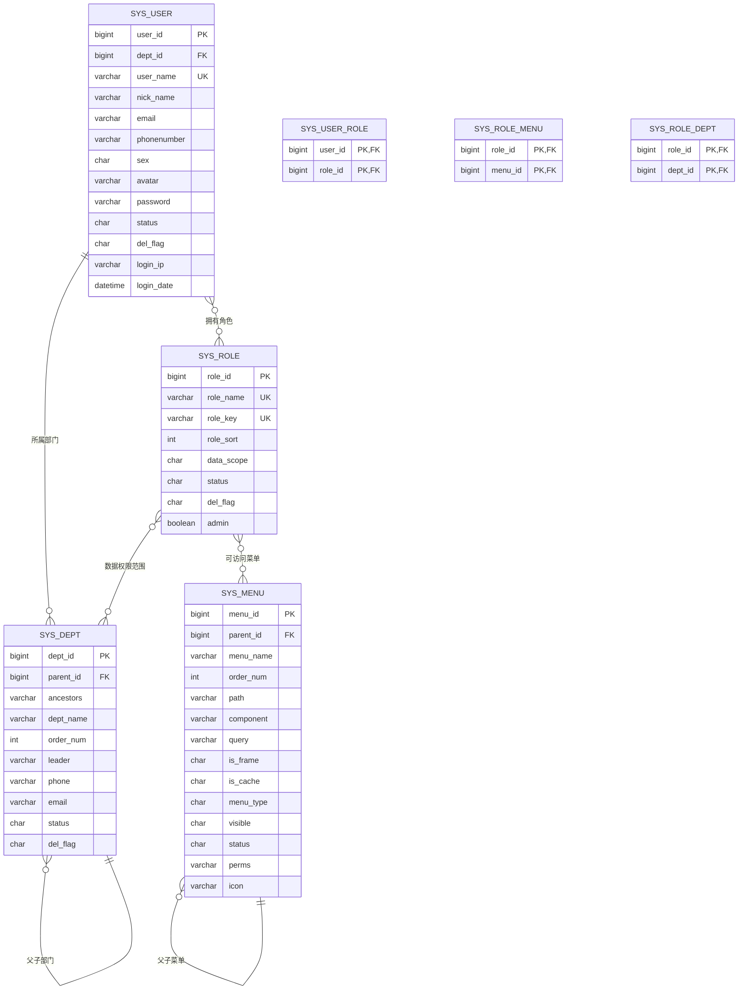

# 数据模型

<cite>
**本文档引用的文件**  
- [SysUser.java](file://bearjia-admin-backend/src/main/java/com/javaxiaobear/module/system/domain/SysUser.java)
- [SysRole.java](file://bearjia-admin-backend/src/main/java/com/javaxiaobear/module/system/domain/SysRole.java)
- [SysMenu.java](file://bearjia-admin-backend/src/main/java/com/javaxiaobear/module/system/domain/SysMenu.java)
- [SysDept.java](file://bearjia-admin-backend/src/main/java/com/javaxiaobear/module/system/domain/SysDept.java)
- [SysUserRole.java](file://bearjia-admin-backend/src/main/java/com/javaxiaobear/module/system/domain/SysUserRole.java)
- [SysRoleMenu.java](file://bearjia-admin-backend/src/main/java/com/javaxiaobear/module/system/domain/SysRoleMenu.java)
- [SysRoleDept.java](file://bearjia-admin-backend/src/main/java/com/javaxiaobear/module/system/domain/SysRoleDept.java)
- [SysUserMapper.xml](file://bearjia-admin-backend/src/main/resources/mybatis/system/SysUserMapper.xml)
- [SysRoleMapper.xml](file://bearjia-admin-backend/src/main/resources/mybatis/system/SysRoleMapper.xml)
- [SysMenuMapper.xml](file://bearjia-admin-backend/src/main/resources/mybatis/system/SysMenuMapper.xml)
- [SysDeptMapper.xml](file://bearjia-admin-backend/src/main/resources/mybatis/system/SysDeptMapper.xml)
- [bear_jia.sql](file://bearjia-admin-backend/src/main/resources/sql/bear_jia.sql)
</cite>

## 目录
1. [引言](#引言)
2. [核心实体定义](#核心实体定义)
3. [实体关系与ER图](#实体关系与er图)
4. [数据访问层实现](#数据访问层实现)
5. [复杂查询解析](#复杂查询解析)
6. [数据验证与类型处理器](#数据验证与类型处理器)
7. [数据库设计最佳实践](#数据库设计最佳实践)
8. [结论](#结论)

## 引言
本文档详细描述了QMS系统的核心数据模型，涵盖用户、角色、菜单、部门四大核心实体及其相互关系。通过分析实体字段、数据类型、约束条件及业务含义，阐明了系统权限管理的数据基础。文档还深入解析了MyBatis映射文件中的复杂查询实现，以及数据库设计的最佳实践。

## 核心实体定义

### 用户(SysUser)
用户实体是系统权限控制的基础，包含用户基本信息、状态和关联关系。

**字段定义：**
- `userId`: 用户ID，主键，自增
- `deptId`: 部门ID，外键关联SysDept
- `userName`: 用户账号，唯一约束
- `nickName`: 用户昵称
- `email`: 邮箱，格式验证
- `phonenumber`: 手机号，格式验证
- `sex`: 性别（0男 1女 2未知）
- `avatar`: 头像路径
- `password`: 加密存储的密码
- `status`: 用户状态（0正常 1停用）
- `delFlag`: 删除标志（0正常 1删除）
- `loginIp`: 最后登录IP
- `loginDate`: 最后登录时间

**业务含义：**
用户实体不仅存储基本身份信息，还通过deptId与部门关联，通过多对多关系与角色关联，构成了权限体系的基础。

**Section sources**
- [SysUser.java](file://bearjia-admin-backend/src/main/java/com/javaxiaobear/module/system/domain/SysUser.java)

### 角色(SysRole)
角色实体定义了系统中的权限角色，用于权限的分组管理。

**字段定义：**
- `roleId`: 角色ID，主键，自增
- `roleName`: 角色名称，唯一约束
- `roleKey`: 角色权限字符串，用于权限校验
- `roleSort`: 角色排序
- `dataScope`: 数据范围（1全部数据 2本部门数据 3本部门及子部门 4仅本人数据）
- `status`: 角色状态（0正常 1停用）
- `delFlag`: 删除标志（0正常 1删除）
- `admin`: 是否为管理员角色

**业务含义：**
角色通过roleKey与菜单权限关联，通过dataScope控制数据访问范围，实现了灵活的权限控制策略。

**Section sources**
- [SysRole.java](file://bearjia-admin-backend/src/main/java/com/javaxiaobear/module/system/domain/SysRole.java)

### 菜单(SysMenu)
菜单实体定义了系统的功能菜单结构，支持树形层级。

**字段定义：**
- `menuId`: 菜单ID，主键，自增
- `menuName`: 菜单名称
- `parent_id`: 父菜单ID，实现树形结构
- `order_num`: 显示顺序
- `path`: 路由地址
- `component`: 组件路径
- `query`: 路由参数
- `is_frame`: 是否外链（0否 1是）
- `is_cache`: 是否缓存（0否 1是）
- `menu_type`: 菜单类型（M目录 C菜单 F按钮）
- `visible`: 菜单状态（0显示 1隐藏）
- `status`: 菜单状态（0正常 1停用）
- `perms`: 权限标识符，用于按钮级权限控制
- `icon`: 菜单图标
- `create_by`: 创建者
- `create_time`: 创建时间

**业务含义：**
菜单实体通过parent_id实现无限层级的树形结构，perms字段支持细粒度的按钮权限控制，是前端路由和权限校验的基础。

**Section sources**
- [SysMenu.java](file://bearjia-admin-backend/src/main/java/com/javaxiaobear/module/system/domain/SysMenu.java)

### 部门(SysDept)
部门实体定义了组织架构，支持树形层级管理。

**字段定义：**
- `deptId`: 部门ID，主键，自增
- `parent_id`: 父部门ID，实现树形结构
- `ancestors`: 祖先节点，存储所有上级部门ID，以逗号分隔
- `deptName`: 部门名称
- `order_num`: 显示顺序
- `leader`: 部门负责人
- `phone`: 联系电话
- `email`: 邮箱
- `status`: 部门状态（0正常 1停用）
- `delFlag`: 删除标志（0正常 1删除）

**业务含义：**
部门实体通过parent_id和ancestors字段共同支持高效的树形查询，ancestors字段存储了完整的路径信息，避免了递归查询的性能问题。

**Section sources**
- [SysDept.java](file://bearjia-admin-backend/src/main/java/com/javaxiaobear/module/system/domain/SysDept.java)

## 实体关系与ER图



**Diagram sources**
- [bear_jia.sql](file://bearjia-admin-backend/src/main/resources/sql/bear_jia.sql)

## 数据访问层实现

### 关联关系实现
系统通过关联表实现了多对多关系：

**用户-角色关联(SysUserRole)**
- 通过`user_id`和`role_id`组成联合主键
- 实现用户与角色的多对多关系
- 支持一个用户拥有多个角色，一个角色被多个用户拥有

**角色-菜单关联(SysRoleMenu)**
- 通过`role_id`和`menu_id`组成联合主键
- 实现角色与菜单的多对多关系
- 控制角色可访问的菜单权限

**角色-部门关联(SysRoleDept)**
- 通过`role_id`和`dept_id`组成联合主键
- 实现角色与部门的多对多关系
- 支持数据范围权限控制

### MyBatis结果映射
在MyBatis映射文件中，使用了复杂的结果映射来处理关联关系：

```xml
<resultMap id="UserResult" type="SysUser">
    <id property="userId" column="user_id"/>
    <result property="userName" column="user_name"/>
    <!-- 其他字段映射 -->
    <association property="dept" javaType="SysDept" resultMap="deptResult"/>
    <collection property="roles" javaType="java.util.List" resultMap="RoleResult"/>
</resultMap>
```

这种嵌套映射方式避免了N+1查询问题，一次性加载用户及其关联的部门和角色信息。

**Section sources**
- [SysUserMapper.xml](file://bearjia-admin-backend/src/main/resources/mybatis/system/SysUserMapper.xml)
- [SysRoleMapper.xml](file://bearjia-admin-backend/src/main/resources/mybatis/system/SysRoleMapper.xml)

## 复杂查询解析

### 树形结构查询
部门和菜单的树形结构查询通过ancestors字段优化：

```sql
SELECT * FROM sys_dept 
WHERE FIND_IN_SET(#{deptId}, ancestors) 
   OR dept_id = #{deptId}
```

这种查询方式利用ancestors字段中存储的完整路径，避免了递归查询，提高了查询效率。

### 权限联合查询
用户权限查询通过多表关联实现：

```sql
SELECT DISTINCT m.perms 
FROM sys_menu m
LEFT JOIN sys_role_menu rm ON m.menu_id = rm.menu_id
LEFT JOIN sys_user_role ur ON rm.role_id = ur.role_id
WHERE ur.user_id = #{userId}
  AND m.status = '0'
  AND rm.role_id IN (
    SELECT role_id FROM sys_user_role WHERE user_id = #{userId}
  )
```

该查询获取用户所有角色所拥有的菜单权限，去重后返回权限标识符列表。

### 数据范围查询
基于DataScope注解实现数据范围控制：

```sql
SELECT * FROM sys_user u
LEFT JOIN sys_dept d ON u.dept_id = d.dept_id
WHERE 1=1
  <if test="dataScope == '2'">
    AND u.dept_id = #{deptId}
  </if>
  <if test="dataScope == '3'">
    AND (u.dept_id = #{deptId} OR FIND_IN_SET(#{deptId}, d.ancestors))
  </if>
```

根据角色的数据范围设置，动态添加查询条件，实现数据权限控制。

**Section sources**
- [SysMenuMapper.xml](file://bearjia-admin-backend/src/main/resources/mybatis/system/SysMenuMapper.xml)
- [SysDeptMapper.xml](file://bearjia-admin-backend/src/main/resources/mybatis/system/SysDeptMapper.xml)

## 数据验证与类型处理器

### 实体层数据验证
在实体类中通过注解实现数据验证：

```java
@NotBlank(message = "用户账号不能为空")
@Size(min = 0, max = 30, message = "用户账号长度不能超过30个字符")
private String userName;

@Email(message = "邮箱格式不正确")
private String email;

@Size(min = 0, max = 11, message = "手机号码长度不能超过11个字符")
private String phonenumber;
```

这些验证规则在服务层调用前自动执行，确保数据的完整性。

### 自定义TypeHandler
系统使用自定义TypeHandler处理特殊数据类型：

- 枚举类型转换：将数据库中的字符值转换为Java枚举
- 布尔值处理：将数据库中的'0'/'1'转换为true/false
- 日期时间格式化：统一日期时间的存储和显示格式

这些TypeHandler在mybatis-config.xml中注册，确保数据的一致性。

**Section sources**
- [SysUser.java](file://bearjia-admin-backend/src/main/java/com/javaxiaobear/module/system/domain/SysUser.java)
- [SysRole.java](file://bearjia-admin-backend/src/main/java/com/javaxiaobear/module/system/domain/SysRole.java)

## 数据库设计最佳实践

### 索引策略
系统在关键字段上创建了适当的索引：

**主键索引：**
- 所有表的主键字段自动创建聚簇索引

**唯一索引：**
- `sys_user.user_name`：确保用户账号唯一
- `sys_role.role_name`：确保角色名称唯一
- `sys_role.role_key`：确保权限字符串唯一

**普通索引：**
- `sys_user.dept_id`：加速按部门查询用户
- `sys_menu.parent_id`：加速菜单树形查询
- `sys_dept.parent_id`：加速部门树形查询

### 字段命名规范
系统遵循统一的字段命名规范：

- **表名：** 使用`sys_`前缀，如`sys_user`、`sys_role`
- **字段名：** 使用下划线分隔的蛇形命名法，如`user_name`、`dept_id`
- **主键：** 统一命名为`xxx_id`，如`user_id`、`role_id`
- **外键：** 与关联表的主键同名，如`dept_id`关联`sys_dept.dept_id`
- **状态字段：** 使用`status`命名，值为'0'/'1'表示启用/禁用
- **删除标志：** 使用`del_flag`命名，实现逻辑删除

### 数据一致性保障
系统通过多种机制保障数据一致性：

**外键约束：**
- 在数据库层面设置外键约束，确保引用完整性
- 如`sys_user.dept_id`外键引用`sys_dept.dept_id`

**事务管理：**
- 使用Spring的声明式事务，确保关联操作的原子性
- 如用户角色分配操作，同时更新多个关联表

**逻辑删除：**
- 使用`del_flag`字段实现逻辑删除，避免数据丢失
- 查询时默认过滤`del_flag='1'`的记录

**数据范围控制：**
- 通过`data_scope`字段和DataScope注解实现数据权限控制
- 防止用户越权访问其他部门数据

**Section sources**
- [bear_jia.sql](file://bearjia-admin-backend/src/main/resources/sql/bear_jia.sql)

## 结论
本文档全面分析了QMS系统的核心数据模型，涵盖了用户、角色、菜单、部门四大实体及其复杂关系。系统通过精心设计的数据库结构和MyBatis映射，实现了灵活的权限管理和高效的查询性能。树形结构的优化查询、多对多关系的关联表设计、数据范围的动态控制等特性，共同构成了一个健壮、可扩展的权限管理基础。遵循的数据库设计最佳实践，包括索引策略、命名规范和数据一致性保障机制，确保了系统的稳定性和可维护性。