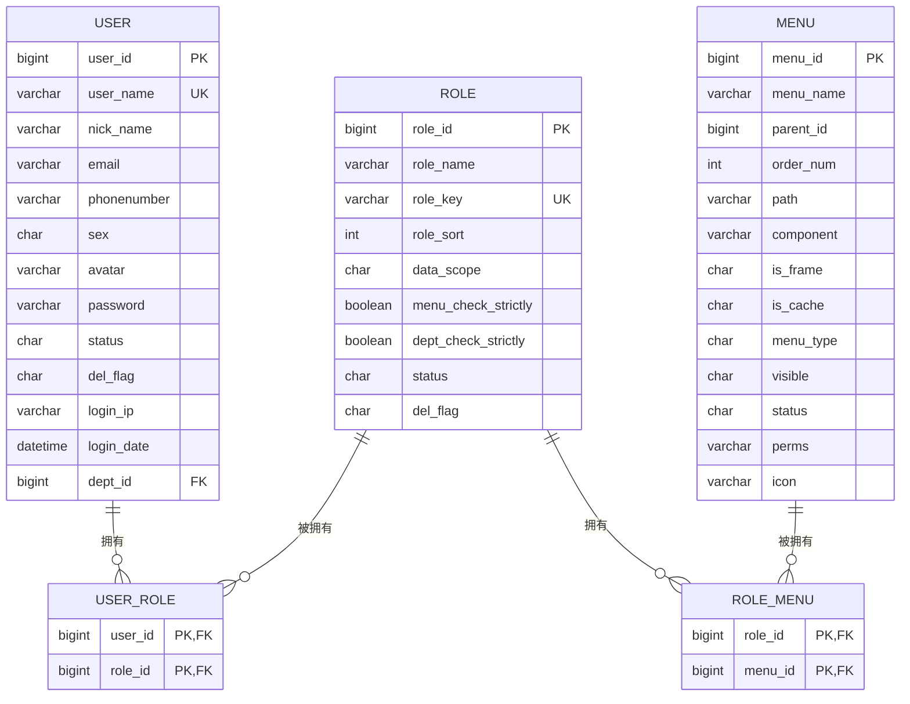
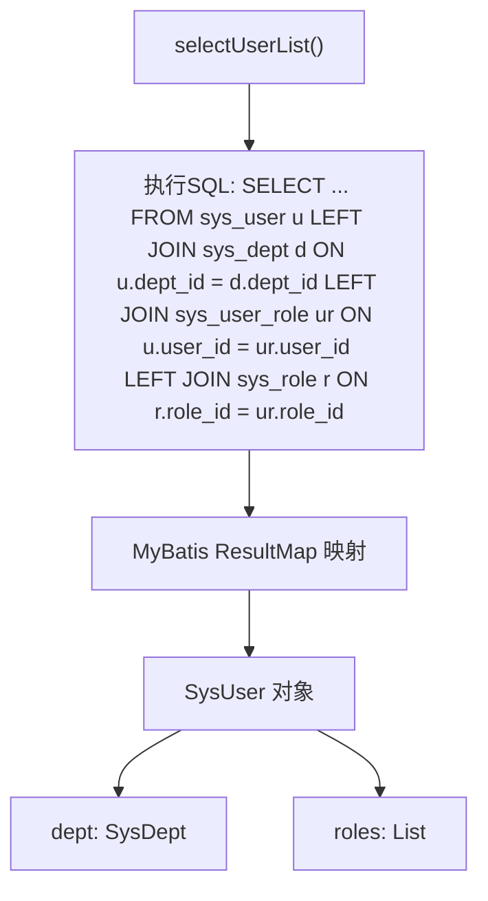
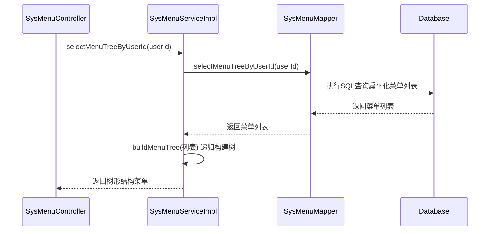

# 用户与权限模型

<cite>
**本文档引用文件**   
- [SysUser.java](file://bearjia-admin-backend\src\main\java\com\javaxiaobear\module\system\domain\SysUser.java)
- [SysRole.java](file://bearjia-admin-backend\src\main\java\com\javaxiaobear\module\system\domain\SysRole.java)
- [SysMenu.java](file://bearjia-admin-backend\src\main\java\com\javaxiaobear\module\system\domain\SysMenu.java)
- [SysUserRole.java](file://bearjia-admin-backend\src\main\java\com\javaxiaobear\module\system\domain\SysUserRole.java)
- [SysRoleMenu.java](file://bearjia-admin-backend\src\main\java\com\javaxiaobear\module\system\domain\SysRoleMenu.java)
- [SysUserMapper.xml](file://bearjia-admin-backend\src\main\resources\mybatis\system\SysUserMapper.xml)
- [SysRoleMapper.xml](file://bearjia-admin-backend\src\main\resources\mybatis\system\SysRoleMapper.xml)
- [SysMenuMapper.xml](file://bearjia-admin-backend\src\main\resources\mybatis\system\SysMenuMapper.xml)
- [bear_jia.sql](file://bearjia-admin-backend\src\main\resources\sql\bear_jia.sql)
</cite>

## 目录
1. [引言](#引言)
2. [核心实体字段定义](#核心实体字段定义)
3. [数据库关系模型](#数据库关系模型)
4. [MyBatis映射查询实现](#mybatis映射查询实现)
5. [数据验证与业务逻辑](#数据验证与业务逻辑)
6. [索引优化策略](#索引优化策略)
7. [结论](#结论)

## 引言
本文档详细阐述了系统中用户与权限管理的数据模型设计。该模型基于RBAC（基于角色的访问控制）权限模型，通过`SysUser`、`SysRole`、`SysMenu`三个核心实体以及`SysUserRole`、`SysRoleMenu`两个关联表，实现了灵活的用户-角色-菜单权限体系。文档将深入分析各实体的字段定义、数据类型、约束条件、业务含义，以及它们之间的关联关系和在MyBatis中的具体实现。

**本文档引用文件**   
- [SysUser.java](file://bearjia-admin-backend\src\main\java\com\javaxiaobear\module\system\domain\SysUser.java)
- [SysRole.java](file://bearjia-admin-backend\src\main\java\com\javaxiaobear\module\system\domain\SysRole.java)
- [SysMenu.java](file://bearjia-admin-backend\src\main\java\com\javaxiaobear\module\system\domain\SysMenu.java)

## 核心实体字段定义

### SysUser（用户实体）
`SysUser`实体代表系统中的用户，是权限体系的基础。

| 字段名 | 数据类型 | 约束条件 | 业务含义 |
| :--- | :--- | :--- | :--- |
| `userId` | Long | 主键，自增 | 用户唯一标识ID |
| `userName` | String | 非空，唯一，长度≤30 | 用户登录账号，用于身份认证 |
| `nickName` | String | 非空，长度≤30 | 用户在系统中的显示昵称 |
| `email` | String | 长度≤50，格式校验 | 用户邮箱地址 |
| `phonenumber` | String | 长度≤11 | 用户手机号码 |
| `sex` | String | 枚举值（0男，1女，2未知） | 用户性别 |
| `avatar` | String | | 用户头像的存储路径 |
| `password` | String | 非空 | 用户密码（已加密存储） |
| `status` | String | 枚举值（0正常，1停用） | 账号当前状态 |
| `delFlag` | String | 枚举值（0存在，2删除） | 逻辑删除标志 |
| `loginIp` | String | | 用户最后登录的IP地址 |
| `loginDate` | Date | | 用户最后登录时间 |
| `deptId` | Long | 外键 | 用户所属部门ID |
| `roles` | List<SysRole> | | 用户关联的角色列表（非数据库字段，用于数据传输） |

**本文档引用文件**   
- [SysUser.java](file://bearjia-admin-backend\src\main\java\com\javaxiaobear\module\system\domain\SysUser.java#L24-L296)

### SysRole（角色实体）
`SysRole`实体代表一组权限的集合，用户通过被赋予角色来获得相应的权限。

| 字段名 | 数据类型 | 约束条件 | 业务含义 |
| :--- | :--- | :--- | :--- |
| `roleId` | Long | 主键，自增 | 角色唯一标识ID |
| `roleName` | String | 非空，长度≤30 | 角色的显示名称 |
| `roleKey` | String | 非空，长度≤100 | 角色的权限字符，用于代码中进行权限校验 |
| `roleSort` | Integer | 非空 | 角色在列表中的显示顺序 |
| `dataScope` | String | | 数据权限范围（1:所有数据；2:自定义；3:本部门；4:本部门及以下；5:仅本人） |
| `menuCheckStrictly` | boolean | | 菜单树选择时，父子节点是否严格互斥 |
| `deptCheckStrictly` | boolean | | 部门树选择时，父子节点是否严格互斥 |
| `status` | String | 枚举值（0正常，1停用） | 角色当前状态 |
| `delFlag` | String | 枚举值（0存在，2删除） | 逻辑删除标志 |
| `permissions` | Set<String> | | 角色拥有的权限集合（非数据库字段，运行时计算） |

**本文档引用文件**   
- [SysRole.java](file://bearjia-admin-backend\src\main\java\com\javaxiaobear\module\system\domain\SysRole.java#L22-L219)

### SysMenu（菜单实体）
`SysMenu`实体代表系统中的功能菜单，是权限控制的最小粒度单位。

| 字段名 | 数据类型 | 约束条件 | 业务含义 |
| :--- | :--- | :--- | :--- |
| `menuId` | Long | 主键，自增 | 菜单唯一标识ID |
| `menuName` | String | 非空，长度≤50 | 菜单的显示名称 |
| `parentId` | Long | | 父菜单ID，用于构建树形结构，根节点为0 |
| `orderNum` | Integer | 非空 | 同级菜单的显示顺序 |
| `path` | String | 长度≤200 | 路由地址，前端路由匹配 |
| `component` | String | 长度≤255 | 组件路径，前端组件的文件路径 |
| `isFrame` | String | 枚举值（0是外链，1否） | 是否为外部链接 |
| `isCache` | String | 枚举值（0缓存，1不缓存） | 是否需要缓存该页面 |
| `menuType` | String | 非空，枚举值（M目录，C菜单，F按钮） | 菜单类型 |
| `visible` | String | 枚举值（0显示，1隐藏） | 菜单是否在侧边栏显示 |
| `status` | String | 枚举值（0正常，1停用） | 菜单当前状态 |
| `perms` | String | 长度≤100 | 权限标识，用于按钮级别的权限控制 |
| `icon` | String | | 菜单图标 |
| `children` | List<SysMenu> | | 子菜单列表（非数据库字段，用于构建树形结构） |

**本文档引用文件**   
- [SysMenu.java](file://bearjia-admin-backend\src\main\java\com\javaxiaobear\module\system\domain\SysMenu.java#L21-L234)

## 数据库关系模型

### 关系设计
系统采用多对多关系设计，通过关联表来解耦核心实体：
- **用户-角色关系**：一个用户可以拥有多个角色，一个角色可以被多个用户拥有。这种多对多关系通过`SysUserRole`关联表实现。
- **角色-菜单关系**：一个角色可以拥有多个菜单权限，一个菜单可以被多个角色拥有。这种多对多关系通过`SysRoleMenu`关联表实现。

**图表来源**
- [bear_jia.sql](file://bearjia-admin-backend\src\main\resources\sql\bear_jia.sql#L785-L850)
- [SysUserRole.java](file://bearjia-admin-backend\src\main\java\com\javaxiaobear\module\system\domain\SysUserRole.java)
- [SysRoleMenu.java](file://bearjia-admin-backend\src\main\java\com\javaxiaobear\module\system\domain\SysRoleMenu.java)

## MyBatis映射查询实现

### 联合查询实现
MyBatis通过`<resultMap>`和`<association>`、`<collection>`标签实现了对象的关联映射，避免了N+1查询问题。

#### 用户角色权限级联查询
在`SysUserMapper.xml`中，通过`selectUserList`查询用户列表时，使用`LEFT JOIN`一次性关联`sys_dept`和`sys_role`表，并通过`<resultMap>`将结果映射到`SysUser`对象的`dept`和`roles`属性中，实现了用户、部门、角色信息的级联查询。

**图表来源**
- [SysUserMapper.xml](file://bearjia-admin-backend\src\main\resources\mybatis\system\SysUserMapper.xml#L49-L62)

#### 菜单树形结构递归查询
在`SysMenuMapper.xml`中，`selectMenuTreeByUserId`方法用于根据用户ID查询其有权限的菜单树。该查询通过`LEFT JOIN`关联`sys_menu`、`sys_role_menu`、`sys_user_role`和`sys_role`表，筛选出状态为启用的菜单，并按`parent_id`和`order_num`排序。虽然SQL本身不包含递归，但`SysMenuServiceImpl`服务层会将查询到的扁平化菜单列表，通过`buildMenuTree`等方法在内存中递归构建为树形结构。

**图表来源**
- [SysMenuMapper.xml](file://bearjia-admin-backend\src\main\resources\mybatis\system\SysMenuMapper.xml#L76-L85)
- [SysMenuServiceImpl.java](file://bearjia-admin-backend\src\main\java\com\javaxiaobear\module\system\service\impl\SysMenuServiceImpl.java)

## 数据验证与业务逻辑

### 实体类数据验证
实体类通过JSR-303注解（如`@NotBlank`, `@Size`, `@Email`）在数据绑定时进行前端输入校验。

| 实体 | 字段 | 验证注解 | 业务规则 |
| :--- | :--- | :--- | :--- |
| `SysUser` | `userName` | `@NotBlank`, `@Size(max=30)` | 用户账号不能为空，长度不超过30 |
| `SysUser` | `nickName` | `@NotBlank`, `@Size(max=30)` | 用户昵称不能为空，长度不超过30 |
| `SysUser` | `email` | `@Email`, `@Size(max=50)` | 必须是合法邮箱格式，长度不超过50 |
| `SysUser` | `phonenumber` | `@Size(max=11)` | 手机号码长度不超过11位 |
| `SysRole` | `roleName` | `@NotBlank`, `@Size(max=30)` | 角色名称不能为空，长度不超过30 |
| `SysRole` | `roleKey` | `@NotBlank`, `@Size(max=100)` | 权限字符不能为空，长度不超过100 |
| `SysMenu` | `menuName` | `@NotBlank`, `@Size(max=50)` | 菜单名称不能为空，长度不超过50 |
| `SysMenu` | `menuType` | `@NotBlank` | 菜单类型不能为空 |

**本文档引用文件**   
- [SysUser.java](file://bearjia-admin-backend\src\main\java\com\javaxiaobear\module\system\domain\SysUser.java#L144-L170)
- [SysRole.java](file://bearjia-admin-backend\src\main\java\com\javaxiaobear\module\system\domain\SysRole.java#L97-L111)
- [SysMenu.java](file://bearjia-admin-backend\src\main\java\com\javaxiaobear\module\system\domain\SysMenu.java#L79-L175)

### Service层业务逻辑校验
除了基础的数据验证，Service层还实现了更复杂的业务逻辑校验：
- **唯一性校验**：在创建或更新用户、角色、菜单时，调用`checkUserNameUnique`、`checkRoleNameUnique`、`checkMenuNameUnique`等方法，通过数据库查询确保`userName`、`roleName`、`menuName`（结合`parentId`）的唯一性。
- **管理员特殊处理**：`SysUser`类中定义了`isAdmin()`静态方法，当`userId`为1时，该用户被视为超级管理员，拥有所有权限，不受角色和菜单权限的限制。
- **数据范围过滤**：`SysRole`的`dataScope`字段定义了角色的数据权限范围，系统在查询数据时会根据此字段动态拼接SQL条件，实现数据级别的权限控制。

**本文档引用文件**   
- [SysUser.java](file://bearjia-admin-backend\src\main\java\com\javaxiaobear\module\system\domain\SysUser.java#L112-L120)
- [SysRoleServiceImpl.java](file://bearjia-admin-backend\src\main\java\com\javaxiaobear\module\system\service\impl\SysRoleServiceImpl.java#L55-L56)

## 索引优化策略
为了提升常用查询字段的性能，数据库对关键字段建立了索引。

| 表名 | 字段名 | 索引类型 | 优化目的 |
| :--- | :--- | :--- | :--- |
| `sys_user` | `user_name` | 唯一索引 (UK) | 加速用户登录认证和用户信息查询 |
| `sys_user` | `email` | 普通索引 | 加速通过邮箱查找用户 |
| `sys_user` | `phonenumber` | 普通索引 | 加速通过手机号查找用户 |
| `sys_user` | `dept_id` | 普通索引 | 加速按部门查询用户列表 |
| `sys_role` | `role_key` | 唯一索引 (UK) | 加速通过权限字符进行权限校验 |
| `sys_menu` | `parent_id` | 普通索引 | 加速构建菜单树形结构的查询 |
| `sys_menu` | `order_num` | 普通索引 | 加速菜单排序查询 |

这些索引在`bear_jia.sql`数据库脚本中通过`UNIQUE KEY`和`KEY`语句定义，确保了在高并发场景下，用户登录、权限校验、菜单加载等核心操作的高效性。

**本文档引用文件**   
- [bear_jia.sql](file://bearjia-admin-backend\src\main\resources\sql\bear_jia.sql#L785-L850)

## 结论
本文档全面解析了系统的用户与权限数据模型。该模型设计清晰，通过`SysUser`、`SysRole`、`SysMenu`三个核心实体和两个关联表，构建了一个灵活、可扩展的RBAC权限体系。MyBatis的联合查询和结果映射机制有效解决了对象关联问题，而JSR-303注解和Service层业务逻辑共同保障了数据的完整性和一致性。合理的数据库索引策略为系统的高性能运行提供了坚实的基础。此模型为系统的安全性和可维护性提供了有力支撑。