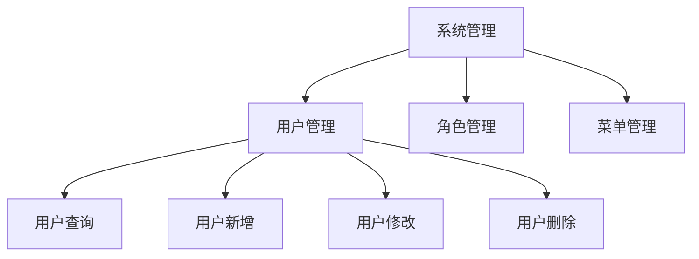
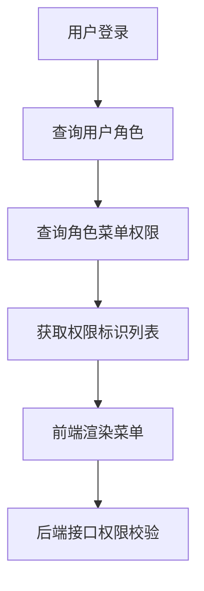
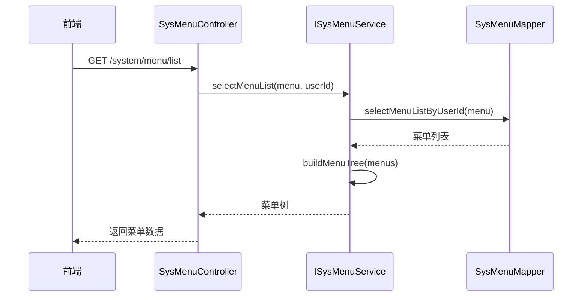

# 菜单模型

<cite>
**本文档引用的文件**  
- [SysMenu.java](file://bearjia-admin-backend/src/main/java/com/javaxiaobear/module/system/domain/SysMenu.java)
- [SysMenuMapper.java](file://bearjia-admin-backend/src/main/java/com/javaxiaobear/module/system/mapper/SysMenuMapper.java)
- [SysMenuMapper.xml](file://bearjia-admin-backend/src/main/resources/mybatis/system/SysMenuMapper.xml)
- [ISysMenuService.java](file://bearjia-admin-backend/src/main/java/com/javaxiaobear/module/system/service/ISysMenuService.java)
- [SysMenuController.java](file://bearjia-admin-backend/src/main/java/com/javaxiaobear/module/system/controller/SysMenuController.java)
- [RouterVo.java](file://bearjia-admin-backend/src/main/java/com/javaxiaobear/module/system/domain/vo/RouterVo.java)
- [MetaVo.java](file://bearjia-admin-backend/src/main/java/com/javaxiaobear/module/system/domain/vo/MetaVo.java)
- [bear_jia.sql](file://bearjia-admin-backend/src/main/resources/sql/bear_jia.sql)
- [menu.js](file://bear-jia-vue3/src/api/system/menu.js)
</cite>

## 目录

1. [SysMenu实体字段定义](#sysmenu实体字段定义)
2. [菜单树形结构实现机制](#菜单树形结构实现机制)
3. [MyBatis映射文件中的菜单递归查询](#mybatis映射文件中的菜单递归查询)
4. [菜单与角色的多对多关联查询](#菜单与角色的多对多关联查询)
5. [不同菜单类型的权限控制](#不同菜单类型的权限控制)
6. [前端路由与后端菜单数据的映射](#前端路由与后端菜单数据的映射)
7. [动态路由生成逻辑](#动态路由生成逻辑)
8. [菜单表索引优化策略](#菜单表索引优化策略)

## SysMenu实体字段定义

SysMenu实体类定义了菜单权限表的所有字段，每个字段都有明确的数据类型、约束条件和业务含义：

- **菜单ID (menuId)**: `Long`类型，主键，唯一标识一个菜单项
- **菜单名称 (menuName)**: `String`类型，长度限制0-50字符，不能为空，表示菜单的显示名称
- **父菜单ID (parentId)**: `Long`类型，默认值为0，表示根菜单，用于构建菜单树形结构
- **显示顺序 (orderNum)**: `Integer`类型，不能为空，用于控制同一层级菜单的显示顺序
- **路由地址 (path)**: `String`类型，长度限制0-200字符，表示前端路由的路径
- **组件路径 (component)**: `String`类型，长度限制0-255字符，表示Vue组件的路径
- **路由参数 (query)**: `String`类型，表示路由的查询参数
- **是否为外链 (isFrame)**: `String`类型，'0'表示是外链（http(s)://开头），'1'表示否
- **是否缓存 (isCache)**: `String`类型，'0'表示缓存，'1'表示不缓存，对应Vue的keep-alive
- **菜单类型 (menuType)**: `String`类型，不能为空，'M'表示目录，'C'表示菜单，'F'表示按钮
- **显示状态 (visible)**: `String`类型，'0'表示显示，'1'表示隐藏，控制菜单在侧边栏的可见性
- **菜单状态 (status)**: `String`类型，'0'表示正常，'1'表示停用，控制菜单的可用性
- **权限标识 (perms)**: `String`类型，长度限制0-100字符，用于基于角色的访问控制(RBAC)
- **菜单图标 (icon)**: `String`类型，表示菜单的图标标识
- **子菜单 (children)**: `List<SysMenu>`类型，用于存储子菜单项，实现树形结构

这些字段在数据库中的定义与实体类保持一致，通过MyBatis进行ORM映射。

**Section sources**
- [SysMenu.java](file://bearjia-admin-backend/src/main/java/com/javaxiaobear/module/system/domain/SysMenu.java#L21-L234)
- [bear_jia.sql](file://bearjia-admin-backend/src/main/resources/sql/bear_jia.sql#L480-L500)

## 菜单树形结构实现机制

菜单树形结构通过`parent_id`字段实现无限层级的嵌套关系。系统采用递归算法构建菜单树，核心机制如下：

1. **父子关系定义**：每个菜单项通过`parent_id`字段指向其父菜单，根菜单的`parent_id`为0
2. **递归构建**：从数据库查询所有菜单后，通过递归算法将具有相同`parent_id`的菜单项组织为子菜单列表
3. **层级遍历**：系统支持任意深度的菜单嵌套，理论上可以实现无限层级的菜单体系
4. **性能优化**：为了避免N+1查询问题，系统一次性查询所有菜单数据，然后在内存中构建树形结构

这种设计模式既保证了菜单结构的灵活性，又避免了频繁的数据库查询，提高了系统性能。



**Diagram sources**
- [SysMenu.java](file://bearjia-admin-backend/src/main/java/com/javaxiaobear/module/system/domain/SysMenu.java#L67)
- [ISysMenuService.java](file://bearjia-admin-backend/src/main/java/com/javaxiaobear/module/system/service/ISysMenuService.java#L79)

## MyBatis映射文件中的菜单递归查询

MyBatis映射文件通过`<resultMap>`和递归查询实现了菜单树的构建。核心SQL实现如下：

```xml
<resultMap type="SysMenu" id="SysMenuResult">
    <id property="menuId" column="menu_id"/>
    <result property="menuName" column="menu_name"/>
    <result property="parentId" column="parent_id"/>
    <collection property="children" javaType="ArrayList" resultMap="SysMenuResult"/>
</resultMap>
```

查询方法`selectMenuTreeAll`和`selectMenuTreeByUserId`返回完整的菜单树结构。MyBatis通过`<collection>`标签实现递归映射，将子菜单自动组织到`children`属性中。

系统提供了多个查询方法：
- `selectMenuList`: 查询系统菜单列表
- `selectMenuTreeAll`: 查询所有菜单树
- `selectMenuTreeByUserId`: 根据用户ID查询菜单树
- `selectMenuById`: 根据菜单ID查询单个菜单

这些方法支持根据用户权限动态返回可见的菜单项，实现了基于角色的菜单过滤。

**Section sources**
- [SysMenuMapper.xml](file://bearjia-admin-backend/src/main/resources/mybatis/system/SysMenuMapper.xml)
- [SysMenuMapper.java](file://bearjia-admin-backend/src/main/java/com/javaxiaobear/module/system/mapper/SysMenuMapper.java#L58-L66)

## 菜单与角色的多对多关联查询

菜单与角色之间通过中间表`sys_role_menu`实现多对多关联。系统提供了完善的关联查询机制：

1. **权限查询**：`selectMenuPermsByUserId`和`selectMenuPermsByRoleId`方法查询用户或角色的权限标识列表
2. **菜单树查询**：`selectMenuTreeByUserId`根据用户ID查询其有权访问的菜单树
3. **角色菜单关联**：`selectMenuListByRoleId`查询指定角色关联的菜单ID列表

在服务层，`ISysMenuService`接口提供了`selectMenuPermsByUserId`和`selectMenuPermsByRoleId`方法，返回`Set<String>`类型的权限标识集合，用于前端权限控制。

角色与菜单的关联关系存储在`sys_role_menu`表中，通过`role_id`和`menu_id`两个外键建立关联。这种设计支持一个角色拥有多个菜单权限，同时一个菜单也可以被多个角色共享。

**Section sources**
- [SysMenuMapper.java](file://bearjia-admin-backend/src/main/java/com/javaxiaobear/module/system/mapper/SysMenuMapper.java#L43-L52)
- [ISysMenuService.java](file://bearjia-admin-backend/src/main/java/com/javaxiaobear/module/system/service/ISysMenuService.java#L39-L47)

## 不同菜单类型的权限控制

系统通过`menu_type`字段区分三种菜单类型，并实施差异化的权限控制：

- **目录 (M)**: 仅作为容器存在，不直接关联权限，主要用于组织菜单结构
- **菜单 (C)**: 对应具体的页面或功能模块，需要配置`perms`权限标识
- **按钮 (F)**: 对应页面内的具体操作按钮，必须配置`perms`权限标识

权限控制流程如下：
1. 用户登录后，系统根据其角色查询所有关联的菜单权限标识
2. 前端根据权限标识动态渲染菜单和按钮
3. 后端接口通过`@PreAuthorize("@ss.hasPermi('system:user:list')")`注解进行权限校验

对于按钮级别的权限控制，系统在前端通过`v-hasPermi`指令实现，只有拥有相应权限的用户才能看到和操作特定按钮。



**Diagram sources**
- [SysMenu.java](file://bearjia-admin-backend/src/main/java/com/javaxiaobear/module/system/domain/SysMenu.java#L52)
- [SysMenuController.java](file://bearjia-admin-backend/src/main/java/com/javaxiaobear/module/system/controller/SysMenuController.java#L39)

## 前端路由与后端菜单数据的映射

前端路由与后端菜单数据通过`RouterVo`对象进行映射。后端将`SysMenu`实体转换为`RouterVo`对象，包含以下关键字段：

- **name**: 路由名称，对应Vue Router的name属性
- **path**: 路由路径，对应Vue Router的path属性
- **component**: 组件路径，动态导入Vue组件
- **hidden**: 是否隐藏，控制菜单在侧边栏的显示
- **meta**: 元数据，包含标题、图标、缓存等信息

转换过程由`ISysMenuService`的`buildMenus`方法完成，该方法递归遍历菜单树，将每个菜单项转换为对应的路由配置。`MetaVo`类封装了路由的元信息，包括标题、图标和缓存策略。

前端通过API获取路由配置后，动态添加到Vue Router中，实现动态路由功能。

**Section sources**
- [RouterVo.java](file://bearjia-admin-backend/src/main/java/com/javaxiaobear/module/system/domain/vo/RouterVo.java)
- [MetaVo.java](file://bearjia-admin-backend/src/main/java/com/javaxiaobear/module/system/domain/vo/MetaVo.java)
- [ISysMenuService.java](file://bearjia-admin-backend/src/main/java/com/javaxiaobear/module/system/service/ISysMenuService.java#L71)

## 动态路由生成逻辑

动态路由的生成逻辑主要在服务层的`buildMenus`方法中实现，流程如下：

1. **获取菜单数据**：调用`selectMenuList`方法获取用户有权访问的菜单列表
2. **构建路由树**：调用`buildMenus`方法将菜单列表转换为路由配置列表
3. **递归处理**：对每个菜单项进行处理，如果是目录或菜单类型，则创建对应的路由配置
4. **权限过滤**：只包含用户有权限访问的菜单项
5. **返回前端**：将生成的路由配置返回给前端

前端接收到路由配置后，使用`router.addRoute()`方法动态添加路由。系统还提供了`roleMenuTreeselect`接口，用于角色授权时显示菜单树选择器。



**Diagram sources**
- [ISysMenuService.java](file://bearjia-admin-backend/src/main/java/com/javaxiaobear/module/system/service/ISysMenuService.java#L71)
- [SysMenuController.java](file://bearjia-admin-backend/src/main/java/com/javaxiaobear/module/system/controller/SysMenuController.java#L43)

## 菜单表索引优化策略

为了提升树形结构查询性能，菜单表在关键字段上建立了索引：

- **主键索引**：`menu_id`字段上的主键索引，确保唯一性和快速查找
- **父级索引**：`parent_id`字段上的索引，优化树形结构的父子关系查询
- **类型索引**：`menu_type`字段上的索引，加速菜单类型过滤查询
- **状态索引**：`status`和`visible`字段上的索引，优化菜单状态过滤

这些索引策略显著提升了以下操作的性能：
- 菜单树的构建和遍历
- 特定类型菜单的查询
- 基于状态的菜单过滤
- 用户权限菜单的快速检索

通过合理的索引设计，系统能够在大数据量下仍保持良好的查询性能，确保菜单加载的响应速度。

**Section sources**
- [bear_jia.sql](file://bearjia-admin-backend/src/main/resources/sql/bear_jia.sql#L480-L500)
- [SysMenuMapper.xml](file://bearjia-admin-backend/src/main/resources/mybatis/system/SysMenuMapper.xml)