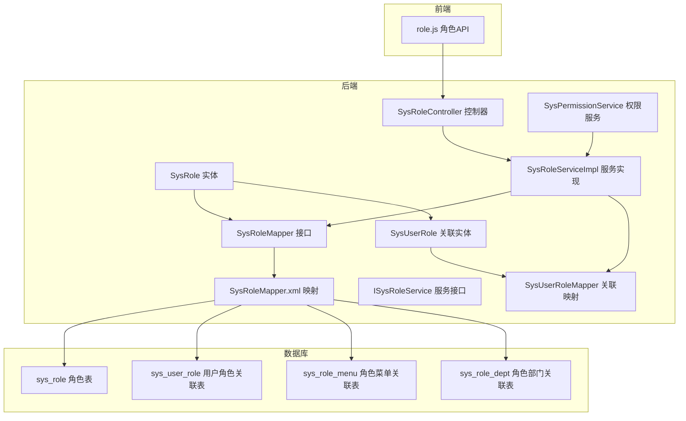
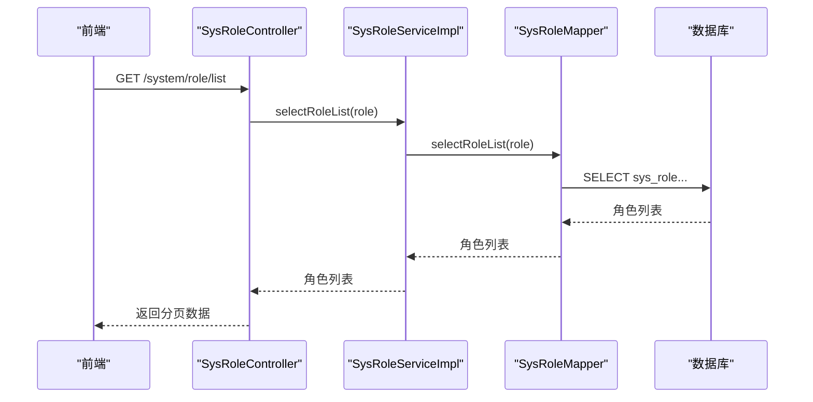
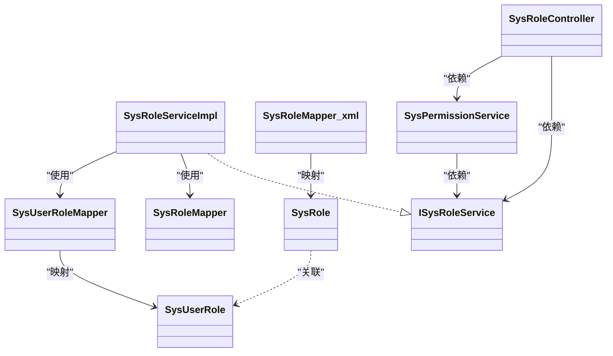

# 角色模型

<cite>
**本文引用的文件**
- [SysRole.java](file://bearjia-admin-backend/src/main/java/com/javaxiaobear/module/system/domain/SysRole.java)
- [SysRoleMapper.java](file://bearjia-admin-backend/src/main/java/com/javaxiaobear/module/system/mapper/SysRoleMapper.java)
- [SysRoleMapper.xml](file://bearjia-admin-backend/src/main/resources/mybatis/system/SysRoleMapper.xml)
- [SysRoleServiceImpl.java](file://bearjia-admin-backend/src/main/java/com/javaxiaobear/module/system/service/impl/SysRoleServiceImpl.java)
- [ISysRoleService.java](file://bearjia-admin-backend/src/main/java/com/javaxiaobear/module/system/service/ISysRoleService.java)
- [SysRoleController.java](file://bearjia-admin-backend/src/main/java/com/javaxiaobear/module/system/controller/SysRoleController.java)
- [SysPermissionService.java](file://bearjia-admin-backend/src/main/java/com/javaxiaobear/base/framework/security/service/SysPermissionService.java)
- [bear_jia.sql](file://bearjia-admin-backend/src/main/resources/sql/bear_jia.sql)
- [SysUserRole.java](file://bearjia-admin-backend/src/main/java/com/javaxiaobear/module/system/domain/SysUserRole.java)
- [SysUserRoleMapper.java](file://bearjia-admin-backend/src/main/java/com/javaxiaobear/module/system/mapper/SysUserRoleMapper.java)
- [SysRole.java（前端API）](file://bear-jia-vue3/src/api/system/role.js)
</cite>

## 目录
1. [简介](#简介)
2. [项目结构](#项目结构)
3. [核心组件](#核心组件)
4. [架构总览](#架构总览)
5. [详细组件分析](#详细组件分析)
6. [依赖分析](#依赖分析)
7. [性能考虑](#性能考虑)
8. [故障排查指南](#故障排查指南)
9. [结论](#结论)
10. [附录](#附录)

## 简介
本文件围绕“角色数据模型”进行系统化说明，覆盖SysRole实体字段定义、字段约束与业务含义、角色权限字符串在权限控制中的作用机制、MyBatis映射文件中角色CRUD与关联查询SQL实现、角色状态对用户权限的影响、角色权限分配的业务逻辑（含超级管理员特殊处理）、索引优化策略与删除级联规则等。旨在帮助开发者与产品/测试人员快速理解角色模型的设计与实现，并提供可操作的排障建议与最佳实践。

## 项目结构
角色模型涉及后端Java领域模型、持久层映射、业务服务层、控制器层以及数据库表结构。前端Vue3通过API调用后端角色接口完成角色管理页面的功能。

图表来源
- [SysRole.java](file://bearjia-admin-backend/src/main/java/com/javaxiaobear/module/system/domain/SysRole.java#L1-L242)
- [SysRoleMapper.java](file://bearjia-admin-backend/src/main/java/com/javaxiaobear/module/system/mapper/SysRoleMapper.java#L1-L107)
- [SysRoleMapper.xml](file://bearjia-admin-backend/src/main/resources/mybatis/system/SysRoleMapper.xml#L1-L152)
- [SysRoleServiceImpl.java](file://bearjia-admin-backend/src/main/java/com/javaxiaobear/module/system/service/impl/SysRoleServiceImpl.java#L1-L415)
- [ISysRoleService.java](file://bearjia-admin-backend/src/main/java/com/javaxiaobear/module/system/service/ISysRoleService.java#L1-L174)
- [SysRoleController.java](file://bearjia-admin-backend/src/main/java/com/javaxiaobear/module/system/controller/SysRoleController.java#L1-L170)
- [SysPermissionService.java](file://bearjia-admin-backend/src/main/java/com/javaxiaobear/base/framework/security/service/SysPermissionService.java#L1-L52)
- [SysUserRole.java](file://bearjia-admin-backend/src/main/java/com/javaxiaobear/module/system/domain/SysUserRole.java#L1-L59)
- [SysUserRoleMapper.java](file://bearjia-admin-backend/src/main/java/com/javaxiaobear/module/system/mapper/SysUserRoleMapper.java#L1-L62)
- [bear_jia.sql](file://bearjia-admin-backend/src/main/resources/sql/bear_jia.sql#L670-L776)
- [SysRole.java（前端API）](file://bear-jia-vue3/src/api/system/role.js)

章节来源
- [SysRole.java](file://bearjia-admin-backend/src/main/java/com/javaxiaobear/module/system/domain/SysRole.java#L1-L242)
- [SysRoleMapper.xml](file://bearjia-admin-backend/src/main/resources/mybatis/system/SysRoleMapper.xml#L1-L152)
- [bear_jia.sql](file://bearjia-admin-backend/src/main/resources/sql/bear_jia.sql#L670-L776)

## 核心组件
- SysRole 实体：承载角色的核心字段与业务语义，包括角色ID、角色名称、角色权限字符串、显示顺序、数据范围、菜单/部门勾选策略、状态、删除标记、创建/更新信息等。
- SysRoleMapper 接口与 SysRoleMapper.xml：定义角色的CRUD与查询能力，包含按条件分页查询、按用户查询角色、唯一性校验、软删除等SQL映射。
- SysRoleServiceImpl 服务实现：封装角色业务流程，如新增/修改角色、修改状态、修改数据权限、删除角色（含级联清理）、授权/取消授权用户角色等。
- ISysRoleService 服务接口：统一对外暴露角色业务能力。
- SysRoleController 控制器：提供REST接口，供前端调用，包含列表、新增、修改、修改状态、修改数据权限等。
- SysPermissionService：负责基于用户与角色计算权限集合，其中超级管理员拥有特殊权限。
- SysUserRole/SysUserRoleMapper：用户与角色的关联关系，支撑“用户拥有多个角色”的多对多模型。
- 前端API：前端通过role.js调用后端角色接口，驱动页面交互。

章节来源
- [SysRole.java](file://bearjia-admin-backend/src/main/java/com/javaxiaobear/module/system/domain/SysRole.java#L1-L242)
- [SysRoleMapper.java](file://bearjia-admin-backend/src/main/java/com/javaxiaobear/module/system/mapper/SysRoleMapper.java#L1-L107)
- [SysRoleMapper.xml](file://bearjia-admin-backend/src/main/resources/mybatis/system/SysRoleMapper.xml#L1-L152)
- [SysRoleServiceImpl.java](file://bearjia-admin-backend/src/main/java/com/javaxiaobear/module/system/service/impl/SysRoleServiceImpl.java#L1-L415)
- [ISysRoleService.java](file://bearjia-admin-backend/src/main/java/com/javaxiaobear/module/system/service/ISysRoleService.java#L1-L174)
- [SysRoleController.java](file://bearjia-admin-backend/src/main/java/com/javaxiaobear/module/system/controller/SysRoleController.java#L1-L170)
- [SysPermissionService.java](file://bearjia-admin-backend/src/main/java/com/javaxiaobear/base/framework/security/service/SysPermissionService.java#L1-L52)
- [SysUserRole.java](file://bearjia-admin-backend/src/main/java/com/javaxiaobear/module/system/domain/SysUserRole.java#L1-L59)
- [SysUserRoleMapper.java](file://bearjia-admin-backend/src/main/java/com/javaxiaobear/module/system/mapper/SysUserRoleMapper.java#L1-L62)
- [SysRole.java（前端API）](file://bear-jia-vue3/src/api/system/role.js)

## 架构总览
角色模型遵循经典的分层架构：
- 表现层：SysRoleController 提供HTTP接口
- 领域层：SysRole 实体承载业务语义
- 持久层：SysRoleMapper + MyBatis XML 映射
- 业务层：SysRoleServiceImpl 组织业务流程
- 权限层：SysPermissionService 计算用户权限集合

图表来源
- [SysRoleController.java](file://bearjia-admin-backend/src/main/java/com/javaxiaobear/module/system/controller/SysRoleController.java#L56-L80)
- [SysRoleServiceImpl.java](file://bearjia-admin-backend/src/main/java/com/javaxiaobear/module/system/service/impl/SysRoleServiceImpl.java#L49-L60)
- [SysRoleMapper.xml](file://bearjia-admin-backend/src/main/resources/mybatis/system/SysRoleMapper.xml#L33-L57)

## 详细组件分析

### SysRole 实体字段定义与业务含义
- 角色ID（roleId）：主键，唯一标识一个角色。
- 角色名称（roleName）：角色展示名称，非空且长度有限制。
- 角色权限字符串（roleKey）：角色权限标识符，用于权限判断与菜单/按钮授权，非空且长度有限制。
- 显示顺序（roleSort）：排序字段，用于界面展示顺序。
- 数据范围（dataScope）：角色数据权限范围（1：全部；2：自定义；3：本部门；4：本部门及以下；5：仅本人）。
- 菜单树选择项是否关联显示（menuCheckStrictly）：布尔型，影响菜单树勾选行为。
- 部门树选择项是否关联显示（deptCheckStrictly）：布尔型，影响部门树勾选行为。
- 角色状态（status）：0正常，1停用。
- 删除标记（delFlag）：0存在，2删除（软删除）。
- 创建/更新信息（createBy、createTime、updateBy、updateTime）：审计字段。
- 备注（remark）：附加说明。
- 用户是否存在此角色标识（flag）：辅助标记，用于前端勾选场景。
- 菜单组/部门组（menuIds、deptIds）：用于授权时接收前端传入的菜单/部门ID集合。
- 角色菜单权限（permissions）：运行时计算的权限集合。

章节来源
- [SysRole.java](file://bearjia-admin-backend/src/main/java/com/javaxiaobear/module/system/domain/SysRole.java#L1-L242)

### 角色权限字符串的作用机制
- 角色权限字符串（roleKey）用于标识角色的权限集合。在权限计算中，SysPermissionService会根据用户是否为超级管理员或其角色权限字符串集合，决定最终可用的权限集合。
- 超级管理员（roleKey=’admin’ 或 isAdmin()）拥有所有权限，不受具体菜单/按钮权限限制。
- 普通角色通过角色与菜单的关联关系获得菜单/按钮权限，权限字符串本身作为角色标识参与权限集合计算。

章节来源
- [SysPermissionService.java](file://bearjia-admin-backend/src/main/java/com/javaxiaobear/base/framework/security/service/SysPermissionService.java#L1-L52)
- [SysRole.java](file://bearjia-admin-backend/src/main/java/com/javaxiaobear/module/system/domain/SysRole.java#L86-L100)

### MyBatis映射文件中的角色CRUD与关联查询
- 角色CRUD
  - 新增：insertRole，动态拼接字段，自动写入创建时间。
  - 更新：updateRole，动态拼接字段，自动写入更新时间。
  - 删除：deleteRoleById/deleteRoleByIds，采用软删除（del_flag='2'）。
- 关联查询
  - selectRoleList：支持按角色ID、角色名称、状态、权限字符串、创建时间范围、数据范围过滤，按role_sort排序。
  - selectRolePermissionByUserId：查询某用户拥有的角色（通过sys_user_role关联）。
  - selectRoleAll：查询所有角色。
  - selectRoleListByUserId：查询某用户的角色ID集合。
  - selectRoleById：按ID查询角色。
  - selectRolesByUserName：按用户名查询角色。
  - checkRoleNameUnique/checkRoleKeyUnique：唯一性校验。

章节来源
- [SysRoleMapper.xml](file://bearjia-admin-backend/src/main/resources/mybatis/system/SysRoleMapper.xml#L1-L152)

### 角色状态管理对用户权限的影响
- 角色状态为“停用”（status=1）时，该角色不会被授予给用户，也不会出现在权限计算结果中。
- SysRoleServiceImpl 在批量删除角色前会校验角色是否已被分配，若已分配则拒绝删除，避免破坏权限一致性。
- SysRoleController 提供修改状态接口，配合权限注解确保只有具备相应权限的用户才能操作。

章节来源
- [SysRoleServiceImpl.java](file://bearjia-admin-backend/src/main/java/com/javaxiaobear/module/system/service/impl/SysRoleServiceImpl.java#L357-L376)
- [SysRoleController.java](file://bearjia-admin-backend/src/main/java/com/javaxiaobear/module/system/controller/SysRoleController.java#L158-L170)

### 角色权限分配的业务逻辑与超级管理员处理
- 新增/修改角色：服务层先持久化角色，再重建角色与菜单的关联（删除旧关联，批量插入新关联）。
- 修改数据权限：更新角色数据范围，删除旧的角色-部门关联，批量插入新的角色-部门关联。
- 删除角色：删除角色与菜单/部门的关联，再软删除角色。
- 超级管理员角色保护：不允许对超级管理员角色进行修改或删除；校验当前登录用户是否为超级管理员，否则抛出权限异常。
- 用户授权/取消授权：支持批量授权/取消授权用户角色。

章节来源
- [SysRoleServiceImpl.java](file://bearjia-admin-backend/src/main/java/com/javaxiaobear/module/system/service/impl/SysRoleServiceImpl.java#L230-L308)
- [SysRoleServiceImpl.java](file://bearjia-admin-backend/src/main/java/com/javaxiaobear/module/system/service/impl/SysRoleServiceImpl.java#L334-L376)
- [SysRoleServiceImpl.java](file://bearjia-admin-backend/src/main/java/com/javaxiaobear/module/system/service/impl/SysRoleServiceImpl.java#L178-L211)
- [SysUserRoleMapper.java](file://bearjia-admin-backend/src/main/java/com/javaxiaobear/module/system/mapper/SysUserRoleMapper.java#L1-L62)

### 数据库表结构与索引优化策略
- sys_role：角色主表，包含角色ID、角色名称、角色权限字符串、显示顺序、数据范围、菜单/部门勾选策略、状态、删除标记、创建/更新信息等。
- sys_user_role：用户与角色的多对多关联表。
- sys_role_menu：角色与菜单的多对多关联表。
- sys_role_dept：角色与部门的多对多关联表。
- 索引建议
  - sys_role(role_key)：用于按权限字符串查询唯一角色。
  - sys_role(role_name)：用于按名称查询唯一角色。
  - sys_user_role(user_id)：用于按用户查询角色列表。
  - sys_user_role(role_id)：用于按角色统计使用数量。
  - sys_role_menu(role_id)、sys_role_menu(menu_id)：用于按角色/菜单查询关联。
  - sys_role_dept(role_id)、sys_role_dept(dept_id)：用于按角色/部门查询关联。
- 删除规则
  - 角色删除采用软删除（del_flag='2'），保留历史审计信息。
  - 服务层在物理删除前会清理角色与菜单/部门的关联，保证数据一致性。

章节来源
- [bear_jia.sql](file://bearjia-admin-backend/src/main/resources/sql/bear_jia.sql#L670-L776)

### 前端集成与调用
- 前端通过role.js调用后端接口，实现角色列表、新增、修改、删除、修改状态、修改数据权限等功能。
- 前端页面与后端控制器一一对应，确保交互一致。

章节来源
- [SysRole.java（前端API）](file://bear-jia-vue3/src/api/system/role.js)

## 依赖分析
- SysRoleServiceImpl 依赖 SysRoleMapper、SysRoleMenuMapper、SysUserRoleMapper、SysRoleDeptMapper。
- SysRoleController 依赖 ISysRoleService、SysPermissionService、TokenService、ISysUserService、ISysDeptService。
- SysPermissionService 依赖 ISysRoleService、ISysMenuService。
- SysRoleMapper.xml 依赖 sys_role、sys_user_role、sys_role_menu、sys_role_dept 等表。

图表来源
- [SysRole.java](file://bearjia-admin-backend/src/main/java/com/javaxiaobear/module/system/domain/SysRole.java#L1-L242)
- [ISysRoleService.java](file://bearjia-admin-backend/src/main/java/com/javaxiaobear/module/system/service/ISysRoleService.java#L1-L174)
- [SysRoleServiceImpl.java](file://bearjia-admin-backend/src/main/java/com/javaxiaobear/module/system/service/impl/SysRoleServiceImpl.java#L1-L415)
- [SysRoleMapper.java](file://bearjia-admin-backend/src/main/java/com/javaxiaobear/module/system/mapper/SysRoleMapper.java#L1-L107)
- [SysRoleMapper.xml](file://bearjia-admin-backend/src/main/resources/mybatis/system/SysRoleMapper.xml#L1-L152)
- [SysRoleController.java](file://bearjia-admin-backend/src/main/java/com/javaxiaobear/module/system/controller/SysRoleController.java#L1-L170)
- [SysPermissionService.java](file://bearjia-admin-backend/src/main/java/com/javaxiaobear/base/framework/security/service/SysPermissionService.java#L1-L52)
- [SysUserRole.java](file://bearjia-admin-backend/src/main/java/com/javaxiaobear/module/system/domain/SysUserRole.java#L1-L59)
- [SysUserRoleMapper.java](file://bearjia-admin-backend/src/main/java/com/javaxiaobear/module/system/mapper/SysUserRoleMapper.java#L1-L62)

## 性能考虑
- 查询优化
  - 使用分页与条件过滤（角色名称模糊、状态精确、权限字符串模糊、时间范围）减少结果集。
  - 对常用过滤字段建立索引（role_key、role_name、user_id、role_id等）。
- 写入优化
  - 批量插入角色-菜单/部门关联，减少多次往返。
  - 更新时使用动态字段拼接，避免不必要的字段更新。
- 缓存与鉴权
  - 登录后刷新用户权限集合，避免重复计算。
  - 超级管理员权限直接注入，无需额外查询。

## 故障排查指南
- 角色唯一性冲突
  - 现象：新增/修改角色时报“角色名称或权限字符串已存在”。
  - 处理：检查SysRoleMapper.xml中的唯一性校验SQL，确认数据库索引是否完善。
- 删除失败
  - 现象：删除角色时报“已分配，不能删除”。
  - 处理：先取消用户对该角色的授权，再执行删除。
- 权限异常
  - 现象：修改状态或数据权限时报“没有权限访问角色数据”。
  - 处理：确认当前登录用户是否为超级管理员，或是否具备相应数据范围权限。
- 前端调用失败
  - 现象：角色管理页面无法加载或提交失败。
  - 处理：检查role.js接口路径与后端SysRoleController映射是否一致，核对网络与跨域配置。

章节来源
- [SysRoleMapper.xml](file://bearjia-admin-backend/src/main/resources/mybatis/system/SysRoleMapper.xml#L86-L94)
- [SysRoleServiceImpl.java](file://bearjia-admin-backend/src/main/java/com/javaxiaobear/module/system/service/impl/SysRoleServiceImpl.java#L357-L376)
- [SysRoleServiceImpl.java](file://bearjia-admin-backend/src/main/java/com/javaxiaobear/module/system/service/impl/SysRoleServiceImpl.java#L192-L211)
- [SysRole.java（前端API）](file://bear-jia-vue3/src/api/system/role.js)

## 结论
本角色模型通过清晰的实体设计、完善的MyBatis映射、严谨的服务层业务流程与严格的权限控制，实现了角色管理的完整闭环。通过软删除、唯一性校验、数据范围控制与超级管理员保护等机制，既保证了系统的安全性与一致性，也为后续扩展提供了良好的基础。建议在生产环境中完善索引策略与监控告警，持续优化查询与写入性能。

## 附录
- 字段约束与默认值
  - 角色权限字符串（role_key）：非空，长度限制，用于权限标识。
  - 数据范围（data_scope）：默认值为“全部”，支持多种数据权限模式。
  - 状态（status）：默认“正常”，支持“停用”。
  - 删除标记（del_flag）：默认“存在”，删除时置为“删除”。

章节来源
- [SysRole.java](file://bearjia-admin-backend/src/main/java/com/javaxiaobear/module/system/domain/SysRole.java#L1-L242)
- [bear_jia.sql](file://bearjia-admin-backend/src/main/resources/sql/bear_jia.sql#L670-L683)