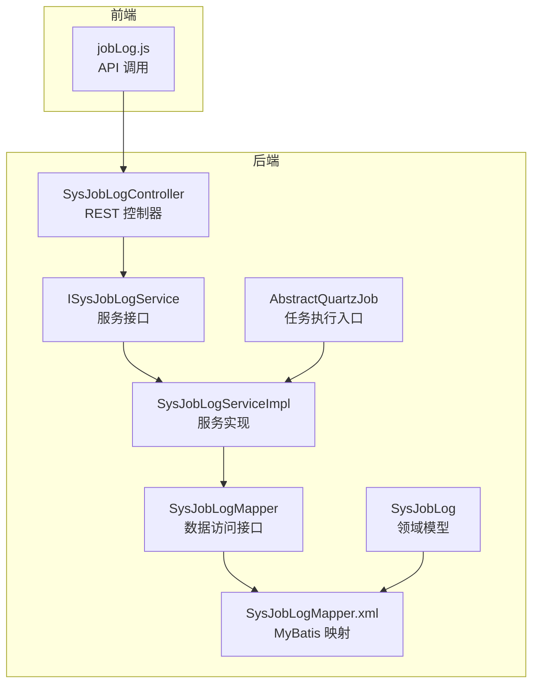
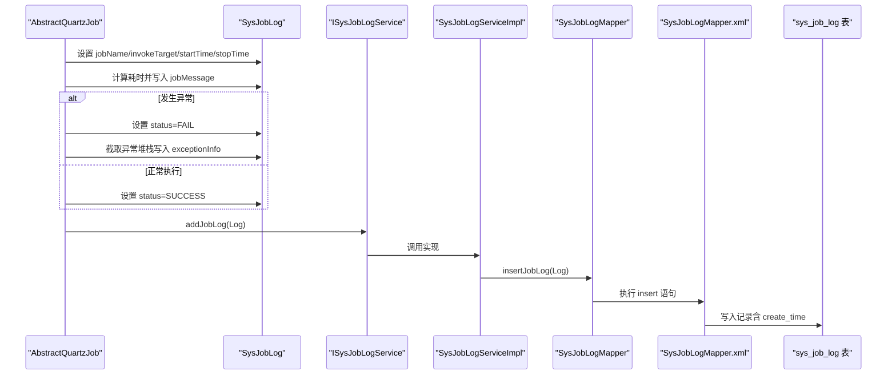
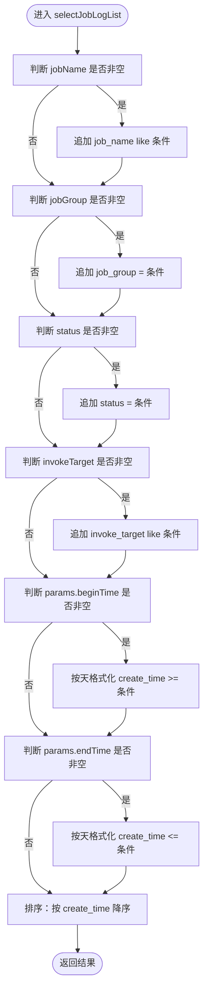
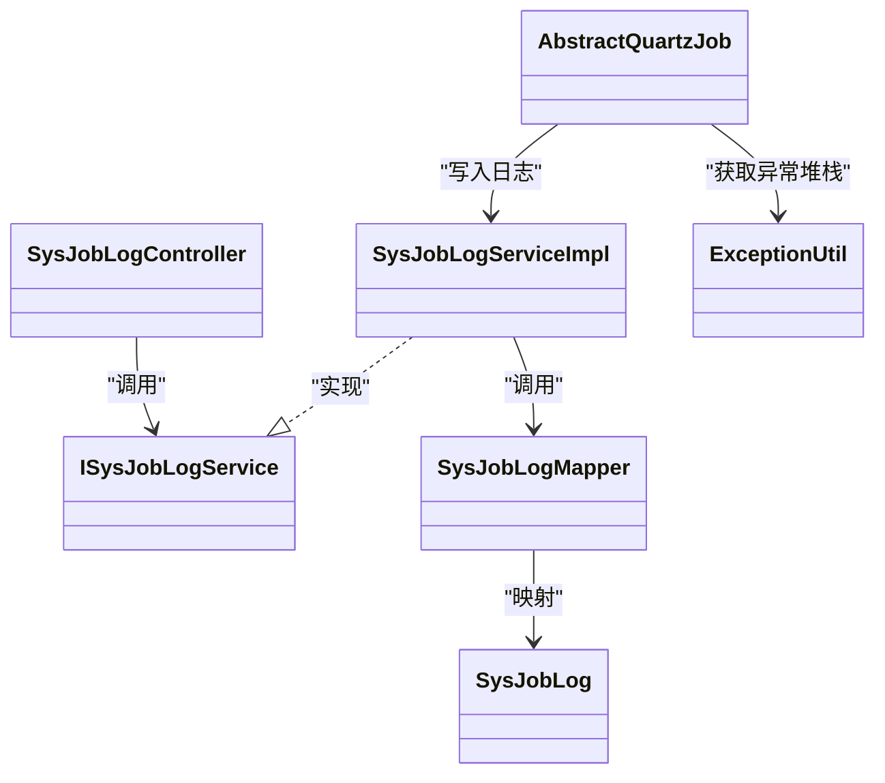

# 任务日志数据模型

<cite>
**本文引用的文件**
- [SysJobLog.java](file://bearjia-admin-backend/src/main/java/com/javaxiaobear/module/monitor/domain/SysJobLog.java)
- [SysJobLogMapper.java](file://bearjia-admin-backend/src/main/java/com/javaxiaobear/module/monitor/mapper/SysJobLogMapper.java)
- [SysJobLogMapper.xml](file://bearjia-admin-backend/src/main/resources/mybatis/system/SysJobLogMapper.xml)
- [ISysJobLogService.java](file://bearjia-admin-backend/src/main/java/com/javaxiaobear/module/monitor/service/ISysJobLogService.java)
- [SysJobLogServiceImpl.java](file://bearjia-admin-backend/src/main/java/com/javaxiaobear/module/monitor/service/impl/SysJobLogServiceImpl.java)
- [SysJobLogController.java](file://bearjia-admin-backend/src/main/java/com/javaxiaobear/module/monitor/controller/SysJobLogController.java)
- [AbstractQuartzJob.java](file://bearjia-admin-backend/src/main/java/com/javaxiaobear/base/common/utils/job/AbstractQuartzJob.java)
- [Constants.java](file://bearjia-admin-backend/src/main/java/com/javaxiaobear/base/common/constant/Constants.java)
- [ExceptionUtil.java](file://bearjia-admin-backend/src/main/java/com/javaxiaobear/base/common/utils/ExceptionUtil.java)
- [jobLog.js](file://bear-jia-vue3/src/api/monitor/jobLog.js)
- [bear_jia.sql](file://bearjia-admin-backend/src/main/resources/sql/bear_jia.sql)
</cite>

## 目录
1. [简介](#简介)
2. [项目结构](#项目结构)
3. [核心组件](#核心组件)
4. [架构总览](#架构总览)
5. [详细组件分析](#详细组件分析)
6. [依赖关系分析](#依赖关系分析)
7. [性能考量](#性能考量)
8. [故障排查指南](#故障排查指南)
9. [结论](#结论)

## 简介
本文件围绕任务日志数据模型 SysJobLog 进行系统化说明，覆盖字段语义与类型、任务执行过程信息格式、状态字段监控意义、异常堆栈存储与展示方式、开始/结束时间计算耗时的逻辑、MyBatis 映射文件中按任务名、状态、时间范围查询的 SQL 实现，并给出基于 startTime 字段建立索引以优化历史日志查询性能的建议。

## 项目结构
该功能涉及后端领域模型、持久层映射、服务层、控制层以及前端 API 调用，形成完整的任务日志采集、存储、查询与展示闭环。

图表来源
- [SysJobLogController.java](file://bearjia-admin-backend/src/main/java/com/javaxiaobear/module/monitor/controller/SysJobLogController.java#L1-L34)
- [ISysJobLogService.java](file://bearjia-admin-backend/src/main/java/com/javaxiaobear/module/monitor/service/ISysJobLogService.java#L1-L56)
- [SysJobLogServiceImpl.java](file://bearjia-admin-backend/src/main/java/com/javaxiaobear/module/monitor/service/impl/SysJobLogServiceImpl.java#L1-L87)
- [SysJobLogMapper.java](file://bearjia-admin-backend/src/main/java/com/javaxiaobear/module/monitor/mapper/SysJobLogMapper.java#L1-L64)
- [SysJobLogMapper.xml](file://bearjia-admin-backend/src/main/resources/mybatis/system/SysJobLogMapper.xml#L1-L94)
- [SysJobLog.java](file://bearjia-admin-backend/src/main/java/com/javaxiaobear/module/monitor/domain/SysJobLog.java#L1-L156)
- [AbstractQuartzJob.java](file://bearjia-admin-backend/src/main/java/com/javaxiaobear/base/common/utils/job/AbstractQuartzJob.java#L79-L107)
- [jobLog.js](file://bear-jia-vue3/src/api/monitor/jobLog.js#L1-L35)

章节来源
- [SysJobLogController.java](file://bearjia-admin-backend/src/main/java/com/javaxiaobear/module/monitor/controller/SysJobLogController.java#L1-L34)
- [SysJobLogServiceImpl.java](file://bearjia-admin-backend/src/main/java/com/javaxiaobear/module/monitor/service/impl/SysJobLogServiceImpl.java#L1-L87)
- [SysJobLogMapper.xml](file://bearjia-admin-backend/src/main/resources/mybatis/system/SysJobLogMapper.xml#L1-L94)
- [SysJobLog.java](file://bearjia-admin-backend/src/main/java/com/javaxiaobear/module/monitor/domain/SysJobLog.java#L1-L156)
- [AbstractQuartzJob.java](file://bearjia-admin-backend/src/main/java/com/javaxiaobear/base/common/utils/job/AbstractQuartzJob.java#L79-L107)
- [jobLog.js](file://bear-jia-vue3/src/api/monitor/jobLog.js#L1-L35)

## 核心组件
- SysJobLog：任务日志实体，包含日志主键、任务名、任务组、调用目标、日志信息、执行状态、异常信息、开始/结束时间等字段。
- SysJobLogMapper：数据访问接口，定义查询、插入、删除、清空等操作。
- SysJobLogMapper.xml：MyBatis 映射文件，完成 SQL 与实体的映射及条件查询。
- ISysJobLogService/SysJobLogServiceImpl：服务层接口与实现，封装业务逻辑。
- SysJobLogController：REST 控制器，暴露分页查询、导出、清理等接口。
- AbstractQuartzJob：Quartz 任务执行入口，负责在任务执行完成后写入日志并设置状态与耗时信息。
- jobLog.js：前端 API 封装，供页面调用后端接口。

章节来源
- [SysJobLog.java](file://bearjia-admin-backend/src/main/java/com/javaxiaobear/module/monitor/domain/SysJobLog.java#L1-L156)
- [SysJobLogMapper.java](file://bearjia-admin-backend/src/main/java/com/javaxiaobear/module/monitor/mapper/SysJobLogMapper.java#L1-L64)
- [SysJobLogMapper.xml](file://bearjia-admin-backend/src/main/resources/mybatis/system/SysJobLogMapper.xml#L1-L94)
- [ISysJobLogService.java](file://bearjia-admin-backend/src/main/java/com/javaxiaobear/module/monitor/service/ISysJobLogService.java#L1-L56)
- [SysJobLogServiceImpl.java](file://bearjia-admin-backend/src/main/java/com/javaxiaobear/module/monitor/service/impl/SysJobLogServiceImpl.java#L1-L87)
- [SysJobLogController.java](file://bearjia-admin-backend/src/main/java/com/javaxiaobear/module/monitor/controller/SysJobLogController.java#L1-L34)
- [AbstractQuartzJob.java](file://bearjia-admin-backend/src/main/java/com/javaxiaobear/base/common/utils/job/AbstractQuartzJob.java#L79-L107)
- [jobLog.js](file://bear-jia-vue3/src/api/monitor/jobLog.js#L1-L35)

## 架构总览
下面的序列图展示了从任务执行到日志入库的关键流程，包括状态设置、耗时计算、异常堆栈截取与入库。

图表来源
- [AbstractQuartzJob.java](file://bearjia-admin-backend/src/main/java/com/javaxiaobear/base/common/utils/job/AbstractQuartzJob.java#L79-L107)
- [ISysJobLogService.java](file://bearjia-admin-backend/src/main/java/com/javaxiaobear/module/monitor/service/ISysJobLogService.java#L1-L56)
- [SysJobLogServiceImpl.java](file://bearjia-admin-backend/src/main/java/com/javaxiaobear/module/monitor/service/impl/SysJobLogServiceImpl.java#L1-L87)
- [SysJobLogMapper.java](file://bearjia-admin-backend/src/main/java/com/javaxiaobear/module/monitor/mapper/SysJobLogMapper.java#L1-L64)
- [SysJobLogMapper.xml](file://bearjia-admin-backend/src/main/resources/mybatis/system/SysJobLogMapper.xml#L72-L92)
- [bear_jia.sql](file://bearjia-admin-backend/src/main/resources/sql/bear_jia.sql#L296-L307)

## 详细组件分析

### 字段定义与语义
- jobLogId：日志主键，自增，类型为整型；用于唯一标识每条日志记录。
- jobName：任务名称，类型为字符串；用于标识具体任务。
- jobGroup：任务组名，类型为字符串；用于对任务进行分组归类。
- invokeTarget：调用目标字符串，类型为字符串；记录任务的调用目标（如方法签名或表达式）。
- jobMessage：日志信息，类型为字符串；记录任务执行过程信息，格式为“任务名 + 总共耗时：xxx 毫秒”。
- status：执行状态，类型为字符串；0 表示正常，1 表示失败。
- exceptionInfo：异常信息，类型为字符串；存储异常堆栈文本，最大长度 2000。
- startTime：开始时间，类型为日期时间；记录任务开始执行的时间点。
- stopTime：停止时间，类型为日期时间；记录任务结束执行的时间点。
- createTime：创建时间，类型为日期时间；由 MyBatis 插入时写入。

章节来源
- [SysJobLog.java](file://bearjia-admin-backend/src/main/java/com/javaxiaobear/module/monitor/domain/SysJobLog.java#L18-L50)
- [SysJobLogMapper.xml](file://bearjia-admin-backend/src/main/resources/mybatis/system/SysJobLogMapper.xml#L7-L16)
- [bear_jia.sql](file://bearjia-admin-backend/src/main/resources/sql/bear_jia.sql#L296-L307)

### jobMessage 字段格式
- 写入逻辑：在任务执行完成后，计算 stopTime 与 startTime 的差值（毫秒），将“任务名 + 总共耗时：xxx 毫秒”的字符串写入 jobMessage。
- 用途：便于前端快速查看任务耗时，无需二次计算。

章节来源
- [AbstractQuartzJob.java](file://bearjia-admin-backend/src/main/java/com/javaxiaobear/base/common/utils/job/AbstractQuartzJob.java#L82-L83)

### status 字段的作用
- 取值约定：0 正常，1 失败。
- 写入逻辑：
  - 若执行过程中发生异常，则设置 status=FAIL；
  - 否则设置 status=SUCCESS。
- 监控意义：前端可据此筛选“失败”日志，定位异常任务；后端也可按状态进行统计与报表。

章节来源
- [AbstractQuartzJob.java](file://bearjia-admin-backend/src/main/java/com/javaxiaobear/base/common/utils/job/AbstractQuartzJob.java#L86-L93)
- [Constants.java](file://bearjia-admin-backend/src/main/java/com/javaxiaobear/base/common/constant/Constants.java#L46-L51)

### exceptionInfo 字段的存储与展示
- 存储策略：
  - 当发生异常时，使用工具类获取异常堆栈文本，并截取前 2000 字符写入 exceptionInfo；
  - 未发生异常时不写入异常信息。
- 展示建议：前端在日志详情中展示 exceptionInfo，以便快速定位问题根因。

章节来源
- [AbstractQuartzJob.java](file://bearjia-admin-backend/src/main/java/com/javaxiaobear/base/common/utils/job/AbstractQuartzJob.java#L87-L88)
- [ExceptionUtil.java](file://bearjia-admin-backend/src/main/java/com/javaxiaobear/base/common/utils/ExceptionUtil.java#L1-L39)
- [bear_jia.sql](file://bearjia-admin-backend/src/main/resources/sql/bear_jia.sql#L303-L304)

### startTime 与 stopTime 的耗时计算逻辑
- 计算方式：stopTime.getTime() - startTime.getTime()，单位为毫秒；
- 写入位置：作为 jobMessage 的一部分，直接写入数据库；
- 优点：避免重复计算，提升查询效率。

章节来源
- [AbstractQuartzJob.java](file://bearjia-admin-backend/src/main/java/com/javaxiaobear/base/common/utils/job/AbstractQuartzJob.java#L82-L83)

### MyBatis 查询实现（按任务名、状态、时间范围）
- 查询入口：Mapper 接口的 selectJobLogList 方法；
- 条件拼接：
  - jobName 支持模糊匹配；
  - jobGroup 精确匹配；
  - status 精确匹配；
  - invokeTarget 支持模糊匹配；
  - 时间范围通过 params.beginTime 与 params.endTime 控制，采用日期格式化后比较（按天粒度）。
- 排序：按 create_time 降序排列。

图表来源
- [SysJobLogMapper.xml](file://bearjia-admin-backend/src/main/resources/mybatis/system/SysJobLogMapper.xml#L23-L46)

章节来源
- [SysJobLogMapper.java](file://bearjia-admin-backend/src/main/java/com/javaxiaobear/module/monitor/mapper/SysJobLogMapper.java#L13-L20)
- [SysJobLogMapper.xml](file://bearjia-admin-backend/src/main/resources/mybatis/system/SysJobLogMapper.xml#L23-L46)

### 前端 API 与控制器
- 前端 API：提供分页查询、删除、清空、导出等接口；
- 控制器：接收请求，调用服务层，返回统一响应。

章节来源
- [jobLog.js](file://bear-jia-vue3/src/api/monitor/jobLog.js#L1-L35)
- [SysJobLogController.java](file://bearjia-admin-backend/src/main/java/com/javaxiaobear/module/monitor/controller/SysJobLogController.java#L1-L34)

## 依赖关系分析
- 控制层依赖服务层接口；
- 服务层实现依赖数据访问接口；
- 数据访问接口通过 MyBatis 映射文件与数据库交互；
- 任务执行入口在任务完成后写入日志；
- 异常工具类提供堆栈文本提取能力。

图表来源
- [SysJobLogController.java](file://bearjia-admin-backend/src/main/java/com/javaxiaobear/module/monitor/controller/SysJobLogController.java#L1-L34)
- [ISysJobLogService.java](file://bearjia-admin-backend/src/main/java/com/javaxiaobear/module/monitor/service/ISysJobLogService.java#L1-L56)
- [SysJobLogServiceImpl.java](file://bearjia-admin-backend/src/main/java/com/javaxiaobear/module/monitor/service/impl/SysJobLogServiceImpl.java#L1-L87)
- [SysJobLogMapper.java](file://bearjia-admin-backend/src/main/java/com/javaxiaobear/module/monitor/mapper/SysJobLogMapper.java#L1-L64)
- [SysJobLog.java](file://bearjia-admin-backend/src/main/java/com/javaxiaobear/module/monitor/domain/SysJobLog.java#L1-L156)
- [AbstractQuartzJob.java](file://bearjia-admin-backend/src/main/java/com/javaxiaobear/base/common/utils/job/AbstractQuartzJob.java#L79-L107)
- [ExceptionUtil.java](file://bearjia-admin-backend/src/main/java/com/javaxiaobear/base/common/utils/ExceptionUtil.java#L1-L39)

## 性能考量
- 查询性能瓶颈：当前按天粒度比较 create_time，且未对 startTime 建立索引，可能导致大表扫描开销较大。
- 建议：
  - 在数据库层面为 create_time 建立索引，以加速按时间范围的查询；
  - 如需按 startTime 查询历史日志，建议为 startTime 建立独立索引，或考虑复合索引（如 startTime + status 或 startTime + jobName）以覆盖常见查询模式；
  - 对于高频查询，可在应用层增加缓存策略（如 Redis）以降低数据库压力。

章节来源
- [SysJobLogMapper.xml](file://bearjia-admin-backend/src/main/resources/mybatis/system/SysJobLogMapper.xml#L38-L43)
- [bear_jia.sql](file://bearjia-admin-backend/src/main/resources/sql/bear_jia.sql#L296-L307)

## 故障排查指南
- 日志未入库：
  - 检查任务执行入口是否正确调用 addJobLog；
  - 核对 Mapper 的 insert 语句是否正确映射字段；
  - 查看异常堆栈是否被截断（长度限制为 2000）。
- 查询不到日志：
  - 确认查询参数（任务名、状态、时间范围）是否正确；
  - 检查 beginTime/endTime 的格式与边界；
  - 确认 create_time 是否正确写入。
- 异常信息为空：
  - 确认任务执行是否发生异常；
  - 检查异常堆栈提取逻辑与截断长度。

章节来源
- [AbstractQuartzJob.java](file://bearjia-admin-backend/src/main/java/com/javaxiaobear/base/common/utils/job/AbstractQuartzJob.java#L86-L88)
- [SysJobLogMapper.xml](file://bearjia-admin-backend/src/main/resources/mybatis/system/SysJobLogMapper.xml#L72-L92)
- [ExceptionUtil.java](file://bearjia-admin-backend/src/main/java/com/javaxiaobear/base/common/utils/ExceptionUtil.java#L1-L39)

## 结论
SysJobLog 数据模型完整地记录了定时任务的执行轨迹，通过 jobMessage 提供直观的耗时信息，status 字段用于快速识别失败任务，exceptionInfo 则承载异常堆栈以便快速定位问题。MyBatis 映射提供了灵活的多条件查询能力，但建议针对高频查询场景增加索引以提升性能。整体架构清晰、职责分明，便于维护与扩展。