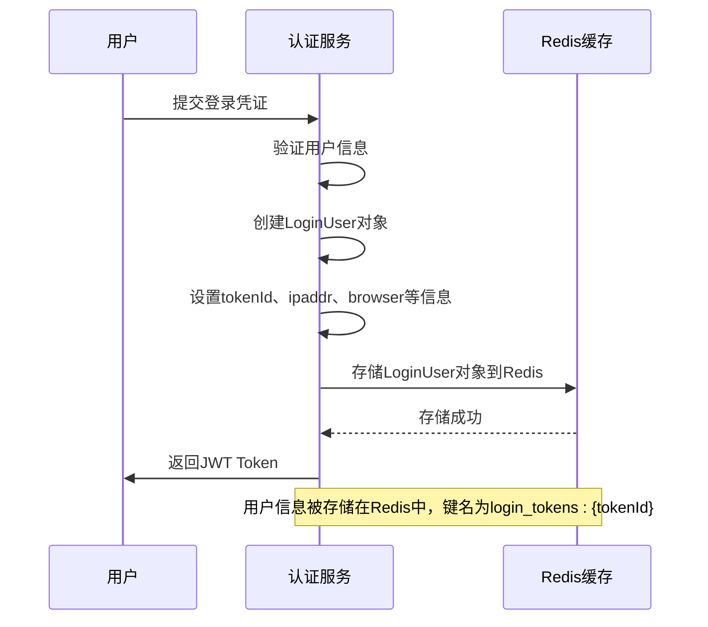
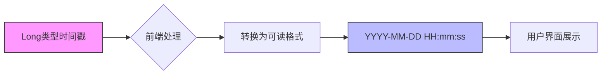
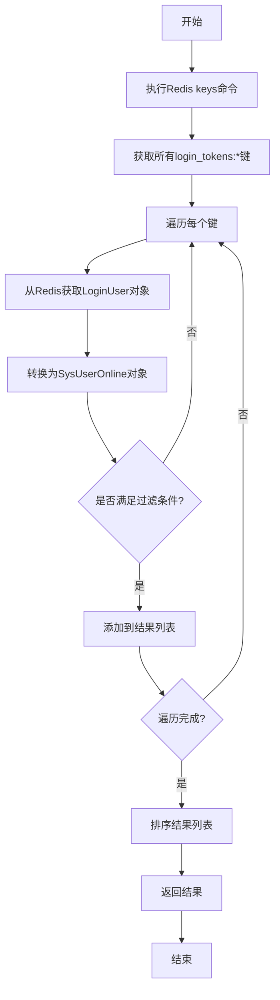

# 在线用户数据模型

<cite>
**本文档引用的文件**   
- [SysUserOnline.java](file://bearjia-admin-backend/src/main/java/com/javaxiaobear/module/monitor/domain/SysUserOnline.java)
- [SysUserOnlineController.java](file://bearjia-admin-backend/src/main/java/com/javaxiaobear/module/monitor/controller/SysUserOnlineController.java)
- [SysUserOnlineServiceImpl.java](file://bearjia-admin-backend/src/main/java/com/javaxiaobear/module/system/service/impl/SysUserOnlineServiceImpl.java)
- [ISysUserOnlineService.java](file://bearjia-admin-backend/src/main/java/com/javaxiaobear/module/system/service/ISysUserOnlineService.java)
- [TokenService.java](file://bearjia-admin-backend/src/main/java/com/javaxiaobear/base/framework/security/service/TokenService.java)
- [CacheConstants.java](file://bearjia-admin-backend/src/main/java/com/javaxiaobear/base/common/constant/CacheConstants.java)
- [online.js](file://bear-jia-vue3/src/api/monitor/online.js)
- [index.vue](file://bear-jia-vue3/src/views/monitor/online/index.vue)
</cite>

## 目录
1. [简介](#简介)
2. [核心字段定义](#核心字段定义)
3. [数据模型与Redis缓存的关系](#数据模型与redis缓存的关系)
4. [在线用户信息的提取与存储流程](#在线用户信息的提取与存储流程)
5. [时间戳处理机制](#时间戳处理机制)
6. [在线用户列表的获取机制](#在线用户列表的获取机制)
7. [与数据库用户信息的同步机制](#与数据库用户信息的同步机制)
8. [系统架构图](#系统架构图)

## 简介
在线用户数据模型（SysUserOnline）是系统用于监控和管理当前在线用户会话的核心实体。该模型不直接对应数据库表，而是作为Redis缓存中存储的会话信息的Java映射实体。通过该模型，系统能够实时监控用户登录状态、会话信息和活动情况，为系统管理员提供在线用户管理功能，包括查看在线用户列表和强制退出用户会话。

**Section sources**
- [SysUserOnline.java](file://bearjia-admin-backend/src/main/java/com/javaxiaobear/module/monitor/domain/SysUserOnline.java#L1-L114)

## 核心字段定义
在线用户数据模型包含以下核心字段，每个字段都有明确的业务用途：

- **tokenId**: 会话编号，唯一标识用户的登录会话，通常与JWT Token的UUID部分对应
- **deptName**: 部门名称，记录用户所属部门的名称，用于组织架构展示
- **userName**: 用户名称，记录登录用户的用户名，用于身份识别
- **ipaddr**: 登录IP地址，记录用户登录时的IP地址，用于安全审计和位置追踪
- **loginLocation**: 登录地址，通过IP地址解析得到的地理位置信息，如"北京市"或"上海市"
- **browser**: 浏览器类型，记录用户使用的浏览器名称，如"Chrome"、"Firefox"等
- **os**: 操作系统，记录用户使用的操作系统类型，如"Windows 10"、"macOS"等
- **loginTime**: 登录时间，记录用户登录的时间戳（Long类型），精确到毫秒

这些字段共同构成了完整的用户会话信息，为系统提供了全面的用户活动监控能力。

**Section sources**
- [SysUserOnline.java](file://bearjia-admin-backend/src/main/java/com/javaxiaobear/module/monitor/domain/SysUserOnline.java#L10-L32)

## 数据模型与Redis缓存的关系
在线用户数据模型与Redis缓存有着紧密的集成关系。系统使用Redis作为会话存储的首选方案，而不是传统的数据库表。所有在线用户的会话信息都存储在Redis中，以实现高性能的读写操作和快速的会话管理。

Redis中的键值结构遵循特定的命名规范，使用`login_tokens:`作为前缀，后接会话的唯一标识符。这种设计使得系统能够高效地管理和查询在线用户会话。当用户成功登录后，其会话信息会被序列化并存储在Redis中，同时设置适当的过期时间，确保会话的安全性和时效性。

**Section sources**
- [SysUserOnlineController.java](file://bearjia-admin-backend/src/main/java/com/javaxiaobear/module/monitor/controller/SysUserOnlineController.java#L45-L46)
- [CacheConstants.java](file://bearjia-admin-backend/src/main/java/com/javaxiaobear/base/common/constant/CacheConstants.java#L13-L13)

## 在线用户信息的提取与存储流程
在线用户信息的提取与存储是一个自动化的过程，主要通过JWT Token和Session机制实现。当用户成功登录后，系统会创建一个包含用户信息的LoginUser对象，并将其存储在Redis缓存中。

信息提取的主要来源包括：
- HTTP请求头中的User-Agent字段，用于识别浏览器和操作系统
- 客户端IP地址，通过请求获取并解析为地理位置
- 用户认证信息，从数据库中获取用户的基本信息和部门信息

存储流程如下：首先生成唯一的会话令牌（tokenId），然后将用户信息、设备信息和登录时间等数据封装到LoginUser对象中，最后将该对象序列化存储到Redis中，键名为`login_tokens:`加上会话令牌。



**Diagram sources**
- [TokenService.java](file://bearjia-admin-backend/src/main/java/com/javaxiaobear/base/framework/security/service/TokenService.java#L114-L154)
- [SysUserOnlineServiceImpl.java](file://bearjia-admin-backend/src/main/java/com/javaxiaobear/module/system/service/impl/SysUserOnlineServiceImpl.java#L76-L95)

**Section sources**
- [TokenService.java](file://bearjia-admin-backend/src/main/java/com/javaxiaobear/base/framework/security/service/TokenService.java#L114-L154)
- [SysUserOnlineServiceImpl.java](file://bearjia-admin-backend/src/main/java/com/javaxiaobear/module/system/service/impl/SysUserOnlineServiceImpl.java#L76-L95)

## 时间戳处理机制
loginTime字段记录的是Long类型的毫秒级时间戳，这是系统内部存储时间的标准格式。这种设计确保了时间数据的精确性和跨平台兼容性。

前端在展示时间信息时，会将原始时间戳转换为可读的日期时间格式。转换过程通常在前端JavaScript中完成，使用日期处理库（如day.js）将时间戳转换为"YYYY-MM-DD HH:mm:ss"格式的字符串。这种分离的设计模式使得后端专注于数据存储和业务逻辑，而前端负责用户体验和数据展示。



**Diagram sources**
- [SysUserOnline.java](file://bearjia-admin-backend/src/main/java/com/javaxiaobear/module/monitor/domain/SysUserOnline.java#L31-L32)
- [index.vue](file://bear-jia-vue3/src/views/monitor/online/index.vue)

**Section sources**
- [SysUserOnline.java](file://bearjia-admin-backend/src/main/java/com/javaxiaobear/module/monitor/domain/SysUserOnline.java#L31-L32)

## 在线用户列表的获取机制
系统通过遍历Redis中的Token来获取所有在线用户列表。具体实现方式是使用Redis的keys命令匹配特定前缀的所有键，然后逐个获取对应的会话信息。

获取流程如下：
1. 使用`login_tokens:*`模式匹配所有在线用户会话的键
2. 遍历每个匹配的键，从Redis中获取对应的LoginUser对象
3. 将LoginUser对象转换为SysUserOnline对象，提取必要的显示信息
4. 对结果列表进行排序和过滤，最后返回给前端

这个过程在SysUserOnlineController的list方法中实现，支持按IP地址和用户名进行过滤查询，提高了查询的灵活性和实用性。



**Diagram sources**
- [SysUserOnlineController.java](file://bearjia-admin-backend/src/main/java/com/javaxiaobear/module/monitor/controller/SysUserOnlineController.java#L45-L69)

**Section sources**
- [SysUserOnlineController.java](file://bearjia-admin-backend/src/main/java/com/javaxiaobear/module/monitor/controller/SysUserOnlineController.java#L45-L69)

## 与数据库用户信息的同步机制
在线用户数据模型与数据库中的用户信息保持动态同步。当用户登录时，系统会从数据库中读取用户的最新信息，包括用户名、部门名称等，并将其与会话信息一起存储在Redis中。

同步机制的关键特点包括：
- **登录时同步**: 每次用户登录都会从数据库获取最新用户信息
- **只读快照**: Redis中存储的是登录时刻的用户信息快照，不会实时更新
- **变更感知**: 当用户信息在数据库中发生变更后，只有在用户下次登录时才会反映到在线用户信息中
- **部门信息关联**: deptName字段通过用户对象的部门关联获取，确保组织架构信息的准确性

这种设计平衡了性能和数据一致性，避免了频繁的数据库查询，同时确保了会话期间信息的稳定性。

```mermaid
classDiagram
class SysUserOnline {
+String tokenId
+String deptName
+String userName
+String ipaddr
+String loginLocation
+String browser
+String os
+Long loginTime
}
class LoginUser {
+String token
+String username
+String ipaddr
+String loginLocation
+String browser
+String os
+Long loginTime
+SysUser user
}
class SysUser {
+String userName
+SysDept dept
}
class SysDept {
+String deptName
}
SysUserOnline --> LoginUser : "转换"
LoginUser --> SysUser : "关联"
SysUser --> SysDept : "所属部门"
note right of SysUserOnline : 在线用户数据模型<br/>不直接对应数据库表<br/>Redis会话信息的Java映射
```

**Diagram sources**
- [SysUserOnline.java](file://bearjia-admin-backend/src/main/java/com/javaxiaobear/module/monitor/domain/SysUserOnline.java#L8-L114)
- [SysUserOnlineServiceImpl.java](file://bearjia-admin-backend/src/main/java/com/javaxiaobear/module/system/service/impl/SysUserOnlineServiceImpl.java#L76-L95)

**Section sources**
- [SysUserOnlineServiceImpl.java](file://bearjia-admin-backend/src/main/java/com/javaxiaobear/module/system/service/impl/SysUserOnlineServiceImpl.java#L76-L95)

## 系统架构图
以下架构图展示了在线用户数据模型在整个系统中的位置和交互关系：

```mermaid
graph TB
subgraph "前端"
A[Vue前端界面]
B[在线用户列表]
C[用户详情弹窗]
end
subgraph "后端"
D[在线用户控制器]
E[在线用户服务]
F[Token服务]
end
subgraph "数据存储"
G[Redis缓存]
H[MySQL数据库]
end
A --> D: HTTP请求
D --> E: 业务逻辑处理
E --> G: 读取会话数据
F --> G: 存储会话数据
G --> H: 查询用户信息
H --> G: 返回用户数据
G --> E: 返回会话数据
E --> D: 返回处理结果
D --> A: 返回响应数据
style G fill:#ffcc00,stroke:#333
style H fill:#00ccff,stroke:#333
click G "Redis中的数据结构" "Redis存储了所有在线用户的会话信息"
click H "数据库中的用户表" "存储了用户的基本信息和部门关系"
```

**Diagram sources**
- [SysUserOnlineController.java](file://bearjia-admin-backend/src/main/java/com/javaxiaobear/module/monitor/controller/SysUserOnlineController.java#L31-L84)
- [TokenService.java](file://bearjia-admin-backend/src/main/java/com/javaxiaobear/base/framework/security/service/TokenService.java#L32-L231)

**Section sources**
- [SysUserOnlineController.java](file://bearjia-admin-backend/src/main/java/com/javaxiaobear/module/monitor/controller/SysUserOnlineController.java#L31-L84)
- [TokenService.java](file://bearjia-admin-backend/src/main/java/com/javaxiaobear/base/framework/security/service/TokenService.java#L32-L231)