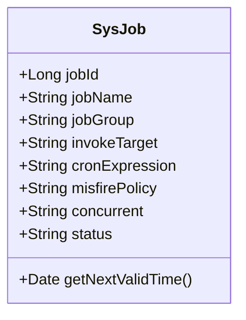
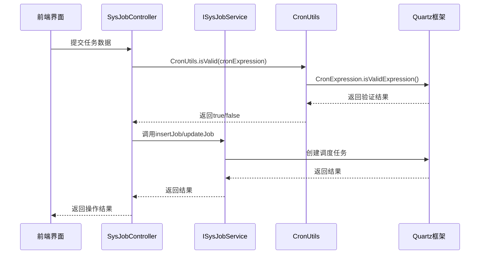
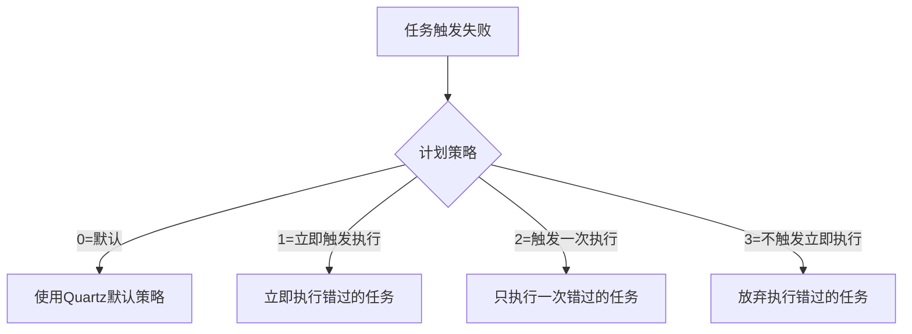
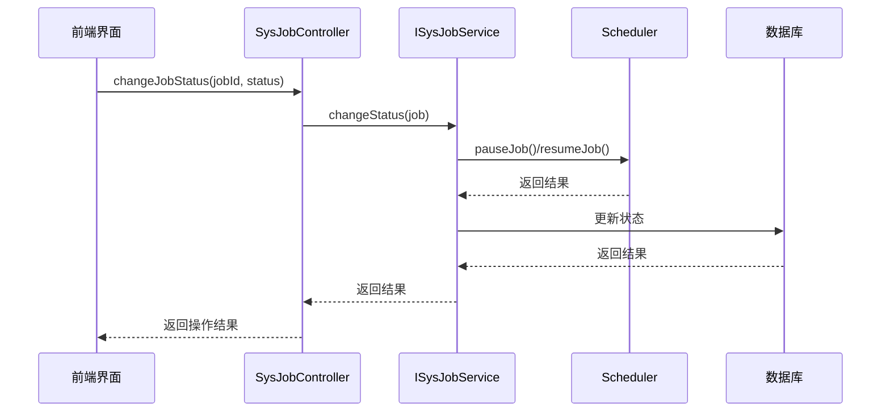
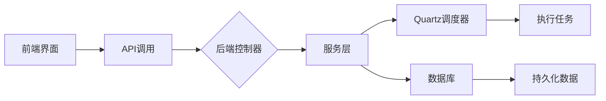

# 定时任务数据模型

<cite>
**本文档引用的文件**  
- [SysJob.java](file://bearjia-admin-backend/src/main/java/com/javaxiaobear/module/monitor/domain/SysJob.java)
- [ScheduleConstants.java](file://bearjia-admin-backend/src/main/java/com/javaxiaobear/base/common/constant/ScheduleConstants.java)
- [CronUtils.java](file://bearjia-admin-backend/src/main/java/com/javaxiaobear/base/common/utils/job/CronUtils.java)
- [ScheduleUtils.java](file://bearjia-admin-backend/src/main/java/com/javaxiaobear/base/common/utils/job/ScheduleUtils.java)
- [Constants.java](file://bearjia-admin-backend/src/main/java/com/javaxiaobear/base/common/constant/Constants.java)
- [SysJobController.java](file://bearjia-admin-backend/src/main/java/com/javaxiaobear/module/monitor/controller/SysJobController.java)
- [ISysJobService.java](file://bearjia-admin-backend/src/main/java/com/javaxiaobear/module/monitor/service/ISysJobService.java)
- [index.vue](file://bear-jia-vue3/src/views/monitor/job/index.vue)
- [job.js](file://bear-jia-vue3/src/api/monitor/job.js)
</cite>

## 目录
1. [简介](#简介)
2. [核心字段定义与约束](#核心字段定义与约束)
3. [调用目标字符串格式](#调用目标字符串格式)
4. [Cron表达式语法与Quartz应用](#cron表达式语法与quartz应用)
5. [计划策略（misfirePolicy）机制](#计划策略misfirepolicy机制)
6. [数据验证规则](#数据验证规则)
7. [下一次执行时间计算](#下一次执行时间计算)
8. [任务状态变更流程](#任务状态变更流程)
9. [前后端交互流程](#前后端交互流程)

## 简介
定时任务数据模型（SysJob）是系统中用于管理后台定时调度任务的核心实体类。该模型定义了任务的调度规则、执行目标、并发策略、状态控制等关键属性，基于Quartz调度框架实现。通过该模型，系统能够灵活配置和管理各类周期性任务，如数据同步、报表生成、缓存清理等。

**本节无直接分析的源文件**

## 核心字段定义与约束
SysJob实体类包含多个关键字段，每个字段都有明确的业务含义和数据约束：

- **jobId**：任务唯一标识，主键字段，由系统自动生成。
- **jobName**：任务名称，用于标识任务的可读名称，不能为空，最大长度64字符。
- **jobGroup**：任务组名，用于对任务进行分类管理，支持按组操作。
- **invokeTarget**：调用目标字符串，定义任务执行的具体方法和参数，不能为空，最大长度500字符。
- **cronExpression**：Cron表达式，定义任务的调度规则，不能为空，最大长度255字符。
- **misfirePolicy**：计划策略，定义任务触发失败时的处理机制，默认值为"0"（默认策略）。
- **concurrent**：是否允许并发执行，"0"表示允许，"1"表示禁止。
- **status**：任务状态，"0"表示正常，"1"表示暂停。



**图表来源**  
- [SysJob.java](file://bearjia-admin-backend/src/main/java/com/javaxiaobear/module/monitor/domain/SysJob.java#L25-L171)

**本节来源**  
- [SysJob.java](file://bearjia-admin-backend/src/main/java/com/javaxiaobear/module/monitor/domain/SysJob.java#L25-L171)

## 调用目标字符串格式
invokeTarget字段定义了定时任务的具体执行目标，其格式遵循特定的规则：

调用目标字符串的格式为：`类名.方法名(参数类型列表)`，其中：
- 类名：完整的Java类名（包含包名）
- 方法名：类中定义的方法名称
- 参数类型列表：方法参数的完整类型名，多个参数用逗号分隔

系统对调用目标字符串进行了严格的安全校验：
1. 禁止使用RMI调用（包含"rmi:"）
2. 禁止使用LDAP调用（包含"ldap:"或"ldaps:"）
3. 禁止使用HTTP调用（包含"http://"或"https://"）
4. 禁止使用危险类（如java.net.URL、javax.naming.InitialContext等）
5. 必须在白名单包名内（如com.javaxiaobear.base.framework.task）

这些安全限制通过Constants类中的JOB_WHITELIST_STR和JOB_ERROR_STR常量定义，并在ScheduleUtils的whiteList方法中进行校验。

**本节来源**  
- [SysJob.java](file://bearjia-admin-backend/src/main/java/com/javaxiaobear/module/monitor/domain/SysJob.java#L37-L39)
- [Constants.java](file://bearjia-admin-backend/src/main/java/com/javaxiaobear/base/common/constant/Constants.java#L166-L172)
- [ScheduleUtils.java](file://bearjia-admin-backend/src/main/java/com/javaxiaobear/base/common/utils/job/ScheduleUtils.java#L128-L140)

## Cron表达式语法与Quartz应用
cronExpression字段使用标准的Cron表达式语法来定义任务的调度规则。Cron表达式由6或7个字段组成，分别表示秒、分、小时、日、月、周和年（可选）。

Quartz框架提供了强大的Cron表达式解析和调度功能：
- 使用CronExpression类验证表达式的有效性
- 使用CronScheduleBuilder构建调度计划
- 支持复杂的调度规则，如每隔5分钟、每月最后一天等

系统通过CronUtils工具类封装了Quartz的相关功能，提供简单的API供业务代码调用。在任务创建和修改时，系统会自动验证Cron表达式的有效性，确保调度规则的正确性。



**图表来源**  
- [CronUtils.java](file://bearjia-admin-backend/src/main/java/com/javaxiaobear/base/common/utils/job/CronUtils.java#L21-L23)
- [SysJobController.java](file://bearjia-admin-backend/src/main/java/com/javaxiaobear/module/monitor/controller/SysJobController.java#L85-L87)
- [ISysJobService.java](file://bearjia-admin-backend/src/main/java/com/javaxiaobear/module/monitor/service/ISysJobService.java#L101)

**本节来源**  
- [CronUtils.java](file://bearjia-admin-backend/src/main/java/com/javaxiaobear/base/common/utils/job/CronUtils.java#L21-L42)
- [SysJobController.java](file://bearjia-admin-backend/src/main/java/com/javaxiaobear/module/monitor/controller/SysJobController.java#L85-L87)

## 计划策略（misfirePolicy）机制
misfirePolicy字段定义了当任务触发失败时的处理机制。系统提供了四种不同的计划策略：

- **0=默认**：使用Quartz的默认处理策略
- **1=立即触发执行**：立即执行错过的任务
- **2=触发一次执行**：只执行一次错过的任务
- **3=不触发立即执行**：放弃执行错过的任务

这些策略通过ScheduleConstants常量类定义，并在ScheduleUtils的handleCronScheduleMisfirePolicy方法中转换为Quartz框架对应的处理指令。不同的策略适用于不同的业务场景：
- 对于实时性要求高的任务，可以使用"立即触发执行"
- 对于只需要执行一次的任务，可以使用"触发一次执行"
- 对于可以容忍丢失的任务，可以使用"不触发立即执行"



**图表来源**  
- [ScheduleConstants.java](file://bearjia-admin-backend/src/main/java/com/javaxiaobear/base/common/constant/ScheduleConstants.java#L16-L25)
- [ScheduleUtils.java](file://bearjia-admin-backend/src/main/java/com/javaxiaobear/base/common/utils/job/ScheduleUtils.java#L106-L118)

**本节来源**  
- [ScheduleConstants.java](file://bearjia-admin-backend/src/main/java/com/javaxiaobear/base/common/constant/ScheduleConstants.java#L16-L25)
- [SysJob.java](file://bearjia-admin-backend/src/main/java/com/javaxiaobear/module/monitor/domain/SysJob.java#L45-L47)
- [ScheduleUtils.java](file://bearjia-admin-backend/src/main/java/com/javaxiaobear/base/common/utils/job/ScheduleUtils.java#L103-L119)

## 数据验证规则
系统使用JSR-303校验注解对任务数据进行严格的验证，确保数据的完整性和正确性：

- **@NotBlank**：用于验证jobName、invokeTarget、cronExpression字段不能为空
- **@Size**：用于限制字段长度，jobName最大64字符，invokeTarget最大500字符，cronExpression最大255字符

这些验证规则直接在SysJob实体类的getter方法上声明，确保在任务创建和修改时自动进行验证。此外，系统还在控制器层进行了额外的业务验证：
- 验证Cron表达式是否有效
- 验证调用目标字符串的安全性
- 验证调用目标是否在白名单内

这种多层次的验证机制有效防止了非法数据的输入，保障了系统的稳定运行。

**本节来源**  
- [SysJob.java](file://bearjia-admin-backend/src/main/java/com/javaxiaobear/module/monitor/domain/SysJob.java#L67-L111)
- [SysJobController.java](file://bearjia-admin-backend/src/main/java/com/javaxiaobear/module/monitor/controller/SysJobController.java#L85-L108)

## 下一次执行时间计算
getNextValidTime()方法用于计算任务的下一次执行时间。该方法通过CronUtils工具类的getNextExecution方法实现：

```java
public Date getNextValidTime() {
    if (StringUtils.isNotEmpty(cronExpression)) {
        return CronUtils.getNextExecution(cronExpression);
    }
    return null;
}
```

该方法的工作流程如下：
1. 检查cronExpression是否为空
2. 如果不为空，调用CronUtils.getNextExecution方法
3. CronUtils使用Quartz的CronExpression类解析表达式
4. 获取当前时间之后的下一个有效执行时间
5. 返回计算结果

这个功能在前端界面中用于显示任务的下一次执行时间，帮助用户直观地了解任务的调度计划。

**本节来源**  
- [SysJob.java](file://bearjia-admin-backend/src/main/java/com/javaxiaobear/module/monitor/domain/SysJob.java#L114-L121)
- [CronUtils.java](file://bearjia-admin-backend/src/main/java/com/javaxiaobear/base/common/utils/job/CronUtils.java#L51-L61)

## 任务状态变更流程
任务状态（status）的变更通过专门的接口实现，确保状态变更与调度器同步：

状态变更流程如下：
1. 前端调用/changeStatus接口
2. 控制器调用服务层的changeStatus方法
3. 服务层根据新状态执行相应操作：
   - 如果状态为"暂停"，调用scheduler.pauseJob()
   - 如果状态为"正常"，调用scheduler.resumeJob()
4. 更新数据库中的任务状态

这种设计确保了内存中的调度状态与数据库中的持久化状态保持一致，避免了状态不一致的问题。



**图表来源**  
- [SysJobController.java](file://bearjia-admin-backend/src/main/java/com/javaxiaobear/module/monitor/controller/SysJobController.java#L154-L159)
- [ISysJobService.java](file://bearjia-admin-backend/src/main/java/com/javaxiaobear/module/monitor/service/ISysJobService.java#L69)

**本节来源**  
- [SysJobController.java](file://bearjia-admin-backend/src/main/java/com/javaxiaobear/module/monitor/controller/SysJobController.java#L154-L159)
- [ISysJobService.java](file://bearjia-admin-backend/src/main/java/com/javaxiaobear/module/monitor/service/ISysJobService.java#L69)

## 前后端交互流程
系统通过RESTful API实现前后端的数据交互，主要流程如下：

1. **数据展示**：前端通过/list接口获取任务列表，在表格中展示
2. **新增任务**：前端填写表单，通过POST /monitor/job创建任务
3. **修改任务**：前端编辑任务，通过PUT /monitor/job更新任务
4. **状态变更**：前端点击状态开关，通过PUT /monitor/job/changeStatus修改状态
5. **立即执行**：前端点击"立即执行"按钮，通过PUT /monitor/job/run触发任务
6. **删除任务**：前端选择任务，通过DELETE /monitor/job/{jobIds}删除任务

前端使用Vue3和Ant Design Vue组件库构建用户界面，通过ProTable组件封装了表格的通用功能，提高了开发效率。



**图表来源**  
- [index.vue](file://bear-jia-vue3/src/views/monitor/job/index.vue)
- [job.js](file://bear-jia-vue3/src/api/monitor/job.js)
- [SysJobController.java](file://bearjia-admin-backend/src/main/java/com/javaxiaobear/module/monitor/controller/SysJobController.java)

**本节来源**  
- [index.vue](file://bear-jia-vue3/src/views/monitor/job/index.vue)
- [job.js](file://bear-jia-vue3/src/api/monitor/job.js)
- [SysJobController.java](file://bearjia-admin-backend/src/main/java/com/javaxiaobear/module/monitor/controller/SysJobController.java)