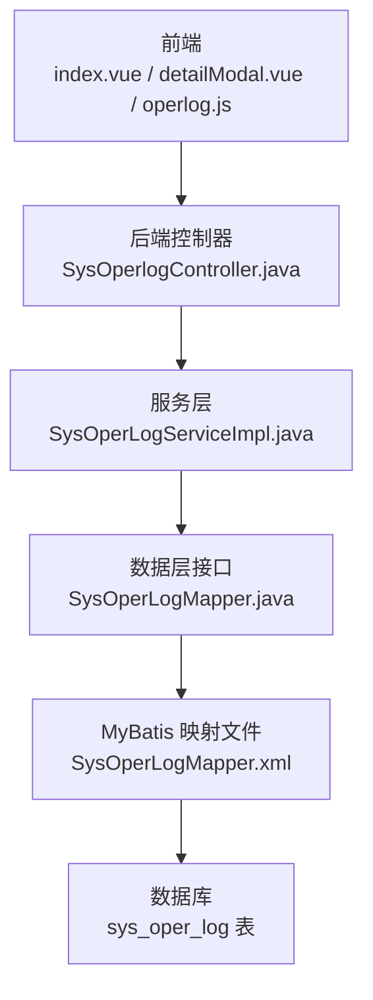
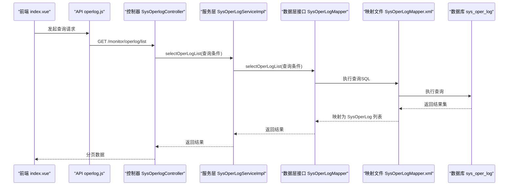
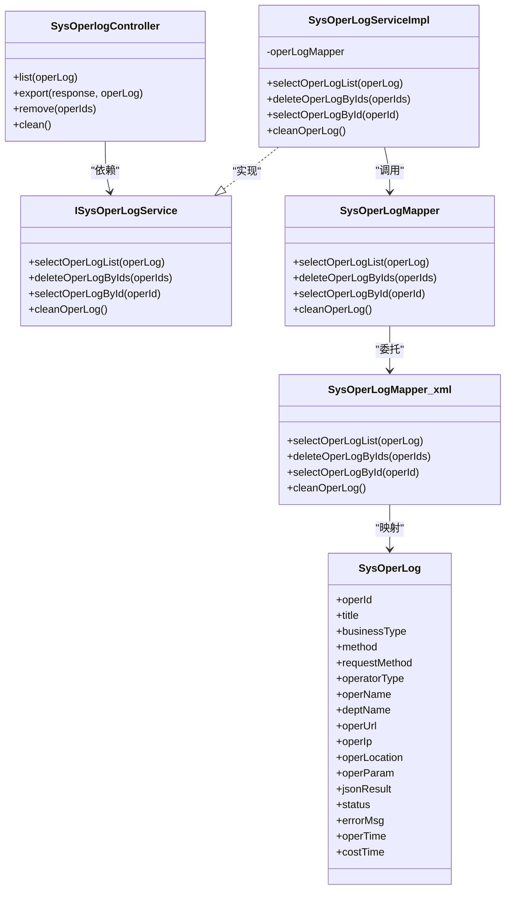

# 操作日志数据模型

<cite>
**本文引用的文件**
- [SysOperLog.java](file://bearjia-admin-backend/src/main/java/com/javaxiaobear/module/monitor/domain/SysOperLog.java)
- [SysOperLogMapper.java](file://bearjia-admin-backend/src/main/java/com/javaxiaobear/module/monitor/mapper/SysOperLogMapper.java)
- [SysOperLogMapper.xml](file://bearjia-admin-backend/src/main/resources/mybatis/monitor/SysOperLogMapper.xml)
- [SysOperlogController.java](file://bearjia-admin-backend/src/main/java/com/javaxiaobear/module/monitor/controller/SysOperlogController.java)
- [SysOperLogServiceImpl.java](file://bearjia-admin-backend/src/main/java/com/javaxiaobear/module/monitor/service/impl/SysOperLogServiceImpl.java)
- [operlog.js](file://bear-jia-vue3/src/api/monitor/operlog.js)
- [index.vue](file://bear-jia-vue3/src/views/monitor/operlog/index.vue)
- [detailModal.vue](file://bear-jia-vue3/src/views/monitor/operlog/detailModal.vue)
- [bear_jia.sql](file://bearjia-admin-backend/src/main/resources/sql/bear_jia.sql)
</cite>

## 目录
1. [简介](#简介)
2. [项目结构](#项目结构)
3. [核心组件](#核心组件)
4. [架构总览](#架构总览)
5. [详细组件分析](#详细组件分析)
6. [依赖关系分析](#依赖关系分析)
7. [性能考量](#性能考量)
8. [故障排查指南](#故障排查指南)
9. [结论](#结论)
10. [附录](#附录)

## 简介
本文件围绕操作日志数据模型 SysOperLog 进行系统化文档化说明，覆盖字段语义与数据类型、业务类型与操作类别的枚举含义、请求与响应数据的序列化策略、MyBatis 复杂查询条件的 SQL 实现、基于 costTime 的性能监控与慢操作分析方法，以及针对 operTime 与 businessType 字段的复合索引优化建议。文档同时结合前端展示与后端服务层、数据层的交互流程，帮助读者从全栈视角理解该模型的设计与使用。

## 项目结构
- 后端（Spring Boot + MyBatis）
  - 实体类：SysOperLog.java
  - 映射接口：SysOperLogMapper.java
  - 映射文件：SysOperLogMapper.xml
  - 控制器：SysOperlogController.java
  - 服务实现：SysOperLogServiceImpl.java
  - 数据库脚本：bear_jia.sql（包含 sys_oper_log 表结构与索引）
- 前端（Vue3 + Ant Design Vue）
  - API 调用：operlog.js
  - 列表页：index.vue
  - 详情弹窗：detailModal.vue

图表来源
- [SysOperlogController.java](file://bearjia-admin-backend/src/main/java/com/javaxiaobear/module/monitor/controller/SysOperlogController.java#L31-L69)
- [SysOperLogServiceImpl.java](file://bearjia-admin-backend/src/main/java/com/javaxiaobear/module/monitor/service/impl/SysOperLogServiceImpl.java#L1-L76)
- [SysOperLogMapper.java](file://bearjia-admin-backend/src/main/java/com/javaxiaobear/module/monitor/mapper/SysOperLogMapper.java#L1-L48)
- [SysOperLogMapper.xml](file://bearjia-admin-backend/src/main/resources/mybatis/monitor/SysOperLogMapper.xml#L1-L87)
- [bear_jia.sql](file://bearjia-admin-backend/src/main/resources/sql/bear_jia.sql#L560-L580)

章节来源
- [SysOperLog.java](file://bearjia-admin-backend/src/main/java/com/javaxiaobear/module/monitor/domain/SysOperLog.java#L1-L270)
- [SysOperLogMapper.xml](file://bearjia-admin-backend/src/main/resources/mybatis/monitor/SysOperLogMapper.xml#L1-L87)
- [SysOperlogController.java](file://bearjia-admin-backend/src/main/java/com/javaxiaobear/module/monitor/controller/SysOperlogController.java#L31-L69)
- [index.vue](file://bear-jia-vue3/src/views/monitor/operlog/index.vue#L1-L119)
- [detailModal.vue](file://bear-jia-vue3/src/views/monitor/operlog/detailModal.vue#L1-L132)

## 核心组件
- 实体类 SysOperLog：承载操作日志的所有字段，包含业务类型、操作类别、请求与响应数据、状态与错误信息、时间与耗时等。
- 数据层接口与实现：SysOperLogMapper 定义 CRUD 与查询方法；SysOperLogServiceImpl 提供服务层封装。
- MyBatis 映射：SysOperLogMapper.xml 完成字段映射与复杂查询条件拼接。
- 前端交互：index.vue 作为列表页，detailModal.vue 展示详情；operlog.js 提供 API 调用。

章节来源
- [SysOperLog.java](file://bearjia-admin-backend/src/main/java/com/javaxiaobear/module/monitor/domain/SysOperLog.java#L1-L270)
- [SysOperLogMapper.java](file://bearjia-admin-backend/src/main/java/com/javaxiaobear/module/monitor/mapper/SysOperLogMapper.java#L1-L48)
- [SysOperLogMapper.xml](file://bearjia-admin-backend/src/main/resources/mybatis/monitor/SysOperLogMapper.xml#L1-L87)
- [SysOperlogController.java](file://bearjia-admin-backend/src/main/java/com/javaxiaobear/module/monitor/controller/SysOperlogController.java#L31-L69)
- [operlog.js](file://bear-jia-vue3/src/api/monitor/operlog.js#L1-L35)
- [index.vue](file://bear-jia-vue3/src/views/monitor/operlog/index.vue#L1-L119)
- [detailModal.vue](file://bear-jia-vue3/src/views/monitor/operlog/detailModal.vue#L1-L132)

## 架构总览
后端通过控制器接收前端请求，调用服务层，再由数据层接口与 MyBatis 映射文件访问数据库。前端通过 API 组件与控制器交互，列表页负责筛选与分页，详情页展示字段值。

图表来源
- [operlog.js](file://bear-jia-vue3/src/api/monitor/operlog.js#L1-L35)
- [SysOperlogController.java](file://bearjia-admin-backend/src/main/java/com/javaxiaobear/module/monitor/controller/SysOperlogController.java#L31-L69)
- [SysOperLogServiceImpl.java](file://bearjia-admin-backend/src/main/java/com/javaxiaobear/module/monitor/service/impl/SysOperLogServiceImpl.java#L1-L76)
- [SysOperLogMapper.java](file://bearjia-admin-backend/src/main/java/com/javaxiaobear/module/monitor/mapper/SysOperLogMapper.java#L1-L48)
- [SysOperLogMapper.xml](file://bearjia-admin-backend/src/main/resources/mybatis/monitor/SysOperLogMapper.xml#L37-L69)

## 详细组件分析

### 数据模型字段详解
- operId：日志主键，Long 类型，自增。
- title：模块标题，String，用于标识业务模块或功能名称。
- businessType：业务类型，Integer，枚举值见“业务类型与操作类别的枚举”。
- method：方法名称，String，记录触发该日志的完整方法签名。
- requestMethod：请求方式，String，如 GET/POST/PUT/DELETE。
- operatorType：操作类别，Integer，枚举值见“业务类型与操作类别的枚举”。
- operName：操作人员，String。
- deptName：部门名称，String。
- operUrl：请求 URL，String。
- operIp：主机地址，String。
- operLocation：操作地点，String。
- operParam：请求参数，String，记录请求体或查询参数的序列化字符串。
- jsonResult：返回参数，String，记录响应体的序列化字符串。
- status：操作状态，Integer，0 正常、1 异常。
- errorMsg：错误消息，String，异常时记录。
- operTime：操作时间，Date，精确到秒或毫秒。
- costTime：消耗时间，Long，单位毫秒。

字段来源与类型依据
- 实体类字段定义与注解：[SysOperLog.java](file://bearjia-admin-backend/src/main/java/com/javaxiaobear/module/monitor/domain/SysOperLog.java#L1-L270)
- MyBatis 映射字段：[SysOperLogMapper.xml](file://bearjia-admin-backend/src/main/resources/mybatis/monitor/SysOperLogMapper.xml#L7-L25)
- 数据库表结构与索引：[bear_jia.sql](file://bearjia-admin-backend/src/main/resources/sql/bear_jia.sql#L560-L580)

章节来源
- [SysOperLog.java](file://bearjia-admin-backend/src/main/java/com/javaxiaobear/module/monitor/domain/SysOperLog.java#L1-L270)
- [SysOperLogMapper.xml](file://bearjia-admin-backend/src/main/resources/mybatis/monitor/SysOperLogMapper.xml#L7-L25)
- [bear_jia.sql](file://bearjia-admin-backend/src/main/resources/sql/bear_jia.sql#L560-L580)

### 业务类型与操作类别的枚举
- businessType（业务类型）：0 其它、1 新增、2 修改、3 删除、4 授权、5 导出、6 导入、7 强退、8 生成代码、9 清空数据。
- operatorType（操作类别）：0 其它、1 后台用户、2 手机端用户。

字典来源
- 实体类注解中的 readConverterExp 定义了枚举与中文的映射关系：[SysOperLog.java](file://bearjia-admin-backend/src/main/java/com/javaxiaobear/module/monitor/domain/SysOperLog.java#L26-L43)
- 前端字典数据：sys_oper_type、sys_common_status 的字典项定义于数据库脚本：[bear_jia.sql](file://bearjia-admin-backend/src/main/resources/sql/bear_jia.sql#L520-L560)

章节来源
- [SysOperLog.java](file://bearjia-admin-backend/src/main/java/com/javaxiaobear/module/monitor/domain/SysOperLog.java#L26-L43)
- [bear_jia.sql](file://bearjia-admin-backend/src/main/resources/sql/bear_jia.sql#L520-L560)

### 请求与响应数据的序列化策略
- operParam：记录请求参数，通常为 JSON 字符串，前端传参时按接口约定序列化。
- jsonResult：记录响应参数，通常为 JSON 字符串，后端将响应体序列化存储。
- 建议：
  - 对敏感字段（如密码、令牌）在入库前进行脱敏处理。
  - 对超长参数采用压缩或截断策略，避免字段长度溢出。
  - 在日志中保留必要的上下文信息（如用户标识、租户标识）以便审计。

章节来源
- [SysOperLog.java](file://bearjia-admin-backend/src/main/java/com/javaxiaobear/module/monitor/domain/SysOperLog.java#L65-L71)

### MyBatis 复杂查询条件的 SQL 实现
- 查询入口：selectOperLogList
- 关键过滤条件：
  - operIp：模糊匹配
  - title：模糊匹配
  - businessType：精确匹配
  - businessTypes：IN 多值匹配
  - status：精确匹配
  - operName：模糊匹配
  - operTime：范围匹配（beginTime、endTime）
- 排序：按 oper_id 倒序
- 插入：insertOperlog，自动写入当前时间

```mermaid
flowchart TD
Start(["进入 selectOperLogList"]) --> CheckIp["检查 operIp 是否非空"]
CheckIp --> Ip{"是否非空？"}
Ip --> |是| AddIp["追加 oper_ip LIKE 条件"]
Ip --> |否| CheckTitle["检查 title 是否非空"]
AddIp --> CheckTitle
CheckTitle --> Title{"是否非空？"}
Title --> |是| AddTitle["追加 title LIKE 条件"]
Title --> |否| CheckBT["检查 businessType 是否非空"]
AddTitle --> CheckBT
CheckBT --> BT{"是否非空？"}
BT --> |是| AddBT["追加 business_type = ? 条件"]
BT --> |否| CheckBTs["检查 businessTypes 数组是否为空"]
AddBT --> CheckBTs
CheckBTs --> BTs{"数组是否为空？"}
BTs --> |否| AddBTs["追加 business_type IN (...) 条件"]
BTs --> |是| CheckStatus["检查 status 是否非空"]
AddBTs --> CheckStatus
CheckStatus --> Status{"是否非空？"}
Status --> |是| AddStatus["追加 status = ? 条件"]
Status --> |否| CheckOperName["检查 operName 是否非空"]
AddStatus --> CheckOperName
CheckOperName --> OperName{"是否非空？"}
OperName --> |是| AddOperName["追加 oper_name LIKE 条件"]
OperName --> |否| CheckBegin["检查 params.beginTime 是否非空"]
AddOperName --> CheckBegin
CheckBegin --> Begin{"是否非空？"}
Begin --> |是| AddBegin["追加 oper_time >= ? 条件"]
Begin --> |否| CheckEnd["检查 params.endTime 是否非空"]
AddBegin --> CheckEnd
CheckEnd --> End{"是否非空？"}
End --> |是| AddEnd["追加 oper_time <= ? 条件"]
End --> |否| Order["排序 oper_id DESC 并结束"]
AddEnd --> Order
```

图表来源
- [SysOperLogMapper.xml](file://bearjia-admin-backend/src/main/resources/mybatis/monitor/SysOperLogMapper.xml#L37-L69)

章节来源
- [SysOperLogMapper.xml](file://bearjia-admin-backend/src/main/resources/mybatis/monitor/SysOperLogMapper.xml#L37-L69)

### 基于 costTime 的性能监控与慢操作分析
- costTime 单位为毫秒，适合用于慢查询与慢操作识别。
- 建议：
  - 设定阈值（如 500ms、1000ms、5000ms）对日志进行分级告警。
  - 结合 method、title、businessType 进行聚合统计，定位高频慢操作。
  - 与 operTime 结合，分析时段性性能波动。
  - 将慢操作与具体接口、业务模块关联，辅助性能优化。

章节来源
- [SysOperLog.java](file://bearjia-admin-backend/src/main/java/com/javaxiaobear/module/monitor/domain/SysOperLog.java#L86-L88)

### 前端展示与交互
- 列表页 index.vue：提供 title、businessType、operName、status、operTimeRange 等筛选字段，展示 title、requestMethod、operName、operIp、operLocation、status、operTime 等列，并支持导出与清空。
- 详情页 detailModal.vue：展示完整字段，包括请求参数与返回参数。
- API operlog.js：提供 list、export、remove、clean 等接口。

章节来源
- [index.vue](file://bear-jia-vue3/src/views/monitor/operlog/index.vue#L1-L119)
- [detailModal.vue](file://bear-jia-vue3/src/views/monitor/operlog/detailModal.vue#L1-L132)
- [operlog.js](file://bear-jia-vue3/src/api/monitor/operlog.js#L1-L35)

## 依赖关系分析
- 控制器依赖服务层接口，服务层依赖数据层接口，数据层通过 MyBatis 映射文件访问数据库。
- 前端通过 API 文件与控制器交互，列表页与详情页分别消费不同接口能力。

图表来源
- [SysOperlogController.java](file://bearjia-admin-backend/src/main/java/com/javaxiaobear/module/monitor/controller/SysOperlogController.java#L31-L69)
- [SysOperLogServiceImpl.java](file://bearjia-admin-backend/src/main/java/com/javaxiaobear/module/monitor/service/impl/SysOperLogServiceImpl.java#L1-L76)
- [SysOperLogMapper.java](file://bearjia-admin-backend/src/main/java/com/javaxiaobear/module/monitor/mapper/SysOperLogMapper.java#L1-L48)
- [SysOperLogMapper.xml](file://bearjia-admin-backend/src/main/resources/mybatis/monitor/SysOperLogMapper.xml#L1-L87)
- [SysOperLog.java](file://bearjia-admin-backend/src/main/java/com/javaxiaobear/module/monitor/domain/SysOperLog.java#L1-L270)

章节来源
- [SysOperlogController.java](file://bearjia-admin-backend/src/main/java/com/javaxiaobear/module/monitor/controller/SysOperlogController.java#L31-L69)
- [SysOperLogServiceImpl.java](file://bearjia-admin-backend/src/main/java/com/javaxiaobear/module/monitor/service/impl/SysOperLogServiceImpl.java#L1-L76)
- [SysOperLogMapper.java](file://bearjia-admin-backend/src/main/java/com/javaxiaobear/module/monitor/mapper/SysOperLogMapper.java#L1-L48)
- [SysOperLogMapper.xml](file://bearjia-admin-backend/src/main/resources/mybatis/monitor/SysOperLogMapper.xml#L1-L87)
- [SysOperLog.java](file://bearjia-admin-backend/src/main/java/com/javaxiaobear/module/monitor/domain/SysOperLog.java#L1-L270)

## 性能考量
- 查询性能
  - 已有索引：business_type、status、oper_time，可支撑常见过滤与排序。
  - 复合索引建议：operTime + businessType（见“复合索引优化方案”）。
- 写入性能
  - insertOperlog 自动写入当前时间，避免重复计算。
  - 对超长 operParam/jsonResult 建议压缩或截断，减少 IO。
- 存储与归档
  - 定期清理历史日志，控制表规模。
  - 对高频慢操作日志单独归档，降低主表压力。

[本节为通用指导，无需特定文件引用]

## 故障排查指南
- 常见问题
  - 查询结果为空：确认筛选条件（如 operTime 范围、businessType、status）是否合理。
  - 字段过长导致插入失败：检查 operParam/jsonResult 长度，必要时压缩或截断。
  - 导出异常：确认导出接口权限与 ExcelUtil 使用是否正确。
- 定位手段
  - 查看控制器日志与服务层异常堆栈。
  - 核对 MyBatis 映射文件的 SQL 与数据库索引是否匹配。
  - 前端检查 API 返回与页面渲染逻辑。

章节来源
- [SysOperlogController.java](file://bearjia-admin-backend/src/main/java/com/javaxiaobear/module/monitor/controller/SysOperlogController.java#L31-L69)
- [SysOperLogMapper.xml](file://bearjia-admin-backend/src/main/resources/mybatis/monitor/SysOperLogMapper.xml#L37-L69)

## 结论
SysOperLog 数据模型通过清晰的字段划分与完善的前后端交互，实现了对系统操作行为的完整记录与可视化展示。结合现有索引与查询条件，可在大数据量场景下保持较好的查询性能；通过 costTime 字段与业务类型、操作类别的枚举，能够有效开展性能监控与慢操作治理。建议进一步完善复合索引与参数序列化策略，持续优化日志系统的稳定性与可维护性。

[本节为总结性内容，无需特定文件引用]

## 附录

### 复合索引优化方案
- 现有索引
  - idx_sys_oper_log_bt：business_type
  - idx_sys_oper_log_s：status
  - idx_sys_oper_log_ot：oper_time
- 建议新增复合索引
  - idx_sys_oper_log_bt_ot：(business_type, oper_time)
  - 适用场景：按业务类型+时间范围的组合查询，显著降低排序与过滤成本。
- 注意事项
  - 复合索引的最左前缀原则：查询条件需优先命中 business_type，再限定 oper_time。
  - 避免过度索引，定期评估索引使用率与写入开销。

章节来源
- [bear_jia.sql](file://bearjia-admin-backend/src/main/resources/sql/bear_jia.sql#L560-L580)
- [SysOperLogMapper.xml](file://bearjia-admin-backend/src/main/resources/mybatis/monitor/SysOperLogMapper.xml#L37-L69)