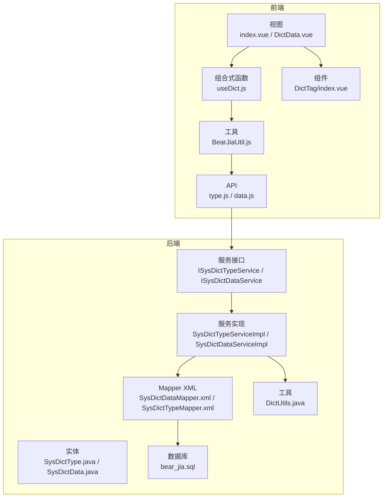
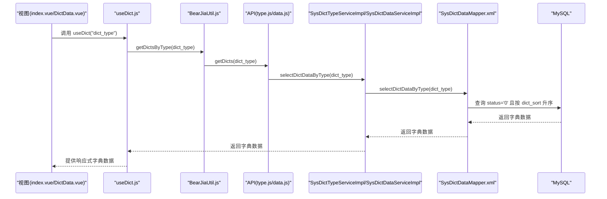
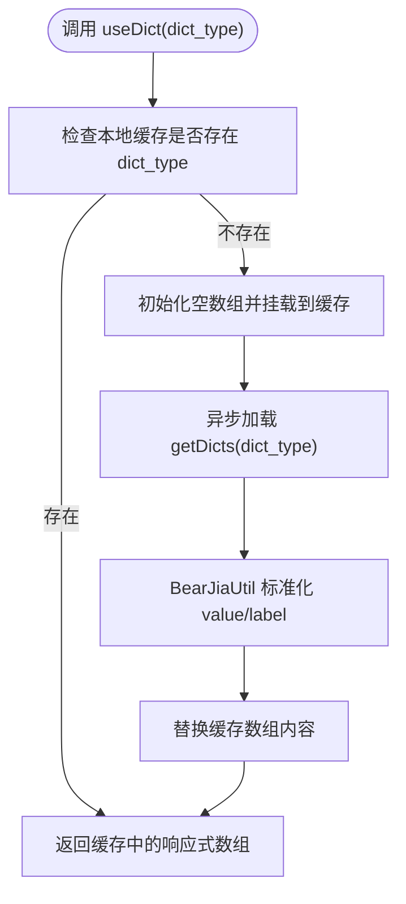
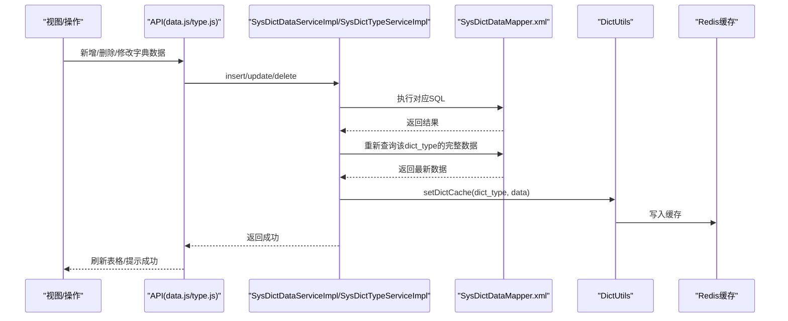
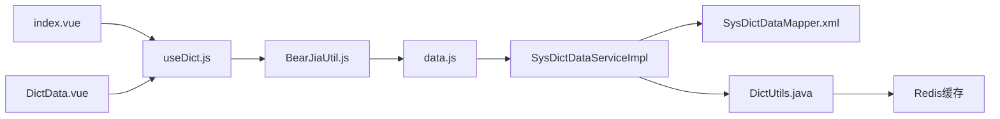

# 字典模型

<cite>
**本文引用的文件**
- [bear-jia-vue3/src/api/system/dict/type.js](file://bear-jia-vue3/src/api/system/dict/type.js)
- [bear-jia-vue3/src/api/system/dict/data.js](file://bear-jia-vue3/src/api/system/dict/data.js)
- [bear-jia-vue3/src/composables/useDict.js](file://bear-jia-vue3/src/composables/useDict.js)
- [bear-jia-vue3/src/components/DictTag/index.vue](file://bear-jia-vue3/src/components/DictTag/index.vue)
- [bear-jia-vue3/src/utils/BearJiaUtil.js](file://bear-jia-vue3/src/utils/BearJiaUtil.js)
- [bear-jia-vue3/src/views/system/dict/index.vue](file://bear-jia-vue3/src/views/system/dict/index.vue)
- [bear-jia-vue3/src/views/system/dict/DictData.vue](file://bear-jia-vue3/src/views/system/dict/DictData.vue)
- [bear-jia-vue3/src/views/system/dict/dataAddUpdateModal.vue](file://bear-jia-vue3/src/views/system/dict/dataAddUpdateModal.vue)
- [bearjia-admin-backend/src/main/java/com/javaxiaobear/module/system/domain/SysDictType.java](file://bearjia-admin-backend/src/main/java/com/javaxiaobear/module/system/domain/SysDictType.java)
- [bearjia-admin-backend/src/main/java/com/javaxiaobear/module/system/domain/SysDictData.java](file://bearjia-admin-backend/src/main/java/com/javaxiaobear/module/system/domain/SysDictData.java)
- [bearjia-admin-backend/src/main/java/com/javaxiaobear/module/system/service/ISysDictTypeService.java](file://bearjia-admin-backend/src/main/java/com/javaxiaobear/module/system/service/ISysDictTypeService.java)
- [bearjia-admin-backend/src/main/java/com/javaxiaobear/module/system/service/ISysDictDataService.java](file://bearjia-admin-backend/src/main/java/com/javaxiaobear/module/system/service/ISysDictDataService.java)
- [bearjia-admin-backend/src/main/java/com/javaxiaobear/module/system/service/impl/SysDictTypeServiceImpl.java](file://bearjia-admin-backend/src/main/java/com/javaxiaobear/module/system/service/impl/SysDictTypeServiceImpl.java)
- [bearjia-admin-backend/src/main/java/com/javaxiaobear/module/system/service/impl/SysDictDataServiceImpl.java](file://bearjia-admin-backend/src/main/java/com/javaxiaobear/module/system/service/impl/SysDictDataServiceImpl.java)
- [bearjia-admin-backend/src/main/java/com/javaxiaobear/base/common/utils/DictUtils.java](file://bearjia-admin-backend/src/main/java/com/javaxiaobear/base/common/utils/DictUtils.java)
- [bearjia-admin-backend/src/main/resources/mybatis/system/SysDictDataMapper.xml](file://bearjia-admin-backend/src/main/resources/mybatis/system/SysDictDataMapper.xml)
- [bearjia-admin-backend/src/main/resources/mybatis/system/SysDictTypeMapper.xml](file://bearjia-admin-backend/src/main/resources/mybatis/system/SysDictTypeMapper.xml)
- [bearjia-admin-backend/src/main/resources/sql/bear_jia.sql](file://bearjia-admin-backend/src/main/resources/sql/bear_jia.sql)
</cite>

## 目录
1. [简介](#简介)
2. [项目结构](#项目结构)
3. [核心组件](#核心组件)
4. [架构总览](#架构总览)
5. [详细组件分析](#详细组件分析)
6. [依赖关系分析](#依赖关系分析)
7. [性能考量](#性能考量)
8. [故障排查指南](#故障排查指南)
9. [结论](#结论)
10. [附录](#附录)

## 简介
本文件系统化梳理“字典模型”的设计与实现，覆盖前端与后端两部分：
- 前端：SysDictType（字典类型）与SysDictData（字典数据）在页面中的使用方式；字典类型编码dict_type的唯一性约束及作为前端标识符的作用；字典数据项状态字段对前端展示的影响；useDict组合式函数的懒加载与本地缓存机制；DictTag组件的使用与样式映射；字典数据变更后的缓存更新策略。
- 后端：SysDictType与SysDictData实体的字段语义、唯一性约束；MyBatis映射文件中按类型批量查询字典数据的SQL实现（含状态过滤与排序）；服务层加载与刷新字典缓存的流程；字典标签与值的双向转换工具。

## 项目结构
围绕字典模型的关键文件分布如下：
- 前端
  - API层：系统字典类型与数据的HTTP接口封装
  - 组合式函数：useDict.js提供懒加载与本地缓存
  - 组件：DictTag.vue用于渲染字典标签
  - 工具：BearJiaUtil.js封装getDictsByType等常用方法
  - 视图：字典类型与字典数据页面，展示字典在表格中的使用
- 后端
  - 实体：SysDictType、SysDictData
  - 服务：ISysDictTypeService、ISysDictDataService及其实现
  - 映射：SysDictDataMapper.xml、SysDictTypeMapper.xml
  - 工具：DictUtils字典缓存工具
  - 初始化：数据库脚本中dict_type唯一约束与示例数据

图表来源
- [bear-jia-vue3/src/views/system/dict/index.vue](file://bear-jia-vue3/src/views/system/dict/index.vue#L1-L129)
- [bear-jia-vue3/src/views/system/dict/DictData.vue](file://bear-jia-vue3/src/views/system/dict/DictData.vue#L1-L140)
- [bear-jia-vue3/src/composables/useDict.js](file://bear-jia-vue3/src/composables/useDict.js#L1-L185)
- [bear-jia-vue3/src/utils/BearJiaUtil.js](file://bear-jia-vue3/src/utils/BearJiaUtil.js#L178-L193)
- [bear-jia-vue3/src/api/system/dict/type.js](file://bear-jia-vue3/src/api/system/dict/type.js#L1-L61)
- [bear-jia-vue3/src/api/system/dict/data.js](file://bear-jia-vue3/src/api/system/dict/data.js#L1-L53)
- [bear-jia-vue3/src/components/DictTag/index.vue](file://bear-jia-vue3/src/components/DictTag/index.vue#L1-L143)
- [bearjia-admin-backend/src/main/java/com/javaxiaobear/module/system/domain/SysDictType.java](file://bearjia-admin-backend/src/main/java/com/javaxiaobear/module/system/domain/SysDictType.java#L42-L96)
- [bearjia-admin-backend/src/main/java/com/javaxiaobear/module/system/domain/SysDictData.java](file://bearjia-admin-backend/src/main/java/com/javaxiaobear/module/system/domain/SysDictData.java#L1-L176)
- [bearjia-admin-backend/src/main/java/com/javaxiaobear/module/system/service/ISysDictTypeService.java](file://bearjia-admin-backend/src/main/java/com/javaxiaobear/module/system/service/ISysDictTypeService.java#L1-L55)
- [bearjia-admin-backend/src/main/java/com/javaxiaobear/module/system/service/ISysDictDataService.java](file://bearjia-admin-backend/src/main/java/com/javaxiaobear/module/system/service/ISysDictDataService.java#L1-L60)
- [bearjia-admin-backend/src/main/java/com/javaxiaobear/module/system/service/impl/SysDictTypeServiceImpl.java](file://bearjia-admin-backend/src/main/java/com/javaxiaobear/module/system/service/impl/SysDictTypeServiceImpl.java#L1-L183)
- [bearjia-admin-backend/src/main/java/com/javaxiaobear/module/system/service/impl/SysDictDataServiceImpl.java](file://bearjia-admin-backend/src/main/java/com/javaxiaobear/module/system/service/impl/SysDictDataServiceImpl.java#L1-L90)
- [bearjia-admin-backend/src/main/resources/mybatis/system/SysDictDataMapper.xml](file://bearjia-admin-backend/src/main/resources/mybatis/system/SysDictDataMapper.xml#L1-L67)
- [bearjia-admin-backend/src/main/resources/mybatis/system/SysDictTypeMapper.xml](file://bearjia-admin-backend/src/main/resources/mybatis/system/SysDictTypeMapper.xml#L1-L34)
- [bearjia-admin-backend/src/main/resources/sql/bear_jia.sql](file://bearjia-admin-backend/src/main/resources/sql/bear_jia.sql#L183-L252)

章节来源
- [bear-jia-vue3/src/views/system/dict/index.vue](file://bear-jia-vue3/src/views/system/dict/index.vue#L1-L129)
- [bear-jia-vue3/src/views/system/dict/DictData.vue](file://bear-jia-vue3/src/views/system/dict/DictData.vue#L1-L140)
- [bear-jia-vue3/src/composables/useDict.js](file://bear-jia-vue3/src/composables/useDict.js#L1-L185)
- [bear-jia-vue3/src/utils/BearJiaUtil.js](file://bear-jia-vue3/src/utils/BearJiaUtil.js#L178-L193)
- [bear-jia-vue3/src/api/system/dict/type.js](file://bear-jia-vue3/src/api/system/dict/type.js#L1-L61)
- [bear-jia-vue3/src/api/system/dict/data.js](file://bear-jia-vue3/src/api/system/dict/data.js#L1-L53)
- [bear-jia-vue3/src/components/DictTag/index.vue](file://bear-jia-vue3/src/components/DictTag/index.vue#L1-L143)
- [bearjia-admin-backend/src/main/java/com/javaxiaobear/module/system/domain/SysDictType.java](file://bearjia-admin-backend/src/main/java/com/javaxiaobear/module/system/domain/SysDictType.java#L42-L96)
- [bearjia-admin-backend/src/main/java/com/javaxiaobear/module/system/domain/SysDictData.java](file://bearjia-admin-backend/src/main/java/com/javaxiaobear/module/system/domain/SysDictData.java#L1-L176)
- [bearjia-admin-backend/src/main/java/com/javaxiaobear/module/system/service/ISysDictTypeService.java](file://bearjia-admin-backend/src/main/java/com/javaxiaobear/module/system/service/ISysDictTypeService.java#L1-L55)
- [bearjia-admin-backend/src/main/java/com/javaxiaobear/module/system/service/ISysDictDataService.java](file://bearjia-admin-backend/src/main/java/com/javaxiaobear/module/system/service/ISysDictDataService.java#L1-L60)
- [bearjia-admin-backend/src/main/java/com/javaxiaobear/module/system/service/impl/SysDictTypeServiceImpl.java](file://bearjia-admin-backend/src/main/java/com/javaxiaobear/module/system/service/impl/SysDictTypeServiceImpl.java#L1-L183)
- [bearjia-admin-backend/src/main/java/com/javaxiaobear/module/system/service/impl/SysDictDataServiceImpl.java](file://bearjia-admin-backend/src/main/java/com/javaxiaobear/module/system/service/impl/SysDictDataServiceImpl.java#L1-L90)
- [bearjia-admin-backend/src/main/resources/mybatis/system/SysDictDataMapper.xml](file://bearjia-admin-backend/src/main/resources/mybatis/system/SysDictDataMapper.xml#L1-L67)
- [bearjia-admin-backend/src/main/resources/mybatis/system/SysDictTypeMapper.xml](file://bearjia-admin-backend/src/main/resources/mybatis/system/SysDictTypeMapper.xml#L1-L34)
- [bearjia-admin-backend/src/main/resources/sql/bear_jia.sql](file://bearjia-admin-backend/src/main/resources/sql/bear_jia.sql#L183-L252)

## 核心组件
- SysDictType（字典类型）
  - 字段要点：dict_id、dict_name、dict_type（唯一）、status、create/update信息、remark
  - 唯一性约束：dict_type在数据库层面唯一，保证前端标识符的全局唯一性
  - 前端用途：作为字典数据的分类维度，用于筛选与分组展示
- SysDictData（字典数据）
  - 字段要点：dict_code、dict_sort、dict_label、dict_value、dict_type、css_class、list_class、is_default、status、create/update信息、remark
  - 状态字段：status=0表示正常，1表示停用；前端展示时可通过DictTag或useDict映射颜色/样式
  - 排序字段：dict_sort决定前端展示顺序
- 前端字典API
  - 类型：listType、getType、addType、updateType、delType、refreshCache、optionselect
  - 数据：listData、getData、getDicts、addData、updateData、delData
- 前端字典工具
  - useDict：懒加载、本地缓存、标签/值/样式映射、缓存清理与刷新
  - BearJiaUtil.getDictsByType：统一将后端字典数据转换为前端通用格式
  - DictTag：根据字典值渲染带颜色/样式的标签

章节来源
- [bearjia-admin-backend/src/main/java/com/javaxiaobear/module/system/domain/SysDictType.java](file://bearjia-admin-backend/src/main/java/com/javaxiaobear/module/system/domain/SysDictType.java#L42-L96)
- [bearjia-admin-backend/src/main/java/com/javaxiaobear/module/system/domain/SysDictData.java](file://bearjia-admin-backend/src/main/java/com/javaxiaobear/module/system/domain/SysDictData.java#L1-L176)
- [bear-jia-vue3/src/api/system/dict/type.js](file://bear-jia-vue3/src/api/system/dict/type.js#L1-L61)
- [bear-jia-vue3/src/api/system/dict/data.js](file://bear-jia-vue3/src/api/system/dict/data.js#L1-L53)
- [bear-jia-vue3/src/composables/useDict.js](file://bear-jia-vue3/src/composables/useDict.js#L1-L185)
- [bear-jia-vue3/src/utils/BearJiaUtil.js](file://bear-jia-vue3/src/utils/BearJiaUtil.js#L178-L193)
- [bear-jia-vue3/src/components/DictTag/index.vue](file://bear-jia-vue3/src/components/DictTag/index.vue#L1-L143)

## 架构总览
从前端到后端的数据流与职责划分：
- 前端通过API获取字典类型与字典数据，useDict负责按需加载与缓存；DictTag负责渲染
- 后端通过Mapper XML执行SQL，SysDictTypeServiceImpl在启动时加载字典缓存，并在新增/删除/修改后刷新缓存；DictUtils提供缓存键与清理能力

图表来源
- [bear-jia-vue3/src/views/system/dict/index.vue](file://bear-jia-vue3/src/views/system/dict/index.vue#L61-L129)
- [bear-jia-vue3/src/views/system/dict/DictData.vue](file://bear-jia-vue3/src/views/system/dict/DictData.vue#L61-L140)
- [bear-jia-vue3/src/composables/useDict.js](file://bear-jia-vue3/src/composables/useDict.js#L1-L185)
- [bear-jia-vue3/src/utils/BearJiaUtil.js](file://bear-jia-vue3/src/utils/BearJiaUtil.js#L178-L193)
- [bear-jia-vue3/src/api/system/dict/type.js](file://bear-jia-vue3/src/api/system/dict/type.js#L1-L61)
- [bear-jia-vue3/src/api/system/dict/data.js](file://bear-jia-vue3/src/api/system/dict/data.js#L1-L53)
- [bearjia-admin-backend/src/main/java/com/javaxiaobear/module/system/service/impl/SysDictTypeServiceImpl.java](file://bearjia-admin-backend/src/main/java/com/javaxiaobear/module/system/service/impl/SysDictTypeServiceImpl.java#L66-L88)
- [bearjia-admin-backend/src/main/resources/mybatis/system/SysDictDataMapper.xml](file://bearjia-admin-backend/src/main/resources/mybatis/system/SysDictDataMapper.xml#L44-L47)

## 详细组件分析

### SysDictType（字典类型）实体与唯一性约束
- 字段语义
  - dict_type：字典类型编码，作为前端标识符，数据库唯一约束，确保全局唯一
  - status：类型自身的状态（0正常/1停用），影响类型是否可被使用
- 唯一性约束
  - 数据库层面通过唯一索引保证dict_type唯一，避免重复注册同名类型
- 前端作用
  - 作为字典数据的分类维度，用于筛选与分组展示；在页面中作为dictType传参参与查询

章节来源
- [bearjia-admin-backend/src/main/java/com/javaxiaobear/module/system/domain/SysDictType.java](file://bearjia-admin-backend/src/main/java/com/javaxiaobear/module/system/domain/SysDictType.java#L42-L96)
- [bearjia-admin-backend/src/main/resources/sql/bear_jia.sql](file://bearjia-admin-backend/src/main/resources/sql/bear_jia.sql#L235-L245)

### SysDictData（字典数据）实体与状态字段
- 字段语义
  - dict_value：字典键值，用于匹配业务值
  - dict_label：字典标签，用于前端展示
  - dict_type：所属字典类型
  - status：数据项状态（0正常/1停用），影响前端渲染
  - dict_sort：排序字段，决定展示顺序
  - list_class/css_class：用于控制前端标签样式与表格回显样式
- 状态对前端展示的影响
  - DictTag会根据list_class映射颜色；若未配置，则按status=0/1映射不同颜色
  - 前端表格中状态列可直接使用DictTag组件渲染

章节来源
- [bearjia-admin-backend/src/main/java/com/javaxiaobear/module/system/domain/SysDictData.java](file://bearjia-admin-backend/src/main/java/com/javaxiaobear/module/system/domain/SysDictData.java#L1-L176)
- [bear-jia-vue3/src/components/DictTag/index.vue](file://bear-jia-vue3/src/components/DictTag/index.vue#L57-L113)

### 前端字典API与数据获取
- 类型API
  - listType、getType、addType、updateType、delType、refreshCache、optionselect
- 数据API
  - listData、getData、getDicts(dictType)、addData、updateData、delData
- getDicts(dictType)用于按类型批量获取字典数据，通常用于下拉框、表格等场景

章节来源
- [bear-jia-vue3/src/api/system/dict/type.js](file://bear-jia-vue3/src/api/system/dict/type.js#L1-L61)
- [bear-jia-vue3/src/api/system/dict/data.js](file://bear-jia-vue3/src/api/system/dict/data.js#L1-L53)

### useDict组合式函数：懒加载与本地缓存
- 功能概览
  - 懒加载：首次使用某dict_type时异步从后端获取并写入本地缓存
  - 本地缓存：以dict_type为键的响应式数组，支持多处复用
  - 标签/值/样式映射：getDictLabel、getDictValue、getDictClass、getDictTagType
  - 缓存管理：clearDictCache、refreshDict
- 关键流程
  - useDict(...dictTypes)：为每个dict_type创建响应式数组，若缓存不存在则触发异步加载
  - BearJiaUtil.getDictsByType：将后端返回的dictValue/dictLabel标准化为value/label
  - DictTag与页面表格列渲染：通过options与value绑定，自动映射标签与颜色

图表来源
- [bear-jia-vue3/src/composables/useDict.js](file://bear-jia-vue3/src/composables/useDict.js#L1-L185)
- [bear-jia-vue3/src/utils/BearJiaUtil.js](file://bear-jia-vue3/src/utils/BearJiaUtil.js#L178-L193)

章节来源
- [bear-jia-vue3/src/composables/useDict.js](file://bear-jia-vue3/src/composables/useDict.js#L1-L185)
- [bear-jia-vue3/src/utils/BearJiaUtil.js](file://bear-jia-vue3/src/utils/BearJiaUtil.js#L178-L193)

### DictTag组件：快速渲染字典标签
- 属性
  - options：字典选项数组（value/label或dictValue/dictLabel）
  - value：当前字典值
  - color/className：可选的颜色与类名
- 渲染逻辑
  - 优先根据list_class映射颜色；若未配置则按status映射颜色
  - 支持cssClass附加样式类
  - 若无匹配项，回退显示原始value

章节来源
- [bear-jia-vue3/src/components/DictTag/index.vue](file://bear-jia-vue3/src/components/DictTag/index.vue#L1-L143)

### MyBatis映射：按类型批量查询字典数据（SQL实现细节）
- 查询入口
  - selectDictDataByType：按dict_type查询，仅返回status='0'的记录，并按dict_sort升序排列
- 其他查询
  - selectDictDataList：支持dictType、dictLabel、status等条件过滤，并按dict_sort升序
  - selectDictLabel：按dict_type+dict_value返回dict_label
- 作用
  - 保障前端只拿到“可用”的字典项，避免停用项干扰展示
  - 统一排序逻辑，保证展示一致性

章节来源
- [bearjia-admin-backend/src/main/resources/mybatis/system/SysDictDataMapper.xml](file://bearjia-admin-backend/src/main/resources/mybatis/system/SysDictDataMapper.xml#L28-L67)

### 前端页面中的字典使用
- 字典类型页面
  - 使用useDict加载sys_normal_disable字典，用于类型状态列渲染
  - 通过DictTag组件展示状态标签
- 字典数据页面
  - 通过DictData.vue接收dictType参数，动态构建查询条件
  - 同样使用sys_normal_disable字典渲染状态列

章节来源
- [bear-jia-vue3/src/views/system/dict/index.vue](file://bear-jia-vue3/src/views/system/dict/index.vue#L61-L129)
- [bear-jia-vue3/src/views/system/dict/DictData.vue](file://bear-jia-vue3/src/views/system/dict/DictData.vue#L61-L140)

### 字典数据变更时的缓存更新策略
- 新增/删除/修改字典数据
  - 服务层在插入/删除/更新后，重新查询该dict_type下的所有数据并写入缓存
  - 保证前后端数据一致性
- 字典类型变更
  - 服务层在新增类型后，清理对应类型的缓存键，确保后续访问能获取最新数据
- 手动刷新
  - 前端可通过useDict.refreshDict(dict_type)触发重新加载
  - 后端可通过刷新缓存接口（如type.js中的refreshCache）触发后端缓存重建

图表来源
- [bear-jia-vue3/src/api/system/dict/data.js](file://bear-jia-vue3/src/api/system/dict/data.js#L1-L53)
- [bear-jia-vue3/src/api/system/dict/type.js](file://bear-jia-vue3/src/api/system/dict/type.js#L46-L61)
- [bearjia-admin-backend/src/main/java/com/javaxiaobear/module/system/service/impl/SysDictDataServiceImpl.java](file://bearjia-admin-backend/src/main/java/com/javaxiaobear/module/system/service/impl/SysDictDataServiceImpl.java#L60-L90)
- [bearjia-admin-backend/src/main/java/com/javaxiaobear/module/system/service/impl/SysDictTypeServiceImpl.java](file://bearjia-admin-backend/src/main/java/com/javaxiaobear/module/system/service/impl/SysDictTypeServiceImpl.java#L170-L183)
- [bearjia-admin-backend/src/main/java/com/javaxiaobear/base/common/utils/DictUtils.java](file://bearjia-admin-backend/src/main/java/com/javaxiaobear/base/common/utils/DictUtils.java#L162-L186)

## 依赖关系分析
- 前端
  - index.vue/DictData.vue依赖useDict.js与DictTag组件
  - useDict.js依赖BearJiaUtil.js提供的getDictsByType
  - BearJiaUtil.js依赖data.js的getDicts接口
- 后端
  - SysDictTypeServiceImpl依赖SysDictDataMapper.xml的selectDictDataByType
  - SysDictDataServiceImpl在新增/删除/修改后依赖DictUtils刷新缓存
  - DictUtils依赖Redis缓存键命名规范SYS_DICT_KEY

图表来源
- [bear-jia-vue3/src/views/system/dict/index.vue](file://bear-jia-vue3/src/views/system/dict/index.vue#L61-L129)
- [bear-jia-vue3/src/views/system/dict/DictData.vue](file://bear-jia-vue3/src/views/system/dict/DictData.vue#L61-L140)
- [bear-jia-vue3/src/composables/useDict.js](file://bear-jia-vue3/src/composables/useDict.js#L1-L185)
- [bear-jia-vue3/src/utils/BearJiaUtil.js](file://bear-jia-vue3/src/utils/BearJiaUtil.js#L178-L193)
- [bear-jia-vue3/src/api/system/dict/data.js](file://bear-jia-vue3/src/api/system/dict/data.js#L1-L53)
- [bearjia-admin-backend/src/main/java/com/javaxiaobear/module/system/service/impl/SysDictDataServiceImpl.java](file://bearjia-admin-backend/src/main/java/com/javaxiaobear/module/system/service/impl/SysDictDataServiceImpl.java#L60-L90)
- [bearjia-admin-backend/src/main/resources/mybatis/system/SysDictDataMapper.xml](file://bearjia-admin-backend/src/main/resources/mybatis/system/SysDictDataMapper.xml#L28-L67)
- [bearjia-admin-backend/src/main/java/com/javaxiaobear/base/common/utils/DictUtils.java](file://bearjia-admin-backend/src/main/java/com/javaxiaobear/base/common/utils/DictUtils.java#L162-L186)

## 性能考量
- 前端
  - useDict采用懒加载与本地缓存，减少重复网络请求与重复转换
  - DictTag组件在options缺失时快速回退，避免不必要的计算
- 后端
  - Mapper层按dict_type过滤并排序，避免前端二次处理
  - 服务层在数据变更后批量刷新缓存，避免脏读
- 建议
  - 控制字典类型数量与字典项数量，避免缓存过大
  - 对高频字典类型可考虑预热缓存（启动时加载）

## 故障排查指南
- 字典标签不显示或显示异常
  - 检查DictTag的options是否正确传入，value是否与dictValue/dictLabel一致
  - 检查list_class是否配置，或status是否为停用导致颜色映射异常
- 字典数据不生效或显示为空
  - 检查后端Mapper是否按dict_type过滤且status='0'，以及排序是否正确
  - 检查服务层是否在新增/删除/修改后刷新了缓存
- 前端刷新无效
  - 使用useDict.refreshDict(dict_type)强制刷新
  - 或调用后端refreshCache接口触发后端缓存重建

章节来源
- [bear-jia-vue3/src/components/DictTag/index.vue](file://bear-jia-vue3/src/components/DictTag/index.vue#L1-L143)
- [bearjia-admin-backend/src/main/resources/mybatis/system/SysDictDataMapper.xml](file://bearjia-admin-backend/src/main/resources/mybatis/system/SysDictDataMapper.xml#L28-L67)
- [bearjia-admin-backend/src/main/java/com/javaxiaobear/module/system/service/impl/SysDictDataServiceImpl.java](file://bearjia-admin-backend/src/main/java/com/javaxiaobear/module/system/service/impl/SysDictDataServiceImpl.java#L60-L90)
- [bear-jia-vue3/src/api/system/dict/type.js](file://bear-jia-vue3/src/api/system/dict/type.js#L46-L61)

## 结论
本字典模型在前后端协同下实现了：
- 前端：以dict_type为标识符的懒加载与本地缓存，统一的标签渲染与样式映射
- 后端：以dict_type为维度的可用字典数据查询与缓存管理，确保数据一致性
- 在实际使用中，建议遵循dict_type唯一性约束，合理使用状态字段与排序字段，并在数据变更后及时刷新缓存，以获得最佳的用户体验与数据一致性。

## 附录
- 数据库脚本中dict_type唯一性与示例数据
  - 唯一性：sys_dict_type表的dict_type字段具有唯一索引
  - 示例：sys_user_sex、sys_show_hide等类型示例数据
- 前端页面与组件
  - 字典类型页面：index.vue
  - 字典数据页面：DictData.vue
  - 字典数据新增/编辑弹窗：dataAddUpdateModal.vue

章节来源
- [bearjia-admin-backend/src/main/resources/sql/bear_jia.sql](file://bearjia-admin-backend/src/main/resources/sql/bear_jia.sql#L183-L252)
- [bear-jia-vue3/src/views/system/dict/index.vue](file://bear-jia-vue3/src/views/system/dict/index.vue#L1-L129)
- [bear-jia-vue3/src/views/system/dict/DictData.vue](file://bear-jia-vue3/src/views/system/dict/DictData.vue#L1-L140)
- [bear-jia-vue3/src/views/system/dict/dataAddUpdateModal.vue](file://bear-jia-vue3/src/views/system/dict/dataAddUpdateModal.vue#L1-L200)