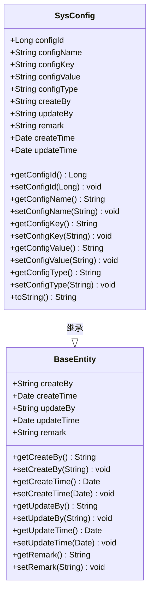
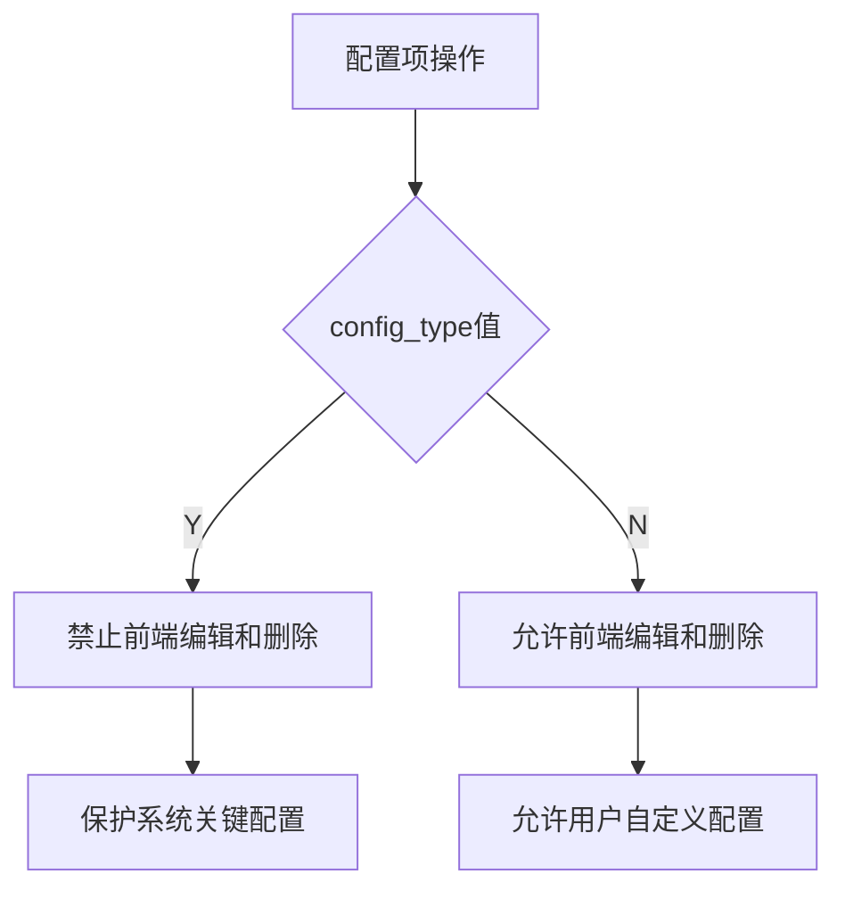
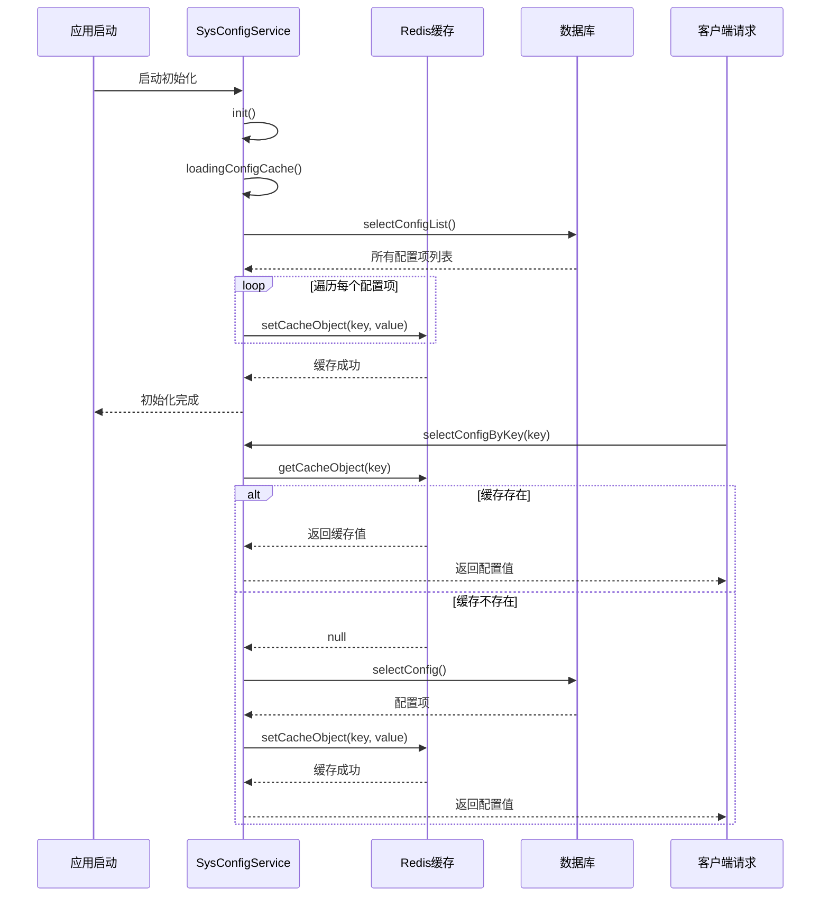
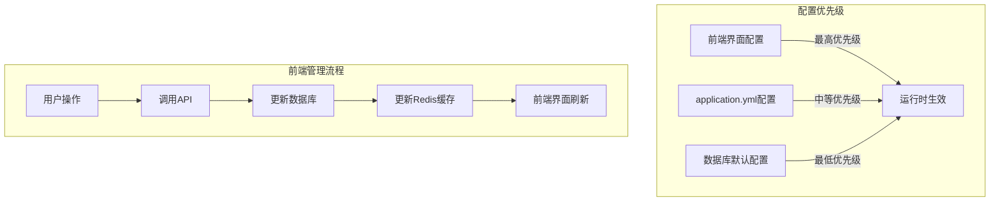
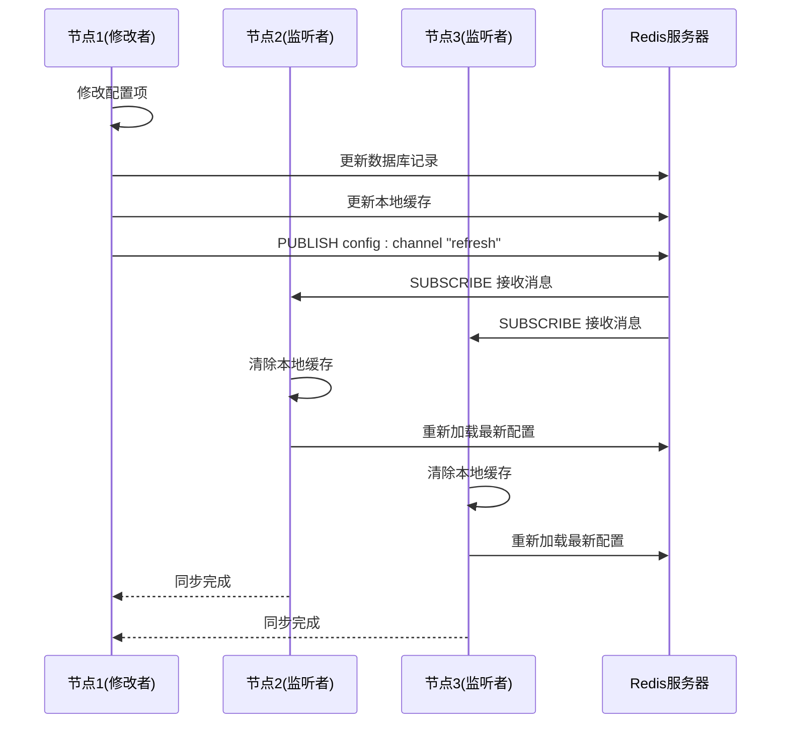

# 系统参数模型

<cite>
**本文档引用的文件**  
- [SysConfig.java](file://bearjia-admin-backend\src\main\java\com\javaxiaobear\module\system\domain\SysConfig.java)
- [SysConfigServiceImpl.java](file://bearjia-admin-backend\src\main\java\com\javaxiaobear\module\system\service\impl\SysConfigServiceImpl.java)
- [CacheConstants.java](file://bearjia-admin-backend\src\main\java\com\javaxiaobear\base\common\constant\CacheConstants.java)
- [RedisCache.java](file://bearjia-admin-backend\src\main\java\com\javaxiaobear\base\framework\redis\RedisCache.java)
- [ProjectConfig.java](file://bearjia-admin-backend\src\main\java\com\javaxiaobear\base\framework\config\ProjectConfig.java)
- [application.yml](file://bearjia-admin-backend\src\main\resources\application.yml)
- [config/index.vue](file://bear-jia-vue3\src\views\system\config\index.vue)
- [system.config.js](file://bear-jia-vue3\src\config\system.config.js)
- [configInit.js](file://bear-jia-vue3\src\utils\configInit.js)
</cite>

## 目录
1. [引言](#引言)
2. [核心实体设计](#核心实体设计)
3. [配置项标识与类型](#配置项标识与类型)
4. [两级缓存机制](#两级缓存机制)
5. [配置监听与动态更新](#配置监听与动态更新)
6. [配置优先级与前端管理](#配置优先级与前端管理)
7. [发布-订阅一致性机制](#发布-订阅一致性机制)
8. [结论](#结论)

## 引言

系统参数模型是本系统的核心配置管理机制，负责存储和管理所有可配置的系统参数。该模型通过SysConfig实体实现，结合Redis缓存和前端管理界面，提供了一套完整的配置管理解决方案。系统采用两级缓存策略，确保配置数据的高效访问和集群环境下的数据一致性。本文档将全面阐述系统参数模型的设计理念与技术实现。

## 核心实体设计

系统参数模型的核心是SysConfig实体类，它定义了配置项的基本结构和属性。该实体继承自BaseEntity基类，包含了配置项的主键、名称、键名、键值和类型等核心字段。实体通过Lombok注解简化了getter、setter和toString方法的实现，提高了代码的可读性和维护性。



**图源**
- [SysConfig.java](file://bearjia-admin-backend\src\main\java\com\javaxiaobear\module\system\domain\SysConfig.java#L1-L111)

**本节源**
- [SysConfig.java](file://bearjia-admin-backend\src\main\java\com\javaxiaobear\module\system\domain\SysConfig.java#L1-L111)

## 配置项标识与类型

### 配置项唯一标识

config_key字段作为配置项的唯一标识符，在系统中具有重要作用。它不仅用于数据库中的唯一性约束，还在代码中被直接引用以获取配置值。这种设计模式确保了配置项的可追溯性和一致性。例如，系统通过`sys.account.captchaEnabled`这样的键名来标识验证码开关配置，代码中可以直接通过这个键名获取配置值，而无需硬编码具体的配置值。

### 配置项类型控制

config_type字段采用Y/N布尔值来控制配置项的可编辑性。Y表示该配置项为系统内置，不可通过前端界面编辑；N表示该配置项为用户自定义，可以通过前端界面进行修改。这种设计有效地保护了关键系统配置不被意外修改，同时允许用户自定义非关键配置。在删除配置项时，系统会检查config_type字段，如果为Y则抛出异常阻止删除，确保系统稳定性。



**图源**
- [SysConfig.java](file://bearjia-admin-backend\src\main\java\com\javaxiaobear\module\system\domain\SysConfig.java#L36-L38)
- [SysConfigServiceImpl.java](file://bearjia-admin-backend\src\main\java\com\javaxiaobear\module\system\service\impl\SysConfigServiceImpl.java#L159-L164)

**本节源**
- [SysConfig.java](file://bearjia-admin-backend\src\main\java\com\javaxiaobear\module\system\domain\SysConfig.java#L28-L38)
- [SysConfigServiceImpl.java](file://bearjia-admin-backend\src\main\java\com\javaxiaobear\module\system\service\impl\SysConfigServiceImpl.java#L159-L164)

## 两级缓存机制

### 缓存架构设计

系统采用两级缓存机制来优化配置项的访问性能。第一级缓存是应用内存中的Redis缓存，第二级是数据库持久化存储。应用启动时，系统会从数据库加载所有配置项到Redis缓存中，后续的配置访问都直接从Redis中读取，大大减少了数据库访问压力。

### 缓存初始化与访问

系统通过@PostConstruct注解在应用启动时自动执行init()方法，调用loadingConfigCache()方法将数据库中的所有配置项加载到Redis缓存中。缓存的键名采用"sys_config:"前缀加上config_key的组合方式，确保了键名的唯一性和可识别性。当需要获取配置值时，系统首先尝试从Redis缓存中读取，如果缓存中不存在，则从数据库查询并将结果写入缓存。



**图源**
- [SysConfigServiceImpl.java](file://bearjia-admin-backend\src\main\java\com\javaxiaobear\module\system\service\impl\SysConfigServiceImpl.java#L35-L38)
- [SysConfigServiceImpl.java](file://bearjia-admin-backend\src\main\java\com\javaxiaobear\module\system\service\impl\SysConfigServiceImpl.java#L64-L78)
- [CacheConstants.java](file://bearjia-admin-backend\src\main\java\com\javaxiaobear\base\common\constant\CacheConstants.java#L23)

**本节源**
- [SysConfigServiceImpl.java](file://bearjia-admin-backend\src\main\java\com\javaxiaobear\module\system\service\impl\SysConfigServiceImpl.java#L35-L78)
- [RedisCache.java](file://bearjia-admin-backend\src\main\java\com\javaxiaobear\base\framework\redis\RedisCache.java#L34-L109)

## 配置监听与动态更新

### ProjectConfig配置类

ProjectConfig类是一个Spring组件，通过@ConfigurationProperties注解将application.yml文件中的project前缀配置自动映射到类的属性中。这个类不仅读取项目名称、版本等基本信息，还提供了静态方法来访问这些配置。当配置项发生变化时，ProjectConfig类能够自动感知并更新其内部状态，从而动态调整应用行为。

### 配置变化监听

前端通过watchConfigChanges()函数监听配置变化。该函数使用Vuex store的$subscribe方法订阅状态变化事件。当检测到主题相关配置（如primaryColor、darkMode）发生变化时，会自动调用applyTheme()方法重新应用主题；当系统配置发生变化时，会更新页面的meta信息和标题。这种机制确保了配置变更能够实时反映在用户界面上。

```mermaid
flowchart TD
A[配置变更] --> B{变更类型}
B --> |主题配置| C[调用applyTheme()]
B --> |系统配置| D[更新meta信息]
C --> E[重新应用CSS主题]
D --> F[更新页面标题和元数据]
E --> G[用户界面更新]
F --> G
G --> H[用户体验一致]
```

**图源**
- [ProjectConfig.java](file://bearjia-admin-backend\src\main\java\com\javaxiaobear\base\framework\config\ProjectConfig.java#L1-L69)
- [configInit.js](file://bear-jia-vue3\src\utils\configInit.js#L208-L236)

**本节源**
- [ProjectConfig.java](file://bearjia-admin-backend\src\main\java\com\javaxiaobear\base\framework\config\ProjectConfig.java#L1-L69)
- [configInit.js](file://bear-jia-vue3\src\utils\configInit.js#L208-L236)

## 配置优先级与前端管理

### 配置优先级关系

系统配置存在明确的优先级关系：前端界面修改的配置项优先级最高，其次是application.yml中的配置，最后是数据库中的默认配置。当application.yml中的配置项与数据库配置项冲突时，系统会以application.yml的配置为准。这种设计允许运维人员通过配置文件快速调整系统行为，而无需修改数据库。

### 前端配置管理

前端配置管理页面（config/index.vue）提供了完整的配置项管理功能。页面通过API与后端交互，实现了配置项的增删改查操作。当用户在前端修改配置项时，系统不仅会更新数据库，还会通过RedisCache工具类同步更新Redis缓存，确保配置变更立即生效。页面还提供了配置项导出功能，支持将配置数据导出为Excel文件。



**图源**
- [application.yml](file://bearjia-admin-backend\src\main\resources\application.yml#L1-L134)
- [config/index.vue](file://bear-jia-vue3\src\views\system\config\index.vue)

**本节源**
- [application.yml](file://bearjia-admin-backend\src\main\resources\application.yml#L1-L134)
- [config/index.vue](file://bear-jia-vue3\src\views\system\config\index.vue)

## 发布-订阅一致性机制

### 集群环境下的配置同步

在集群环境下，当一个节点的配置项被修改时，需要确保其他节点能够及时感知到这一变化，保持配置的一致性。系统通过Redis的发布-订阅机制实现这一目标。当配置项被修改时，修改节点会向特定的Redis频道发布一条消息，其他节点订阅该频道并监听消息，一旦收到消息就刷新本地缓存。

### 缓存刷新流程

配置项修改时的完整流程包括：首先更新数据库中的配置值，然后更新本地Redis缓存，接着向Redis发布频道发送刷新消息，最后其他节点接收到消息后刷新各自的缓存。这种机制确保了集群环境中所有节点的配置数据始终保持同步，避免了因缓存不一致导致的问题。



**图源**
- [SysConfigServiceImpl.java](file://bearjia-admin-backend\src\main\java\com\javaxiaobear\module\system\service\impl\SysConfigServiceImpl.java#L117-L121)
- [SysConfigServiceImpl.java](file://bearjia-admin-backend\src\main\java\com\javaxiaobear\module\system\service\impl\SysConfigServiceImpl.java#L140-L144)

**本节源**
- [SysConfigServiceImpl.java](file://bearjia-admin-backend\src\main\java\com\javaxiaobear\module\system\service\impl\SysConfigServiceImpl.java#L117-L144)

## 结论

系统参数模型通过精心设计的SysConfig实体、高效的两级缓存机制和完善的前端管理界面，构建了一套完整、可靠的配置管理系统。config_key作为配置项的唯一标识，确保了配置的可追溯性；config_type字段有效控制了配置项的可编辑性，保护了系统关键配置。两级缓存机制显著提升了配置访问性能，而ProjectConfig配置类和前端监听机制实现了配置的动态更新。通过明确的配置优先级和发布-订阅一致性机制，系统在单机和集群环境下都能保持配置数据的一致性和实时性。这套配置管理方案为系统的可维护性和可扩展性提供了坚实的基础。