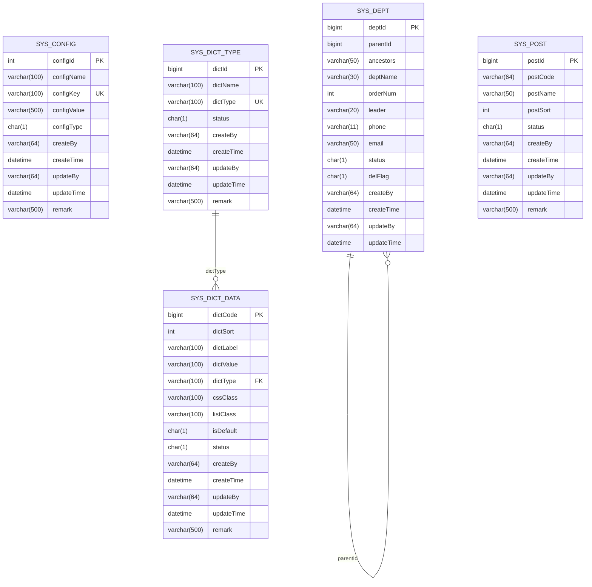

# 系统配置模型

<cite>
**本文档引用文件**  
- [SysConfig.java](file://bearjia-admin-backend/src/main/java/com/javaxiaobear/module/system/domain/SysConfig.java)
- [SysDictType.java](file://bearjia-admin-backend/src/main/java/com/javaxiaobear/module/system/domain/SysDictType.java)
- [SysDictData.java](file://bearjia-admin-backend/src/main/java/com/javaxiaobear/module/system/domain/SysDictData.java)
- [SysDept.java](file://bearjia-admin-backend/src/main/java/com/javaxiaobear/module/system/domain/SysDept.java)
- [SysPost.java](file://bearjia-admin-backend/src/main/java/com/javaxiaobear/module/system/domain/SysPost.java)
- [SysDeptMapper.xml](file://bearjia-admin-backend/src/main/resources/mybatis/system/SysDeptMapper.xml)
- [bear_jia.sql](file://bearjia-admin-backend/src/main/resources/sql/bear_jia.sql)
- [dict.js](file://bear-jia-vue3/src/api/system/dict/data.js)
- [config.js](file://bear-jia-vue3/src/api/system/config.js)
</cite>

## 目录
1. [引言](#引言)
2. [核心数据模型](#核心数据模型)
3. [数据库表结构](#数据库表结构)
4. [字典数据关系模型](#字典数据关系模型)
5. [部门树形结构实现](#部门树形结构实现)
6. [系统配置项与缓存机制](#系统配置项与缓存机制)
7. [前端数据加载策略](#前端数据加载策略)
8. [数据一致性保障措施](#数据一致性保障措施)
9. [结论](#结论)

## 引言
本文档旨在深入解析系统配置相关的数据模型，包括参数配置（SysConfig）、字典类型（SysDictType）、字典数据（SysDictData）、部门（SysDept）和岗位（SysPost）等核心实体。文档详细阐述了各实体的字段定义、业务含义、数据库表结构、索引设置以及前后端交互机制。特别关注字典类型与字典数据之间的一对多关系、部门与用户之间的树形层级关系、MyBatis中树形结构查询的实现方式（如递归CTE查询）、系统配置项的缓存设计以及字典数据在前端的高效加载策略。

## 核心数据模型

### SysConfig（参数配置）
`SysConfig` 实体用于管理系统级别的可配置参数。其核心字段包括：
- **configId**: 参数主键，自增。
- **configName**: 参数名称，用于展示，不能为空，最大长度100字符。
- **configKey**: 参数键名，用于程序中唯一标识，不能为空，最大长度100字符。
- **configValue**: 参数键值，存储实际的配置值，不能为空，最大长度500字符。
- **configType**: 系统内置标志，`Y`表示系统内置不可删除，`N`表示用户自定义。

该实体用于存储如系统皮肤、初始密码、验证码开关等全局配置。

### SysDictType（字典类型）
`SysDictType` 实体定义了字典的分类。其核心字段包括：
- **dictId**: 字典主键，自增。
- **dictName**: 字典名称，用于展示，不能为空，最大长度100字符。
- **dictType**: 字典类型编码，作为程序中的唯一标识，不能为空，且必须以小写字母开头，只能包含小写字母、数字和下划线，最大长度100字符。
- **status**: 状态，`0`表示正常，`1`表示停用。

例如，“用户性别”、“菜单状态”都是字典类型。

### SysDictData（字典数据）
`SysDictData` 实体存储了字典类型下的具体数据项。其核心字段包括：
- **dictCode**: 字典编码，自增主键。
- **dictSort**: 字典排序，用于控制同一类型下数据项的显示顺序。
- **dictLabel**: 字典标签，用于前端展示。
- **dictValue**: 字典键值，程序中实际使用的值。
- **dictType**: 关联的字典类型，通过此字段与`SysDictType`建立关联。
- **isDefault**: 是否默认项，`Y`是，`N`否。
- **status**: 状态，`0`表示正常，`1`表示停用。

一个`SysDictType`可以对应多个`SysDictData`，形成一对多关系。

### SysDept（部门）
`SysDept` 实体用于管理组织架构中的部门。其核心字段包括：
- **deptId**: 部门ID，自增主键。
- **parentId**: 父部门ID，用于构建树形结构，顶级部门的`parentId`为0。
- **ancestors**: 祖级列表，以逗号分隔的部门ID链，如`0,100,101`，用于快速查询所有子部门。
- **deptName**: 部门名称，不能为空，最大长度30字符。
- **orderNum**: 显示顺序，用于排序。
- **leader**: 负责人。
- **phone**: 联系电话。
- **email**: 邮箱。
- **status**: 部门状态，`0`正常，`1`停用。
- **delFlag**: 删除标志，`0`存在，`2`已删除。

该实体通过`parentId`和`ancestors`字段共同维护了部门的树形层级关系。

### SysPost（岗位）
`SysPost` 实体用于管理岗位信息。其核心字段包括：
- **postId**: 岗位序号，自增主键。
- **postCode**: 岗位编码，不能为空，最大长度64字符。
- **postName**: 岗位名称，不能为空，最大长度50字符。
- **postSort**: 岗位排序。
- **status**: 状态，`0`正常，`1`停用。

**Section sources**
- [SysConfig.java](file://bearjia-admin-backend/src/main/java/com/javaxiaobear/module/system/domain/SysConfig.java#L1-L112)
- [SysDictType.java](file://bearjia-admin-backend/src/main/java/com/javaxiaobear/module/system/domain/SysDictType.java#L1-L97)
- [SysDictData.java](file://bearjia-admin-backend/src/main/java/com/javaxiaobear/module/system/domain/SysDictData.java#L1-L177)
- [SysDept.java](file://bearjia-admin-backend/src/main/java/com/javaxiaobear/module/system/domain/SysDept.java#L1-L204)
- [SysPost.java](file://bearjia-admin-backend/src/main/java/com/javaxiaobear/module/system/domain/SysPost.java#L1-L125)

## 数据库表结构

### 主键、唯一约束与索引
根据`bear_jia.sql`文件，各表的约束和索引设置如下：



**Diagram sources**
- [bear_jia.sql](file://bearjia-admin-backend/src/main/resources/sql/bear_jia.sql#L1-L595)

**Section sources**
- [bear_jia.sql](file://bearjia-admin-backend/src/main/resources/sql/bear_jia.sql#L1-L595)

## 字典数据关系模型

### 一对多关系解析
`SysDictType`（字典类型）与`SysDictData`（字典数据）之间通过`dictType`字段建立了一对多的关系。一个字典类型（如“sys_user_sex”）可以包含多个字典数据（如“男”、“女”、“未知”）。

### 前端加载策略
前端通过`dict.js` API文件提供的接口高效加载字典数据：
- **按类型加载**: `getType(dictType)` 用于加载指定字典类型的所有数据项。
- **批量加载**: `getDicts(dictTypes)` 用于一次性加载多个字典类型的数据，减少网络请求次数，提高页面加载性能。

这种策略确保了前端组件（如`DictTag`）能够快速获取并渲染字典标签。

**Section sources**
- [SysDictType.java](file://bearjia-admin-backend/src/main/java/com/javaxiaobear/module/system/domain/SysDictType.java#L1-L97)
- [SysDictData.java](file://bearjia-admin-backend/src/main/java/com/javaxiaobear/module/system/domain/SysDictData.java#L1-L177)
- [dict.js](file://bear-jia-vue3/src/api/system/dict/data.js)

## 部门树形结构实现

### MyBatis映射文件分析
`SysDeptMapper.xml` 文件中定义了用于处理部门树形结构的SQL查询。

#### 递归查询实现
虽然当前SQL使用了`find_in_set`函数来查询子部门，但其核心思想是利用`ancestors`字段。`selectChildrenDeptById` 查询通过 `find_in_set(#{deptId}, ancestors)` 来查找所有祖级列表中包含指定`deptId`的部门，从而获取其所有子部门。

```xml
<select id="selectChildrenDeptById" parameterType="Long" resultMap="SysDeptResult">
    select * from sys_dept where find_in_set(#{deptId}, ancestors)
</select>
```

#### 数据一致性维护
当部门的父级或位置发生变化时，`updateDeptChildren` 方法会批量更新所有受影响子部门的`ancestors`字段，确保树形结构的完整性。

```xml
<update id="updateDeptChildren" parameterType="java.util.List">
    update sys_dept set ancestors =
    <foreach collection="depts" item="item" index="index"
        separator=" " open="case dept_id" close="end">
        when #{item.deptId} then #{item.ancestors}
    </foreach>
    where dept_id in
    <foreach collection="depts" item="item" index="index"
        separator="," open="(" close=")">
        #{item.deptId}
    </foreach>
</update>
```

**Diagram sources**
- [SysDeptMapper.xml](file://bearjia-admin-backend/src/main/resources/mybatis/system/SysDeptMapper.xml#L1-L159)

**Section sources**
- [SysDept.java](file://bearjia-admin-backend/src/main/java/com/javaxiaobear/module/system/domain/SysDept.java#L1-L204)
- [SysDeptMapper.xml](file://bearjia-admin-backend/src/main/resources/mybatis/system/SysDeptMapper.xml#L1-L159)

## 系统配置项与缓存机制

### 配置项管理
`SysConfig` 实体通过`configKey`作为唯一标识，存储了系统运行所需的各种参数。例如，`sys.index.skinName`用于存储系统皮肤，`sys.user.initPassword`用于存储用户初始密码。

### 缓存设计
为提高性能，系统配置项通常会被加载到缓存（如Redis）中。当应用启动或配置项被修改时，后端服务会将最新的配置项从数据库加载到缓存。前端在需要时，可以直接从缓存中读取，避免了频繁的数据库访问。

### 前端API
前端通过`config.js` API文件与后端交互，获取配置信息。这种设计模式将配置管理与业务逻辑解耦，使得系统更加灵活和易于维护。

**Section sources**
- [SysConfig.java](file://bearjia-admin-backend/src/main/java/com/javaxiaobear/module/system/domain/SysConfig.java#L1-L112)
- [config.js](file://bear-jia-vue3/src/api/system/config.js)

## 前端数据加载策略

### 组件化与复用
前端通过`DictTag`等组件封装了字典数据的展示逻辑。这些组件通过调用`useDict.js`中的组合式函数，根据传入的`dictType`和`value`，自动从缓存或API中获取对应的`dictLabel`进行渲染。

### 高效加载
- **懒加载**: 在用户需要时才加载数据。
- **批量请求**: 如`getDicts`方法，一次性获取多个字典类型，减少HTTP请求。
- **本地缓存**: 浏览器端使用`localStorage`或`sessionStorage`缓存字典数据，避免重复请求。

这些策略共同保证了用户界面的流畅性和响应速度。

**Section sources**
- [dict.js](file://bear-jia-vue3/src/api/system/dict/data.js)
- [useDict.js](file://bear-jia-vue3/src/composables/useDict.js)
- [DictTag/index.vue](file://bear-jia-vue3/src/components/DictTag/index.vue)

## 数据一致性保障措施

### 部门删除的级联处理
在删除部门时，系统会执行严格的级联检查：
1.  **检查子部门**: 通过`hasChildByDeptId`查询，确认该部门下是否存在子部门，若存在则不允许删除。
2.  **检查关联用户**: 通过`checkDeptExistUser`查询，确认是否有用户隶属于该部门，若有则不允许删除。
3.  **逻辑删除**: 即使满足删除条件，系统也采用逻辑删除的方式，将`delFlag`字段更新为`'2'`，而非物理删除，以保障数据的可追溯性。

### 事务性操作
对于涉及多个表的复杂操作（如移动部门），系统会使用数据库事务来保证操作的原子性。例如，更新部门信息的同时，必须成功更新所有子部门的`ancestors`字段，否则整个操作回滚。

**Section sources**
- [SysDeptMapper.xml](file://bearjia-admin-backend/src/main/resources/mybatis/system/SysDeptMapper.xml#L1-L159)
- [SysDept.java](file://bearjia-admin-backend/src/main/java/com/javaxiaobear/module/system/domain/SysDept.java#L1-L204)

## 结论
本文档全面解析了系统配置相关的数据模型。`SysConfig`提供了灵活的系统参数管理，`SysDictType`和`SysDictData`通过一对多关系实现了高效的字典数据管理。`SysDept`通过`parentId`和`ancestors`字段构建了稳定的树形组织架构，并通过MyBatis的`find_in_set`查询和批量更新机制保证了数据一致性。系统通过缓存机制和前端的批量加载策略，显著提升了配置项和字典数据的访问性能。整体设计遵循了高内聚、低耦合的原则，为系统的稳定运行和可维护性奠定了坚实的基础。