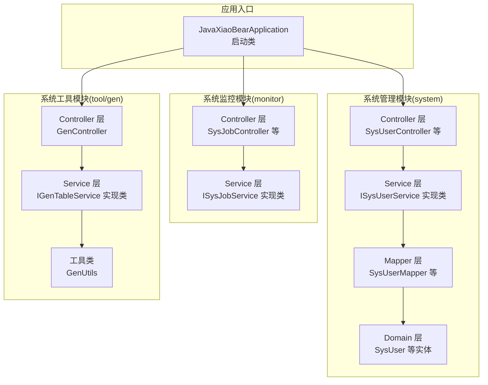
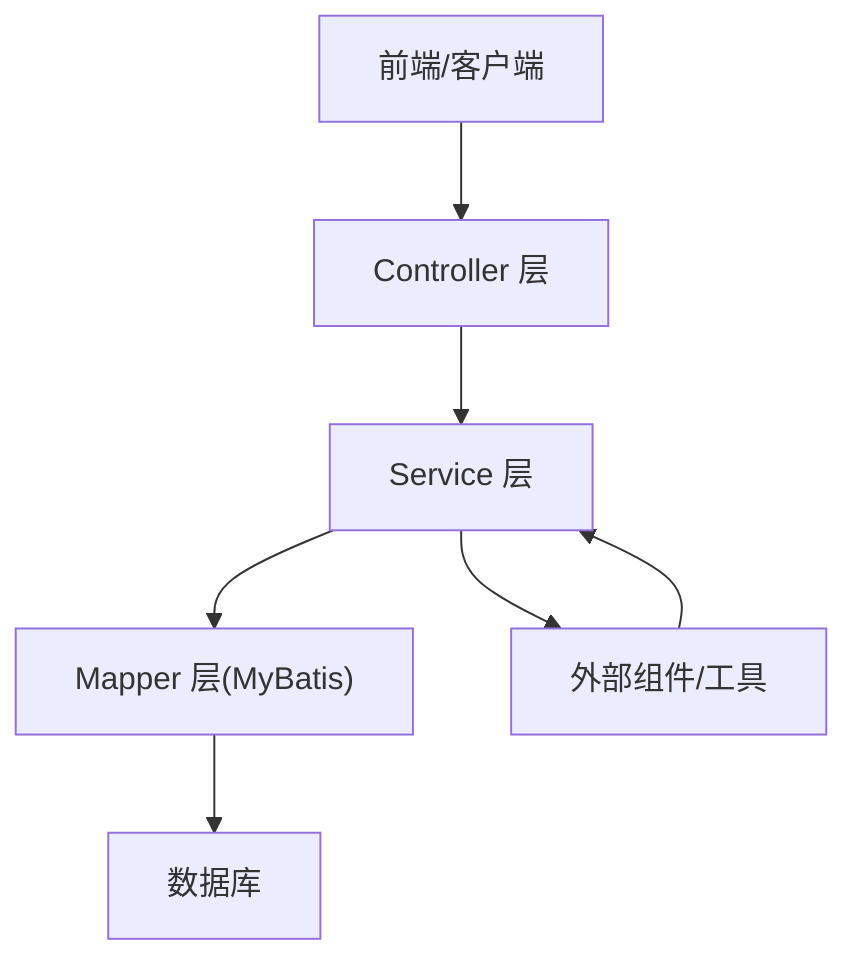
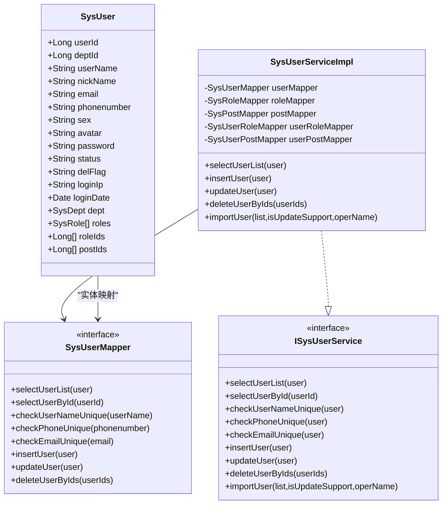
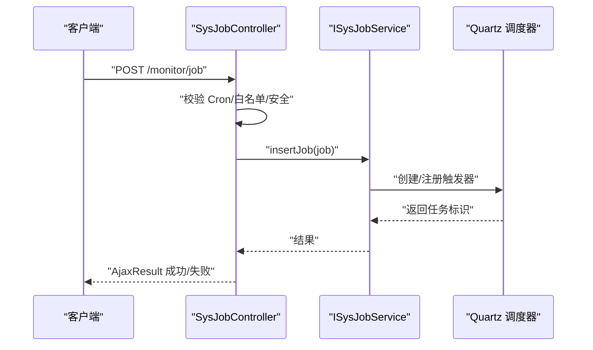
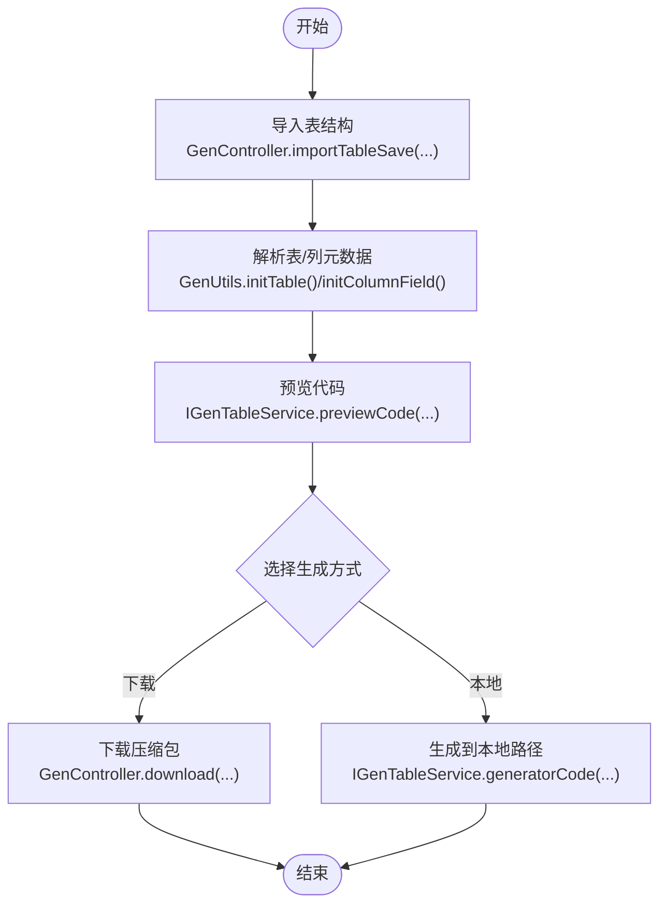
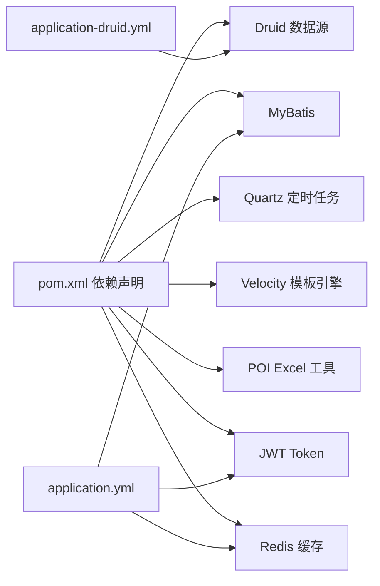

# 模块设计

<cite>
**本文引用的文件**
- [JavaXiaoBearApplication.java](file://bearjia-admin-backend/src/main/java/com/javaxiaobear/JavaXiaoBearApplication.java)
- [pom.xml](file://bearjia-admin-backend/pom.xml)
- [application.yml](file://bearjia-admin-backend/src/main/resources/application.yml)
- [application-druid.yml](file://bearjia-admin-backend/src/main/resources/application-druid.yml)
- [SysUserController.java](file://bearjia-admin-backend/src/main/java/com/javaxiaobear/module/system/controller/SysUserController.java)
- [SysUserServiceImpl.java](file://bearjia-admin-backend/src/main/java/com/javaxiaobear/module/system/service/impl/SysUserServiceImpl.java)
- [ISysUserService.java](file://bearjia-admin-backend/src/main/java/com/javaxiaobear/module/system/service/ISysUserService.java)
- [SysUserMapper.java](file://bearjia-admin-backend/src/main/java/com/javaxiaobear/module/system/mapper/SysUserMapper.java)
- [SysUser.java](file://bearjia-admin-backend/src/main/java/com/javaxiaobear/module/system/domain/SysUser.java)
- [SysUserMapper.xml](file://bearjia-admin-backend/src/main/resources/mybatis/system/SysUserMapper.xml)
- [ISysRoleService.java](file://bearjia-admin-backend/src/main/java/com/javaxiaobear/module/system/service/ISysRoleService.java)
- [ISysMenuService.java](file://bearjia-admin-backend/src/main/java/com/javaxiaobear/module/system/service/ISysMenuService.java)
- [SysJobController.java](file://bearjia-admin-backend/src/main/java/com/javaxiaobear/module/monitor/controller/SysJobController.java)
- [ISysJobService.java](file://bearjia-admin-backend/src/main/java/com/javaxiaobear/module/monitor/service/ISysJobService.java)
- [GenController.java](file://bearjia-admin-backend/src/main/java/com/javaxiaobear/module/tool/gen/controller/GenController.java)
- [IGenTableService.java](file://bearjia-admin-backend/src/main/java/com/javaxiaobear/module/tool/gen/service/IGenTableService.java)
- [GenUtils.java](file://bearjia-admin-backend/src/main/java/com/javaxiaobear/module/tool/gen/util/GenUtils.java)
</cite>

## 目录
1. [简介](#简介)
2. [项目结构](#项目结构)
3. [核心组件](#核心组件)
4. [架构总览](#架构总览)
5. [详细组件分析](#详细组件分析)
6. [依赖关系分析](#依赖关系分析)
7. [性能考量](#性能考量)
8. [故障排查指南](#故障排查指南)
9. [结论](#结论)
10. [附录](#附录)

## 简介
本设计文档聚焦于后端模块化架构，围绕系统管理（用户、角色、菜单、部门等）、系统监控（定时任务、在线用户、操作日志等）与系统工具（代码生成器）三大模块展开。文档从MVC分层视角解析Controller层RESTful接口设计、Service层业务逻辑处理、Mapper层数据访问实现；阐述监控模块的定时任务调度与日志记录集成；说明代码生成器的表结构解析、模板引擎（Velocity）集成与前后端代码生成流程；并通过类图与序列图展示关键方法调用链路，帮助读者快速理解模块间依赖与协作模式。

## 项目结构
后端采用Spring Boot工程，模块按领域划分，核心模块位于com.javaxiaobear.module下：
- system：系统管理模块（用户、角色、菜单、部门、字典、通知、文件等）
- monitor：系统监控模块（定时任务、在线用户、操作日志、缓存、服务器信息等）
- tool/gen：系统工具模块（代码生成器）

图表来源
- [JavaXiaoBearApplication.java](file://bearjia-admin-backend/src/main/java/com/javaxiaobear/JavaXiaoBearApplication.java#L1-L22)
- [SysUserController.java](file://bearjia-admin-backend/src/main/java/com/javaxiaobear/module/system/controller/SysUserController.java#L1-L258)
- [SysUserServiceImpl.java](file://bearjia-admin-backend/src/main/java/com/javaxiaobear/module/system/service/impl/SysUserServiceImpl.java#L1-L545)
- [SysUserMapper.java](file://bearjia-admin-backend/src/main/java/com/javaxiaobear/module/system/mapper/SysUserMapper.java#L1-L130)
- [SysUser.java](file://bearjia-admin-backend/src/main/java/com/javaxiaobear/module/system/domain/SysUser.java#L1-L325)
- [SysJobController.java](file://bearjia-admin-backend/src/main/java/com/javaxiaobear/module/monitor/controller/SysJobController.java#L1-L186)
- [ISysJobService.java](file://bearjia-admin-backend/src/main/java/com/javaxiaobear/module/monitor/service/ISysJobService.java#L1-L102)
- [GenController.java](file://bearjia-admin-backend/src/main/java/com/javaxiaobear/module/tool/gen/controller/GenController.java#L1-L258)
- [IGenTableService.java](file://bearjia-admin-backend/src/main/java/com/javaxiaobear/module/tool/gen/service/IGenTableService.java#L1-L131)
- [GenUtils.java](file://bearjia-admin-backend/src/main/java/com/javaxiaobear/module/tool/gen/util/GenUtils.java#L1-L258)

章节来源
- [JavaXiaoBearApplication.java](file://bearjia-admin-backend/src/main/java/com/javaxiaobear/JavaXiaoBearApplication.java#L1-L22)
- [pom.xml](file://bearjia-admin-backend/pom.xml#L1-L257)

## 核心组件
- 系统管理模块（System）
  - Controller：SysUserController负责用户CRUD、导入导出、重置密码、状态变更、角色授权等REST接口
  - Service：SysUserServiceImpl实现用户列表、唯一性校验、角色/岗位关联、导入导出等业务逻辑
  - Mapper：SysUserMapper接口及SysUserMapper.xml实现用户查询、分页、唯一性校验、导入导出等SQL映射
  - Domain：SysUser实体承载用户基础属性、部门关联、角色集合、岗位集合等
- 系统监控模块（Monitor）
  - Controller：SysJobController负责定时任务的CRUD、状态切换、立即执行、批量删除等REST接口
  - Service：ISysJobService接口定义定时任务调度、暂停/恢复、立即执行、校验等能力
- 系统工具模块（Tool/Gen）
  - Controller：GenController负责代码生成的表导入、预览、下载、批量生成、同步数据库等REST接口
  - Service：IGenTableService接口定义生成业务、预览、下载、同步、校验等能力
  - Utils：GenUtils提供表名/列名转换、HTML类型推断、Java类型映射、模块名/业务名提取等工具方法

章节来源
- [SysUserController.java](file://bearjia-admin-backend/src/main/java/com/javaxiaobear/module/system/controller/SysUserController.java#L1-L258)
- [SysUserServiceImpl.java](file://bearjia-admin-backend/src/main/java/com/javaxiaobear/module/system/service/impl/SysUserServiceImpl.java#L1-L545)
- [SysUserMapper.java](file://bearjia-admin-backend/src/main/java/com/javaxiaobear/module/system/mapper/SysUserMapper.java#L1-L130)
- [SysUserMapper.xml](file://bearjia-admin-backend/src/main/resources/mybatis/system/SysUserMapper.xml#L1-L200)
- [SysUser.java](file://bearjia-admin-backend/src/main/java/com/javaxiaobear/module/system/domain/SysUser.java#L1-L325)
- [SysJobController.java](file://bearjia-admin-backend/src/main/java/com/javaxiaobear/module/monitor/controller/SysJobController.java#L1-L186)
- [ISysJobService.java](file://bearjia-admin-backend/src/main/java/com/javaxiaobear/module/monitor/service/ISysJobService.java#L1-L102)
- [GenController.java](file://bearjia-admin-backend/src/main/java/com/javaxiaobear/module/tool/gen/controller/GenController.java#L1-L258)
- [IGenTableService.java](file://bearjia-admin-backend/src/main/java/com/javaxiaobear/module/tool/gen/service/IGenTableService.java#L1-L131)
- [GenUtils.java](file://bearjia-admin-backend/src/main/java/com/javaxiaobear/module/tool/gen/util/GenUtils.java#L1-L258)

## 架构总览
系统采用经典的MVC分层架构：
- Controller层：接收HTTP请求，参数绑定，鉴权与日志切面，返回统一响应体
- Service层：封装业务规则，事务控制，跨表关联处理（用户-角色、用户-岗位）
- Mapper层：基于MyBatis的XML映射，实现条件查询、分页、唯一性校验、导入导出等
- 工具与配置：Spring配置、Druid数据源、MyBatis配置、代码生成配置、Quartz定时任务

图表来源
- [SysUserController.java](file://bearjia-admin-backend/src/main/java/com/javaxiaobear/module/system/controller/SysUserController.java#L1-L258)
- [SysUserServiceImpl.java](file://bearjia-admin-backend/src/main/java/com/javaxiaobear/module/system/service/impl/SysUserServiceImpl.java#L1-L545)
- [SysUserMapper.java](file://bearjia-admin-backend/src/main/java/com/javaxiaobear/module/system/mapper/SysUserMapper.java#L1-L130)
- [application.yml](file://bearjia-admin-backend/src/main/resources/application.yml#L1-L134)
- [application-druid.yml](file://bearjia-admin-backend/src/main/resources/application-druid.yml#L1-L63)

## 详细组件分析

### 系统管理模块（用户、角色、菜单、部门）
系统管理模块以用户为核心，围绕用户-角色、用户-岗位、菜单-角色等多对多关系构建权限体系。

图表来源
- [SysUser.java](file://bearjia-admin-backend/src/main/java/com/javaxiaobear/module/system/domain/SysUser.java#L1-L325)
- [ISysUserService.java](file://bearjia-admin-backend/src/main/java/com/javaxiaobear/module/system/service/ISysUserService.java#L1-L207)
- [SysUserServiceImpl.java](file://bearjia-admin-backend/src/main/java/com/javaxiaobear/module/system/service/impl/SysUserServiceImpl.java#L1-L545)
- [SysUserMapper.java](file://bearjia-admin-backend/src/main/java/com/javaxiaobear/module/system/mapper/SysUserMapper.java#L1-L130)

典型业务场景与调用链路

- 用户角色分配
  - Controller：SysUserController.authRole(...) 返回用户与可授权角色
  - Service：SysUserServiceImpl.insertUserAuth(userId, roleIds) 删除旧关联并批量写入新关联
  - Mapper：SysUserRoleMapper.deleteUserRoleByUserId(...) 与 batchUserRole(...)

- 菜单权限计算
  - Service：ISysMenuService.selectMenuPermsByUserId(userId) 计算用户权限集合
  - Service：ISysRoleService.selectRolePermissionByUserId(userId) 计算角色权限集合
  - Controller：结合权限集合生成路由与按钮级权限

- 用户导入导出
  - Controller：SysUserController.export/importData(...) 使用ExcelUtil进行导入导出
  - Service：SysUserServiceImpl.importUser(...) 校验唯一性、事务处理、异常汇总

章节来源
- [SysUserController.java](file://bearjia-admin-backend/src/main/java/com/javaxiaobear/module/system/controller/SysUserController.java#L1-L258)
- [SysUserServiceImpl.java](file://bearjia-admin-backend/src/main/java/com/javaxiaobear/module/system/service/impl/SysUserServiceImpl.java#L1-L545)
- [SysUserMapper.xml](file://bearjia-admin-backend/src/main/resources/mybatis/system/SysUserMapper.xml#L1-L200)
- [ISysRoleService.java](file://bearjia-admin-backend/src/main/java/com/javaxiaobear/module/system/service/ISysRoleService.java#L1-L174)
- [ISysMenuService.java](file://bearjia-admin-backend/src/main/java/com/javaxiaobear/module/system/service/ISysMenuService.java#L1-L145)

### 系统监控模块（定时任务、在线用户、操作日志）
监控模块以定时任务调度为核心，配合日志记录与在线用户统计，形成完整的运维可观测性。

图表来源
- [SysJobController.java](file://bearjia-admin-backend/src/main/java/com/javaxiaobear/module/monitor/controller/SysJobController.java#L1-L186)
- [ISysJobService.java](file://bearjia-admin-backend/src/main/java/com/javaxiaobear/module/monitor/service/ISysJobService.java#L1-L102)

典型业务场景与调用链路

- 定时任务状态切换
  - Controller：SysJobController.changeStatus(...) 修改任务状态
  - Service：ISysJobService.changeStatus(...) 调用Quartz暂停/恢复

- 任务立即执行
  - Controller：SysJobController.run(...) 调用run(job)
  - Service：ISysJobService.run(...) 触发一次性执行

- 操作日志与登录日志
  - Controller：各模块Controller通过注解切面记录操作日志
  - Service：日志服务与审计策略结合，统一落库

章节来源
- [SysJobController.java](file://bearjia-admin-backend/src/main/java/com/javaxiaobear/module/monitor/controller/SysJobController.java#L1-L186)
- [ISysJobService.java](file://bearjia-admin-backend/src/main/java/com/javaxiaobear/module/monitor/service/ISysJobService.java#L1-L102)

### 系统工具模块（代码生成器）
代码生成器通过表结构解析、模板引擎（Velocity）与前后端代码生成流程，提升开发效率。

图表来源
- [GenController.java](file://bearjia-admin-backend/src/main/java/com/javaxiaobear/module/tool/gen/controller/GenController.java#L1-L258)
- [IGenTableService.java](file://bearjia-admin-backend/src/main/java/com/javaxiaobear/module/tool/gen/service/IGenTableService.java#L1-L131)
- [GenUtils.java](file://bearjia-admin-backend/src/main/java/com/javaxiaobear/module/tool/gen/util/GenUtils.java#L1-L258)

典型业务场景与调用链路

- 表结构导入与预览
  - Controller：GenController.importTableSave(...) 调用IGenTableService.importGenTable(...)
  - Service：IGenTableService.previewCode(...) 生成前后端模板渲染结果

- HTML类型与Java类型映射
  - Utils：GenUtils.initColumnField(...) 基于列类型推断HTML控件与Java类型（字符串、整数、长整型、日期、大数、富文本等）

- 生成代码下载
  - Controller：GenController.download(...) 生成zip并输出流
  - Service：IGenTableService.downloadCode(...) 组装模板与上下文

章节来源
- [GenController.java](file://bearjia-admin-backend/src/main/java/com/javaxiaobear/module/tool/gen/controller/GenController.java#L1-L258)
- [IGenTableService.java](file://bearjia-admin-backend/src/main/java/com/javaxiaobear/module/tool/gen/service/IGenTableService.java#L1-L131)
- [GenUtils.java](file://bearjia-admin-backend/src/main/java/com/javaxiaobear/module/tool/gen/util/GenUtils.java#L1-L258)

## 依赖关系分析
- 模块耦合
  - system模块内部高内聚：Controller依赖Service，Service依赖Mapper与配置服务，Mapper依赖XML映射
  - monitor模块与Quartz耦合：ISysJobService与调度器交互
  - tool/gen模块与模板引擎耦合：Velocity模板与GenUtils工具链
- 外部依赖
  - Druid数据源、MyBatis、Quartz、Apache Velocity、POI、JWT、Redis等
- 配置依赖
  - application.yml与application-druid.yml分别提供通用配置与数据源配置

图表来源
- [pom.xml](file://bearjia-admin-backend/pom.xml#L1-L257)
- [application.yml](file://bearjia-admin-backend/src/main/resources/application.yml#L1-L134)
- [application-druid.yml](file://bearjia-admin-backend/src/main/resources/application-druid.yml#L1-L63)

章节来源
- [pom.xml](file://bearjia-admin-backend/pom.xml#L1-L257)
- [application.yml](file://bearjia-admin-backend/src/main/resources/application.yml#L1-L134)
- [application-druid.yml](file://bearjia-admin-backend/src/main/resources/application-druid.yml#L1-L63)

## 性能考量
- 分页与数据范围过滤
  - MyBatis XML中使用分页与数据范围过滤参数，避免全表扫描
- 唯一性校验
  - 用户名/手机号/邮箱唯一性校验在Service层集中处理，减少重复查询
- 事务边界
  - 用户新增/修改/删除涉及多表关联，使用@Transactional确保一致性
- 缓存与Redis
  - 配置启用Redis用于会话与缓存，降低数据库压力
- 定时任务
  - Quartz调度器与白名单校验，防止危险调用与资源滥用

[本节为通用指导，无需列出具体文件来源]

## 故障排查指南
- 用户导入失败
  - 检查Excel模板与字段映射，确认唯一性校验与Bean校验是否通过
  - 查看Service层异常汇总与日志输出
- 定时任务异常
  - 校验Cron表达式合法性与白名单策略
  - 检查调度器状态与触发器注册情况
- 代码生成异常
  - 校验表DDL关键字过滤与表名解析
  - 检查模板路径与Velocity引擎初始化

章节来源
- [SysUserServiceImpl.java](file://bearjia-admin-backend/src/main/java/com/javaxiaobear/module/system/service/impl/SysUserServiceImpl.java#L470-L545)
- [SysJobController.java](file://bearjia-admin-backend/src/main/java/com/javaxiaobear/module/monitor/controller/SysJobController.java#L80-L147)
- [GenController.java](file://bearjia-admin-backend/src/main/java/com/javaxiaobear/module/tool/gen/controller/GenController.java#L120-L158)

## 结论
本项目通过清晰的MVC分层与模块化设计，实现了系统管理、监控与工具三大领域的高内聚低耦合。系统管理模块以用户为中心，围绕角色与岗位构建权限体系；监控模块以定时任务为核心，结合日志与在线用户形成可观测性；工具模块以代码生成器为抓手，提升前后端开发效率。模块间通过接口契约与依赖注入实现松耦合，具备良好的扩展性与可维护性。

[本节为总结性内容，无需列出具体文件来源]

## 附录
- 配置要点
  - 数据源：application-druid.yml
  - MyBatis：application.yml中typeAliasesPackage与mapperLocations
  - 代码生成：application.yml中gen节配置
- 关键接口路径
  - 用户：/system/user/*
  - 定时任务：/monitor/job/*
  - 代码生成：/tool/gen/*

章节来源
- [application.yml](file://bearjia-admin-backend/src/main/resources/application.yml#L1-L134)
- [application-druid.yml](file://bearjia-admin-backend/src/main/resources/application-druid.yml#L1-L63)