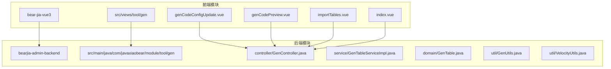
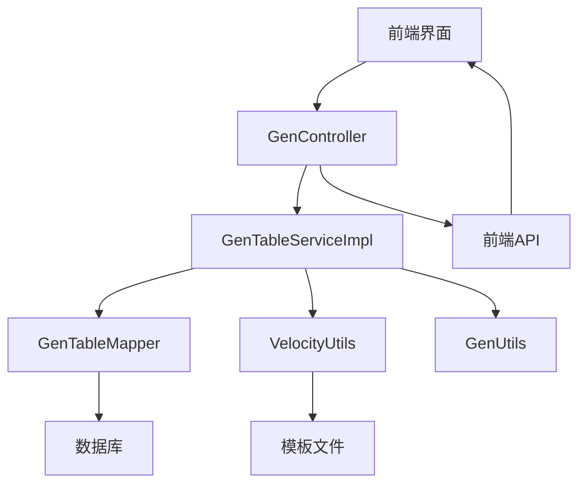
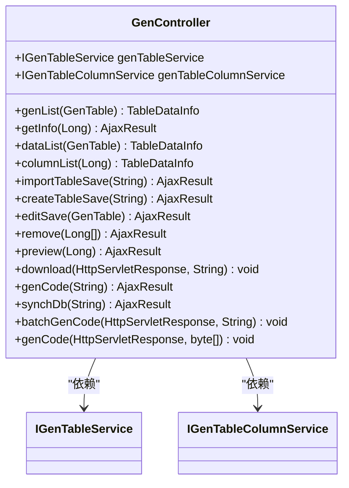
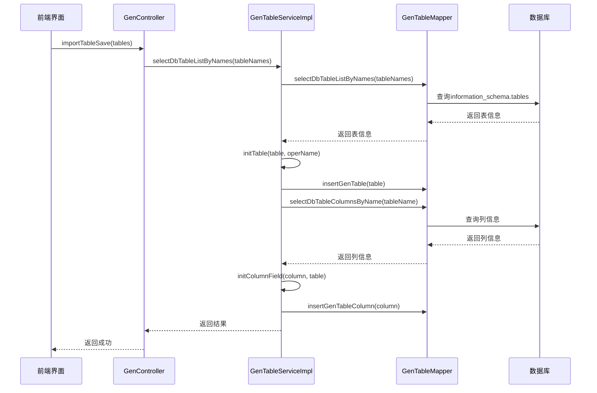
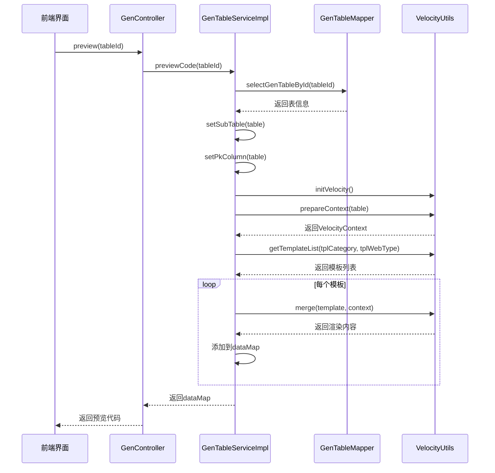
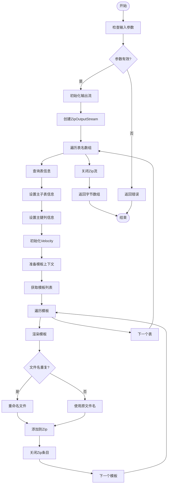
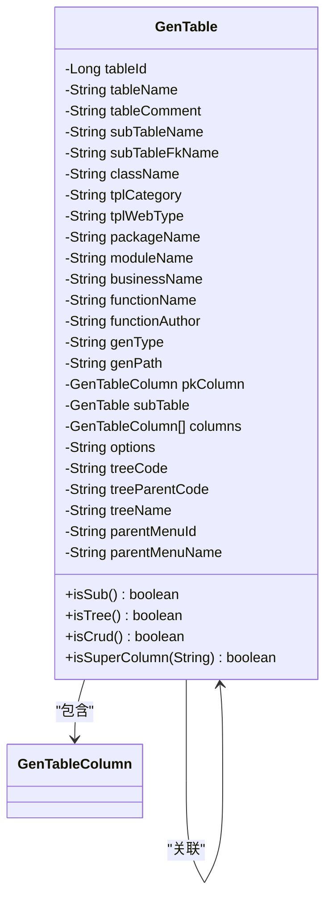
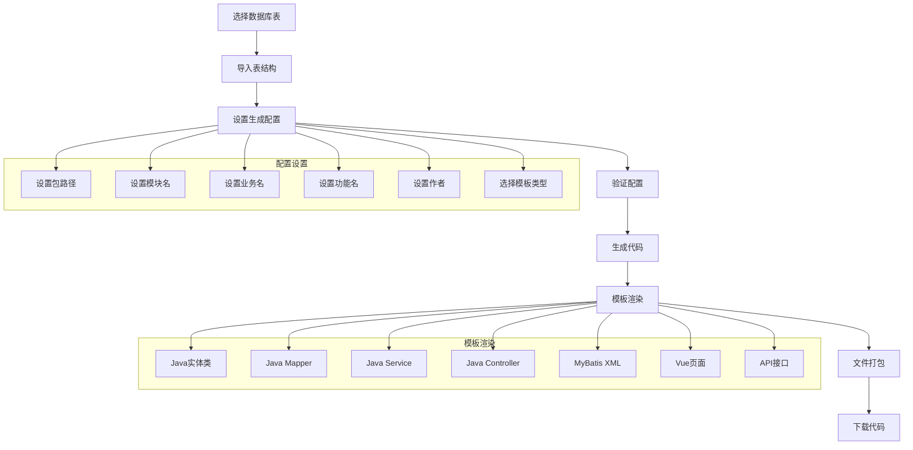
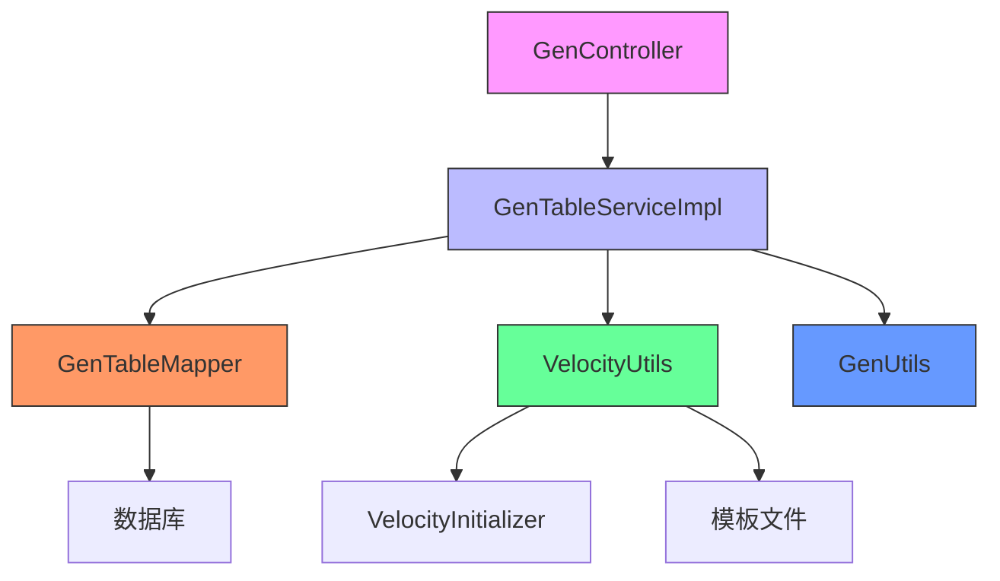
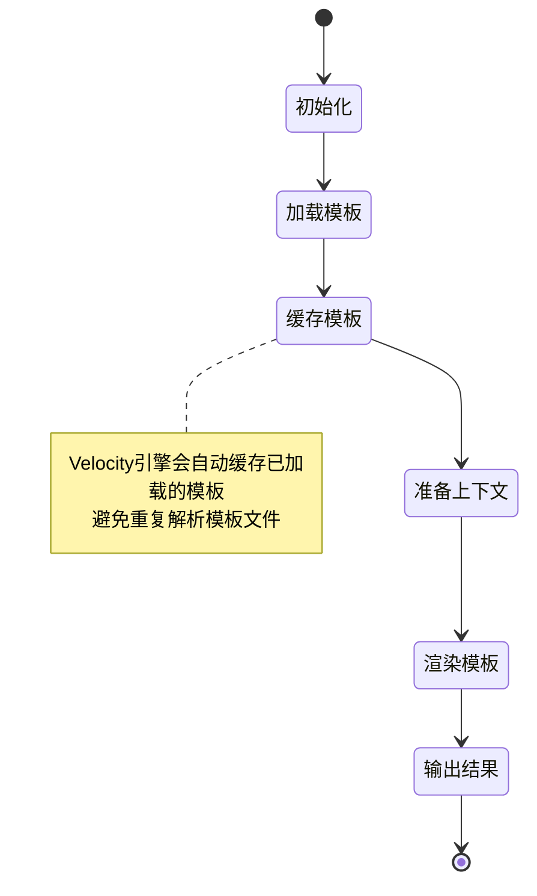

# 代码生成器核心

<cite>
**本文档引用文件**  
- [GenController.java](file://bearjia-admin-backend/src/main/java/com/javaxiaobear/module/tool/gen/controller/GenController.java)
- [GenTable.java](file://bearjia-admin-backend/src/main/java/com/javaxiaobear/module/tool/gen/domain/GenTable.java)
- [GenTableServiceImpl.java](file://bearjia-admin-backend/src/main/java/com/javaxiaobear/module/tool/gen/service/GenTableServiceImpl.java)
- [GenTableMapper.xml](file://bearjia-admin-backend/src/main/resources/mybatis/tool/GenTableMapper.xml)
- [GenUtils.java](file://bearjia-admin-backend/src/main/java/com/javaxiaobear/module/tool/gen/util/GenUtils.java)
- [VelocityUtils.java](file://bearjia-admin-backend/src/main/java/com/javaxiaobear/module/tool/gen/util/VelocityUtils.java)
- [VelocityInitializer.java](file://bearjia-admin-backend/src/main/java/com/javaxiaobear/module/tool/gen/util/VelocityInitializer.java)
- [GenConstants.java](file://bearjia-admin-backend/src/main/java/com/javaxiaobear/base/common/constant/GenConstants.java)
- [gen.js](file://bear-jia-vue3/src/api/tool/gen.js)
- [genCodeConfigUpdate.vue](file://bear-jia-vue3/src/views/tool/gen/genCodeConfigUpdate.vue)
- [genCodePreview.vue](file://bear-jia-vue3/src/views/tool/gen/genCodePreview.vue)
- [importTables.vue](file://bear-jia-vue3/src/views/tool/gen/importTables.vue)
- [index.vue](file://bear-jia-vue3/src/views/tool/gen/index.vue)
- [application.yml](file://bearjia-admin-backend/src/main/resources/application.yml)
</cite>

## 目录
1. [简介](#简介)
2. [项目结构](#项目结构)
3. [核心组件](#核心组件)
4. [架构概览](#架构概览)
5. [详细组件分析](#详细组件分析)
6. [依赖分析](#依赖分析)
7. [性能考虑](#性能考虑)
8. [故障排除指南](#故障排除指南)
9. [结论](#结论)

## 简介
本文档详细解析了代码生成器的核心功能，重点分析了`GenController`中表结构导入、代码预览、批量生成等核心接口的实现逻辑。深入探讨了`importTableSave`方法如何通过`selectDbTableListByNames`查询数据库元数据并初始化生成配置，以及`editSave`方法如何通过`validateEdit`进行数据校验后更新生成配置。文档阐述了`GenTable`实体类如何存储表结构信息、生成配置参数（如作者、模块名、业务名）以及字段映射关系，特别是`tplCategory`（crud单表、tree树表、sub主子表）和`tplWebType`（bearjia模版、antdv模版）等关键字段的作用。完整说明了从数据库表解析→生成配置设置→模板渲染→文件打包下载的代码生成流程，并提供了性能优化建议和系统集成分析。

## 项目结构
代码生成器功能分布在前后端两个主要模块中：
- **后端模块** (`bearjia-admin-backend`)：位于`src/main/java/com/javaxiaobear/module/tool/gen`包下，包含控制器、服务、实体、工具类等核心组件。
- **前端模块** (`bear-jia-vue3`)：位于`src/views/tool/gen`目录下，包含导入表、配置修改、代码预览等用户界面组件。

**Diagram sources**
- [GenController.java](file://bearjia-admin-backend/src/main/java/com/javaxiaobear/module/tool/gen/controller/GenController.java)
- [genCodeConfigUpdate.vue](file://bear-jia-vue3/src/views/tool/gen/genCodeConfigUpdate.vue)
- [genCodePreview.vue](file://bear-jia-vue3/src/views/tool/gen/genCodePreview.vue)
- [importTables.vue](file://bear-jia-vue3/src/views/tool/gen/importTables.vue)
- [index.vue](file://bear-jia-vue3/src/views/tool/gen/index.vue)

**Section sources**
- [GenController.java](file://bearjia-admin-backend/src/main/java/com/javaxiaobear/module/tool/gen/controller/GenController.java)
- [index.vue](file://bear-jia-vue3/src/views/tool/gen/index.vue)

## 核心组件

代码生成器的核心组件包括：
- **GenController**：提供REST API接口，处理前端请求。
- **GenTable**：实体类，存储表结构和生成配置信息。
- **GenTableServiceImpl**：服务实现类，包含核心业务逻辑。
- **GenUtils**：工具类，负责初始化表和列信息。
- **VelocityUtils**：模板处理工具，负责模板渲染。
- **GenTableMapper.xml**：MyBatis映射文件，定义数据库操作SQL。

**Section sources**
- [GenController.java](file://bearjia-admin-backend/src/main/java/com/javaxiaobear/module/tool/gen/controller/GenController.java)
- [GenTable.java](file://bearjia-admin-backend/src/main/java/com/javaxiaobear/module/tool/gen/domain/GenTable.java)
- [GenTableServiceImpl.java](file://bearjia-admin-backend/src/main/java/com/javaxiaobear/module/tool/gen/service/GenTableServiceImpl.java)
- [GenUtils.java](file://bearjia-admin-backend/src/main/java/com/javaxiaobear/module/tool/gen/util/GenUtils.java)
- [VelocityUtils.java](file://bearjia-admin-backend/src/main/java/com/javaxiaobear/module/tool/gen/util/VelocityUtils.java)
- [GenTableMapper.xml](file://bearjia-admin-backend/src/main/resources/mybatis/tool/GenTableMapper.xml)

## 架构概览
代码生成器采用典型的分层架构，从前端界面到后端服务再到数据库，形成完整的代码生成流程。

**Diagram sources**
- [GenController.java](file://bearjia-admin-backend/src/main/java/com/javaxiaobear/module/tool/gen/controller/GenController.java)
- [GenTableServiceImpl.java](file://bearjia-admin-backend/src/main/java/com/javaxiaobear/module/tool/gen/service/GenTableServiceImpl.java)
- [GenTableMapper.xml](file://bearjia-admin-backend/src/main/resources/mybatis/tool/GenTableMapper.xml)
- [VelocityUtils.java](file://bearjia-admin-backend/src/main/java/com/javaxiaobear/module/tool/gen/util/VelocityUtils.java)
- [GenUtils.java](file://bearjia-admin-backend/src/main/java/com/javaxiaobear/module/tool/gen/util/GenUtils.java)

## 详细组件分析

### GenController分析
`GenController`是代码生成器的入口，提供了多个REST API接口来处理不同的代码生成操作。

#### 核心接口分析

**Diagram sources**
- [GenController.java](file://bearjia-admin-backend/src/main/java/com/javaxiaobear/module/tool/gen/controller/GenController.java)

#### 表结构导入流程

**Diagram sources**
- [GenController.java](file://bearjia-admin-backend/src/main/java/com/javaxiaobear/module/tool/gen/controller/GenController.java)
- [GenTableServiceImpl.java](file://bearjia-admin-backend/src/main/java/com/javaxiaobear/module/tool/gen/service/GenTableServiceImpl.java)
- [GenTableMapper.xml](file://bearjia-admin-backend/src/main/resources/mybatis/tool/GenTableMapper.xml)
- [GenUtils.java](file://bearjia-admin-backend/src/main/java/com/javaxiaobear/module/tool/gen/util/GenUtils.java)

**Section sources**
- [GenController.java](file://bearjia-admin-backend/src/main/java/com/javaxiaobear/module/tool/gen/controller/GenController.java)
- [GenTableServiceImpl.java](file://bearjia-admin-backend/src/main/java/com/javaxiaobear/module/tool/gen/service/GenTableServiceImpl.java)

#### 代码预览流程

**Diagram sources**
- [GenController.java](file://bearjia-admin-backend/src/main/java/com/javaxiaobear/module/tool/gen/controller/GenController.java)
- [GenTableServiceImpl.java](file://bearjia-admin-backend/src/main/java/com/javaxiaobear/module/tool/gen/service/GenTableServiceImpl.java)
- [GenTableMapper.xml](file://bearjia-admin-backend/src/main/resources/mybatis/tool/GenTableMapper.xml)
- [VelocityUtils.java](file://bearjia-admin-backend/src/main/java/com/javaxiaobear/module/tool/gen/util/VelocityUtils.java)

**Section sources**
- [GenController.java](file://bearjia-admin-backend/src/main/java/com/javaxiaobear/module/tool/gen/controller/GenController.java)
- [GenTableServiceImpl.java](file://bearjia-admin-backend/src/main/java/com/javaxiaobear/module/tool/gen/service/GenTableServiceImpl.java)

#### 批量生成流程

**Diagram sources**
- [GenTableServiceImpl.java](file://bearjia-admin-backend/src/main/java/com/javaxiaobear/module/tool/gen/service/GenTableServiceImpl.java)

**Section sources**
- [GenTableServiceImpl.java](file://bearjia-admin-backend/src/main/java/com/javaxiaobear/module/tool/gen/service/GenTableServiceImpl.java)

### GenTable实体类分析
`GenTable`实体类是代码生成器的核心数据模型，存储了表结构信息和生成配置参数。

#### 实体类结构

**Diagram sources**
- [GenTable.java](file://bearjia-admin-backend/src/main/java/com/javaxiaobear/module/tool/gen/domain/GenTable.java)

#### 关键字段说明
| 字段名称 | 说明 | 取值范围 |
|--------|------|--------|
| **tplCategory** | 模板类别 | crud(单表操作), tree(树表操作), sub(主子表操作) |
| **tplWebType** | 前端模板类型 | ' 1'(bearjia模板), ' 2'(antdv模板) |
| **genType** | 生成方式 | 0(zip压缩包), 1(自定义路径) |
| **treeCode** | 树编码字段 | 存储树结构的编码字段名 |
| **treeParentCode** | 树父编码字段 | 存储树结构的父节点编码字段名 |
| **treeName** | 树名称字段 | 存储树结构的显示名称字段名 |
| **parentMenuId** | 上级菜单ID | 生成菜单时的上级菜单ID |

**Section sources**
- [GenTable.java](file://bearjia-admin-backend/src/main/java/com/javaxiaobear/module/tool/gen/domain/GenTable.java)
- [GenConstants.java](file://bearjia-admin-backend/src/main/java/com/javaxiaobear/base/common/constant/GenConstants.java)

### 代码生成流程分析
完整的代码生成流程从数据库表解析开始，经过配置设置、模板渲染，最终生成可下载的代码包。

#### 完整流程

**Diagram sources**
- [GenController.java](file://bearjia-admin-backend/src/main/java/com/javaxiaobear/module/tool/gen/controller/GenController.java)
- [GenTableServiceImpl.java](file://bearjia-admin-backend/src/main/java/com/javaxiaobear/module/tool/gen/service/GenTableServiceImpl.java)
- [VelocityUtils.java](file://bearjia-admin-backend/src/main/java/com/javaxiaobear/module/tool/gen/util/VelocityUtils.java)

**Section sources**
- [GenController.java](file://bearjia-admin-backend/src/main/java/com/javaxiaobear/module/tool/gen/controller/GenController.java)
- [GenTableServiceImpl.java](file://bearjia-admin-backend/src/main/java/com/javaxiaobear/module/tool/gen/service/GenTableServiceImpl.java)

## 依赖分析
代码生成器各组件之间的依赖关系清晰，形成了一个完整的调用链。

**Diagram sources**
- [GenController.java](file://bearjia-admin-backend/src/main/java/com/javaxiaobear/module/tool/gen/controller/GenController.java)
- [GenTableServiceImpl.java](file://bearjia-admin-backend/src/main/java/com/javaxiaobear/module/tool/gen/service/GenTableServiceImpl.java)
- [GenTableMapper.xml](file://bearjia-admin-backend/src/main/resources/mybatis/tool/GenTableMapper.xml)
- [VelocityUtils.java](file://bearjia-admin-backend/src/main/java/com/javaxiaobear/module/tool/gen/util/VelocityUtils.java)
- [GenUtils.java](file://bearjia-admin-backend/src/main/java/com/javaxiaobear/module/tool/gen/util/GenUtils.java)
- [VelocityInitializer.java](file://bearjia-admin-backend/src/main/java/com/javaxiaobear/module/tool/gen/util/VelocityInitializer.java)

**Section sources**
- [GenController.java](file://bearjia-admin-backend/src/main/java/com/javaxiaobear/module/tool/gen/controller/GenController.java)
- [GenTableServiceImpl.java](file://bearjia-admin-backend/src/main/java/com/javaxiaobear/module/tool/gen/service/GenTableServiceImpl.java)

## 性能考虑

### 大表处理优化
对于包含大量字段的大表，代码生成器通过以下方式优化性能：
1. **分批处理**：在批量生成时，使用`ZipOutputStream`逐个处理表，避免内存溢出。
2. **流式输出**：直接将生成的代码写入输出流，而不是在内存中构建完整的字节数组。
3. **模板缓存**：Velocity引擎初始化后会缓存模板，避免重复解析。

### 模板缓存机制

**Diagram sources**
- [VelocityUtils.java](file://bearjia-admin-backend/src/main/java/com/javaxiaobear/module/tool/gen/util/VelocityUtils.java)
- [VelocityInitializer.java](file://bearjia-admin-backend/src/main/java/com/javaxiaobear/module/tool/gen/util/VelocityInitializer.java)

**Section sources**
- [VelocityUtils.java](file://bearjia-admin-backend/src/main/java/com/javaxiaobear/module/tool/gen/util/VelocityUtils.java)
- [VelocityInitializer.java](file://bearjia-admin-backend/src/main/java/com/javaxiaobear/module/tool/gen/util/VelocityInitializer.java)

## 故障排除指南

### 常见问题及解决方案
| 问题现象 | 可能原因 | 解决方案 |
|--------|--------|--------|
| **导入表失败** | 数据库连接问题 | 检查数据库配置和连接状态 |
| **代码预览为空** | 模板文件缺失 | 检查`vm`目录下的模板文件是否存在 |
| **生成代码乱码** | 字符编码问题 | 确保所有文件使用UTF-8编码 |
| **批量生成卡顿** | 大表处理 | 优化大表的字段处理逻辑，考虑分批生成 |
| **前端模板不显示** | `tplWebType`配置错误 | 检查`tplWebType`值是否为' 1'或' 2' |

**Section sources**
- [GenController.java](file://bearjia-admin-backend/src/main/java/com/javaxiaobear/module/tool/gen/controller/GenController.java)
- [GenTableServiceImpl.java](file://bearjia-admin-backend/src/main/java/com/javaxiaobear/module/tool/gen/service/GenTableServiceImpl.java)
- [VelocityUtils.java](file://bearjia-admin-backend/src/main/java/com/javaxiaobear/module/tool/gen/util/VelocityUtils.java)

## 结论
代码生成器是一个功能完整的系统工具，通过前后端协同工作，实现了从数据库表到可运行代码的自动化生成。其核心功能包括表结构导入、生成配置管理、代码预览和批量生成。系统采用分层架构，各组件职责明确，依赖关系清晰。通过Velocity模板引擎实现了灵活的代码生成，支持多种模板类型和前端框架。性能方面，通过流式处理和模板缓存机制优化了大表和批量生成的性能。系统还集成了Swagger API文档和Druid数据库监控等工具，提供了完整的开发支持。