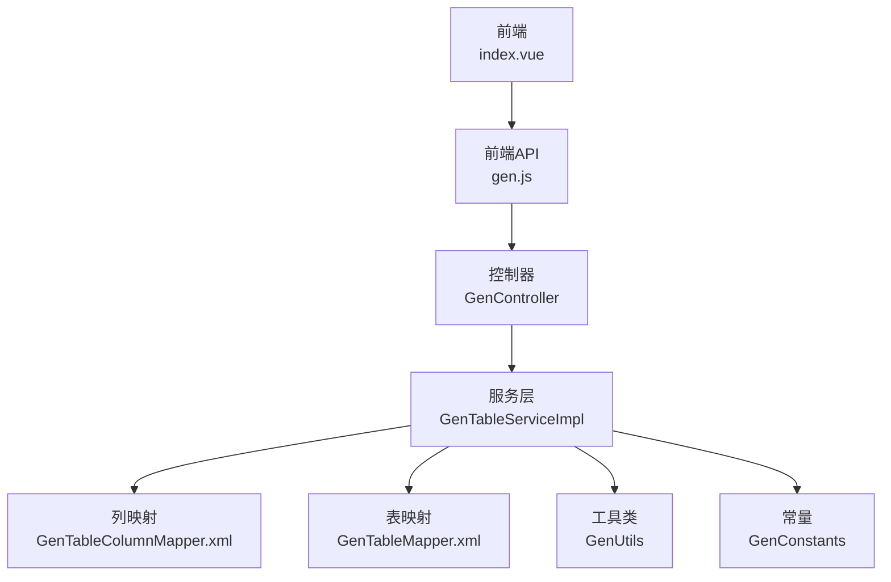
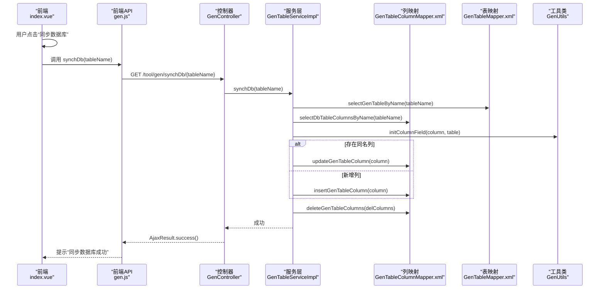
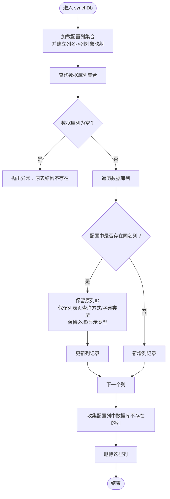
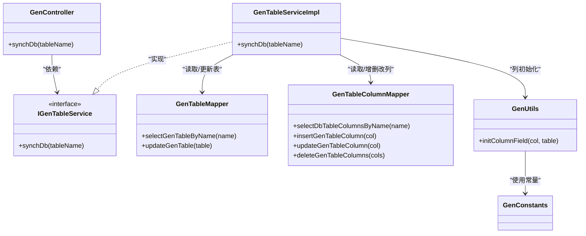

# 数据同步

<cite>
**本文引用的文件**
- [GenController.java](file://bearjia-admin-backend/src/main/java/com/javaxiaobear/module/tool/gen/controller/GenController.java)
- [GenTableServiceImpl.java](file://bearjia-admin-backend/src/main/java/com/javaxiaobear/module/tool/gen/service/GenTableServiceImpl.java)
- [GenTableColumnMapper.xml](file://bearjia-admin-backend/src/main/resources/mybatis/tool/GenTableColumnMapper.xml)
- [GenTableMapper.xml](file://bearjia-admin-backend/src/main/resources/mybatis/tool/GenTableMapper.xml)
- [GenUtils.java](file://bearjia-admin-backend/src/main/java/com/javaxiaobear/module/tool/gen/util/GenUtils.java)
- [GenConstants.java](file://bearjia-admin-backend/src/main/java/com/javaxiaobear/base/common/constant/GenConstants.java)
- [gen.js](file://bear-jia-vue3/src/api/tool/gen.js)
- [index.vue](file://bear-jia-vue3/src/views/tool/gen/index.vue)
- [bear_jia.sql](file://bearjia-admin-backend/src/main/resources/sql/bear_jia.sql)
</cite>

## 目录
1. [简介](#简介)
2. [项目结构](#项目结构)
3. [核心组件](#核心组件)
4. [架构总览](#架构总览)
5. [详细组件分析](#详细组件分析)
6. [依赖关系分析](#依赖关系分析)
7. [性能与并发特性](#性能与并发特性)
8. [故障排查指南](#故障排查指南)
9. [结论](#结论)
10. [附录](#附录)

## 简介
本文件围绕“数据同步”能力进行深入解析，重点说明 GenController 中 synchDb 方法如何将数据库表结构变更同步至代码生成配置，并覆盖字段增删改的处理逻辑（含数据类型映射、约束条件保留、页面展示类型推断等）。同时给出同步冲突的解决策略（以“保留手动配置”为主）、最佳实践（同步时机与影响评估），以及与模板引擎（Velocity）和前端交互的整体流程。

## 项目结构
- 后端采用 Spring Boot + MyBatis，代码生成模块位于 bearjia-admin-backend。
- 前端 Vue3 位于 bear-jia-vue3，提供表格列表、同步按钮、预览与批量生成等功能。
- 同步流程由前端发起请求，后端控制器接收，服务层执行同步逻辑，持久层读写数据库。

图表来源
- [GenController.java](file://bearjia-admin-backend/src/main/java/com/javaxiaobear/module/tool/gen/controller/GenController.java#L220-L231)
- [GenTableServiceImpl.java](file://bearjia-admin-backend/src/main/java/com/javaxiaobear/module/tool/gen/service/GenTableServiceImpl.java#L288-L340)
- [GenTableColumnMapper.xml](file://bearjia-admin-backend/src/main/resources/mybatis/tool/GenTableColumnMapper.xml#L39-L127)
- [GenTableMapper.xml](file://bearjia-admin-backend/src/main/resources/mybatis/tool/GenTableMapper.xml#L108-L128)
- [GenUtils.java](file://bearjia-admin-backend/src/main/java/com/javaxiaobear/module/tool/gen/util/GenUtils.java#L32-L131)
- [GenConstants.java](file://bearjia-admin-backend/src/main/java/com/javaxiaobear/base/common/constant/GenConstants.java#L34-L118)
- [gen.js](file://bear-jia-vue3/src/api/tool/gen.js#L70-L76)
- [index.vue](file://bear-jia-vue3/src/views/tool/gen/index.vue#L298-L307)

章节来源
- [GenController.java](file://bearjia-admin-backend/src/main/java/com/javaxiaobear/module/tool/gen/controller/GenController.java#L220-L231)
- [gen.js](file://bear-jia-vue3/src/api/tool/gen.js#L70-L76)
- [index.vue](file://bear-jia-vue3/src/views/tool/gen/index.vue#L298-L307)

## 核心组件
- 控制器 GenController：暴露 /tool/gen/synchDb/{tableName} 接口，调用服务层 synchDb。
- 服务实现 GenTableServiceImpl：事务内完成“对比数据库列与配置列”的同步逻辑。
- 映射器 GenTableColumnMapper.xml：从 information_schema 读取数据库列元数据；对列进行插入/更新/删除。
- 工具类 GenUtils：负责列字段的默认值初始化、HTML 类型推断、Java 类型映射等。
- 常量 GenConstants：统一管理模板分类、HTML 类型、数据库类型族、查询方式、必填标记等。

章节来源
- [GenController.java](file://bearjia-admin-backend/src/main/java/com/javaxiaobear/module/tool/gen/controller/GenController.java#L220-L231)
- [GenTableServiceImpl.java](file://bearjia-admin-backend/src/main/java/com/javaxiaobear/module/tool/gen/service/GenTableServiceImpl.java#L288-L340)
- [GenTableColumnMapper.xml](file://bearjia-admin-backend/src/main/resources/mybatis/tool/GenTableColumnMapper.xml#L39-L127)
- [GenUtils.java](file://bearjia-admin-backend/src/main/java/com/javaxiaobear/module/tool/gen/util/GenUtils.java#L32-L131)
- [GenConstants.java](file://bearjia-admin-backend/src/main/java/com/javaxiaobear/base/common/constant/GenConstants.java#L34-L118)

## 架构总览
下面的时序图展示了从前端点击“同步数据库”到后端执行同步并返回结果的完整流程。

图表来源
- [index.vue](file://bear-jia-vue3/src/views/tool/gen/index.vue#L298-L307)
- [gen.js](file://bear-jia-vue3/src/api/tool/gen.js#L70-L76)
- [GenController.java](file://bearjia-admin-backend/src/main/java/com/javaxiaobear/module/tool/gen/controller/GenController.java#L220-L231)
- [GenTableServiceImpl.java](file://bearjia-admin-backend/src/main/java/com/javaxiaobear/module/tool/gen/service/GenTableServiceImpl.java#L288-L340)
- [GenTableColumnMapper.xml](file://bearjia-admin-backend/src/main/resources/mybatis/tool/GenTableColumnMapper.xml#L39-L127)
- [GenTableMapper.xml](file://bearjia-admin-backend/src/main/resources/mybatis/tool/GenTableMapper.xml#L122-L128)
- [GenUtils.java](file://bearjia-admin-backend/src/main/java/com/javaxiaobear/module/tool/gen/util/GenUtils.java#L32-L131)

## 详细组件分析

### GenController.synchDb：接口入口与事务控制
- 接口路径：/tool/gen/synchDb/{tableName}
- 权限注解：仅具备“tool:gen:edit”权限可访问
- 事务注解：@Transactional，确保同步过程原子性
- 调用链：接收请求后直接委托给 IGenTableService.synchDb

章节来源
- [GenController.java](file://bearjia-admin-backend/src/main/java/com/javaxiaobear/module/tool/gen/controller/GenController.java#L220-L231)

### GenTableServiceImpl.synchDb：同步主流程
- 读取目标表的现有配置列集合，并构建“列名->列对象”的映射
- 从 information_schema 查询数据库当前列集合
- 对比逻辑：
  - 若数据库列存在于配置中：保留原列的 columnId，并按规则保留“列表页查询方式/字典类型”、“必填/显示类型”等手动配置项
  - 若数据库列不在配置中：新增该列
  - 最后删除配置中存在但数据库不存在的列
- 异常处理：当数据库列为空时抛出业务异常，提示“原表结构不存在”

图表来源
- [GenTableServiceImpl.java](file://bearjia-admin-backend/src/main/java/com/javaxiaobear/module/tool/gen/service/GenTableServiceImpl.java#L288-L340)
- [GenTableColumnMapper.xml](file://bearjia-admin-backend/src/main/resources/mybatis/tool/GenTableColumnMapper.xml#L39-L127)

章节来源
- [GenTableServiceImpl.java](file://bearjia-admin-backend/src/main/java/com/javaxiaobear/module/tool/gen/service/GenTableServiceImpl.java#L288-L340)

### GenUtils.initColumnField：字段初始化与类型映射
- 数据类型映射：
  - 字符串/文本：默认 HTML 输入框或文本域
  - 时间类型：Java 类型设为 Date，HTML 设为日期时间控件
  - 数字类型：根据精度与范围推断 Java 类型（Integer/Long/BigDecimal）
- 页面展示类型推断：
  - 名称类字段：查询方式设为 LIKE
  - 状态类字段：HTML 设为单选框
  - 类型/性别字段：HTML 设为下拉框
  - 图片/文件字段：分别设为图片上传/文件上传控件
  - 内容字段：HTML 设为富文本控件
- 其他默认行为：
  - 默认所有字段均为插入字段
  - 非主键且非禁止编辑字段默认为编辑字段
  - 非主键且非禁止列表字段默认为列表字段
  - 非主键且非禁止查询字段默认为查询字段

章节来源
- [GenUtils.java](file://bearjia-admin-backend/src/main/java/com/javaxiaobear/module/tool/gen/util/GenUtils.java#L32-L131)
- [GenConstants.java](file://bearjia-admin-backend/src/main/java/com/javaxiaobear/base/common/constant/GenConstants.java#L34-L118)

### GenTableColumnMapper.xml：列的增删改
- selectDbTableColumnsByName：从 information_schema.columns 读取列元数据（含是否必填、是否主键、是否自增、排序、注释、类型等）
- insertGenTableColumn/updateGenTableColumn/deleteGenTableColumns：完成列的新增、更新、删除
- 注意：更新时会保留手动配置项（如 isRequired、htmlType、dictType、queryType 等）

章节来源
- [GenTableColumnMapper.xml](file://bearjia-admin-backend/src/main/resources/mybatis/tool/GenTableColumnMapper.xml#L39-L127)

### 前端集成：index.vue 与 gen.js
- 前端提供“同步数据库”按钮，调用 gen.js 的 synchDb 接口
- 成功后刷新表格，提示“同步数据库成功”
- 失败时提示“同步数据库失败，请检查数据库连接”

章节来源
- [index.vue](file://bear-jia-vue3/src/views/tool/gen/index.vue#L298-L307)
- [gen.js](file://bear-jia-vue3/src/api/tool/gen.js#L70-L76)

## 依赖关系分析
- 控制器依赖服务接口 IGenTableService
- 服务实现依赖：
  - GenTableMapper（读取/更新表配置）
  - GenTableColumnMapper（读取数据库列、写入配置列）
  - GenUtils（列字段初始化）
  - GenConstants（类型/HTML/查询方式常量）
- 前端通过 gen.js 发起同步请求，经由后端控制器到达服务层

图表来源
- [GenController.java](file://bearjia-admin-backend/src/main/java/com/javaxiaobear/module/tool/gen/controller/GenController.java#L220-L231)
- [GenTableServiceImpl.java](file://bearjia-admin-backend/src/main/java/com/javaxiaobear/module/tool/gen/service/GenTableServiceImpl.java#L288-L340)
- [GenTableMapper.xml](file://bearjia-admin-backend/src/main/resources/mybatis/tool/GenTableMapper.xml#L122-L128)
- [GenTableColumnMapper.xml](file://bearjia-admin-backend/src/main/resources/mybatis/tool/GenTableColumnMapper.xml#L39-L127)
- [GenUtils.java](file://bearjia-admin-backend/src/main/java/com/javaxiaobear/module/tool/gen/util/GenUtils.java#L32-L131)
- [GenConstants.java](file://bearjia-admin-backend/src/main/java/com/javaxiaobear/base/common/constant/GenConstants.java#L34-L118)

## 性能与并发特性
- 事务控制：synchDb 在服务层使用 @Transactional，保证数据库一致性
- 查询与更新：
  - 一次性读取数据库列集合，再一次性删除配置中多余列，减少往返次数
  - 更新列时仅更新必要的字段，避免全量覆盖
- 并发注意：
  - 同步期间对同一表的并发写入可能导致“新增列/删除列”冲突，建议在低峰期或单人操作
  - 若存在大量列，建议分批同步或在业务允许范围内拆分

[本节为通用性能讨论，无需列出章节来源]

## 故障排查指南
- “原表结构不存在”：当数据库列集合为空时抛出异常，通常表示表名错误或数据库连接问题
- 同步后页面展示异常：
  - 检查 GenUtils 的 HTML 类型推断是否符合预期（如状态字段应为单选框）
  - 检查 GenConstants 中的常量是否被误改
- 列缺失或冗余：
  - 确认 GenTableColumnMapper 的 selectDbTableColumnsByName 是否能正确读取 information_schema
  - 确认删除逻辑是否命中了配置中不存在于数据库的列
- 前端无响应：
  - 检查 gen.js 的 synchDb 请求是否成功返回
  - 检查 index.vue 的同步回调是否触发刷新

章节来源
- [GenTableServiceImpl.java](file://bearjia-admin-backend/src/main/java/com/javaxiaobear/module/tool/gen/service/GenTableServiceImpl.java#L288-L340)
- [GenTableColumnMapper.xml](file://bearjia-admin-backend/src/main/resources/mybatis/tool/GenTableColumnMapper.xml#L39-L127)
- [gen.js](file://bear-jia-vue3/src/api/tool/gen.js#L70-L76)
- [index.vue](file://bear-jia-vue3/src/views/tool/gen/index.vue#L298-L307)

## 结论
- GenController.synchDb 将数据库表结构变更安全地同步到代码生成配置，通过“保留手动配置+自动映射”的策略，兼顾了灵活性与一致性。
- 字段增删改的处理逻辑清晰：新增列自动初始化默认值，更新列保留关键配置，删除列清理冗余。
- 建议在稳定窗口执行同步，同步前后做好备份与回归测试，确保生成代码与数据库一致。

[本节为总结性内容，无需列出章节来源]

## 附录

### 同步冲突的解决策略
- 优先保留手动配置：列表页查询方式、字典类型、必填/显示类型等均在更新时保留
- 自动映射与默认值：数据类型映射、HTML 类型推断、插入/编辑/列表/查询字段默认启用等由工具类统一处理
- 自动合并：新增列自动插入，删除列自动清理
- 手动干预：若出现不符合预期的映射，可在前端配置页调整列属性后再执行同步

章节来源
- [GenTableServiceImpl.java](file://bearjia-admin-backend/src/main/java/com/javaxiaobear/module/tool/gen/service/GenTableServiceImpl.java#L288-L340)
- [GenUtils.java](file://bearjia-admin-backend/src/main/java/com/javaxiaobear/module/tool/gen/util/GenUtils.java#L32-L131)

### 最佳实践
- 同步时机
  - 在数据库结构变更完成后立即同步，避免生成代码与数据库不一致
  - 避免在业务高峰期执行，降低锁竞争与影响面
- 变更影响评估
  - 对主键、自增、必填、唯一等约束的变更需特别关注
  - 对大字段（文本/长文本）的变更会影响页面展示类型与查询方式
- 回滚与验证
  - 同步前备份数据库与配置表
  - 同步后运行预览与单元测试，确保生成代码可用

[本节为通用最佳实践，无需列出章节来源]

### 与模板引擎（Velocity）的关系
- 同步完成后，可通过预览或生成代码接口触发模板渲染，将 GenTable/GenTableColumn 的配置转换为实体、Mapper、Service、Controller、XML、前端页面等
- 生成路径与模板列表由 VelocityUtils 统一管理

章节来源
- [GenTableServiceImpl.java](file://bearjia-admin-backend/src/main/java/com/javaxiaobear/module/tool/gen/service/GenTableServiceImpl.java#L215-L285)
- [GenTableMapper.xml](file://bearjia-admin-backend/src/main/resources/mybatis/tool/GenTableMapper.xml#L108-L128)