# 生成配置管理

<cite>
**本文档引用文件**   
- [genCodeConfigUpdate.vue](file://bear-jia-vue3\src\views\tool\gen\genCodeConfigUpdate.vue)
- [GenTable.java](file://bearjia-admin-backend\src\main\java\com\javaxiaobear\module\tool\gen\domain\GenTable.java)
- [GenController.java](file://bearjia-admin-backend\src\main\java\com\javaxiaobear\module\tool\gen\controller\GenController.java)
- [GenTableServiceImpl.java](file://bearjia-admin-backend\src\main\java\com\javaxiaobear\module\tool\gen\service\GenTableServiceImpl.java)
- [gen.js](file://bear-jia-vue3\src\api\tool\gen.js)
- [GenTableMapper.xml](file://bearjia-admin-backend\src\main\resources\mybatis\tool\GenTableMapper.xml)
- [VelocityUtils.java](file://bearjia-admin-backend\src\main\java\com\javaxiaobear\module\tool\gen\util\VelocityUtils.java)
- [GenConstants.java](file://bearjia-admin-backend\src\main\java\com\javaxiaobear\base\common\constant\GenConstants.java)
</cite>

## 目录
1. [生成配置管理](#生成配置管理)
2. [核心组件分析](#核心组件分析)
3. [生成配置数据校验流程](#生成配置数据校验流程)
4. [生成配置关键字段解析](#生成配置关键字段解析)
5. [生成参数设置方法](#生成参数设置方法)
6. [生成配置最佳实践](#生成配置最佳实践)
7. [生成配置管理与其他模块集成](#生成配置管理与其他模块集成)

## 核心组件分析

生成配置管理功能主要由前端Vue组件、后端控制器、服务层和实体类组成。前端通过`genCodeConfigUpdate.vue`组件提供用户界面，后端通过`GenController`处理请求，`GenTableServiceImpl`服务层实现业务逻辑，`GenTable`实体类定义数据结构。

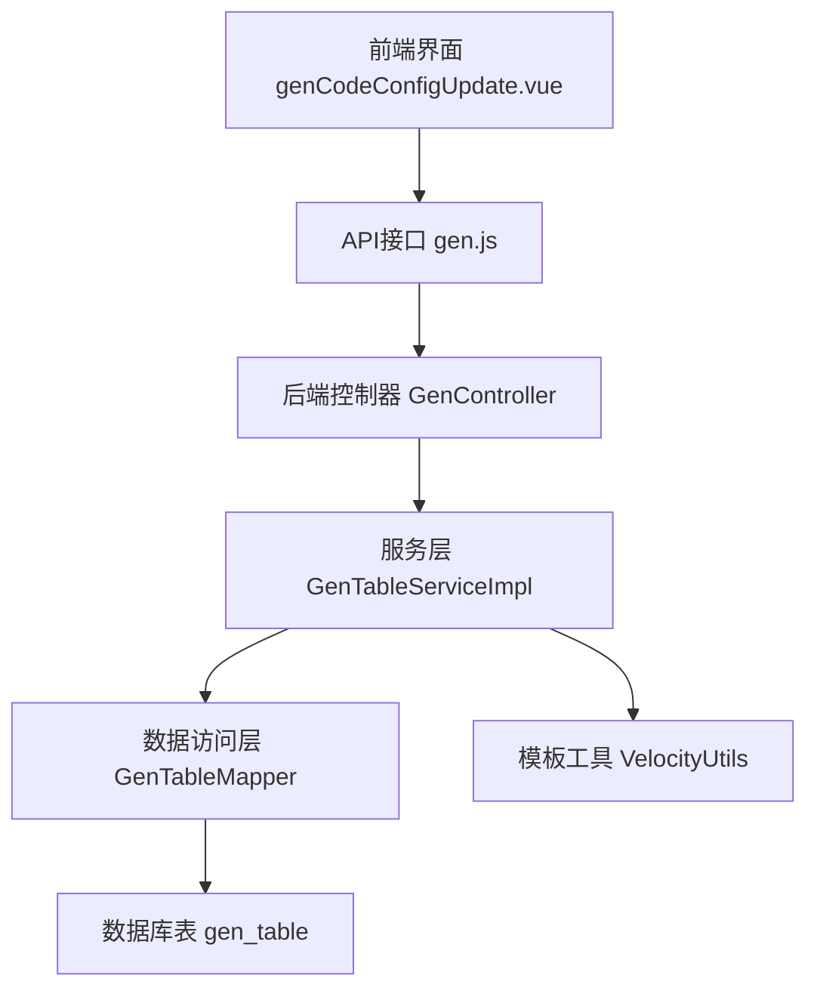

**图表来源**
- [genCodeConfigUpdate.vue](file://bear-jia-vue3\src\views\tool\gen\genCodeConfigUpdate.vue)
- [GenController.java](file://bearjia-admin-backend\src\main\java\com\javaxiaobear\module\tool\gen\controller\GenController.java)
- [GenTableServiceImpl.java](file://bearjia-admin-backend\src\main\java\com\javaxiaobear\module\tool\gen\service\GenTableServiceImpl.java)
- [GenTableMapper.xml](file://bearjia-admin-backend\src\main\resources\mybatis\tool\GenTableMapper.xml)

**本节来源**
- [genCodeConfigUpdate.vue](file://bear-jia-vue3\src\views\tool\gen\genCodeConfigUpdate.vue)
- [GenController.java](file://bearjia-admin-backend\src\main\java\com\javaxiaobear\module\tool\gen\controller\GenController.java)
- [GenTableServiceImpl.java](file://bearjia-admin-backend\src\main\java\com\javaxiaobear\module\tool\gen\service\GenTableServiceImpl.java)

## 生成配置数据校验流程

生成配置的更新流程始于前端用户在`genCodeConfigUpdate.vue`组件中修改配置并点击确认。该操作触发`clickModalOk`方法，该方法首先验证表单数据，然后调用`updateGenTable` API将数据提交到后端。

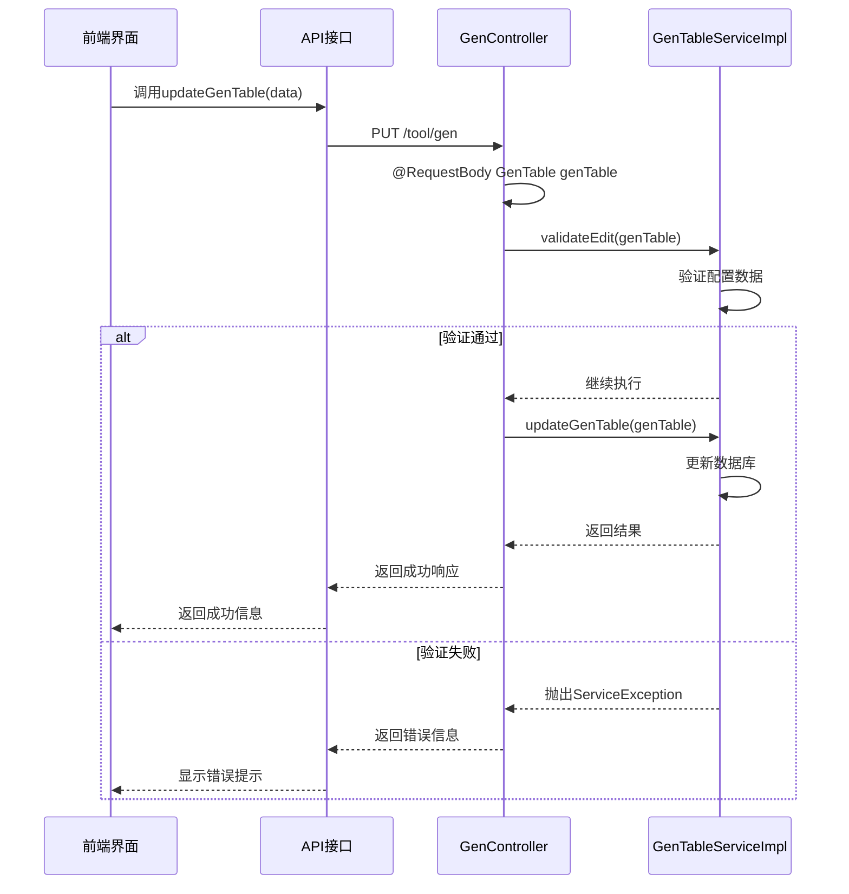

**图表来源**
- [genCodeConfigUpdate.vue](file://bear-jia-vue3\src\views\tool\gen\genCodeConfigUpdate.vue#L479-L502)
- [gen.js](file://bear-jia-vue3\src\api\tool\gen.js#L28-L35)
- [GenController.java](file://bearjia-admin-backend\src\main\java\com\javaxiaobear\module\tool\gen\controller\GenController.java#L166-L170)
- [GenTableServiceImpl.java](file://bearjia-admin-backend\src\main\java\com\javaxiaobear\module\tool\gen\service\GenTableServiceImpl.java#L415-L462)

**本节来源**
- [genCodeConfigUpdate.vue](file://bear-jia-vue3\src\views\tool\gen\genCodeConfigUpdate.vue)
- [GenController.java](file://bearjia-admin-backend\src\main\java\com\javaxiaobear\module\tool\gen\controller\GenController.java)
- [GenTableServiceImpl.java](file://bearjia-admin-backend\src\main\java\com\javaxiaobear\module\tool\gen\service\GenTableServiceImpl.java)

## 生成配置关键字段解析

`GenTable`实体类定义了生成配置的核心字段，这些字段决定了代码生成的行为和输出。

### 模板分类字段

`tplCategory`字段定义了代码生成的模板类型，决定了生成的代码结构和功能。

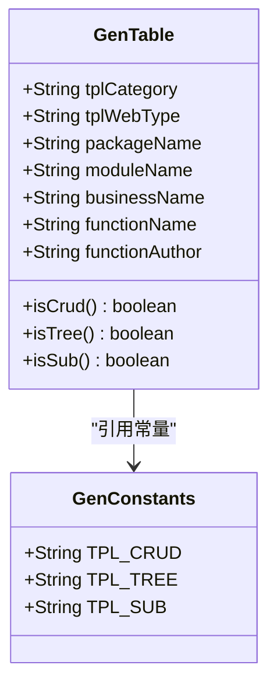

**图表来源**
- [GenTable.java](file://bearjia-admin-backend\src\main\java\com\javaxiaobear\module\tool\gen\domain\GenTable.java#L41-L43)
- [GenConstants.java](file://bearjia-admin-backend\src\main\java\com\javaxiaobear\base\common\constant\GenConstants.java#L10-L17)

**本节来源**
- [GenTable.java](file://bearjia-admin-backend\src\main\java\com\javaxiaobear\module\tool\gen\domain\GenTable.java)
- [GenConstants.java](file://bearjia-admin-backend\src\main\java\com\javaxiaobear\base\common\constant\GenConstants.java)

### 模板类型字段

`tplWebType`字段定义了前端模板类型，影响生成的前端代码风格和框架。

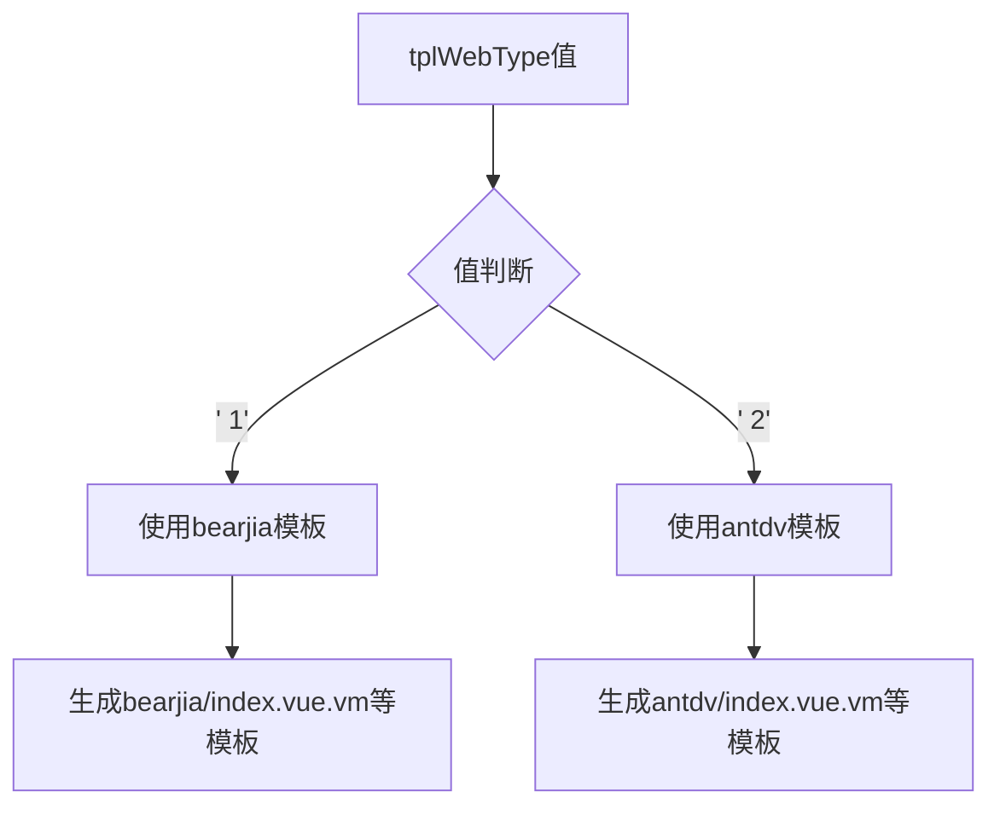

**图表来源**
- [VelocityUtils.java](file://bearjia-admin-backend\src\main\java\com\javaxiaobear\module\tool\gen\util\VelocityUtils.java#L144-L155)

**本节来源**
- [VelocityUtils.java](file://bearjia-admin-backend\src\main\java\com\javaxiaobear\module\tool\gen\util\VelocityUtils.java)

### 包路径和模块字段

`packageName`、`moduleName`、`businessName`等字段定义了代码生成的包结构和模块组织。

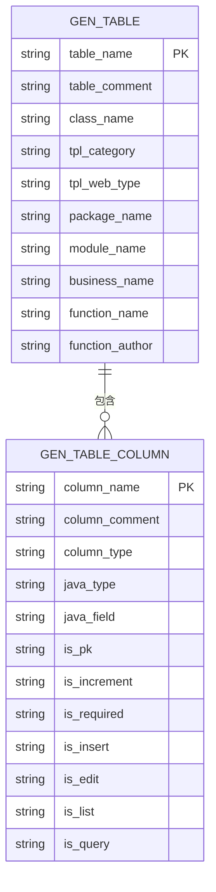

**图表来源**
- [GenTable.java](file://bearjia-admin-backend\src\main\java\com\javaxiaobear\module\tool\gen\domain\GenTable.java#L47-L57)
- [GenTableMapper.xml](file://bearjia-admin-backend\src\main\resources\mybatis\tool\GenTableMapper.xml#L57-L58)

**本节来源**
- [GenTable.java](file://bearjia-admin-backend\src\main\java\com\javaxiaobear\module\tool\gen\domain\GenTable.java)
- [GenTableMapper.xml](file://bearjia-admin-backend\src\main\resources\mybatis\tool\GenTableMapper.xml)

## 生成参数设置方法

生成参数的设置通过前端表单完成，每个参数都有特定的用途和配置规则。

### 实体类名设置

`className`字段用于设置生成的Java实体类名称，必须遵循Java命名规范。

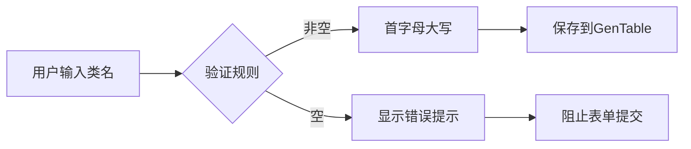

**图表来源**
- [genCodeConfigUpdate.vue](file://bear-jia-vue3\src\views\tool\gen\genCodeConfigUpdate.vue#L25-L28)
- [GenTable.java](file://bearjia-admin-backend\src\main\java\com\javaxiaobear\module\tool\gen\domain\GenTable.java#L37-L39)

**本节来源**
- [genCodeConfigUpdate.vue](file://bear-jia-vue3\src\views\tool\gen\genCodeConfigUpdate.vue)
- [GenTable.java](file://bearjia-admin-backend\src\main\java\com\javaxiaobear\module\tool\gen\domain\GenTable.java)

### 功能名称设置

`functionName`字段用于设置生成功能的名称，通常用于界面显示。

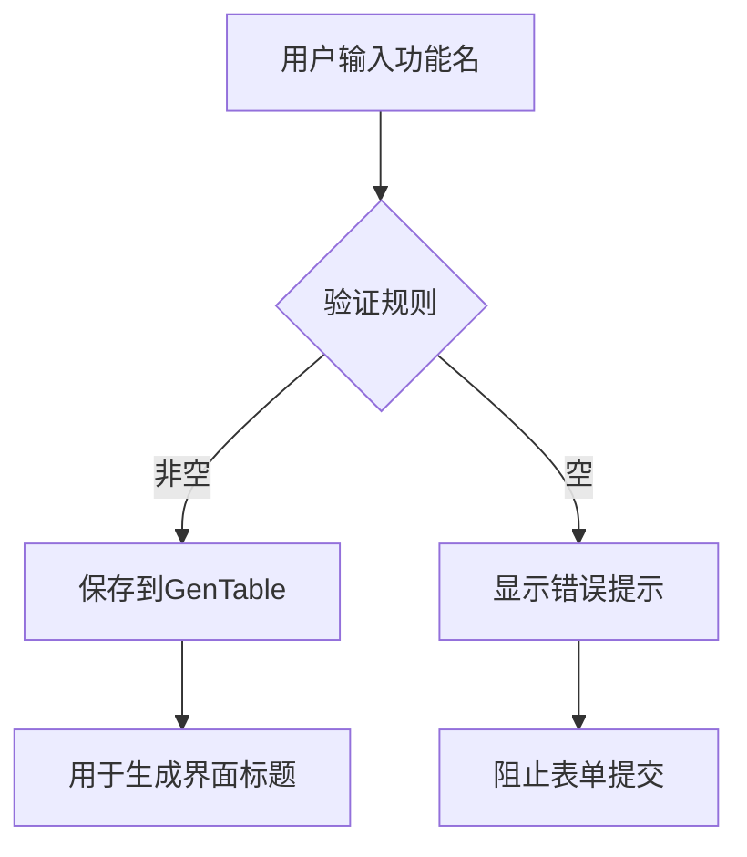

**图表来源**
- [genCodeConfigUpdate.vue](file://bear-jia-vue3\src\views\tool\gen\genCodeConfigUpdate.vue#L78-L82)
- [GenTable.java](file://bearjia-admin-backend\src\main\java\com\javaxiaobear\module\tool\gen\domain\GenTable.java#L59-L61)

**本节来源**
- [genCodeConfigUpdate.vue](file://bear-jia-vue3\src\views\tool\gen\genCodeConfigUpdate.vue)
- [GenTable.java](file://bearjia-admin-backend\src\main\java\com\javaxiaobear\module\tool\gen\domain\GenTable.java)

### 作者信息设置

`functionAuthor`字段用于设置代码生成的作者信息，通常用于代码注释。

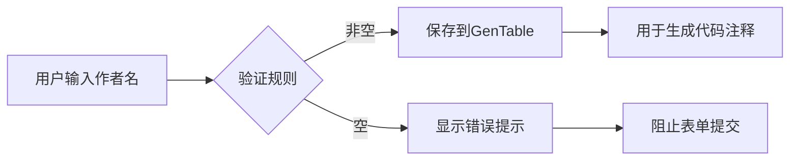

**图表来源**
- [genCodeConfigUpdate.vue](file://bear-jia-vue3\src\views\tool\gen\genCodeConfigUpdate.vue#L85-L89)
- [GenTable.java](file://bearjia-admin-backend\src\main\java\com\javaxiaobear\module\tool\gen\domain\GenTable.java#L63-L65)

**本节来源**
- [genCodeConfigUpdate.vue](file://bear-jia-vue3\src\views\tool\gen\genCodeConfigUpdate.vue)
- [GenTable.java](file://bearjia-admin-backend\src\main\java\com\javaxiaobear\module\tool\gen\domain\GenTable.java)

## 生成配置最佳实践

### 包路径规划

合理的包路径规划有助于代码的组织和维护。

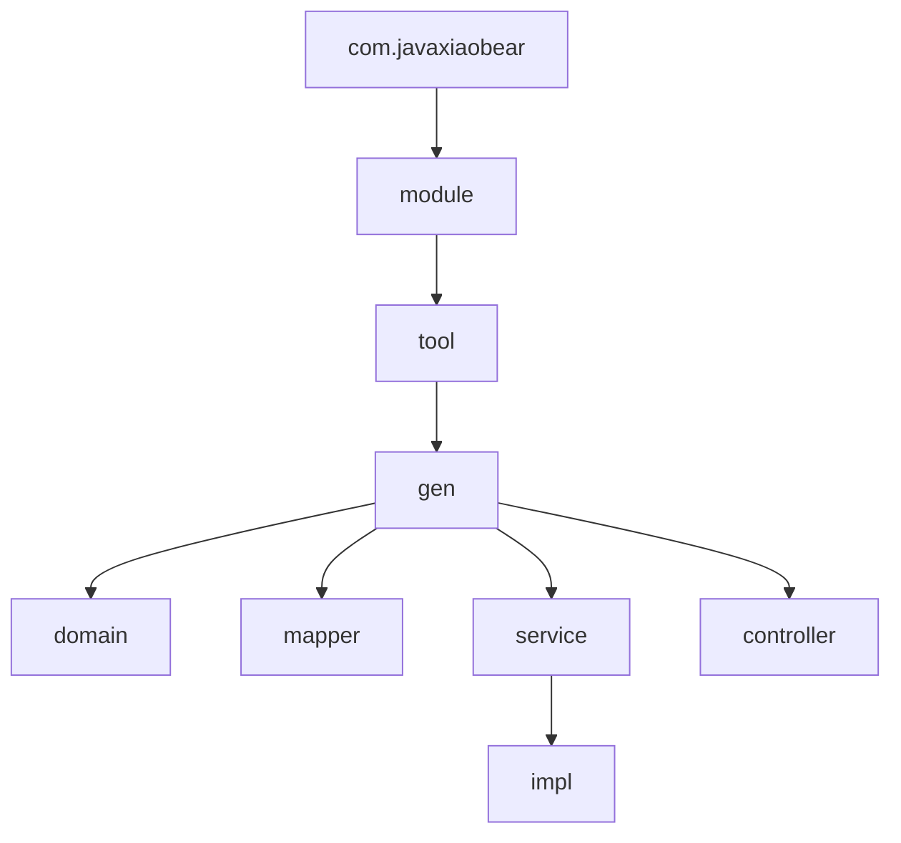

**图表来源**
- [VelocityUtils.java](file://bearjia-admin-backend\src\main\java\com\javaxiaobear\module\tool\gen\util\VelocityUtils.java#L23-L24)

**本节来源**
- [VelocityUtils.java](file://bearjia-admin-backend\src\main\java\com\javaxiaobear\module\tool\gen\util\VelocityUtils.java)

### 模块命名规范

模块命名应遵循清晰、一致的原则，便于理解和维护。

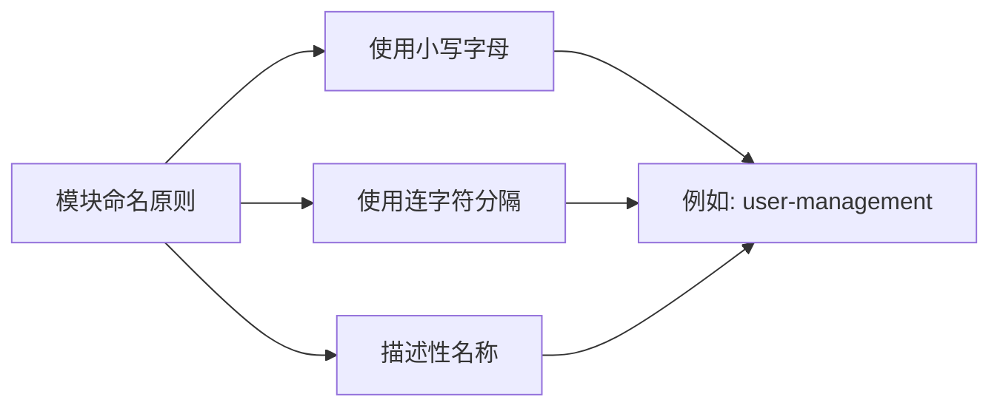

**本节来源**
- [GenTable.java](file://bearjia-admin-backend\src\main\java\com\javaxiaobear\module\tool\gen\domain\GenTable.java)

## 生成配置管理与其他模块集成

### 与Swagger集成

生成配置管理与Swagger集成，自动生成API文档。

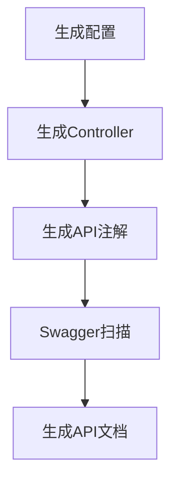

**本节来源**
- [GenTable.java](file://bearjia-admin-backend\src\main\java\com\javaxiaobear\module\tool\gen\domain\GenTable.java)
- [VelocityUtils.java](file://bearjia-admin-backend\src\main\java\com\javaxiaobear\module\tool\gen\util\VelocityUtils.java)