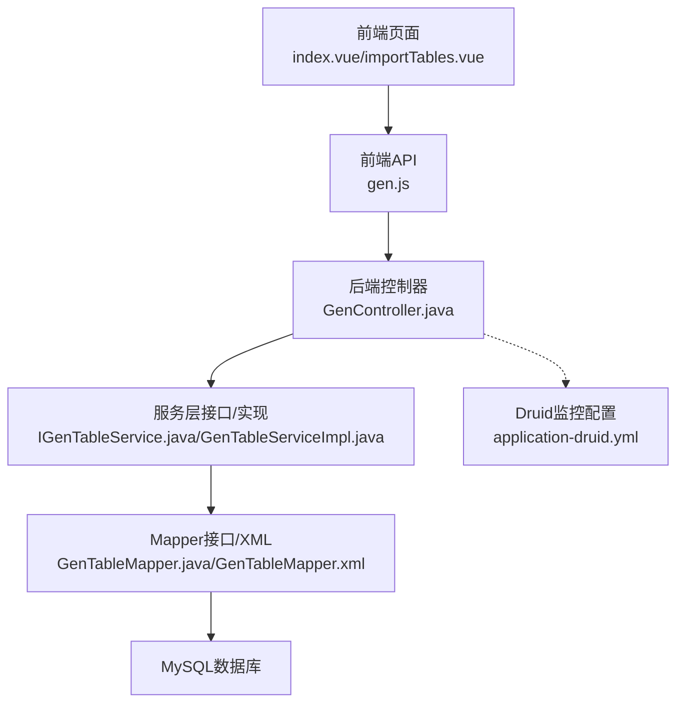
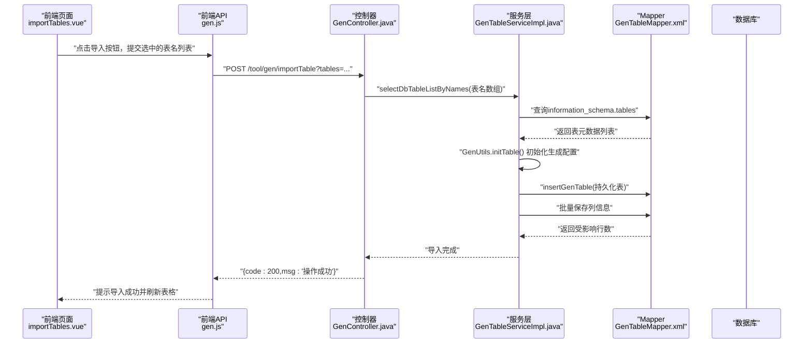
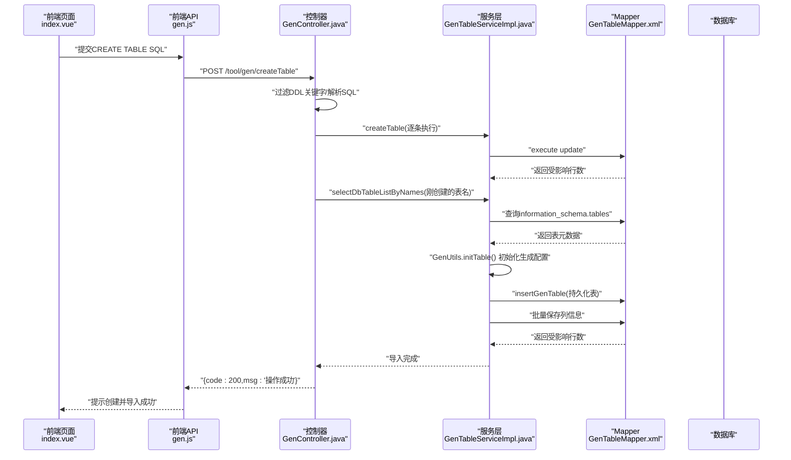
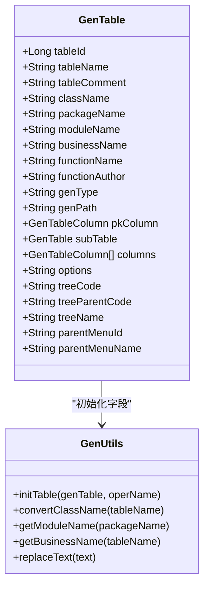
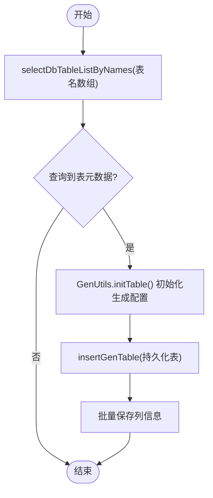
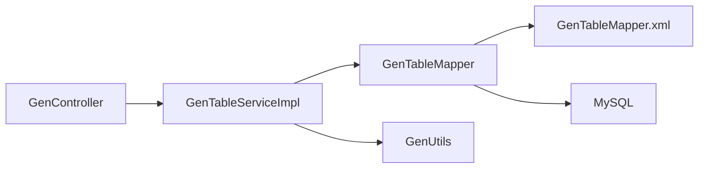

# 表结构管理

<cite>
**本文引用的文件**
- [GenController.java](file://bearjia-admin-backend/src/main/java/com/javaxiaobear/module/tool/gen/controller/GenController.java)
- [IGenTableService.java](file://bearjia-admin-backend/src/main/java/com/javaxiaobear/module/tool/gen/service/IGenTableService.java)
- [GenTableServiceImpl.java](file://bearjia-admin-backend/src/main/java/com/javaxiaobear/module/tool/gen/service/GenTableServiceImpl.java)
- [GenTableMapper.java](file://bearjia-admin-backend/src/main/java/com/javaxiaobear/module/tool/gen/mapper/GenTableMapper.java)
- [GenTableMapper.xml](file://bearjia-admin-backend/src/main/resources/mybatis/tool/GenTableMapper.xml)
- [GenTableColumnMapper.xml](file://bearjia-admin-backend/src/main/resources/mybatis/tool/GenTableColumnMapper.xml)
- [GenTable.java](file://bearjia-admin-backend/src/main/java/com/javaxiaobear/module/tool/gen/domain/GenTable.java)
- [GenUtils.java](file://bearjia-admin-backend/src/main/java/com/javaxiaobear/module/gen/util/GenUtils.java)
- [application-druid.yml](file://bearjia-admin-backend/src/main/resources/application-druid.yml)
- [index.vue](file://bear-jia-vue3/src/views/tool/gen/index.vue)
- [importTables.vue](file://bear-jia-vue3/src/views/tool/gen/importTables.vue)
- [gen.js](file://bear-jia-vue3/src/api/tool/gen.js)
- [bear_jia.sql](file://bearjia-admin-backend/src/main/resources/sql/bear_jia.sql)
</cite>

## 目录
1. [简介](#简介)
2. [项目结构](#项目结构)
3. [核心组件](#核心组件)
4. [架构总览](#架构总览)
5. [详细组件分析](#详细组件分析)
6. [依赖关系分析](#依赖关系分析)
7. [性能考量](#性能考量)
8. [故障排查指南](#故障排查指南)
9. [结论](#结论)
10. [附录](#附录)

## 简介
本文件围绕“表结构管理”功能，系统性解析以下关键点：
- GenController 中 importTableSave 如何通过 selectDbTableListByNames 查询数据库元数据并初始化生成配置
- GenController 中 createTableSave 如何解析 SQL 语句创建新表并导入代码生成配置
- GenTable 实体类中 tableName、tableComment 等字段的验证规则与业务含义
- 表结构导入的最佳实践（命名规范、字符集选择等）
- 表结构管理与其他模块的集成（如通过 Druid 监控数据库性能）

## 项目结构
该功能横跨前端 Vue3 页面与后端 Spring Boot 服务，核心交互链路如下：
- 前端通过 API 发起导入/创建请求
- 后端控制器接收请求，调用服务层完成数据库元数据查询与表结构导入/创建
- MyBatis Mapper 将元数据映射到 GenTable 及 GenTableColumn，并持久化到 gen_table 与 gen_table_column
- Druid 提供数据库连接池与监控能力，便于性能观测

图表来源
- [GenController.java](file://bearjia-admin-backend/src/main/java/com/javaxiaobear/module/tool/gen/controller/GenController.java#L108-L158)
- [IGenTableService.java](file://bearjia-admin-backend/src/main/java/com/javaxiaobear/module/tool/gen/service/IGenTableService.java#L1-L131)
- [GenTableMapper.java](file://bearjia-admin-backend/src/main/java/com/javaxiaobear/module/tool/gen/mapper/GenTableMapper.java#L1-L61)
- [GenTableMapper.xml](file://bearjia-admin-backend/src/main/resources/mybatis/tool/GenTableMapper.xml#L62-L114)
- [application-druid.yml](file://bearjia-admin-backend/src/main/resources/application-druid.yml#L1-L63)

章节来源
- [GenController.java](file://bearjia-admin-backend/src/main/java/com/javaxiaobear/module/tool/gen/controller/GenController.java#L108-L158)
- [index.vue](file://bear-jia-vue3/src/views/tool/gen/index.vue#L186-L195)
- [importTables.vue](file://bear-jia-vue3/src/views/tool/gen/importTables.vue#L167-L191)
- [gen.js](file://bear-jia-vue3/src/api/tool/gen.js#L64-L93)

## 核心组件
- GenController：提供导入表结构与创建表结构的 HTTP 接口，负责参数解析与事务控制
- IGenTableService/GenTableServiceImpl：封装导入/创建/同步等业务逻辑，协调 GenUtils 初始化与 Mapper 持久化
- GenTable/GenTableColumn：领域模型，承载表与列的元数据及生成配置
- GenTableMapper/GenTableMapper.xml：数据库访问层，负责查询数据库元数据与持久化
- GenUtils：生成器工具类，负责表/列初始化、命名转换、HTML/Java类型映射等
- Druid 配置：提供数据库连接池与监控视图

章节来源
- [IGenTableService.java](file://bearjia-admin-backend/src/main/java/com/javaxiaobear/module/tool/gen/service/IGenTableService.java#L1-L131)
- [GenTableServiceImpl.java](file://bearjia-admin-backend/src/main/java/com/javaxiaobear/module/tool/gen/service/GenTableServiceImpl.java#L127-L180)
- [GenTable.java](file://bearjia-admin-backend/src/main/java/com/javaxiaobear/module/tool/gen/domain/GenTable.java#L20-L120)
- [GenUtils.java](file://bearjia-admin-backend/src/main/java/com/javaxiaobear/module/gen/util/GenUtils.java#L1-L258)
- [GenTableMapper.xml](file://bearjia-admin-backend/src/main/resources/mybatis/tool/GenTableMapper.xml#L62-L114)

## 架构总览
下面以序列图展示“导入表结构”的端到端流程，突出 importTableSave 的关键步骤与数据流转。

图表来源
- [GenController.java](file://bearjia-admin-backend/src/main/java/com/javaxiaobear/module/tool/gen/controller/GenController.java#L108-L121)
- [GenTableServiceImpl.java](file://bearjia-admin-backend/src/main/java/com/javaxiaobear/module/tool/gen/service/GenTableServiceImpl.java#L127-L180)
- [GenTableMapper.xml](file://bearjia-admin-backend/src/main/resources/mybatis/tool/GenTableMapper.xml#L99-L106)
- [GenUtils.java](file://bearjia-admin-backend/src/main/java/com/javaxiaobear/module/gen/util/GenUtils.java#L21-L30)

## 详细组件分析

### GenController 中的导入与创建流程
- importTableSave
  - 接收参数 tables（逗号分隔的表名字符串），解析为数组
  - 调用服务层 selectDbTableListByNames 查询数据库元数据
  - 调用 importGenTable 完成导入，内部使用 GenUtils.initTable 初始化生成配置并持久化
- createTableSave
  - 接收参数 sql（可包含多条 DDL 语句）
  - 过滤 DDL 关键词，解析 SQL 语句，提取 CREATE TABLE 语句
  - 逐条执行创建表，收集成功创建的表名
  - 再次调用 selectDbTableListByNames 查询刚创建的表元数据并导入生成配置

图表来源
- [GenController.java](file://bearjia-admin-backend/src/main/java/com/javaxiaobear/module/tool/gen/controller/GenController.java#L123-L158)
- [GenTableServiceImpl.java](file://bearjia-admin-backend/src/main/java/com/javaxiaobear/module/tool/gen/service/GenTableServiceImpl.java#L150-L160)
- [GenTableMapper.xml](file://bearjia-admin-backend/src/main/resources/mybatis/tool/GenTableMapper.xml#L174-L176)

章节来源
- [GenController.java](file://bearjia-admin-backend/src/main/java/com/javaxiaobear/module/tool/gen/controller/GenController.java#L108-L158)
- [GenTableServiceImpl.java](file://bearjia-admin-backend/src/main/java/com/javaxiaobear/module/tool/gen/service/GenTableServiceImpl.java#L127-L180)
- [GenTableMapper.xml](file://bearjia-admin-backend/src/main/resources/mybatis/tool/GenTableMapper.xml#L174-L176)

### GenTable 实体类字段与验证规则
- 字段与验证
  - tableName：非空校验，用于标识数据库表名
  - tableComment：非空校验，用于生成功能名与描述
  - className、packageName、moduleName、businessName、functionName、functionAuthor：均要求非空，用于生成代码的命名与包结构
- 业务含义
  - className：根据表名转换得到的 Java 类名
  - packageName/moduleName/businessName/functionName/functionAuthor：生成代码的包路径、模块名、业务名、功能名与作者
  - genType/genPath：生成方式与输出路径
  - columns/pkColumn/subTable：表列集合、主键列、子表配置
- 初始化流程
  - 服务层在导入时调用 GenUtils.initTable，自动填充上述字段

图表来源
- [GenTable.java](file://bearjia-admin-backend/src/main/java/com/javaxiaobear/module/tool/gen/domain/GenTable.java#L20-L120)
- [GenUtils.java](file://bearjia-admin-backend/src/main/java/com/javaxiaobear/module/gen/util/GenUtils.java#L21-L30)

章节来源
- [GenTable.java](file://bearjia-admin-backend/src/main/java/com/javaxiaobear/module/tool/gen/domain/GenTable.java#L20-L120)
- [GenUtils.java](file://bearjia-admin-backend/src/main/java/com/javaxiaobear/module/gen/util/GenUtils.java#L21-L30)

### 数据库元数据查询与持久化
- selectDbTableListByNames
  - 通过 information_schema.tables 查询未被导入过的业务表，排除特定前缀与已存在 gen_table 的表
  - 支持按表名或注释模糊匹配
- insertGenTable
  - 将 GenTable 的非空字段写入 gen_table
- 列信息持久化
  - 通过 GenTableColumnMapper.xml 的 selectDbTableColumnsByName 查询列元数据并映射到 GenTableColumn
  - 批量插入 gen_table_column

图表来源
- [GenTableMapper.xml](file://bearjia-admin-backend/src/main/resources/mybatis/tool/GenTableMapper.xml#L99-L106)
- [GenTableMapper.xml](file://bearjia-admin-backend/src/main/resources/mybatis/tool/GenTableMapper.xml#L138-L172)
- [GenTableColumnMapper.xml](file://bearjia-admin-backend/src/main/resources/mybatis/tool/GenTableColumnMapper.xml#L42-L46)

章节来源
- [GenTableMapper.xml](file://bearjia-admin-backend/src/main/resources/mybatis/tool/GenTableMapper.xml#L62-L114)
- [GenTableMapper.xml](file://bearjia-admin-backend/src/main/resources/mybatis/tool/GenTableMapper.xml#L138-L172)
- [GenTableColumnMapper.xml](file://bearjia-admin-backend/src/main/resources/mybatis/tool/GenTableColumnMapper.xml#L42-L46)

### 前端交互与最佳实践
- 前端页面
  - index.vue 提供示例 SQL 与表结构管理入口
  - importTables.vue 支持按表名/注释筛选、勾选导入
- 最佳实践
  - 命名规范：表名采用下划线命名；字段名采用下划线命名；主键字段建议命名为 id
  - 注释规范：为表与字段添加 COMMENT 注释，便于生成配置与文档
  - 字符集与引擎：统一使用 utf8mb4 与 InnoDB
  - 字段约束：明确 NOT NULL、DEFAULT、UNIQUE、索引等约束
  - JSON/文本：长文本字段使用 TEXT 或 JSON，避免过长 VARCHAR

章节来源
- [index.vue](file://bear-jia-vue3/src/views/tool/gen/index.vue#L166-L182)
- [importTables.vue](file://bear-jia-vue3/src/views/tool/gen/importTables.vue#L167-L191)
- [gen.js](file://bear-jia-vue3/src/api/tool/gen.js#L64-L93)

## 依赖关系分析
- 控制器依赖服务层接口，服务层依赖 Mapper 接口与 XML 映射
- GenTableServiceImpl 在导入流程中调用 GenUtils 完成初始化
- Mapper 通过 MyBatis 访问 MySQL 的 information_schema 与业务表

图表来源
- [GenController.java](file://bearjia-admin-backend/src/main/java/com/javaxiaobear/module/tool/gen/controller/GenController.java#L108-L158)
- [GenTableServiceImpl.java](file://bearjia-admin-backend/src/main/java/com/javaxiaobear/module/tool/gen/service/GenTableServiceImpl.java#L127-L180)
- [GenTableMapper.java](file://bearjia-admin-backend/src/main/java/com/javaxiaobear/module/tool/gen/mapper/GenTableMapper.java#L1-L61)
- [GenTableMapper.xml](file://bearjia-admin-backend/src/main/resources/mybatis/tool/GenTableMapper.xml#L62-L114)
- [GenUtils.java](file://bearjia-admin-backend/src/main/java/com/javaxiaobear/module/gen/util/GenUtils.java#L21-L30)

章节来源
- [IGenTableService.java](file://bearjia-admin-backend/src/main/java/com/javaxiaobear/module/tool/gen/service/IGenTableService.java#L1-L131)
- [GenTableServiceImpl.java](file://bearjia-admin-backend/src/main/java/com/javaxiaobear/module/tool/gen/service/GenTableServiceImpl.java#L127-L180)

## 性能考量
- Druid 连接池配置
  - 提供初始大小、最小/最大连接数、等待超时、检测周期等参数，有助于稳定并发访问
  - 开启慢 SQL 记录与统计视图，便于定位性能瓶颈
- SQL 解析与执行
  - createTableSave 对 SQL 进行解析与过滤，建议限制单次提交的 DDL 数量，避免长时间阻塞
- 信息查询
  - selectDbTableListByNames 使用 in 子句查询，注意表名数组规模，避免过长 in 列表导致性能下降

章节来源
- [application-druid.yml](file://bearjia-admin-backend/src/main/resources/application-druid.yml#L1-L63)
- [GenTableMapper.xml](file://bearjia-admin-backend/src/main/resources/mybatis/tool/GenTableMapper.xml#L99-L106)

## 故障排查指南
- 导入失败
  - 检查表名是否已在 gen_table 中存在，或是否被排除规则过滤
  - 确认表注释是否为空，因为 tableName 与 tableComment 有非空校验
- 创建表失败
  - 查看日志中 createTableSave 抛出的异常信息
  - 确认 SQL 语法正确且包含主键
- Druid 监控
  - 通过 /druid 访问监控视图，查看连接池状态、慢 SQL、SQL 统计等
- 历史操作记录
  - bear_jia.sql 中包含历史操作日志，可用于回溯问题

章节来源
- [GenController.java](file://bearjia-admin-backend/src/main/java/com/javaxiaobear/module/tool/gen/controller/GenController.java#L123-L158)
- [bear_jia.sql](file://bearjia-admin-backend/src/main/resources/sql/bear_jia.sql#L588-L611)
- [application-druid.yml](file://bearjia-admin-backend/src/main/resources/application-druid.yml#L44-L63)

## 结论
- importTableSave 通过 selectDbTableListByNames 查询数据库元数据并结合 GenUtils.initTable 完成生成配置初始化，随后持久化到 gen_table 与 gen_table_column
- createTableSave 解析 SQL 语句创建新表，再通过 selectDbTableListByNames 查询元数据并导入生成配置，形成闭环
- GenTable 实体类的字段具备严格的非空校验，确保生成代码的完整性与一致性
- 建议遵循命名与注释规范，统一字符集与引擎，提升可维护性与可读性
- 通过 Druid 监控数据库性能，有助于及时发现与解决潜在问题

## 附录
- 前端 API
  - 导入表结构：POST /tool/gen/importTable
  - 创建表结构：POST /tool/gen/createTable
  - 同步数据库：GET /tool/gen/synchDb/{tableName}
  - 生成代码：GET /tool/gen/genCode/{tableName}
  - 批量生成：GET /tool/gen/batchGenCode?tables=...

章节来源
- [gen.js](file://bear-jia-vue3/src/api/tool/gen.js#L64-L93)
- [index.vue](file://bear-jia-vue3/src/views/tool/gen/index.vue#L186-L195)