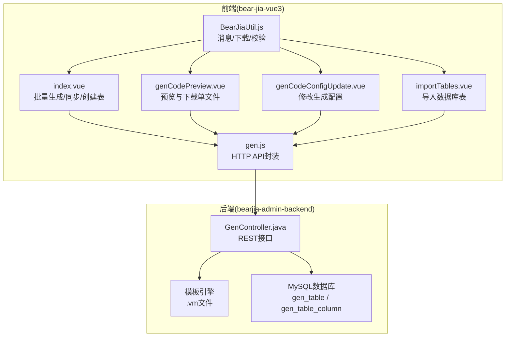
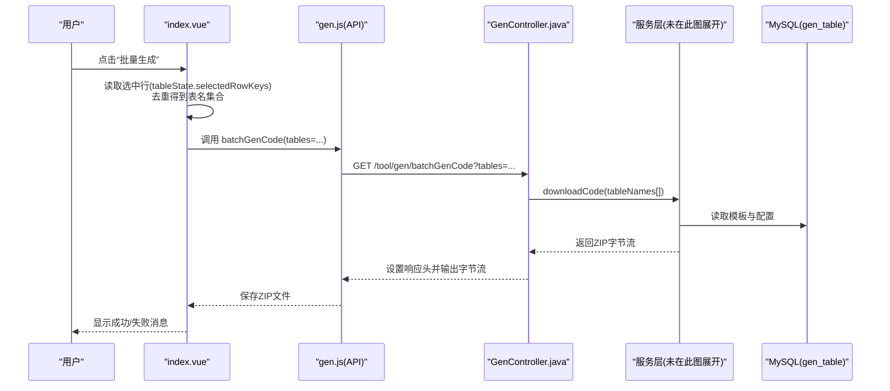
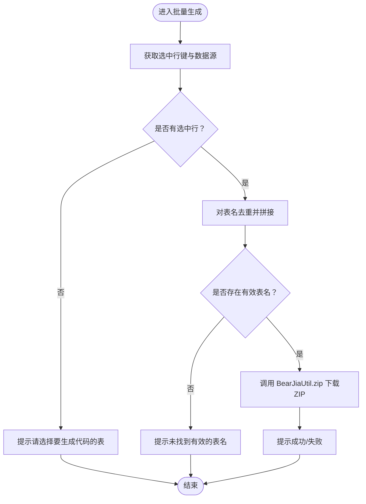
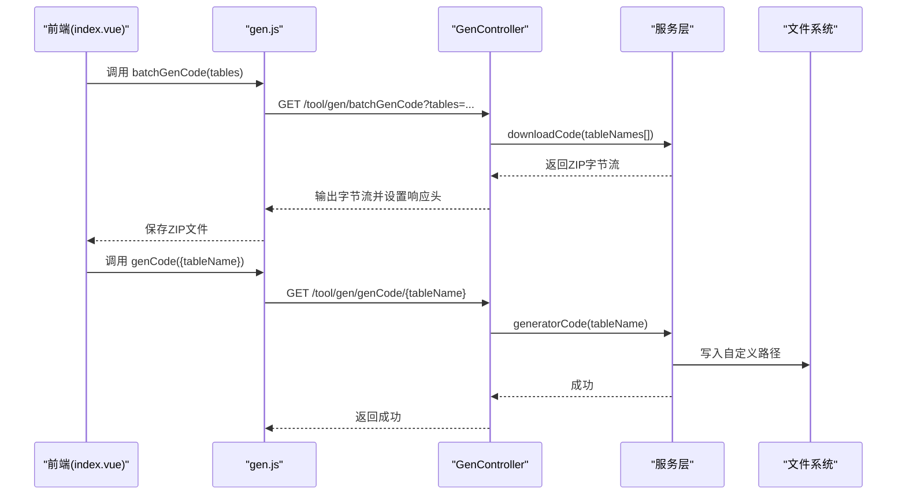
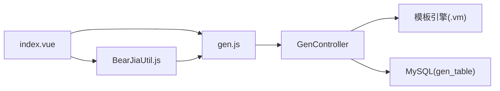

# 代码验证与调试

<cite>
**本文引用的文件**
- [bear-jia-vue3/src/api/tool/gen.js](file://bear-jia-vue3/src/api/tool/gen.js)
- [bear-jia-vue3/src/views/tool/gen/index.vue](file://bear-jia-vue3/src/views/tool/gen/index.vue)
- [bear-jia-vue3/src/views/tool/gen/genCodePreview.vue](file://bear-jia-vue3/src/views/tool/gen/genCodePreview.vue)
- [bear-jia-vue3/src/views/tool/gen/genCodeConfigUpdate.vue](file://bear-jia-vue3/src/views/tool/gen/genCodeConfigUpdate.vue)
- [bear-jia-vue3/src/views/tool/gen/importTables.vue](file://bear-jia-vue3/src/views/tool/gen/importTables.vue)
- [bear-jia-vue3/src/utils/BearJiaUtil.js](file://bear-jia-vue3/src/utils/BearJiaUtil.js)
- [bearjia-admin-backend/src/main/java/com/javaxiaobear/module/tool/gen/controller/GenController.java](file://bearjia-admin-backend/src/main/java/com/javaxiaobear/module/tool/gen/controller/GenController.java)
- [bearjia-admin-backend/src/main/resources/sql/bear_jia.sql](file://bearjia-admin-backend/src/main/resources/sql/bear_jia.sql)
- [bearjia-admin-backend/src/main/resources/vm/antdv/index.vue.vm](file://bearjia-admin-backend/src/main/resources/vm/antdv/index.vue.vm)
</cite>

## 目录
1. [简介](#简介)
2. [项目结构](#项目结构)
3. [核心组件](#核心组件)
4. [架构总览](#架构总览)
5. [详细组件分析](#详细组件分析)
6. [依赖关系分析](#依赖关系分析)
7. [性能考虑](#性能考虑)
8. [故障排查指南](#故障排查指南)
9. [结论](#结论)
10. [附录](#附录)

## 简介
本文件聚焦于“代码验证与调试”，围绕前端 gen.js API 模块与后端 GenController 的交互流程，系统性解析以下能力：
- 代码预览、下载、批量生成等操作的实现机制
- 前端 index.vue 中批量生成代码的实现逻辑（选中行处理、ZIP 下载、错误提示）
- 后端 GenController 中 downloadCode 与 generatorCode 接口的实现差异与适用场景
- gen_table 数据库表结构如何存储代码生成配置信息
- 生成代码的验证方法、常见错误类型（编译错误、运行时异常）及排查指南（模板变量缺失、路径冲突、权限配置等）

## 项目结构
该功能由前后端协同完成：
- 前端位于 bear-jia-vue3 工程，负责用户交互、表单配置、批量选择、预览与下载触发
- 后端位于 bearjia-admin-backend 工程，负责代码生成引擎、模板渲染、文件打包与下载响应

图表来源
- [bear-jia-vue3/src/views/tool/gen/index.vue](file://bear-jia-vue3/src/views/tool/gen/index.vue#L1-L348)
- [bear-jia-vue3/src/api/tool/gen.js](file://bear-jia-vue3/src/api/tool/gen.js#L1-L94)
- [bear-jia-vue3/src/utils/BearJiaUtil.js](file://bear-jia-vue3/src/utils/BearJiaUtil.js#L349-L400)
- [bearjia-admin-backend/src/main/java/com/javaxiaobear/module/tool/gen/controller/GenController.java](file://bearjia-admin-backend/src/main/java/com/javaxiaobear/module/tool/gen/controller/GenController.java#L196-L243)
- [bearjia-admin-backend/src/main/resources/sql/bear_jia.sql](file://bearjia-admin-backend/src/main/resources/sql/bear_jia.sql#L1-L120)

章节来源
- [bear-jia-vue3/src/views/tool/gen/index.vue](file://bear-jia-vue3/src/views/tool/gen/index.vue#L1-L348)
- [bear-jia-vue3/src/api/tool/gen.js](file://bear-jia-vue3/src/api/tool/gen.js#L1-L94)
- [bearjia-admin-backend/src/main/java/com/javaxiaobear/module/tool/gen/controller/GenController.java](file://bearjia-admin-backend/src/main/java/com/javaxiaobear/module/tool/gen/controller/GenController.java#L196-L243)
- [bearjia-admin-backend/src/main/resources/sql/bear_jia.sql](file://bearjia-admin-backend/src/main/resources/sql/bear_jia.sql#L1-L120)

## 核心组件
- 前端 API 封装：统一管理 /tool/gen 下的 REST 接口，包括列表、导入、预览、生成、同步、批量生成、创建表等
- 前端页面组件：
  - index.vue：主界面，支持批量生成、同步数据库、创建表、导入表
  - genCodePreview.vue：预览生成代码，支持复制与单文件下载
  - genCodeConfigUpdate.vue：修改生成配置（模板、包名、模块名、业务名、作者、生成方式等）
  - importTables.vue：从数据库选择表并导入
- 后端控制器：GenController 提供 REST 接口，负责预览、下载、生成、批量生成、同步数据库、导入表、创建表等
- 数据库表：gen_table 存放生成配置；gen_table_column 存放字段级配置
- 模板引擎：.vm 文件（如 antdv/index.vue.vm）用于渲染最终代码

章节来源
- [bear-jia-vue3/src/api/tool/gen.js](file://bear-jia-vue3/src/api/tool/gen.js#L1-L94)
- [bear-jia-vue3/src/views/tool/gen/index.vue](file://bear-jia-vue3/src/views/tool/gen/index.vue#L1-L348)
- [bear-jia-vue3/src/views/tool/gen/genCodePreview.vue](file://bear-jia-vue3/src/views/tool/gen/genCodePreview.vue#L1-L300)
- [bear-jia-vue3/src/views/tool/gen/genCodeConfigUpdate.vue](file://bear-jia-vue3/src/views/tool/gen/genCodeConfigUpdate.vue#L1-L516)
- [bear-jia-vue3/src/views/tool/gen/importTables.vue](file://bear-jia-vue3/src/views/tool/gen/importTables.vue#L1-L203)
- [bearjia-admin-backend/src/main/java/com/javaxiaobear/module/tool/gen/controller/GenController.java](file://bearjia-admin-backend/src/main/java/com/javaxiaobear/module/tool/gen/controller/GenController.java#L54-L243)
- [bearjia-admin-backend/src/main/resources/sql/bear_jia.sql](file://bearjia-admin-backend/src/main/resources/sql/bear_jia.sql#L1-L120)
- [bearjia-admin-backend/src/main/resources/vm/antdv/index.vue.vm](file://bearjia-admin-backend/src/main/resources/vm/antdv/index.vue.vm#L1-L120)

## 架构总览
从前端到后端的关键交互序列如下：

图表来源
- [bear-jia-vue3/src/views/tool/gen/index.vue](file://bear-jia-vue3/src/views/tool/gen/index.vue#L266-L296)
- [bear-jia-vue3/src/api/tool/gen.js](file://bear-jia-vue3/src/api/tool/gen.js#L78-L84)
- [bearjia-admin-backend/src/main/java/com/javaxiaobear/module/tool/gen/controller/GenController.java](file://bearjia-admin-backend/src/main/java/com/javaxiaobear/module/tool/gen/controller/GenController.java#L233-L243)

章节来源
- [bear-jia-vue3/src/views/tool/gen/index.vue](file://bear-jia-vue3/src/views/tool/gen/index.vue#L266-L296)
- [bearjia-admin-backend/src/main/java/com/javaxiaobear/module/tool/gen/controller/GenController.java](file://bearjia-admin-backend/src/main/java/com/javaxiaobear/module/tool/gen/controller/GenController.java#L233-L243)

## 详细组件分析

### 前端 API 模块（gen.js）
- 提供与后端 /tool/gen 交互的统一入口，包括：
  - 列表查询、数据库表查询、详情、导入、预览、删除、生成、同步、批量生成、创建表
- 关键点：
  - 预览接口：GET /tool/gen/preview/{tableId}
  - 单表生成（下载）：GET /tool/gen/download/{tableName}
  - 单表生成（自定义路径）：GET /tool/gen/genCode/{tableName}
  - 批量生成：GET /tool/gen/batchGenCode?tables=...
  - 同步数据库：GET /tool/gen/synchDb/{tableName}
  - 创建表：POST /tool/gen/createTable

章节来源
- [bear-jia-vue3/src/api/tool/gen.js](file://bear-jia-vue3/src/api/tool/gen.js#L1-L94)

### 前端 index.vue：批量生成逻辑
- 选中行处理：
  - 从 ProTable 的 tableState.selectedRowKeys 获取选中键，结合 dataSource 过滤出选中行
  - 对表名去重，拼接为逗号分隔字符串
- ZIP 下载：
  - 通过 BearJiaUtil.zip 发起 GET 请求，响应类型为 blob，自动保存为 ZIP
  - 文件名包含表数量与时间戳，避免覆盖
- 错误提示：
  - 未选中或无效表名时给出警告
  - try/catch 包裹，捕获异常并提示“请稍后重试”

图表来源
- [bear-jia-vue3/src/views/tool/gen/index.vue](file://bear-jia-vue3/src/views/tool/gen/index.vue#L218-L296)
- [bear-jia-vue3/src/utils/BearJiaUtil.js](file://bear-jia-vue3/src/utils/BearJiaUtil.js#L349-L400)

章节来源
- [bear-jia-vue3/src/views/tool/gen/index.vue](file://bear-jia-vue3/src/views/tool/gen/index.vue#L218-L296)
- [bear-jia-vue3/src/utils/BearJiaUtil.js](file://bear-jia-vue3/src/utils/BearJiaUtil.js#L349-L400)

### 前端 genCodePreview.vue：预览与单文件下载
- 预览：调用 previewTable 获取后端返回的多文件映射，按标签页展示
- 复制：优先使用 Clipboard API，失败则回退到 textarea 方案
- 单文件下载：将当前激活标签页代码以纯文本形式下载

章节来源
- [bear-jia-vue3/src/views/tool/gen/genCodePreview.vue](file://bear-jia-vue3/src/views/tool/gen/genCodePreview.vue#L1-L300)

### 前端 genCodeConfigUpdate.vue：修改生成配置
- 基本信息标签页：表名、表描述、实体类名、作者、备注、模板、前端模板、包名、模块名、业务名、功能名、上级菜单、生成方式（ZIP/自定义路径）、自定义路径
- 字段信息标签页：字段注释、Java类型、Java字段、插入/编辑/列表/查询、查询方式、必填、显示类型、字典类型等
- 保存：将表配置与字段列表合并提交后端

章节来源
- [bear-jia-vue3/src/views/tool/gen/genCodeConfigUpdate.vue](file://bear-jia-vue3/src/views/tool/gen/genCodeConfigUpdate.vue#L1-L516)

### 前端 importTables.vue：导入数据库表
- 查询数据库表列表，支持分页与筛选
- 多选导入：将选中的表名以逗号分隔传给后端导入接口

章节来源
- [bear-jia-vue3/src/views/tool/gen/importTables.vue](file://bear-jia-vue3/src/views/tool/gen/importTables.vue#L1-L203)

### 后端 GenController：downloadCode 与 generatorCode 的差异
- downloadCode（下载接口）：
  - HTTP GET /tool/gen/download/{tableName}
  - 返回 ZIP 字节流，设置 Content-Disposition 为 javaxiaobear.zip
  - 适用于一次性下载单表生成产物
- generatorCode（自定义路径接口）：
  - HTTP GET /tool/gen/genCode/{tableName}
  - 直接写入到配置的自定义路径，不返回下载流
  - 适用于直接生成到本地指定目录
- 批量生成：
  - HTTP GET /tool/gen/batchGenCode?tables=a,b,c
  - 返回 ZIP 字节流，适用于批量下载

图表来源
- [bear-jia-vue3/src/views/tool/gen/index.vue](file://bear-jia-vue3/src/views/tool/gen/index.vue#L240-L264)
- [bearjia-admin-backend/src/main/java/com/javaxiaobear/module/tool/gen/controller/GenController.java](file://bearjia-admin-backend/src/main/java/com/javaxiaobear/module/tool/gen/controller/GenController.java#L196-L243)

章节来源
- [bearjia-admin-backend/src/main/java/com/javaxiaobear/module/tool/gen/controller/GenController.java](file://bearjia-admin-backend/src/main/java/com/javaxiaobear/module/tool/gen/controller/GenController.java#L196-L243)

### 后端模板引擎与生成流程
- 模板位置：后端资源目录 vm/antdv 或 vm/bearjia 等
- 典型模板：index.vue.vm 等，通过 Velocity 语法渲染生成前端页面
- 生成过程：后端根据 gen_table 与 gen_table_column 的配置，结合模板渲染输出文件内容，并打包为 ZIP 或写入指定路径

章节来源
- [bearjia-admin-backend/src/main/resources/vm/antdv/index.vue.vm](file://bearjia-admin-backend/src/main/resources/vm/antdv/index.vue.vm#L1-L120)

## 依赖关系分析
- 前端依赖后端 REST 接口，通过 Axios 发送请求并处理响应
- 前端工具类 BearJiaUtil 封装了消息提示、下载、Blob 校验等通用能力
- 后端 GenController 依赖服务层与模板引擎，最终访问数据库读取生成配置

图表来源
- [bear-jia-vue3/src/api/tool/gen.js](file://bear-jia-vue3/src/api/tool/gen.js#L1-L94)
- [bear-jia-vue3/src/utils/BearJiaUtil.js](file://bear-jia-vue3/src/utils/BearJiaUtil.js#L349-L400)
- [bearjia-admin-backend/src/main/java/com/javaxiaobear/module/tool/gen/controller/GenController.java](file://bearjia-admin-backend/src/main/java/com/javaxiaobear/module/tool/gen/controller/GenController.java#L196-L243)
- [bearjia-admin-backend/src/main/resources/sql/bear_jia.sql](file://bearjia-admin-backend/src/main/resources/sql/bear_jia.sql#L1-L120)

章节来源
- [bear-jia-vue3/src/api/tool/gen.js](file://bear-jia-vue3/src/api/tool/gen.js#L1-L94)
- [bear-jia-vue3/src/utils/BearJiaUtil.js](file://bear-jia-vue3/src/utils/BearJiaUtil.js#L349-L400)
- [bearjia-admin-backend/src/main/java/com/javaxiaobear/module/tool/gen/controller/GenController.java](file://bearjia-admin-backend/src/main/java/com/javaxiaobear/module/tool/gen/controller/GenController.java#L196-L243)
- [bearjia-admin-backend/src/main/resources/sql/bear_jia.sql](file://bearjia-admin-backend/src/main/resources/sql/bear_jia.sql#L1-L120)

## 性能考虑
- 批量生成时建议控制表数量，避免 ZIP 过大导致内存压力与下载耗时
- 预览接口仅返回模板渲染后的文本，适合轻量查看；大批量下载建议使用批量生成接口
- 前端下载采用 Blob 流式处理，避免阻塞主线程
- 后端批量生成返回字节流，注意网络带宽与服务器磁盘 IO

## 故障排查指南

### 1. 生成失败（编译错误/运行时异常）
- 现象
  - 预览页面无法打开或报错
  - 下载 ZIP 后解压为空或部分文件缺失
- 排查步骤
  - 检查模板变量是否完整（如 columns、pkColumn、moduleName、businessName 等）
  - 检查 gen_table 与 gen_table_column 是否正确导入并配置
  - 查看后端日志，定位模板渲染异常或文件写入异常
- 常见原因
  - 模板中引用了未提供的字典类型或字段
  - 生成路径不可写或权限不足
  - 数据库连接异常导致无法读取表结构

章节来源
- [bearjia-admin-backend/src/main/resources/vm/antdv/index.vue.vm](file://bearjia-admin-backend/src/main/resources/vm/antdv/index.vue.vm#L1-L120)
- [bearjia-admin-backend/src/main/resources/sql/bear_jia.sql](file://bearjia-admin-backend/src/main/resources/sql/bear_jia.sql#L1-L120)

### 2. 预览空白或内容不完整
- 现象
  - 预览弹窗打开但无代码
- 排查步骤
  - 确认已调用预览接口并正确接收返回的多文件映射
  - 检查当前激活标签页 key 是否正确
  - 检查 highlight 显示逻辑与容器高度
- 常见原因
  - 接口返回数据为空
  - 标签页 key 与实际文件名不一致

章节来源
- [bear-jia-vue3/src/views/tool/gen/genCodePreview.vue](file://bear-jia-vue3/src/views/tool/gen/genCodePreview.vue#L1-L300)

### 3. 批量生成下载失败
- 现象
  - 下载弹窗无响应或下载失败
- 排查步骤
  - 检查 BearJiaUtil.zip 的请求 URL 与响应类型
  - 检查后端响应头设置（Content-Disposition、Content-Length、Content-Type）
  - 检查网络代理与跨域配置
- 常见原因
  - 后端未正确设置响应头
  - 前端未正确处理 Blob 校验
  - 跨域未配置或 Token 过期

章节来源
- [bear-jia-vue3/src/utils/BearJiaUtil.js](file://bear-jia-vue3/src/utils/BearJiaUtil.js#L349-L400)
- [bearjia-admin-backend/src/main/java/com/javaxiaobear/module/tool/gen/controller/GenController.java](file://bearjia-admin-backend/src/main/java/com/javaxiaobear/module/tool/gen/controller/GenController.java#L245-L258)

### 4. 同步数据库失败
- 现象
  - 同步按钮点击后无反馈或失败
- 排查步骤
  - 检查后端 synchDb 接口是否抛出异常
  - 检查数据库连接与权限
- 常见原因
  - 数据库连接异常
  - 表结构变更后未正确导入

章节来源
- [bear-jia-vue3/src/views/tool/gen/index.vue](file://bear-jia-vue3/src/views/tool/gen/index.vue#L298-L307)
- [bearjia-admin-backend/src/main/java/com/javaxiaobear/module/tool/gen/controller/GenController.java](file://bearjia-admin-backend/src/main/java/com/javaxiaobear/module/tool/gen/controller/GenController.java#L220-L231)

### 5. 创建表失败
- 现象
  - 创建表弹窗保存后失败
- 排查步骤
  - 检查 SQL 语法与关键字过滤
  - 检查是否为 CREATE TABLE 语句
- 常见原因
  - SQL 语法错误或包含不允许的关键字
  - 未输入 SQL 或为空

章节来源
- [bear-jia-vue3/src/views/tool/gen/index.vue](file://bear-jia-vue3/src/views/tool/gen/index.vue#L309-L345)
- [bearjia-admin-backend/src/main/java/com/javaxiaobear/module/tool/gen/controller/GenController.java](file://bearjia-admin-backend/src/main/java/com/javaxiaobear/module/tool/gen/controller/GenController.java#L123-L158)

## 结论
- 前端通过统一 API 封装与工具类，实现了从“导入表 -> 修改配置 -> 预览 -> 生成/下载”的完整闭环
- 后端 GenController 提供了预览、下载、生成、批量生成、同步数据库、导入表、创建表等能力，满足不同场景需求
- gen_table 与 gen_table_column 作为配置中心，承载了模板选择、包名模块名、字段映射等关键信息
- 验证与调试建议：先预览再批量下载，关注模板变量与权限配置，结合日志与网络抓包定位问题

## 附录

### gen_table 表结构要点（摘自数据库脚本）
- 主要字段
  - table_id：主键
  - table_name、table_comment：表名与描述
  - class_name：实体类名
  - tpl_category：模板类别（crud/tree）
  - tpl_web_type：前端模板类型（如 antdv、bearjia）
  - package_name、module_name、business_name、function_name、function_author：生成包与业务信息
  - gen_type：生成方式（0 ZIP、1 自定义路径）
  - gen_path：自定义路径
  - options：其他生成选项
  - create_time/update_time：时间戳
- 字段级配置
  - gen_table_column：对应字段的 Java 类型、Java 字段名、是否必填、是否插入/编辑/列表/查询、查询方式、HTML 显示类型、字典类型、排序等

章节来源
- [bearjia-admin-backend/src/main/resources/sql/bear_jia.sql](file://bearjia-admin-backend/src/main/resources/sql/bear_jia.sql#L1-L120)