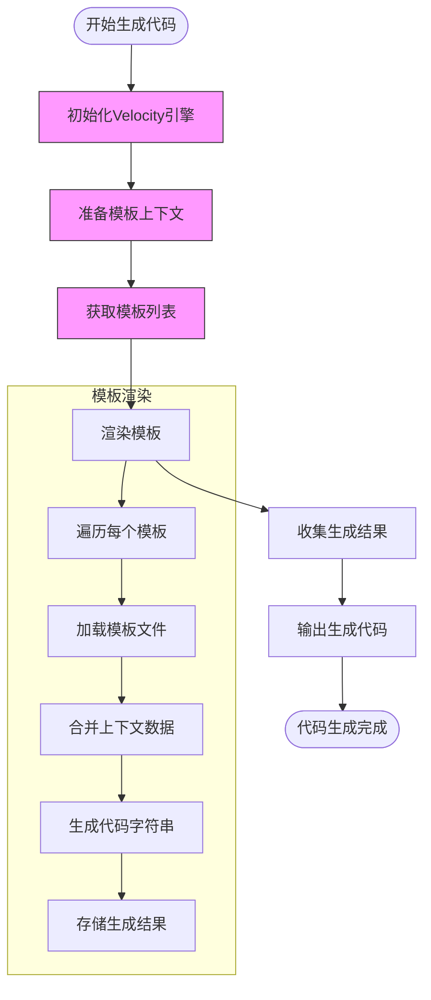
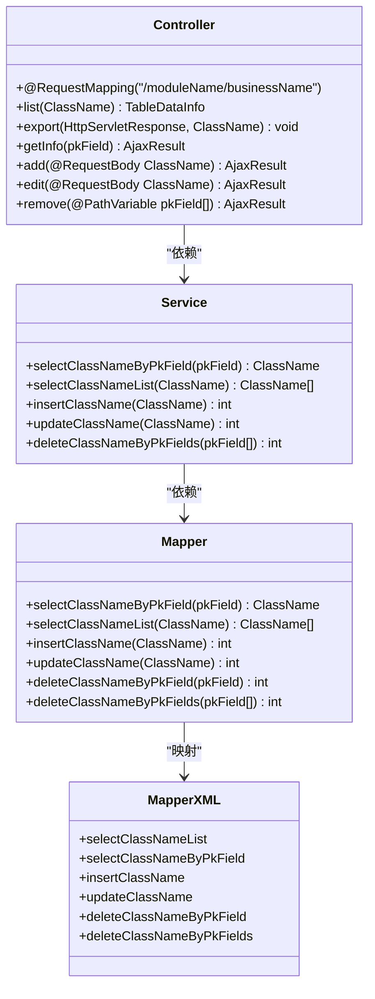
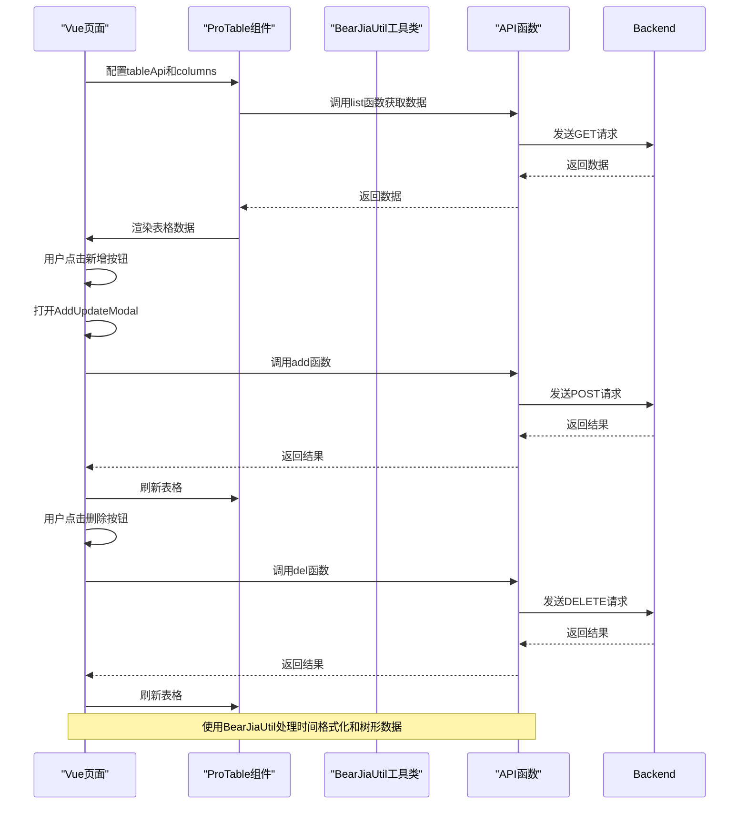
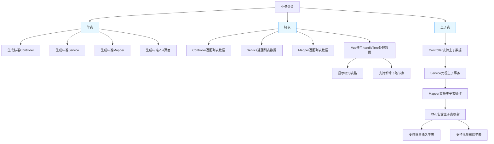
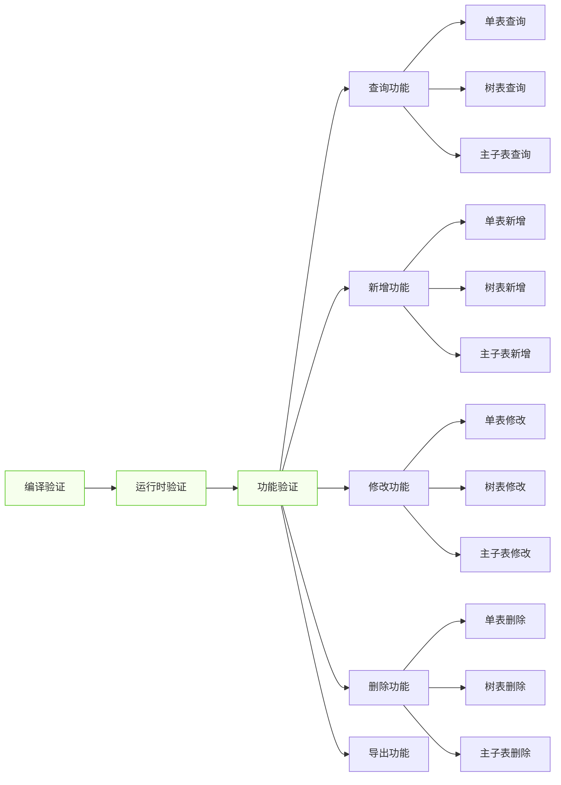

# 前后端代码生成流程

<cite>
**本文档引用的文件**
- [index.vue.vm](file://bear-jia-vue3/docs/bearjia/index.vue.vm)
- [api.js.vm](file://bear-jia-vue3/docs/bearjia/api.js.vm)
- [controller.java.vm](file://bearjia-admin-backend/src/main/resources/vm/java/controller.java.vm)
- [mapper.java.vm](file://bearjia-admin-backend/src/main/resources/vm/java/mapper.java.vm)
- [GenTableServiceImpl.java](file://bearjia-admin-backend/src/main/java/com/javaxiaobear/module/tool/gen/service/GenTableServiceImpl.java)
- [VelocityUtils.java](file://bearjia-admin-backend/src/main/java/com/javaxiaobear/module/tool/gen/util/VelocityUtils.java)
- [VelocityInitializer.java](file://bearjia-admin-backend/src/main/java/com/javaxiaobear/module/tool/gen/util/VelocityInitializer.java)
- [CreateFormVue3.vue.vm](file://bearjia-admin-backend/src/main/resources/vm/antdv/modules/CreateFormVue3.vue.vm)
- [index.vue.vm](file://bearjia-admin-backend/src/main/resources/vm/antdv/index.vue.vm)
- [api.js.vm](file://bearjia-admin-backend/src/main/resources/vm/antdv/api.js.vm)
- [service.java.vm](file://bearjia-admin-backend/src/main/resources/vm/java/service.java.vm)
- [serviceImpl.java.vm](file://bearjia-admin-backend/src/main/resources/vm/java/serviceImpl.java.vm)
- [mapper.xml.vm](file://bearjia-admin-backend/src/main/resources/vm/xml/mapper.xml.vm)
- [BearJiaUtil.js](file://bear-jia-vue3/src/utils/BearJiaUtil.js)
</cite>

## 目录
1. [简介](#简介)
2. [代码生成流程概述](#代码生成流程概述)
3. [后端代码生成](#后端代码生成)
4. [前端代码生成](#前端代码生成)
5. [不同业务类型的代码差异](#不同业务类型的代码差异)
6. [代码生成结果验证](#代码生成结果验证)
7. [常见问题与解决方案](#常见问题与解决方案)
8. [总结](#总结)

## 简介

本项目采用基于Velocity模板引擎的代码生成系统，实现了从数据库表结构到前后端完整代码的自动化生成。系统通过分析数据库表结构，结合预定义的Velocity模板，自动生成符合项目规范的Java后端代码和Vue前端代码。该系统支持多种业务类型，包括单表、树表和主子表，能够根据不同的业务需求生成相应的代码结构和功能。

代码生成系统的核心目标是提高开发效率，减少重复性工作，确保代码风格的一致性。通过配置化的模板和灵活的生成策略，开发人员可以快速搭建业务模块，专注于核心业务逻辑的实现，而无需花费大量时间在基础CRUD代码的编写上。

## 代码生成流程概述

代码生成流程始于`GenTableServiceImpl`类中的`generatorCode`方法，该方法作为代码生成的入口点，协调整个生成过程。首先，系统通过`VelocityUtils.prepareContext`方法准备Velocity模板所需的上下文环境，将表结构信息、字段属性、业务配置等数据封装到`VelocityContext`对象中。

**图示来源**
- [GenTableServiceImpl.java](file://bearjia-admin-backend/src/main/java/com/javaxiaobear/module/tool/gen/service/GenTableServiceImpl.java#L215-L225)
- [VelocityUtils.java](file://bearjia-admin-backend/src/main/java/com/javaxiaobear/module/tool/gen/util/VelocityUtils.java#L36-L121)
- [VelocityInitializer.java](file://bearjia-admin-backend/src/main/java/com/javaxiaobear/module/tool/gen/util/VelocityInitializer.java#L17-L27)

**本节来源**
- [GenTableServiceImpl.java](file://bearjia-admin-backend/src/main/java/com/javaxiaobear/module/tool/gen/service/GenTableServiceImpl.java#L215-L227)
- [VelocityUtils.java](file://bearjia-admin-backend/src/main/java/com/javaxiaobear/module/tool/gen/util/VelocityUtils.java#L36-L121)

## 后端代码生成

后端代码生成主要通过Java模板文件实现，包括Controller、Service、Mapper等组件。`controller.java.vm`模板负责生成Spring MVC控制器类，该类包含标准的CRUD操作方法，如查询列表、获取详情、新增、修改和删除等。控制器方法使用Spring Security的`@PreAuthorize`注解进行权限控制，并通过`@Log`注解记录操作日志。

**图示来源**
- [controller.java.vm](file://bearjia-admin-backend/src/main/resources/vm/java/controller.java.vm#L1-L116)
- [service.java.vm](file://bearjia-admin-backend/src/main/resources/vm/java/service.java.vm#L1-L62)
- [mapper.java.vm](file://bearjia-admin-backend/src/main/resources/vm/java/mapper.java.vm#L1-L92)
- [mapper.xml.vm](file://bearjia-admin-backend/src/main/resources/vm/xml/mapper.xml.vm#L1-L135)

**本节来源**
- [controller.java.vm](file://bearjia-admin-backend/src/main/resources/vm/java/controller.java.vm#L1-L116)
- [service.java.vm](file://bearjia-admin-backend/src/main/resources/vm/java/service.java.vm#L1-L62)
- [mapper.java.vm](file://bearjia-admin-backend/src/main/resources/vm/java/mapper.java.vm#L1-L92)
- [serviceImpl.java.vm](file://bearjia-admin-backend/src/main/resources/vm/java/serviceImpl.java.vm#L1-L170)
- [mapper.xml.vm](file://bearjia-admin-backend/src/main/resources/vm/xml/mapper.xml.vm#L1-L135)

## 前端代码生成

前端代码生成主要通过Vue模板文件实现，包括页面组件和API调用函数。`index.vue.vm`模板利用`BearJiaProTable`组件生成包含查询、新增、编辑、删除功能的完整页面。该模板通过`ProTable`组件的配置属性，动态生成表格列、搜索条件和操作按钮。

**图示来源**
- [index.vue.vm](file://bear-jia-vue3/docs/bearjia/index.vue.vm#L1-L294)
- [api.js.vm](file://bear-jia-vue3/docs/bearjia/api.js.vm#L1-L45)
- [BearJiaUtil.js](file://bear-jia-vue3/src/utils/BearJiaUtil.js#L1-L452)

**本节来源**
- [index.vue.vm](file://bear-jia-vue3/docs/bearjia/index.vue.vm#L1-L294)
- [api.js.vm](file://bear-jia-vue3/docs/bearjia/api.js.vm#L1-L45)
- [BearJiaUtil.js](file://bear-jia-vue3/src/utils/BearJiaUtil.js#L1-L452)

## 不同业务类型的代码差异

代码生成系统支持多种业务类型，每种类型生成的代码具有特定的差异。对于单表业务，生成的代码相对简单，主要包含基本的CRUD操作。树表业务需要额外的树形数据处理逻辑，前端模板通过`BearJiaUtil.handleTree`方法将扁平数据转换为树形结构，并在页面上显示树形表格。

**图示来源**
- [index.vue.vm](file://bear-jia-vue3/docs/bearjia/index.vue.vm#L10-L12)
- [controller.java.vm](file://bearjia-admin-backend/src/main/resources/vm/java/controller.java.vm#L45-L58)
- [serviceImpl.java.vm](file://bearjia-admin-backend/src/main/resources/vm/java/serviceImpl.java.vm#L64-L81)
- [mapper.xml.vm](file://bearjia-admin-backend/src/main/resources/vm/xml/mapper.xml.vm#L12-L23)

**本节来源**
- [index.vue.vm](file://bear-jia-vue3/docs/bearjia/index.vue.vm#L10-L12)
- [controller.java.vm](file://bearjia-admin-backend/src/main/resources/vm/java/controller.java.vm#L45-L58)
- [serviceImpl.java.vm](file://bearjia-admin-backend/src/main/resources/vm/java/serviceImpl.java.vm#L64-L81)
- [mapper.xml.vm](file://bearjia-admin-backend/src/main/resources/vm/xml/mapper.xml.vm#L12-L23)

## 代码生成结果验证

代码生成结果的验证主要包括编译验证、运行时验证和功能验证。编译验证确保生成的Java代码能够成功编译，没有语法错误或依赖缺失。运行时验证检查生成的代码在运行时是否能够正确执行，包括数据库连接、SQL语句执行和API调用等。

功能验证是验证过程的关键环节，需要测试生成的所有功能是否按预期工作。这包括验证查询功能是否能正确返回数据，新增功能是否能成功插入记录，修改功能是否能正确更新数据，以及删除功能是否能成功删除记录。对于树表业务，还需要验证树形数据的显示和操作是否正确；对于主子表业务，需要验证主子数据的关联操作是否正确。

**图示来源**
- [controller.java.vm](file://bearjia-admin-backend/src/main/resources/vm/java/controller.java.vm#L43-L58)
- [index.vue.vm](file://bear-jia-vue3/docs/bearjia/index.vue.vm#L142-L145)
- [api.js.vm](file://bear-jia-vue3/docs/bearjia/api.js.vm#L3-L45)

**本节来源**
- [controller.java.vm](file://bearjia-admin-backend/src/main/resources/vm/java/controller.java.vm#L43-L58)
- [index.vue.vm](file://bear-jia-vue3/docs/bearjia/index.vue.vm#L142-L145)
- [api.js.vm](file://bear-jia-vue3/docs/bearjia/api.js.vm#L3-L45)

## 常见问题与解决方案

在代码生成过程中可能会遇到各种问题，最常见的包括生成代码的编译错误和运行时异常。编译错误通常是由于模板中的语法错误或依赖缺失引起的，解决方案是检查模板文件的语法正确性，并确保所有必要的依赖都已正确配置。

运行时异常可能由多种原因引起，如数据库连接问题、SQL语句错误或API路径不匹配等。对于数据库连接问题，需要检查数据库配置是否正确；对于SQL语句错误，需要检查生成的Mapper XML文件中的SQL语句是否正确；对于API路径不匹配，需要检查前端API函数中的URL配置是否与后端Controller的RequestMapping一致。

另一个常见问题是生成的代码不符合预期，这通常是由于模板配置不正确或上下文数据不完整引起的。解决方案是仔细检查模板中的Velocity指令和变量引用，确保它们与实际的表结构和业务需求相匹配。此外，还需要验证`VelocityContext`中的数据是否完整和正确。

**本节来源**
- [GenTableServiceImpl.java](file://bearjia-admin-backend/src/main/java/com/javaxiaobear/module/tool/gen/service/GenTableServiceImpl.java#L215-L227)
- [VelocityUtils.java](file://bearjia-admin-backend/src/main/java/com/javaxiaobear/module/tool/gen/util/VelocityUtils.java#L36-L121)
- [controller.java.vm](file://bearjia-admin-backend/src/main/resources/vm/java/controller.java.vm#L1-L116)

## 总结

本文档详细解析了从Java后端到Vue前端的完整代码生成流程。通过Velocity模板引擎，系统能够根据数据库表结构自动生成符合项目规范的前后端代码。后端代码生成包括Controller、Service、Mapper等组件，前端代码生成包括Vue页面组件和API调用函数。

系统支持多种业务类型，能够根据单表、树表和主子表的不同需求生成相应的代码结构和功能。通过`BearJiaProTable`组件和`BearJiaUtil`工具类，前端页面能够实现丰富的功能，包括查询、新增、编辑、删除等。代码生成结果需要通过编译验证、运行时验证和功能验证来确保其正确性和可用性。

该代码生成系统显著提高了开发效率，减少了重复性工作，确保了代码风格的一致性。通过配置化的模板和灵活的生成策略，开发人员可以快速搭建业务模块，专注于核心业务逻辑的实现，从而加速项目开发进程。