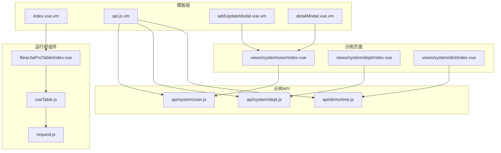
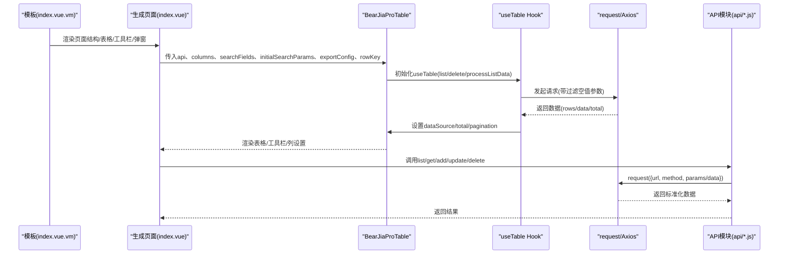
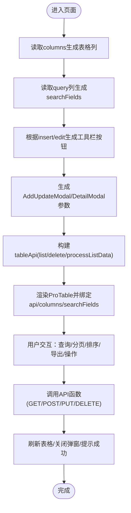
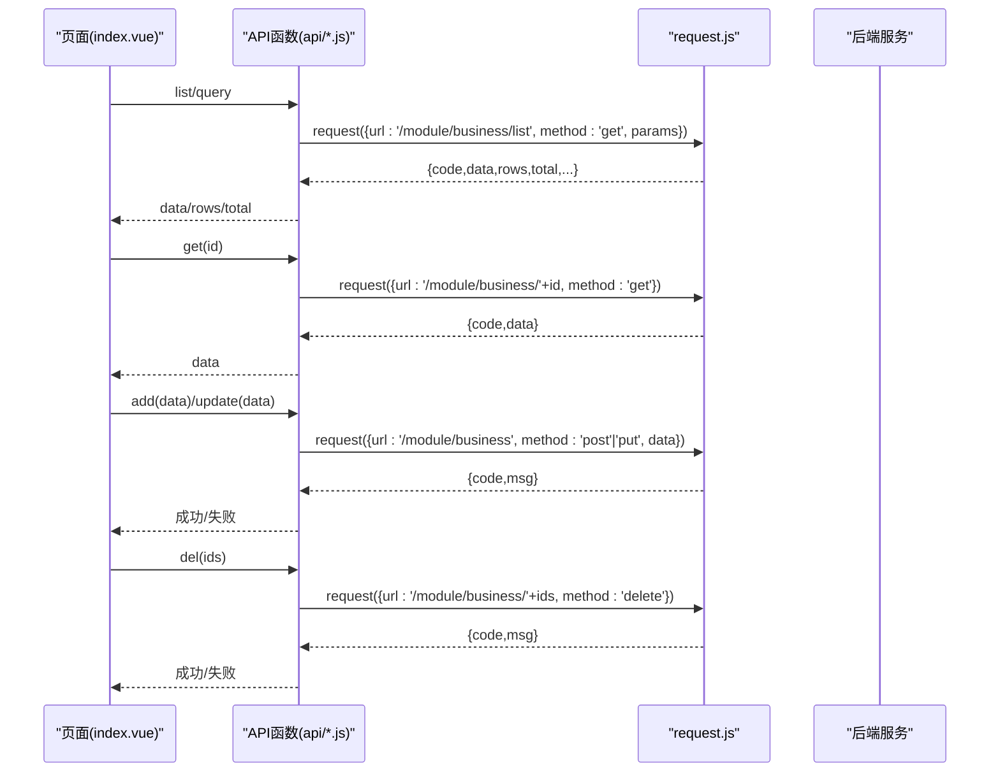
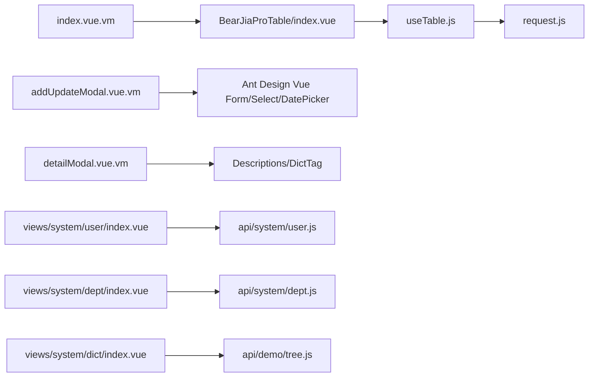

# 前端代码生成

<cite>
**本文引用的文件**
- [index.vue.vm](file://bear-jia-vue3/docs/bearjia/index.vue.vm)
- [api.js.vm](file://bear-jia-vue3/docs/bearjia/api.js.vm)
- [addUpdateModal.vue.vm](file://bear-jia-vue3/docs/bearjia/addUpdateModal.vue.vm)
- [detailModal.vue.vm](file://bear-jia-vue3/docs/bearjia/detailModal.vue.vm)
- [index.vue](file://bear-jia-vue3/src/components/BearJiaProTable/index.vue)
- [useTable.js](file://bear-jia-vue3/src/composables/useTable.js)
- [request.js](file://bear-jia-vue3/src/utils/request.js)
- [user.js](file://bear-jia-vue3/src/api/system/user.js)
- [dept.js](file://bear-jia-vue3/src/api/system/dept.js)
- [tree.js](file://bear-jia-vue3/src/api/demo/tree.js)
- [user_index.vue](file://bear-jia-vue3/src/views/system/user/index.vue)
- [dept_index.vue](file://bear-jia-vue3/src/views/system/dept/index.vue)
- [dict_index.vue](file://bear-jia-vue3/src/views/system/dict/index.vue)
</cite>

## 目录
1. [简介](#简介)
2. [项目结构](#项目结构)
3. [核心组件](#核心组件)
4. [架构总览](#架构总览)
5. [详细组件分析](#详细组件分析)
6. [依赖关系分析](#依赖关系分析)
7. [性能考量](#性能考量)
8. [故障排查指南](#故障排查指南)
9. [结论](#结论)
10. [附录](#附录)

## 简介
本文件面向前端代码生成场景，聚焦于模板 index.vue.vm 与 api.js.vm 如何协同工作，基于 Velocity 模板引擎与 BearJiaProTable 组件，生成具备“查询、新增、编辑、删除”能力的 Vue3 页面，并配套生成 API 调用函数。文档同时对比单表、树表、主子表三类业务类型的模板差异与生成策略，给出生成代码的结构说明、使用方式与常见问题解决方案。

## 项目结构
- 模板目录：bear-jia-vue3/docs/bearjia
  - index.vue.vm：页面骨架与表格、工具栏、弹窗组合模板
  - api.js.vm：API 函数模板（GET/POST/PUT/DELETE）
  - addUpdateModal.vue.vm：新增/编辑弹窗模板
  - detailModal.vue.vm：详情弹窗模板
- 运行时组件与工具：
  - BearJiaProTable：表格容器组件，封装查询、分页、排序、导出、列设置、树形表格等
  - useTable：表格通用逻辑 Hook，负责分页、排序、筛选、删除、导出
  - request：Axios 封装，统一拦截器、错误处理、下载
- 示例页面与 API：
  - system/user、system/dept、demo/tree 等 API 文件
  - views/system 下的 index.vue 页面作为生成后的参考实现

图表来源
- [index.vue.vm](file://bear-jia-vue3/docs/bearjia/index.vue.vm#L1-L120)
- [api.js.vm](file://bear-jia-vue3/docs/bearjia/api.js.vm#L1-L45)
- [index.vue](file://bear-jia-vue3/src/components/BearJiaProTable/index.vue#L1-L120)
- [useTable.js](file://bear-jia-vue3/src/composables/useTable.js#L1-L60)
- [request.js](file://bear-jia-vue3/src/utils/request.js#L1-L40)
- [user_index.vue](file://bear-jia-vue3/src/views/system/user/index.vue#L1-L60)
- [dept_index.vue](file://bear-jia-vue3/src/views/system/dept/index.vue#L1-L60)
- [dict_index.vue](file://bear-jia-vue3/src/views/system/dict/index.vue#L1-L60)

章节来源
- [index.vue.vm](file://bear-jia-vue3/docs/bearjia/index.vue.vm#L1-L120)
- [api.js.vm](file://bear-jia-vue3/docs/bearjia/api.js.vm#L1-L45)
- [index.vue](file://bear-jia-vue3/src/components/BearJiaProTable/index.vue#L1-L120)

## 核心组件
- BearJiaProTable：提供查询区、操作区、表格区、工具栏、列设置、树形表格、虚拟滚动等能力；通过 props 传入 api、columns、searchFields、initialSearchParams、exportConfig、rowKey 等，内部使用 useTable Hook 管理数据流。
- useTable：封装分页、排序、筛选、删除、导出等通用逻辑；支持树形表格数据转换、过滤空值参数、统一响应处理。
- request：Axios 实例封装，统一拦截器、错误提示、下载、白名单处理。

章节来源
- [index.vue](file://bear-jia-vue3/src/components/BearJiaProTable/index.vue#L1-L120)
- [useTable.js](file://bear-jia-vue3/src/composables/useTable.js#L1-L120)
- [request.js](file://bear-jia-vue3/src/utils/request.js#L1-L80)

## 架构总览
生成流程分为“模板渲染 + 运行时组件装配”两步：
- 模板渲染：index.vue.vm 依据元数据生成页面结构、表格列、工具栏按钮、弹窗参数；api.js.vm 生成对应 API 函数。
- 运行时装配：页面引入 BearJiaProTable，注入 api、columns、searchFields、initialSearchParams、exportConfig、rowKey；弹窗组件通过 props 注入字典与树形数据选项。

图表来源
- [index.vue.vm](file://bear-jia-vue3/docs/bearjia/index.vue.vm#L120-L220)
- [index.vue](file://bear-jia-vue3/src/components/BearJiaProTable/index.vue#L180-L260)
- [useTable.js](file://bear-jia-vue3/src/composables/useTable.js#L60-L140)
- [request.js](file://bear-jia-vue3/src/utils/request.js#L1-L80)
- [user.js](file://bear-jia-vue3/src/api/system/user.js#L1-L40)

## 详细组件分析

### index.vue.vm：基于 BearJiaProTable 的完整页面生成
- 表格配置
  - 通过 columns 动态生成列标题、dataIndex、宽度、对齐、省略等；操作列固定在右侧。
  - 通过 searchFields 动态生成查询表单项（输入、日期、日期范围、下拉），并从注释中提取 label。
- 工具栏与按钮
  - 根据列权限动态生成“新增/编辑/删除”按钮；编辑按钮仅在单选时可用；删除按钮在多选时可用。
  - 通过 v-hasPermi 控制权限。
- 自定义列渲染
  - datetime 类型使用工具格式化；字典类型使用 DictTag；操作列使用 TableActionBar。
- 弹窗
  - 新增/编辑弹窗：根据列的 insert/edit 决定表单项类型与必填规则；树表增加上级选择。
  - 详情弹窗：按列类型渲染详情内容，支持图片预览、文件下载、富文本、文本域等。
- API 与数据处理
  - tableApi 挂载 list 与 delete；树表通过 processListData 将扁平数据转换为树形。
  - initialSearchParams 从 query=true 的列生成；exportConfig 生成导出 URL 与文件名。
- 生命周期与方法
  - handleAdd/handleEdit/handleDelete/handleView/refreshTable；树表支持新增下级节点。
  - getTreeSelect 在树表初始化时获取树形数据选项。

图表来源
- [index.vue.vm](file://bear-jia-vue3/docs/bearjia/index.vue.vm#L120-L220)
- [index.vue](file://bear-jia-vue3/src/components/BearJiaProTable/index.vue#L180-L260)
- [useTable.js](file://bear-jia-vue3/src/composables/useTable.js#L60-L140)

章节来源
- [index.vue.vm](file://bear-jia-vue3/docs/bearjia/index.vue.vm#L1-L294)

### api.js.vm：RESTful API 函数生成
- 生成规则
  - list：GET /{module}/{business}/list，参数来自查询表单。
  - get：GET /{module}/{business}/{id}。
  - add：POST /{module}/{business}，请求体为提交数据。
  - update：PUT /{module}/{business}，请求体为提交数据。
  - del：DELETE /{module}/{business}/{id}。
- 生成位置
  - 按模块与业务名生成对应 API 文件，如 system/user.js、demo/tree.js。

图表来源
- [api.js.vm](file://bear-jia-vue3/docs/bearjia/api.js.vm#L1-L45)
- [request.js](file://bear-jia-vue3/src/utils/request.js#L1-L80)
- [user.js](file://bear-jia-vue3/src/api/system/user.js#L1-L40)
- [tree.js](file://bear-jia-vue3/src/api/demo/tree.js#L1-L45)

章节来源
- [api.js.vm](file://bear-jia-vue3/docs/bearjia/api.js.vm#L1-L45)

### addUpdateModal.vue.vm：新增/编辑弹窗生成
- 表单项生成
  - 根据 htmlType 生成输入框、日期、富文本、图片/文件上传、下拉、单选、多选、文本域等。
  - 必填规则来自 required；字典类型使用 options。
- 日期处理
  - 打开编辑时将字符串日期转换为 dayjs 对象；提交前将 dayjs 对象格式化为字符串。
- 树表支持
  - 树表弹窗增加上级节点选择，使用 tree-select 并指定 field-names。
- 事件与暴露
  - open(type, record) 打开弹窗；成功后触发 success 事件供父组件刷新表格。

章节来源
- [addUpdateModal.vue.vm](file://bear-jia-vue3/docs/bearjia/addUpdateModal.vue.vm#L1-L309)

### detailModal.vue.vm：详情弹窗生成
- 详情渲染
  - 根据列类型渲染详情内容，支持日期格式化、图片预览、文件下载、富文本、文本域等。
- 字典展示
  - 使用 DictTag 展示字典标签。
- 事件与暴露
  - open(record) 打开弹窗。

章节来源
- [detailModal.vue.vm](file://bear-jia-vue3/docs/bearjia/detailModal.vue.vm#L1-L142)

### 不同业务类型的模板差异
- 单表
  - 无 isTreeTable；searchFields 与 columns 基于普通表结构生成；无树形数据选项。
- 树表
  - 模板中通过 tplCategory 判断是否为树表；ProTable 设置 isTreeTable=true；tableApi 增加 processListData 将扁平数据转换为树形；页面初始化时调用 getTreeSelect 获取树形选项。
  - 弹窗支持上级节点选择；新增时支持新增下级节点。
- 主子表
  - 模板未提供专用的 index-tree 主子表模板；通常采用“主表单+子表表格”的组合页面，主表使用 index.vue.vm 生成，子表单独维护表格与 CRUD。若需生成主子表页面，可在现有模板基础上扩展子表弹窗与关联查询逻辑。

章节来源
- [index.vue.vm](file://bear-jia-vue3/docs/bearjia/index.vue.vm#L10-L15)
- [index.vue](file://bear-jia-vue3/src/components/BearJiaProTable/index.vue#L50-L90)
- [dept_index.vue](file://bear-jia-vue3/src/views/system/dept/index.vue#L1-L60)

## 依赖关系分析
- 模板到组件
  - index.vue.vm 依赖 BearJiaProTable、TableActionBar、DictTag、BearJiaIcon、BearJiaUtil。
  - addUpdateModal.vue.vm 依赖 Ant Design Vue 表单组件、Day.js、WangEditor（富文本）、FileUpload/ImageUpload。
  - detailModal.vue.vm 依赖 Ant Design Vue 描述列表、DictTag、BearJiaIcon、BearJiaUtil。
- 运行时依赖
  - BearJiaProTable 依赖 useTable Hook；useTable 依赖 request；request 依赖 Axios 与错误码映射。
- 示例页面对照
  - system/user/index.vue：演示单表页面，包含部门树联动、字典渲染、自定义操作列。
  - system/dept/index.vue：演示树表页面，使用 isTreeTable 与 processListData。
  - system/dict/index.vue：演示可展开行的主子表联动（类型与数据）。

图表来源
- [index.vue.vm](file://bear-jia-vue3/docs/bearjia/index.vue.vm#L100-L140)
- [addUpdateModal.vue.vm](file://bear-jia-vue3/docs/bearjia/addUpdateModal.vue.vm#L1-L120)
- [detailModal.vue.vm](file://bear-jia-vue3/docs/bearjia/detailModal.vue.vm#L1-L80)
- [index.vue](file://bear-jia-vue3/src/components/BearJiaProTable/index.vue#L1-L120)
- [useTable.js](file://bear-jia-vue3/src/composables/useTable.js#L1-L120)
- [request.js](file://bear-jia-vue3/src/utils/request.js#L1-L80)
- [user_index.vue](file://bear-jia-vue3/src/views/system/user/index.vue#L1-L60)
- [dept_index.vue](file://bear-jia-vue3/src/views/system/dept/index.vue#L1-L60)
- [dict_index.vue](file://bear-jia-vue3/src/views/system/dict/index.vue#L1-L60)

章节来源
- [index.vue](file://bear-jia-vue3/src/components/BearJiaProTable/index.vue#L1-L120)
- [useTable.js](file://bear-jia-vue3/src/composables/useTable.js#L1-L120)
- [request.js](file://bear-jia-vue3/src/utils/request.js#L1-L80)

## 性能考量
- 虚拟滚动：当开启虚拟滚动且数据量超过阈值时，仅渲染可视区域，减少 DOM 节点数量，提升大数据量表格性能。
- 自适应横向滚动：当列宽总和超过容器宽度时自动启用横向滚动，避免布局错乱。
- 列设置持久化：列可见性设置保存至本地存储，减少重复计算。
- 分页与排序：useTable 统一处理分页与排序参数，避免重复请求与无效渲染。
- 请求参数过滤：自动过滤空值与 undefined，减少后端压力与无效参数传递。

章节来源
- [index.vue](file://bear-jia-vue3/src/components/BearJiaProTable/index.vue#L220-L320)
- [useTable.js](file://bear-jia-vue3/src/composables/useTable.js#L60-L120)

## 故障排查指南
- 组件引用错误
  - 现象：页面报错找不到组件或图标。
  - 排查：检查模板中 import 路径是否正确；确认 BearJiaIcon、BearJiaUtil、DictTag、TableActionBar 是否存在且路径正确。
  - 参考：模板中对 BearJiaIcon、BearJiaUtil、DictTag 的导入与使用。
- API 路径不匹配
  - 现象：请求 404 或 403。
  - 排查：核对 api.js.vm 生成的 URL 是否与后端路由一致；确认模块名与业务名是否正确；检查 request.js 中 baseURL 与白名单配置。
  - 参考：api.js.vm 生成规则与 request.js 拦截器。
- 字典/树形数据未显示
  - 现象：下拉/树形选择为空。
  - 排查：确认模板中是否注入了字典 options 与树形 options；检查页面初始化时是否调用了获取字典/树形数据的方法。
  - 参考：index.vue.vm 中字典注入与树形选项初始化。
- 日期格式问题
  - 现象：编辑时日期显示异常，提交后格式不正确。
  - 排查：确认弹窗中对日期字符串与 dayjs 对象的双向转换逻辑；提交前统一格式化。
  - 参考：addUpdateModal.vue.vm 中日期处理逻辑。
- 删除确认与批量删除
  - 现象：删除按钮不可用或未触发删除。
  - 排查：确认工具栏按钮权限与 selectedRowKeys 数量；检查 useTable 中 handleDelete 的实现与 API.delete 是否存在。
  - 参考：index.vue.vm 中 handleDelete 与 useTable.js 中 handleDelete。

章节来源
- [index.vue.vm](file://bear-jia-vue3/docs/bearjia/index.vue.vm#L100-L160)
- [api.js.vm](file://bear-jia-vue3/docs/bearjia/api.js.vm#L1-L45)
- [request.js](file://bear-jia-vue3/src/utils/request.js#L1-L80)
- [addUpdateModal.vue.vm](file://bear-jia-vue3/docs/bearjia/addUpdateModal.vue.vm#L200-L290)
- [useTable.js](file://bear-jia-vue3/src/composables/useTable.js#L160-L200)

## 结论
通过 index.vue.vm 与 api.js.vm 的配合，可以高效生成符合 BearJiaProTable 设计理念的 Vue3 页面：页面结构、表格配置、工具栏、弹窗均由模板驱动，API 函数严格遵循 RESTful 规范。单表与树表的差异主要体现在表格配置与数据处理上，而主子表可通过现有模板扩展实现。建议在生成后结合示例页面进行二次定制，确保组件引用、API 路径、字典与树形数据正确注入。

## 附录
- 生成代码结构说明
  - 页面：index.vue（由 index.vue.vm 生成），包含 ProTable、AddUpdateModal、DetailModal。
  - API：按模块与业务名生成 api/{module}/{business}.js，包含 list/get/add/update/del。
  - 组件：BearJiaProTable、TableActionBar、DictTag、BearJiaIcon、BearJiaUtil。
- 使用方式
  - 在模板中配置 columns、query、htmlType、dictType、pk 等元数据，即可生成页面与 API。
  - 树表需设置 tplCategory 与 treeCode/treeParentCode/treeName。
  - 主子表可参考 dict_index.vue 的展开行模式，结合子表弹窗实现。
- 常见问题
  - 组件路径错误：检查模板 import 路径。
  - API 路由不一致：核对模块名、业务名与后端路由。
  - 字典/树形数据缺失：确认注入 options 与初始化方法。
  - 日期格式异常：统一 dayjs 与字符串转换。
  - 删除失败：确认权限与 API.delete 存在。