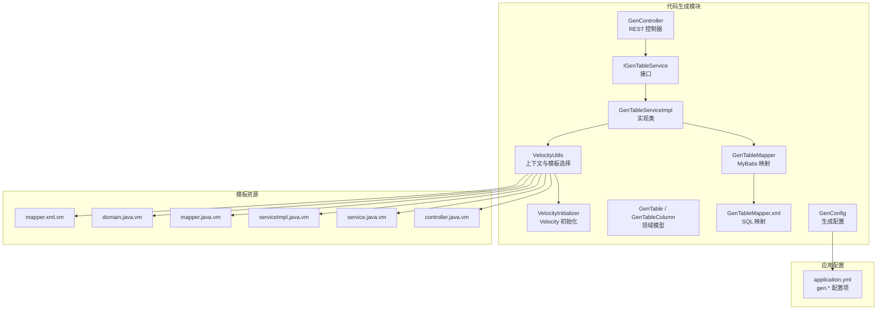
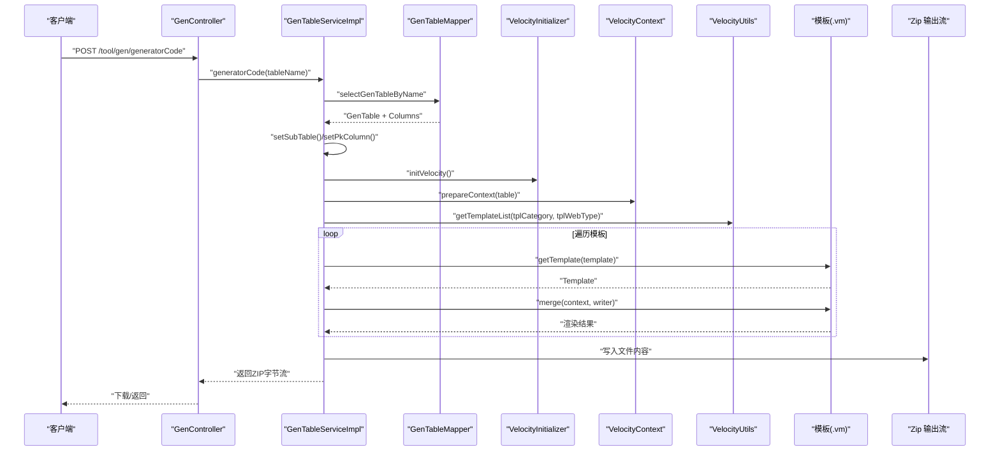
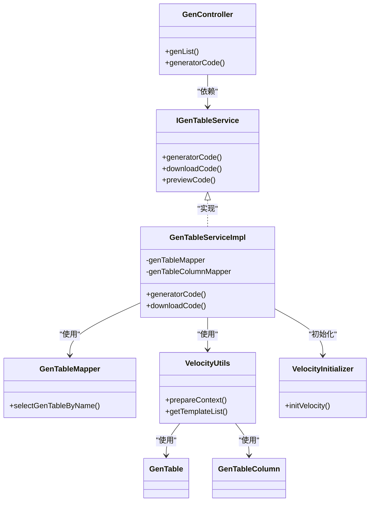
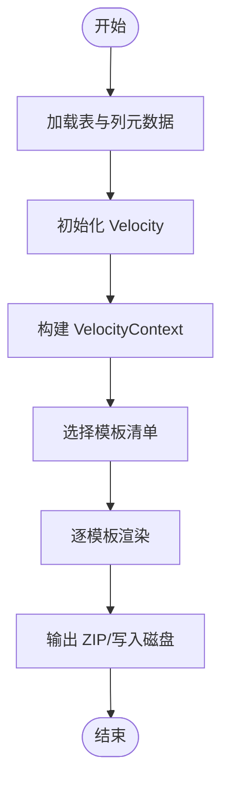

# 后端代码生成

<cite>
**本文引用的文件**
- [GenTableServiceImpl.java](file://bearjia-admin-backend/src/main/java/com/javaxiaobear/module/tool/gen/service/GenTableServiceImpl.java)
- [IGenTableService.java](file://bearjia-admin-backend/src/main/java/com/javaxiaobear/module/tool/gen/service/IGenTableService.java)
- [GenController.java](file://bearjia-admin-backend/src/main/java/com/javaxiaobear/module/tool/gen/controller/GenController.java)
- [GenTableMapper.java](file://bearjia-admin-backend/src/main/java/com/javaxiaobear/module/tool/gen/mapper/GenTableMapper.java)
- [GenTableMapper.xml](file://bearjia-admin-backend/src/main/resources/mybatis/tool/GenTableMapper.xml)
- [GenTable.java](file://bearjia-admin-backend/src/main/java/com/javaxiaobear/module/tool/gen/domain/GenTable.java)
- [GenTableColumn.java](file://bearjia-admin-backend/src/main/java/com/javaxiaobear/module/tool/gen/domain/GenTableColumn.java)
- [VelocityUtils.java](file://bearjia-admin-backend/src/main/java/com/javaxiaobear/module/tool/gen/util/VelocityUtils.java)
- [VelocityInitializer.java](file://bearjia-admin-backend/src/main/java/com/javaxiaobear/module/tool/gen/util/VelocityInitializer.java)
- [GenConfig.java](file://bearjia-admin-backend/src/main/java/com/javaxiaobear/base/framework/config/GenConfig.java)
- [GenConstants.java](file://bearjia-admin-backend/src/main/java/com/javaxiaobear/base/common/constant/GenConstants.java)
- [controller.java.vm](file://bearjia-admin-backend/src/main/resources/vm/java/controller.java.vm)
- [service.java.vm](file://bearjia-admin-backend/src/main/resources/vm/java/service.java.vm)
- [serviceImpl.java.vm](file://bearjia-admin-backend/src/main/resources/vm/java/serviceImpl.java.vm)
- [mapper.java.vm](file://bearjia-admin-backend/src/main/resources/vm/java/mapper.java.vm)
- [domain.java.vm](file://bearjia-admin-backend/src/main/resources/vm/java/domain.java.vm)
- [mapper.xml.vm](file://bearjia-admin-backend/src/main/resources/vm/xml/mapper.xml.vm)
- [application.yml](file://bearjia-admin-backend/src/main/resources/application.yml)
</cite>

## 目录
1. [简介](#简介)
2. [项目结构](#项目结构)
3. [核心组件](#核心组件)
4. [架构总览](#架构总览)
5. [详细组件分析](#详细组件分析)
6. [依赖关系分析](#依赖关系分析)
7. [性能与可维护性](#性能与可维护性)
8. [故障排查指南](#故障排查指南)
9. [结论](#结论)
10. [附录](#附录)

## 简介
本文件面向后端开发者，系统性解析基于 Velocity 的 Spring Boot 后端代码生成机制，覆盖从数据库表结构到 Controller、Service、Mapper 接口及 MyBatis XML 映射文件的完整生成流程。重点说明：
- GenTableServiceImpl 中 generatorCode 方法如何通过 Velocity 上下文注入表结构信息并渲染模板；
- GenConfig 配置类如何控制包名、作者、表前缀等生成参数；
- 不同业务类型（单表 CRUD、树表、主子表）对应的后端代码结构差异与生成策略；
- 生成代码的集成方式与常见问题（依赖缺失、注解冲突等）的解决方案。

## 项目结构
后端代码生成位于 bearjia-admin-backend 模块中，采用“模板驱动 + Velocity 引擎”的方式，将数据库表元数据转换为标准的 Spring Boot + MyBatis 工程文件。

图表来源
- [GenController.java](file://bearjia-admin-backend/src/main/java/com/javaxiaobear/module/tool/gen/controller/GenController.java#L1-L120)
- [IGenTableService.java](file://bearjia-admin-backend/src/main/java/com/javaxiaobear/module/tool/gen/service/IGenTableService.java#L1-L130)
- [GenTableServiceImpl.java](file://bearjia-admin-backend/src/main/java/com/javaxiaobear/module/tool/gen/service/GenTableServiceImpl.java#L1-L386)
- [GenTableMapper.java](file://bearjia-admin-backend/src/main/java/com/javaxiaobear/module/tool/gen/mapper/GenTableMapper.java#L1-L91)
- [GenTableMapper.xml](file://bearjia-admin-backend/src/main/resources/mybatis/tool/GenTableMapper.xml#L125-L146)
- [GenTable.java](file://bearjia-admin-backend/src/main/java/com/javaxiaobear/module/tool/gen/domain/GenTable.java#L1-L200)
- [GenTableColumn.java](file://bearjia-admin-backend/src/main/java/com/javaxiaobear/module/tool/gen/domain/GenTableColumn.java#L1-L200)
- [VelocityUtils.java](file://bearjia-admin-backend/src/main/java/com/javaxiaobear/module/tool/gen/util/VelocityUtils.java#L1-L168)
- [VelocityInitializer.java](file://bearjia-admin-backend/src/main/java/com/javaxiaobear/module/tool/gen/util/VelocityInitializer.java#L1-L35)
- [GenConfig.java](file://bearjia-admin-backend/src/main/java/com/javaxiaobear/base/framework/config/GenConfig.java#L1-L66)
- [application.yml](file://bearjia-admin-backend/src/main/resources/application.yml#L125-L134)

章节来源
- [GenController.java](file://bearjia-admin-backend/src/main/java/com/javaxiaobear/module/tool/gen/controller/GenController.java#L1-L120)
- [GenTableServiceImpl.java](file://bearjia-admin-backend/src/main/java/com/javaxiaobear/module/tool/gen/service/GenTableServiceImpl.java#L1-L386)
- [VelocityUtils.java](file://bearjia-admin-backend/src/main/java/com/javaxiaobear/module/tool/gen/util/VelocityUtils.java#L1-L168)
- [application.yml](file://bearjia-admin-backend/src/main/resources/application.yml#L125-L134)

## 核心组件
- 生成入口与控制器
  - GenController 提供 REST 接口，调用 IGenTableService 进行列表查询、预览、下载或自定义路径生成。
- 服务实现
  - GenTableServiceImpl 负责加载表与列元数据、设置主子表与主键列、初始化 Velocity、准备上下文、选择模板、渲染并输出结果。
- 领域模型
  - GenTable/GenTableColumn 描述表与列的元信息，包含模板分类、包名、模块名、业务名、功能名、作者、选项等。
- Velocity 工具
  - VelocityUtils 负责构建 VelocityContext、选择模板清单、生成文件名、构造导入列表、字典组、权限前缀、树表上下文、主子表上下文等。
  - VelocityInitializer 初始化 Velocity 引擎，确保模板资源可被正确加载。
- 配置中心
  - GenConfig 与 application.yml 的 gen.* 配置项共同决定作者、包名、是否自动去除表前缀、表前缀等。
- 模板资源
  - controller.java.vm、service.java.vm、serviceImpl.java.vm、mapper.java.vm、domain.java.vm、mapper.xml.vm 分别生成对应层级代码与 SQL 映射。

章节来源
- [GenController.java](file://bearjia-admin-backend/src/main/java/com/javaxiaobear/module/tool/gen/controller/GenController.java#L1-L120)
- [IGenTableService.java](file://bearjia-admin-backend/src/main/java/com/javaxiaobear/module/tool/gen/service/IGenTableService.java#L1-L130)
- [GenTableServiceImpl.java](file://bearjia-admin-backend/src/main/java/com/javaxiaobear/module/tool/gen/service/GenTableServiceImpl.java#L1-L386)
- [GenTable.java](file://bearjia-admin-backend/src/main/java/com/javaxiaobear/module/tool/gen/domain/GenTable.java#L1-L200)
- [GenTableColumn.java](file://bearjia-admin-backend/src/main/java/com/javaxiaobear/module/tool/gen/domain/GenTableColumn.java#L1-L200)
- [VelocityUtils.java](file://bearjia-admin-backend/src/main/java/com/javaxiaobear/module/tool/gen/util/VelocityUtils.java#L1-L168)
- [VelocityInitializer.java](file://bearjia-admin-backend/src/main/java/com/javaxiaobear/module/tool/gen/util/VelocityInitializer.java#L1-L35)
- [GenConfig.java](file://bearjia-admin-backend/src/main/java/com/javaxiaobear/base/framework/config/GenConfig.java#L1-L66)
- [application.yml](file://bearjia-admin-backend/src/main/resources/application.yml#L125-L134)

## 架构总览
以下序列图展示从请求到生成 ZIP 的完整流程，以及模板渲染的关键步骤。

图表来源
- [GenController.java](file://bearjia-admin-backend/src/main/java/com/javaxiaobear/module/tool/gen/controller/GenController.java#L1-L120)
- [GenTableServiceImpl.java](file://bearjia-admin-backend/src/main/java/com/javaxiaobear/module/tool/gen/service/GenTableServiceImpl.java#L236-L386)
- [GenTableMapper.java](file://bearjia-admin-backend/src/main/java/com/javaxiaobear/module/tool/gen/mapper/GenTableMapper.java#L52-L59)
- [VelocityUtils.java](file://bearjia-admin-backend/src/main/java/com/javaxiaobear/module/tool/gen/util/VelocityUtils.java#L130-L168)
- [VelocityInitializer.java](file://bearjia-admin-backend/src/main/java/com/javaxiaobear/module/tool/gen/util/VelocityInitializer.java#L17-L35)

章节来源
- [GenTableServiceImpl.java](file://bearjia-admin-backend/src/main/java/com/javaxiaobear/module/tool/gen/service/GenTableServiceImpl.java#L236-L386)
- [GenTableMapper.java](file://bearjia-admin-backend/src/main/java/com/javaxiaobear/module/tool/gen/mapper/GenTableMapper.java#L52-L59)
- [VelocityUtils.java](file://bearjia-admin-backend/src/main/java/com/javaxiaobear/module/tool/gen/util/VelocityUtils.java#L130-L168)
- [VelocityInitializer.java](file://bearjia-admin-backend/src/main/java/com/javaxiaobear/module/tool/gen/util/VelocityInitializer.java#L17-L35)

## 详细组件分析

### 1) 生成器入口与控制流（GenTableServiceImpl.generatorCode）
- 功能要点
  - 依据表名查询 GenTable 及其列集合；
  - 设置主子表信息与主键列；
  - 初始化 Velocity 引擎；
  - 准备 VelocityContext；
  - 选择模板清单（根据 tplCategory 与 tplWebType）；
  - 渲染每个模板，收集输出；
  - 支持下载 ZIP 与自定义路径两种输出方式。
- 关键路径
  - 下载方式：downloadCode(String) -> generatorCode(String, ZipOutputStream)
  - 自定义路径：generatorCode(String)
- 模板选择策略
  - 单表/树表：默认附加 domain、mapper、service、serviceImpl、controller、mapper.xml、sql.vm；
  - 树表：额外注入树相关上下文（树编码、父编码、名称、展开列等）；
  - 主子表：额外注入子表上下文（子表类名、外键名、外键类名、批量插入等）；
  - 前端模板类型：antdv-vue3 或 bearjia 模板，分别附加对应的前端 Vue/JS 模板。

章节来源
- [GenTableServiceImpl.java](file://bearjia-admin-backend/src/main/java/com/javaxiaobear/module/tool/gen/service/GenTableServiceImpl.java#L236-L386)
- [VelocityUtils.java](file://bearjia-admin-backend/src/main/java/com/javaxiaobear/module/tool/gen/util/VelocityUtils.java#L130-L168)

### 2) Velocity 上下文构建（VelocityUtils.prepareContext）
- 注入的核心变量
  - 表基本信息：tableName、functionName、className、businessName、moduleName、packageName、basePackage、author、datetime、permissionPrefix；
  - 列集合与主键：columns、pkColumn；
  - 导入列表：importList（根据列类型动态加入 Date/BigDecimal 等）；
  - 字典组：dicts（根据列的 dictType 与 HTML 类型生成）；
  - 树表上下文：treeCode、treeParentCode、treeName、expandColumn；
  - 主子表上下文：subTable、subTableName、subTableFkName、subTableFkClassName、subClassName、subclassName、subImportList。
- 文件名生成规则
  - 根据模板类型与业务参数生成 Java/MyBatis/Vue 文件的最终路径，避免重复文件名。

章节来源
- [VelocityUtils.java](file://bearjia-admin-backend/src/main/java/com/javaxiaobear/module/tool/gen/util/VelocityUtils.java#L36-L121)
- [VelocityUtils.java](file://bearjia-admin-backend/src/main/java/com/javaxiaobear/module/tool/gen/util/VelocityUtils.java#L180-L330)

### 3) 模板与生成产物
- Domain（实体类）
  - 根据列集合生成字段与 getter/setter；
  - 根据模板类别选择 BaseEntity 或 TreeEntity；
  - 对日期列注入 JsonFormat 与 Excel 注解；
  - 主子表场景生成子列表字段。
- Mapper 接口
  - 生成基础 CRUD 方法签名；
  - 主子表场景生成批量删除子表、批量新增子表、按主键删除子表等方法。
- Service 接口与实现
  - 接口定义 CRUD 与批量删除方法；
  - 实现类注入 Mapper，并在新增/修改时自动填充 createTime/updateTime；
  - 主子表场景在新增/更新时同步维护子表数据。
- Controller
  - 生成 RESTful 接口：分页列表、导出、详情、新增、修改、删除；
  - 权限注解与日志注解按模板类别与列配置注入；
  - 树表与 CRUD 行为略有差异（返回结构不同）。
- MyBatis XML 映射
  - 生成 resultMap、通用 select 片段、条件 where 片段；
  - 支持多条件查询（EQ/NE/GT/LT/LIKE/BETWEEN）；
  - 主子表场景生成联合查询与批量插入子表的 SQL。

章节来源
- [domain.java.vm](file://bearjia-admin-backend/src/main/resources/vm/java/domain.java.vm#L1-L104)
- [mapper.java.vm](file://bearjia-admin-backend/src/main/resources/vm/java/mapper.java.vm#L1-L92)
- [service.java.vm](file://bearjia-admin-backend/src/main/resources/vm/java/service.java.vm#L1-L62)
- [serviceImpl.java.vm](file://bearjia-admin-backend/src/main/resources/vm/java/serviceImpl.java.vm#L1-L170)
- [controller.java.vm](file://bearjia-admin-backend/src/main/resources/vm/java/controller.java.vm#L1-L116)
- [mapper.xml.vm](file://bearjia-admin-backend/src/main/resources/vm/xml/mapper.xml.vm#L1-L135)

### 4) 不同业务类型的生成策略
- 单表 CRUD（tplCategory = crud）
  - 生成标准增删改查接口与实现；
  - 导入列表仅在存在子表时引入 List；
  - 查询支持多条件 where 片段。
- 树表（tplCategory = tree）
  - 注入树相关上下文（treeCode、treeParentCode、treeName、expandColumn）；
  - Controller 列表返回 AjaxResult；
  - XML 映射支持树形结构查询。
- 主子表（tplCategory = sub）
  - 注入子表上下文（subTable、subTableFkName、subTableFkClassName 等）；
  - ServiceImpl 在新增/更新时先删除旧子表再批量插入新子表；
  - XML 映射支持主子表联合查询与批量插入子表。

章节来源
- [VelocityUtils.java](file://bearjia-admin-backend/src/main/java/com/javaxiaobear/module/tool/gen/util/VelocityUtils.java#L83-L121)
- [GenConstants.java](file://bearjia-admin-backend/src/main/java/com/javaxiaobear/base/common/constant/GenConstants.java#L10-L18)
- [mapper.xml.vm](file://bearjia-admin-backend/src/main/resources/vm/xml/mapper.xml.vm#L61-L73)
- [serviceImpl.java.vm](file://bearjia-admin-backend/src/main/resources/vm/java/serviceImpl.java.vm#L145-L169)

### 5) 配置参数与生成路径
- 生成配置（GenConfig 与 application.yml）
  - author：生成文件作者；
  - packageName：生成包路径；
  - autoRemovePre：是否自动去除表前缀；
  - tablePrefix：表前缀集合（逗号分隔）。
- Velocity 文件加载
  - VelocityInitializer 使用 ClasspathResourceLoader 加载 vm 模板；
  - 输入编码统一为 UTF-8。

章节来源
- [GenConfig.java](file://bearjia-admin-backend/src/main/java/com/javaxiaobear/base/framework/config/GenConfig.java#L1-L66)
- [application.yml](file://bearjia-admin-backend/src/main/resources/application.yml#L125-L134)
- [VelocityInitializer.java](file://bearjia-admin-backend/src/main/java/com/javaxiaobear/module/tool/gen/util/VelocityInitializer.java#L17-L35)

## 依赖关系分析
- 组件耦合
  - GenController 仅依赖 IGenTableService 接口，低耦合；
  - GenTableServiceImpl 依赖 GenTableMapper、GenTableColumnMapper、VelocityUtils、VelocityInitializer；
  - VelocityUtils 依赖 GenConstants、GenTable/GenTableColumn；
  - 模板与上下文强绑定，但通过 VelocityUtils 解耦具体模板细节。
- 外部依赖
  - MyBatis：通过 mapperLocations 与 configLocation 加载映射；
  - Spring MVC：Controller 注解与分页返回；
  - Apache Velocity：模板渲染；
  - FastJSON：解析 options JSON；
  - POI：导出 Excel。

图表来源
- [GenController.java](file://bearjia-admin-backend/src/main/java/com/javaxiaobear/module/tool/gen/controller/GenController.java#L1-L120)
- [IGenTableService.java](file://bearjia-admin-backend/src/main/java/com/javaxiaobear/module/tool/gen/service/IGenTableService.java#L1-L130)
- [GenTableServiceImpl.java](file://bearjia-admin-backend/src/main/java/com/javaxiaobear/module/tool/gen/service/GenTableServiceImpl.java#L1-L120)
- [GenTableMapper.java](file://bearjia-admin-backend/src/main/java/com/javaxiaobear/module/tool/gen/mapper/GenTableMapper.java#L1-L91)
- [VelocityUtils.java](file://bearjia-admin-backend/src/main/java/com/javaxiaobear/module/tool/gen/util/VelocityUtils.java#L1-L168)
- [VelocityInitializer.java](file://bearjia-admin-backend/src/main/java/com/javaxiaobear/module/tool/gen/util/VelocityInitializer.java#L1-L35)
- [GenTable.java](file://bearjia-admin-backend/src/main/java/com/javaxiaobear/module/tool/gen/domain/GenTable.java#L1-L200)
- [GenTableColumn.java](file://bearjia-admin-backend/src/main/java/com/javaxiaobear/module/tool/gen/domain/GenTableColumn.java#L1-L200)

章节来源
- [GenController.java](file://bearjia-admin-backend/src/main/java/com/javaxiaobear/module/tool/gen/controller/GenController.java#L1-L120)
- [GenTableServiceImpl.java](file://bearjia-admin-backend/src/main/java/com/javaxiaobear/module/tool/gen/service/GenTableServiceImpl.java#L1-L120)
- [VelocityUtils.java](file://bearjia-admin-backend/src/main/java/com/javaxiaobear/module/tool/gen/util/VelocityUtils.java#L1-L168)

## 性能与可维护性
- 渲染性能
  - 模板数量固定且有限，渲染成本主要受列数影响；建议在大数据量列场景下减少不必要的注解与导入。
- 可维护性
  - 通过 VelocityUtils 统一管理上下文与模板选择，降低各模板之间的耦合；
  - 生成路径与文件名规则集中处理，避免重复与命名冲突；
  - 配置项集中在 GenConfig 与 application.yml，便于集中治理。

[本节为通用建议，无需列出章节来源]

## 故障排查指南
- 依赖缺失
  - 现象：编译报错找不到类或包；
  - 排查：确认 pom 中已引入 MyBatis、POI、Apache Velocity、FastJSON 等依赖；检查 application.yml 的 mybatis 配置是否正确。
- 注解冲突
  - 现象：导出或权限注解冲突；
  - 排查：确认 controller.java.vm 中的注解与实际框架版本兼容；检查权限前缀生成逻辑是否符合预期。
- 模板加载失败
  - 现象：Velocity 报错无法加载 vm；
  - 排查：确认 VelocityInitializer 初始化成功；检查 resource.loader.file.class 与输入编码设置；确认模板路径与打包后资源一致。
- 主子表生成异常
  - 现象：子表数据未同步或批量插入失败；
  - 排查：检查 serviceImpl.java.vm 中的批量插入逻辑与 mapper.xml.vm 的 batch${subClassName}；确认外键字段命名与 fkName 一致。
- 表前缀处理
  - 现象：类名仍包含表前缀；
  - 排查：检查 application.yml 的 gen.autoRemovePre 与 gen.tablePrefix 配置；确认 VelocityUtils 中的类名生成逻辑。

章节来源
- [application.yml](file://bearjia-admin-backend/src/main/resources/application.yml#L101-L109)
- [VelocityInitializer.java](file://bearjia-admin-backend/src/main/java/com/javaxiaobear/module/tool/gen/util/VelocityInitializer.java#L17-L35)
- [serviceImpl.java.vm](file://bearjia-admin-backend/src/main/resources/vm/java/serviceImpl.java.vm#L145-L169)
- [mapper.xml.vm](file://bearjia-admin-backend/src/main/resources/vm/xml/mapper.xml.vm#L128-L133)
- [GenConfig.java](file://bearjia-admin-backend/src/main/java/com/javaxiaobear/base/framework/config/GenConfig.java#L1-L66)

## 结论
该代码生成体系以 Velocity 为核心，结合标准化的领域模型与模板资源，实现了从数据库表结构到 Spring Boot 后端工程的自动化产出。通过 GenTableServiceImpl 的统一调度、VelocityUtils 的上下文与模板选择、GenConfig 的参数化配置，能够稳定地生成 Controller、Service、Mapper 与 MyBatis XML，并针对单表、树表、主子表三类业务提供差异化策略。配合完善的错误排查指引，可有效提升团队开发效率与代码一致性。

[本节为总结性内容，无需列出章节来源]

## 附录

### A. 生成流程算法概览（简化）

图表来源
- [GenTableServiceImpl.java](file://bearjia-admin-backend/src/main/java/com/javaxiaobear/module/tool/gen/service/GenTableServiceImpl.java#L236-L386)
- [VelocityUtils.java](file://bearjia-admin-backend/src/main/java/com/javaxiaobear/module/tool/gen/util/VelocityUtils.java#L130-L168)

### B. 生成参数对照表
- 生成配置项
  - gen.author：作者
  - gen.packageName：包名
  - gen.autoRemovePre：是否自动去除表前缀
  - gen.tablePrefix：表前缀（逗号分隔）

章节来源
- [GenConfig.java](file://bearjia-admin-backend/src/main/java/com/javaxiaobear/base/framework/config/GenConfig.java#L1-L66)
- [application.yml](file://bearjia-admin-backend/src/main/resources/application.yml#L125-L134)