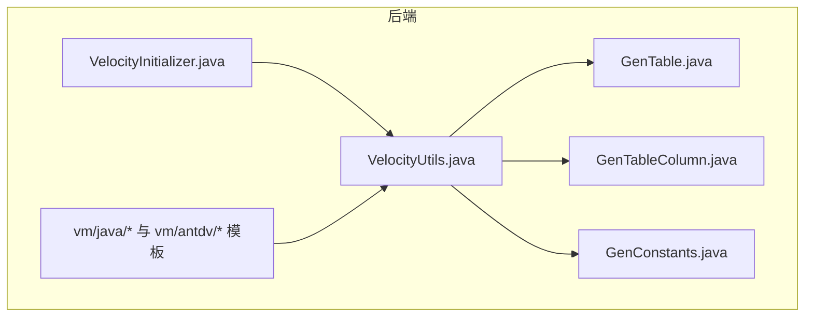
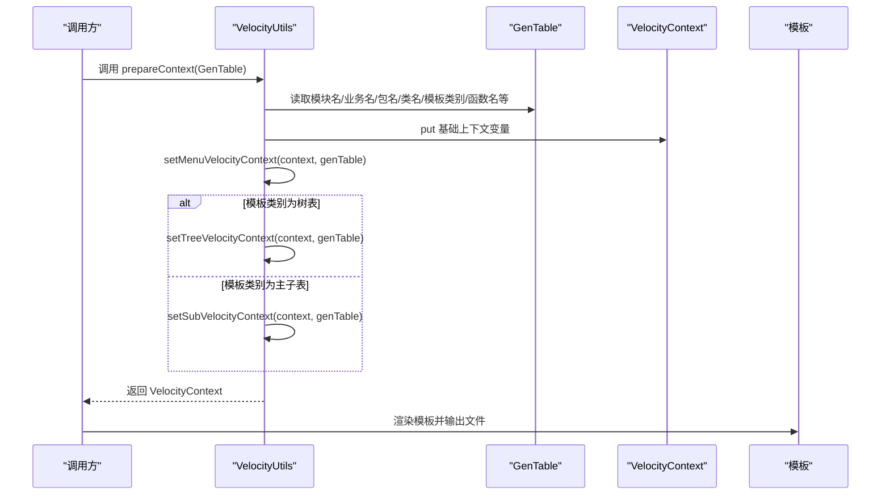
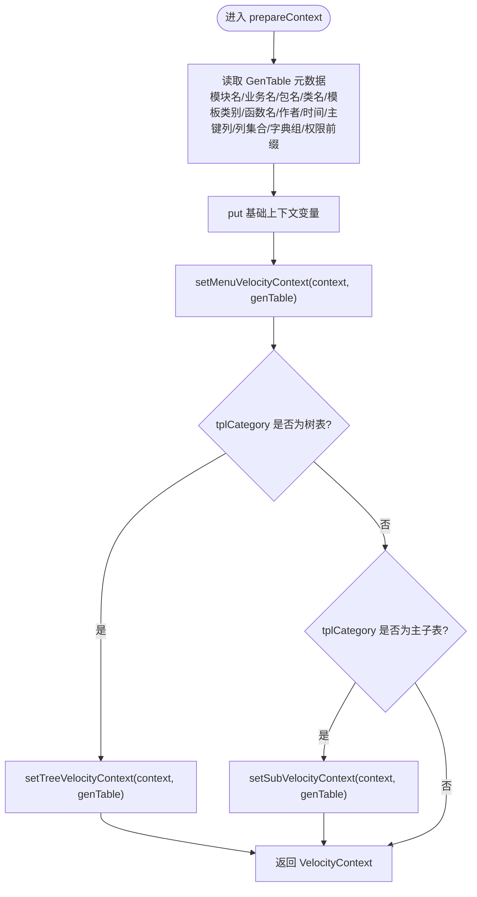
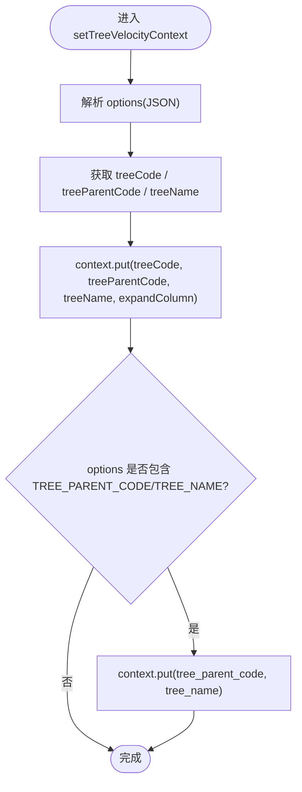
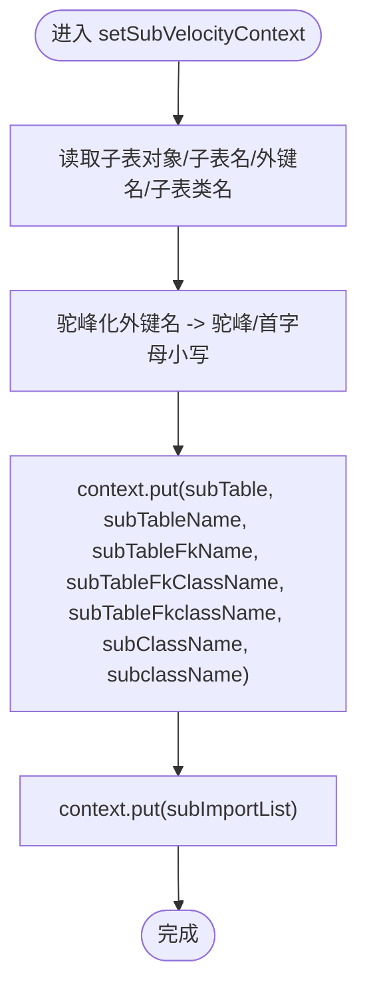
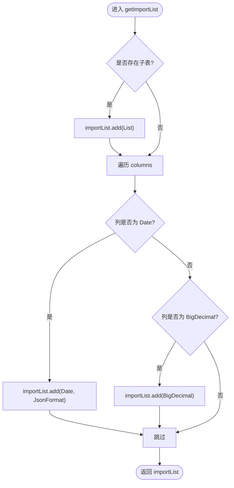
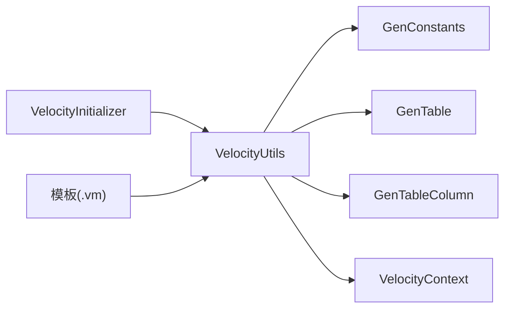

# 上下文构建

<cite>
**本文引用的文件**
- [VelocityUtils.java](file://bearjia-admin-backend/src/main/java/com/avaxiaobear/module/tool/gen/util/VelocityUtils.java)
- [GenTable.java](file://bearjia-admin-backend/src/main/java/com/avaxiaobear/module/tool/gen/domain/GenTable.java)
- [GenTableColumn.java](file://bearjia-admin-backend/src/main/java/com/avaxiaobear/module/tool/gen/domain/GenTableColumn.java)
- [GenConstants.java](file://bearjia-admin-backend/src/main/java/com/avaxiaobear/base/common/constant/GenConstants.java)
- [VelocityInitializer.java](file://bearjia-admin-backend/src/main/java/com/avaxiaobear/module/tool/gen/util/VelocityInitializer.java)
- [domain.java.vm](file://bearjia-admin-backend/src/main/resources/vm/java/domain.java.vm)
- [index.vue.vm](file://bearjia-admin-backend/src/main/resources/vm/antdv/index.vue.vm)
- [controller.java.vm](file://bearjia-admin-backend/src/main/resources/vm/java/controller.java.vm)
</cite>

## 目录
1. [简介](#简介)
2. [项目结构](#项目结构)
3. [核心组件](#核心组件)
4. [架构总览](#架构总览)
5. [详细组件分析](#详细组件分析)
6. [依赖关系分析](#依赖关系分析)
7. [性能考量](#性能考量)
8. [故障排查指南](#故障排查指南)
9. [结论](#结论)
10. [附录](#附录)

## 简介
本文件聚焦于代码生成上下文构建，围绕 VelocityUtils.prepareContext 方法如何从 GenTable 对象中抽取模块名、业务名、包名、类名等核心信息，并将这些信息注入到 VelocityContext 中；进一步阐述 setTreeVelocityContext 和 setSubVelocityContext 如何依据模板类型（树表或主子表）注入树相关变量与子表变量；说明 getImportList 如何根据列的数据类型（如 Date、BigDecimal）动态生成 Java 导入包列表；并结合模板文件展示上下文变量在模板中的使用示例，最后给出常见问题与性能优化建议。

## 项目结构
- 后端代码生成位于 bearjia-admin-backend 模块，Velocity 模板位于 src/main/resources/vm 下，按语言/框架划分：
  - java：后端实体、Mapper、Service、Controller、XML、SQL、子表实体等模板
  - antdv：前端页面（index.vue）、API（api.js）、表单组件（CreateForm.vue、SubTable.vue）等模板
- 上下文构建核心工具类位于 util 包，负责准备 VelocityContext 并按模板类别注入差异化变量。

图表来源
- [VelocityUtils.java](file://bearjia-admin-backend/src/main/java/com/avaxiaobear/module/tool/gen/util/VelocityUtils.java#L36-L121)
- [GenTable.java](file://bearjia-admin-backend/src/main/java/com/avaxiaobear/module/tool/gen/domain/GenTable.java#L1-L120)
- [GenTableColumn.java](file://bearjia-admin-backend/src/main/java/com/avaxiaobear/module/tool/gen/domain/GenTableColumn.java#L1-L120)
- [GenConstants.java](file://bearjia-admin-backend/src/main/java/com/avaxiaobear/base/common/constant/GenConstants.java#L1-L118)
- [VelocityInitializer.java](file://bearjia-admin-backend/src/main/java/com/avaxiaobear/module/tool/gen/util/VelocityInitializer.java#L1-L34)
- [domain.java.vm](file://bearjia-admin-backend/src/main/resources/vm/java/domain.java.vm#L1-L104)
- [index.vue.vm](file://bearjia-admin-backend/src/main/resources/vm/antdv/index.vue.vm#L1-L120)

章节来源
- [VelocityUtils.java](file://bearjia-admin-backend/src/main/java/com/avaxiaobear/module/tool/gen/util/VelocityUtils.java#L36-L121)
- [VelocityInitializer.java](file://bearjia-admin-backend/src/main/java/com/avaxiaobear/module/tool/gen/util/VelocityInitializer.java#L1-L34)

## 核心组件
- VelocityUtils：上下文构建的核心工具类，负责：
  - 从 GenTable 抽取基础信息并注入 VelocityContext
  - 根据模板类别注入树表或主子表专用变量
  - 动态生成 Java 导入包列表
  - 生成模板文件名与包前缀
- GenTable/GenTableColumn：代码生成的元数据载体，提供表、列、选项、树相关字段等
- GenConstants：模板类别、HTML 类型、Java 类型、树相关常量等
- VelocityInitializer：初始化 Velocity 引擎，加载模板资源

章节来源
- [VelocityUtils.java](file://bearjia-admin-backend/src/main/java/com/avaxiaobear/module/tool/gen/util/VelocityUtils.java#L36-L121)
- [GenTable.java](file://bearjia-admin-backend/src/main/java/com/avaxiaobear/module/tool/gen/domain/GenTable.java#L1-L120)
- [GenTableColumn.java](file://bearjia-admin-backend/src/main/java/com/avaxiaobear/module/tool/gen/domain/GenTableColumn.java#L1-L120)
- [GenConstants.java](file://bearjia-admin-backend/src/main/java/com/avaxiaobear/base/common/constant/GenConstants.java#L1-L118)
- [VelocityInitializer.java](file://bearjia-admin-backend/src/main/java/com/avaxiaobear/module/tool/gen/util/VelocityInitializer.java#L1-L34)

## 架构总览
Velocity 上下文构建流程概览如下：

图表来源
- [VelocityUtils.java](file://bearjia-admin-backend/src/main/java/com/avaxiaobear/module/tool/gen/util/VelocityUtils.java#L36-L121)
- [index.vue.vm](file://bearjia-admin-backend/src/main/resources/vm/antdv/index.vue.vm#L1-L120)

## 详细组件分析

### VelocityUtils.prepareContext：构建 VelocityContext 的核心流程
- 输入：GenTable
- 输出：VelocityContext
- 关键步骤：
  - 从 GenTable 读取模块名、业务名、包名、类名、模板类别、函数名、作者、时间、主键列、列集合、字典组、权限前缀等
  - 注入基础变量：tplCategory、tableName、functionName、ClassName、className、moduleName、BusinessName、businessName、basePackage、packageName、author、datetime、pkColumn、importList、permissionPrefix、columns、table、dicts
  - 调用 setMenuVelocityContext 注入菜单相关变量
  - 若模板类别为树表，调用 setTreeVelocityContext 注入树相关变量
  - 若模板类别为主子表，调用 setSubVelocityContext 注入子表相关变量
  - 返回 VelocityContext

图表来源
- [VelocityUtils.java](file://bearjia-admin-backend/src/main/java/com/avaxiaobear/module/tool/gen/util/VelocityUtils.java#L36-L121)

章节来源
- [VelocityUtils.java](file://bearjia-admin-backend/src/main/java/com/avaxiaobear/module/tool/gen/util/VelocityUtils.java#L36-L121)

### setTreeVelocityContext：树表上下文变量注入
- 从 GenTable.options 解析 JSON，获取 treeCode、treeParentCode、treeName
- 注入 treeCode、treeParentCode、treeName、expandColumn
- 若 options 中存在 TREE_PARENT_CODE/TREE_NAME，额外注入 tree_parent_code、tree_name
- expandColumn 通过 getExpandColumn 计算树名称字段在列表中的列序号，用于前端展开按钮位置

图表来源
- [VelocityUtils.java](file://bearjia-admin-backend/src/main/java/com/avaxiaobear/module/tool/gen/util/VelocityUtils.java#L83-L103)
- [GenConstants.java](file://bearjia-admin-backend/src/main/java/com/avaxiaobear/base/common/constant/GenConstants.java#L19-L33)

章节来源
- [VelocityUtils.java](file://bearjia-admin-backend/src/main/java/com/avaxiaobear/module/tool/gen/util/VelocityUtils.java#L83-L103)
- [GenConstants.java](file://bearjia-admin-backend/src/main/java/com/avaxiaobear/base/common/constant/GenConstants.java#L19-L33)

### setSubVelocityContext：主子表上下文变量注入
- 从 GenTable 读取子表对象、子表名、子表外键名、子表类名
- 将子表类名转换为驼峰命名与首字母小写形式，注入 subTable、subTableName、subTableFkName、subTableFkClassName、subTableFkclassName、subClassName、subclassName
- 注入子表 importList（getImportList(genTable.getSubTable())）

图表来源
- [VelocityUtils.java](file://bearjia-admin-backend/src/main/java/com/avaxiaobear/module/tool/gen/util/VelocityUtils.java#L105-L121)

章节来源
- [VelocityUtils.java](file://bearjia-admin-backend/src/main/java/com/avaxiaobear/module/tool/gen/util/VelocityUtils.java#L105-L121)

### getImportList：动态生成 Java 导入包列表
- 遍历 GenTable.columns
- 若列非超列且 JavaType 为 Date，则添加 java.util.Date 与 JsonFormat
- 若列非超列且 JavaType 为 BigDecimal，则添加 java.math.BigDecimal
- 若存在子表，添加 java.util.List
- 返回去重后的导入包集合

图表来源
- [VelocityUtils.java](file://bearjia-admin-backend/src/main/java/com/avaxiaobear/module/tool/gen/util/VelocityUtils.java#L351-L373)
- [GenConstants.java](file://bearjia-admin-backend/src/main/java/com/avaxiaobear/base/common/constant/GenConstants.java#L91-L118)

章节来源
- [VelocityUtils.java](file://bearjia-admin-backend/src/main/java/com/avaxiaobear/module/tool/gen/util/VelocityUtils.java#L351-L373)
- [GenConstants.java](file://bearjia-admin-backend/src/main/java/com/avaxiaobear/base/common/constant/GenConstants.java#L91-L118)

### 模板中上下文变量的使用示例
- Java 实体模板（domain.java.vm）：
  - 使用 $packageName、$ClassName、$functionName、$author、$datetime、$importList、$columns、$table、$table.sub、$subClassName、$subclassName
  - 示例路径：[domain.java.vm](file://bearjia-admin-backend/src/main/resources/vm/java/domain.java.vm#L1-L104)
- Vue 页面模板（index.vue.vm）：
  - 使用 $moduleName、$businessName、$columns、$pkColumn、$dicts、$tplCategory、$treeCode、$treeParentCode、$treeName、$permissionPrefix
  - 示例路径：[index.vue.vm](file://bearjia-admin-backend/src/main/resources/vm/antdv/index.vue.vm#L1-L120)
- Java 控制器模板（controller.java.vm）：
  - 使用 $packageName、$ClassName、$functionName、$author、$datetime、$permissionPrefix、$pkColumn
  - 示例路径：[controller.java.vm](file://bearjia-admin-backend/src/main/resources/vm/java/controller.java.vm#L1-L116)

章节来源
- [domain.java.vm](file://bearjia-admin-backend/src/main/resources/vm/java/domain.java.vm#L1-L104)
- [index.vue.vm](file://bearjia-admin-backend/src/main/resources/vm/antdv/index.vue.vm#L1-L120)
- [controller.java.vm](file://bearjia-admin-backend/src/main/resources/vm/java/controller.java.vm#L1-L116)

## 依赖关系分析
- VelocityUtils 依赖：
  - GenTable/GenTableColumn：提供表、列、选项、树字段等
  - GenConstants：提供模板类别、HTML 类型、Java 类型、树相关常量
  - VelocityContext：Apache Velocity 上下文容器
  - VelocityInitializer：初始化 Velocity 引擎，确保模板资源可用
- 模板依赖：
  - 前端模板依赖 $moduleName、$businessName、$columns、$pkColumn、$dicts、$tplCategory、$treeCode、$treeParentCode、$treeName、$permissionPrefix
  - 后端模板依赖 $packageName、$ClassName、$functionName、$author、$datetime、$importList、$columns、$table、$subClassName、$subclassName

图表来源
- [VelocityUtils.java](file://bearjia-admin-backend/src/main/java/com/avaxiaobear/module/tool/gen/util/VelocityUtils.java#L36-L121)
- [GenConstants.java](file://bearjia-admin-backend/src/main/java/com/avaxiaobear/base/common/constant/GenConstants.java#L1-L118)
- [GenTable.java](file://bearjia-admin-backend/src/main/java/com/avaxiaobear/module/tool/gen/domain/GenTable.java#L1-L120)
- [GenTableColumn.java](file://bearjia-admin-backend/src/main/java/com/avaxiaobear/module/tool/gen/domain/GenTableColumn.java#L1-L120)
- [VelocityInitializer.java](file://bearjia-admin-backend/src/main/java/com/avaxiaobear/module/tool/gen/util/VelocityInitializer.java#L1-L34)

章节来源
- [VelocityUtils.java](file://bearjia-admin-backend/src/main/java/com/avaxiaobear/module/tool/gen/util/VelocityUtils.java#L36-L121)
- [VelocityInitializer.java](file://bearjia-admin-backend/src/main/java/com/avaxiaobear/module/tool/gen/util/VelocityInitializer.java#L1-L34)

## 性能考量
- 上下文构建复杂度
  - prepareContext：O(n)（n 为列数），主要开销在 getImportList 遍历列与 setSubVelocityContext 注入子表变量
  - getImportList：O(n)，一次线性扫描列集合
  - setTreeVelocityContext：O(m)（m 为列数），包含 getExpandColumn 的列扫描
- 优化建议
  - 列缓存：对 GenTable.columns 的访问与遍历已为 O(n)，可在上层减少重复构建上下文的次数
  - 导入包去重：使用 HashSet 已保证去重，无需额外去重逻辑
  - 模板预热：VelocityInitializer 在应用启动时初始化，避免运行时初始化开销
  - 模板数量控制：仅按模板类别选择必要模板，避免不必要的渲染

[本节为通用性能讨论，不直接分析具体文件]

## 故障排查指南
- 变量未定义
  - 症状：模板中使用 $xxx 时报未定义
  - 排查要点：
    - 确认 GenTable 中对应字段已正确填充（如 moduleName、businessName、packageName、className、tplCategory、options 等）
    - 确认 prepareContext 已被调用并注入相应变量
    - 确认模板类别与 setTreeVelocityContext/setSubVelocityContext 的分支匹配
  - 相关实现参考：
    - [VelocityUtils.java](file://bearjia-admin-backend/src/main/java/com/avaxiaobear/module/tool/gen/util/VelocityUtils.java#L36-L121)
    - [index.vue.vm](file://bearjia-admin-backend/src/main/resources/vm/antdv/index.vue.vm#L1-L120)
- 类型转换错误
  - 症状：Date/BigDecimal 等类型在模板中无法正确渲染或导入缺失
  - 排查要点：
    - 确认 GenTableColumn.javaType 与 GenConstants 中 TYPE_DATE/TYPE_BIGDECIMAL 匹配
    - 确认 getImportList 正确识别 Date/BigDecimal 并注入 importList
  - 相关实现参考：
    - [VelocityUtils.java](file://bearjia-admin-backend/src/main/java/com/avaxiaobear/module/tool/gen/util/VelocityUtils.java#L351-L373)
    - [GenConstants.java](file://bearjia-admin-backend/src/main/java/com/avaxiaobear/base/common/constant/GenConstants.java#L91-L118)
- 树表变量缺失
  - 症状：前端树形表格无展开按钮或树节点异常
  - 排查要点：
    - 确认 GenTable.options 中包含 treeCode/treeParentCode/treeName
    - 确认 setTreeVelocityContext 已注入 treeCode、treeParentCode、treeName、expandColumn
  - 相关实现参考：
    - [VelocityUtils.java](file://bearjia-admin-backend/src/main/java/com/avaxiaobear/module/tool/gen/util/VelocityUtils.java#L83-L103)
    - [GenConstants.java](file://bearjia-admin-backend/src/main/java/com/avaxiaobear/base/common/constant/GenConstants.java#L19-L33)
- 主子表变量缺失
  - 症状：子表实体未生成或前端子表组件不可用
  - 排查要点：
    - 确认 GenTable 中存在 subTable、subTableName、subTableFkName、subTable.className
    - 确认 setSubVelocityContext 已注入 subTable、subTableName、subTableFkName、subTableFkClassName、subClassName、subclassName、subImportList
  - 相关实现参考：
    - [VelocityUtils.java](file://bearjia-admin-backend/src/main/java/com/avaxiaobear/module/tool/gen/util/VelocityUtils.java#L105-L121)

章节来源
- [VelocityUtils.java](file://bearjia-admin-backend/src/main/java/com/avaxiaobear/module/tool/gen/util/VelocityUtils.java#L36-L121)
- [GenConstants.java](file://bearjia-admin-backend/src/main/java/com/avaxiaobear/base/common/constant/GenConstants.java#L19-L33)
- [index.vue.vm](file://bearjia-admin-backend/src/main/resources/vm/antdv/index.vue.vm#L1-L120)

## 结论
VelocityUtils.prepareContext 将 GenTable 的关键元数据标准化注入 VelocityContext，并依据模板类别差异化注入树表与主子表变量，同时动态生成 Java 导入包列表，确保模板渲染的准确性与一致性。通过合理的上下文设计与模板使用，可高效生成前后端配套代码，降低手写样板代码的工作量。在实际使用中，需关注变量定义与类型匹配，以避免模板渲染错误。

[本节为总结性内容，不直接分析具体文件]

## 附录
- 常用上下文变量清单（摘自模板使用）
  - 基础：$tplCategory、$tableName、$functionName、$ClassName、$className、$moduleName、$BusinessName、$businessName、$basePackage、$packageName、$author、$datetime、$pkColumn、$importList、$permissionPrefix、$columns、$table、$dicts
  - 树表：$treeCode、$treeParentCode、$treeName、$expandColumn、$tree_parent_code、$tree_name
  - 主子表：$subTable、$subTableName、$subTableFkName、$subTableFkClassName、$subTableFkclassName、$subClassName、$subclassName、$subImportList
- 模板文件参考路径
  - [domain.java.vm](file://bearjia-admin-backend/src/main/resources/vm/java/domain.java.vm#L1-L104)
  - [index.vue.vm](file://bearjia-admin-backend/src/main/resources/vm/antdv/index.vue.vm#L1-L120)
  - [controller.java.vm](file://bearjia-admin-backend/src/main/resources/vm/java/controller.java.vm#L1-L116)

[本节为补充信息，不直接分析具体文件]