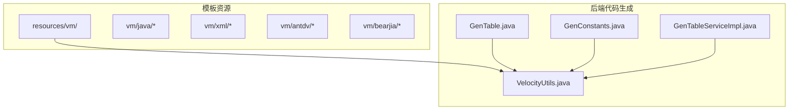
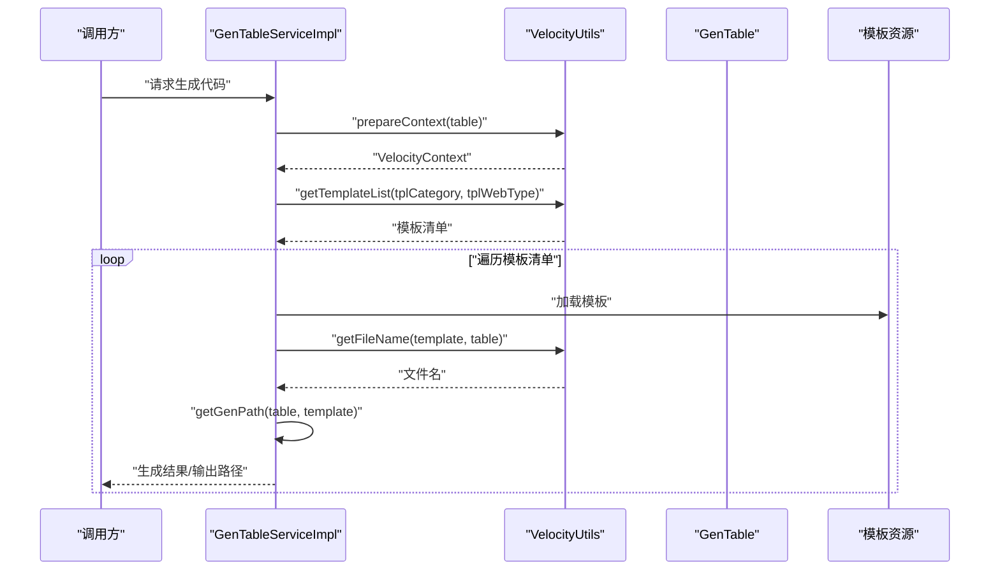
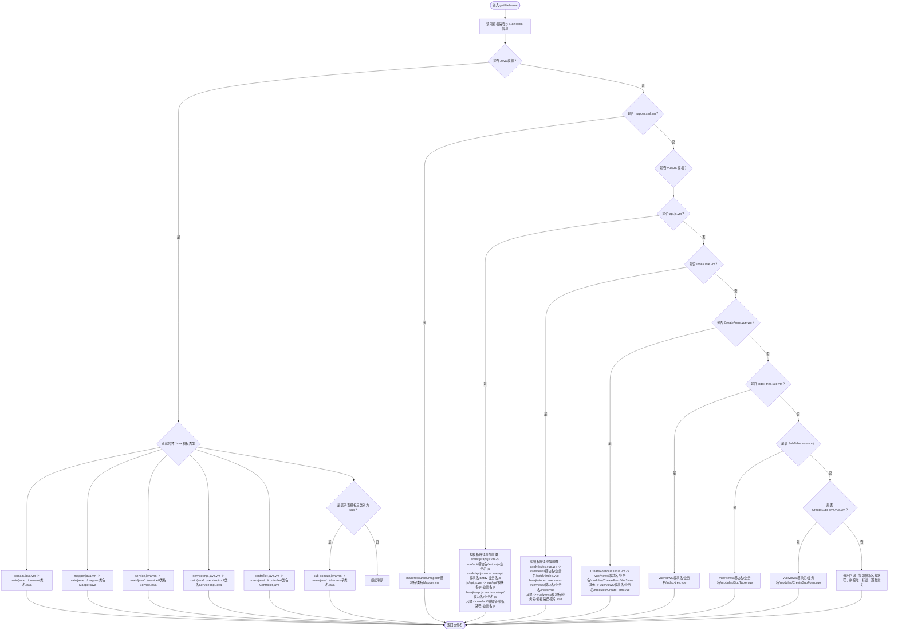
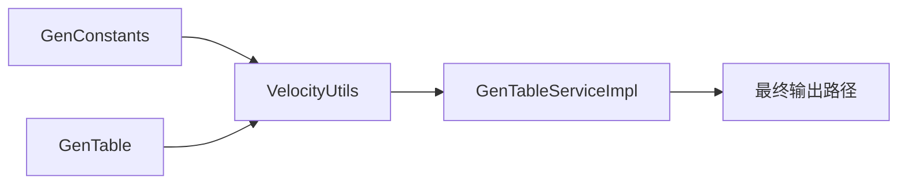

# 文件路径生成

<cite>
**本文引用的文件**
- [VelocityUtils.java](file://bearjia-admin-backend/src/main/java/com/javaxiaobear/module/tool/gen/util/VelocityUtils.java)
- [GenTable.java](file://bearjia-admin-backend/src/main/java/com/javaxiaobear/module/tool/gen/domain/GenTable.java)
- [GenConstants.java](file://bearjia-admin-backend/src/main/java/com/javaxiaobear/base/common/constant/GenConstants.java)
- [GenTableServiceImpl.java](file://bearjia-admin-backend/src/main/java/com/javaxiaobear/module/tool/gen/service/GenTableServiceImpl.java)
- [vm/README.md](file://bearjia-admin-backend/src/main/resources/vm/README.md)
- [vm/antdv/index.vue.vm](file://bearjia-admin-backend/src/main/resources/vm/antdv/index.vue.vm)
- [vm/antdv/api.js.vm](file://bearjia-admin-backend/src/main/resources/vm/antdv/api.js.vm)
- [vm/bearjia/index.vue.vm](file://bearjia-admin-backend/src/main/resources/vm/bearjia/index.vue.vm)
- [vm/java/domain.java.vm](file://bearjia-admin-backend/src/main/resources/vm/java/domain.java.vm)
</cite>

## 目录
1. [简介](#简介)
2. [项目结构](#项目结构)
3. [核心组件](#核心组件)
4. [架构总览](#架构总览)
5. [详细组件分析](#详细组件分析)
6. [依赖关系分析](#依赖关系分析)
7. [性能考量](#性能考量)
8. [故障排查指南](#故障排查指南)
9. [结论](#结论)
10. [附录](#附录)

## 简介
本文围绕后端代码生成工具中的文件路径生成机制，聚焦 VelocityUtils.getFileName 方法如何依据模板路径与 GenTable 信息，为 Java 后端、MyBatis Mapper XML、以及前端 Vue/JS 文件生成最终的输出路径。文档将：
- 解析 getFileName 的决策流程与规则
- 说明不同模板类别（单表 CRUD、树表、主子表）与前端模板类型（antdv、bearjia）对文件路径的影响
- 提供避免文件名冲突的策略（为 api.js.vm 与 index.vue.vm 添加前缀）
- 讲解主子表代码生成时 CreateForm、SubTable 等组件的文件命名规则
- 给出文件路径生成规则映射表与示例
- 总结常见问题与解决方案（路径过长、非法字符等）

## 项目结构
与文件路径生成直接相关的核心位置：
- 后端模板资源：resources/vm 下包含 java、xml、js、antdv、bearjia 等模板
- 后端代码生成工具：VelocityUtils 负责模板变量准备与文件名生成
- 业务表模型：GenTable 提供包名、模块名、业务名、类名等关键信息
- 生成服务：GenTableServiceImpl 调用模板列表与文件名生成，决定最终输出路径

图表来源
- [VelocityUtils.java](file://bearjia-admin-backend/src/main/java/com/javaxiaobear/module/tool/gen/util/VelocityUtils.java#L130-L167)
- [GenTable.java](file://bearjia-admin-backend/src/main/java/com/javaxiaobear/module/tool/gen/domain/GenTable.java#L161-L209)
- [GenConstants.java](file://bearjia-admin-backend/src/main/java/com/javaxiaobear/base/common/constant/GenConstants.java#L10-L17)
- [GenTableServiceImpl.java](file://bearjia-admin-backend/src/main/java/com/javaxiaobear/module/tool/gen/service/GenTableServiceImpl.java#L215-L226)

章节来源
- [vm/README.md](file://bearjia-admin-backend/src/main/resources/vm/README.md#L1-L20)
- [VelocityUtils.java](file://bearjia-admin-backend/src/main/java/com/javaxiaobear/module/tool/gen/util/VelocityUtils.java#L130-L167)
- [GenTable.java](file://bearjia-admin-backend/src/main/java/com/javaxiaobear/module/tool/gen/domain/GenTable.java#L161-L209)

## 核心组件
- VelocityUtils.getFileName：根据模板路径与 GenTable 信息生成最终文件名
- VelocityUtils.getTemplateList：按模板类别与前端模板类型返回模板清单
- GenTable：提供包名、模块名、业务名、类名、模板类别、前端模板类型等
- GenConstants：定义模板类别常量（crud/tree/sub）
- GenTableServiceImpl.getGenPath：结合用户配置的 genPath 与 getFileName 结果，确定最终输出路径

章节来源
- [VelocityUtils.java](file://bearjia-admin-backend/src/main/java/com/javaxiaobear/module/tool/gen/util/VelocityUtils.java#L180-L330)
- [VelocityUtils.java](file://bearjia-admin-backend/src/main/java/com/javaxiaobear/module/tool/gen/util/VelocityUtils.java#L130-L167)
- [GenTable.java](file://bearjia-admin-backend/src/main/java/com/javaxiaobear/module/tool/gen/domain/GenTable.java#L161-L209)
- [GenConstants.java](file://bearjia-admin-backend/src/main/java/com/javaxiaobear/base/common/constant/GenConstants.java#L10-L17)
- [GenTableServiceImpl.java](file://bearjia-admin-backend/src/main/java/com/javaxiaobear/module/tool/gen/service/GenTableServiceImpl.java#L545-L553)

## 架构总览
文件路径生成的整体流程如下：

图表来源
- [GenTableServiceImpl.java](file://bearjia-admin-backend/src/main/java/com/javaxiaobear/module/tool/gen/service/GenTableServiceImpl.java#L215-L226)
- [VelocityUtils.java](file://bearjia-admin-backend/src/main/java/com/javaxiaobear/module/tool/gen/util/VelocityUtils.java#L130-L167)
- [VelocityUtils.java](file://bearjia-admin-backend/src/main/java/com/javaxiaobear/module/tool/gen/util/VelocityUtils.java#L180-L330)
- [GenTableServiceImpl.java](file://bearjia-admin-backend/src/main/java/com/javaxiaobear/module/tool/gen/service/GenTableServiceImpl.java#L545-L553)

## 详细组件分析

### VelocityUtils.getFileName 决策流程
getFileName 根据模板路径片段匹配，结合 GenTable 的包名、模块名、业务名、类名等信息，生成最终文件名。其核心逻辑要点：
- Java 后端类：以 main/java 下的包路径组织，按模板类型生成 domain、mapper、service、serviceImpl、controller 等文件
- MyBatis Mapper XML：位于 main/resources/mapper 下，按模块名组织
- 前端 Vue/JS：位于 vue 目录下，按模块名与业务名组织；为避免同名冲突，针对 api.js.vm 与 index.vue.vm 添加前缀或模板路径标识
- 主子表：当模板类别为 sub 时，子表类名使用 subTable.className

图表来源
- [VelocityUtils.java](file://bearjia-admin-backend/src/main/java/com/javaxiaobear/module/tool/gen/util/VelocityUtils.java#L180-L330)

章节来源
- [VelocityUtils.java](file://bearjia-admin-backend/src/main/java/com/javaxiaobear/module/tool/gen/util/VelocityUtils.java#L180-L330)

### 模板类别与前端模板类型对文件名的影响
- 模板类别（tplCategory）：crud、tree、sub
- 前端模板类型（tplWebType）：antdv-vue3（值为“ 2”）、bearjia（值为“ 1”或其他）
- getTemplateList 会根据类别与类型选择不同的模板清单，从而影响最终生成的文件名

章节来源
- [VelocityUtils.java](file://bearjia-admin-backend/src/main/java/com/javaxiaobear/module/tool/gen/util/VelocityUtils.java#L130-L167)
- [GenConstants.java](file://bearjia-admin-backend/src/main/java/com/javaxiaobear/base/common/constant/GenConstants.java#L10-L17)
- [GenTable.java](file://bearjia-admin-backend/src/main/java/com/javaxiaobear/module/tool/gen/domain/GenTable.java#L161-L179)

### 避免文件名冲突的策略
- 对 api.js.vm：根据模板路径添加前缀，如 antdv-js-、antdv-、js-、bearjia-，或通用的模板路径标识，确保同一模块下不会出现同名 api.js
- 对 index.vue.vm：同样添加前缀，如 antdv-index、index，或通用模板路径标识
- 通用回退：若未命中上述分支，则通过提取模板名与模板路径，拼接唯一标识，避免重复

章节来源
- [VelocityUtils.java](file://bearjia-admin-backend/src/main/java/com/javaxiaobear/module/tool/gen/util/VelocityUtils.java#L232-L326)

### 主子表代码生成的文件命名
- 子表类名：当模板类别为 sub 时，子表 Java 类名使用 subTable.className
- 子表相关 Vue 组件：CreateForm、SubTable、CreateSubForm 等均放置在 vue/views/模块名/业务名/modules 下，文件名带有明确的模块化路径

章节来源
- [VelocityUtils.java](file://bearjia-admin-backend/src/main/java/com/javaxiaobear/module/tool/gen/util/VelocityUtils.java#L204-L207)
- [VelocityUtils.java](file://bearjia-admin-backend/src/main/java/com/javaxiaobear/module/tool/gen/util/VelocityUtils.java#L276-L299)
- [vm/antdv/index.vue.vm](file://bearjia-admin-backend/src/main/resources/vm/antdv/index.vue.vm#L1-L40)
- [vm/antdv/api.js.vm](file://bearjia-admin-backend/src/main/resources/vm/antdv/api.js.vm#L1-L20)

### 文件路径生成规则映射表
以下为从模板到最终文件名的映射规则（以模块名为 module、业务名为 business、类名为 Class 为例）：

- Java 后端类
  - domain.java.vm -> main/java/包路径/domain/Class.java
  - sub-domain.java.vm（仅当类别为 sub）-> main/java/包路径/domain/子类名.java
  - mapper.java.vm -> main/java/包路径/mapper/ClassMapper.java
  - service.java.vm -> main/java/包路径/service/IClassService.java
  - serviceImpl.java.vm -> main/java/包路径/service/impl/ClassServiceImpl.java
  - controller.java.vm -> main/java/包路径/controller/ClassController.java

- MyBatis Mapper XML
  - mapper.xml.vm -> main/resources/mapper/module/ClassMapper.xml

- 前端 Vue/JS
  - antdv/api.js.vm -> vue/api/module/antdv-业务名.js
  - js/api.js.vm -> vue/api/module/js-业务名.js
  - bearjia/api.js.vm -> vue/api/module/业务名.js
  - 其他 api.js.vm -> vue/api/module/模板路径-业务名.js
  - antdv/index.vue.vm -> vue/views/module/business/antdv-index.vue
  - bearjia/index.vue.vm -> vue/views/module/business/index.vue
  - 其他 index.vue.vm -> vue/views/module/business/模板路径-index.vue
  - CreateForm.vue.vm（CreateFormVue3.vue.vm）-> vue/views/module/business/modules/CreateFormVue3.vue
  - CreateForm.vue.vm（普通）-> vue/views/module/business/modules/CreateForm.vue
  - index-tree.vue.vm -> vue/views/module/business/index-tree.vue
  - SubTable.vue.vm -> vue/views/module/business/modules/SubTable.vue
  - CreateSubForm.vue.vm -> vue/views/module/business/modules/CreateSubForm.vue

- 通用回退
  - 未命中上述分支的模板：根据模板名与模板路径生成唯一标识，避免重复

章节来源
- [VelocityUtils.java](file://bearjia-admin-backend/src/main/java/com/javaxiaobear/module/tool/gen/util/VelocityUtils.java#L180-L330)
- [vm/README.md](file://bearjia-admin-backend/src/main/resources/vm/README.md#L1-L20)
- [vm/antdv/index.vue.vm](file://bearjia-admin-backend/src/main/resources/vm/antdv/index.vue.vm#L1-L40)
- [vm/antdv/api.js.vm](file://bearjia-admin-backend/src/main/resources/vm/antdv/api.js.vm#L1-L20)
- [vm/bearjia/index.vue.vm](file://bearjia-admin-backend/src/main/resources/vm/bearjia/index.vue.vm#L1-L40)
- [vm/java/domain.java.vm](file://bearjia-admin-backend/src/main/resources/vm/java/domain.java.vm#L1-L20)

### 示例说明
- 单表（crud）+ bearjia 模板
  - index.vue -> vue/views/system/user/index.vue
  - api.js -> vue/api/system/user/user.js
  - domain.java -> main/java/com.company.project/system/user/domain/User.java
  - mapper.java -> main/java/com.company.project/system/user/mapper/UserMapper.java
  - service.java -> main/java/com.company.project/system/user/service/IUserService.java
  - serviceImpl.java -> main/java/com.company.project/system/user/service/impl/UserServiceImpl.java
  - controller.java -> main/java/com.company.project/system/user/controller/UserController.java
  - mapper.xml -> main/resources/mapper/system/UserMapper.xml

- 树表（tree）+ antdv 模板
  - index.vue -> vue/views/system/user/antdv-index.vue
  - api.js -> vue/api/system/user/antdv-user.js
  - index-tree.vue -> vue/views/system/user/index-tree.vue

- 主子表（sub）+ antdv 模板
  - index.vue -> vue/views/system/user/antdv-index.vue
  - api.js -> vue/api/system/user/antdv-user.js
  - CreateForm.vue -> vue/views/system/user/modules/CreateForm.vue
  - SubTable.vue -> vue/views/system/user/modules/SubTable.vue
  - CreateSubForm.vue -> vue/views/system/user/modules/CreateSubForm.vue
  - 子表 domain.java -> main/java/com.company.project/system/user/domain/SubClass.java

章节来源
- [VelocityUtils.java](file://bearjia-admin-backend/src/main/java/com/javaxiaobear/module/tool/gen/util/VelocityUtils.java#L130-L167)
- [VelocityUtils.java](file://bearjia-admin-backend/src/main/java/com/javaxiaobear/module/tool/gen/util/VelocityUtils.java#L180-L330)
- [GenTable.java](file://bearjia-admin-backend/src/main/java/com/javaxiaobear/module/tool/gen/domain/GenTable.java#L161-L209)

## 依赖关系分析
- VelocityUtils.getTemplateList 依赖 GenConstants 常量与 GenTable 的 tplCategory、tplWebType
- VelocityUtils.getFileName 依赖 GenTable 的 packageName、moduleName、businessName、className、subTable.className
- GenTableServiceImpl.getGenPath 依赖 GenTable 的 genPath 与 VelocityUtils.getFileName 的结果

图表来源
- [GenConstants.java](file://bearjia-admin-backend/src/main/java/com/javaxiaobear/base/common/constant/GenConstants.java#L10-L17)
- [VelocityUtils.java](file://bearjia-admin-backend/src/main/java/com/javaxiaobear/module/tool/gen/util/VelocityUtils.java#L130-L167)
- [VelocityUtils.java](file://bearjia-admin-backend/src/main/java/com/javaxiaobear/module/tool/gen/util/VelocityUtils.java#L180-L330)
- [GenTableServiceImpl.java](file://bearjia-admin-backend/src/main/java/com/javaxiaobear/module/tool/gen/service/GenTableServiceImpl.java#L545-L553)

章节来源
- [GenConstants.java](file://bearjia-admin-backend/src/main/java/com/javaxiaobear/base/common/constant/GenConstants.java#L10-L17)
- [VelocityUtils.java](file://bearjia-admin-backend/src/main/java/com/javaxiaobear/module/tool/gen/util/VelocityUtils.java#L130-L167)
- [VelocityUtils.java](file://bearjia-admin-backend/src/main/java/com/javaxiaobear/module/tool/gen/util/VelocityUtils.java#L180-L330)
- [GenTableServiceImpl.java](file://bearjia-admin-backend/src/main/java/com/javaxiaobear/module/tool/gen/service/GenTableServiceImpl.java#L545-L553)

## 性能考量
- getFileName 采用字符串匹配与格式化，时间复杂度为 O(n)，其中 n 为模板数量，通常很小，性能开销可忽略
- getTemplateList 仅做条件分支与集合构造，复杂度低
- 建议在批量生成时，先一次性计算模板清单与上下文，减少重复初始化

## 故障排查指南
- 路径过长
  - 症状：生成路径超出操作系统限制
  - 原因：包路径过深、模块名/业务名过长
  - 解决：缩短包名、模块名、业务名；合并相近模块；使用简短的业务名
- 非法字符
  - 症状：文件名包含非法字符导致生成失败
  - 原因：模板路径或业务名包含空格、斜杠、冒号等
  - 解决：在 GenTable 输入阶段过滤非法字符；或在 getFileName 中对业务名进行安全处理（当前实现未内置，可在上游校验）
- 文件名冲突
  - 症状：多个模板生成同名文件
  - 原因：未区分模板来源（如 api.js.vm）
  - 解决：使用前缀策略（已实现）；或在 getFileName 中进一步细化模板路径标识
- 主子表类名为空
  - 症状：子表模板生成失败
  - 原因：GenTable.subTable 未正确设置
  - 解决：在生成前调用 setSubTable(table) 确保子表信息存在

章节来源
- [VelocityUtils.java](file://bearjia-admin-backend/src/main/java/com/javaxiaobear/module/tool/gen/util/VelocityUtils.java#L232-L326)
- [GenTableServiceImpl.java](file://bearjia-admin-backend/src/main/java/com/javaxiaobear/module/tool/gen/service/GenTableServiceImpl.java#L364-L383)

## 结论
VelocityUtils.getFileName 通过模板路径与 GenTable 信息的精确匹配，实现了 Java 后端、MyBatis XML 与前端 Vue/JS 文件的规范化路径生成。针对 api.js.vm 与 index.vue.vm 的冲突问题，采用前缀与模板路径标识策略有效避免了重复。主子表场景下，子表类名与模块化组件路径清晰明确。建议在实际使用中严格控制包名、模块名、业务名长度与合法性，以降低路径过长与非法字符带来的风险。

## 附录
- 模板资源说明可参考 vm/README.md，了解 antdv 与 bearjia 模板的差异与生成文件结构
- 模板示例文件可参考 vm/antdv/index.vue.vm、vm/antdv/api.js.vm、vm/bearjia/index.vue.vm、vm/java/domain.java.vm

章节来源
- [vm/README.md](file://bearjia-admin-backend/src/main/resources/vm/README.md#L1-L20)
- [vm/antdv/index.vue.vm](file://bearjia-admin-backend/src/main/resources/vm/antdv/index.vue.vm#L1-L40)
- [vm/antdv/api.js.vm](file://bearjia-admin-backend/src/main/resources/vm/antdv/api.js.vm#L1-L20)
- [vm/bearjia/index.vue.vm](file://bearjia-admin-backend/src/main/resources/vm/bearjia/index.vue.vm#L1-L40)
- [vm/java/domain.java.vm](file://bearjia-admin-backend/src/main/resources/vm/java/domain.java.vm#L1-L20)