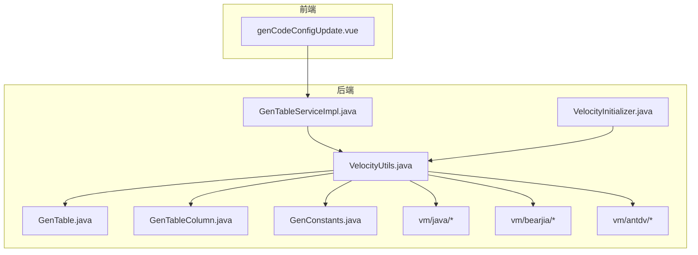
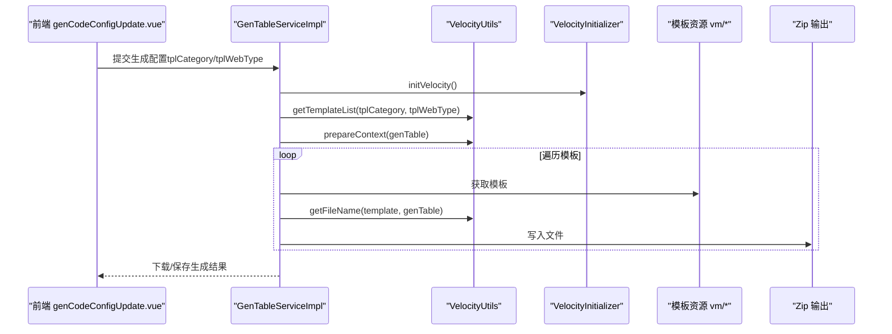
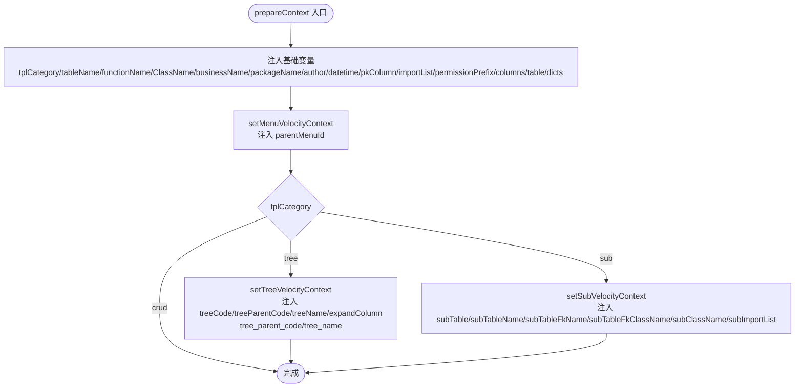
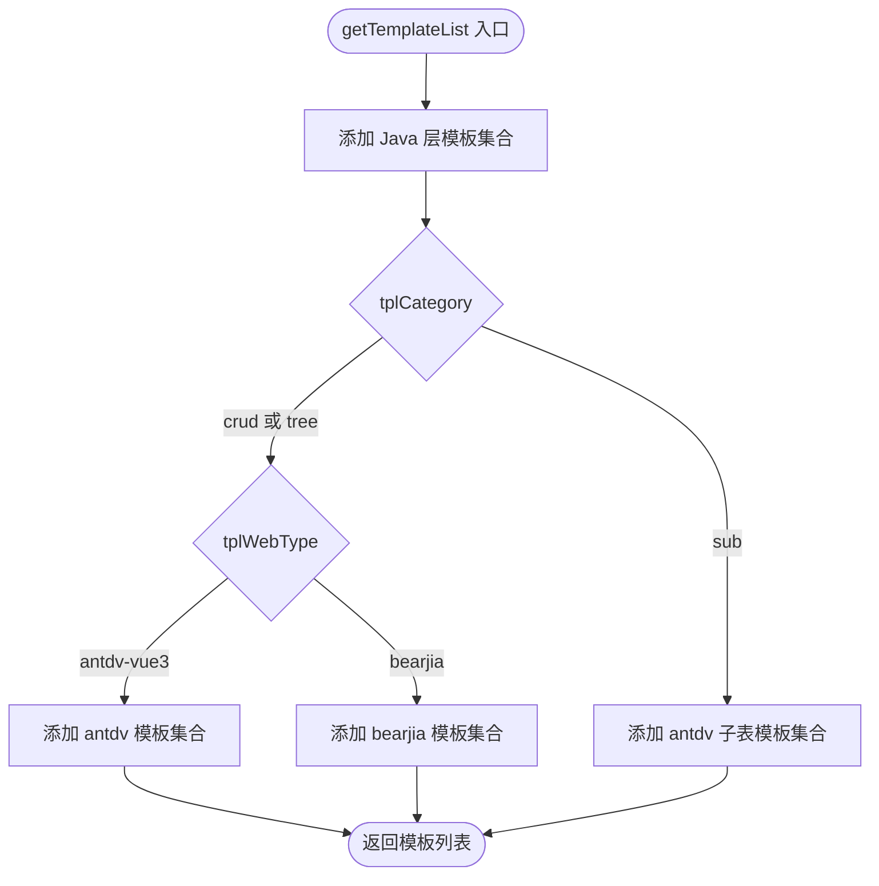
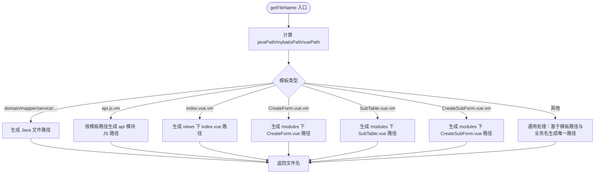
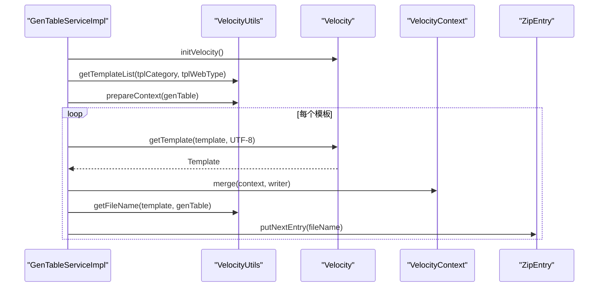
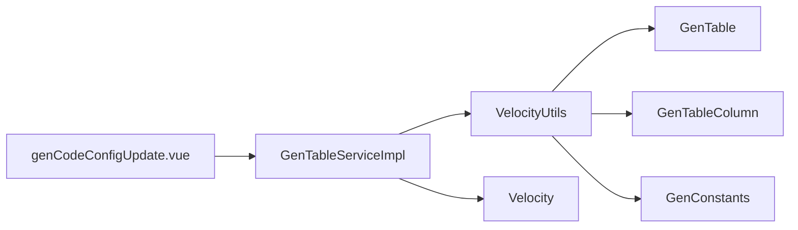

# 模板引擎集成

<cite>
**本文引用的文件**
- [VelocityUtils.java](file://bearjia-admin-backend/src/main/java/com/javaxiaobear/module/tool/gen/util/VelocityUtils.java)
- [VelocityInitializer.java](file://bearjia-admin-backend/src/main/java/com/javaxiaobear/module/tool/gen/util/VelocityInitializer.java)
- [GenTable.java](file://bearjia-admin-backend/src/main/java/com/javaxiaobear/module/tool/gen/domain/GenTable.java)
- [GenTableColumn.java](file://bearjia-admin-backend/src/main/java/com/javaxiaobear/module/tool/gen/domain/GenTableColumn.java)
- [GenConstants.java](file://bearjia-admin-backend/src/main/java/com/javaxiaobear/base/common/constant/GenConstants.java)
- [GenTableServiceImpl.java](file://bearjia-admin-backend/src/main/java/com/javaxiaobear/module/tool/gen/service/GenTableServiceImpl.java)
- [domain.java.vm](file://bearjia-admin-backend/src/main/resources/vm/java/domain.java.vm)
- [index.vue.vm（bearjia）](file://bearjia-admin-backend/src/main/resources/vm/bearjia/index.vue.vm)
- [index.vue.vm（antdv）](file://bearjia-admin-backend/src/main/resources/vm/antdv/index.vue.vm)
- [api.js.vm（bearjia）](file://bearjia-admin-backend/src/main/resources/vm/bearjia/api.js.vm)
- [api.js.vm（antdv）](file://bearjia-admin-backend/src/main/resources/vm/antdv/api.js.vm)
- [genCodeConfigUpdate.vue](file://bear-jia-vue3/src/views/tool/gen/genCodeConfigUpdate.vue)
</cite>

## 目录
1. [简介](#简介)
2. [项目结构](#项目结构)
3. [核心组件](#核心组件)
4. [架构总览](#架构总览)
5. [详细组件分析](#详细组件分析)
6. [依赖关系分析](#依赖关系分析)
7. [性能考虑](#性能考虑)
8. [故障排查指南](#故障排查指南)
9. [结论](#结论)
10. [附录](#附录)

## 简介
本文件面向“模板引擎集成”主题，聚焦于 Velocity 模板引擎在后端代码与前端 Vue 页面生成中的应用。重点解析以下内容：
- VelocityUtils 如何集成 Velocity 模板引擎实现代码生成；
- prepareContext 方法如何构建 VelocityContext 上下文，包含包名、类名、权限前缀等变量的注入；
- getTemplateList 方法如何根据 tplCategory 和 tplWebType 选择不同的模板列表（bearjia 模板或 antdv 模板）；
- getFileName 方法如何根据模板类型生成正确的文件路径（如 api.js.vm 生成 api 模块的 JS 文件，index.vue.vm 生成 views 目录下的 Vue 组件）；
- 不同模板类型（单表、树表、主子表）的差异化处理逻辑（树表需要设置 treeCode、treeParentCode 等特殊字段）；
- 自定义模板的开发指南（如何修改现有模板或创建新的模板类型）；
- 模板引擎的性能优化建议（模板缓存、上下文预处理等）。

## 项目结构
本项目采用前后端分离的多模块结构，模板引擎主要位于后端 Java 工程中，前端 Vue 代码由模板渲染生成。关键位置如下：
- 后端模板资源：vm/java、vm/xml、vm/sql、vm/bearjia、vm/antdv 等目录；
- 后端工具类：VelocityUtils（上下文构建、模板选择、文件名生成）、VelocityInitializer（引擎初始化）；
- 前端生成入口：Vue 页面通过选择模板类别与前端模板类型，触发后端模板渲染与打包输出。

图表来源
- [VelocityUtils.java](file://bearjia-admin-backend/src/main/java/com/javaxiaobear/module/tool/gen/util/VelocityUtils.java#L1-L120)
- [VelocityInitializer.java](file://bearjia-admin-backend/src/main/java/com/javaxiaobear/module/tool/gen/util/VelocityInitializer.java#L1-L35)
- [GenTable.java](file://bearjia-admin-backend/src/main/java/com/javaxiaobear/module/tool/gen/domain/GenTable.java#L1-L120)
- [GenTableColumn.java](file://bearjia-admin-backend/src/main/java/com/javaxiaobear/module/tool/gen/domain/GenTableColumn.java#L1-L120)
- [GenConstants.java](file://bearjia-admin-backend/src/main/java/com/javaxiaobear/base/common/constant/GenConstants.java#L1-L43)
- [GenTableServiceImpl.java](file://bearjia-admin-backend/src/main/java/com/javaxiaobear/module/tool/gen/service/GenTableServiceImpl.java#L382-L414)
- [domain.java.vm](file://bearjia-admin-backend/src/main/resources/vm/java/domain.java.vm#L1-L104)
- [index.vue.vm（bearjia）](file://bearjia-admin-backend/src/main/resources/vm/bearjia/index.vue.vm#L1-L120)
- [index.vue.vm（antdv）](file://bearjia-admin-backend/src/main/resources/vm/antdv/index.vue.vm#L1-L120)
- [api.js.vm（bearjia）](file://bearjia-admin-backend/src/main/resources/vm/bearjia/api.js.vm#L1-L120)
- [api.js.vm（antdv）](file://bearjia-admin-backend/src/main/resources/vm/antdv/api.js.vm#L1-L120)

章节来源
- [VelocityUtils.java](file://bearjia-admin-backend/src/main/java/com/javaxiaobear/module/tool/gen/util/VelocityUtils.java#L1-L120)
- [VelocityInitializer.java](file://bearjia-admin-backend/src/main/java/com/javaxiaobear/module/tool/gen/util/VelocityInitializer.java#L1-L35)
- [GenTable.java](file://bearjia-admin-backend/src/main/java/com/javaxiaobear/module/tool/gen/domain/GenTable.java#L1-L120)
- [GenTableColumn.java](file://bearjia-admin-backend/src/main/java/com/javaxiaobear/module/tool/gen/domain/GenTableColumn.java#L1-L120)
- [GenConstants.java](file://bearjia-admin-backend/src/main/java/com/javaxiaobear/base/common/constant/GenConstants.java#L1-L43)
- [GenTableServiceImpl.java](file://bearjia-admin-backend/src/main/java/com/javaxiaobear/module/tool/gen/service/GenTableServiceImpl.java#L382-L414)

## 核心组件
- VelocityUtils：模板处理工具类，负责构建 VelocityContext、选择模板、生成文件名、注入权限前缀、树表与主子表上下文等。
- VelocityInitializer：Velocity 引擎初始化器，配置资源加载器与字符集。
- GenTable/GenTableColumn：业务表与列模型，承载模板渲染所需的元数据。
- GenConstants：模板分类与树表字段常量定义。
- GenTableServiceImpl：调用 Velocity 渲染模板并写入 Zip 输出，同时处理重复文件名冲突。

章节来源
- [VelocityUtils.java](file://bearjia-admin-backend/src/main/java/com/javaxiaobear/module/tool/gen/util/VelocityUtils.java#L1-L120)
- [VelocityInitializer.java](file://bearjia-admin-backend/src/main/java/com/javaxiaobear/module/tool/gen/util/VelocityInitializer.java#L1-L35)
- [GenTable.java](file://bearjia-admin-backend/src/main/java/com/javaxiaobear/module/tool/gen/domain/GenTable.java#L1-L120)
- [GenTableColumn.java](file://bearjia-admin-backend/src/main/java/com/javaxiaobear/module/tool/gen/domain/GenTableColumn.java#L1-L120)
- [GenConstants.java](file://bearjia-admin-backend/src/main/java/com/javaxiaobear/base/common/constant/GenConstants.java#L1-L43)
- [GenTableServiceImpl.java](file://bearjia-admin-backend/src/main/java/com/javaxiaobear/module/tool/gen/service/GenTableServiceImpl.java#L382-L414)

## 架构总览
后端通过 Velocity 渲染模板，将业务表元数据注入 VelocityContext，生成 Java 实体、Mapper、Service、Controller、XML、SQL 以及前端 Vue 页面与 API 文件。前端 Vue 页面通过选择模板类别与前端模板类型，驱动后端生成对应模板集合。

图表来源
- [genCodeConfigUpdate.vue](file://bear-jia-vue3/src/views/tool/gen/genCodeConfigUpdate.vue#L27-L60)
- [GenTableServiceImpl.java](file://bearjia-admin-backend/src/main/java/com/javaxiaobear/module/tool/gen/service/GenTableServiceImpl.java#L382-L414)
- [VelocityUtils.java](file://bearjia-admin-backend/src/main/java/com/javaxiaobear/module/tool/gen/util/VelocityUtils.java#L130-L189)
- [VelocityInitializer.java](file://bearjia-admin-backend/src/main/java/com/javaxiaobear/module/tool/gen/util/VelocityInitializer.java#L17-L33)

## 详细组件分析

### VelocityUtils：上下文构建与模板选择
- prepareContext：注入基础变量（表名、类名、模块名、业务名、作者、时间、主键、导入列表、权限前缀、列集合、字典组），并根据模板类别注入菜单、树表、主子表上下文。
- setMenuVelocityContext：从 options 中提取 parentMenuId 并注入上下文。
- setTreeVelocityContext：从 options 中提取 treeCode、treeParentCode、treeName，并计算 expandColumn；同时兼容 tree_parent_code、tree_name 的注入。
- setSubVelocityContext：注入子表相关信息（子表对象、子表名、外键名、外键类名、子类名、导入列表）。
- getTemplateList：根据 tplCategory 与 tplWebType 返回模板集合。单表/树表默认注入 Java 层模板与前端模板；主子表仅注入 antdv 模板。
- getFileName：根据模板类型与业务表信息生成目标文件路径，确保 api.js.vm 生成 api 模块 JS 文件，index.vue.vm 生成 views 目录下的 Vue 组件，并对重复文件名进行重命名处理。
- getPermissionPrefix：生成权限前缀，格式为 “模块名:业务名”。

图表来源
- [VelocityUtils.java](file://bearjia-admin-backend/src/main/java/com/javaxiaobear/module/tool/gen/util/VelocityUtils.java#L36-L121)

章节来源
- [VelocityUtils.java](file://bearjia-admin-backend/src/main/java/com/javaxiaobear/module/tool/gen/util/VelocityUtils.java#L36-L121)
- [VelocityUtils.java](file://bearjia-admin-backend/src/main/java/com/javaxiaobear/module/tool/gen/util/VelocityUtils.java#L130-L189)
- [VelocityUtils.java](file://bearjia-admin-backend/src/main/java/com/javaxiaobear/module/tool/gen/util/VelocityUtils.java#L180-L364)

### 模板选择策略：getTemplateList
- 单表/树表：根据 tplWebType 选择前端模板。当 tplWebType 为 antdv-vue3 模板时，注入 antdv 模板；否则注入 bearjia 模板。
- 主子表：仅注入 antdv 模板集合。
- Java 层模板：统一注入 domain、mapper、service、serviceImpl、controller、mapper.xml、sql。

图表来源
- [VelocityUtils.java](file://bearjia-admin-backend/src/main/java/com/javaxiaobear/module/tool/gen/util/VelocityUtils.java#L130-L189)

章节来源
- [VelocityUtils.java](file://bearjia-admin-backend/src/main/java/com/javaxiaobear/module/tool/gen/util/VelocityUtils.java#L130-L189)

### 文件名生成：getFileName
- Java 层：按包路径与类名生成 domain、mapper、service、serviceImpl、controller、mapper.xml、sql 文件路径。
- 前端 API：根据模板路径区分 bearjia/antdv/js 等，生成 api 模块下的 JS 文件，避免重复条目。
- 前端页面：index.vue 生成 views 下的 index.vue 文件，CreateForm.vue 生成 modules 下的表单组件，SubTable.vue 与 CreateSubForm.vue 生成子表相关组件。
- 通用兜底：对未明确处理的模板，基于模板路径与业务名生成唯一文件名。

图表来源
- [VelocityUtils.java](file://bearjia-admin-backend/src/main/java/com/javaxiaobear/module/tool/gen/util/VelocityUtils.java#L180-L364)

章节来源
- [VelocityUtils.java](file://bearjia-admin-backend/src/main/java/com/javaxiaobear/module/tool/gen/util/VelocityUtils.java#L180-L364)

### 不同模板类型的差异化处理
- 单表（crud）：注入 bearjia 或 antdv 前端模板，生成标准 CRUD 页面与 API。
- 树表（tree）：除注入前端模板外，还需注入树表上下文（treeCode、treeParentCode、treeName、expandColumn），并在前端模板中启用树形表格与树形选择。
- 主子表（sub）：仅注入 antdv 模板，生成主表页面与子表模块（含子表表单与子表表格）。

章节来源
- [VelocityUtils.java](file://bearjia-admin-backend/src/main/java/com/javaxiaobear/module/tool/gen/util/VelocityUtils.java#L83-L121)
- [index.vue.vm（bearjia）](file://bearjia-admin-backend/src/main/resources/vm/bearjia/index.vue.vm#L1-L120)
- [index.vue.vm（antdv）](file://bearjia-admin-backend/src/main/resources/vm/antdv/index.vue.vm#L1-L120)

### 前端模板与后端模板的映射
- bearjia 模板：index.vue.vm、addUpdateModal.vue.vm、detailModal.vue.vm、api.js.vm。
- antdv 模板：index.vue.vm、modules/CreateForm.vue.vm、modules/CreateFormVue3.vue.vm、modules/SubTable.vue.vm、modules/CreateSubForm.vue.vm、api.js.vm、js/api.js.vm。

章节来源
- [index.vue.vm（bearjia）](file://bearjia-admin-backend/src/main/resources/vm/bearjia/index.vue.vm#L1-L120)
- [index.vue.vm（antdv）](file://bearjia-admin-backend/src/main/resources/vm/antdv/index.vue.vm#L1-L120)
- [api.js.vm（bearjia）](file://bearjia-admin-backend/src/main/resources/vm/bearjia/api.js.vm#L1-L120)
- [api.js.vm（antdv）](file://bearjia-admin-backend/src/main/resources/vm/antdv/api.js.vm#L1-L120)

### 模板渲染与输出流程
- 前端选择模板类别与前端模板类型后，后端根据 getTemplateList 返回模板集合；
- 对每个模板，调用 Velocity.getTemplate(template, encoding) 获取模板；
- prepareContext 构建上下文；
- merge 渲染模板到 StringWriter；
- getFileName 计算输出文件名；
- GenTableServiceImpl 在 Zip 中写入文件，处理重复文件名冲突。

图表来源
- [GenTableServiceImpl.java](file://bearjia-admin-backend/src/main/java/com/javaxiaobear/module/tool/gen/service/GenTableServiceImpl.java#L382-L414)
- [VelocityUtils.java](file://bearjia-admin-backend/src/main/java/com/javaxiaobear/module/tool/gen/util/VelocityUtils.java#L130-L189)
- [VelocityInitializer.java](file://bearjia-admin-backend/src/main/java/com/javaxiaobear/module/tool/gen/util/VelocityInitializer.java#L17-L33)

章节来源
- [GenTableServiceImpl.java](file://bearjia-admin-backend/src/main/java/com/javaxiaobear/module/tool/gen/service/GenTableServiceImpl.java#L382-L414)

## 依赖关系分析
- VelocityUtils 依赖 GenTable、GenTableColumn、GenConstants，用于构建上下文与模板选择；
- GenTableServiceImpl 依赖 VelocityUtils 与 Velocity，负责模板渲染与输出；
- 前端 genCodeConfigUpdate.vue 提供模板类别与前端模板类型的选择，驱动后端生成。

图表来源
- [genCodeConfigUpdate.vue](file://bear-jia-vue3/src/views/tool/gen/genCodeConfigUpdate.vue#L27-L60)
- [GenTableServiceImpl.java](file://bearjia-admin-backend/src/main/java/com/javaxiaobear/module/tool/gen/service/GenTableServiceImpl.java#L382-L414)
- [VelocityUtils.java](file://bearjia-admin-backend/src/main/java/com/javaxiaobear/module/tool/gen/util/VelocityUtils.java#L1-L120)
- [GenTable.java](file://bearjia-admin-backend/src/main/java/com/javaxiaobear/module/tool/gen/domain/GenTable.java#L1-L120)
- [GenTableColumn.java](file://bearjia-admin-backend/src/main/java/com/javaxiaobear/module/tool/gen/domain/GenTableColumn.java#L1-L120)
- [GenConstants.java](file://bearjia-admin-backend/src/main/java/com/javaxiaobear/base/common/constant/GenConstants.java#L1-L43)

章节来源
- [genCodeConfigUpdate.vue](file://bear-jia-vue3/src/views/tool/gen/genCodeConfigUpdate.vue#L27-L60)
- [GenTableServiceImpl.java](file://bearjia-admin-backend/src/main/java/com/javaxiaobear/module/tool/gen/service/GenTableServiceImpl.java#L382-L414)
- [VelocityUtils.java](file://bearjia-admin-backend/src/main/java/com/javaxiaobear/module/tool/gen/util/VelocityUtils.java#L1-L120)

## 性能考虑
- 模板缓存：Velocity 支持模板缓存与资源加载器缓存，建议在生产环境保持 Velocity 初始化一次并复用，避免重复初始化带来的开销。
- 上下文预处理：prepareContext 中的 getImportList、getDicts、getExpandColumn 等方法可提前计算并缓存结果，减少模板渲染时的重复计算。
- 模板数量控制：getTemplateList 返回的模板集合越大，渲染与写入 Zip 的成本越高。建议按需选择模板类别与前端模板类型。
- 文件名冲突处理：GenTableServiceImpl 已内置重复文件名重命名逻辑，避免覆盖问题；可在上层调用时尽量保证模板路径与业务名的唯一性，减少冲突概率。
- 字符集与编码：VelocityInitializer 已设置输入编码为 UTF-8，确保模板与输出文件的字符集一致性，避免乱码与额外转换成本。

[本节为通用指导，无需具体文件分析]

## 故障排查指南
- 模板无法加载：检查 VelocityInitializer 的资源加载器配置与模板路径是否正确。
- 上下文变量缺失：确认 prepareContext 是否正确注入了基础变量与模板类别特定变量（菜单、树表、主子表）。
- 文件名冲突：查看 GenTableServiceImpl 的重复文件名重命名逻辑，必要时调整模板路径或业务名以避免冲突。
- 树表字段无效：检查 GenTable 的 options 中是否正确设置了 treeCode、treeParentCode、treeName，以及前端模板是否启用树形表格。
- 前端模板类型不生效：确认前端 genCodeConfigUpdate.vue 的 tplWebType 选择与后端 getTemplateList 的分支匹配。

章节来源
- [VelocityInitializer.java](file://bearjia-admin-backend/src/main/java/com/javaxiaobear/module/tool/gen/util/VelocityInitializer.java#L17-L33)
- [VelocityUtils.java](file://bearjia-admin-backend/src/main/java/com/javaxiaobear/module/tool/gen/util/VelocityUtils.java#L36-L121)
- [GenTableServiceImpl.java](file://bearjia-admin-backend/src/main/java/com/javaxiaobear/module/tool/gen/service/GenTableServiceImpl.java#L382-L414)
- [genCodeConfigUpdate.vue](file://bear-jia-vue3/src/views/tool/gen/genCodeConfigUpdate.vue#L27-L60)

## 结论
VelocityUtils 将 Velocity 模板引擎与业务表元数据紧密结合，实现了 Java 层与前端 Vue 页面的批量生成。通过 prepareContext 构建上下文、getTemplateList 选择模板、getFileName 生成文件路径，以及针对树表与主子表的差异化处理，满足了多种业务场景的代码生成需求。结合模板缓存、上下文预处理与文件名冲突处理等优化手段，可在保证灵活性的同时提升生成效率与稳定性。

[本节为总结，无需具体文件分析]

## 附录

### 自定义模板开发指南
- 新增模板文件：在 vm 目录下新增模板文件（如 vm/custom/xxx.vm），并在 getTemplateList 中加入该模板路径。
- 注入上下文变量：在 prepareContext 中根据需要注入新变量，或在 setTreeVelocityContext/setSubVelocityContext 中扩展树表/主子表上下文。
- 文件名规则：在 getFileName 中为新模板类型补充文件路径生成规则，确保生成的文件不会与现有模板冲突。
- 前端模板映射：若为前端模板，需在前端 genCodeConfigUpdate.vue 中增加对应的 tplWebType 选项，并在 getTemplateList 中分支处理。
- 测试验证：先在小范围内测试模板渲染效果，确认 Java 代码与前端页面均符合预期后再推广使用。

章节来源
- [VelocityUtils.java](file://bearjia-admin-backend/src/main/java/com/javaxiaobear/module/tool/gen/util/VelocityUtils.java#L130-L189)
- [VelocityUtils.java](file://bearjia-admin-backend/src/main/java/com/javaxiaobear/module/tool/gen/util/VelocityUtils.java#L180-L364)
- [genCodeConfigUpdate.vue](file://bear-jia-vue3/src/views/tool/gen/genCodeConfigUpdate.vue#L342-L353)