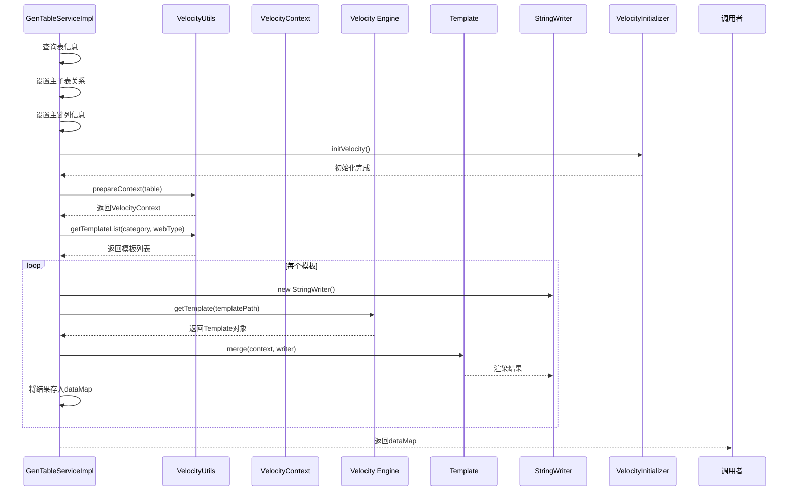
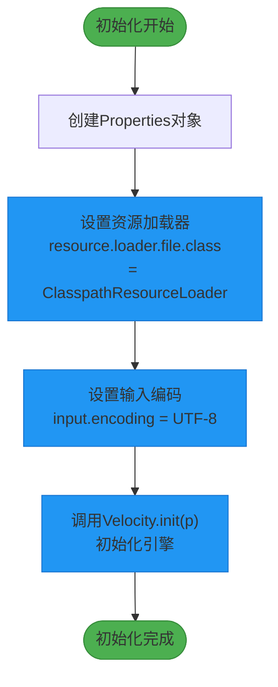
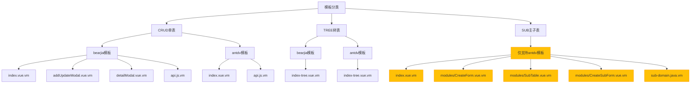

# 模板选择与渲染

<cite>
**本文档引用的文件**   
- [VelocityUtils.java](file://bearjia-admin-backend/src/main/java/com/javaxiaobear/module/tool/gen/util/VelocityUtils.java)
- [GenTableServiceImpl.java](file://bearjia-admin-backend/src/main/java/com/javaxiaobear/module/tool/gen/service/GenTableServiceImpl.java)
- [VelocityInitializer.java](file://bearjia-admin-backend/src/main/java/com/javaxiaobear/module/tool/gen/util/VelocityInitializer.java)
- [GenTable.java](file://bearjia-admin-backend/src/main/java/com/javaxiaobear/module/tool/gen/domain/GenTable.java)
- [ruoyi-usage.md](file://bear-jia-vue3/docs/ruoyi-usage.md)
- [genCodeConfigUpdate.vue](file://bear-jia-vue3/src/views/tool/gen/genCodeConfigUpdate.vue)
- [README.md](file://bearjia-admin-backend/src/main/resources/vm/README.md)
</cite>

## 目录
1. [简介](#简介)
2. [模板选择机制](#模板选择机制)
3. [模板渲染流程](#模板渲染流程)
4. [Velocity引擎初始化](#velocity引擎初始化)
5. [不同模板分类的差异](#不同模板分类的差异)
6. [错误处理机制](#错误处理机制)
7. [模板缓存与性能优化](#模板缓存与性能优化)
8. [结论](#结论)

## 简介
本文档详细解析了代码生成系统中模板选择与渲染的核心机制。系统基于Velocity模板引擎，根据业务需求动态选择并渲染模板文件。核心功能包括根据模板分类（CRUD、树表、主子表）和前端框架类型（bearjia或antdv）动态选择模板列表，通过Velocity引擎进行代码生成，并支持灵活的配置和扩展。本文将深入分析`VelocityUtils.getTemplateList`方法的模板选择逻辑、`GenTableServiceImpl.generatorCode`方法的渲染流程以及`VelocityInitializer.initVelocity`方法的引擎初始化过程。

## 模板选择机制

`VelocityUtils.getTemplateList`方法是模板选择的核心，它根据`tplCategory`（模板分类）和`tplWebType`（前端框架类型）两个参数动态决定需要渲染的模板集合。

模板分类（`tplCategory`）支持三种类型：
- **CRUD（单表）**：标准的增删改查操作
- **TREE（树表）**：具有树形结构的数据展示
- **SUB（主子表）**：主表与子表的关联数据操作

前端框架类型（`tplWebType`）支持两种类型：
- **bearjia**：值为" 1"，对应BearJia Vue3架构模板
- **antdv**：值为" 2"，对应Ant Design Vue标准模板

当`tplCategory`为CRUD时，系统会根据`tplWebType`选择相应的模板集。对于bearjia模板，会包含主页面、新增/编辑弹窗、详情弹窗和API接口等完整的组件模板；对于antdv模板，则包含标准的Vue3组件模板。

**Section sources**
- [VelocityUtils.java](file://bearjia-admin-backend/src/main/java/com/javaxiaobear/module/tool/gen/util/VelocityUtils.java#L148-L156)
- [genCodeConfigUpdate.vue](file://bear-jia-vue3/src/views/tool/gen/genCodeConfigUpdate.vue#L342-L353)

## 模板渲染流程

`GenTableServiceImpl.generatorCode`方法负责整个代码生成和渲染流程。该方法首先查询数据库表信息，设置主子表关系和主键列信息，然后初始化Velocity引擎。

渲染流程的关键步骤如下：
1. 调用`VelocityInitializer.initVelocity()`初始化Velocity引擎
2. 调用`VelocityUtils.prepareContext(table)`准备模板上下文数据
3. 调用`VelocityUtils.getTemplateList()`获取需要渲染的模板列表
4. 遍历模板列表，对每个模板执行渲染操作

在渲染过程中，系统为每个模板创建一个`StringWriter`对象，获取`Template`对象后调用`merge`方法将上下文数据与模板合并，生成最终的代码内容。所有生成的代码内容存储在`dataMap`中返回。

**Diagram sources **
- [GenTableServiceImpl.java](file://bearjia-admin-backend/src/main/java/com/javaxiaobear/module/tool/gen/service/GenTableServiceImpl.java#L216-L226)
- [VelocityUtils.java](file://bearjia-admin-backend/src/main/java/com/javaxiaobear/module/tool/gen/util/VelocityUtils.java#L36-L72)

**Section sources**
- [GenTableServiceImpl.java](file://bearjia-admin-backend/src/main/java/com/javaxiaobear/module/tool/gen/service/GenTableServiceImpl.java#L210-L227)

## Velocity引擎初始化

`VelocityInitializer.initVelocity`方法负责初始化Velocity模板引擎。该方法创建一个`Properties`对象，配置引擎的关键参数：

1. 设置资源加载器为`ClasspathResourceLoader`，使引擎能够从classpath加载模板文件
2. 设置输入编码为UTF-8，确保正确处理中文字符
3. 调用`Velocity.init(p)`方法初始化引擎

此初始化过程确保了模板引擎能够正确加载位于`src/main/resources/vm`目录下的模板文件，并以UTF-8编码进行处理。初始化只需执行一次，在后续的模板渲染中可重复使用已初始化的引擎。

**Diagram sources **
- [VelocityInitializer.java](file://bearjia-admin-backend/src/main/java/com/javaxiaobear/module/tool/gen/util/VelocityInitializer.java#L17-L27)

**Section sources**
- [VelocityInitializer.java](file://bearjia-admin-backend/src/main/java/com/javaxiaobear/module/tool/gen/util/VelocityInitializer.java#L17-L34)

## 不同模板分类的差异

系统支持三种不同的模板分类，每种分类对应不同的模板集合和功能特性。

### CRUD模板（单表）
CRUD模板是最基础的模板类型，适用于标准的增删改查操作。根据前端框架类型的不同，其模板集合有所差异：
- **bearjia模板**：包含`index.vue.vm`（主页面）、`addUpdateModal.vue.vm`（新增/编辑弹窗）、`detailModal.vue.vm`（详情弹窗）和`api.js.vm`（API接口）等完整组件
- **antdv模板**：包含`index.vue.vm`和`api.js.vm`等标准组件

### TREE模板（树表）
树表模板用于处理具有树形结构的数据，如组织架构、分类目录等。该模板在CRUD模板的基础上增加了树形控件的支持，但目前只提供基础的树形展示功能。

### SUB模板（主子表）
主子表模板用于处理主表与子表的关联数据，如订单与订单明细。值得注意的是，主子表模板目前**只支持antdv框架**，不支持bearjia框架。这是因为主子表的复杂交互逻辑需要更灵活的组件结构，而antdv的模块化设计更适合实现这一功能。

主子表模板包含以下特殊文件：
- `index.vue.vm`：主页面模板
- `modules/CreateForm.vue.vm`：新增/编辑表单
- `modules/SubTable.vue.vm`：子表展示组件
- `modules/CreateSubForm.vue.vm`：子表新增/编辑组件
- `vm/java/sub-domain.java.vm`：子表实体类

这种设计限制确保了主子表功能的稳定性和一致性。

**Diagram sources **
- [VelocityUtils.java](file://bearjia-admin-backend/src/main/java/com/javaxiaobear/module/tool/gen/util/VelocityUtils.java#L148-L166)
- [README.md](file://bearjia-admin-backend/src/main/resources/vm/README.md#L1-L49)

**Section sources**
- [VelocityUtils.java](file://bearjia-admin-backend/src/main/java/com/javaxiaobear/module/tool/gen/util/VelocityUtils.java#L148-L166)
- [GenTable.java](file://bearjia-admin-backend/src/main/java/com/javaxiaobear/module/tool/gen/domain/GenTable.java#L341-L347)

## 错误处理机制

系统在模板渲染过程中实现了多层次的错误处理机制，确保代码生成的稳定性和可靠性。

### 模板文件缺失处理
当请求的模板文件不存在时，Velocity引擎会抛出`ResourceNotFoundException`。系统通过try-catch块捕获此类异常，并记录详细的错误日志，提示用户检查模板路径配置是否正确。

### 渲染异常处理
在模板合并（merge）过程中可能出现各种异常，如上下文数据缺失、表达式语法错误等。系统在`generatorCode`方法中通过异常捕获机制处理这些问题，确保即使某个模板渲染失败，也不会影响其他模板的生成。

### 初始化异常处理
`VelocityInitializer.initVelocity`方法在初始化过程中可能遇到配置错误或类加载问题。该方法使用try-catch块捕获所有异常，并将其包装为`RuntimeException`重新抛出，确保初始化失败能够及时被发现和处理。

### 数据验证
在准备模板上下文时，系统会对关键数据进行验证，如表名、模块名、业务名等。如果发现必填字段缺失，会抛出相应的业务异常，阻止代码生成流程继续执行。

这些错误处理机制共同保障了代码生成系统的健壮性，即使在配置错误或环境异常的情况下也能提供清晰的错误反馈。

**Section sources**
- [GenTableServiceImpl.java](file://bearjia-admin-backend/src/main/java/com/javaxiaobear/module/tool/gen/service/GenTableServiceImpl.java#L210-L227)
- [VelocityInitializer.java](file://bearjia-admin-backend/src/main/java/com/javaxiaobear/module/tool/gen/util/VelocityInitializer.java#L28-L32)

## 模板缓存与性能优化

系统通过Velocity引擎内置的缓存机制实现了模板的高效渲染。Velocity引擎会自动缓存已加载的模板对象，避免重复解析模板文件，显著提升渲染性能。

### 缓存机制
Velocity引擎在初始化后会创建模板缓存，当首次加载某个模板文件时，引擎会解析并编译该模板，然后将其存储在缓存中。后续对该模板的请求将直接使用缓存中的对象，无需重新解析文件。

### 性能优化建议
1. **批量生成**：建议将多个表的代码生成请求合并为批量操作，这样可以共享同一个Velocity引擎实例和模板缓存，减少初始化开销。
2. **合理配置**：根据实际需求选择合适的模板分类和前端框架类型，避免加载不必要的模板文件。
3. **模板优化**：保持模板文件的简洁性，避免复杂的逻辑判断和嵌套，提高渲染效率。
4. **内存管理**：对于大规模代码生成场景，建议监控JVM内存使用情况，必要时调整堆内存大小。

这些优化措施能够确保系统在处理大量代码生成任务时仍能保持良好的性能表现。

**Section sources**
- [VelocityInitializer.java](file://bearjia-admin-backend/src/main/java/com/javaxiaobear/module/tool/gen/util/VelocityInitializer.java#L17-L34)
- [GenTableServiceImpl.java](file://bearjia-admin-backend/src/main/java/com/javaxiaobear/module/tool/gen/service/GenTableServiceImpl.java#L373-L376)

## 结论
本文档详细解析了代码生成系统中模板选择与渲染的完整流程。系统通过`VelocityUtils.getTemplateList`方法实现了基于模板分类和前端框架类型的动态模板选择，通过`GenTableServiceImpl.generatorCode`方法完成了模板上下文准备、模板获取和合并渲染的完整流程，并通过`VelocityInitializer.initVelocity`方法确保了引擎的正确初始化。

特别值得注意的是，主子表模板目前仅支持antdv框架，这是出于功能复杂性和组件灵活性的考虑。系统的错误处理机制和模板缓存机制进一步增强了代码生成的稳定性和性能表现。

这套模板系统设计灵活、扩展性强，能够满足不同项目和技术栈的代码生成需求，为开发团队提供了高效的生产力工具。