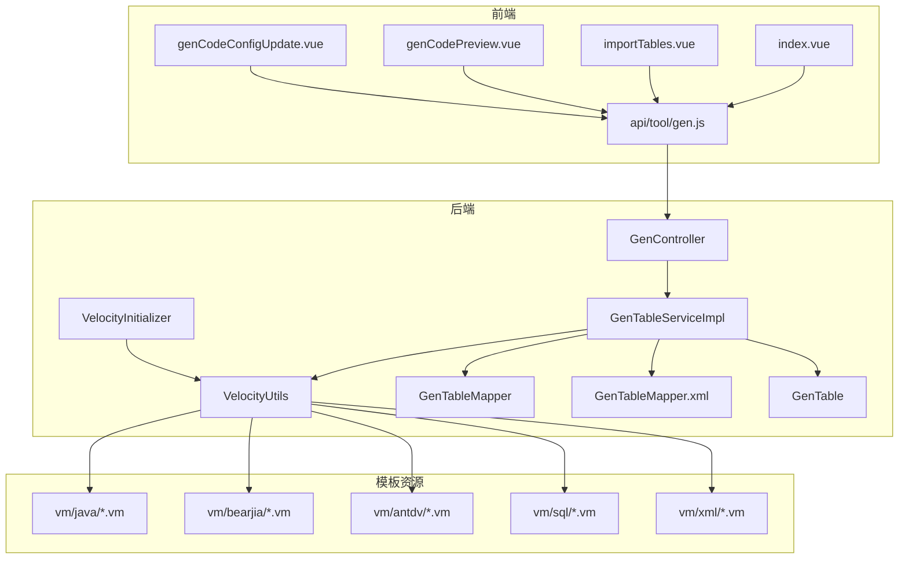
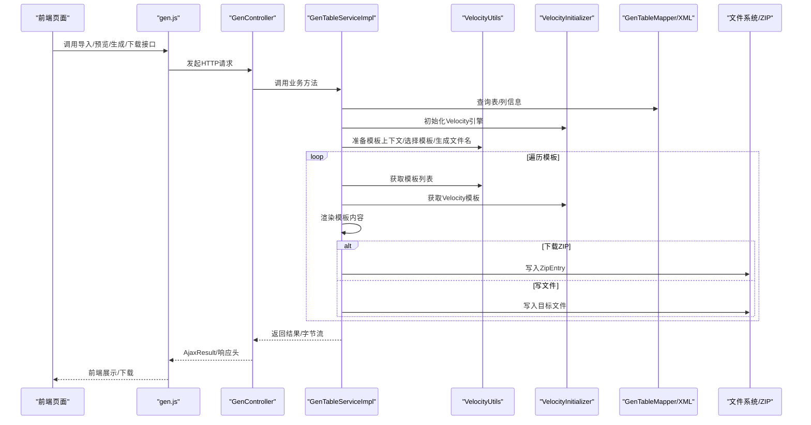
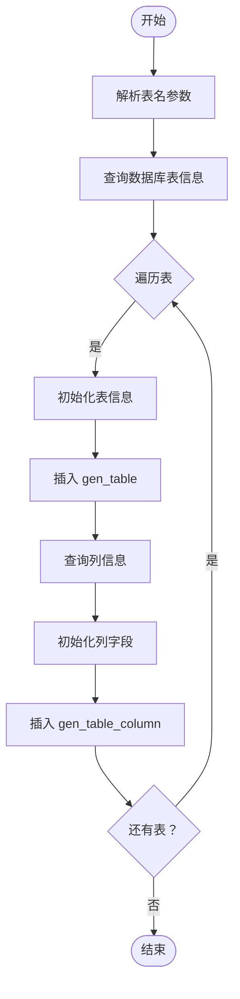
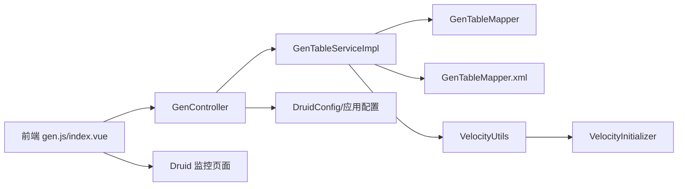
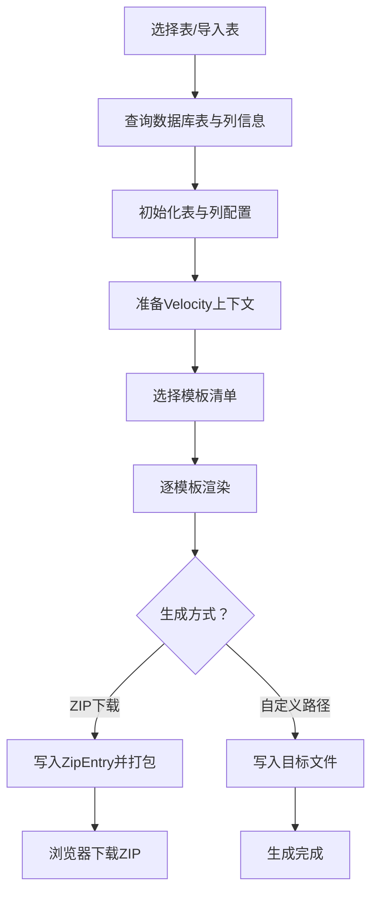

# 系统工具模块

<cite>
**本文引用的文件**
- [GenController.java](file://bearjia-admin-backend/src/main/java/com/javaxiaobear/module/tool/gen/controller/GenController.java)
- [GenTableServiceImpl.java](file://bearjia-admin-backend/src/main/java/com/javaxiaobear/module/tool/gen/service/GenTableServiceImpl.java)
- [VelocityUtils.java](file://bearjia-admin-backend/src/main/java/com/javaxiaobear/module/tool/gen/util/VelocityUtils.java)
- [VelocityInitializer.java](file://bearjia-admin-backend/src/main/java/com/javaxiaobear/module/tool/gen/util/VelocityInitializer.java)
- [GenTable.java](file://bearjia-admin-backend/src/main/java/com/javaxiaobear/module/tool/gen/domain/GenTable.java)
- [GenTableMapper.java](file://bearjia-admin-backend/src/main/java/com/javaxiaobear/module/tool/gen/mapper/GenTableMapper.java)
- [GenTableMapper.xml](file://bearjia-admin-backend/src/main/resources/mybatis/tool/GenTableMapper.xml)
- [gen.js](file://bearjia-admin-backend/src/main/resources/sql/bear_jia.sql)
- [gen.js](file://bear-jia-vue3/src/api/tool/gen.js)
- [index.vue](file://bear-jia-vue3/src/views/tool/gen/index.vue)
- [importTables.vue](file://bear-jia-vue3/src/views/tool/gen/importTables.vue)
- [genCodePreview.vue](file://bear-jia-vue3/src/views/tool/gen/genCodePreview.vue)
- [genCodeConfigUpdate.vue](file://bear-jia-vue3/src/views/tool/gen/genCodeConfigUpdate.vue)
- [application.yml](file://bearjia-admin-backend/src/main/resources/application.yml)
- [application-druid.yml](file://bearjia-admin-backend/src/main/resources/application-druid.yml)
- [DruidConfig.java](file://bearjia-admin-backend/src/main/java/com/javaxiaobear/base/framework/config/DruidConfig.java)
- [index.vue](file://bear-jia-vue3/src/views/monitor/druid/index.vue)
- [ruoyi-usage.md](file://bear-jia-vue3/docs/ruoyi-usage.md)
</cite>

## 目录
1. [简介](#简介)
2. [项目结构](#项目结构)
3. [核心组件](#核心组件)
4. [架构总览](#架构总览)
5. [详细组件分析](#详细组件分析)
6. [依赖分析](#依赖分析)
7. [性能考虑](#性能考虑)
8. [故障排查指南](#故障排查指南)
9. [结论](#结论)
10. [附录](#附录)

## 简介
本文件系统性梳理“系统工具模块”的代码生成器工作原理与扩展机制，围绕后端控制器、服务层、Velocity 模板引擎、前端交互与数据库映射展开，重点覆盖如下主题：
- 表结构导入：importTableSave 如何解析数据库元数据并初始化生成配置
- 代码预览：previewCode 的模板上下文准备与渲染流程
- 批量生成：downloadCode/batchGenCode 的打包下载流程
- Velocity 模板引擎集成：VelocityInitializer 与 VelocityUtils 的协作
- GenTable 实体：表结构信息、生成配置参数（作者、模块名、业务名）、字段映射关系
- 自定义模板开发：如何修改现有模板或新增模板类型
- 性能优化：大表处理、模板缓存、并发控制与 I/O 优化
- 模块集成：与 Swagger 文档、Druid 监控的集成方式

## 项目结构
系统工具模块由“后端控制器 + 服务层 + 模板工具 + 前端页面 + 模板资源”构成，前后端通过 REST API 交互，模板资源位于后端 classpath 下的 vm 目录。

图表来源
- [GenController.java](file://bearjia-admin-backend/src/main/java/com/javaxiaobear/module/tool/gen/controller/GenController.java#L1-L258)
- [GenTableServiceImpl.java](file://bearjia-admin-backend/src/main/java/com/javaxiaobear/module/tool/gen/service/GenTableServiceImpl.java#L1-L554)
- [VelocityUtils.java](file://bearjia-admin-backend/src/main/java/com/javaxiaobear/module/tool/gen/util/VelocityUtils.java#L1-L497)
- [VelocityInitializer.java](file://bearjia-admin-backend/src/main/java/com/javaxiaobear/module/tool/gen/util/VelocityInitializer.java#L1-L34)
- [GenTableMapper.java](file://bearjia-admin-backend/src/main/java/com/javaxiaobear/module/tool/gen/mapper/GenTableMapper.java#L1-L91)
- [GenTableMapper.xml](file://bearjia-admin-backend/src/main/resources/mybatis/tool/GenTableMapper.xml#L23-L146)
- [GenTable.java](file://bearjia-admin-backend/src/main/java/com/javaxiaobear/module/tool/gen/domain/GenTable.java#L1-L385)
- [gen.js](file://bear-jia-vue3/src/api/tool/gen.js#L1-L93)
- [index.vue](file://bear-jia-vue3/src/views/tool/gen/index.vue#L261-L301)
- [importTables.vue](file://bear-jia-vue3/src/views/tool/gen/importTables.vue#L1-L203)
- [genCodePreview.vue](file://bear-jia-vue3/src/views/tool/gen/genCodePreview.vue#L1-L300)
- [genCodeConfigUpdate.vue](file://bear-jia-vue3/src/views/tool/gen/genCodeConfigUpdate.vue#L1-L516)

章节来源
- [GenController.java](file://bearjia-admin-backend/src/main/java/com/javaxiaobear/module/tool/gen/controller/GenController.java#L1-L258)
- [GenTableServiceImpl.java](file://bearjia-admin-backend/src/main/java/com/javaxiaobear/module/tool/gen/service/GenTableServiceImpl.java#L1-L554)
- [VelocityUtils.java](file://bearjia-admin-backend/src/main/java/com/javaxiaobear/module/tool/gen/util/VelocityUtils.java#L1-L497)
- [VelocityInitializer.java](file://bearjia-admin-backend/src/main/java/com/javaxiaobear/module/tool/gen/util/VelocityInitializer.java#L1-L34)
- [GenTableMapper.java](file://bearjia-admin-backend/src/main/java/com/javaxiaobear/module/tool/gen/mapper/GenTableMapper.java#L1-L91)
- [GenTableMapper.xml](file://bearjia-admin-backend/src/main/resources/mybatis/tool/GenTableMapper.xml#L23-L146)
- [GenTable.java](file://bearjia-admin-backend/src/main/java/com/javaxiaobear/module/tool/gen/domain/GenTable.java#L1-L385)
- [gen.js](file://bear-jia-vue3/src/api/tool/gen.js#L1-L93)
- [index.vue](file://bear-jia-vue3/src/views/tool/gen/index.vue#L261-L301)
- [importTables.vue](file://bear-jia-vue3/src/views/tool/gen/importTables.vue#L1-L203)
- [genCodePreview.vue](file://bear-jia-vue3/src/views/tool/gen/genCodePreview.vue#L1-L300)
- [genCodeConfigUpdate.vue](file://bear-jia-vue3/src/views/tool/gen/genCodeConfigUpdate.vue#L1-L516)

## 核心组件
- GenController：提供代码生成的 REST 接口，包括导入表、预览、生成、下载、批量生成、同步数据库等。
- GenTableServiceImpl：核心业务实现，负责表结构导入、预览渲染、模板渲染与打包下载、同步数据库、参数校验等。
- VelocityUtils：模板上下文准备、模板选择、文件名生成、导入包与字典处理、权限前缀等。
- VelocityInitializer：Velocity 引擎初始化，确保模板加载与编码正确。
- GenTable：表结构与生成配置的载体，包含模板类别、前端模板类型、包名、模块名、业务名、作者、生成路径、主键列、子表、列集合、其他选项等。
- GenTableMapper/GenTableMapper.xml：数据库访问层，提供表与列的查询、插入、更新、删除等。
- 前端 gen.js、index.vue、importTables.vue、genCodePreview.vue、genCodeConfigUpdate.vue：前端 API 封装与页面交互。

章节来源
- [GenController.java](file://bearjia-admin-backend/src/main/java/com/javaxiaobear/module/tool/gen/controller/GenController.java#L53-L258)
- [GenTableServiceImpl.java](file://bearjia-admin-backend/src/main/java/com/javaxiaobear/module/tool/gen/service/GenTableServiceImpl.java#L1-L554)
- [VelocityUtils.java](file://bearjia-admin-backend/src/main/java/com/javaxiaobear/module/tool/gen/util/VelocityUtils.java#L1-L497)
- [VelocityInitializer.java](file://bearjia-admin-backend/src/main/java/com/javaxiaobear/module/tool/gen/util/VelocityInitializer.java#L1-L34)
- [GenTable.java](file://bearjia-admin-backend/src/main/java/com/javaxiaobear/module/tool/gen/domain/GenTable.java#L1-L385)
- [GenTableMapper.java](file://bearjia-admin-backend/src/main/java/com/javaxiaobear/module/tool/gen/mapper/GenTableMapper.java#L1-L91)
- [GenTableMapper.xml](file://bearjia-admin-backend/src/main/resources/mybatis/tool/GenTableMapper.xml#L23-L146)
- [gen.js](file://bear-jia-vue3/src/api/tool/gen.js#L1-L93)
- [index.vue](file://bear-jia-vue3/src/views/tool/gen/index.vue#L261-L301)
- [importTables.vue](file://bear-jia-vue3/src/views/tool/gen/importTables.vue#L1-L203)
- [genCodePreview.vue](file://bear-jia-vue3/src/views/tool/gen/genCodePreview.vue#L1-L300)
- [genCodeConfigUpdate.vue](file://bear-jia-vue3/src/views/tool/gen/genCodeConfigUpdate.vue#L1-L516)

## 架构总览
后端采用 MVC 分层：控制器接收前端请求，服务层组织业务流程，模板工具负责上下文与文件名生成，Velocity 引擎渲染模板，最终以 ZIP 或直接写文件的方式输出代码。前端通过统一 API 封装调用后端接口，并提供导入、预览、配置修改、批量生成等功能。

图表来源
- [GenController.java](file://bearjia-admin-backend/src/main/java/com/javaxiaobear/module/tool/gen/controller/GenController.java#L108-L258)
- [GenTableServiceImpl.java](file://bearjia-admin-backend/src/main/java/com/javaxiaobear/module/tool/gen/service/GenTableServiceImpl.java#L196-L554)
- [VelocityUtils.java](file://bearjia-admin-backend/src/main/java/com/javaxiaobear/module/tool/gen/util/VelocityUtils.java#L36-L168)
- [VelocityInitializer.java](file://bearjia-admin-backend/src/main/java/com/javaxiaobear/module/tool/gen/util/VelocityInitializer.java#L17-L33)
- [GenTableMapper.java](file://bearjia-admin-backend/src/main/java/com/javaxiaobear/module/tool/gen/mapper/GenTableMapper.java#L1-L91)
- [GenTableMapper.xml](file://bearjia-admin-backend/src/main/resources/mybatis/tool/GenTableMapper.xml#L23-L146)
- [gen.js](file://bear-jia-vue3/src/api/tool/gen.js#L1-L93)

## 详细组件分析

### GenController：接口与控制流
- 列表查询、详情、数据库表列表、字段列表、导入表、创建表、预览、生成、下载、批量生成、同步数据库、删除等接口均在该控制器中实现。
- 权限注解保证接口安全；日志注解记录操作类型；下载接口通过响应头设置文件名与类型，实现浏览器下载。

关键接口路径与用途
- GET /tool/gen/list：查询代码生成列表
- GET /tool/gen/db/list：查询数据库表列表
- GET /tool/gen/column/{tableId}：查询表字段列表
- POST /tool/gen/importTable：导入表结构（保存）
- POST /tool/gen/createTable：创建表结构（保存）
- GET /tool/gen/preview/{tableId}：预览代码
- GET /tool/gen/download/{tableName}：下载ZIP
- GET /tool/gen/genCode/{tableName}：生成到自定义路径
- GET /tool/gen/batchGenCode：批量生成ZIP
- GET /tool/gen/synchDb/{tableName}：同步数据库
- PUT /tool/gen：修改保存代码生成业务
- DELETE /tool/gen/{tableIds}：删除代码生成

章节来源
- [GenController.java](file://bearjia-admin-backend/src/main/java/com/javaxiaobear/module/tool/gen/controller/GenController.java#L53-L258)
- [gen.js](file://bear-jia-vue3/src/api/tool/gen.js#L1-L93)

### GenTableServiceImpl：业务实现与流程
- importGenTable：遍历导入表，初始化表与列，写入 gen_table 与 gen_table_column。
- previewCode：准备上下文、选择模板、逐模板渲染，返回模板名到内容的映射。
- generatorCode：按模板渲染并写入文件（自定义路径）。
- downloadCode：按模板渲染并打包为 ZIP。
- synchDb：对比数据库列与本地配置，保留必要选项并更新或删除列。
- setPkColumn/setSubTable：设置主键列与子表信息。
- setTableFromOptions：从 options 中恢复树/菜单等配置。

章节来源
- [GenTableServiceImpl.java](file://bearjia-admin-backend/src/main/java/com/javaxiaobear/module/tool/gen/service/GenTableServiceImpl.java#L162-L554)

### VelocityUtils：模板上下文与文件名生成
- prepareContext：注入模板变量（表名、类名、模块名、业务名、作者、时间、导入包、权限前缀、列集合、字典、菜单、树/子表上下文）。
- getTemplateList：根据模板类别与前端模板类型返回模板清单（Java、Vue、Antdv、SQL、XML）。
- getFileName：根据模板与表配置生成目标文件路径与文件名，避免重复。
- getImportList/getDicts/getPermissionPrefix：辅助生成导入包、字典列表、权限前缀。
- 树/子表上下文：getParentMenuId/getTreecode/getTreeParentCode/getTreeName/getExpandColumn。

章节来源
- [VelocityUtils.java](file://bearjia-admin-backend/src/main/java/com/javaxiaobear/module/tool/gen/util/VelocityUtils.java#L36-L496)

### VelocityInitializer：引擎初始化
- 初始化 Velocity 引擎，设置资源加载器与输入编码，确保模板读取与渲染稳定。

章节来源
- [VelocityInitializer.java](file://bearjia-admin-backend/src/main/java/com/javaxiaobear/module/tool/gen/util/VelocityInitializer.java#L17-L33)

### GenTable：表结构与生成配置
- 字段：表名、表注释、类名、模板类别（crud/tree/sub）、前端模板类型、包名、模块名、业务名、功能名、作者、生成方式、生成路径、主键列、子表、列集合、其他选项（树编码、父编码、名称、上级菜单等）。
- 辅助方法：判断是否树/子/单表、是否基类字段等。

章节来源
- [GenTable.java](file://bearjia-admin-backend/src/main/java/com/javaxiaobear/module/tool/gen/domain/GenTable.java#L1-L385)

### 数据访问层：GenTableMapper 与 XML
- 提供查询业务列表、数据库表列表、按名称查询、插入/更新/删除、创建表等能力。
- XML 映射中定义了 GenTable 与 GenTableColumn 的关联映射，支持按表名查询并按列排序。

章节来源
- [GenTableMapper.java](file://bearjia-admin-backend/src/main/java/com/javaxiaobear/module/tool/gen/mapper/GenTableMapper.java#L1-L91)
- [GenTableMapper.xml](file://bearjia-admin-backend/src/main/resources/mybatis/tool/GenTableMapper.xml#L23-L146)

### 前端交互：导入、预览、配置、批量生成
- importTables.vue：查询数据库表、勾选导入。
- genCodeConfigUpdate.vue：修改生成配置（模板类别、前端模板类型、包名、模块名、业务名、作者、生成方式、生成路径、字段映射等）。
- genCodePreview.vue：预览模板渲染结果，支持复制与单文件下载。
- index.vue：批量生成入口，调用后端批量生成接口并下载 ZIP。

章节来源
- [importTables.vue](file://bear-jia-vue3/src/views/tool/gen/importTables.vue#L1-L203)
- [genCodeConfigUpdate.vue](file://bear-jia-vue3/src/views/tool/gen/genCodeConfigUpdate.vue#L1-L516)
- [genCodePreview.vue](file://bear-jia-vue3/src/views/tool/gen/genCodePreview.vue#L1-L300)
- [index.vue](file://bear-jia-vue3/src/views/tool/gen/index.vue#L261-L301)
- [gen.js](file://bear-jia-vue3/src/api/tool/gen.js#L1-L93)

### importTableSave：导入表结构与生成配置初始化
- 参数：tables（逗号分隔的表名字符串）
- 流程：
  1) Convert.toStrArray 解析表名
  2) 通过 IGenTableService.selectDbTableListByNames 查询数据库表信息
  3) 调用 importGenTable(tableList, operName) 完成导入
- importGenTable：
  1) 遍历表，调用 GenUtils.initTable 初始化表信息（含创建人等）
  2) 插入 gen_table
  3) 查询对应列信息，调用 GenUtils.initColumnField 初始化列字段
  4) 插入 gen_table_column

图表来源
- [GenController.java](file://bearjia-admin-backend/src/main/java/com/javaxiaobear/module/tool/gen/controller/GenController.java#L108-L121)
- [GenTableServiceImpl.java](file://bearjia-admin-backend/src/main/java/com/javaxiaobear/module/tool/gen/service/GenTableServiceImpl.java#L162-L194)

章节来源
- [GenController.java](file://bearjia-admin-backend/src/main/java/com/javaxiaobear/module/tool/gen/controller/GenController.java#L108-L121)
- [GenTableServiceImpl.java](file://bearjia-admin-backend/src/main/java/com/javaxiaobear/module/tool/gen/service/GenTableServiceImpl.java#L162-L194)

### 代码预览：prepareContext 与模板渲染
- 步骤：
  1) 查询表与列信息，设置主子表与主键列
  2) 初始化 Velocity 引擎
  3) prepareContext 构建上下文（表、类、模块、业务、作者、时间、导入包、权限前缀、字典、菜单、树/子表上下文）
  4) getTemplateList 选择模板清单
  5) 逐模板 Velocity.getTemplate + merge 输出到 Map

章节来源
- [GenTableServiceImpl.java](file://bearjia-admin-backend/src/main/java/com/javaxiaobear/module/tool/gen/service/GenTableServiceImpl.java#L196-L227)
- [VelocityUtils.java](file://bearjia-admin-backend/src/main/java/com/javaxiaobear/module/tool/gen/util/VelocityUtils.java#L36-L168)

### 批量生成：ZIP 打包与文件名冲突处理
- downloadCode(String[])：对每个表执行 generatorCode 并写入 ZipOutputStream
- generatorCode(String, ZipOutputStream)：
  1) 查询表与列，设置主子表与主键列
  2) 初始化 Velocity 引擎
  3) 逐模板渲染，getFileName 计算目标文件名
  4) 使用 Set 记录已出现的文件名，若重复则追加模板路径后缀
  5) 写入 ZipEntry 并 flush/close

章节来源
- [GenTableServiceImpl.java](file://bearjia-admin-backend/src/main/java/com/javaxiaobear/module/tool/gen/service/GenTableServiceImpl.java#L342-L424)

### Velocity 模板引擎集成与模板类型
- 模板资源位置：vm/java、vm/bearjia、vm/antdv、vm/js、vm/sql、vm/xml
- 模板选择策略：
  - Java：domain.java.vm、mapper.java.vm、service.java.vm、serviceImpl.java.vm、controller.java.vm、mapper.xml.vm、sql.vm
  - Vue：index.vue.vm、detailModal.vue.vm、addUpdateModal.vue.vm、api.js.vm
  - Antdv：index.vue.vm、CreateForm.vue.vm、CreateFormVue3.vue.vm、SubTable.vue.vm、CreateSubForm.vue.vm、api.js.vm
- 文件名生成规则：根据模板类型与表配置生成 Java/Vue/JS/SQL 文件路径，避免重复文件名

章节来源
- [VelocityUtils.java](file://bearjia-admin-backend/src/main/java/com/javaxiaobear/module/tool/gen/util/VelocityUtils.java#L130-L330)
- [ruoyi-usage.md](file://bear-jia-vue3/docs/ruoyi-usage.md#L182-L258)

### GenTable 实体：字段映射与生成参数
- 生成参数：tplCategory、tplWebType、packageName、moduleName、businessName、functionName、functionAuthor、genType、genPath、options
- 字段映射：columns（GenTableColumn 列表），包含列名、类型、Java 类型、Java 字段、是否主键/自增/必填/插入/编辑/列表/查询/查询方式/HTML 类型/字典类型/排序等
- 树/子表：treeCode、treeParentCode、treeName、subTableName、subTableFkName、subTable（GenTable）

章节来源
- [GenTable.java](file://bearjia-admin-backend/src/main/java/com/javaxiaobear/module/tool/gen/domain/GenTable.java#L1-L385)
- [GenTableMapper.xml](file://bearjia-admin-backend/src/main/resources/mybatis/tool/GenTableMapper.xml#L23-L55)

### 同步数据库：列差异处理
- 读取数据库列，逐列初始化字段
- 若列存在于本地：保留列表/查询方式/字典类型、必填/显示类型等选项
- 若列不存在于本地：插入新列
- 若本地存在但数据库不存在：删除本地列

章节来源
- [GenTableServiceImpl.java](file://bearjia-admin-backend/src/main/java/com/javaxiaobear/module/tool/gen/service/GenTableServiceImpl.java#L288-L340)

## 依赖分析
- 组件耦合：
  - GenController 依赖 IGenTableService 与 IGenTableColumnService
  - GenTableServiceImpl 依赖 GenTableMapper、GenTableColumnMapper、VelocityInitializer、VelocityUtils
  - VelocityUtils 依赖 GenTable、GenTableColumn、GenConstants
  - 前端 gen.js 依赖后端 /tool/gen 下各接口
- 外部依赖：
  - Velocity 引擎（模板渲染）
  - Druid（数据库监控）
  - MyBatis（数据库映射）
  - Spring Security（权限控制）

图表来源
- [GenController.java](file://bearjia-admin-backend/src/main/java/com/javaxiaobear/module/tool/gen/controller/GenController.java#L1-L258)
- [GenTableServiceImpl.java](file://bearjia-admin-backend/src/main/java/com/javaxiaobear/module/tool/gen/service/GenTableServiceImpl.java#L1-L554)
- [VelocityUtils.java](file://bearjia-admin-backend/src/main/java/com/javaxiaobear/module/tool/gen/util/VelocityUtils.java#L1-L497)
- [VelocityInitializer.java](file://bearjia-admin-backend/src/main/java/com/javaxiaobear/module/tool/gen/util/VelocityInitializer.java#L1-L34)
- [GenTableMapper.java](file://bearjia-admin-backend/src/main/java/com/javaxiaobear/module/tool/gen/mapper/GenTableMapper.java#L1-L91)
- [GenTableMapper.xml](file://bearjia-admin-backend/src/main/resources/mybatis/tool/GenTableMapper.xml#L23-L146)
- [index.vue](file://bear-jia-vue3/src/views/monitor/druid/index.vue#L1-L108)
- [DruidConfig.java](file://bearjia-admin-backend/src/main/java/com/javaxiaobear/base/framework/config/DruidConfig.java#L62-L98)
- [application-druid.yml](file://bearjia-admin-backend/src/main/resources/application-druid.yml#L32-L63)

章节来源
- [GenController.java](file://bearjia-admin-backend/src/main/java/com/javaxiaobear/module/tool/gen/controller/GenController.java#L1-L258)
- [GenTableServiceImpl.java](file://bearjia-admin-backend/src/main/java/com/javaxiaobear/module/tool/gen/service/GenTableServiceImpl.java#L1-L554)
- [VelocityUtils.java](file://bearjia-admin-backend/src/main/java/com/javaxiaobear/module/tool/gen/util/VelocityUtils.java#L1-L497)
- [VelocityInitializer.java](file://bearjia-admin-backend/src/main/java/com/javaxiaobear/module/tool/gen/util/VelocityInitializer.java#L1-L34)
- [GenTableMapper.java](file://bearjia-admin-backend/src/main/java/com/javaxiaobear/module/tool/gen/mapper/GenTableMapper.java#L1-L91)
- [GenTableMapper.xml](file://bearjia-admin-backend/src/main/resources/mybatis/tool/GenTableMapper.xml#L23-L146)
- [index.vue](file://bear-jia-vue3/src/views/monitor/druid/index.vue#L1-L108)
- [DruidConfig.java](file://bearjia-admin-backend/src/main/java/com/javaxiaobear/base/framework/config/DruidConfig.java#L62-L98)
- [application-druid.yml](file://bearjia-admin-backend/src/main/resources/application-druid.yml#L32-L63)

## 性能考虑
- 大表处理：
  - 预览与批量生成采用逐模板渲染，建议在前端分批选择表，避免一次性渲染过多模板导致内存压力。
  - ZIP 打包阶段注意文件名冲突检测与去重，减少重复写入。
- 模板缓存：
  - Velocity 模板加载与合并建议在服务启动时预热，或在高频场景下缓存常用模板上下文。
- I/O 优化：
  - 写文件与 ZIP 输出使用缓冲流与及时 flush/close，避免长时间占用磁盘。
- 并发控制：
  - 批量生成与下载接口应限制并发数量，避免磁盘与网络拥塞。
- 数据库访问：
  - MyBatis 映射中使用 LEFT JOIN 与排序，确保列顺序一致；对大数据量表建议分页查询列信息。

[本节为通用指导，无需特定文件引用]

## 故障排查指南
- 导入失败：
  - 检查表是否存在、权限是否足够、导入参数是否为空
  - 查看服务层异常抛出与日志
- 预览为空：
  - 确认模板选择是否正确、上下文是否完整（主键列、子表、树/菜单选项）
- 生成失败：
  - 检查模板路径与文件名生成规则，避免重复文件名导致覆盖
  - 校验生成路径权限与磁盘空间
- 下载失败：
  - 检查响应头设置与浏览器下载行为
- Druid 监控无法访问：
  - 检查后端是否启用 Druid、白名单配置、登录凭据、网络连通性

章节来源
- [GenTableServiceImpl.java](file://bearjia-admin-backend/src/main/java/com/javaxiaobear/module/tool/gen/service/GenTableServiceImpl.java#L196-L554)
- [GenController.java](file://bearjia-admin-backend/src/main/java/com/javaxiaobear/module/tool/gen/controller/GenController.java#L196-L258)
- [index.vue](file://bear-jia-vue3/src/views/monitor/druid/index.vue#L1-L108)
- [application-druid.yml](file://bearjia-admin-backend/src/main/resources/application-druid.yml#L32-L63)

## 结论
系统工具模块通过清晰的分层设计与 Velocity 模板引擎，实现了从数据库表结构导入、配置初始化、模板上下文构建、模板渲染到文件输出的完整链路。前端提供导入、预览、配置修改与批量生成等能力，后端提供安全、可扩展的代码生成服务。通过合理的性能优化与故障排查策略，可在复杂项目中高效稳定地完成代码生成任务。

[本节为总结性内容，无需特定文件引用]

## 附录

### 自定义模板开发指南
- 新增模板类型步骤：
  1) 在 vm 目录下新增模板文件（如 vm/custom/xxx.vm）
  2) 在 VelocityUtils.getTemplateList 中添加模板路径
  3) 在 VelocityUtils.getFileName 中补充文件名生成规则，避免重复
  4) 若涉及 Java/Vue/JS/SQL/XML，分别在对应目录下维护模板
  5) 在前端页面（如 genCodeConfigUpdate.vue）增加模板类别/前端模板类型选项
- 修改现有模板：
  - 参考 ruoyi-usage.md 中的模板修改示例，调整模板列表与文件名生成逻辑
  - 保持模板变量与上下文一致，确保渲染结果符合预期

章节来源
- [VelocityUtils.java](file://bearjia-admin-backend/src/main/java/com/javaxiaobear/module/tool/gen/util/VelocityUtils.java#L130-L330)
- [ruoyi-usage.md](file://bear-jia-vue3/docs/ruoyi-usage.md#L182-L258)
- [genCodeConfigUpdate.vue](file://bear-jia-vue3/src/views/tool/gen/genCodeConfigUpdate.vue#L342-L353)

### 代码生成流程图（从数据库表解析到文件打包下载）

图表来源
- [GenTableServiceImpl.java](file://bearjia-admin-backend/src/main/java/com/javaxiaobear/module/tool/gen/service/GenTableServiceImpl.java#L236-L424)
- [VelocityUtils.java](file://bearjia-admin-backend/src/main/java/com/javaxiaobear/module/tool/gen/util/VelocityUtils.java#L36-L168)
- [GenController.java](file://bearjia-admin-backend/src/main/java/com/javaxiaobear/module/tool/gen/controller/GenController.java#L196-L258)

### 模块集成：Swagger 与 Druid
- Swagger：项目未在仓库中发现显式 Swagger 配置文件，建议在后端引入 Swagger 依赖并在 GenController 上标注接口文档注解，以便统一生成 API 文档。
- Druid：后端启用 Druid 监控，前端通过 iframe 加载 /druid/index.html，DruidConfig 去除底部广告并配置白名单与登录凭据。

章节来源
- [index.vue](file://bear-jia-vue3/src/views/monitor/druid/index.vue#L1-L108)
- [DruidConfig.java](file://bearjia-admin-backend/src/main/java/com/javaxiaobear/base/framework/config/DruidConfig.java#L62-L98)
- [application-druid.yml](file://bearjia-admin-backend/src/main/resources/application-druid.yml#L32-L63)