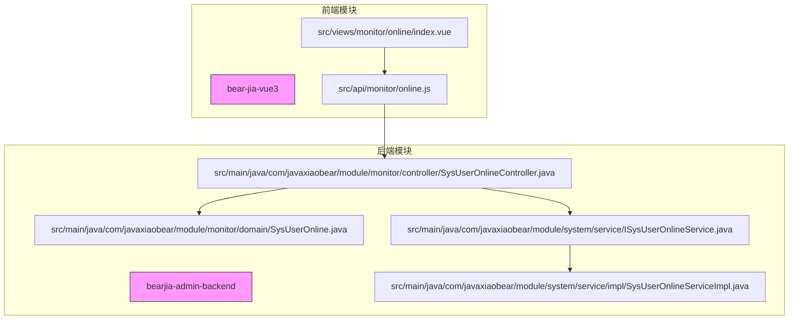
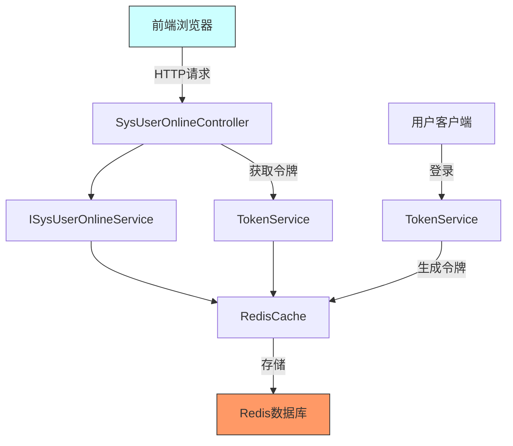
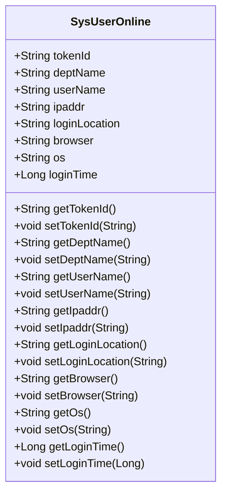
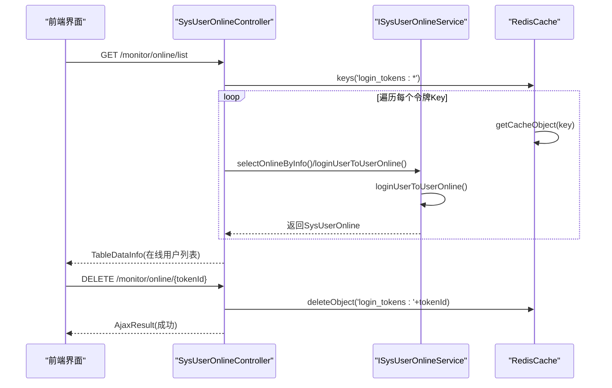
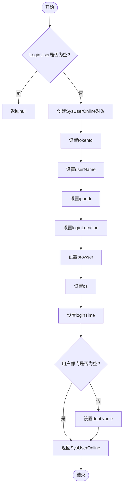
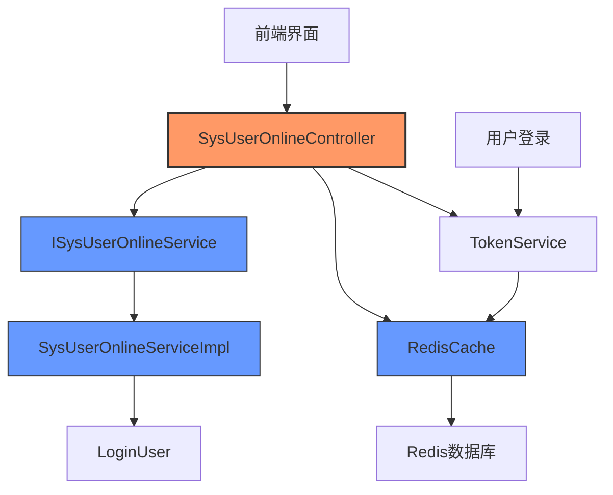

# 在线用户

<cite>
**本文档引用的文件**   
- [SysUserOnlineController.java](file://bearjia-admin-backend/src/main/java/com/javaxiaobear/module/monitor/controller/SysUserOnlineController.java)
- [SysUserOnline.java](file://bearjia-admin-backend/src/main/java/com/javaxiaobear/module/monitor/domain/SysUserOnline.java)
- [ISysUserOnlineService.java](file://bearjia-admin-backend/src/main/java/com/javaxiaobear/module/system/service/ISysUserOnlineService.java)
- [SysUserOnlineServiceImpl.java](file://bearjia-admin-backend/src/main/java/com/javaxiaobear/module/system/service/impl/SysUserOnlineServiceImpl.java)
- [TokenService.java](file://bearjia-admin-backend/src/main/java/com/javaxiaobear/base/framework/security/service/TokenService.java)
- [CacheConstants.java](file://bearjia-admin-backend/src/main/java/com/javaxiaobear/base/common/constant/CacheConstants.java)
- [online.js](file://bear-jia-vue3/src/api/monitor/online.js)
- [index.vue](file://bear-jia-vue3/src/views/monitor/online/index.vue)
</cite>

## 目录
1. [简介](#简介)
2. [项目结构](#项目结构)
3. [核心组件](#核心组件)
4. [架构概述](#架构概述)
5. [详细组件分析](#详细组件分析)
6. [依赖分析](#依赖分析)
7. [性能考虑](#性能考虑)
8. [故障排除指南](#故障排除指南)
9. [结论](#结论)

## 简介
本文档全面解析了基于Redis的在线用户监控功能，重点阐述了用户会话管理机制。系统通过Redis存储用户登录令牌，实现了对所有在线用户会话的实时监控。管理员可以通过/list接口查询在线用户列表，并支持按IP地址和用户名进行过滤。系统提供了强退用户功能，通过删除Redis中的登录令牌Key来强制使会话失效。该功能与系统安全紧密关联，可用于异常登录检测和会话并发控制等安全审计场景。

## 项目结构
在线用户监控功能分布在前后端两个主要模块中：后端服务模块和前端展示模块。后端服务位于`bearjia-admin-backend`项目中，主要包含控制器、服务层和领域模型；前端展示位于`bear-jia-vue3`项目中，包含API接口定义和视图组件。

**图表来源**
- [SysUserOnlineController.java](file://bearjia-admin-backend/src/main/java/com/javaxiaobear/module/monitor/controller/SysUserOnlineController.java)
- [online.js](file://bear-jia-vue3/src/api/monitor/online.js)
- [index.vue](file://bear-jia-vue3/src/views/monitor/online/index.vue)

**章节来源**
- [SysUserOnlineController.java](file://bearjia-admin-backend/src/main/java/com/javaxiaobear/module/monitor/controller/SysUserOnlineController.java)
- [online.js](file://bear-jia-vue3/src/api/monitor/online.js)

## 核心组件
在线用户监控功能的核心组件包括：`SysUserOnlineController`控制器负责处理HTTP请求；`ISysUserOnlineService`服务接口定义了在线用户查询的业务方法；`SysUserOnline`实体类封装了在线用户的会话信息；`TokenService`服务负责用户令牌的创建、验证和删除；`RedisCache`组件实现了基于Redis的会话存储。

**章节来源**
- [SysUserOnlineController.java](file://bearjia-admin-backend/src/main/java/com/javaxiaobear/module/monitor/controller/SysUserOnlineController.java)
- [ISysUserOnlineService.java](file://bearjia-admin-backend/src/main/java/com/javaxiaobear/module/system/service/ISysUserOnlineService.java)
- [SysUserOnline.java](file://bearjia-admin-backend/src/main/java/com/javaxiaobear/module/monitor/domain/SysUserOnline.java)

## 架构概述
在线用户监控功能采用前后端分离架构，后端基于Spring Boot框架实现RESTful API，前端使用Vue3框架进行数据展示。用户会话信息存储在Redis中，通过令牌机制实现会话管理。

**图表来源**
- [SysUserOnlineController.java](file://bearjia-admin-backend/src/main/java/com/javaxiaobear/module/monitor/controller/SysUserOnlineController.java)
- [TokenService.java](file://bearjia-admin-backend/src/main/java/com/javaxiaobear/base/framework/security/service/TokenService.java)
- [RedisCache.java](file://bearjia-admin-backend/src/main/java/com/javaxiaobear/base/framework/redis/RedisCache.java)

## 详细组件分析

### SysUserOnline实体类分析
`SysUserOnline`实体类定义了在线用户的会话信息结构，包括会话编号、用户名、IP地址、登录位置、浏览器类型、操作系统和登录时间等属性。

**图表来源**
- [SysUserOnline.java](file://bearjia-admin-backend/src/main/java/com/javaxiaobear/module/monitor/domain/SysUserOnline.java)

**章节来源**
- [SysUserOnline.java](file://bearjia-admin-backend/src/main/java/com/javaxiaobear/module/monitor/domain/SysUserOnline.java)

### SysUserOnlineController分析
`SysUserOnlineController`控制器提供了在线用户监控的RESTful接口，包括查询在线用户列表和强退用户两个主要功能。

#### 接口定义
| 接口路径 | HTTP方法 | 功能描述 | 权限要求 |
|---------|--------|--------|--------|
| /monitor/online/list | GET | 查询在线用户列表 | monitor:online:list |
| /monitor/online/{tokenId} | DELETE | 强退指定用户 | monitor:online:forceLogout |

**图表来源**
- [SysUserOnlineController.java](file://bearjia-admin-backend/src/main/java/com/javaxiaobear/module/monitor/controller/SysUserOnlineController.java)
- [ISysUserOnlineService.java](file://bearjia-admin-backend/src/main/java/com/javaxiaobear/module/system/service/ISysUserOnlineService.java)
- [RedisCache.java](file://bearjia-admin-backend/src/main/java/com/javaxiaobear/base/framework/redis/RedisCache.java)

**章节来源**
- [SysUserOnlineController.java](file://bearjia-admin-backend/src/main/java/com/javaxiaobear/module/monitor/controller/SysUserOnlineController.java)

### ISysUserOnlineService服务分析
`ISysUserOnlineService`服务接口及其实现类`SysUserOnlineServiceImpl`负责处理在线用户的业务逻辑，主要功能是将`LoginUser`安全上下文转换为可展示的在线用户信息。

**图表来源**
- [SysUserOnlineServiceImpl.java](file://bearjia-admin-backend/src/main/java/com/javaxiaobear/module/system/service/impl/SysUserOnlineServiceImpl.java)
- [SysUserOnline.java](file://bearjia-admin-backend/src/main/java/com/javaxiaobear/module/monitor/domain/SysUserOnline.java)

**章节来源**
- [SysUserOnlineServiceImpl.java](file://bearjia-admin-backend/src/main/java/com/javaxiaobear/module/system/service/impl/SysUserOnlineServiceImpl.java)

## 依赖分析
在线用户监控功能依赖于多个核心组件和服务，形成了一个完整的会话管理生态系统。

**图表来源**
- [SysUserOnlineController.java](file://bearjia-admin-backend/src/main/java/com/javaxiaobear/module/monitor/controller/SysUserOnlineController.java)
- [ISysUserOnlineService.java](file://bearjia-admin-backend/src/main/java/com/javaxiaobear/module/system/service/ISysUserOnlineService.java)
- [RedisCache.java](file://bearjia-admin-backend/src/main/java/com/javaxiaobear/base/framework/redis/RedisCache.java)
- [TokenService.java](file://bearjia-admin-backend/src/main/java/com/javaxiaobear/base/framework/security/service/TokenService.java)

**章节来源**
- [SysUserOnlineController.java](file://bearjia-admin-backend/src/main/java/com/javaxiaobear/module/monitor/controller/SysUserOnlineController.java)
- [ISysUserOnlineService.java](file://bearjia-admin-backend/src/main/java/com/javaxiaobear/module/system/service/ISysUserOnlineService.java)
- [TokenService.java](file://bearjia-admin-backend/src/main/java/com/javaxiaobear/base/framework/security/service/TokenService.java)

## 性能考虑
在线用户监控功能在性能方面有以下特点和优化措施：

1. **Redis高效查询**：使用Redis的keys操作配合通配符查询所有登录令牌，利用Redis的高性能特性确保查询效率。
2. **内存数据处理**：所有在线用户数据在内存中进行处理和排序，避免了数据库的频繁读写。
3. **缓存键设计**：采用`login_tokens:`作为前缀的键设计，便于批量操作和管理。
4. **数据过滤优化**：支持按IP地址和用户名进行过滤，减少不必要的数据传输和处理。
5. **列表反转处理**：对查询结果进行反转，确保最新的在线用户显示在最前面。

**章节来源**
- [SysUserOnlineController.java](file://bearjia-admin-backend/src/main/java/com/javaxiaobear/module/monitor/controller/SysUserOnlineController.java)
- [TokenService.java](file://bearjia-admin-backend/src/main/java/com/javaxiaobear/base/framework/security/service/TokenService.java)

## 故障排除指南
在使用在线用户监控功能时可能遇到的问题及解决方案：

1. **无法查询到在线用户**
   - 检查Redis服务是否正常运行
   - 确认`login_tokens:`前缀的键是否存在
   - 验证用户是否已成功登录并生成令牌

2. **强退用户功能无效**
   - 确认tokenId是否正确
   - 检查Redis中对应的键是否存在
   - 验证删除操作是否有权限

3. **会话信息不完整**
   - 检查`LoginUser`对象中的信息是否完整
   - 确认用户代理信息解析是否正常
   - 验证IP地址定位服务是否可用

4. **性能问题**
   - 当在线用户数量过多时，考虑分页查询
   - 监控Redis内存使用情况
   - 优化Redis配置以提高性能

**章节来源**
- [SysUserOnlineController.java](file://bearjia-admin-backend/src/main/java/com/javaxiaobear/module/monitor/controller/SysUserOnlineController.java)
- [SysUserOnlineServiceImpl.java](file://bearjia-admin-backend/src/main/java/com/javaxiaobear/module/system/service/impl/SysUserOnlineServiceImpl.java)
- [TokenService.java](file://bearjia-admin-backend/src/main/java/com/javaxiaobear/base/framework/security/service/TokenService.java)

## 结论
在线用户监控功能通过基于Redis的会话管理机制，实现了对系统所有在线用户的实时监控。该功能不仅提供了查询和强退等基本管理能力，还与系统安全紧密结合，为异常登录检测、会话并发控制等安全审计场景提供了有力支持。通过合理的架构设计和性能优化，该功能在保证安全性的同时也具有良好的性能表现，是系统安全管理的重要组成部分。