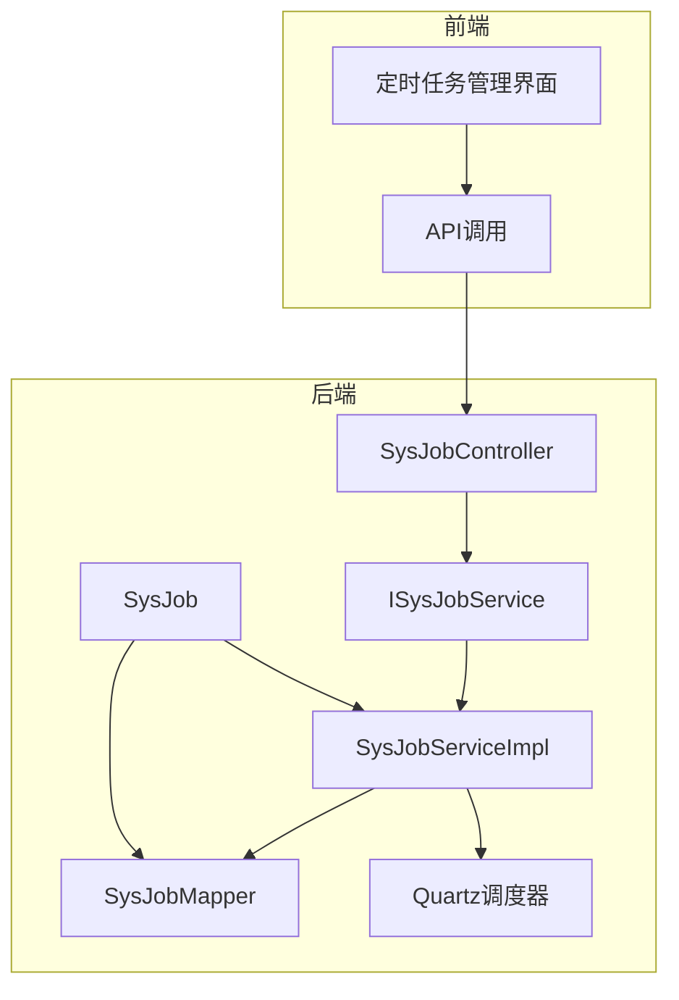
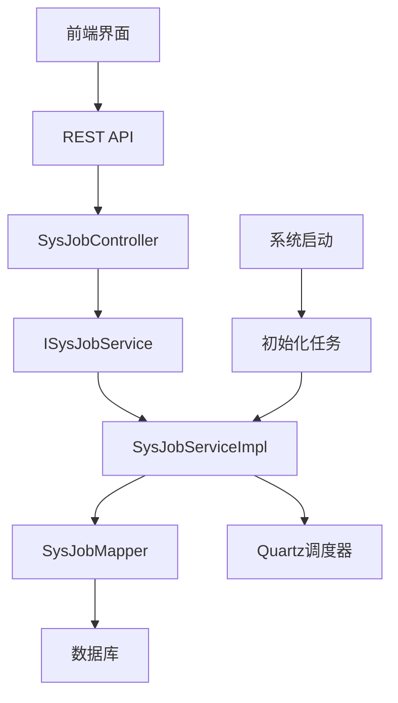
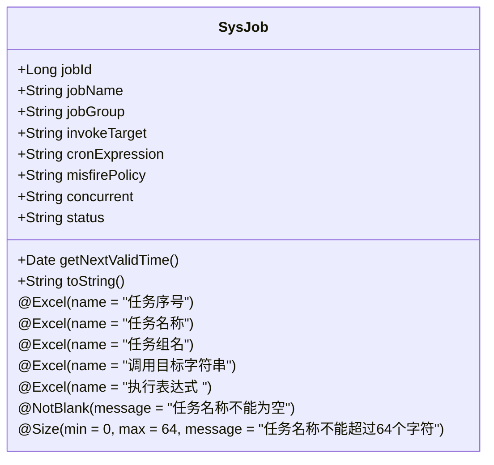
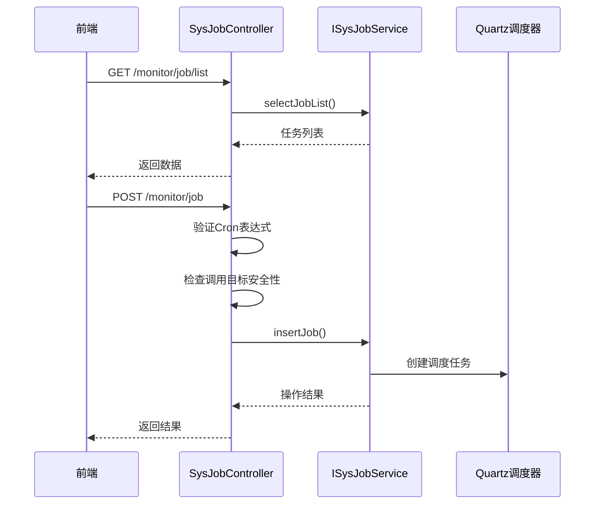
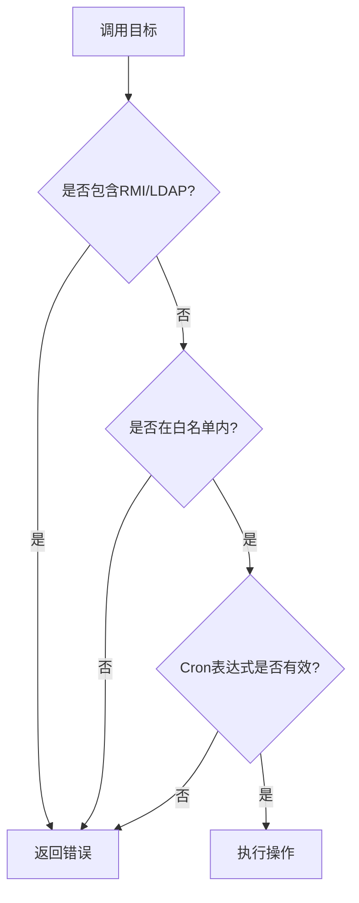
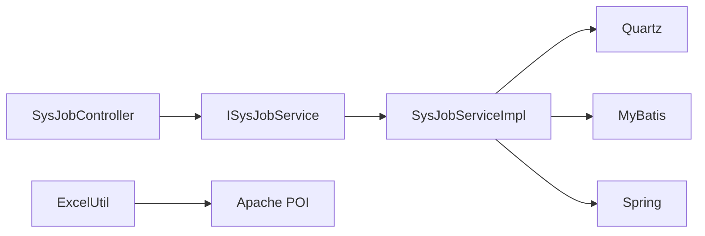

# 定时任务

<cite>
**本文档引用的文件**  
- [SysJob.java](file://bearjia-admin-backend\src\main\java\com\javaxiaobear\module\monitor\domain\SysJob.java)
- [SysJobController.java](file://bearjia-admin-backend\src\main\java\com\javaxiaobear\module\monitor\controller\SysJobController.java)
- [SysJobServiceImpl.java](file://bearjia-admin-backend\src\main\java\com\javaxiaobear\module\monitor\service\impl\SysJobServiceImpl.java)
- [ISysJobService.java](file://bearjia-admin-backend\src\main\java\com\javaxiaobear\module\monitor\service\ISysJobService.java)
- [ScheduleUtils.java](file://bearjia-admin-backend\src\main\java\com\javaxiaobear\base\common\utils\job\ScheduleUtils.java)
- [CronUtils.java](file://bearjia-admin-backend\src\main\java\com\javaxiaobear\base\common\utils\job\CronUtils.java)
- [ExcelUtil.java](file://bearjia-admin-backend\src\main\java\com\javaxiaobear\base\common\utils\poi\ExcelUtil.java)
</cite>

## 目录
1. [项目结构](#项目结构)
2. [核心组件](#核心组件)
3. [架构概述](#架构概述)
4. [详细组件分析](#详细组件分析)
5. [依赖分析](#依赖分析)
6. [性能考虑](#性能考虑)
7. [故障排除指南](#故障排除指南)

## 项目结构

定时任务功能主要位于后端Java项目的monitor模块中，包含实体、控制器、服务和数据访问层。前端Vue3项目提供了相应的管理界面。

**图表来源**
- [SysJobController.java](file://bearjia-admin-backend\src\main\java\com\javaxiaobear\module\monitor\controller\SysJobController.java)
- [SysJob.java](file://bearjia-admin-backend\src\main\java\com\javaxiaobear\module\monitor\domain\SysJob.java)

**章节来源**
- [SysJob.java](file://bearjia-admin-backend\src\main\java\com\javaxiaobear\module\monitor\domain\SysJob.java)
- [SysJobController.java](file://bearjia-admin-backend\src\main\java\com\javaxiaobear\module\monitor\controller\SysJobController.java)

## 核心组件

定时任务系统的核心组件包括SysJob实体类、SysJobController控制器、ISysJobService服务接口及其实现类。这些组件共同实现了基于Quartz的任务调度功能，支持任务的增删改查、状态切换、立即执行等操作，并提供了Excel导出功能。

**章节来源**
- [SysJob.java](file://bearjia-admin-backend\src\main\java\com\javaxiaobear\module\monitor\domain\SysJob.java)
- [SysJobController.java](file://bearjia-admin-backend\src\main\java\com\javaxiaobear\module\monitor\controller\SysJobController.java)
- [SysJobServiceImpl.java](file://bearjia-admin-backend\src\main\java\com\javaxiaobear\module\monitor\service\impl\SysJobServiceImpl.java)

## 架构概述

系统采用典型的分层架构，前端通过REST API与后端交互，后端使用Spring框架集成Quartz调度器。任务信息存储在数据库中，通过MyBatis进行数据访问。系统启动时，会从数据库加载所有任务并注册到Quartz调度器中。

**图表来源**
- [SysJobController.java](file://bearjia-admin-backend\src\main\java\com\javaxiaobear\module\monitor\controller\SysJobController.java)
- [SysJobServiceImpl.java](file://bearjia-admin-backend\src\main\java\com\javaxiaobear\module\monitor\service\impl\SysJobServiceImpl.java)

## 详细组件分析

### SysJob实体分析

SysJob实体类定义了定时任务的核心属性，包括任务名称、任务组、调用目标、Cron表达式等。通过@Excel注解实现了Excel导出功能，每个字段都有明确的业务含义和验证规则。

**图表来源**
- [SysJob.java](file://bearjia-admin-backend\src\main\java\com\javaxiaobear\module\monitor\domain\SysJob.java)

**章节来源**
- [SysJob.java](file://bearjia-admin-backend\src\main\java\com\javaxiaobear\module\monitor\domain\SysJob.java)

### SysJobController分析

SysJobController提供了RESTful接口，实现了定时任务的完整生命周期管理。每个接口都配备了安全控制、操作日志记录和权限校验机制。

**图表来源**
- [SysJobController.java](file://bearjia-admin-backend\src\main\java\com\javaxiaobear\module\monitor\controller\SysJobController.java)
- [SysJobServiceImpl.java](file://bearjia-admin-backend\src\main\java\com\javaxiaobear\module\monitor\service\impl\SysJobServiceImpl.java)

**章节来源**
- [SysJobController.java](file://bearjia-admin-backend\src\main\java\com\javaxiaobear\module\monitor\controller\SysJobController.java)

### ISysJobService分析

ISysJobService接口定义了定时任务的业务契约，包括任务的增删改查、状态切换、立即执行等操作。实现类通过Quartz API与调度器交互，确保任务状态与数据库同步。

**图表来源**
- [ISysJobService.java](file://bearjia-admin-backend\src\main\java\com\javaxiaobear\module\monitor\service\ISysJobService.java)
- [ScheduleUtils.java](file://bearjia-admin-backend\src\main\java\com\javaxiaobear\base\common\utils\job\ScheduleUtils.java)

**章节来源**
- [ISysJobService.java](file://bearjia-admin-backend\src\main\java\com\javaxiaobear\module\monitor\service\ISysJobService.java)
- [SysJobServiceImpl.java](file://bearjia-admin-backend\src\main\java\com\javaxiaobear\module\monitor\service\impl\SysJobServiceImpl.java)

## 依赖分析

系统依赖于Quartz调度框架、Spring框架、MyBatis持久层框架和Apache POI Excel处理库。这些依赖通过Maven进行管理，确保了系统的稳定性和可维护性。

**图表来源**
- [pom.xml](file://bearjia-admin-backend\pom.xml)

## 性能考虑

定时任务系统在设计时考虑了性能优化，包括使用数据库连接池、Quartz线程池、缓存机制等。任务执行时采用异步处理，避免阻塞主线程。对于大量数据导出，使用了流式处理以减少内存占用。

## 故障排除指南

当定时任务出现问题时，可以按照以下步骤进行排查：
1. 检查任务的Cron表达式是否正确
2. 验证调用目标是否在白名单内
3. 检查数据库连接是否正常
4. 查看Quartz调度器日志
5. 确认任务状态是否为"正常"而非"暂停"

**章节来源**
- [SysJobController.java](file://bearjia-admin-backend\src\main\java\com\javaxiaobear\module\monitor\controller\SysJobController.java)
- [SysJobServiceImpl.java](file://bearjia-admin-backend\src\main\java\com\javaxiaobear\module\monitor\service\impl\SysJobServiceImpl.java)