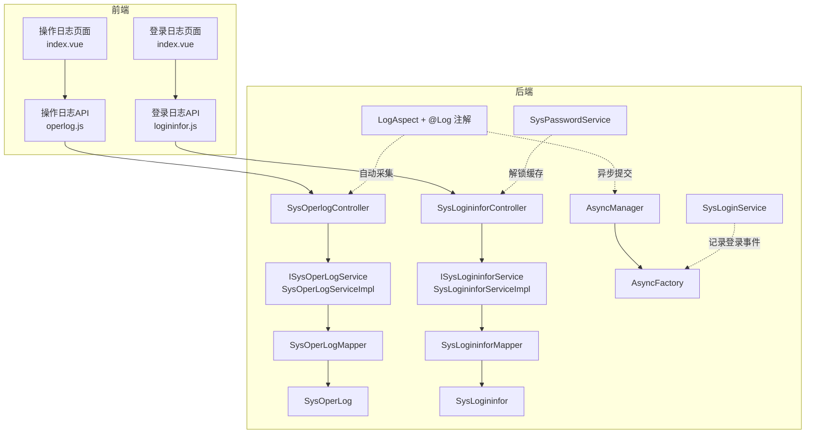
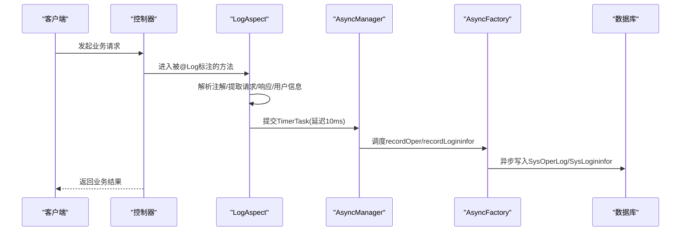
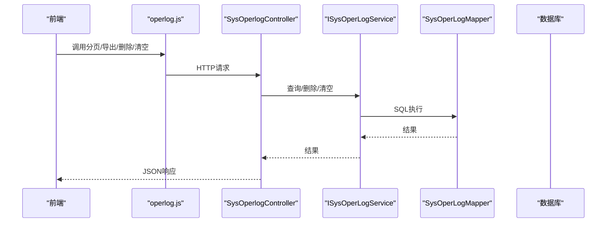
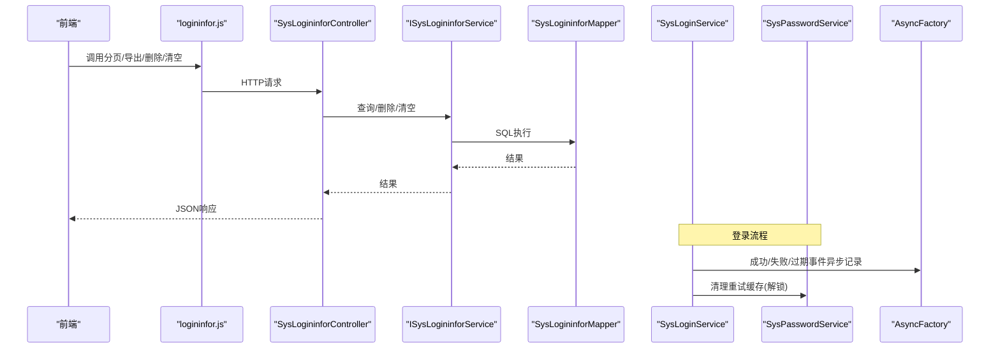
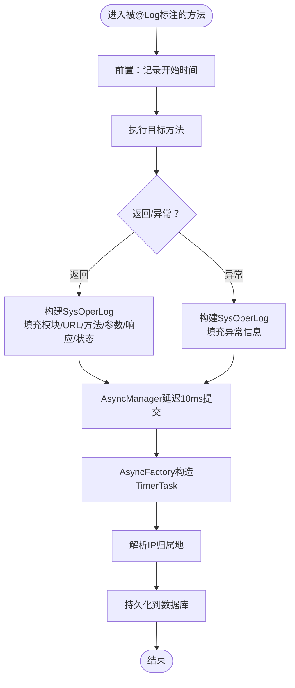
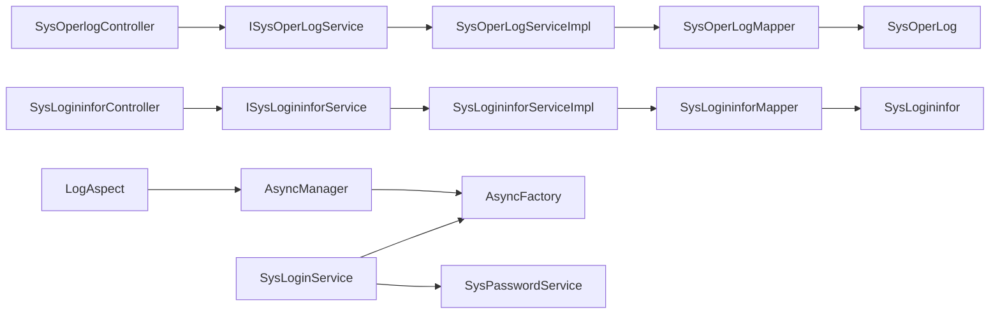

# 操作与登录日志

<cite>
**本文引用的文件**
- [SysOperlogController.java](file://bearjia-admin-backend/src/main/java/com/javaxiaobear/module/monitor/controller/SysOperlogController.java)
- [SysOperLogServiceImpl.java](file://bearjia-admin-backend/src/main/java/com/javaxiaobear/module/monitor/service/impl/SysOperLogServiceImpl.java)
- [ISysOperLogService.java](file://bearjia-admin-backend/src/main/java/com/javaxiaobear/module/monitor/service/ISysOperLogService.java)
- [SysOperLogMapper.java](file://bearjia-admin-backend/src/main/java/com/javaxiaobear/module/monitor/mapper/SysOperLogMapper.java)
- [SysOperLog.java](file://bearjia-admin-backend/src/main/java/com/javaxiaobear/module/monitor/domain/SysOperLog.java)
- [SysLogininforController.java](file://bearjia-admin-backend/src/main/java/com/javaxiaobear/module/monitor/controller/SysLogininforController.java)
- [SysLogininforServiceImpl.java](file://bearjia-admin-backend/src/main/java/com/javaxiaobear/module/monitor/service/impl/SysLogininforServiceImpl.java)
- [ISysLogininforService.java](file://bearjia-admin-backend/src/main/java/com/javaxiaobear/module/monitor/service/ISysLogininforService.java)
- [SysLogininforMapper.java](file://bearjia-admin-backend/src/main/java/com/javaxiaobear/module/monitor/mapper/SysLogininforMapper.java)
- [SysLogininfor.java](file://bearjia-admin-backend/src/main/java/com/javaxiaobear/module/monitor/domain/SysLogininfor.java)
- [Log.java](file://bearjia-admin-backend/src/main/java/com/javaxiaobear/base/framework/aspectj/lang/annotation/Log.java)
- [LogAspect.java](file://bearjia-admin-backend/src/main/java/com/javaxiaobear/base/framework/aspectj/LogAspect.java)
- [BusinessType.java](file://bearjia-admin-backend/src/main/java/com/javaxiaobear/base/framework/aspectj/lang/enums/BusinessType.java)
- [OperatorType.java](file://bearjia-admin-backend/src/main/java/com/javaxiaobear/base/framework/aspectj/lang/enums/OperatorType.java)
- [AsyncFactory.java](file://bearjia-admin-backend/src/main/java/com/javaxiaobear/base/framework/manager/factory/AsyncFactory.java)
- [AsyncManager.java](file://bearjia-admin-backend/src/main/java/com/javaxiaobear/base/framework/manager/AsyncManager.java)
- [SysPasswordService.java](file://bearjia-admin-backend/src/main/java/com/javaxiaobear/base/framework/security/service/SysPasswordService.java)
- [SysLoginService.java](file://bearjia-admin-backend/src/main/java/com/javaxiaobear/base/framework/security/service/SysLoginService.java)
- [operlog.js](file://bearjia-admin-backend/src/main/resources/sql/bear_jia.sql)
- [logback.xml](file://bearjia-admin-backend/src/main/resources/logback.xml)
- [operlog.js](file://bearjia-admin-backend/src/main/resources/sql/bear_jia.sql)
- [index.vue（操作日志）](file://bear-jia-vue3/src/views/monitor/operlog/index.vue)
- [operlog.js（前端API）](file://bear-jia-vue3/src/api/monitor/operlog.js)
- [index.vue（登录日志）](file://bear-jia-vue3/src/views/monitor/logininfor/index.vue)
- [logininfor.js（前端API）](file://bear-jia-admin-backend/src/main/resources/sql/bear_jia.sql)
</cite>

## 目录
1. [简介](#简介)
2. [项目结构](#项目结构)
3. [核心组件](#核心组件)
4. [架构总览](#架构总览)
5. [详细组件分析](#详细组件分析)
6. [依赖关系分析](#依赖关系分析)
7. [性能与容量规划](#性能与容量规划)
8. [故障排查指南](#故障排查指南)
9. [结论](#结论)
10. [附录](#附录)

## 简介
本文件围绕“操作日志”与“登录日志”的完整实现进行系统化梳理，覆盖前后端交互、AOP自动采集、异步落库、Excel导出、批量清理、权限控制与索引优化等方面，并结合前端表格与导出能力，给出可操作的安全审计与故障排查建议。

## 项目结构
- 后端采用Spring Boot + MyBatis，监控模块包含操作日志与登录日志两大子域，分别对应独立的Controller、Service、Mapper与Domain模型。
- 前端使用Vue3 + ProTable，提供分页查询、筛选、导出、批量删除与清空等能力。

图表来源
- [SysOperlogController.java](file://bearjia-admin-backend/src/main/java/com/javaxiaobear/module/monitor/controller/SysOperlogController.java#L1-L69)
- [SysOperLogServiceImpl.java](file://bearjia-admin-backend/src/main/java/com/javaxiaobear/module/monitor/service/impl/SysOperLogServiceImpl.java#L1-L76)
- [SysOperLogMapper.java](file://bearjia-admin-backend/src/main/java/com/javaxiaobear/module/monitor/mapper/SysOperLogMapper.java#L1-L48)
- [SysOperLog.java](file://bearjia-admin-backend/src/main/java/com/javaxiaobear/module/monitor/domain/SysOperLog.java#L1-L270)
- [SysLogininforController.java](file://bearjia-admin-backend/src/main/java/com/javaxiaobear/module/monitor/controller/SysLogininforController.java#L1-L82)
- [SysLogininforServiceImpl.java](file://bearjia-admin-backend/src/main/java/com/javaxiaobear/module/monitor/service/impl/SysLogininforServiceImpl.java#L1-L65)
- [SysLogininforMapper.java](file://bearjia-admin-backend/src/main/java/com/javaxiaobear/module/monitor/mapper/SysLogininforMapper.java#L1-L42)
- [SysLogininfor.java](file://bearjia-admin-backend/src/main/java/com/javaxiaobear/module/monitor/domain/SysLogininfor.java#L1-L144)
- [LogAspect.java](file://bearjia-admin-backend/src/main/java/com/javaxiaobear/base/framework/aspectj/LogAspect.java#L1-L168)
- [AsyncManager.java](file://bearjia-admin-backend/src/main/java/com/javaxiaobear/base/framework/manager/AsyncManager.java#L1-L55)
- [AsyncFactory.java](file://bearjia-admin-backend/src/main/java/com/javaxiaobear/base/framework/manager/factory/AsyncFactory.java#L1-L102)
- [SysPasswordService.java](file://bearjia-admin-backend/src/main/java/com/javaxiaobear/base/framework/security/service/SysPasswordService.java#L1-L87)
- [SysLoginService.java](file://bearjia-admin-backend/src/main/java/com/javaxiaobear/base/framework/security/service/SysLoginService.java#L65-L125)
- [index.vue（操作日志）](file://bear-jia-vue3/src/views/monitor/operlog/index.vue#L1-L119)
- [operlog.js（前端API）](file://bear-jia-vue3/src/api/monitor/operlog.js#L1-L35)
- [index.vue（登录日志）](file://bear-jia-vue3/src/views/monitor/logininfor/index.vue#L1-L100)
- [logininfor.js（前端API）](file://bear-jia-admin-backend/src/main/resources/sql/bear_jia.sql#L329-L341)

章节来源
- [SysOperlogController.java](file://bearjia-admin-backend/src/main/java/com/javaxiaobear/module/monitor/controller/SysOperlogController.java#L1-L69)
- [SysLogininforController.java](file://bearjia-admin-backend/src/main/java/com/javaxiaobear/module/monitor/controller/SysLogininforController.java#L1-L82)
- [LogAspect.java](file://bearjia-admin-backend/src/main/java/com/javaxiaobear/base/framework/aspectj/LogAspect.java#L1-L168)
- [AsyncFactory.java](file://bearjia-admin-backend/src/main/java/com/javaxiaobear/base/framework/manager/factory/AsyncFactory.java#L1-L102)
- [index.vue（操作日志）](file://bear-jia-vue3/src/views/monitor/operlog/index.vue#L1-L119)
- [index.vue（登录日志）](file://bear-jia-vue3/src/views/monitor/logininfor/index.vue#L1-L100)

## 核心组件
- 操作日志
  - 控制器：SysOperlogController，提供分页查询、Excel导出、批量删除、清空接口。
  - 服务：ISysOperLogService + SysOperLogServiceImpl，封装查询、删除、清空与新增。
  - 数据层：SysOperLogMapper，SQL映射。
  - 实体：SysOperLog，承载操作模块、请求地址、方法、参数、返回、状态、耗时等字段。
- 登录日志
  - 控制器：SysLogininforController，提供分页查询、Excel导出、批量删除、清空、账户解锁接口。
  - 服务：ISysLogininforService + SysLogininforServiceImpl。
  - 数据层：SysLogininforMapper。
  - 实体：SysLogininfor，承载用户账号、登录状态、IP、地点、浏览器、系统、消息、时间等字段。
- AOP与注解
  - @Log注解：声明式标注业务类型、操作人类别、是否保存请求/响应参数等。
  - LogAspect：环绕拦截，自动填充操作日志并异步提交。
- 异步工厂
  - AsyncFactory：构造TimerTask，远程解析IP归属地后持久化。
  - AsyncManager：调度线程池，延迟执行，避免阻塞主业务。
- 安全与解锁
  - SysPasswordService：密码重试限制与缓存清理。
  - SysLoginService：登录成功/失败/验证码过期等事件触发异步记录。

章节来源
- [SysOperlogController.java](file://bearjia-admin-backend/src/main/java/com/javaxiaobear/module/monitor/controller/SysOperlogController.java#L1-L69)
- [SysOperLogServiceImpl.java](file://bearjia-admin-backend/src/main/java/com/javaxiaobear/module/monitor/service/impl/SysOperLogServiceImpl.java#L1-L76)
- [SysOperLog.java](file://bearjia-admin-backend/src/main/java/com/javaxiaobear/module/monitor/domain/SysOperLog.java#L1-L270)
- [SysLogininforController.java](file://bearjia-admin-backend/src/main/java/com/javaxiaobear/module/monitor/controller/SysLogininforController.java#L1-L82)
- [SysLogininforServiceImpl.java](file://bearjia-admin-backend/src/main/java/com/javaxiaobear/module/monitor/service/impl/SysLogininforServiceImpl.java#L1-L65)
- [SysLogininfor.java](file://bearjia-admin-backend/src/main/java/com/javaxiaobear/module/monitor/domain/SysLogininfor.java#L1-L144)
- [Log.java](file://bearjia-admin-backend/src/main/java/com/javaxiaobear/base/framework/aspectj/lang/annotation/Log.java#L1-L51)
- [LogAspect.java](file://bearjia-admin-backend/src/main/java/com/javaxiaobear/base/framework/aspectj/LogAspect.java#L1-L168)
- [AsyncFactory.java](file://bearjia-admin-backend/src/main/java/com/javaxiaobear/base/framework/manager/factory/AsyncFactory.java#L1-L102)
- [AsyncManager.java](file://bearjia-admin-backend/src/main/java/com/javaxiaobear/base/framework/manager/AsyncManager.java#L1-L55)
- [SysPasswordService.java](file://bearjia-admin-backend/src/main/java/com/javaxiaobear/base/framework/security/service/SysPasswordService.java#L1-L87)
- [SysLoginService.java](file://bearjia-admin-backend/src/main/java/com/javaxiaobear/base/framework/security/service/SysLoginService.java#L65-L125)

## 架构总览
下图展示从HTTP请求到日志落库的关键链路，包括AOP自动采集、异步调度与数据库持久化。

图表来源
- [LogAspect.java](file://bearjia-admin-backend/src/main/java/com/javaxiaobear/base/framework/aspectj/LogAspect.java#L1-L168)
- [AsyncManager.java](file://bearjia-admin-backend/src/main/java/com/javaxiaobear/base/framework/manager/AsyncManager.java#L1-L55)
- [AsyncFactory.java](file://bearjia-admin-backend/src/main/java/com/javaxiaobear/base/framework/manager/factory/AsyncFactory.java#L1-L102)
- [SysOperlogController.java](file://bearjia-admin-backend/src/main/java/com/javaxiaobear/module/monitor/controller/SysOperlogController.java#L1-L69)
- [SysLogininforController.java](file://bearjia-admin-backend/src/main/java/com/javaxiaobear/module/monitor/controller/SysLogininforController.java#L1-L82)

## 详细组件分析

### 操作日志：SysOperlogController与AOP自动采集
- 分页查询与Excel导出
  - 控制器提供分页查询与导出接口，前端通过API调用，后端使用ExcelUtil导出。
- 批量删除与清空
  - 支持按ID批量删除与一键清空。
- AOP自动采集
  - @Log注解声明业务类型、操作人类别、是否保存请求/响应参数等。
  - LogAspect在前置阶段记录开始时间，在返回或异常阶段构建SysOperLog并异步提交。

图表来源
- [operlog.js](file://bear-jia-vue3/src/api/monitor/operlog.js#L1-L35)
- [SysOperlogController.java](file://bearjia-admin-backend/src/main/java/com/javaxiaobear/module/monitor/controller/SysOperlogController.java#L1-L69)
- [SysOperLogServiceImpl.java](file://bearjia-admin-backend/src/main/java/com/javaxiaobear/module/monitor/service/impl/SysOperLogServiceImpl.java#L1-L76)
- [SysOperLogMapper.java](file://bearjia-admin-backend/src/main/java/com/javaxiaobear/module/monitor/mapper/SysOperLogMapper.java#L1-L48)

章节来源
- [SysOperlogController.java](file://bearjia-admin-backend/src/main/java/com/javaxiaobear/module/monitor/controller/SysOperlogController.java#L1-L69)
- [Log.java](file://bearjia-admin-backend/src/main/java/com/javaxiaobear/base/framework/aspectj/lang/annotation/Log.java#L1-L51)
- [LogAspect.java](file://bearjia-admin-backend/src/main/java/com/javaxiaobear/base/framework/aspectj/LogAspect.java#L1-L168)
- [BusinessType.java](file://bearjia-admin-backend/src/main/java/com/javaxiaobear/base/framework/aspectj/lang/enums/BusinessType.java#L1-L59)
- [OperatorType.java](file://bearjia-admin-backend/src/main/java/com/javaxiaobear/base/framework/aspectj/lang/enums/OperatorType.java#L1-L24)
- [index.vue（操作日志）](file://bear-jia-vue3/src/views/monitor/operlog/index.vue#L1-L119)
- [operlog.js（前端API）](file://bear-jia-vue3/src/api/monitor/operlog.js#L1-L35)

### 登录日志：SysLogininforController与登录事件
- 分页查询、导出、批量删除、清空
- 账户解锁
  - 通过GET /monitor/logininfor/unlock/{userName}，调用SysPasswordService清除登录失败缓存，实现解锁。
- 登录事件记录
  - SysLoginService在认证成功/失败/验证码过期等场景，通过AsyncFactory异步记录登录日志。

图表来源
- [index.vue（登录日志）](file://bear-jia-vue3/src/views/monitor/logininfor/index.vue#L1-L100)
- [SysLogininforController.java](file://bearjia-admin-backend/src/main/java/com/javaxiaobear/module/monitor/controller/SysLogininforController.java#L1-L82)
- [SysLogininforServiceImpl.java](file://bearjia-admin-backend/src/main/java/com/javaxiaobear/module/monitor/service/impl/SysLogininforServiceImpl.java#L1-L65)
- [SysLoginService.java](file://bearjia-admin-backend/src/main/java/com/javaxiaobear/base/framework/security/service/SysLoginService.java#L65-L125)
- [SysPasswordService.java](file://bearjia-admin-backend/src/main/java/com/javaxiaobear/base/framework/security/service/SysPasswordService.java#L1-L87)
- [AsyncFactory.java](file://bearjia-admin-backend/src/main/java/com/javaxiaobear/base/framework/manager/factory/AsyncFactory.java#L1-L102)

章节来源
- [SysLogininforController.java](file://bearjia-admin-backend/src/main/java/com/javaxiaobear/module/monitor/controller/SysLogininforController.java#L1-L82)
- [SysLoginService.java](file://bearjia-admin-backend/src/main/java/com/javaxiaobear/base/framework/security/service/SysLoginService.java#L65-L125)
- [SysPasswordService.java](file://bearjia-admin-backend/src/main/java/com/javaxiaobear/base/framework/security/service/SysPasswordService.java#L1-L87)
- [index.vue（登录日志）](file://bear-jia-vue3/src/views/monitor/logininfor/index.vue#L1-L100)

### AOP自动采集与异步落库
- @Log注解
  - 支持设置模块、业务类型、操作人类别、是否保存请求/响应参数、排除字段等。
- LogAspect
  - 在前置阶段记录开始时间；在返回或异常阶段：
    - 填充操作模块、请求URL、方法、请求方式、操作者、部门、IP、耗时、状态、错误信息、请求参数、响应JSON等。
    - 通过AsyncManager延迟10ms提交TimerTask至AsyncFactory，由AsyncFactory远程解析IP归属地后持久化。
- 异步工厂
  - AsyncFactory为登录日志与操作日志分别构造TimerTask，确保主流程无阻塞。

图表来源
- [Log.java](file://bearjia-admin-backend/src/main/java/com/javaxiaobear/base/framework/aspectj/lang/annotation/Log.java#L1-L51)
- [LogAspect.java](file://bearjia-admin-backend/src/main/java/com/javaxiaobear/base/framework/aspectj/LogAspect.java#L1-L168)
- [AsyncManager.java](file://bearjia-admin-backend/src/main/java/com/javaxiaobear/base/framework/manager/AsyncManager.java#L1-L55)
- [AsyncFactory.java](file://bearjia-admin-backend/src/main/java/com/javaxiaobear/base/framework/manager/factory/AsyncFactory.java#L1-L102)

章节来源
- [LogAspect.java](file://bearjia-admin-backend/src/main/java/com/javaxiaobear/base/framework/aspectj/LogAspect.java#L1-L168)
- [AsyncFactory.java](file://bearjia-admin-backend/src/main/java/com/javaxiaobear/base/framework/manager/factory/AsyncFactory.java#L1-L102)
- [AsyncManager.java](file://bearjia-admin-backend/src/main/java/com/javaxiaobear/base/framework/manager/AsyncManager.java#L1-L55)

### 关键实体字段与填充逻辑
- SysOperLog
  - 关键字段：模块(title)、业务类型(businessType)、请求方法(method)、请求方式(requestMethod)、操作者(operName/deptName)、请求URL(operUrl)、IP(operIp)、地点(operLocation)、请求参数(operParam)、响应(JSON结果)、状态(status)、错误信息(errorMsg)、时间(operTime)、耗时(costTime)。
  - 填充来源：AOP自动采集，@Log注解决定是否保存请求/响应参数，IP归属地由AsyncFactory远程解析。
- SysLogininfor
  - 关键字段：用户账号(userName)、登录状态(status)、IP(ipaddr)、地点(loginLocation)、浏览器(browser)、系统(os)、消息(msg)、时间(loginTime)。
  - 填充来源：SysLoginService在登录成功/失败/验证码过期等事件中异步记录。

章节来源
- [SysOperLog.java](file://bearjia-admin-backend/src/main/java/com/javaxiaobear/module/monitor/domain/SysOperLog.java#L1-L270)
- [SysLogininfor.java](file://bearjia-admin-backend/src/main/java/com/javaxiaobear/module/monitor/domain/SysLogininfor.java#L1-L144)
- [LogAspect.java](file://bearjia-admin-backend/src/main/java/com/javaxiaobear/base/framework/aspectj/LogAspect.java#L1-L168)
- [AsyncFactory.java](file://bearjia-admin-backend/src/main/java/com/javaxiaobear/base/framework/manager/factory/AsyncFactory.java#L1-L102)

## 依赖关系分析
- 控制器依赖服务接口，服务实现依赖Mapper，Mapper映射到数据库表。
- AOP与异步工厂解耦日志采集与持久化，降低对主业务的影响。
- 登录事件由安全服务触发，统一走异步工厂落库。

图表来源
- [SysOperlogController.java](file://bearjia-admin-backend/src/main/java/com/javaxiaobear/module/monitor/controller/SysOperlogController.java#L1-L69)
- [SysOperLogServiceImpl.java](file://bearjia-admin-backend/src/main/java/com/javaxiaobear/module/monitor/service/impl/SysOperLogServiceImpl.java#L1-L76)
- [SysOperLogMapper.java](file://bearjia-admin-backend/src/main/java/com/javaxiaobear/module/monitor/mapper/SysOperLogMapper.java#L1-L48)
- [SysOperLog.java](file://bearjia-admin-backend/src/main/java/com/javaxiaobear/module/monitor/domain/SysOperLog.java#L1-L270)
- [SysLogininforController.java](file://bearjia-admin-backend/src/main/java/com/javaxiaobear/module/monitor/controller/SysLogininforController.java#L1-L82)
- [SysLogininforServiceImpl.java](file://bearjia-admin-backend/src/main/java/com/javaxiaobear/module/monitor/service/impl/SysLogininforServiceImpl.java#L1-L65)
- [SysLogininforMapper.java](file://bearjia-admin-backend/src/main/java/com/javaxiaobear/module/monitor/mapper/SysLogininforMapper.java#L1-L42)
- [SysLogininfor.java](file://bearjia-admin-backend/src/main/java/com/javaxiaobear/module/monitor/domain/SysLogininfor.java#L1-L144)
- [LogAspect.java](file://bearjia-admin-backend/src/main/java/com/javaxiaobear/base/framework/aspectj/LogAspect.java#L1-L168)
- [AsyncManager.java](file://bearjia-admin-backend/src/main/java/com/javaxiaobear/base/framework/manager/AsyncManager.java#L1-L55)
- [AsyncFactory.java](file://bearjia-admin-backend/src/main/java/com/javaxiaobear/base/framework/manager/factory/AsyncFactory.java#L1-L102)
- [SysLoginService.java](file://bearjia-admin-backend/src/main/java/com/javaxiaobear/base/framework/security/service/SysLoginService.java#L65-L125)
- [SysPasswordService.java](file://bearjia-admin-backend/src/main/java/com/javaxiaobear/base/framework/security/service/SysPasswordService.java#L1-L87)

章节来源
- [LogAspect.java](file://bearjia-admin-backend/src/main/java/com/javaxiaobear/base/framework/aspectj/LogAspect.java#L1-L168)
- [AsyncFactory.java](file://bearjia-admin-backend/src/main/java/com/javaxiaobear/base/framework/manager/factory/AsyncFactory.java#L1-L102)

## 性能与容量规划
- 异步落库
  - AsyncManager以10ms延迟调度，避免同步写库阻塞主业务，适合高并发场景。
- IP归属地解析
  - AsyncFactory在异步任务中远程解析IP归属地，建议结合本地缓存或CDN加速，减少网络开销。
- 索引优化
  - 登录日志表存在status与login_time索引，便于按状态与时间检索。
- 日志轮转
  - logback配置了系统日志与用户日志的滚动策略，建议结合业务量调整保留天数与大小阈值。

章节来源
- [AsyncManager.java](file://bearjia-admin-backend/src/main/java/com/javaxiaobear/base/framework/manager/AsyncManager.java#L1-L55)
- [AsyncFactory.java](file://bearjia-admin-backend/src/main/java/com/javaxiaobear/base/framework/manager/factory/AsyncFactory.java#L1-L102)
- [logback.xml](file://bearjia-admin-backend/src/main/resources/logback.xml#L1-L93)
- [operlog.js](file://bearjia-admin-backend/src/main/resources/sql/bear_jia.sql#L329-L341)

## 故障排查指南
- 操作日志无法导出/查询为空
  - 检查控制器权限注解与前端API路径是否一致；确认分页参数与过滤条件。
- 登录日志未记录
  - 确认SysLoginService在认证流程中是否正确触发AsyncFactory；检查Redis缓存键是否存在。
- 解锁无效
  - 确认SysLogininforController的unlock接口调用是否成功；检查SysPasswordService是否清理了重试缓存。
- IP归属地为空
  - 检查AsyncFactory远程解析是否可达；确认网络环境与DNS配置。
- 日志过多导致磁盘压力大
  - 调整logback保留天数与文件大小阈值；评估业务日志级别与输出目标。

章节来源
- [SysOperlogController.java](file://bearjia-admin-backend/src/main/java/com/javaxiaobear/module/monitor/controller/SysOperlogController.java#L1-L69)
- [SysLogininforController.java](file://bearjia-admin-backend/src/main/java/com/javaxiaobear/module/monitor/controller/SysLogininforController.java#L1-L82)
- [SysLoginService.java](file://bearjia-admin-backend/src/main/java/com/javaxiaobear/base/framework/security/service/SysLoginService.java#L65-L125)
- [SysPasswordService.java](file://bearjia-admin-backend/src/main/java/com/javaxiaobear/base/framework/security/service/SysPasswordService.java#L1-L87)
- [logback.xml](file://bearjia-admin-backend/src/main/resources/logback.xml#L1-L93)

## 结论
该系统通过AOP注解与异步工厂实现了对操作日志与登录日志的自动化采集与落库，既保证了主业务性能，又提供了完善的审计能力。前端表格与导出能力进一步提升了日志的可读性与可用性。配合合理的索引与日志轮转策略，可在安全审计与故障排查中发挥重要作用。

## 附录
- 前端页面与API
  - 操作日志页面与API：index.vue、operlog.js
  - 登录日志页面与API：index.vue、logininfor.js
- 数据库脚本
  - 登录日志表结构与索引定义位于bear_jia.sql

章节来源
- [index.vue（操作日志）](file://bear-jia-vue3/src/views/monitor/operlog/index.vue#L1-L119)
- [operlog.js（前端API）](file://bear-jia-vue3/src/api/monitor/operlog.js#L1-L35)
- [index.vue（登录日志）](file://bear-jia-vue3/src/views/monitor/logininfor/index.vue#L1-L100)
- [operlog.js（前端API）](file://bear-jia-admin-backend/src/main/resources/sql/bear_jia.sql#L329-L341)