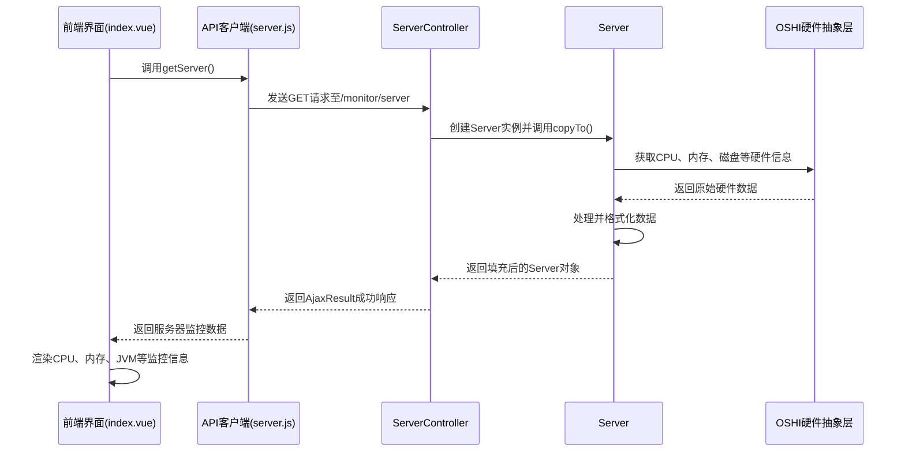
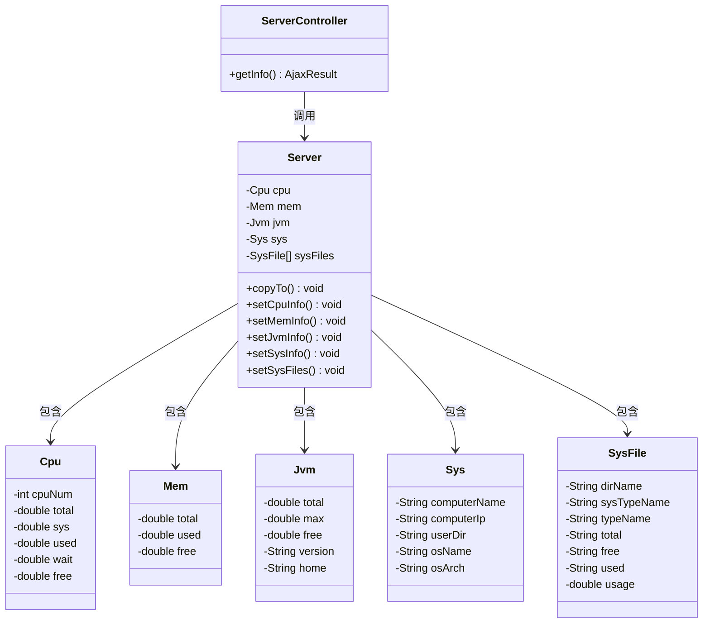
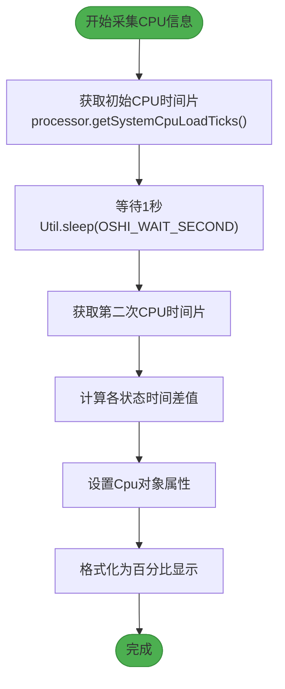
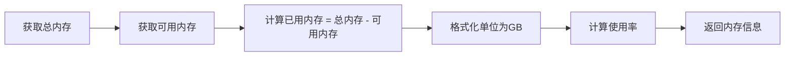
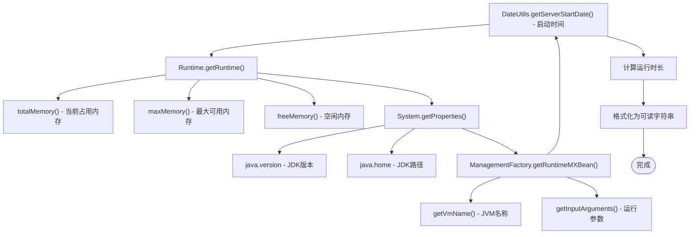
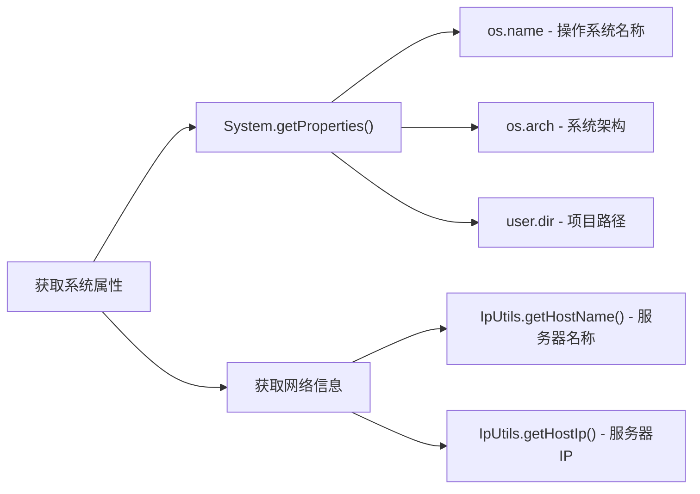
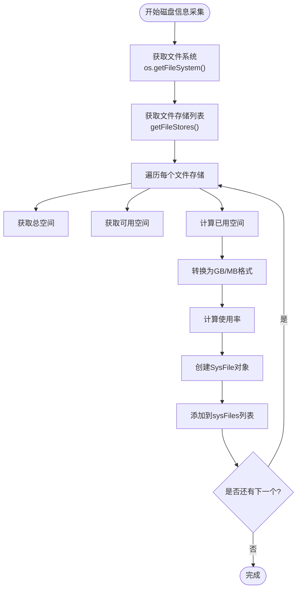

# 服务监控

<cite>
**本文档引用文件**  
- [ServerController.java](file://bearjia-admin-backend/src/main/java/com/javaxiaobear/module/monitor/controller/ServerController.java)
- [Server.java](file://bearjia-admin-backend/src/main/java/com/javaxiaobear/base/framework/web/domain/Server.java)
- [Cpu.java](file://bearjia-admin-backend/src/main/java/com/javaxiaobear/base/framework/web/domain/server/Cpu.java)
- [Mem.java](file://bearjia-admin-backend/src/main/java/com/javaxiaobear/base/framework/web/domain/server/Mem.java)
- [Jvm.java](file://bearjia-admin-backend/src/main/java/com/javaxiaobear/base/framework/web/domain/server/Jvm.java)
- [Sys.java](file://bearjia-admin-backend/src/main/java/com/javaxiaobear/base/framework/web/domain/server/Sys.java)
- [SysFile.java](file://bearjia-admin-backend/src/main/java/com/javaxiaobear/base/framework/web/domain/server/SysFile.java)
- [server.js](file://bear-jia-vue3/src/api/monitor/server.js)
- [index.vue](file://bear-jia-vue3/src/views/monitor/server/index.vue)
</cite>

## 目录
1. [简介](#简介)
2. [系统架构与数据流](#系统架构与数据流)
3. [核心组件分析](#核心组件分析)
4. [CPU监控实现](#cpu监控实现)
5. [内存监控实现](#内存监控实现)
6. [JVM监控实现](#jvm监控实现)
7. [系统信息采集](#系统信息采集)
8. [磁盘状态监控](#磁盘状态监控)
9. [性能评估与优化建议](#性能评估与优化建议)

## 简介
本技术文档全面介绍服务监控功能的实现机制，重点阐述服务器运行时状态的采集与展示流程。系统通过后端Java服务与前端Vue3界面的协同工作，实现了对CPU、内存、JVM、磁盘等关键指标的实时监控。文档详细解析了从数据采集、处理到前端展示的完整技术链路，为系统维护和性能优化提供技术参考。

## 系统架构与数据流

**图表来源**
- [index.vue](file://bear-jia-vue3/src/views/monitor/server/index.vue#L178-L285)
- [server.js](file://bear-jia-vue3/src/api/monitor/server.js#L1-L9)
- [ServerController.java](file://bearjia-admin-backend/src/main/java/com/javaxiaobear/module/monitor/controller/ServerController.java#L1-L27)
- [Server.java](file://bearjia-admin-backend/src/main/java/com/javaxiaobear/base/framework/web/domain/Server.java#L1-L227)

## 核心组件分析

服务监控功能由前后端多个组件协同实现，主要包括：

- **前端展示层**：基于Vue3的`index.vue`组件，负责数据可视化
- **API通信层**：`server.js`封装了与后端的HTTP通信
- **后端控制层**：`ServerController`处理HTTP请求
- **数据采集层**：`Server`类及其关联的`Cpu`、`Mem`、`Jvm`等子类

**图表来源**
- [ServerController.java](file://bearjia-admin-backend/src/main/java/com/javaxiaobear/module/monitor/controller/ServerController.java#L1-L27)
- [Server.java](file://bearjia-admin-backend/src/main/java/com/javaxiaobear/base/framework/web/domain/Server.java#L1-L227)
- [Cpu.java](file://bearjia-admin-backend/src/main/java/com/javaxiaobear/base/framework/web/domain/server/Cpu.java#L1-L102)
- [Mem.java](file://bearjia-admin-backend/src/main/java/com/javaxiaobear/base/framework/web/domain/server/Mem.java#L1-L62)
- [Jvm.java](file://bearjia-admin-backend/src/main/java/com/javaxiaobear/base/framework/web/domain/server/Jvm.java#L1-L131)
- [Sys.java](file://bearjia-admin-backend/src/main/java/com/javaxiaobear/base/framework/web/domain/server/Sys.java#L1-L85)
- [SysFile.java](file://bearjia-admin-backend/src/main/java/com/javaxiaobear/base/framework/web/domain/server/SysFile.java#L1-L115)

## CPU监控实现

### CPU指标含义
`Cpu`类定义了以下关键指标：
- **cpuNum**：CPU逻辑核心数
- **total**：CPU总使用时间（用户+系统+等待+空闲等）
- **sys**：系统使用时间（内核态）
- **used**：用户使用时间（用户态）
- **wait**：I/O等待时间
- **free**：空闲时间

### 采集方法
系统使用OSHI（Operating System and Hardware Information）库实现跨平台CPU信息采集：

**图表来源**
- [Cpu.java](file://bearjia-admin-backend/src/main/java/com/javaxiaobear/base/framework/web/domain/server/Cpu.java#L1-L102)
- [Server.java](file://bearjia-admin-backend/src/main/java/com/javaxiaobear/base/framework/web/domain/Server.java#L127-L148)

**本节来源**
- [Cpu.java](file://bearjia-admin-backend/src/main/java/com/javaxiaobear/base/framework/web/domain/server/Cpu.java#L1-L102)
- [Server.java](file://bearjia-admin-backend/src/main/java/com/javaxiaobear/base/framework/web/domain/Server.java#L127-L148)

## 内存监控实现

### 物理内存监控
`Mem`类负责监控物理内存使用情况：

### 关键计算方式
- **内存总量**：`memory.getTotal()`
- **已用内存**：`memory.getTotal() - memory.getAvailable()`
- **剩余内存**：`memory.getAvailable()`
- **使用率**：`(已用内存 / 总量) × 100%`

**图表来源**
- [Mem.java](file://bearjia-admin-backend/src/main/java/com/javaxiaobear/base/framework/web/domain/server/Mem.java#L1-L62)
- [Server.java](file://bearjia-admin-backend/src/main/java/com/javaxiaobear/base/framework/web/domain/Server.java#L153-L158)

**本节来源**
- [Mem.java](file://bearjia-admin-backend/src/main/java/com/javaxiaobear/base/framework/web/domain/server/Mem.java#L1-L62)
- [Server.java](file://bearjia-admin-backend/src/main/java/com/javaxiaobear/base/framework/web/domain/Server.java#L153-L158)

## JVM监控实现

### JVM指标采集
`Jvm`类通过Java标准API获取JVM运行时指标：

### 关键指标说明
- **堆内存**：通过`Runtime`类获取
- **非堆内存**：包含在总内存中
- **运行时长**：基于服务器启动时间计算
- **GC次数**：虽然未直接暴露，但可通过内存变化间接反映

**图表来源**
- [Jvm.java](file://bearjia-admin-backend/src/main/java/com/javaxiaobear/base/framework/web/domain/server/Jvm.java#L1-L131)
- [Server.java](file://bearjia-admin-backend/src/main/java/com/javaxiaobear/base/framework/web/domain/Server.java#L176-L184)

**本节来源**
- [Jvm.java](file://bearjia-admin-backend/src/main/java/com/javaxiaobear/base/framework/web/domain/server/Jvm.java#L1-L131)
- [Server.java](file://bearjia-admin-backend/src/main/java/com/javaxiaobear/base/framework/web/domain/Server.java#L176-L184)

## 系统信息采集

### 基础信息收集
`Sys`类收集操作系统和环境基础信息：

### 信息用途
- **服务器名称/IP**：标识监控目标
- **操作系统**：用于环境诊断
- **系统架构**：辅助性能分析
- **项目路径**：便于日志定位

**图表来源**
- [Sys.java](file://bearjia-admin-backend/src/main/java/com/javaxiaobear/base/framework/web/domain/server/Sys.java#L1-L85)
- [Server.java](file://bearjia-admin-backend/src/main/java/com/javaxiaobear/base/framework/web/domain/Server.java#L163-L171)

**本节来源**
- [Sys.java](file://bearjia-admin-backend/src/main/java/com/javaxiaobear/base/framework/web/domain/server/Sys.java#L1-L85)
- [Server.java](file://bearjia-admin-backend/src/main/java/com/javaxiaobear/base/framework/web/domain/Server.java#L163-L171)

## 磁盘状态监控

### 磁盘信息采集
系统通过OSHI库获取磁盘状态：

### 数据计算
- **总大小**：`fs.getTotalSpace()`
- **可用大小**：`fs.getUsableSpace()`
- **已用大小**：`总大小 - 可用大小`
- **使用率**：`(已用大小 / 总大小) × 100%`

**图表来源**
- [SysFile.java](file://bearjia-admin-backend/src/main/java/com/javaxiaobear/base/framework/web/domain/server/SysFile.java#L1-L115)
- [Server.java](file://bearjia-admin-backend/src/main/java/com/javaxiaobear/base/framework/web/domain/Server.java#L189-L207)

**本节来源**
- [SysFile.java](file://bearjia-admin-backend/src/main/java/com/javaxiaobear/base/framework/web/domain/server/SysFile.java#L1-L115)
- [Server.java](file://bearjia-admin-backend/src/main/java/com/javaxiaobear/base/framework/web/domain/Server.java#L189-L207)

## 性能评估与优化建议

### 采集频率与性能开销
当前监控数据采集具有以下特点：
- **实时性**：每次请求时采集最新数据
- **延迟**：CPU采集需要1秒等待以计算使用率
- **资源消耗**：主要开销在OSHI库的硬件信息读取

### 高并发场景优化建议
1. **引入缓存机制**：对监控数据进行短时缓存（如30秒），避免频繁采集
2. **异步采集**：后台定时采集数据，前端直接读取缓存
3. **减少采集频率**：根据业务需求调整采集间隔
4. **分页加载**：对于大量磁盘信息，采用分页或懒加载
5. **压缩传输**：对JSON响应进行GZIP压缩

### 监控指标
建议监控以下性能指标：
- **API响应时间**：确保监控接口不影响系统性能
- **服务器负载**：避免监控采集导致CPU使用率异常
- **内存占用**：防止频繁对象创建导致内存压力

**本节来源**
- [Server.java](file://bearjia-admin-backend/src/main/java/com/javaxiaobear/base/framework/web/domain/Server.java#L31-L227)
- [ServerController.java](file://bearjia-admin-backend/src/main/java/com/javaxiaobear/module/monitor/controller/ServerController.java#L1-L27)