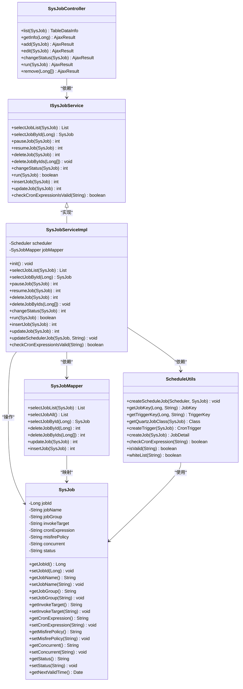
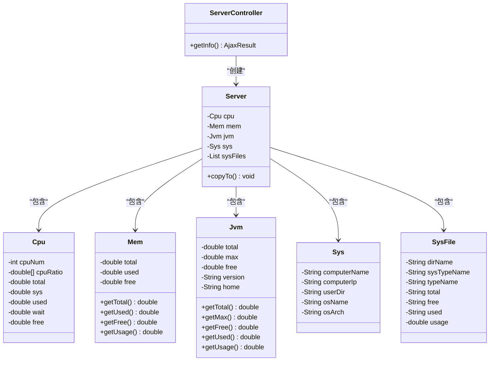
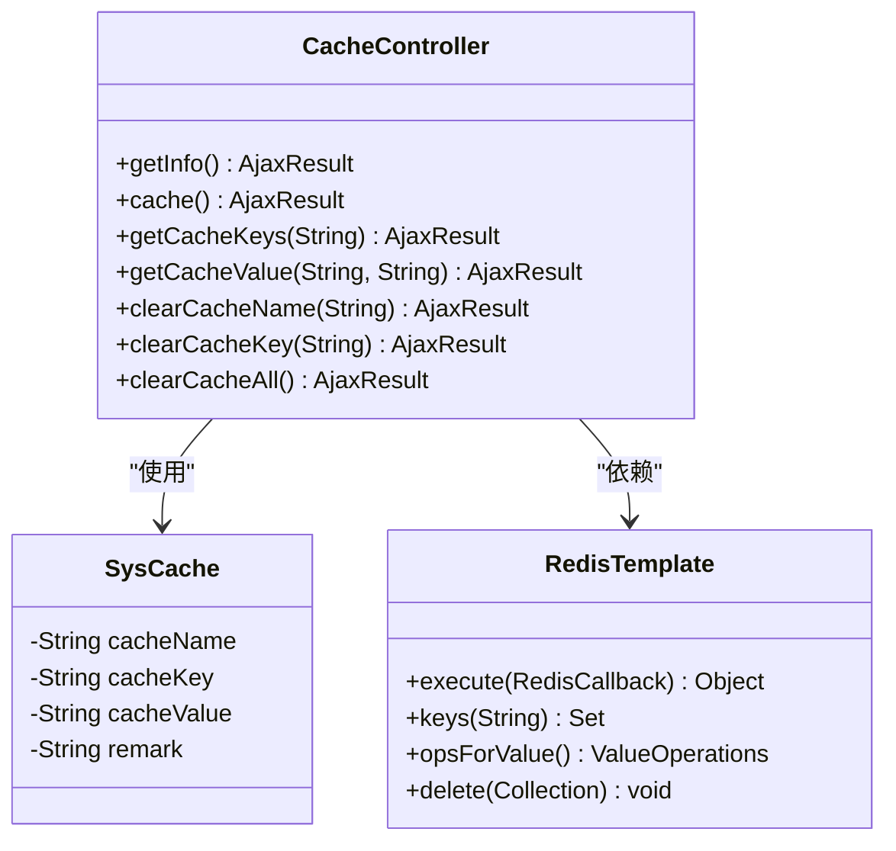
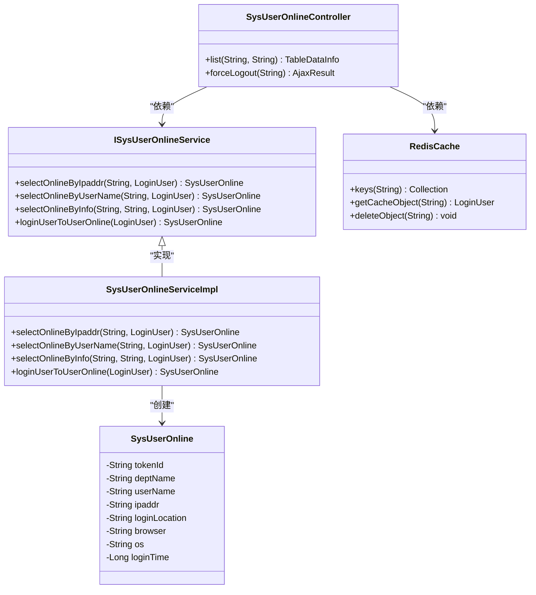
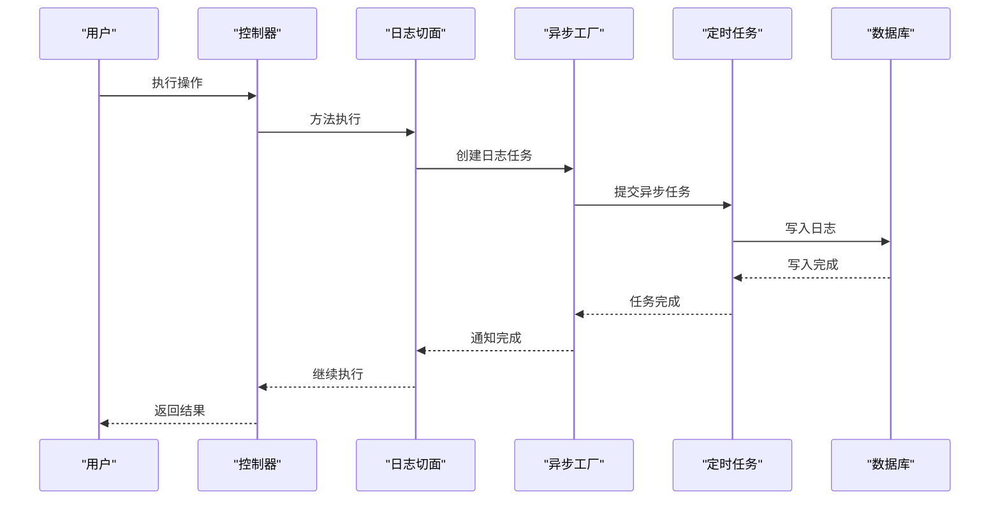
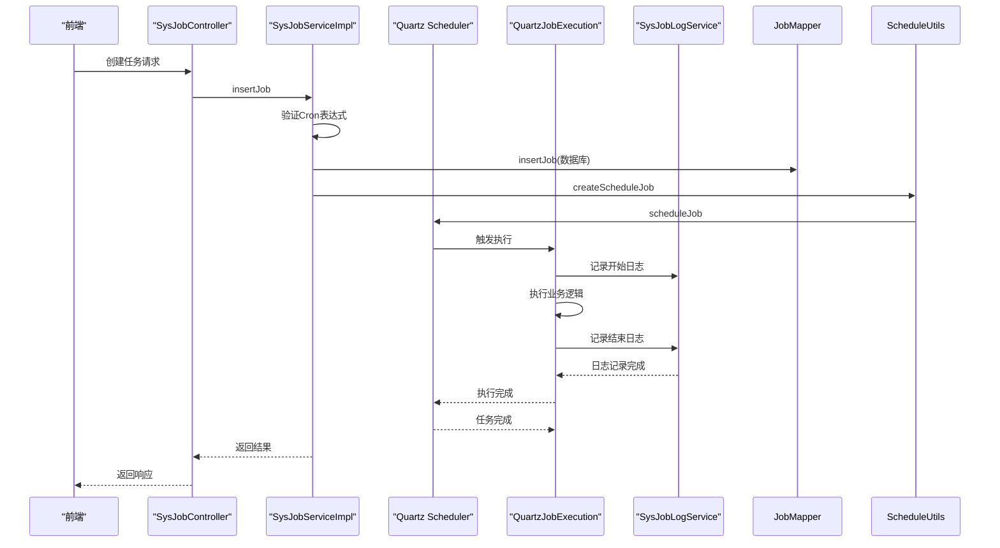

# 系统监控模块

<cite>
**本文档引用文件**   
- [SysJobController.java](file://bearjia-admin-backend/src/main/java/com/javaxiaobear/module/monitor/controller/SysJobController.java)
- [ServerController.java](file://bearjia-admin-backend/src/main/java/com/javaxiaobear/module/monitor/controller/ServerController.java)
- [ISysJobService.java](file://bearjia-admin-backend/src/main/java/com/javaxiaobear/module/monitor/service/ISysJobService.java)
- [SysJobServiceImpl.java](file://bearjia-admin-backend/src/main/java/com/javaxiaobear/module/monitor/service/impl/SysJobServiceImpl.java)
- [SysJob.java](file://bearjia-admin-backend/src/main/java/com/javaxiaobear/module/monitor/domain/SysJob.java)
- [SysJobMapper.java](file://bearjia-admin-backend/src/main/java/com/javaxiaobear/module/monitor/mapper/SysJobMapper.java)
- [ScheduleUtils.java](file://bearjia-admin-backend/src/main/java/com/javaxiaobear/base/common/utils/job/ScheduleUtils.java)
- [Server.java](file://bearjia-admin-backend/src/main/java/com/javaxiaobear/base/framework/web/domain/Server.java)
- [Jvm.java](file://bearjia-admin-backend/src/main/java/com/javaxiaobear/base/framework/web/domain/server/Jvm.java)
- [CacheController.java](file://bearjia-admin-backend/src/main/java/com/javaxiaobear/module/monitor/controller/CacheController.java)
- [SysUserOnlineController.java](file://bearjia-admin-backend/src/main/java/com/javaxiaobear/module/monitor/controller/SysUserOnlineController.java)
- [job.js](file://bear-jia-vue3/src/api/monitor/job.js)
- [server.js](file://bear-jia-vue3/src/api/monitor/server.js)
- [cache.js](file://bear-jia-vue3/src/api/monitor/cache.js)
- [online.js](file://bear-jia-vue3/src/api/monitor/online.js)
- [index.vue](file://bear-jia-vue3/src/views/monitor/server/index.vue)
- [list.vue](file://bear-jia-vue3/src/views/monitor/cache/list.vue)
</cite>

## 目录
1. [引言](#引言)
2. [定时任务监控](#定时任务监控)
3. [服务监控](#服务监控)
4. [缓存监控](#缓存监控)
5. [在线用户监控](#在线用户监控)
6. [操作日志与登录日志](#操作日志与登录日志)
7. [定时任务调用链路](#定时任务调用链路)
8. [性能优化建议](#性能优化建议)

## 引言
系统监控模块是保障系统稳定运行的核心组件，提供对定时任务、服务器资源、缓存状态、在线用户和操作日志的全面监控能力。该模块基于Quartz实现任务调度，集成OSHI库采集服务器信息，利用Redis实现缓存监控和在线用户管理，并通过异步日志记录保障系统性能。本文档将深入解析各监控功能的实现原理和架构设计。

## 定时任务监控

定时任务监控功能通过Quartz框架实现任务调度管理，提供任务的增删改查、立即执行和状态切换等操作。系统在启动时会自动加载数据库中的任务配置并初始化调度器，确保任务状态与数据库保持同步。

**图示来源**
- [SysJobController.java](file://bearjia-admin-backend/src/main/java/com/javaxiaobear/module/monitor/controller/SysJobController.java)
- [ISysJobService.java](file://bearjia-admin-backend/src/main/java/com/javaxiaobear/module/monitor/service/ISysJobService.java)
- [SysJobServiceImpl.java](file://bearjia-admin-backend/src/main/java/com/javaxiaobear/module/monitor/service/impl/SysJobServiceImpl.java)
- [SysJobMapper.java](file://bearjia-admin-backend/src/main/java/com/javaxiaobear/module/monitor/mapper/SysJobMapper.java)
- [ScheduleUtils.java](file://bearjia-admin-backend/src/main/java/com/javaxiaobear/base/common/utils/job/ScheduleUtils.java)
- [SysJob.java](file://bearjia-admin-backend/src/main/java/com/javaxiaobear/module/monitor/domain/SysJob.java)

### SysJobController接口设计
SysJobController提供了完整的RESTful API接口，实现了定时任务的全生命周期管理：

- **任务查询**：通过`/monitor/job/list`接口实现分页查询，支持按任务名称、组名、状态等条件过滤
- **任务详情**：通过`/monitor/job/{jobId}`接口获取指定任务的详细信息
- **任务创建**：通过`/monitor/job` POST接口新增任务，包含Cron表达式验证和安全检查
- **任务修改**：通过`/monitor/job` PUT接口更新任务配置，自动同步到Quartz调度器
- **状态切换**：通过`/monitor/job/changeStatus`接口实现任务暂停/恢复
- **立即执行**：通过`/monitor/job/run`接口触发任务立即执行一次
- **任务删除**：通过`/monitor/job/{jobIds}` DELETE接口批量删除任务

前端通过job.js封装了这些API调用，为管理界面提供数据支持。

**代码来源**
- [SysJobController.java](file://bearjia-admin-backend/src/main/java/com/javaxiaobear/module/monitor/controller/SysJobController.java#L35-L186)
- [job.js](file://bear-jia-vue3/src/api/monitor/job.js)

### ISysJobService核心业务逻辑
ISysJobService接口定义了定时任务的核心业务逻辑，其实现类SysJobServiceImpl通过Spring与Quartz的集成实现了任务调度管理：

- **Quartz集成**：通过@Autowired注入Scheduler实例，实现与Spring容器的无缝集成
- **Cron表达式验证**：使用CronUtils工具类验证表达式有效性，确保任务调度的正确性
- **任务日志记录**：在任务执行前后记录日志，包括执行时间、状态和异常信息
- **白名单安全检查**：通过whiteList方法防止恶意代码执行，确保系统安全

系统在启动时通过@PostConstruct注解执行init方法，加载数据库中所有任务并注册到Quartz调度器，确保系统重启后任务配置不丢失。

**代码来源**
- [ISysJobService.java](file://bearjia-admin-backend/src/main/java/com/javaxiaobear/module/monitor/service/ISysJobService.java)
- [SysJobServiceImpl.java](file://bearjia-admin-backend/src/main/java/com/javaxiaobear/module/monitor/service/impl/SysJobServiceImpl.java)

### SysJob实体与数据库映射
SysJob实体类与数据库表sys_job完全映射，包含任务的所有配置信息：

- **基础信息**：jobId(任务ID)、jobName(任务名称)、jobGroup(任务组名)
- **执行配置**：invokeTarget(调用目标字符串)、cronExpression(Cron表达式)
- **调度策略**：misfirePolicy(计划策略)、concurrent(是否并发执行)
- **状态信息**：status(任务状态)、createTime(创建时间)、updateTime(更新时间)

实体类通过@Excel注解支持导出功能，通过@NotBlank等验证注解确保数据完整性，并提供getNextValidTime方法计算下次执行时间。

**代码来源**
- [SysJob.java](file://bearjia-admin-backend/src/main/java/com/javaxiaobear/module/monitor/domain/SysJob.java)

### SysJobMapper SQL实现
SysJobMapper接口定义了定时任务的持久化操作，通过MyBatis实现数据库访问：

- **分页查询**：selectJobList方法支持条件查询和分页
- **状态更新**：updateJob方法更新任务配置，包括状态、Cron表达式等
- **批量操作**：deleteJobByIds方法支持批量删除任务

这些SQL操作与Quartz调度器的操作保持原子性，确保数据库状态与调度器状态一致。

**代码来源**
- [SysJobMapper.java](file://bearjia-admin-backend/src/main/java/com/javaxiaobear/module/monitor/mapper/SysJobMapper.java)

## 服务监控

服务监控功能通过ServerController暴露服务器运行时信息，使用OSHI库采集CPU、内存、JVM和磁盘等关键指标。

**图示来源**
- [ServerController.java](file://bearjia-admin-backend/src/main/java/com/javaxiaobear/module/monitor/controller/ServerController.java)
- [Server.java](file://bearjia-admin-backend/src/main/java/com/javaxiaobear/base/framework/web/domain/Server.java)
- [Jvm.java](file://bearjia-admin-backend/src/main/java/com/javaxiaobear/base/framework/web/domain/server/Jvm.java)

### ServerController数据暴露
ServerController通过`/monitor/server` GET接口暴露服务器监控数据：

- **权限控制**：使用@PreAuthorize注解确保只有授权用户可访问
- **数据采集**：创建Server实例并调用copyTo方法采集所有指标
- **数据返回**：通过AjaxResult.success返回采集到的服务器信息

前端通过server.js调用此接口，并在index.vue中展示服务器状态。

**代码来源**
- [ServerController.java](file://bearjia-admin-backend/src/main/java/com/javaxiaobear/module/monitor/controller/ServerController.java)
- [server.js](file://bear-jia-vue3/src/api/monitor/server.js)
- [index.vue](file://bear-jia-vue3/src/views/monitor/server/index.vue)

### Server数据采集实现
Server类通过OSHI库采集系统信息：

- **CPU信息**：使用CentralProcessor获取CPU核心数和使用率
- **内存信息**：使用GlobalMemory获取物理内存总量和使用情况
- **JVM信息**：使用ManagementFactory获取JVM内存和版本信息
- **磁盘信息**：使用FileSystem获取磁盘分区和使用率

copyTo方法协调各组件的数据采集，确保数据的一致性和实时性。

**代码来源**
- [Server.java](file://bearjia-admin-backend/src/main/java/com/javaxiaobear/base/framework/web/domain/Server.java)

## 缓存监控

缓存监控功能通过CacheController提供Redis缓存的全面监控，包括基本信息、命令统计和缓存清理。

**图示来源**
- [CacheController.java](file://bearjia-admin-backend/src/main/java/com/javaxiaobear/module/monitor/controller/CacheController.java)
- [SysCache.java](file://bearjia-admin-backend/src/main/java/com/javaxiaobear/module/monitor/domain/SysCache.java)

### 缓存监控功能
CacheController提供了完整的缓存管理功能：

- **基本信息**：通过info命令获取Redis版本、内存使用等信息
- **命令统计**：通过commandstats命令分析各类命令的调用频率
- **缓存查询**：支持按名称查询缓存键名和具体值
- **缓存清理**：支持清理指定名称、键名或全部缓存

前端通过cache.js调用这些接口，在list.vue中展示缓存列表和管理功能。

**代码来源**
- [CacheController.java](file://bearjia-admin-backend/src/main/java/com/javaxiaobear/module/monitor/controller/CacheController.java)
- [cache.js](file://bear-jia-vue3/src/api/monitor/cache.js)
- [list.vue](file://bear-jia-vue3/src/views/monitor/cache/list.vue)

## 在线用户监控

在线用户监控功能通过SysUserOnlineController管理当前在线会话，基于Redis存储会话信息。

**图示来源**
- [SysUserOnlineController.java](file://bearjia-admin-backend/src/main/java/com/javaxiaobear/module/monitor/controller/SysUserOnlineController.java)
- [ISysUserOnlineService.java](file://bearjia-admin-backend/src/main/java/com/javaxiaobear/module/system/service/ISysUserOnlineService.java)
- [SysUserOnlineServiceImpl.java](file://bearjia-admin-backend/src/main/java/com/javaxiaobear/module/system/service/impl/SysUserOnlineServiceImpl.java)
- [SysUserOnline.java](file://bearjia-admin-backend/src/main/java/com/javaxiaobear/module/monitor/domain/SysUserOnline.java)

### 在线用户管理
系统通过Redis存储用户会话信息，实现在线用户监控：

- **会话查询**：扫描Redis中所有登录令牌，获取在线用户列表
- **条件过滤**：支持按IP地址和用户名过滤在线用户
- **强退用户**：删除指定用户的Redis会话，强制其下线

前端通过online.js调用这些接口，展示在线用户列表和操作功能。

**代码来源**
- [SysUserOnlineController.java](file://bearjia-admin-backend/src/main/java/com/javaxiaobear/module/monitor/controller/SysUserOnlineController.java)
- [online.js](file://bear-jia-vue3/src/api/monitor/online.js)

## 操作日志与登录日志

操作日志和登录日志通过异步方式记录系统操作和用户登录行为，确保不影响主业务流程性能。

**图示来源**
- [AsyncFactory.java](file://bearjia-admin-backend/src/main/java/com/javaxiaobear/base/framework/manager/factory/AsyncFactory.java)

### 日志记录机制
系统采用异步日志记录机制：

- **操作日志**：通过@Log注解和AOP切面捕获操作信息
- **登录日志**：在登录、登出、注册等关键节点记录日志
- **异步处理**：使用TimerTask将日志写入操作放入异步队列
- **远程定位**：通过IP地址查询实际地理位置

这种设计确保了日志记录不会阻塞主业务流程，提高了系统响应速度。

**代码来源**
- [AsyncFactory.java](file://bearjia-admin-backend/src/main/java/com/javaxiaobear/base/framework/manager/factory/AsyncFactory.java)

## 定时任务调用链路

定时任务从创建到执行的完整调用链路涉及多个组件的协同工作。

**图示来源**
- [SysJobController.java](file://bearjia-admin-backend/src/main/java/com/javaxiaobear/module/monitor/controller/SysJobController.java)
- [SysJobServiceImpl.java](file://bearjia-admin-backend/src/main/java/com/javaxiaobear/module/monitor/service/impl/SysJobServiceImpl.java)
- [ScheduleUtils.java](file://bearjia-admin-backend/src/main/java/com/javaxiaobear/base/common/utils/job/ScheduleUtils.java)

### 调用链路解析
定时任务的完整执行流程：

1. **任务创建**：前端提交任务配置，包含Cron表达式和调用目标
2. **参数验证**：后端验证Cron表达式有效性并检查安全白名单
3. **持久化**：将任务信息保存到数据库sys_job表
4. **调度注册**：通过ScheduleUtils将任务注册到Quartz调度器
5. **任务触发**：Quartz根据Cron表达式触发任务执行
6. **日志记录**：在任务执行前后记录日志到sys_job_log表
7. **异常处理**：捕获执行异常并记录到日志，确保任务不会因异常而终止

这个流程确保了任务调度的可靠性、安全性和可追溯性。

**代码来源**
- [SysJobController.java](file://bearjia-admin-backend/src/main/java/com/javaxiaobear/module/monitor/controller/SysJobController.java#L83-L111)
- [SysJobServiceImpl.java](file://bearjia-admin-backend/src/main/java/com/javaxiaobear/module/monitor/service/impl/SysJobServiceImpl.java#L202-L210)
- [ScheduleUtils.java](file://bearjia-admin-backend/src/main/java/com/javaxiaobear/base/common/utils/job/ScheduleUtils.java)

## 性能优化建议

### 服务监控数据采集频率
- **合理设置采集间隔**：避免过于频繁的数据采集导致系统负载过高
- **按需采集**：根据监控需求选择采集指标，减少不必要的系统调用
- **缓存采集结果**：对于变化不频繁的指标，可适当缓存减少重复采集

### 缓存监控的Redis连接管理
- **连接池配置**：合理设置Redis连接池大小，避免连接过多或过少
- **连接复用**：使用连接池复用连接，减少连接创建和销毁的开销
- **超时设置**：设置合理的连接超时和读写超时，防止长时间阻塞

### 在线用户会话同步
- **会话存储优化**：使用高效的序列化方式存储会话数据
- **过期策略**：合理设置会话过期时间，及时清理无效会话
- **分布式同步**：在集群环境下确保会话信息的一致性

**代码来源**
- [Server.java](file://bearjia-admin-backend/src/main/java/com/javaxiaobear/base/framework/web/domain/Server.java)
- [CacheController.java](file://bearjia-admin-backend/src/main/java/com/javaxiaobear/module/monitor/controller/CacheController.java)
- [SysUserOnlineController.java](file://bearjia-admin-backend/src/main/java/com/javaxiaobear/module/monitor/controller/SysUserOnlineController.java)