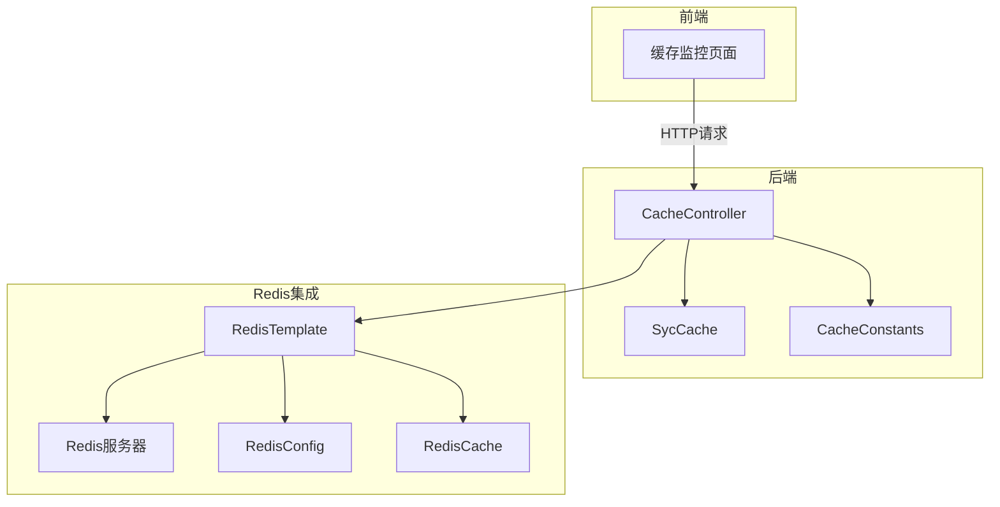
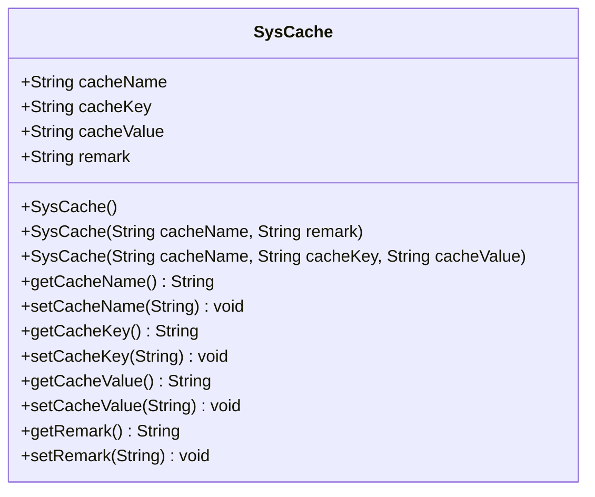
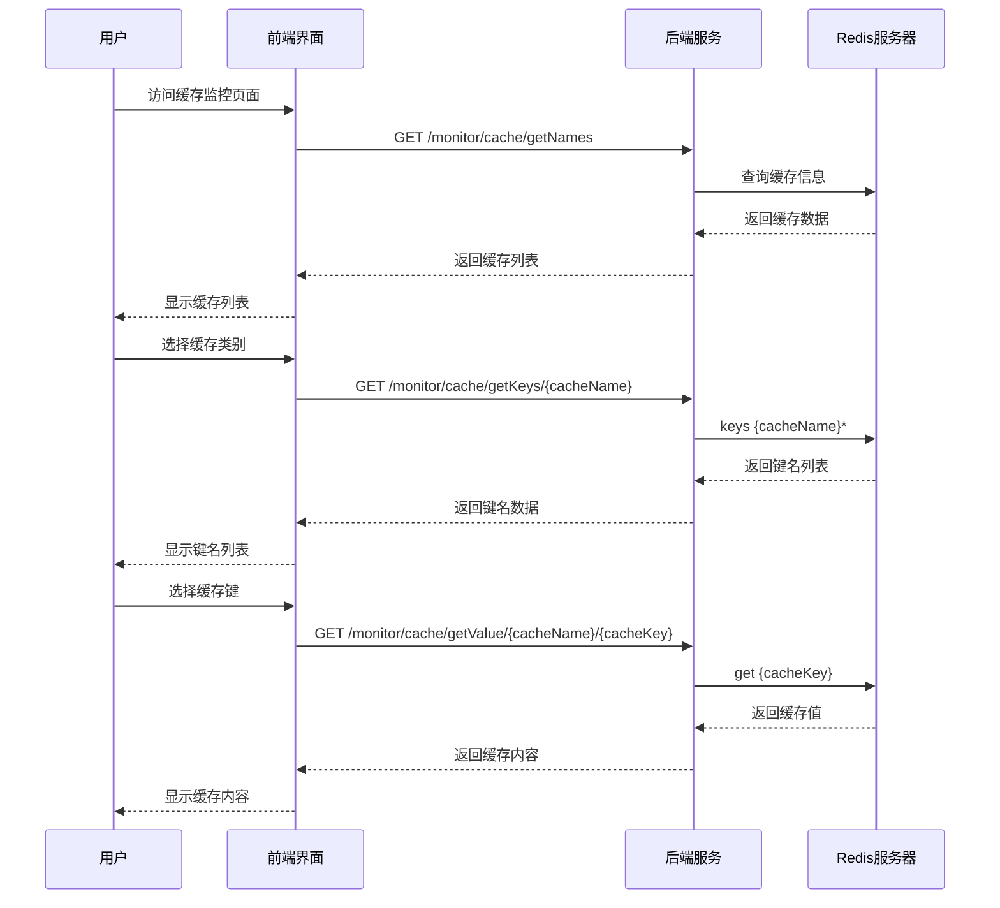

# 缓存监控

<cite>
**本文档引用文件**  
- [CacheController.java](file://bearjia-admin-backend/src/main/java/com/javaxiaobear/module/monitor/controller/CacheController.java)
- [SysCache.java](file://bearjia-admin-backend/src/main/java/com/javaxiaobear/module/monitor/domain/SysCache.java)
- [CacheConstants.java](file://bearjia-admin-backend/src/main/java/com/javaxiaobear/base/common/constant/CacheConstants.java)
- [RedisConfig.java](file://bearjia-admin-backend/src/main/java/com/javaxiaobear/base/framework/config/RedisConfig.java)
- [RedisCache.java](file://bearjia-admin-backend/src/main/java/com/javaxiaobear/base/framework/redis/RedisCache.java)
- [cache.js](file://bear-jia-vue3/src/api/monitor/cache.js)
- [list.vue](file://bear-jia-vue3/src/views/monitor/cache/list.vue)
</cite>

## 目录
1. [简介](#简介)
2. [系统架构与组件关系](#系统架构与组件关系)
3. [核心功能分析](#核心功能分析)
4. [缓存数据结构设计](#缓存数据结构设计)
5. [安全控制机制](#安全控制机制)
6. [前端界面功能布局](#前端界面功能布局)
7. [运维应用场景](#运维应用场景)
8. [高级运维技巧](#高级运维技巧)

## 简介

缓存监控功能为系统提供了对Redis缓存的可视化管理和运维能力。通过该功能，管理员可以实时查看缓存状态、查询缓存内容、清理指定或全部缓存，从而有效保障系统的稳定运行。本功能主要由后端的`CacheController`与前端的缓存监控页面协同实现，通过`RedisTemplate`深度集成Redis，提供全面的缓存管理能力。

**本文档引用文件**  
- [CacheController.java](file://bearjia-admin-backend/src/main/java/com/javaxiaobear/module/monitor/controller/CacheController.java)
- [list.vue](file://bear-jia-vue3/src/views/monitor/cache/list.vue)

## 系统架构与组件关系



**图示来源**  
- [CacheController.java](file://bearjia-admin-backend/src/main/java/com/javaxiaobear/module/monitor/controller/CacheController.java)
- [RedisConfig.java](file://bearjia-admin-backend/src/main/java/com/javaxiaobear/base/framework/config/RedisConfig.java)
- [RedisCache.java](file://bearjia-admin-backend/src/main/java/com/javaxiaobear/base/framework/redis/RedisCache.java)

**本节来源**  
- [CacheController.java](file://bearjia-admin-backend/src/main/java/com/javaxiaobear/module/monitor/controller/CacheController.java)
- [RedisConfig.java](file://bearjia-admin-backend/src/main/java/com/javaxiaobear/base/framework/config/RedisConfig.java)

## 核心功能分析

缓存监控功能通过`CacheController`提供了一系列RESTful API接口，实现了对Redis缓存的全面管理。

### 缓存信息获取

`getInfo()`方法通过`RedisTemplate.execute()`执行Redis的info命令，获取Redis服务器的详细信息，包括内存使用情况、连接数、命令统计等。该方法还解析`commandstats`信息，统计各Redis命令的调用次数，为性能分析提供数据支持。

### 缓存列表管理

系统预定义了多个缓存名称，通过`getNames()`接口返回。这些缓存名称在`CacheController`的静态代码块中初始化，包括登录令牌、系统配置、数据字典等关键缓存。

### 缓存键值查询

通过`getKeys()`和`getValue()`方法，系统可以查询指定缓存名称下的所有键名，以及特定键的值。这为缓存内容的可视化查看提供了基础。

### 缓存清理功能

系统提供了三种缓存清理方式：
- `clearCacheName()`：清理指定名称前缀的所有缓存
- `clearCacheKey()`：清理指定键的缓存
- `clearCacheAll()`：清理所有缓存

这些功能通过`RedisTemplate`的`delete()`方法实现，确保缓存数据的及时清理。

**本节来源**  
- [CacheController.java](file://bearjia-admin-backend/src/main/java/com/javaxiaobear/module/monitor/controller/CacheController.java)
- [RedisCache.java](file://bearjia-admin-backend/src/main/java/com/javaxiaobear/base/framework/redis/RedisCache.java)

## 缓存数据结构设计

### SysCache类设计

`SysCache`类是缓存信息的核心数据结构，包含以下属性：

| 属性名 | 类型 | 描述 |
|-------|------|------|
| cacheName | String | 缓存名称，用于标识缓存类别 |
| cacheKey | String | 缓存键名，标识具体的缓存项 |
| cacheValue | String | 缓存内容，存储实际数据 |
| remark | String | 备注信息，描述缓存用途 |

该类提供了三个构造函数，分别用于：
1. 创建空对象
2. 初始化缓存名称和备注
3. 初始化缓存名称、键名和值



**图示来源**  
- [SysCache.java](file://bearjia-admin-backend/src/main/java/com/javaxiaobear/module/monitor/domain/SysCache.java)

### 缓存命名空间规范

系统通过`CacheConstants`类定义了统一的缓存命名空间规范，采用"模块:功能:"的格式：

| 常量名 | 缓存键前缀 | 用途 |
|-------|-----------|------|
| LOGIN_TOKEN_KEY | login_tokens: | 存储用户登录令牌 |
| SYS_CONFIG_KEY | sys_config: | 存储系统配置信息 |
| SYS_DICT_KEY | sys_dict: | 存储数据字典 |
| CAPTCHA_CODE_KEY | captcha_codes: | 存储验证码 |
| REPEAT_SUBMIT_KEY | repeat_submit: | 防重提交控制 |
| RATE_LIMIT_KEY | rate_limit: | 限流处理 |
| PWD_ERR_CNT_KEY | pwd_err_cnt: | 密码错误次数统计 |

这种命名规范确保了缓存键的唯一性和可读性，便于缓存的分类管理和维护。

**本节来源**  
- [SysCache.java](file://bearjia-admin-backend/src/main/java/com/javaxiaobear/module/monitor/domain/SysCache.java)
- [CacheConstants.java](file://bearjia-admin-backend/src/main/java/com/javaxiaobear/base/common/constant/CacheConstants.java)

## 安全控制机制

### 权限验证

所有缓存监控接口都通过`@PreAuthorize("@ss.hasPermi('monitor:cache:list')")`注解进行权限控制，确保只有具备"monitor:cache:list"权限的用户才能访问这些功能。这种基于Spring Security的权限控制机制有效防止了未授权访问。

### 敏感缓存保护

系统对敏感缓存（如登录令牌）的访问进行了特殊处理。在`getValue()`方法中，虽然可以查询缓存值，但系统通过权限控制限制了访问范围。此外，缓存值在传输过程中应遵循安全传输协议，防止敏感信息泄露。

### 操作审计

虽然当前代码未直接体现，但建议在清理缓存等关键操作时记录操作日志，包括操作人、操作时间、清理的缓存范围等信息，以便后续审计和问题追溯。

**本节来源**  
- [CacheController.java](file://bearjia-admin-backend/src/main/java/com/javaxiaobear/module/monitor/controller/CacheController.java)

## 前端界面功能布局

### 页面结构

缓存监控页面采用现代化的布局设计，主要包含以下区域：

1. **缓存列表区**：显示系统预定义的缓存类别
2. **缓存键名区**：显示选中缓存类别下的所有键名
3. **缓存内容区**：显示选中键的详细内容
4. **操作工具栏**：提供刷新、清理等操作按钮

### 交互流程



**图示来源**  
- [list.vue](file://bear-jia-vue3/src/views/monitor/cache/list.vue)
- [cache.js](file://bear-jia-vue3/src/api/monitor/cache.js)

**本节来源**  
- [list.vue](file://bear-jia-vue3/src/views/monitor/cache/list.vue)
- [cache.js](file://bear-jia-vue3/src/api/monitor/cache.js)

## 运维应用场景

### 排查缓存穿透

当系统出现性能问题时，可通过缓存监控功能检查热点数据的缓存命中情况。如果发现某些查询频繁但缓存中不存在对应数据，可能存在缓存穿透问题。此时可检查缓存设置逻辑，确保热点数据被正确缓存。

### 分析缓存命中率

通过`getInfo()`接口获取的命令统计信息，可以分析GET/SET命令的比例，计算缓存命中率。低命中率可能表明缓存策略需要优化，如调整缓存过期时间或缓存预热策略。

### 诊断内存泄漏

定期监控Redis内存使用情况，如果发现内存持续增长且清理缓存后仍无法释放，可能存在内存泄漏。可通过分析缓存键的分布情况，定位异常增长的缓存类别。

### 性能瓶颈定位

通过分析`commandstats`中的命令执行次数和耗时，可以识别性能瓶颈。例如，如果某些复杂命令（如SORT、ZUNIONSTORE）执行频繁且耗时较长，可能需要优化数据结构或查询逻辑。

**本节来源**  
- [CacheController.java](file://bearjia-admin-backend/src/main/java/com/javaxiaobear/module/monitor/controller/CacheController.java)

## 高级运维技巧

### Redis连接池配置

在`RedisConfig`中，建议根据系统负载合理配置连接池参数：

```java
// 连接池配置示例
@Bean
public LettuceConnectionFactory connectionFactory() {
    // 连接池配置
    GenericObjectPoolConfig poolConfig = new GenericObjectPoolConfig();
    poolConfig.setMaxTotal(50);        // 最大连接数
    poolConfig.setMaxIdle(20);         // 最大空闲连接
    poolConfig.setMinIdle(5);          // 最小空闲连接
    poolConfig.setMaxWaitMillis(2000); // 获取连接最大等待时间
    
    // Redis连接配置
    RedisStandaloneConfiguration config = new RedisStandaloneConfiguration();
    config.setHostName("localhost");
    config.setPort(6379);
    
    return new LettuceConnectionFactory(config, poolConfig);
}
```

### 大Key扫描

为避免`keys *`命令在大数据量下导致Redis阻塞，建议使用`SCAN`命令进行渐进式遍历：

```java
public Set<String> scanKeys(String pattern, long count) {
    return redisTemplate.execute((RedisConnection connection) -> {
        Set<String> keys = new HashSet<>();
        Cursor<byte[]> cursor = connection.scan(
            ScanOptions.scanOptions()
                .match(pattern)
                .count(count)
                .build()
        );
        
        while (cursor.hasNext()) {
            keys.add(new String(cursor.next()));
        }
        
        return keys;
    });
}
```

### 缓存预热

在系统启动或数据更新后，可通过后台任务主动加载热点数据到缓存，避免缓存击穿：

```java
@PostConstruct
public void warmUpCache() {
    // 预热系统配置缓存
    List<Config> configs = configService.getAllConfigs();
    configs.forEach(config -> 
        redisTemplate.opsForValue().set(
            CacheConstants.SYS_CONFIG_KEY + config.getKey(), 
            JSON.toJSONString(config)
        )
    );
}
```

### 缓存一致性

在分布式环境下，当数据更新时，需要确保缓存与数据库的一致性：

```java
@Transactional
public void updateConfig(Config config) {
    // 1. 更新数据库
    configMapper.update(config);
    
    // 2. 删除缓存
    redisTemplate.delete(CacheConstants.SYS_CONFIG_KEY + config.getKey());
    
    // 3. 可选：重新加载缓存
    // loadConfigToCache(config.getKey());
}
```

**本节来源**  
- [RedisConfig.java](file://bearjia-admin-backend/src/main/java/com/javaxiaobear/base/framework/config/RedisConfig.java)
- [RedisCache.java](file://bearjia-admin-backend/src/main/java/com/javaxiaobear/base/framework/redis/RedisCache.java)