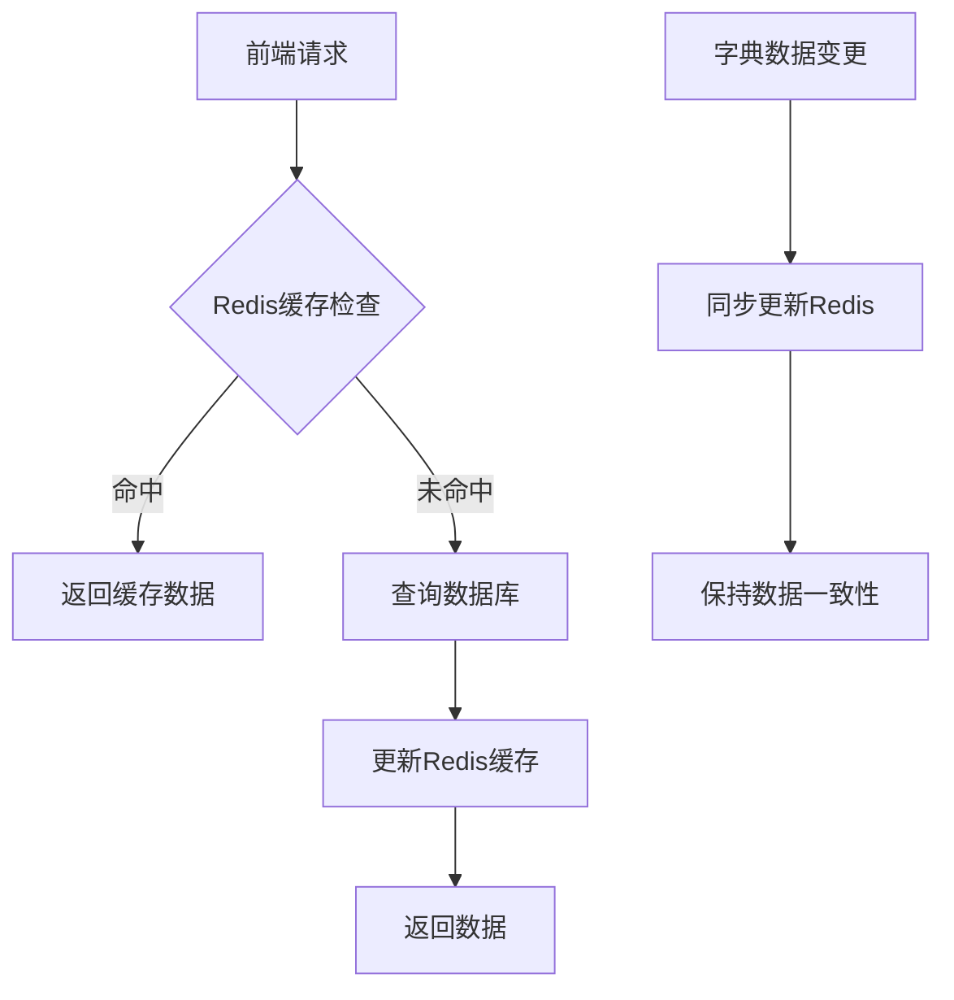
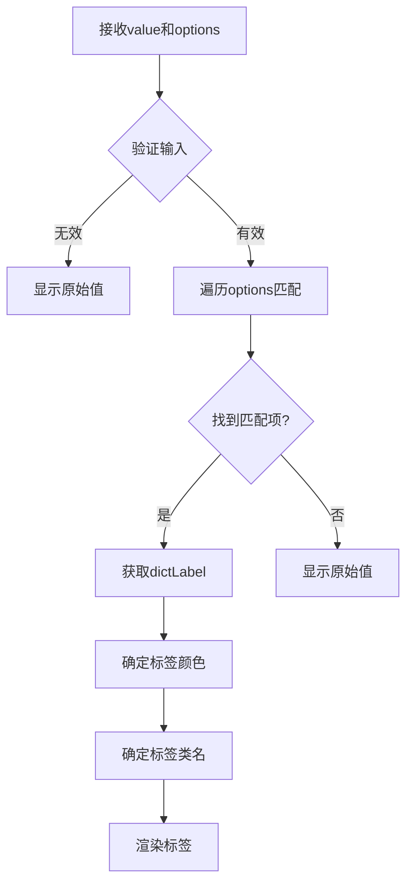
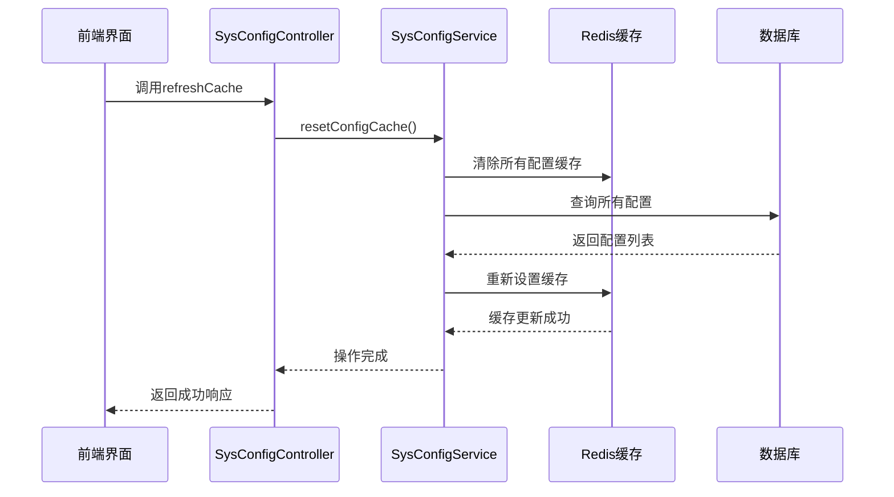

# 字典与参数管理

<cite>
**本文档引用文件**  
- [useDict.js](file://bear-jia-vue3\src\composables\useDict.js)
- [DictTag/index.vue](file://bear-jia-vue3\src\components\DictTag\index.vue)
- [data.js](file://bear-jia-vue3\src\api\system\dict\data.js)
- [type.js](file://bear-jia-vue3\src\api\system\dict\type.js)
- [config.js](file://bear-jia-vue3\src\api\system\config.js)
- [DictData.vue](file://bear-jia-vue3\src\views\system\dict\DictData.vue)
- [index.vue](file://bear-jia-vue3\src\views\system\config\index.vue)
- [BearJiaUtil.js](file://bear-jia-vue3\src\utils\BearJiaUtil.js)
- [DictUtils.java](file://bearjia-admin-backend\src\main\java\com\javaxiaobear\base\common\utils\DictUtils.java)
- [SysConfigController.java](file://bearjia-admin-backend\src\main\java\com\javaxiaobear\module\system\controller\SysConfigController.java)
- [SysConfigServiceImpl.java](file://bearjia-admin-backend\src\main\java\com\javaxiaobear\module\system\service\impl\SysConfigServiceImpl.java)
- [security.js](file://bear-jia-vue3\src\utils\security.js)
</cite>

## 目录
1. [字典类型管理](#字典类型管理)
2. [系统配置管理](#系统配置管理)
3. [字典缓存机制](#字典缓存机制)
4. [DictTag组件渲染机制](#dicttag组件渲染机制)
5. [配置热更新能力](#配置热更新能力)
6. [字典项操作实现](#字典项操作实现)
7. [前端字典数据获取](#前端字典数据获取)
8. [缓存同步策略](#缓存同步策略)
9. [敏感信息加密存储](#敏感信息加密存储)
10. [常见问题排查](#常见问题排查)

## 字典类型管理

字典类型（SysDictType）是系统中用于分类管理字典数据的元数据实体，每个字典类型对应一组相关的字典项。系统通过`SysDictType`实体来组织和管理不同类别的字典数据，如系统状态、通知类型等。

字典类型管理提供了完整的增删改查功能，包括字典类型编码（dictType）、字典类型名称（dictName）和状态控制。在前端实现中，`index.vue`页面通过ProTable组件展示字典类型列表，并支持搜索、导出和批量操作。页面使用`listType` API查询字典类型列表，`addType` API新增字典类型，`updateType` API修改字典类型，以及`delType` API删除字典类型。

字典类型的状态管理采用启用/禁用模式，通过`sys_normal_disable`字典来控制显示。当字典类型被禁用时，其下的所有字典数据将不可用。系统还支持字典类型的可展开行渲染，点击展开后可以查看该类型下的所有字典数据，实现了类型与数据的层级管理。

**Section sources**
- [type.js](file://bear-jia-vue3\src\api\system\dict\type.js#L1-L61)
- [index.vue](file://bear-jia-vue3\src\views\system\dict\index.vue#L1-L129)

## 系统配置管理

系统配置（SysConfig）是用于管理系统运行时参数的核心组件，支持配置项的动态管理和热更新。每个配置项包含配置名称（configName）、配置键名（configKey）、配置键值（configValue）和系统内置标识（configType）等属性。

配置管理界面通过`index.vue`实现，使用ProTable组件展示配置列表，支持按配置名称、键名、键值和系统内置状态进行搜索。配置项的系统内置标识通过`sys_yes_no`字典渲染为标签，便于识别。系统提供了完整的CRUD操作，包括新增配置（addConfig）、修改配置（updateConfig）、删除配置（delConfig）和导出配置（export）功能。

对于系统内置的配置项，系统实施了保护机制，禁止删除操作，确保核心配置的稳定性。配置管理还支持批量操作和权限控制，只有具备相应权限的用户才能执行特定操作。

**Section sources**
- [config.js](file://bear-jia-vue3\src\api\system\config.js#L1-L62)
- [index.vue](file://bear-jia-vue3\src\views\system\config\index.vue#L1-L100)

## 字典缓存机制

系统采用Redis作为字典数据的缓存层，显著提升了字典查询性能。字典缓存机制通过`DictUtils`工具类实现，该类提供了设置缓存、获取缓存和清除缓存的核心功能。

当系统启动时，`DictUtils`会自动加载所有字典数据到Redis缓存中，缓存键遵循`SYS_DICT_KEY + dictType`的命名规范。每次查询字典数据时，系统首先检查Redis缓存，如果存在则直接返回缓存数据，避免了数据库查询的开销。缓存的数据结构为`List<SysDictData>`，保持了字典项的完整信息。

缓存更新策略采用写时更新模式，当字典数据发生变更时，系统会同步更新Redis缓存。同时，系统提供了`refreshCache`接口，允许手动刷新整个字典缓存，确保缓存数据的一致性。缓存的过期策略由Redis配置决定，支持自动过期和手动清除。



**Diagram sources**
- [DictUtils.java](file://bearjia-admin-backend\src\main\java\com\javaxiaobear\base\common\utils\DictUtils.java#L1-L186)
- [data.js](file://bear-jia-vue3\src\api\system\dict\data.js#L1-L53)

## DictTag组件渲染机制

DictTag组件是用于根据字典类型和值渲染对应标签的通用组件，实现了字典数据的可视化展示。该组件通过`options`属性接收字典选项数组，通过`value`属性接收当前字典值，然后根据匹配结果渲染相应的标签。

组件的核心逻辑在`tagText`计算属性中实现，它遍历字典选项数组，查找与当前值匹配的项。系统兼容两种数据结构：标准格式`{dictValue, dictLabel}`和简化格式`{value, label}`，提高了组件的通用性。匹配成功后，组件显示对应的字典标签；若未找到匹配项，则直接显示原始值。

标签的样式通过`tagColor`和`tagClass`计算属性控制。`tagColor`根据字典项的`listClass`属性映射到Ant Design的颜色值，如'primary'映射为蓝色，'success'映射为绿色等。同时支持自定义颜色和类名，满足特殊场景的样式需求。组件还实现了默认颜色映射，对常见值如'0'(启用)和'1'(禁用)提供预设颜色。



**Diagram sources**
- [index.vue](file://bear-jia-vue3\src\components\DictTag\index.vue#L1-L143)
- [DictData.vue](file://bear-jia-vue3\src\views\system\dict\DictData.vue#L1-L140)

## 配置热更新能力

系统配置的热更新能力通过`SysConfigController`的`refreshCache`接口实现，允许在不重启服务的情况下更新配置。当配置项发生变更时，系统不仅更新数据库记录，还会同步更新Redis缓存，确保所有节点都能立即获取最新配置。

热更新流程由`SysConfigServiceImpl`的`resetConfigCache`方法驱动，该方法首先清除所有配置缓存，然后重新加载数据库中的配置到缓存中。这种"清除-重载"策略确保了缓存数据的完整性和一致性。缓存键遵循`SYS_CONFIG_KEY + configKey`的命名规范，便于精确管理。

前端通过调用`refreshCache` API触发热更新，该操作需要`system:config:remove`权限。更新完成后，系统会通知所有客户端刷新配置，确保配置变更的即时生效。对于系统内置的配置项，系统实施了额外的保护，禁止删除操作，防止关键配置被意外移除。



**Diagram sources**
- [SysConfigController.java](file://bearjia-admin-backend\src\main\java\com\javaxiaobear\module\system\controller\SysConfigController.java#L1-L133)
- [SysConfigServiceImpl.java](file://bearjia-admin-backend\src\main\java\com\javaxiaobear\module\system\service\impl\SysConfigServiceImpl.java#L1-L229)

## 字典项操作实现

字典项的增删改查操作通过`data.js`中的API函数实现，提供了完整的RESTful接口。查询操作包括`listData`（列表查询）和`getData`（详情查询），新增操作通过`addData`实现，修改操作通过`updateData`实现，删除操作通过`delData`实现。

在前端界面`DictData.vue`中，这些操作被集成到ProTable组件中。表格支持按字典值、字典标签和状态进行搜索，状态字段使用`sys_normal_disable`字典渲染为标签。操作列通过TableActionBar组件提供编辑、查看和删除功能，但删除功能被禁用，体现了系统对字典数据的保护策略。

字典项的排序通过`dictSort`字段实现，该字段决定了字典项在下拉列表中的显示顺序。状态控制通过`status`字段实现，支持启用和禁用两种状态。系统还支持字典项的导出功能，便于数据备份和迁移。

**Section sources**
- [data.js](file://bear-jia-vue3\src\api\system\dict\data.js#L1-L53)
- [DictData.vue](file://bear-jia-vue3\src\views\system\dict\DictData.vue#L1-L140)

## 前端字典数据获取

前端通过`useDict.js`组合式函数统一获取字典数据，实现了字典使用的简化和优化。该函数采用响应式设计，利用Vue 3的Composition API提供了一套简洁的字典数据管理方案。

`useDict`函数接收一个或多个字典类型作为参数，返回一个包含所有请求字典的响应式对象。函数内部实现了缓存机制，使用`dictCache`对象存储已加载的字典数据，避免重复请求。当首次请求某个字典类型时，函数会异步调用`BearJiaUtil.getDictsByType`从后端获取数据，并更新缓存。

除了`useDict`主函数，文件还提供了`getDictLabel`、`getDictValue`、`getDictClass`和`getDictTagType`等辅助函数，用于快速获取字典标签、值、CSS类名和标签类型。系统还提供了`clearDictCache`和`refreshDict`函数，用于手动管理字典缓存，支持开发和调试场景。

```mermaid
classDiagram
class useDict {
+dictTypes : string[]
+dicts : reactive{}
+dictCache : reactive{}
+useDict(...dictTypes) : Object
+getDictLabel(value, options) : string
+getDictValue(label, options) : string
+getDictClass(value, options) : string
+getDictTagType(value, options) : string
+clearDictCache(dictType) : void
+refreshDict(dictType) : Object
}
useDict --> BearJiaUtil : "依赖"
useDict --> Vue : "使用Composition API"
```

**Diagram sources**
- [useDict.js](file://bear-jia-vue3\src\composables\useDict.js#L1-L185)
- [BearJiaUtil.js](file://bear-jia-vue3\src\utils\BearJiaUtil.js#L1-L452)

## 缓存同步策略

系统的缓存同步策略采用主动更新与定期刷新相结合的方式，确保缓存数据的准确性和时效性。对于字典缓存，系统在应用启动时通过`@PostConstruct`注解自动加载所有字典数据到Redis，建立初始缓存。

当字典数据发生变更时，系统采用写时更新策略，同步更新数据库和Redis缓存。`DictUtils`提供了`setDictCache`和`removeDictCache`方法，确保缓存与数据库的一致性。系统还支持手动刷新缓存，通过`refreshCache`接口可以重新加载所有字典数据。

对于配置缓存，同步策略类似，但增加了额外的安全检查。系统会验证配置键名的唯一性，防止重复键名导致的冲突。当更新配置时，系统会先删除旧键名的缓存，再设置新键名的缓存，避免缓存污染。`clearConfigCache`和`loadingConfigCache`方法共同实现了缓存的完整刷新。

**Section sources**
- [DictUtils.java](file://bearjia-admin-backend\src\main\java\com\javaxiaobear\base\common\utils\DictUtils.java#L1-L186)
- [SysConfigServiceImpl.java](file://bearjia-admin-backend\src\main\java\com\javaxiaobear\module\system\service\impl\SysConfigServiceImpl.java#L1-L229)

## 敏感信息加密存储

系统对敏感信息实施了多层次的加密存储方案，确保数据安全。密码等敏感字段在存储前使用BCrypt算法进行哈希加密，该算法具有加盐和自适应工作因子的特点，能有效抵御彩虹表攻击。

在`SysPasswordService`中，系统使用`BCryptPasswordEncoder`对用户密码进行加密存储。`SecurityUtils`提供了`encryptPassword`和`matchesPassword`方法，分别用于密码加密和验证。系统还实现了密码重试限制和账户锁定机制，防止暴力破解攻击。

前端`security.js`文件提供了额外的安全防护，包括XSS防护、SQL注入防护和CSRF令牌管理。`secureStorage`对象支持数据的Base64编码存储，可选择性地对敏感信息进行加密。系统还实现了内容安全策略（CSP）和点击劫持防护，全面提升安全性。

**Section sources**
- [SysPasswordService.java](file://bearjia-admin-backend\src\main\java\com\javaxiaobear\base\framework\security\service\SysPasswordService.java#L1-L40)
- [SecurityUtils.java](file://bearjia-admin-backend\src\main\java\com\javaxiaobear\base\common\utils\SecurityUtils.java#L46-L147)
- [security.js](file://bear-jia-vue3\src\utils\security.js#L1-L244)

## 常见问题排查

### 字典标签不显示问题

当字典标签不显示时，可按以下步骤排查：

1. **检查字典类型是否存在**：确认`dictType`是否正确，对应的字典类型是否已在系统中定义
2. **验证字典数据完整性**：检查字典项的`dictValue`和`dictLabel`是否正确设置，确保值与标签的对应关系
3. **确认缓存状态**：检查Redis中是否存在对应字典类型的缓存，可通过`refreshCache`接口刷新缓存
4. **审查前端调用**：确认`useDict`是否正确调用，参数是否匹配后端定义的字典类型
5. **检查网络请求**：通过浏览器开发者工具查看`getDicts` API是否成功返回数据
6. **验证权限设置**：确认当前用户是否有访问字典数据的权限

### 配置更新不生效问题

当配置更新后未生效时，应检查：

1. **缓存是否同步更新**：确认`resetConfigCache`是否被正确调用，Redis中的配置缓存是否已更新
2. **配置键名唯一性**：检查是否有重复的配置键名导致冲突
3. **系统内置保护**：确认是否尝试修改系统内置配置项，这类配置通常受保护
4. **客户端刷新**：确保所有客户端已收到配置更新通知并刷新本地缓存

**Section sources**
- [useDict.js](file://bear-jia-vue3\src\composables\useDict.js#L1-L185)
- [DictTag/index.vue](file://bear-jia-vue3\src\components\DictTag\index.vue#L1-L143)
- [SysConfigServiceImpl.java](file://bearjia-admin-backend\src\main\java\com\javaxiaobear\module\system\service\impl\SysConfigServiceImpl.java#L1-L229)