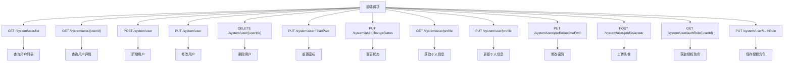
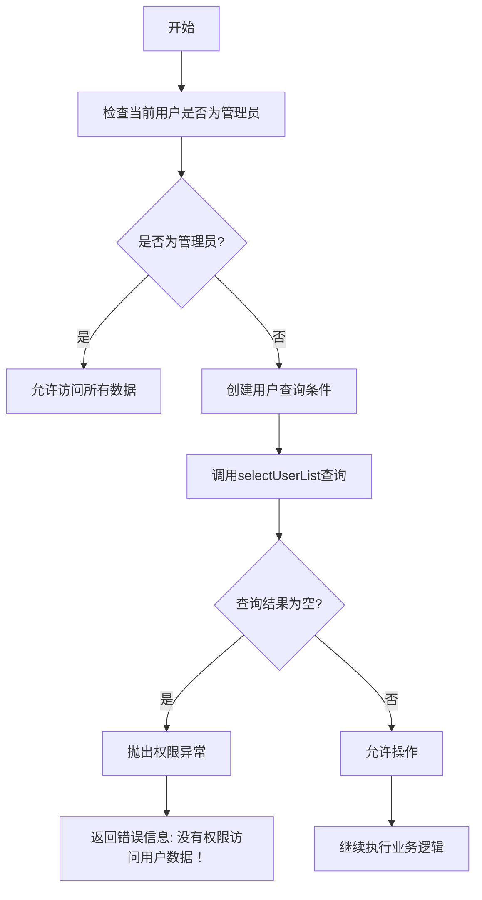
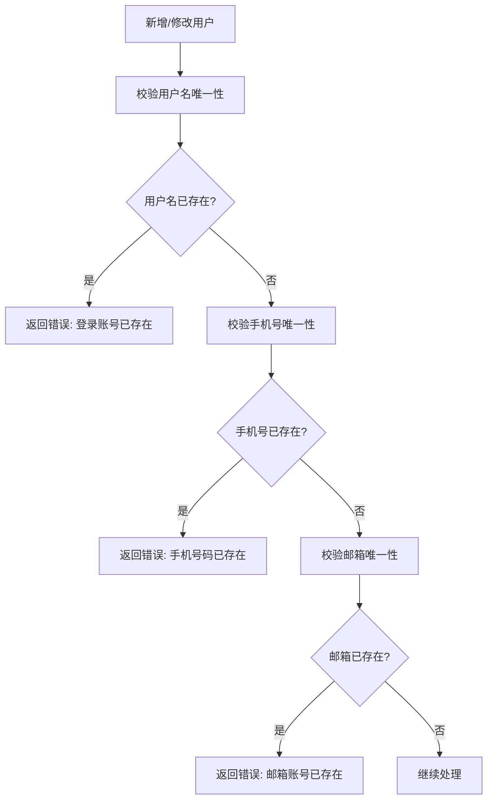
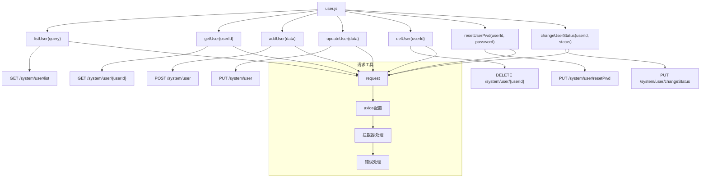
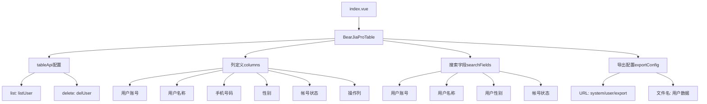
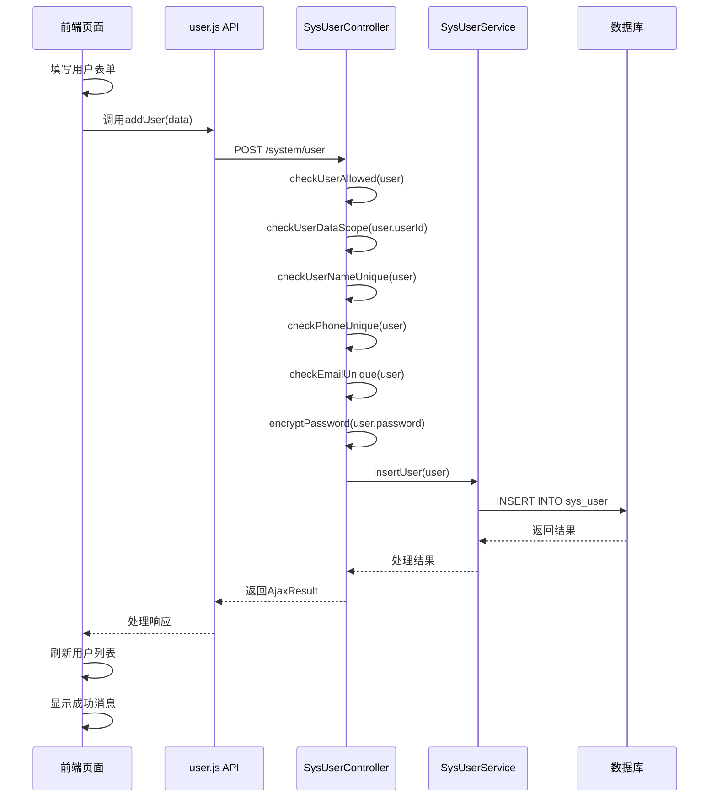
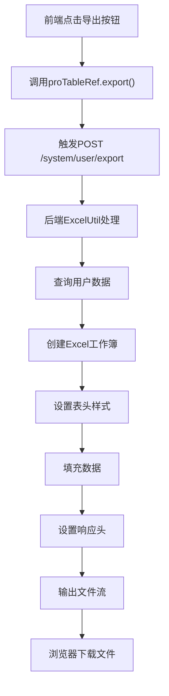
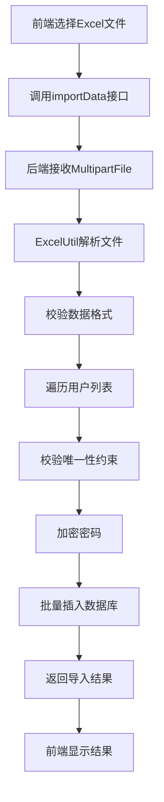

# 用户管理

<cite>
**本文档引用文件**   
- [user.js](file://bear-jia-vue3/src/api/system/user.js)
- [index.vue](file://bear-jia-vue3/src/views/system/user/index.vue)
- [addUpdateModal.vue](file://bear-jia-vue3/src/views/system/user/addUpdateModal.vue)
- [useResetPassword.vue](file://bear-jia-vue3/src/views/system/user/useResetPassword.vue)
- [SysUserController.java](file://bearjia-admin-backend/src/main/java/com/javaxiaobear/module/system/controller/SysUserController.java)
- [SysUser.java](file://bearjia-admin-backend/src/main/java/com/javaxiaobear/module/system/domain/SysUser.java)
- [SysUserServiceImpl.java](file://bearjia-admin-backend/src/main/java/com/javaxiaobear/module/system/service/impl/SysUserServiceImpl.java)
- [security.js](file://bear-jia-vue3/src/utils/security.js)
</cite>

## 目录
1. [用户管理功能概述](#用户管理功能概述)
2. [RESTful接口设计与实现](#restful接口设计与实现)
3. [用户数据权限校验机制](#用户数据权限校验机制)
4. [唯一性校验与安全措施](#唯一性校验与安全措施)
5. [SysUser实体类设计解析](#sysuser实体类设计解析)
6. [前端API封装与组件实现](#前端api封装与组件实现)
7. [用户创建流程序列图](#用户创建流程序列图)
8. [批量导入导出Excel实现](#批量导入导出excel实现)
9. [常见问题排查方案](#常见问题排查方案)

## 用户管理功能概述

用户管理功能是系统核心模块之一，提供完整的用户生命周期管理能力。该功能包含用户CRUD操作、状态变更、密码重置、角色分配等核心功能，通过前后端分离架构实现。前端基于Vue3和Ant Design Vue组件库构建，后端采用Spring Boot框架提供RESTful API服务。

系统通过精细化的权限控制确保数据安全，实现了用户数据范围校验、唯一性约束、密码加密存储等安全机制。前端使用BearJiaProTable组件实现用户列表的展示、搜索过滤、分页导出等功能，提供良好的用户体验。

**Section sources**
- [index.vue](file://bear-jia-vue3/src/views/system/user/index.vue#L1-L231)
- [SysUserController.java](file://bearjia-admin-backend/src/main/java/com/javaxiaobear/module/system/controller/SysUserController.java#L1-L258)

## RESTful接口设计与实现

用户管理模块提供了一套完整的RESTful API接口，遵循HTTP协议规范，使用标准的HTTP方法对应不同的操作类型。



**Diagram sources**
- [user.js](file://bear-jia-vue3/src/api/system/user.js#L1-L131)
- [SysUserController.java](file://bearjia-admin-backend/src/main/java/com/javaxiaobear/module/system/controller/SysUserController.java#L65-L257)

**Section sources**
- [user.js](file://bear-jia-vue3/src/api/system/user.js#L1-L131)
- [SysUserController.java](file://bearjia-admin-backend/src/main/java/com/javaxiaobear/module/system/controller/SysUserController.java#L65-L257)

## 用户数据权限校验机制

系统实现了严格的数据权限校验机制，确保用户只能访问和操作其权限范围内的数据。核心校验方法为`checkUserDataScope`，该方法在关键操作前进行权限验证。



该机制通过`@PreAuthorize`注解与自定义权限表达式`@ss.hasPermi`结合使用，实现方法级别的权限控制。在`SysUserController`中，几乎所有用户相关操作都包含了数据权限校验。

**Diagram sources**
- [SysUserController.java](file://bearjia-admin-backend/src/main/java/com/javaxiaobear/module/system/controller/SysUserController.java#L158-L160)
- [SysUserServiceImpl.java](file://bearjia-admin-backend/src/main/java/com/javaxiaobear/module/system/service/impl/SysUserServiceImpl.java#L234-L247)

**Section sources**
- [SysUserController.java](file://bearjia-admin-backend/src/main/java/com/javaxiaobear/module/system/controller/SysUserController.java#L158-L160)
- [SysUserServiceImpl.java](file://bearjia-admin-backend/src/main/java/com/javaxiaobear/module/system/service/impl/SysUserServiceImpl.java#L234-L247)

## 唯一性校验与安全措施

系统在用户管理中实施了多重安全措施，确保数据的完整性和安全性。

### 唯一性校验

系统对用户的关键字段实施了唯一性校验，防止重复数据的产生：



这些校验在`SysUserServiceImpl`中通过`checkUserNameUnique`、`checkPhoneUnique`和`checkEmailUnique`方法实现，使用数据库查询来验证唯一性约束。

### 密码加密存储

系统使用BCryptPasswordEncoder算法对用户密码进行加密存储，确保即使数据库泄露，用户密码也不会被轻易破解。

```mermaid
classDiagram
class SecurityUtils {
+static String encryptPassword(String password)
+static boolean matchesPassword(String rawPassword, String encodedPassword)
}
class SysUserController {
+AjaxResult add(SysUser user)
+AjaxResult resetPwd(SysUser user)
}
SecurityUtils --> SysUserController : "调用"
note right of SecurityUtils
使用BCrypt算法对密码进行哈希加密
加密过程包含随机盐值，确保相同
密码每次加密结果都不同
end note
```

**Diagram sources**
- [SysUserController.java](file://bearjia-admin-backend/src/main/java/com/javaxiaobear/module/system/controller/SysUserController.java#L146-L147)
- [SecurityUtils.java](file://bearjia-admin-backend/src/main/java/com/javaxiaobear/base/common/utils/SecurityUtils.java#L97-L101)

**Section sources**
- [SysUserController.java](file://bearjia-admin-backend/src/main/java/com/javaxiaobear/module/system/controller/SysUserController.java#L146-L147)
- [security.js](file://bear-jia-vue3/src/utils/security.js#L26-L42)

## SysUser实体类设计解析

`SysUser`实体类是用户管理的核心数据模型，定义了用户的所有属性和行为。

```mermaid
classDiagram
class SysUser {
-Long userId
-Long deptId
-String userName
-String nickName
-String email
-String phonenumber
-String sex
-String avatar
-String password
-String status
-String delFlag
-String loginIp
-Date loginDate
-SysDept dept
-SysRole[] roles
-Long[] roleIds
-Long[] postIds
-Long roleId
+boolean isAdmin()
+static boolean isAdmin(Long userId)
}
class SysDept {
-Long deptId
-String deptName
-String leader
}
class SysRole {
-Long roleId
-String roleName
-String roleKey
}
SysUser --> SysDept : "拥有"
SysUser --> SysRole : "拥有多个"
note right of SysUser
userId : 用户唯一标识
userName : 登录账号，唯一约束
status : 用户状态(0正常 1停用)
delFlag : 删除标志(0存在 2删除)
isAdmin() : 判断是否为超级管理员
end note
```

核心字段设计逻辑：
- **用户状态**：使用字符串类型存储状态值（0正常，1停用），便于与字典表关联显示
- **部门关联**：通过`deptId`字段关联部门，同时包含`dept`对象用于关联查询结果
- **岗位关联**：使用`postIds`数组存储用户关联的多个岗位ID
- **角色分配**：使用`roleIds`数组存储用户拥有的角色ID，`roles`集合存储完整的角色对象

**Diagram sources**
- [SysUser.java](file://bearjia-admin-backend/src/main/java/com/javaxiaobear/module/system/domain/SysUser.java#L20-L325)
- [SysUserController.java](file://bearjia-admin-backend/src/main/java/com/javaxiaobear/module/system/controller/SysUserController.java#L113-L120)

**Section sources**
- [SysUser.java](file://bearjia-admin-backend/src/main/java/com/javaxiaobear/module/system/domain/SysUser.java#L20-L325)

## 前端API封装与组件实现

前端通过模块化的方式封装用户管理API，并使用BearJiaProTable组件实现用户列表功能。

### API封装



### BearJiaProTable实现

用户列表页面使用BearJiaProTable组件实现数据展示和交互功能：



组件通过`v-hasPermi`指令实现按钮级别的权限控制，确保用户只能看到和操作其权限范围内的功能。

**Diagram sources**
- [user.js](file://bear-jia-vue3/src/api/system/user.js#L1-L131)
- [index.vue](file://bear-jia-vue3/src/views/system/user/index.vue#L1-L231)

**Section sources**
- [user.js](file://bear-jia-vue3/src/api/system/user.js#L1-L131)
- [index.vue](file://bear-jia-vue3/src/views/system/user/index.vue#L1-L231)

## 用户创建流程序列图

用户创建流程展示了从前端表单提交到后端数据库持久化的完整链路：



该流程体现了系统完整的业务处理链条，包括权限校验、数据验证、密码加密和数据库操作等关键步骤。

**Diagram sources**
- [addUpdateModal.vue](file://bear-jia-vue3/src/views/system/user/addUpdateModal.vue#L134-L140)
- [SysUserController.java](file://bearjia-admin-backend/src/main/java/com/javaxiaobear/module/system/controller/SysUserController.java#L131-L148)

## 批量导入导出Excel实现

系统提供了用户数据的批量导入导出功能，支持Excel文件格式。

### 导出实现



### 导入实现



导出功能通过`exportConfig`配置实现，导入功能支持更新已存在用户数据的选项。

**Diagram sources**
- [SysUserController.java](file://bearjia-admin-backend/src/main/java/com/javaxiaobear/module/system/controller/SysUserController.java#L74-L101)
- [index.vue](file://bear-jia-vue3/src/views/system/user/index.vue#L33-L35)

**Section sources**
- [SysUserController.java](file://bearjia-admin-backend/src/main/java/com/javaxiaobear/module/system/controller/SysUserController.java#L74-L101)
- [index.vue](file://bear-jia-vue3/src/views/system/user/index.vue#L33-L35)

## 常见问题排查方案

### 当前用户不能删除

**问题描述**：尝试删除当前登录用户时，系统提示"当前用户不能删除"。

**原因分析**：系统安全机制禁止用户删除自己，防止管理员账户被意外删除导致系统无法管理。

**解决方案**：
1. 使用其他管理员账户登录系统
2. 执行删除操作
3. 如需删除唯一管理员账户，需通过数据库直接操作

**相关代码**：
```java
if (ArrayUtils.contains(userIds, getUserId()))
{
    return error("当前用户不能删除");
}
```

### 登录账号已存在

**问题描述**：新增或修改用户时，系统提示"登录账号已存在"。

**原因分析**：系统对用户名实施了唯一性约束，防止重复账号。

**解决方案**：
1. 检查输入的用户名是否与其他用户重复
2. 修改为唯一的用户名
3. 如需修改现有用户账号，先通过用户列表查找并编辑

**相关代码**：
```java
if (!userService.checkUserNameUnique(user))
{
    return error("新增用户'" + user.getUserName() + "'失败，登录账号已存在");
}
```

### 其他常见问题

| 问题现象 | 可能原因 | 解决方案 |
|---------|--------|---------|
| 密码重置失败 | 新密码与旧密码相同 | 确保新密码与旧密码不同 |
| 角色分配无效 | 无角色管理权限 | 检查当前用户权限配置 |
| 部门选择无数据 | 部门树加载失败 | 刷新页面或检查网络连接 |
| 批量导入失败 | Excel格式不正确 | 使用模板文件进行导入 |

**Section sources**
- [SysUserController.java](file://bearjia-admin-backend/src/main/java/com/javaxiaobear/module/system/controller/SysUserController.java#L184-L187)
- [SysUserController.java](file://bearjia-admin-backend/src/main/java/com/javaxiaobear/module/system/controller/SysUserController.java#L133-L136)
- [errorCode.js](file://bear-jia-vue3/src/utils/errorCode.js#L1-L7)