# 系统管理模块

<cite>
**本文档引用文件**   
- [SysUserController.java](file://bearjia-admin-backend/src/main/java/com/javaxiaobear/module/system/controller/SysUserController.java)
- [ISysRoleService.java](file://bearjia-admin-backend/src/main/java/com/javaxiaobear/module/system/service/ISysRoleService.java)
- [SysMenuController.java](file://bearjia-admin-backend/src/main/java/com/javaxiaobear/module/system/controller/SysMenuController.java)
- [SysDeptController.java](file://bearjia-admin-backend/src/main/java/com/javaxiaobear/module/system/controller/SysDeptController.java)
- [SysUser.java](file://bearjia-admin-backend/src/main/java/com/javaxiaobear/module/system/domain/SysUser.java)
- [SysRole.java](file://bearjia-admin-backend/src/main/java/com/javaxiaobear/module/system/domain/SysRole.java)
- [SysUserMapper.java](file://bearjia-admin-backend/src/main/java/com/javaxiaobear/module/system/mapper/SysUserMapper.java)
- [SysUserMapper.xml](file://bearjia-admin-backend/src/main/resources/mybatis/system/SysUserMapper.xml)
- [SysMenuMapper.xml](file://bearjia-admin-backend/src/main/resources/mybatis/system/SysMenuMapper.xml)
- [SysDeptMapper.xml](file://bearjia-admin-backend/src/main/resources/mybatis/system/SysDeptMapper.xml)
- [SysUserServiceImpl.java](file://bearjia-admin-backend/src/main/java/com/javaxiaobear/module/system/service/impl/SysUserServiceImpl.java)
- [SysMenuServiceImpl.java](file://bearjia-admin-backend/src/main/java/com/javaxiaobear/module/system/service/impl/SysMenuServiceImpl.java)
- [SysDeptServiceImpl.java](file://bearjia-admin-backend/src/main/java/com/javaxiaobear/module/system/service/impl/SysDeptServiceImpl.java)
- [application.yml](file://bearjia-admin-backend/src/main/resources/application.yml)
</cite>

## 目录
1. [系统管理模块](#系统管理模块)
2. [核心功能概述](#核心功能概述)
3. [用户管理功能](#用户管理功能)
4. [角色与权限管理](#角色与权限管理)
5. [菜单管理功能](#菜单管理功能)
6. [部门管理功能](#部门管理功能)
7. [实体类设计与约束](#实体类设计与约束)
8. [服务间调用关系](#服务间调用关系)
9. [缓存策略与性能优化](#缓存策略与性能优化)
10. [常见问题排查指南](#常见问题排查指南)

## 核心功能概述

系统管理模块是整个后台管理系统的核心组成部分，主要负责用户、角色、菜单、部门、岗位、字典、参数等基础数据的管理。该模块通过RESTful API提供完整的CRUD操作，实现了用户身份认证、权限控制、数据权限管理等关键功能。

模块采用典型的分层架构设计，包括Controller层、Service层、Mapper层和Entity层。通过Spring Security实现权限控制，利用MyBatis进行数据库操作，结合Redis缓存提升系统性能。各功能模块之间通过清晰的接口定义进行交互，确保了系统的可维护性和扩展性。

系统管理模块的核心功能包括：
- 用户管理：提供用户CRUD操作、状态管理、角色分配等功能
- 角色管理：实现角色的创建、修改、删除及权限配置
- 菜单管理：支持动态菜单加载与权限过滤
- 部门管理：实现部门树形结构的递归查询与管理
- 字典管理：提供系统字典数据的维护功能
- 参数管理：支持系统参数的配置与管理

**Section sources**
- [SysUserController.java](file://bearjia-admin-backend/src/main/java/com/javaxiaobear/module/system/controller/SysUserController.java)
- [ISysRoleService.java](file://bearjia-admin-backend/src/main/java/com/javaxiaobear/module/system/service/ISysRoleService.java)
- [SysMenuController.java](file://bearjia-admin-backend/src/main/java/com/javaxiaobear/module/system/controller/SysMenuController.java)
- [SysDeptController.java](file://bearjia-admin-backend/src/main/java/com/javaxiaobear/module/system/controller/SysDeptController.java)

## 用户管理功能

### RESTful接口设计

用户管理功能通过`SysUserController`类提供了完整的RESTful API接口，实现了用户信息的增删改查操作。

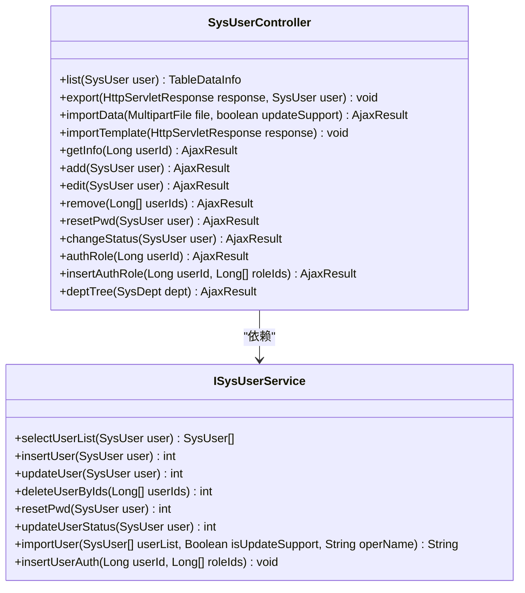

**Diagram sources**
- [SysUserController.java](file://bearjia-admin-backend/src/main/java/com/javaxiaobear/module/system/controller/SysUserController.java#L48-L257)
- [ISysUserService.java](file://bearjia-admin-backend/src/main/java/com/javaxiaobear/module/system/service/ISysUserService.java)

### 用户CRUD操作

用户CRUD操作是系统管理模块的基础功能，通过`SysUserController`中的相应方法实现。

**用户查询**：`list`方法实现了用户列表的分页查询功能，支持按用户名、手机号、状态等条件进行筛选。该方法通过`@PreAuthorize("@ss.hasPermi('system:user:list')")`注解进行权限校验，确保只有具备相应权限的用户才能访问。

**用户新增**：`add`方法实现了用户新增功能，在保存用户信息前会进行用户名、手机号、邮箱的唯一性校验。新用户的密码会通过`SecurityUtils.encryptPassword()`方法进行加密存储。

**用户修改**：`edit`方法实现了用户信息的修改功能，同样会进行数据唯一性校验。在修改用户信息时，会自动记录操作人和更新时间。

**用户删除**：`remove`方法实现了用户删除功能，采用逻辑删除的方式，将用户的`del_flag`字段设置为'2'。删除时会检查是否尝试删除当前登录用户。

### 状态管理与角色分配

用户状态管理通过`changeStatus`方法实现，可以将用户状态在"正常"和"停用"之间切换。该操作需要`system:user:edit`权限。

角色分配功能通过两个接口实现：
- `authRole`：获取指定用户的角色信息，用于角色分配页面的初始化
- `insertAuthRole`：为用户分配角色，会先删除用户原有的角色关联，然后重新建立新的角色关联

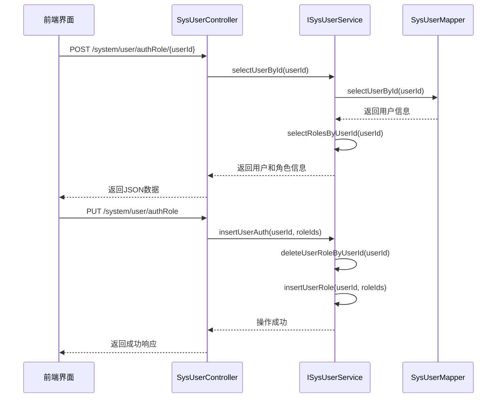

**Diagram sources**
- [SysUserController.java](file://bearjia-admin-backend/src/main/java/com/javaxiaobear/module/system/controller/SysUserController.java#L220-L246)
- [SysUserServiceImpl.java](file://bearjia-admin-backend/src/main/java/com/javaxiaobear/module/system/service/impl/SysUserServiceImpl.java#L308-L314)

**Section sources**
- [SysUserController.java](file://bearjia-admin-backend/src/main/java/com/javaxiaobear/module/system/controller/SysUserController.java)
- [SysUserServiceImpl.java](file://bearjia-admin-backend/src/main/java/com/javaxiaobear/module/system/service/impl/SysUserServiceImpl.java)

## 角色与权限管理

### 权限校验机制

角色与权限管理通过`ISysRoleService`接口及其实现类`SysRoleServiceImpl`提供服务。权限校验主要通过Spring Security的注解和自定义权限表达式实现。

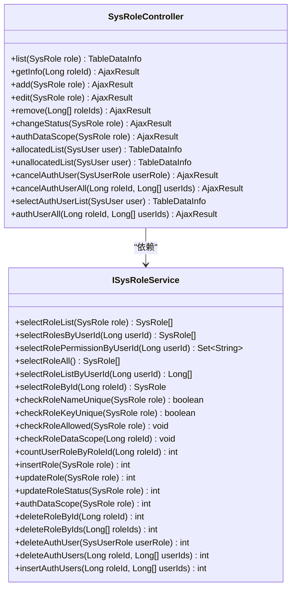

**Diagram sources**
- [ISysRoleService.java](file://bearjia-admin-backend/src/main/java/com/javaxiaobear/module/system/service/ISysRoleService.java)
- [SysRoleController.java](file://bearjia-admin-backend/src/main/java/com/javaxiaobear/module/system/controller/SysRoleController.java)

### 数据权限控制

数据权限控制是系统安全的重要组成部分，通过`DataScope`注解和`DataScopeAspect`切面实现。系统支持五种数据权限范围：

| 数据权限类型 | 描述 |
|------------|------|
| 1 | 所有数据权限 |
| 2 | 自定义数据权限 |
| 3 | 本部门数据权限 |
| 4 | 本部门及以下数据权限 |
| 5 | 仅本人数据权限 |

在`ISysRoleService`接口中，`checkRoleDataScope`方法用于校验角色的数据权限，确保当前用户只能访问其权限范围内的数据。

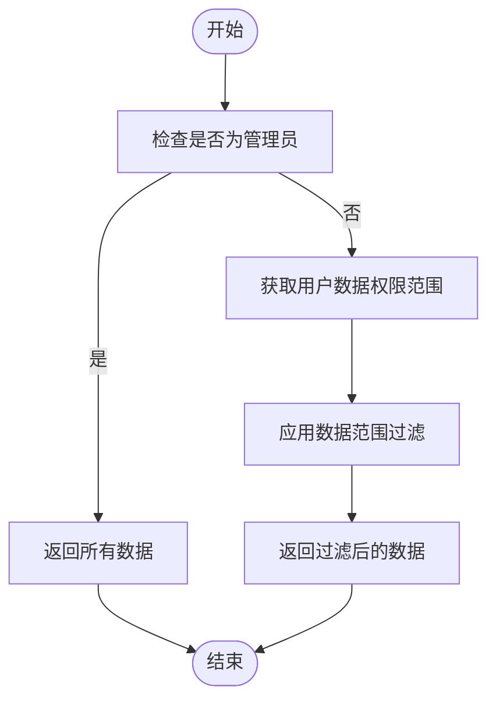

**Diagram sources**
- [ISysRoleService.java](file://bearjia-admin-backend/src/main/java/com/javaxiaobear/module/system/service/ISysRoleService.java#L85-L91)
- [application.yml](file://bearjia-admin-backend/src/main/resources/application.yml#L131-L134)

**Section sources**
- [ISysRoleService.java](file://bearjia-admin-backend/src/main/java/com/javaxiaobear/module/system/service/ISysRoleService.java)
- [SysRoleServiceImpl.java](file://bearjia-admin-backend/src/main/java/com/javaxiaobear/module/system/service/impl/SysRoleServiceImpl.java)

## 菜单管理功能

### 动态菜单加载

菜单管理功能通过`SysMenuController`和`SysMenuServiceImpl`实现动态菜单加载。系统根据当前用户的角色权限，动态生成可访问的菜单列表。

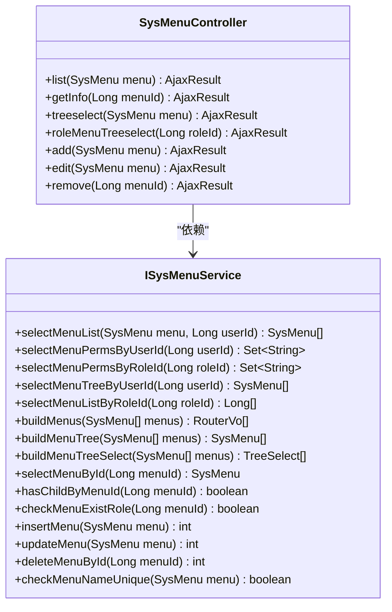

**Diagram sources**
- [SysMenuController.java](file://bearjia-admin-backend/src/main/java/com/javaxiaobear/module/system/controller/SysMenuController.java)
- [ISysMenuService.java](file://bearjia-admin-backend/src/main/java/com/javaxiaobear/module/system/service/ISysMenuService.java)

### 权限过滤机制

菜单权限过滤通过`selectMenuList`方法实现，该方法根据用户ID查询其可访问的菜单列表。对于管理员用户，返回所有菜单；对于普通用户，根据其角色权限返回相应的菜单。

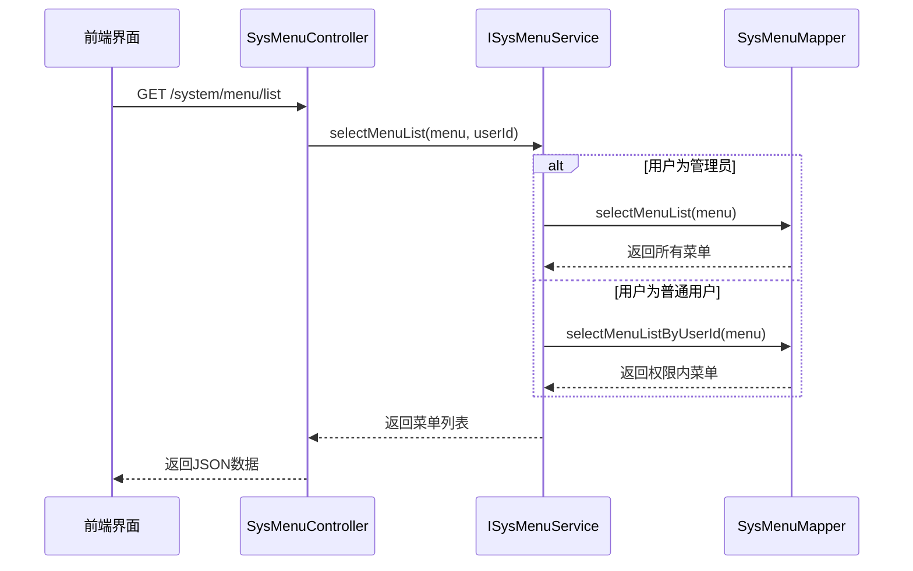

**Diagram sources**
- [SysMenuController.java](file://bearjia-admin-backend/src/main/java/com/javaxiaobear/module/system/controller/SysMenuController.java#L39-L45)
- [SysMenuServiceImpl.java](file://bearjia-admin-backend/src/main/java/com/javaxiaobear/module/system/service/impl/SysMenuServiceImpl.java#L54-L80)

**Section sources**
- [SysMenuController.java](file://bearjia-admin-backend/src/main/java/com/javaxiaobear/module/system/controller/SysMenuController.java)
- [SysMenuServiceImpl.java](file://bearjia-admin-backend/src/main/java/com/javaxiaobear/module/system/service/impl/SysMenuServiceImpl.java)

## 部门管理功能

### 部门树形结构

部门管理功能通过`SysDeptController`和`SysDeptServiceImpl`实现树形结构的部门管理。系统使用递归查询的方式构建部门树，支持无限层级的部门结构。

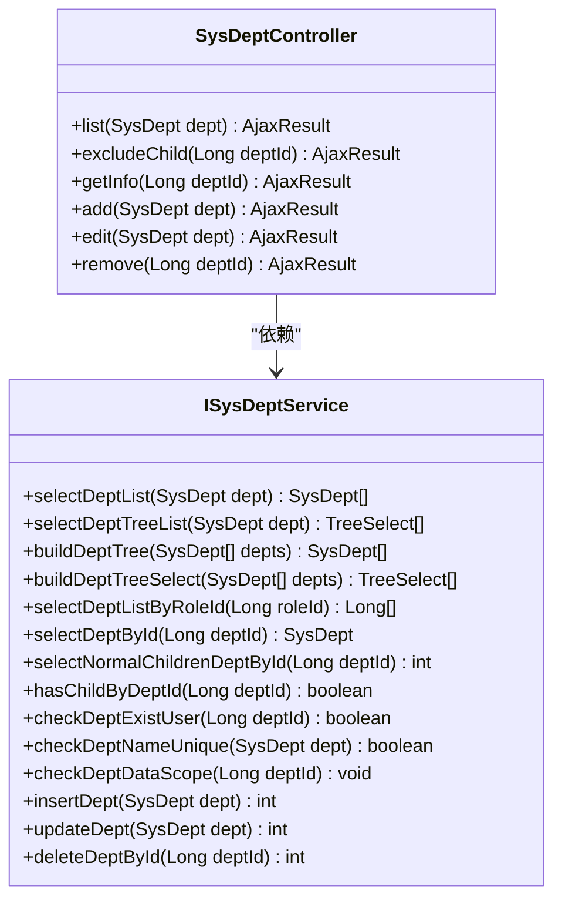

**Diagram sources**
- [SysDeptController.java](file://bearjia-admin-backend/src/main/java/com/javaxiaobear/module/system/controller/SysDeptController.java)
- [ISysDeptService.java](file://bearjia-admin-backend/src/main/java/com/javaxiaobear/module/system/service/ISysDeptService.java)

### 递归查询与缓存策略

部门树的递归查询通过`buildDeptTree`方法实现，该方法使用递归算法构建完整的部门树结构。为了提高查询性能，系统采用了缓存策略。

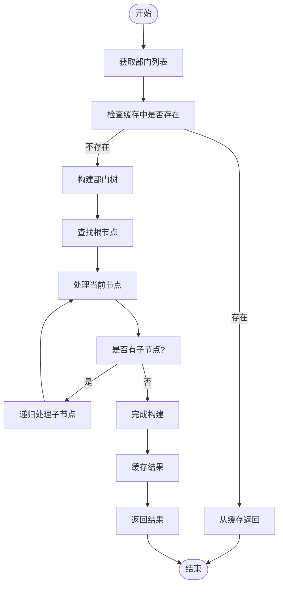

**Diagram sources**
- [SysDeptServiceImpl.java](file://bearjia-admin-backend/src/main/java/com/javaxiaobear/module/system/service/impl/SysDeptServiceImpl.java#L69-L89)
- [SysDeptMapper.xml](file://bearjia-admin-backend/src/main/resources/mybatis/system/SysDeptMapper.xml)

**Section sources**
- [SysDeptController.java](file://bearjia-admin-backend/src/main/java/com/javaxiaobear/module/system/controller/SysDeptController.java)
- [SysDeptServiceImpl.java](file://bearjia-admin-backend/src/main/java/com/javaxiaobear/module/system/service/impl/SysDeptServiceImpl.java)

## 实体类设计与约束

### 核心实体类

系统管理模块的核心实体类包括`SysUser`、`SysRole`、`SysMenu`、`SysDept`等，这些类定义了系统的基础数据结构。

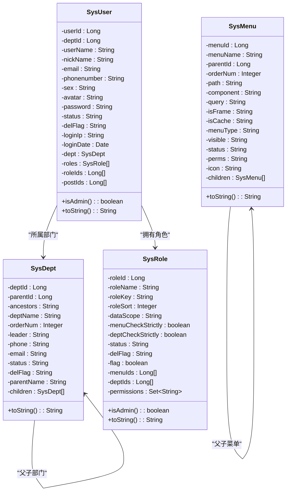

**Diagram sources**
- [SysUser.java](file://bearjia-admin-backend/src/main/java/com/javaxiaobear/module/system/domain/SysUser.java)
- [SysRole.java](file://bearjia-admin-backend/src/main/java/com/javaxiaobear/module/system/domain/SysRole.java)
- [SysMenu.java](file://bearjia-admin-backend/src/main/java/com/javaxiaobear/module/system/domain/SysMenu.java)
- [SysDept.java](file://bearjia-admin-backend/src/main/java/com/javaxiaobear/module/system/domain/SysDept.java)

### 字段设计与约束

各实体类的字段设计遵循了数据库设计规范，并通过注解定义了数据验证规则。

**SysUser实体类字段约束：**
- `userId`: 用户ID，主键
- `userName`: 用户账号，必填，长度不超过30个字符
- `nickName`: 用户昵称，长度不超过30个字符
- `email`: 用户邮箱，格式验证，长度不超过50个字符
- `phonenumber`: 手机号码，长度不超过11个字符
- `sex`: 用户性别，0=男,1=女,2=未知
- `status`: 帐号状态，0=正常,1=停用
- `delFlag`: 删除标志，0=存在,2=删除

**SysRole实体类字段约束：**
- `roleId`: 角色ID，主键
- `roleName`: 角色名称，必填，长度不超过30个字符
- `roleKey`: 角色权限字符，必填，长度不超过100个字符
- `roleSort`: 角色排序，必填
- `dataScope`: 数据范围，1=所有数据权限,2=自定义数据权限,3=本部门数据权限,4=本部门及以下数据权限,5=仅本人数据权限
- `status`: 角色状态，0=正常,1=停用

**MyBatis映射文件中的复杂查询：**

在`SysUserMapper.xml`中，`selectUserList`查询使用了动态SQL，支持多条件组合查询：

```xml
<select id="selectUserList" parameterType="SysUser" resultMap="SysUserResult">
    select u.user_id, u.dept_id, u.nick_name, u.user_name, u.email, u.avatar, u.phonenumber, u.sex, u.status, u.del_flag, u.login_ip, u.login_date, u.create_by, u.create_time, u.remark, d.dept_name, d.leader from sys_user u
    left join sys_dept d on u.dept_id = d.dept_id
    where u.del_flag = '0'
    <if test="userId != null and userId != 0">
        AND u.user_id = #{userId}
    </if>
    <if test="userName != null and userName != ''">
        AND u.user_name like concat('%', #{userName}, '%')
    </if>
    <if test="status != null and status != ''">
        AND u.status = #{status}
    </if>
    <!-- 其他条件 -->
    ${params.dataScope}
</select>
```

**Section sources**
- [SysUser.java](file://bearjia-admin-backend/src/main/java/com/javaxiaobear/module/system/domain/SysUser.java)
- [SysRole.java](file://bearjia-admin-backend/src/main/java/com/javaxiaobear/module/system/domain/SysRole.java)
- [SysUserMapper.xml](file://bearjia-admin-backend/src/main/resources/mybatis/system/SysUserMapper.xml)

## 服务间调用关系

### 用户-角色-菜单关联处理

系统管理模块中的各个服务之间存在复杂的调用关系，特别是在处理用户、角色、菜单的关联时。

```mermaid
graph TD
UserController --> UserService
RoleController --> RoleService
MenuController --> MenuService
DeptController --> DeptService
UserService --> RoleService
UserService --> DeptService
UserService --> PostService
MenuService --> RoleService
DeptService --> RoleService
UserService -.-> "用户角色分配" .-> RoleService
RoleService -.-> "角色菜单权限" .-> MenuService
DeptService -.-> "部门数据权限" .-> RoleService
```

**Diagram sources**
- [SysUserController.java](file://bearjia-admin-backend/src/main/java/com/javaxiaobear/module/system/controller/SysUserController.java#L50-L60)
- [SysMenuServiceImpl.java](file://bearjia-admin-backend/src/main/java/com/javaxiaobear/module/system/service/impl/SysMenuServiceImpl.java#L38-L45)
- [SysDeptServiceImpl.java](file://bearjia-admin-backend/src/main/java/com/javaxiaobear/module/system/service/impl/SysDeptServiceImpl.java#L32-L36)

### 典型场景流程

**用户创建流程：**
1. 前端调用`SysUserController`的`add`方法
2. `SysUserController`调用`ISysUserService`的`insertUser`方法
3. `SysUserServiceImpl`执行以下操作：
   - 调用`SysUserMapper.insertUser`插入用户基本信息
   - 调用`insertUserPost`方法插入用户岗位关联
   - 调用`insertUserRole`方法插入用户角色关联

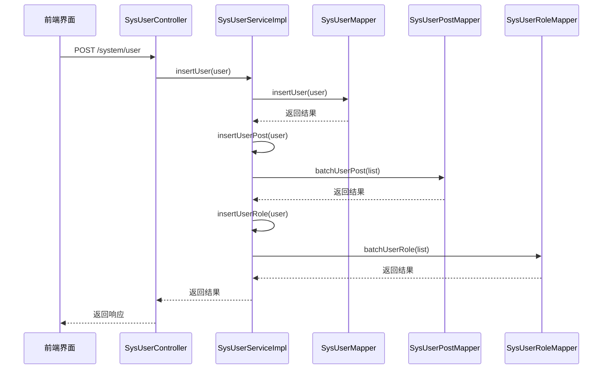

**Diagram sources**
- [SysUserController.java](file://bearjia-admin-backend/src/main/java/com/javaxiaobear/module/system/controller/SysUserController.java#L128-L148)
- [SysUserServiceImpl.java](file://bearjia-admin-backend/src/main/java/com/javaxiaobear/module/system/service/impl/SysUserServiceImpl.java#L255-L266)

**角色权限配置流程：**
1. 前端调用`SysRoleController`的`authDataScope`方法
2. `SysRoleController`调用`ISysRoleService`的`authDataScope`方法
3. `SysRoleServiceImpl`更新角色的数据权限范围

**菜单权限计算流程：**
1. 前端调用`SysMenuController`的`list`方法
2. `SysMenuController`调用`ISysMenuService`的`selectMenuList`方法
3. `SysMenuServiceImpl`根据用户ID查询其可访问的菜单列表
4. 返回过滤后的菜单数据

**Section sources**
- [SysUserController.java](file://bearjia-admin-backend/src/main/java/com/javaxiaobear/module/system/controller/SysUserController.java)
- [SysUserServiceImpl.java](file://bearjia-admin-backend/src/main/java/com/javaxiaobear/module/system/service/impl/SysUserServiceImpl.java)
- [SysMenuServiceImpl.java](file://bearjia-admin-backend/src/main/java/com/javaxiaobear/module/system/service/impl/SysMenuServiceImpl.java)

## 缓存策略与性能优化

### Redis缓存应用

系统通过Redis缓存提升查询性能，主要应用于以下几个方面：

1. **用户信息缓存**：将频繁访问的用户基本信息缓存到Redis中，减少数据库查询压力
2. **菜单权限缓存**：缓存用户的菜单权限信息，避免每次请求都进行复杂的权限计算
3. **字典数据缓存**：系统字典数据通常不经常变化，适合缓存以提高访问速度
4. **登录会话缓存**：存储用户的登录会话信息，支持分布式环境下的会话共享

在`application.yml`配置文件中，Redis的配置如下：
```yaml
spring:
  redis:
    host: localhost
    port: 6379
    database: 0
    timeout: 10s
    lettuce:
      pool:
        min-idle: 0
        max-idle: 8
        max-active: 8
        max-wait: -1ms
```

### 查询性能优化

系统通过多种方式优化查询性能：

**分页查询**：使用PageHelper插件实现分页查询，避免一次性加载大量数据
```yaml
pagehelper:
  helperDialect: mysql
  supportMethodsArguments: true
  params: count=countSql
```

**数据范围过滤**：在查询SQL中动态添加数据范围过滤条件，确保用户只能访问其权限范围内的数据

**索引优化**：在数据库的关键字段上创建索引，如`user_name`、`phonenumber`、`email`等，提高查询效率

**批量操作**：对于批量插入、更新、删除操作，使用批量处理方法减少数据库交互次数

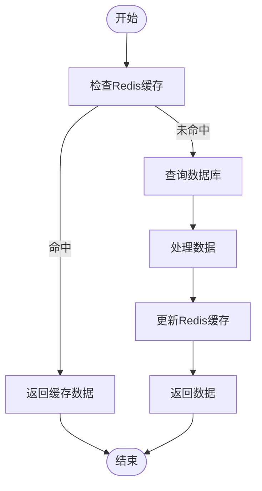

**Diagram sources**
- [application.yml](file://bearjia-admin-backend/src/main/resources/application.yml#L69-L90)
- [SysUserMapper.xml](file://bearjia-admin-backend/src/main/resources/mybatis/system/SysUserMapper.xml)
- [SysMenuMapper.xml](file://bearjia-admin-backend/src/main/resources/mybatis/system/SysMenuMapper.xml)

**Section sources**
- [application.yml](file://bearjia-admin-backend/src/main/resources/application.yml)
- [SysUserMapper.xml](file://bearjia-admin-backend/src/main/resources/mybatis/system/SysUserMapper.xml)

## 常见问题排查指南

### 权限不生效问题

**问题现象**：用户无法访问已授权的菜单或功能

**排查步骤：**
1. 检查用户是否已正确分配角色
2. 检查角色是否已配置相应的菜单权限
3. 清除Redis缓存，重新登录系统
4. 检查`@PreAuthorize`注解的权限标识是否正确
5. 查看日志文件，确认是否有权限校验失败的记录

**解决方案：**
- 确保用户-角色-菜单的关联关系正确
- 重启应用服务器，清除可能的缓存问题
- 检查数据库中`sys_role_menu`表的记录是否正确

### 数据无法显示问题

**问题现象**：列表页面无法显示数据，或数据显示不完整

**排查步骤：**
1. 检查数据库连接是否正常
2. 查看SQL执行日志，确认查询语句是否正确
3. 检查数据范围过滤条件是否过于严格
4. 确认用户是否具有访问相关数据的权限
5. 检查前端请求参数是否正确

**解决方案：**
- 检查`DataScope`注解的配置是否正确
- 确认用户的数据权限范围设置合理
- 检查MyBatis映射文件中的SQL语句是否有误
- 查看控制台和日志文件中的错误信息

### 用户登录问题

**问题现象**：用户无法登录系统

**排查步骤：**
1. 检查用户名和密码是否正确
2. 确认用户状态是否为"正常"
3. 检查账户是否被锁定
4. 查看Redis中是否有该用户的会话信息
5. 检查JWT令牌配置是否正确

**解决方案：**
- 重置用户密码
- 检查`application.yml`中的`user.password`配置
- 确认`token.secret`配置正确
- 清除Redis中的会话数据

### 性能问题

**问题现象**：系统响应缓慢，页面加载时间长

**排查步骤：**
1. 检查数据库性能，确认是否有慢查询
2. 查看Redis连接是否正常
3. 检查缓存命中率
4. 确认分页查询是否合理
5. 查看服务器资源使用情况

**解决方案：**
- 优化数据库查询语句，添加必要的索引
- 调整Redis连接池配置
- 增加缓存策略，减少数据库访问
- 优化前端请求，避免不必要的数据加载

**Section sources**
- [SysUserController.java](file://bearjia-admin-backend/src/main/java/com/javaxiaobear/module/system/controller/SysUserController.java)
- [ISysRoleService.java](file://bearjia-admin-backend/src/main/java/com/javaxiaobear/module/system/service/ISysRoleService.java)
- [application.yml](file://bearjia-admin-backend/src/main/resources/application.yml)