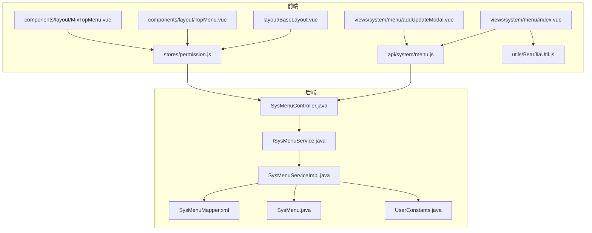
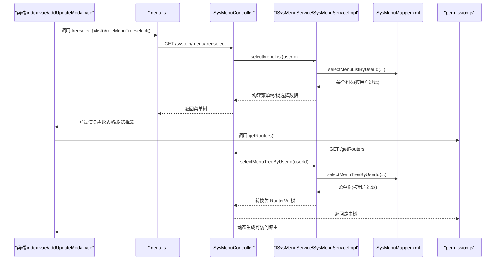
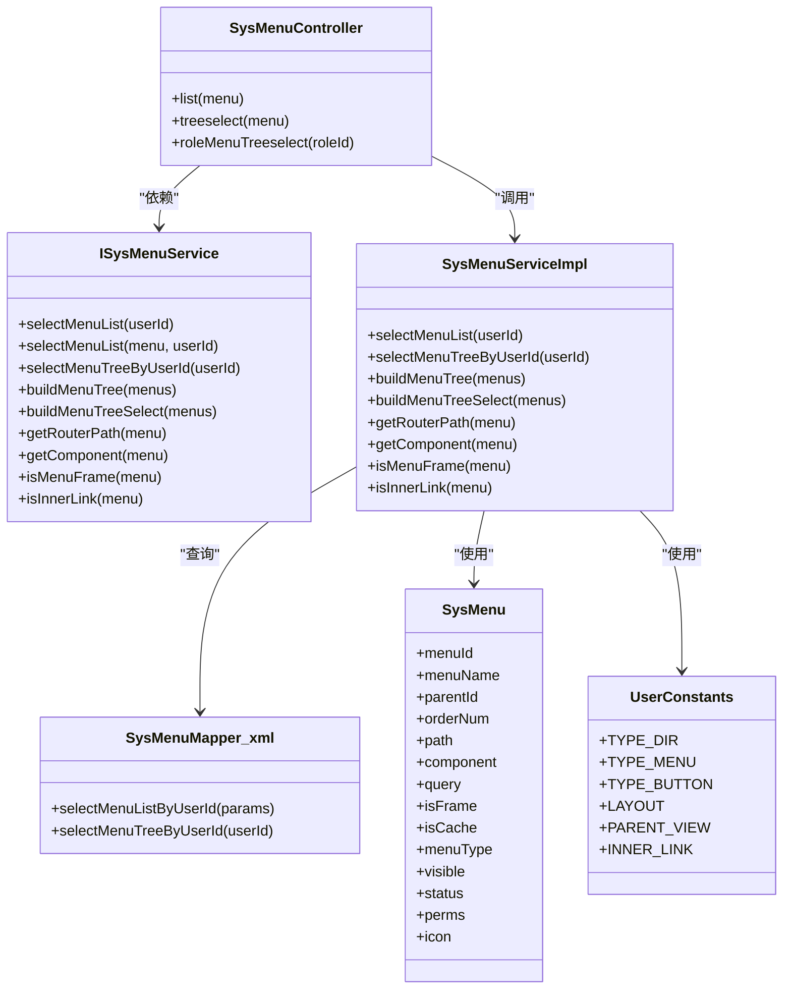
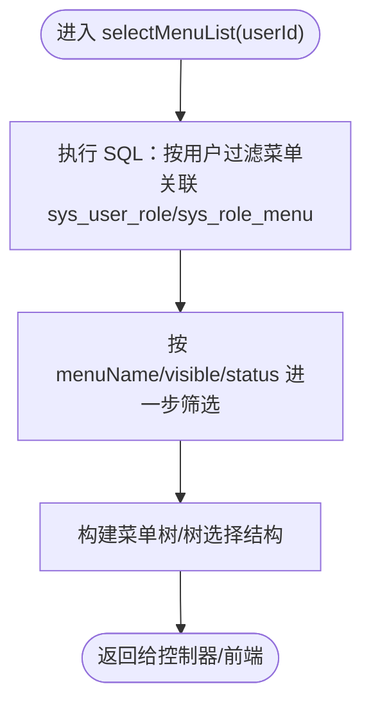
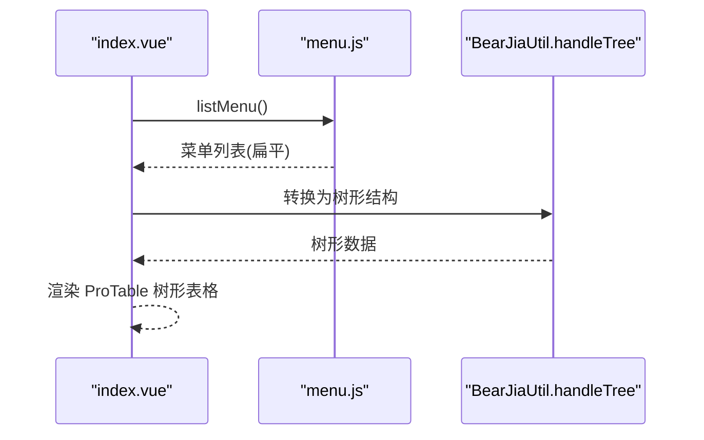
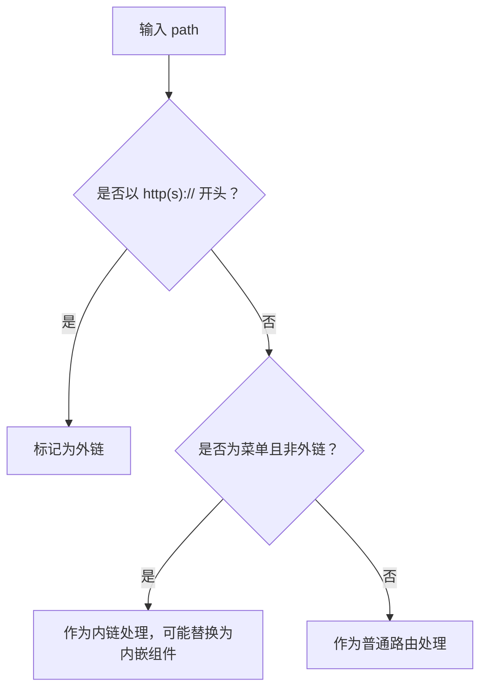
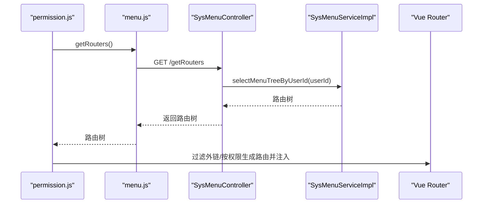
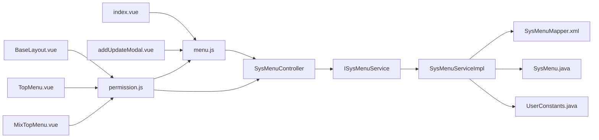

# 菜单管理

<cite>
**本文引用的文件**
- [SysMenuController.java](file://bearjia-admin-backend/src/main/java/com/avaxiaobear/module/system/controller/SysMenuController.java)
- [ISysMenuService.java](file://bearjia-admin-backend/src/main/java/com/avaxiaobear/module/system/service/ISysMenuService.java)
- [SysMenuServiceImpl.java](file://bearjia-admin-backend/src/main/java/com/avaxiaobear/module/system/service/impl/SysMenuServiceImpl.java)
- [SysMenuMapper.xml](file://bearjia-admin-backend/src/main/resources/mybatis/system/SysMenuMapper.xml)
- [SysMenu.java](file://bearjia-admin-backend/src/main/java/com/avaxiaobear/module/system/domain/SysMenu.java)
- [UserConstants.java](file://bearjia-admin-backend/src/main/java/com/avaxiaobear/base/common/constant/UserConstants.java)
- [menu.js](file://bear-jia-vue3/src/api/system/menu.js)
- [index.vue](file://bear-jia-vue3/src/views/system/menu/index.vue)
- [addUpdateModal.vue](file://bear-jia-vue3/src/views/system/menu/addUpdateModal.vue)
- [permission.js](file://bear-jia-vue3/src/stores/permission.js)
- [BaseLayout.vue](file://bear-jia-vue3/src/layout/BaseLayout.vue)
- [TopMenu.vue](file://bear-jia-vue3/src/components/layout/TopMenu.vue)
- [MixTopMenu.vue](file://bear-jia-vue3/src/components/layout/MixTopMenu.vue)
- [BearJiaUtil.js](file://bear-jia-vue3/src/utils/BearJiaUtil.js)
</cite>

## 目录
1. [简介](#简介)
2. [项目结构](#项目结构)
3. [核心组件](#核心组件)
4. [架构总览](#架构总览)
5. [详细组件分析](#详细组件分析)
6. [依赖关系分析](#依赖关系分析)
7. [性能考量](#性能考量)
8. [故障排查指南](#故障排查指南)
9. [结论](#结论)

## 简介
本文件围绕菜单管理功能进行全面技术文档化，重点覆盖：
- SysMenuController 如何实现菜单树的递归查询、动态加载与权限过滤
- selectMenuList 方法如何基于用户ID过滤无权限菜单，实现菜单级别的安全控制
- 菜单实体 SysMenu 中路由路径、组件路径、权限标识等关键字段的作用
- 前端 menu.js API 与 index.vue 组件如何结合 TreeSelect 实现菜单树的可视化编辑
- 菜单层级校验（禁止选择自身为上级）、外部链接校验（必须以 http(s):// 开头）等业务规则
- 菜单缓存策略与前端路由动态生成的集成方案
- 菜单修改后权限不生效的常见问题排查

## 项目结构
菜单管理涉及前后端协同：
- 前端：系统菜单页面、菜单增改弹窗、菜单 API、权限路由生成、布局菜单组件
- 后端：菜单控制器、服务接口与实现、MyBatis Mapper、菜单实体与常量

图表来源
- [index.vue](file://bear-jia-vue3/src/views/system/menu/index.vue#L1-L143)
- [addUpdateModal.vue](file://bear-jia-vue3/src/views/system/menu/addUpdateModal.vue#L1-L501)
- [menu.js](file://bear-jia-vue3/src/api/system/menu.js#L1-L68)
- [permission.js](file://bear-jia-vue3/src/stores/permission.js#L1-L264)
- [SysMenuController.java](file://bearjia-admin-backend/src/main/java/com/avaxiaobear/module/system/controller/SysMenuController.java#L23-L73)
- [ISysMenuService.java](file://bearjia-admin-backend/src/main/java/com/avaxiaobear/module/system/service/ISysMenuService.java#L1-L55)
- [SysMenuServiceImpl.java](file://bearjia-admin-backend/src/main/java/com/avaxiaobear/module/system/service/impl/SysMenuServiceImpl.java#L173-L461)
- [SysMenuMapper.xml](file://bearjia-admin-backend/src/main/resources/mybatis/system/SysMenuMapper.xml#L53-L114)
- [SysMenu.java](file://bearjia-admin-backend/src/main/java/com/avaxiaobear/module/system/domain/SysMenu.java#L1-L259)
- [UserConstants.java](file://bearjia-admin-backend/src/main/java/com/avaxiaobear/base/common/constant/UserConstants.java#L49-L78)

章节来源
- [index.vue](file://bear-jia-vue3/src/views/system/menu/index.vue#L1-L143)
- [addUpdateModal.vue](file://bear-jia-vue3/src/views/system/menu/addUpdateModal.vue#L1-L501)
- [menu.js](file://bear-jia-vue3/src/api/system/menu.js#L1-L68)
- [SysMenuController.java](file://bearjia-admin-backend/src/main/java/com/avaxiaobear/module/system/controller/SysMenuController.java#L23-L73)
- [SysMenuServiceImpl.java](file://bearjia-admin-backend/src/main/java/com/avaxiaobear/module/system/service/impl/SysMenuServiceImpl.java#L173-L461)

## 核心组件
- 前端菜单表格与可视化编辑
  - index.vue：树形表格展示菜单，使用 BearJiaUtil.handleTree 将后端扁平数据转换为树形结构；通过 API treeselect 与 roleMenuTreeselect 提供树形选择数据。
  - addUpdateModal.vue：使用 a-tree-select 展示菜单树，支持新增/修改菜单，表单字段映射 SysMenu 关键字段。
  - permission.js：从后端获取路由数据，构建前端路由树，过滤外链，按权限动态生成可访问路由。
- 后端菜单服务与控制器
  - SysMenuController：提供菜单列表、详情、treeselect、角色菜单树等接口；使用权限注解保护接口。
  - ISysMenuService/SysMenuServiceImpl：实现菜单树构建、按用户/角色过滤、路由路径与组件推导、外链与内链处理。
  - SysMenuMapper.xml：SQL 查询按用户过滤菜单树，支持按菜单名、可见性、状态筛选。
  - SysMenu：菜单实体，包含 path、component、query、isFrame、isCache、menuType、visible、status、perms、icon 等字段。
  - UserConstants：菜单类型与组件标识常量。

章节来源
- [index.vue](file://bear-jia-vue3/src/views/system/menu/index.vue#L104-L113)
- [addUpdateModal.vue](file://bear-jia-vue3/src/views/system/menu/addUpdateModal.vue#L38-L43)
- [menu.js](file://bear-jia-vue3/src/api/system/menu.js#L1-L68)
- [SysMenuController.java](file://bearjia-admin-backend/src/main/java/com/avaxiaobear/module/system/controller/SysMenuController.java#L23-L73)
- [ISysMenuService.java](file://bearjia-admin-backend/src/main/java/com/avaxiaobear/module/system/service/ISysMenuService.java#L1-L55)
- [SysMenuServiceImpl.java](file://bearjia-admin-backend/src/main/java/com/avaxiaobear/module/system/service/impl/SysMenuServiceImpl.java#L173-L461)
- [SysMenuMapper.xml](file://bearjia-admin-backend/src/main/resources/mybatis/system/SysMenuMapper.xml#L53-L114)
- [SysMenu.java](file://bearjia-admin-backend/src/main/java/com/avaxiaobear/module/system/domain/SysMenu.java#L1-L259)
- [UserConstants.java](file://bearjia-admin-backend/src/main/java/com/avaxiaobear/base/common/constant/UserConstants.java#L49-L78)

## 架构总览
前端通过 API 获取菜单树与路由数据，后端基于用户身份与角色权限过滤菜单，再将菜单转换为前端路由树。菜单实体的关键字段决定前端渲染与路由行为。

图表来源
- [index.vue](file://bear-jia-vue3/src/views/system/menu/index.vue#L104-L113)
- [addUpdateModal.vue](file://bear-jia-vue3/src/views/system/menu/addUpdateModal.vue#L38-L43)
- [menu.js](file://bear-jia-vue3/src/api/system/menu.js#L1-L68)
- [SysMenuController.java](file://bearjia-admin-backend/src/main/java/com/avaxiaobear/module/system/controller/SysMenuController.java#L23-L73)
- [SysMenuServiceImpl.java](file://bearjia-admin-backend/src/main/java/com/avaxiaobear/module/system/service/impl/SysMenuServiceImpl.java#L173-L461)
- [SysMenuMapper.xml](file://bearjia-admin-backend/src/main/resources/mybatis/system/SysMenuMapper.xml#L53-L114)
- [permission.js](file://bear-jia-vue3/src/stores/permission.js#L1-L264)

## 详细组件分析

### 后端：菜单树递归查询与权限过滤
- 控制器接口
  - list：按条件查询菜单列表，并按当前用户过滤。
  - treeselect：返回树形选择数据，供前端 TreeSelect 使用。
  - roleMenuTreeselect：按角色返回菜单树，用于角色授权。
- 服务层
  - selectMenuList(userId)：按用户过滤菜单，支持多条件筛选。
  - selectMenuTreeByUserId(userId)：构建用户可见的菜单树。
  - buildMenuTree/buildMenuTreeSelect：将扁平菜单转换为树结构或树选择结构。
  - getRouterPath/getComponent：根据菜单类型与属性推导路由路径与组件。
  - isMenuFrame/isInnerLink：识别菜单是否为外链/内链，影响路由与组件。
- 数据访问层
  - selectMenuListByUserId/selectMenuTreeByUserId：基于用户与角色关联表过滤菜单，确保菜单级别安全控制。
- 实体与常量
  - SysMenu 字段：path、component、query、isFrame、isCache、menuType、visible、status、perms、icon 等。
  - UserConstants：菜单类型与组件标识常量，如 TYPE_DIR、TYPE_MENU、TYPE_BUTTON、LAYOUT、PARENT_VIEW、INNER_LINK。

图表来源
- [SysMenuController.java](file://bearjia-admin-backend/src/main/java/com/avaxiaobear/module/system/controller/SysMenuController.java#L23-L73)
- [ISysMenuService.java](file://bearjia-admin-backend/src/main/java/com/avaxiaobear/module/system/service/ISysMenuService.java#L1-L55)
- [SysMenuServiceImpl.java](file://bearjia-admin-backend/src/main/java/com/avaxiaobear/module/system/service/impl/SysMenuServiceImpl.java#L173-L461)
- [SysMenuMapper.xml](file://bearjia-admin-backend/src/main/resources/mybatis/system/SysMenuMapper.xml#L53-L114)
- [SysMenu.java](file://bearjia-admin-backend/src/main/java/com/avaxiaobear/module/system/domain/SysMenu.java#L1-L259)
- [UserConstants.java](file://bearjia-admin-backend/src/main/java/com/avaxiaobear/base/common/constant/UserConstants.java#L49-L78)

章节来源
- [SysMenuController.java](file://bearjia-admin-backend/src/main/java/com/avaxiaobear/module/system/controller/SysMenuController.java#L23-L73)
- [SysMenuServiceImpl.java](file://bearjia-admin-backend/src/main/java/com/avaxiaobear/module/system/service/impl/SysMenuServiceImpl.java#L173-L461)
- [SysMenuMapper.xml](file://bearjia-admin-backend/src/main/resources/mybatis/system/SysMenuMapper.xml#L53-L114)
- [SysMenu.java](file://bearjia-admin-backend/src/main/java/com/avaxiaobear/module/system/domain/SysMenu.java#L1-L259)
- [UserConstants.java](file://bearjia-admin-backend/src/main/java/com/avaxiaobear/base/common/constant/UserConstants.java#L49-L78)

### selectMenuList 按用户过滤与菜单安全控制
- SQL 过滤：通过 sys_user_role 与 sys_role_menu 关联，仅返回用户具备的角色所拥有的菜单，且菜单状态为启用。
- 前端调用：index.vue 使用 listMenu 接口获取菜单列表，并通过 BearJiaUtil.handleTree 转换为树形结构。
- 安全要点：后端严格按用户 ID 过滤菜单，避免越权访问；前端仅展示用户可访问的菜单树。

图表来源
- [SysMenuMapper.xml](file://bearjia-admin-backend/src/main/resources/mybatis/system/SysMenuMapper.xml#L53-L114)
- [index.vue](file://bear-jia-vue3/src/views/system/menu/index.vue#L104-L113)

章节来源
- [SysMenuMapper.xml](file://bearjia-admin-backend/src/main/resources/mybatis/system/SysMenuMapper.xml#L53-L114)
- [index.vue](file://bear-jia-vue3/src/views/system/menu/index.vue#L104-L113)

### 前端：TreeSelect 可视化编辑与菜单树渲染
- index.vue：ProTable 配置 processListData 使用 BearJiaUtil.handleTree 将后端返回的扁平菜单转换为树形结构，支持树形表格展示。
- addUpdateModal.vue：使用 a-tree-select 展示菜单树，字段映射包括 children、label、key、value，便于选择上级菜单。
- BearJiaUtil.handleTree：通用树形转换工具，被 index.vue 与 addUpdateModal.vue 共同使用。

图表来源
- [index.vue](file://bear-jia-vue3/src/views/system/menu/index.vue#L104-L113)
- [addUpdateModal.vue](file://bear-jia-vue3/src/views/system/menu/addUpdateModal.vue#L38-L43)
- [BearJiaUtil.js](file://bear-jia-vue3/src/utils/BearJiaUtil.js#L402-L404)

章节来源
- [index.vue](file://bear-jia-vue3/src/views/system/menu/index.vue#L104-L113)
- [addUpdateModal.vue](file://bear-jia-vue3/src/views/system/menu/addUpdateModal.vue#L38-L43)
- [BearJiaUtil.js](file://bear-jia-vue3/src/utils/BearJiaUtil.js#L402-L404)

### 菜单实体字段与路由/组件映射
- 路由路径 path：决定前端路由路径；外链需以 http(s):// 开头，内链则可能被转换为内嵌组件。
- 组件路径 component：决定前端组件加载；为空时根据菜单类型与父子关系推导默认组件。
- 权限标识 perms：用于前端权限校验与后端权限控制。
- isFrame：是否为外链（0 是 1 否），配合 path 判断外链/内链。
- isCache：是否缓存（0 缓存 1 不缓存），影响前端缓存策略。
- menuType：菜单类型（M 目录、C 菜单、F 按钮），影响路由与组件选择。
- visible/status/icon：控制菜单显示与状态、图标。

章节来源
- [SysMenu.java](file://bearjia-admin-backend/src/main/java/com/avaxiaobear/module/system/domain/SysMenu.java#L1-L259)
- [SysMenuServiceImpl.java](file://bearjia-admin-backend/src/main/java/com/avaxiaobear/module/system/service/impl/SysMenuServiceImpl.java#L173-L461)
- [UserConstants.java](file://bearjia-admin-backend/src/main/java/com/avaxiaobear/base/common/constant/UserConstants.java#L49-L78)

### 业务规则：层级校验与外链校验
- 禁止选择自身为上级：前端 TreeSelect 使用 a-tree-select 的数据结构，通常通过后端返回的菜单树排除当前节点及其子节点，避免循环引用。
- 外链校验：permission.js 中 isExternalLink 使用正则 /^https?:/ 校验外链；SysMenuServiceImpl 中 isMenuFrame/isInnerLink 依据 isFrame 与 path 判断外链/内链，决定组件与路径。

图表来源
- [permission.js](file://bear-jia-vue3/src/stores/permission.js#L76-L78)
- [SysMenuServiceImpl.java](file://bearjia-admin-backend/src/main/java/com/avaxiaobear/module/system/service/impl/SysMenuServiceImpl.java#L418-L461)

章节来源
- [permission.js](file://bear-jia-vue3/src/stores/permission.js#L76-L78)
- [SysMenuServiceImpl.java](file://bearjia-admin-backend/src/main/java/com/avaxiaobear/module/system/service/impl/SysMenuServiceImpl.java#L418-L461)

### 菜单缓存策略与前端路由动态生成
- 后端缓存：后端未直接暴露菜单缓存接口，但可通过 selectMenuTreeByUserId 与 selectMenuPermsByUserId 的查询结果进行应用层缓存（建议在服务层增加缓存注解或本地缓存）。
- 前端缓存：permission.js 在生成路由时会缓存路由树；若菜单修改后权限不生效，需刷新路由或重新拉取路由数据。
- 路由生成：permission.js 调用 getRouters() 获取后端路由树，过滤外链，按权限动态生成可访问路由，并注入到全局路由中。

图表来源
- [permission.js](file://bear-jia-vue3/src/stores/permission.js#L1-L264)
- [menu.js](file://bear-jia-vue3/src/api/system/menu.js#L1-L9)
- [SysMenuController.java](file://bearjia-admin-backend/src/main/java/com/avaxiaobear/module/system/controller/SysMenuController.java#L23-L73)
- [SysMenuServiceImpl.java](file://bearjia-admin-backend/src/main/java/com/avaxiaobear/module/system/service/impl/SysMenuServiceImpl.java#L173-L461)

章节来源
- [permission.js](file://bear-jia-vue3/src/stores/permission.js#L1-L264)
- [menu.js](file://bear-jia-vue3/src/api/system/menu.js#L1-L9)

## 依赖关系分析
- 前端依赖
  - index.vue 依赖 menu.js 与 BearJiaUtil.js；addUpdateModal.vue 依赖 menu.js 与 BearJiaUtil.js。
  - permission.js 依赖 menu.js 与后端路由接口，负责动态路由生成。
  - 布局组件 TopMenu.vue、MixTopMenu.vue、BaseLayout.vue 依赖路由状态与菜单高亮逻辑。
- 后端依赖
  - SysMenuController 依赖 ISysMenuService；ISysMenuService 依赖 SysMenuMapper.xml 与 SysMenu。
  - SysMenuServiceImpl 依赖 UserConstants 常量与工具方法，实现路由路径与组件推导。

图表来源
- [index.vue](file://bear-jia-vue3/src/views/system/menu/index.vue#L1-L143)
- [addUpdateModal.vue](file://bear-jia-vue3/src/views/system/menu/addUpdateModal.vue#L1-L501)
- [menu.js](file://bear-jia-vue3/src/api/system/menu.js#L1-L68)
- [SysMenuController.java](file://bearjia-admin-backend/src/main/java/com/avaxiaobear/module/system/controller/SysMenuController.java#L23-L73)
- [ISysMenuService.java](file://bearjia-admin-backend/src/main/java/com/avaxiaobear/module/system/service/ISysMenuService.java#L1-L55)
- [SysMenuServiceImpl.java](file://bearjia-admin-backend/src/main/java/com/avaxiaobear/module/system/service/impl/SysMenuServiceImpl.java#L173-L461)
- [SysMenuMapper.xml](file://bearjia-admin-backend/src/main/resources/mybatis/system/SysMenuMapper.xml#L53-L114)
- [SysMenu.java](file://bearjia-admin-backend/src/main/java/com/avaxiaobear/module/system/domain/SysMenu.java#L1-L259)
- [UserConstants.java](file://bearjia-admin-backend/src/main/java/com/avaxiaobear/base/common/constant/UserConstants.java#L49-L78)
- [permission.js](file://bear-jia-vue3/src/stores/permission.js#L1-L264)
- [BaseLayout.vue](file://bear-jia-vue3/src/layout/BaseLayout.vue#L866-L890)
- [TopMenu.vue](file://bear-jia-vue3/src/components/layout/TopMenu.vue#L141-L189)
- [MixTopMenu.vue](file://bear-jia-vue3/src/components/layout/MixTopMenu.vue#L87-L136)

章节来源
- [index.vue](file://bear-jia-vue3/src/views/system/menu/index.vue#L1-L143)
- [addUpdateModal.vue](file://bear-jia-vue3/src/views/system/menu/addUpdateModal.vue#L1-L501)
- [menu.js](file://bear-jia-vue3/src/api/system/menu.js#L1-L68)
- [SysMenuController.java](file://bearjia-admin-backend/src/main/java/com/avaxiaobear/module/system/controller/SysMenuController.java#L23-L73)
- [SysMenuServiceImpl.java](file://bearjia-admin-backend/src/main/java/com/avaxiaobear/module/system/service/impl/SysMenuServiceImpl.java#L173-L461)
- [permission.js](file://bear-jia-vue3/src/stores/permission.js#L1-L264)

## 性能考量
- 后端查询优化
  - 使用关联表过滤菜单，避免全表扫描；建议在 menu_id、user_id、role_id 上建立索引。
  - 菜单树构建采用一次查询后内存组装，减少多次往返。
- 前端渲染优化
  - index.vue 使用 BearJiaUtil.handleTree 将扁平数据一次性转换为树形，避免重复计算。
  - TreeSelect 使用 field-names 映射，减少不必要的数据转换。
- 路由生成优化
  - permission.js 仅在登录后或权限变更时重新生成路由，避免频繁重建。

[本节为通用指导，不直接分析具体文件]

## 故障排查指南
- 菜单修改后权限不生效
  - 现象：修改菜单权限标识或状态后，前端仍可访问或不可访问。
  - 排查步骤：
    1) 确认后端 selectMenuTreeByUserId(userId) 返回的菜单树已更新。
    2) 前端 permission.js 是否重新拉取了路由数据并注入到路由中。
    3) 若使用缓存，清理应用层缓存或强制刷新路由。
  - 参考位置：
    - permission.js 路由生成与注入逻辑
    - SysMenuServiceImpl 路由树构建与过滤逻辑

- 外链无法正常打开
  - 现象：外链地址以 http(s):// 开头但无法跳转。
  - 排查步骤：
    1) 检查 isFrame 与 path 是否满足外链规则。
    2) permission.js 中 isExternalLink 正则是否匹配。
    3) 前端是否将外链路由过滤掉（外链不应加入 Vue Router，仅用于菜单显示）。

- 上级菜单选择异常
  - 现象：TreeSelect 中无法选择某节点或出现循环引用。
  - 排查步骤：
    1) 确认后端返回的菜单树不含当前节点及其子节点。
    2) 前端 TreeSelect 的 field-names 映射是否正确。

章节来源
- [permission.js](file://bear-jia-vue3/src/stores/permission.js#L1-L264)
- [SysMenuServiceImpl.java](file://bearjia-admin-backend/src/main/java/com/avaxiaobear/module/system/service/impl/SysMenuServiceImpl.java#L173-L461)
- [addUpdateModal.vue](file://bear-jia-vue3/src/views/system/menu/addUpdateModal.vue#L38-L43)

## 结论
菜单管理功能通过前后端协作实现了菜单树的递归查询、动态加载与权限过滤。后端基于用户与角色关联表严格过滤菜单，前端通过 TreeSelect 与 ProTable 提供可视化编辑与树形展示，并通过 permission.js 动态生成路由。关键字段（path、component、isFrame、perms 等）决定了菜单的路由行为与权限控制。针对菜单修改后权限不生效的问题，应检查后端过滤逻辑与前端路由刷新流程。建议在服务层引入缓存机制以提升性能，并完善前端表单校验与层级约束，确保业务规则的一致性与安全性。