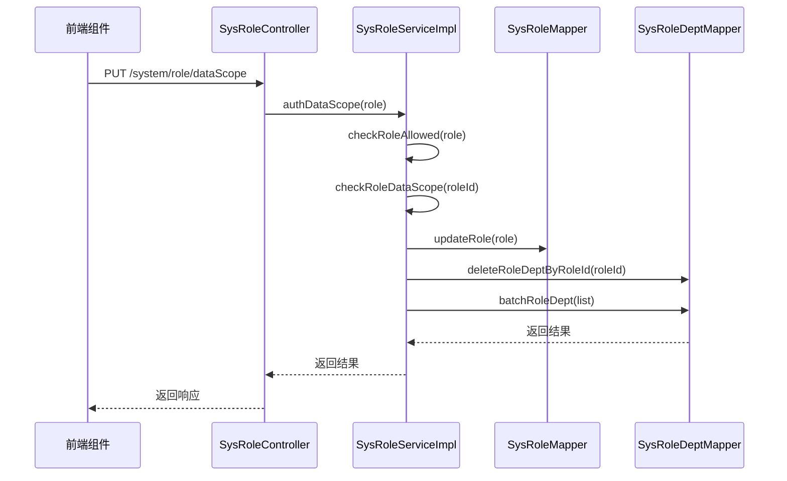
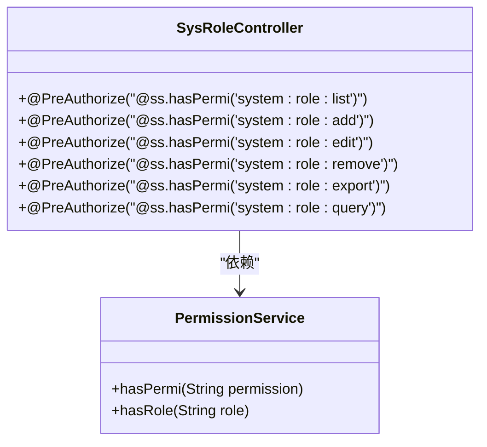
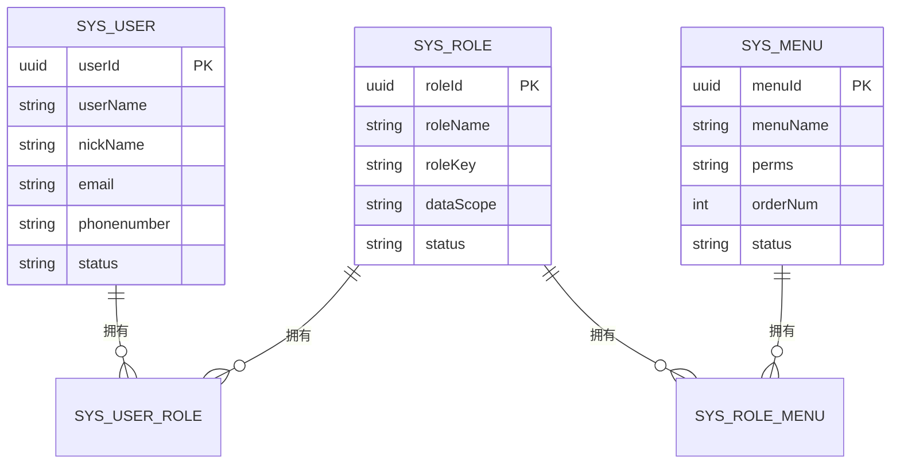
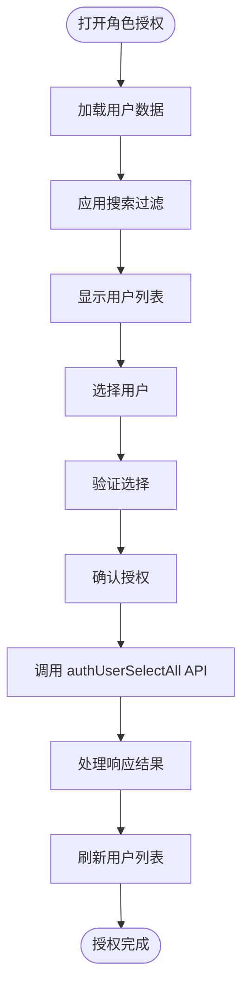
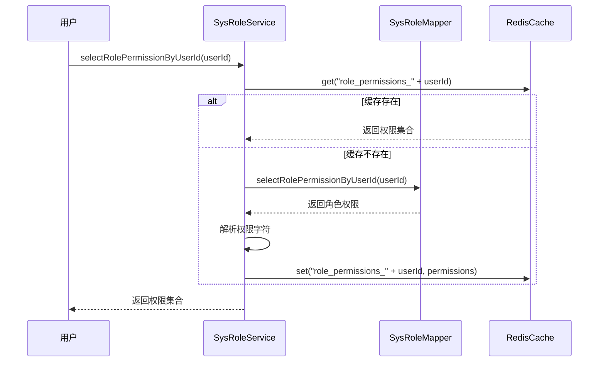
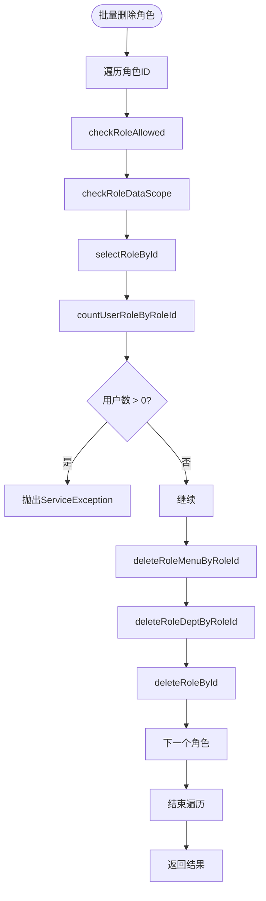

# 角色管理

<cite>
**本文档引用的文件**  
- [SysRoleController.java](file://bearjia-admin-backend/src/main/java/com/javaxiaobear/module/system/controller/SysRoleController.java)
- [ISysRoleService.java](file://bearjia-admin-backend/src/main/java/com/javaxiaobear/module/system/service/ISysRoleService.java)
- [SysRoleServiceImpl.java](file://bearjia-admin-backend/src/main/java/com/javaxiaobear/module/system/service/impl/SysRoleServiceImpl.java)
- [SysRole.java](file://bearjia-admin-backend/src/main/java/com/javaxiaobear/module/system/domain/SysRole.java)
- [SysUserRole.java](file://bearjia-admin-backend/src/main/java/com/javaxiaobear/module/system/domain/SysUserRole.java)
- [SysRoleMenu.java](file://bearjia-admin-backend/src/main/java/com/javaxiaobear/module/system/domain/SysRoleMenu.java)
- [role.js](file://bear-jia-vue3/src/api/system/role.js)
- [SelectUser.vue](file://bear-jia-vue3/src/views/system/role/module/SelectUser.vue)
- [authUser.vue](file://bear-jia-vue3/src/views/system/role/module/authUser.vue)
- [index.vue](file://bear-jia-vue3/src/views/system/role/index.vue)
</cite>

## 目录
1. [简介](#简介)
2. [核心接口实现](#核心接口实现)
3. [RESTful接口安全控制](#restful接口安全控制)
4. [实体关系映射](#实体关系映射)
5. [前端组件实现](#前端组件实现)
6. [角色权限计算示例](#角色权限计算示例)
7. [删除约束检查](#删除约束检查)

## 简介
角色管理模块是系统权限控制的核心组件，负责角色的增删改查、权限分配、数据范围控制等功能。该模块通过角色与用户、菜单的多对多关系实现灵活的权限管理体系，支持基于角色的访问控制（RBAC）和细粒度的数据权限控制。

## 核心接口实现

### 角色权限校验
`ISysRoleService` 接口提供了角色权限校验的核心方法：

- `checkRoleNameUnique(SysRole role)`：校验角色名称的唯一性，防止重复创建同名角色
- `checkRoleKeyUnique(SysRole role)`：校验角色权限字符的唯一性，确保每个角色有唯一的权限标识
- `checkRoleAllowed(SysRole role)`：校验角色是否允许操作，特别禁止对超级管理员角色进行修改
- `checkRoleDataScope(Long roleId)`：校验角色的数据权限范围，确保当前用户有权访问指定角色的数据

这些方法在角色创建和修改时被调用，确保系统数据的完整性和安全性。

**Section sources**
- [ISysRoleService.java](file://bearjia-admin-backend/src/main/java/com/javaxiaobear/module/system/service/ISysRoleService.java#L68-L90)
- [SysRoleServiceImpl.java](file://bearjia-admin-backend/src/main/java/com/javaxiaobear/module/system/service/impl/SysRoleServiceImpl.java#L148-L210)

### 数据权限控制
数据权限控制通过 `authDataScope` 方法实现，该方法处理角色的数据范围授权：

**Diagram sources**
- [SysRoleController.java](file://bearjia-admin-backend/src/main/java/com/javaxiaobear/module/system/controller/SysRoleController.java#L148-L156)
- [SysRoleServiceImpl.java](file://bearjia-admin-backend/src/main/java/com/javaxiaobear/module/system/service/impl/SysRoleServiceImpl.java#L274-L284)

### 角色分配
角色分配功能通过以下方法实现：

- `insertAuthUsers(Long roleId, Long[] userIds)`：批量为角色授权用户
- `deleteAuthUsers(Long roleId, Long[] userIds)`：批量取消用户的角色授权
- `deleteAuthUser(SysUserRole userRole)`：取消单个用户的角色授权

这些方法在 `SysRoleServiceImpl` 中实现，通过操作 `sys_user_role` 关联表来管理用户与角色的关系。

**Section sources**
- [ISysRoleService.java](file://bearjia-admin-backend/src/main/java/com/javaxiaobear/module/system/service/ISysRoleService.java#L164-L173)
- [SysRoleServiceImpl.java](file://bearjia-admin-backend/src/main/java/com/javaxiaobear/module/system/service/impl/SysRoleServiceImpl.java#L397-L429)

## RESTful接口安全控制

### 安全注解应用
`SysRoleController` 中的 RESTful 接口使用了 Spring Security 的 `@PreAuthorize` 注解进行安全控制：

**Diagram sources**
- [SysRoleController.java](file://bearjia-admin-backend/src/main/java/com/javaxiaobear/module/system/controller/SysRoleController.java#L59-L177)
- [SysRole.java](file://bearjia-admin-backend/src/main/java/com/javaxiaobear/module/system/domain/SysRole.java#L97-L119)

### 日志记录
所有关键操作都使用 `@Log` 注解记录操作日志：

- `@Log(title = "角色管理", businessType = BusinessType.INSERT)`：记录角色新增操作
- `@Log(title = "角色管理", businessType = BusinessType.UPDATE)`：记录角色修改操作
- `@Log(title = "角色管理", businessType = BusinessType.DELETE)`：记录角色删除操作
- `@Log(title = "角色管理", businessType = BusinessType.GRANT)`：记录角色授权操作

这些日志信息用于审计和追踪系统操作。

**Section sources**
- [SysRoleController.java](file://bearjia-admin-backend/src/main/java/com/javaxiaobear/module/system/controller/SysRoleController.java#L93-L143)

## 实体关系映射

### 多对多关联关系
角色管理模块通过三个实体类实现多对多关联关系：

**Diagram sources**
- [SysRole.java](file://bearjia-admin-backend/src/main/java/com/javaxiaobear/module/system/domain/SysRole.java)
- [SysUserRole.java](file://bearjia-admin-backend/src/main/java/com/javaxiaobear/module/system/domain/SysUserRole.java)
- [SysRoleMenu.java](file://bearjia-admin-backend/src/main/java/com/javaxiaobear/module/system/domain/SysRoleMenu.java)

### 实体类设计
- `SysRole`：角色实体，包含角色基本信息、权限标识、数据范围等属性
- `SysUserRole`：用户角色关联实体，建立用户与角色的多对多关系
- `SysRoleMenu`：角色菜单关联实体，建立角色与菜单的多对多关系

这些实体类通过 MyBatis Mapper 进行数据库操作，实现了完整的 CRUD 功能。

**Section sources**
- [SysRole.java](file://bearjia-admin-backend/src/main/java/com/javaxiaobear/module/system/domain/SysRole.java)
- [SysUserRole.java](file://bearjia-admin-backend/src/main/java/com/javaxiaobear/module/system/domain/SysUserRole.java)
- [SysRoleMenu.java](file://bearjia-admin-backend/src/main/java/com/javaxiaobear/module/system/domain/SysRoleMenu.java)

## 前端组件实现

### 角色授权功能
前端通过 `SelectUser` 和 `authUser` 组件实现角色授权功能：

**Diagram sources**
- [SelectUser.vue](file://bear-jia-vue3/src/views/system/role/module/SelectUser.vue)
- [authUser.vue](file://bear-jia-vue3/src/views/system/role/module/authUser.vue)

### 角色权限树渲染
角色权限树的渲染逻辑如下：

1. 通过 `getRole` API 获取角色详情
2. 通过 `listRole` API 获取角色列表
3. 使用 Ant Design Vue 的 Tree 组件渲染权限树
4. 根据用户权限动态显示操作按钮

**Section sources**
- [index.vue](file://bear-jia-vue3/src/views/system/role/index.vue)
- [role.js](file://bear-jia-vue3/src/api/system/role.js)

## 角色权限计算示例

### 权限计算流程
角色权限计算的代码示例如下：

**Diagram sources**
- [SysRoleServiceImpl.java](file://bearjia-admin-backend/src/main/java/com/javaxiaobear/module/system/service/impl/SysRoleServiceImpl.java#L92-L105)
- [SysRoleMapper.java](file://bearjia-admin-backend/src/main/java/com/javaxiaobear/module/system/mapper/SysRoleMapper.java)

### 动态菜单生成
根据用户角色动态生成可访问菜单的流程：

1. 获取用户的角色列表
2. 根据角色权限标识查询对应的菜单
3. 过滤用户有权限访问的菜单项
4. 构建菜单树结构
5. 返回前端渲染

## 删除约束检查

### 约束检查机制
角色删除时的约束检查在 `deleteRoleByIds` 方法中实现：

**Diagram sources**
- [SysRoleServiceImpl.java](file://bearjia-admin-backend/src/main/java/com/javaxiaobear/module/system/service/impl/SysRoleServiceImpl.java#L357-L376)

### 解决方案
当角色被用户引用时，系统会抛出 `ServiceException` 异常，提示"角色已分配，不能删除"。解决方案包括：

1. 先解除角色与用户的关联
2. 将用户重新分配到其他角色
3. 再删除不再需要的角色

这种机制确保了数据的一致性和完整性，防止出现孤立的用户或权限问题。

**Section sources**
- [SysRoleServiceImpl.java](file://bearjia-admin-backend/src/main/java/com/javaxiaobear/module/system/service/impl/SysRoleServiceImpl.java#L366-L369)