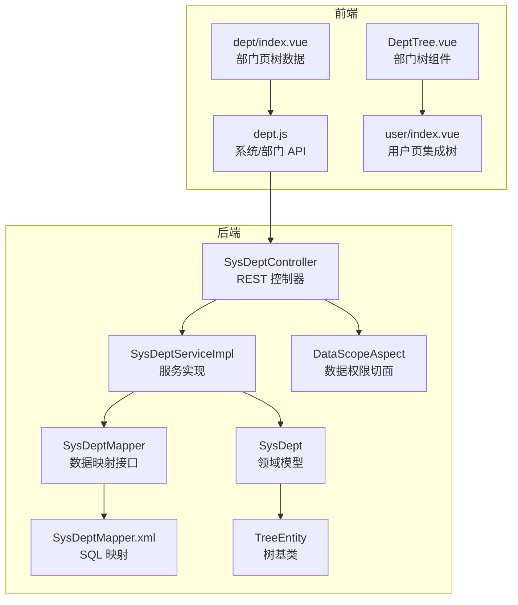
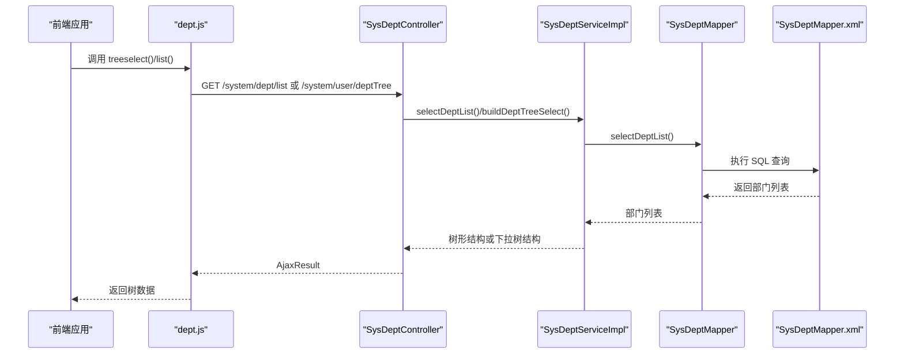
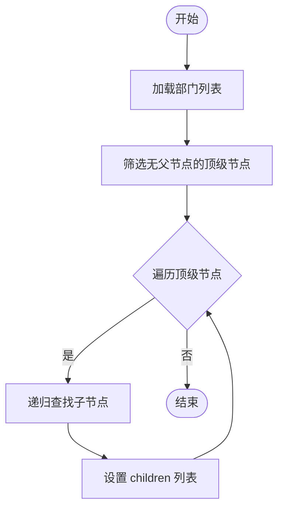
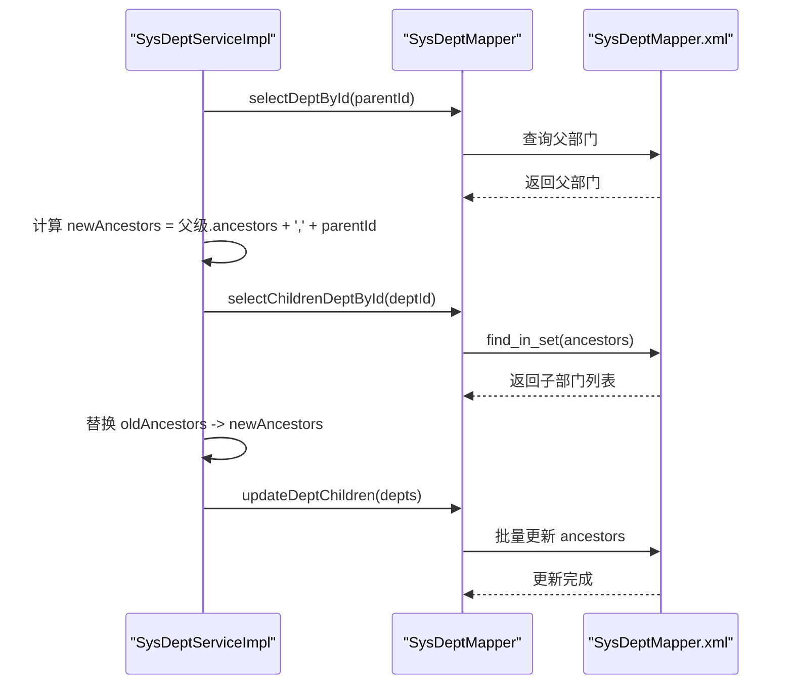
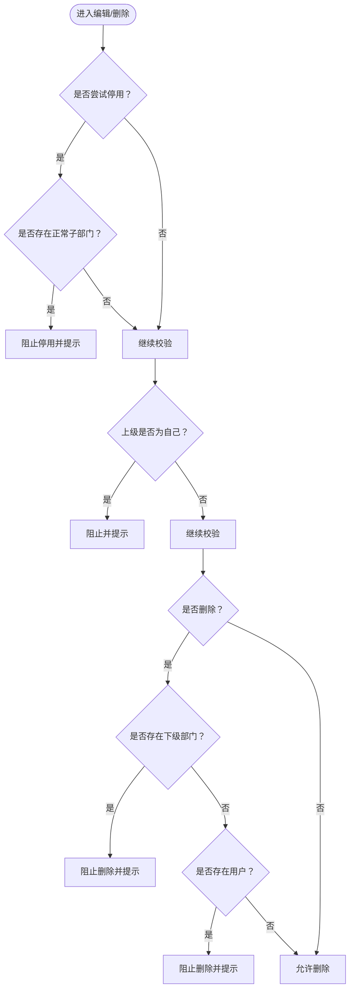
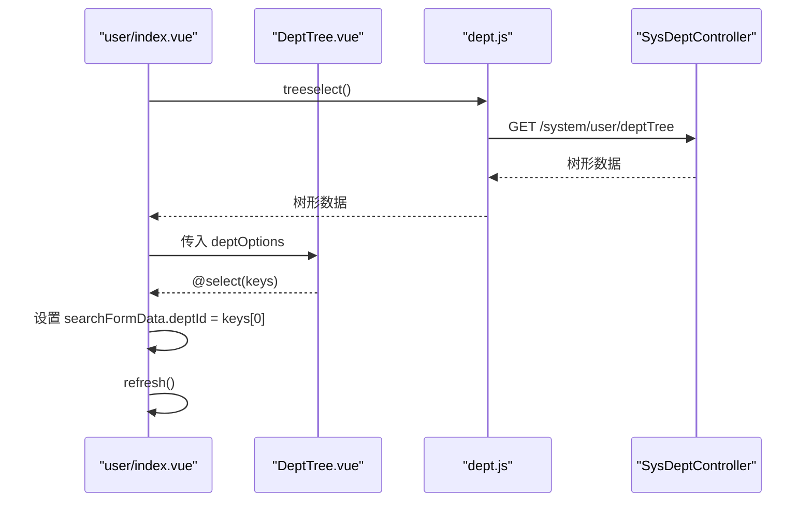
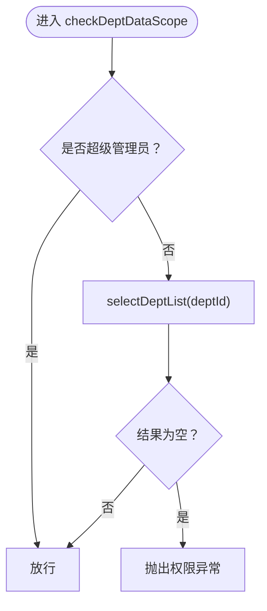
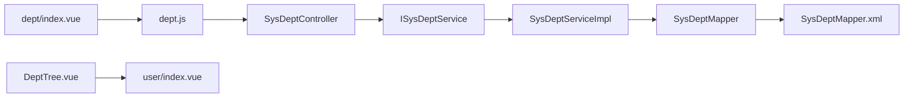

# 部门管理

<cite>
**本文引用的文件**
- [SysDeptController.java](file://bearjia-admin-backend/src/main/java/com/javaxiaobear/module/system/controller/SysDeptController.java)
- [ISysDeptService.java](file://bearjia-admin-backend/src/main/java/com/javaxiaobear/module/system/service/ISysDeptService.java)
- [SysDeptServiceImpl.java](file://bearjia-admin-backend/src/main/java/com/javaxiaobear/module/system/service/impl/SysDeptServiceImpl.java)
- [SysDeptMapper.java](file://bearjia-admin-backend/src/main/java/com/javaxiaobear/module/system/mapper/SysDeptMapper.java)
- [SysDeptMapper.xml](file://bearjia-admin-backend/src/main/resources/mybatis/system/SysDeptMapper.xml)
- [SysDept.java](file://bearjia-admin-backend/src/main/java/com/javaxiaobear/module/system/domain/SysDept.java)
- [TreeEntity.java](file://bearjia-admin-backend/src/main/java/com/javaxiaobear/base/framework/web/domain/TreeEntity.java)
- [DataScopeAspect.java](file://bearjia-admin-backend/src/main/java/com/javaxiaobear/base/framework/aspectj/DataScopeAspect.java)
- [dept.js](file://bear-jia-vue3/src/api/system/dept.js)
- [DeptTree.vue](file://bear-jia-vue3/src/views/system/user/DeptTree.vue)
- [user/index.vue](file://bear-jia-vue3/src/views/system/user/index.vue)
- [dept/index.vue](file://bear-jia-vue3/src/views/system/dept/index.vue)
- [bear_jia.sql](file://bearjia-admin-backend/src/main/resources/sql/bear_jia.sql)
</cite>

## 目录
1. [简介](#简介)
2. [项目结构](#项目结构)
3. [核心组件](#核心组件)
4. [架构总览](#架构总览)
5. [详细组件分析](#详细组件分析)
6. [依赖分析](#依赖分析)
7. [性能考虑](#性能考虑)
8. [故障排查指南](#故障排查指南)
9. [结论](#结论)
10. [附录](#附录)

## 简介
本技术文档围绕“部门管理”模块，系统性阐述后端 SysDeptController 中部门树形结构的实现机制，包括：
- 递归查询与构建树形结构
- 祖先节点（ancestors）维护策略
- 子部门校验与状态变更约束
- 前端 dept.js API 与 DeptTree 组件的集成方式（用于树形展示与交互）
- 数据权限范围校验（checkDeptDataScope）的实现逻辑
- 删除流程中的级联检查（是否存在用户或子部门）及错误处理

同时对 SysDept 实体中部门编码、排序、负责人等字段的业务含义进行说明，并给出常见问题的排查建议与优化方向。

## 项目结构
后端采用分层架构：Controller -> Service -> Mapper -> XML；前端采用 Vue3 + Ant Design Vue 组件化组织，通过 API 模块与后端交互。

图表来源
- [SysDeptController.java](file://bearjia-admin-backend/src/main/java/com/javaxiaobear/module/system/controller/SysDeptController.java#L1-L133)
- [SysDeptServiceImpl.java](file://bearjia-admin-backend/src/main/java/com/javaxiaobear/module/system/service/impl/SysDeptServiceImpl.java#L1-L339)
- [SysDeptMapper.java](file://bearjia-admin-backend/src/main/java/com/javaxiaobear/module/system/mapper/SysDeptMapper.java#L1-L118)
- [SysDeptMapper.xml](file://bearjia-admin-backend/src/main/resources/mybatis/system/SysDeptMapper.xml#L62-L159)
- [SysDept.java](file://bearjia-admin-backend/src/main/java/com/javaxiaobear/module/system/domain/SysDept.java#L1-L120)
- [TreeEntity.java](file://bearjia-admin-backend/src/main/java/com/javaxiaobear/base/framework/web/domain/TreeEntity.java#L1-L79)
- [DataScopeAspect.java](file://bearjia-admin-backend/src/main/java/com/javaxiaobear/base/framework/aspectj/DataScopeAspect.java#L42-L174)
- [dept.js](file://bear-jia-vue3/src/api/system/dept.js#L1-L69)
- [DeptTree.vue](file://bear-jia-vue3/src/views/system/user/DeptTree.vue#L1-L166)
- [user/index.vue](file://bear-jia-vue3/src/views/system/user/index.vue#L1-L231)
- [dept/index.vue](file://bear-jia-vue3/src/views/system/dept/index.vue#L66-L129)

章节来源
- [SysDeptController.java](file://bearjia-admin-backend/src/main/java/com/javaxiaobear/module/system/controller/SysDeptController.java#L1-L133)
- [dept.js](file://bear-jia-vue3/src/api/system/dept.js#L1-L69)

## 核心组件
- 后端控制器 SysDeptController：提供部门列表、树形查询、详情、新增、修改、删除等接口，并在修改与删除时执行状态与级联检查。
- 服务实现 SysDeptServiceImpl：负责树形构建、祖先链维护、父子状态联动、数据权限校验、名称唯一性校验等。
- 数据映射 SysDeptMapper + XML：封装数据库访问，包括递归查询、祖先更新、状态批量更新、删除标记等。
- 领域模型 SysDept：包含部门编码（deptId）、父级（parentId）、祖先链（ancestors）、排序（orderNum）、负责人（leader）、状态（status）等字段。
- 树基类 TreeEntity：统一树形结构的父级、顺序、祖先链、子节点等通用属性。
- 数据权限切面 DataScopeAspect：基于角色数据范围动态拼接 SQL 过滤条件，保障用户只能访问授权范围内的数据。

章节来源
- [SysDeptServiceImpl.java](file://bearjia-admin-backend/src/main/java/com/javaxiaobear/module/system/service/impl/SysDeptServiceImpl.java#L1-L339)
- [SysDeptMapper.xml](file://bearjia-admin-backend/src/main/resources/mybatis/system/SysDeptMapper.xml#L62-L159)
- [SysDept.java](file://bearjia-admin-backend/src/main/java/com/javaxiaobear/module/system/domain/SysDept.java#L1-L120)
- [TreeEntity.java](file://bearjia-admin-backend/src/main/java/com/javaxiaobear/base/framework/web/domain/TreeEntity.java#L1-L79)
- [DataScopeAspect.java](file://bearjia-admin-backend/src/main/java/com/javaxiaobear/base/framework/aspectj/DataScopeAspect.java#L42-L174)

## 架构总览
后端通过注解驱动的权限控制与数据权限切面，结合服务层的树形构建与祖先链维护，形成完整的部门树管理能力。前端通过 API 模块调用后端接口，DeptTree 组件负责树形展示与交互，user/index.vue 将树与用户表格联动。

图表来源
- [dept.js](file://bear-jia-vue3/src/api/system/dept.js#L1-L69)
- [SysDeptController.java](file://bearjia-admin-backend/src/main/java/com/javaxiaobear/module/system/controller/SysDeptController.java#L37-L71)
- [SysDeptServiceImpl.java](file://bearjia-admin-backend/src/main/java/com/javaxiaobear/module/system/service/impl/SysDeptServiceImpl.java#L45-L102)
- [SysDeptMapper.java](file://bearjia-admin-backend/src/main/java/com/javaxiaobear/module/system/mapper/SysDeptMapper.java#L20-L44)
- [SysDeptMapper.xml](file://bearjia-admin-backend/src/main/resources/mybatis/system/SysDeptMapper.xml#L62-L88)

## 详细组件分析

### 部门树形结构与递归查询
- 树构建算法：服务层根据 parentId 关系，先筛选出无父节点的顶级节点，再对每个顶级节点递归查找其子节点，最终形成树根集合。
- 递归实现：通过 getChildList 与 hasChild 辅助方法，逐层收集子节点并继续递归，直至叶子节点。
- 排序与字段：树节点包含 children、orderNum、label（由后端返回的 deptName 映射）、id（deptId）等，前端 DeptTree.vue 通过 field-names 将后端字段映射为组件期望的结构。

图表来源
- [SysDeptServiceImpl.java](file://bearjia-admin-backend/src/main/java/com/javaxiaobear/module/system/service/impl/SysDeptServiceImpl.java#L71-L102)
- [SysDeptServiceImpl.java](file://bearjia-admin-backend/src/main/java/com/javaxiaobear/module/system/service/impl/SysDeptServiceImpl.java#L299-L338)

章节来源
- [SysDeptServiceImpl.java](file://bearjia-admin-backend/src/main/java/com/javaxiaobear/module/system/service/impl/SysDeptServiceImpl.java#L71-L102)
- [SysDeptServiceImpl.java](file://bearjia-admin-backend/src/main/java/com/javaxiaobear/module/system/service/impl/SysDeptServiceImpl.java#L299-L338)

### 祖先节点（ancestors）维护机制
- 新增子部门：当新增子部门时，会读取父部门的 ancestors 并拼接父部门 ID，写入新部门的 ancestors 字段。
- 移动/修改父级：当修改部门的父级时，会计算新的 ancestors（父级 ancestors + 父级 ID），并对该部门及其子孙节点进行批量替换与更新，确保整棵子树的祖先链一致。
- 状态联动：当启用某部门时，若其 ancestors 不为空且非根（0），会自动启用其所有祖先节点，保证层级一致性。

图表来源
- [SysDeptServiceImpl.java](file://bearjia-admin-backend/src/main/java/com/javaxiaobear/module/system/service/impl/SysDeptServiceImpl.java#L231-L282)
- [SysDeptMapper.xml](file://bearjia-admin-backend/src/main/resources/mybatis/system/SysDeptMapper.xml#L77-L83)
- [SysDeptMapper.xml](file://bearjia-admin-backend/src/main/resources/mybatis/system/SysDeptMapper.xml#L135-L146)

章节来源
- [SysDeptServiceImpl.java](file://bearjia-admin-backend/src/main/java/com/javaxiaobear/module/system/service/impl/SysDeptServiceImpl.java#L231-L282)
- [SysDeptMapper.xml](file://bearjia-admin-backend/src/main/resources/mybatis/system/SysDeptMapper.xml#L77-L83)
- [SysDeptMapper.xml](file://bearjia-admin-backend/src/main/resources/mybatis/system/SysDeptMapper.xml#L135-L146)

### 子部门校验与状态变更约束
- 约束规则：
  - 停用部门时，若存在“正常状态”的子部门，则禁止停用。
  - 上级部门不能是自己。
  - 删除部门前需确保不存在下级部门且不存在用户绑定。
- 控制器侧校验：在编辑与删除接口中分别执行上述校验，返回明确的错误提示。

图表来源
- [SysDeptController.java](file://bearjia-admin-backend/src/main/java/com/javaxiaobear/module/system/controller/SysDeptController.java#L90-L131)
- [SysDeptServiceImpl.java](file://bearjia-admin-backend/src/main/java/com/javaxiaobear/module/system/service/impl/SysDeptServiceImpl.java#L135-L165)
- [SysDeptMapper.xml](file://bearjia-admin-backend/src/main/resources/mybatis/system/SysDeptMapper.xml#L72-L75)
- [SysDeptMapper.xml](file://bearjia-admin-backend/src/main/resources/mybatis/system/SysDeptMapper.xml#L68-L71)

章节来源
- [SysDeptController.java](file://bearjia-admin-backend/src/main/java/com/javaxiaobear/module/system/controller/SysDeptController.java#L90-L131)
- [SysDeptServiceImpl.java](file://bearjia-admin-backend/src/main/java/com/javaxiaobear/module/system/service/impl/SysDeptServiceImpl.java#L135-L165)
- [SysDeptMapper.xml](file://bearjia-admin-backend/src/main/resources/mybatis/system/SysDeptMapper.xml#L68-L75)

### 前端 dept.js API 与 DeptTree 组件集成
- API 模块：
  - 提供 treeselect、list、list/exclude、get、add、update、remove 等方法，对应后端 /system/dept/* 接口。
  - treeselect 调用 /system/user/deptTree，用于获取树形结构。
- 组件集成：
  - user/index.vue 中引入 DeptTree.vue，并通过 BearJiaUtil.getDeptTreeData 获取树数据，作为 deptOptions 传入。
  - DeptTree.vue 接收 deptOptions，使用 :tree-data 与 :field-names 映射 id/label/children，支持搜索、展开、选择事件。
  - 选择节点后，user/index.vue 将 deptId 写入 ProTable 的查询参数，实现树与表格联动。

图表来源
- [dept.js](file://bear-jia-vue3/src/api/system/dept.js#L1-L69)
- [DeptTree.vue](file://bear-jia-vue3/src/views/system/user/DeptTree.vue#L1-L166)
- [user/index.vue](file://bear-jia-vue3/src/views/system/user/index.vue#L108-L177)

章节来源
- [dept.js](file://bear-jia-vue3/src/api/system/dept.js#L1-L69)
- [DeptTree.vue](file://bear-jia-vue3/src/views/system/user/DeptTree.vue#L1-L166)
- [user/index.vue](file://bear-jia-vue3/src/views/system/user/index.vue#L108-L177)

### 数据权限范围校验（checkDeptDataScope）
- 校验逻辑：
  - 若当前用户不是超级管理员，则调用 selectDeptList(deptId) 查询该部门是否在用户可访问范围内。
  - 若结果为空，抛出“没有权限访问部门数据！”异常。
- 数据权限切面：
  - 基于角色数据范围（如“全部”、“本部门”、“本部门及子部门”等）动态拼接 SQL 过滤条件，避免越权访问。
  - 支持多角色场景下的权限合并与注入。

图表来源
- [SysDeptServiceImpl.java](file://bearjia-admin-backend/src/main/java/com/javaxiaobear/module/system/service/impl/SysDeptServiceImpl.java#L190-L203)
- [DataScopeAspect.java](file://bearjia-admin-backend/src/main/java/com/javaxiaobear/base/framework/aspectj/DataScopeAspect.java#L42-L174)

章节来源
- [SysDeptServiceImpl.java](file://bearjia-admin-backend/src/main/java/com/javaxiaobear/module/system/service/impl/SysDeptServiceImpl.java#L190-L203)
- [DataScopeAspect.java](file://bearjia-admin-backend/src/main/java/com/javaxiaobear/base/framework/aspectj/DataScopeAspect.java#L42-L174)

### SysDept 实体字段业务含义
- deptId：部门主键标识，树形结构的唯一 id。
- parentId：父部门 id，决定树形层级关系。
- ancestors：祖先链，以逗号分隔的父级 id 序列，便于快速判断上下级关系与批量更新。
- deptName：部门名称，用于树节点展示与唯一性校验。
- orderNum：显示顺序，用于同级排序。
- leader：负责人姓名，用于人员归属展示。
- status：部门状态（0 正常，1 停用），影响启用/停用流程与数据权限。
- delFlag：删除标志（0 存在，2 删除），软删除策略。
- parentName：父部门名称，便于前端展示。
- children：子部门集合，树形结构的核心容器。

章节来源
- [SysDept.java](file://bearjia-admin-backend/src/main/java/com/javaxiaobear/module/system/domain/SysDept.java#L1-L120)
- [TreeEntity.java](file://bearjia-admin-backend/src/main/java/com/javaxiaobear/base/framework/web/domain/TreeEntity.java#L1-L79)
- [bear_jia.sql](file://bearjia-admin-backend/src/main/resources/sql/bear_jia.sql#L132-L153)

## 依赖分析
- 控制器依赖服务接口 ISysDeptService，服务实现依赖 SysDeptMapper 与 XML 映射。
- SysDeptMapper 依赖 MyBatis XML 文件，提供祖先链查询、子部门计数、状态批量更新、删除标记等 SQL。
- 前端 dept.js 依赖后端 REST 接口，DeptTree.vue 依赖 Ant Design Vue Tree 组件，user/index.vue 通过事件与表格联动。

图表来源
- [SysDeptController.java](file://bearjia-admin-backend/src/main/java/com/javaxiaobear/module/system/controller/SysDeptController.java#L1-L133)
- [ISysDeptService.java](file://bearjia-admin-backend/src/main/java/com/javaxiaobear/module/system/service/ISysDeptService.java#L1-L56)
- [SysDeptServiceImpl.java](file://bearjia-admin-backend/src/main/java/com/javaxiaobear/module/system/service/impl/SysDeptServiceImpl.java#L1-L339)
- [SysDeptMapper.java](file://bearjia-admin-backend/src/main/java/com/javaxiaobear/module/system/mapper/SysDeptMapper.java#L1-L118)
- [SysDeptMapper.xml](file://bearjia-admin-backend/src/main/resources/mybatis/system/SysDeptMapper.xml#L62-L159)
- [dept.js](file://bear-jia-vue3/src/api/system/dept.js#L1-L69)
- [DeptTree.vue](file://bear-jia-vue3/src/views/system/user/DeptTree.vue#L1-L166)
- [user/index.vue](file://bear-jia-vue3/src/views/system/user/index.vue#L1-L231)
- [dept/index.vue](file://bear-jia-vue3/src/views/system/dept/index.vue#L66-L129)

## 性能考虑
- 树构建复杂度：递归构建树的时间复杂度近似 O(n^2)，在数据量较大时建议：
  - 后端一次性加载全量部门，按 parentId 建立索引映射后再递归，减少多次扫描。
  - 对于超大组织，考虑分页或懒加载（前端目录树）。
- 祖先链更新：批量更新 ancestors 使用 CASE/IN 语句，建议在 ancestors 字段上建立合适索引以提升匹配效率。
- 数据权限：切面注入的 SQL 过滤可能增加查询成本，建议结合业务场景优化角色数据范围策略，避免过度宽松导致全表扫描。

## 故障排查指南
- “存在下级部门,不允许删除”：检查是否存在子部门或用户绑定。可通过 hasChildByDeptId 与 checkDeptExistUser 排查。
- “该部门包含未停用的子部门！”：先停用子部门，再尝试停用父部门。
- “没有权限访问部门数据！”：确认当前用户是否为超级管理员，或其角色数据范围是否包含该部门。
- “上级部门不能是自己”：修改父级时避免将 parentId 设为自身 deptId。
- “部门名称已存在”：在同一父级下重复命名，需调整名称或父级。

章节来源
- [SysDeptController.java](file://bearjia-admin-backend/src/main/java/com/javaxiaobear/module/system/controller/SysDeptController.java#L90-L131)
- [SysDeptServiceImpl.java](file://bearjia-admin-backend/src/main/java/com/javaxiaobear/module/system/service/impl/SysDeptServiceImpl.java#L190-L203)
- [SysDeptMapper.xml](file://bearjia-admin-backend/src/main/resources/mybatis/system/SysDeptMapper.xml#L68-L75)

## 结论
本模块通过清晰的分层设计与完善的校验机制，实现了稳定高效的部门树管理能力。后端以 ancestors 为核心维护层级关系，配合服务层的树构建与状态联动，前端通过 DeptTree 组件与 API 模块实现树形展示与交互。数据权限切面确保了最小可见范围，删除与停用流程严格遵循业务约束，整体具备良好的扩展性与安全性。

## 附录
- 表结构参考（部门表）：dept_id、parent_id、ancestors、dept_name、order_num、leader、phone、email、status、del_flag 等字段定义见 bear_jia.sql。
- 前端集成要点：
  - dept.js 提供 treeselect 与 list/exclude 等接口，满足树形展示与排除节点场景。
  - DeptTree.vue 通过 field-names 将后端字段映射为组件所需结构，支持搜索与展开。
  - user/index.vue 将树与用户表格联动，实现按部门筛选用户。

章节来源
- [bear_jia.sql](file://bearjia-admin-backend/src/main/resources/sql/bear_jia.sql#L132-L153)
- [dept.js](file://bear-jia-vue3/src/api/system/dept.js#L1-L69)
- [DeptTree.vue](file://bear-jia-vue3/src/views/system/user/DeptTree.vue#L1-L166)
- [user/index.vue](file://bear-jia-vue3/src/views/system/user/index.vue#L108-L177)