# 开发规范

<cite>
**本文档引用的文件**  
- [package.json](file://bear-jia-vue3/package.json)
- [.eslintrc.js](file://bear-jia-vue3/.eslintrc.js)
- [vite.config.js](file://bear-jia-vue3/vite.config.js)
- [jsconfig.json](file://bear-jia-vue3/jsconfig.json)
- [main.js](file://bear-jia-vue3/src/main.js)
- [App.vue](file://bear-jia-vue3/src/App.vue)
- [index.vue](file://bear-jia-vue3/src/views/system/user/index.vue)
- [request.js](file://bear-jia-vue3/src/utils/request.js)
- [config/vite/index.js](file://bear-jia-vue3/config/vite/index.js)
- [pom.xml](file://bearjia-admin-backend/pom.xml)
- [JavaXiaoBearApplication.java](file://bearjia-admin-backend/src/main/java/com/javaxiaobear/JavaXiaoBearApplication.java)
- [BaseController.java](file://bearjia-admin-backend/src/main/java/com/javaxiaobear/base/framework/web/controller/BaseController.java)
- [README.md](file://bear-jia-vue3/README.md)
</cite>

## 目录
1. [简介](#简介)
2. [项目结构](#项目结构)
3. [代码风格规范](#代码风格规范)
4. [命名规范](#命名规范)
5. [目录结构规范](#目录结构规范)
6. [代码注释规范](#代码注释规范)
7. [提交信息规范](#提交信息规范)
8. [组件开发规范](#组件开发规范)
9. [API设计规范](#api设计规范)
10. [工具配置说明](#工具配置说明)

## 简介
本开发规范文档旨在为qms-vue项目定义统一的编码标准和最佳实践，涵盖前端Vue3、TypeScript和后端Java Spring Boot技术栈。文档详细规定了代码风格、命名约定、目录结构、注释要求、提交信息格式、组件开发和API设计等方面的规范，以确保代码的一致性、可读性和可维护性。

**Section sources**
- [README.md](file://bear-jia-vue3/README.md)

## 项目结构
项目采用前后端分离架构，包含三个主要模块：bear-jia-vue3（前端）、bearjia-admin-backend（后端）和h5（移动端）。前端基于Vue3和Ant Design Vue构建，后端基于Spring Boot框架。

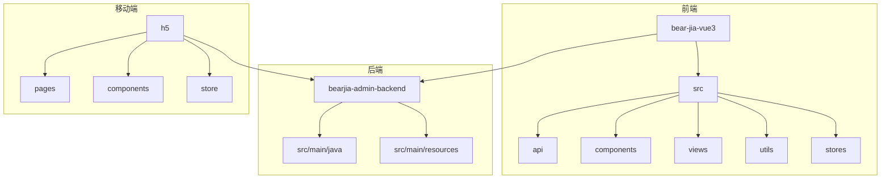

**Diagram sources**
- [package.json](file://bear-jia-vue3/package.json)
- [pom.xml](file://bearjia-admin-backend/pom.xml)

**Section sources**
- [package.json](file://bear-jia-vue3/package.json)
- [pom.xml](file://bearjia-admin-backend/pom.xml)

## 代码风格规范
项目采用ESLint和Prettier进行代码风格统一管理，确保代码的一致性和可读性。

### JavaScript/TypeScript ESLint规则
前端项目使用ESLint进行代码质量检查，主要规则包括：
- 缩进使用2个空格
- 字符串使用单引号
- 语句末尾必须有分号
- 对象花括号前后必须有空格
- 数组方括号内不允许有空格
- 箭头函数参数必须有括号
- 多行对象或数组的尾随逗号仅在多行时使用

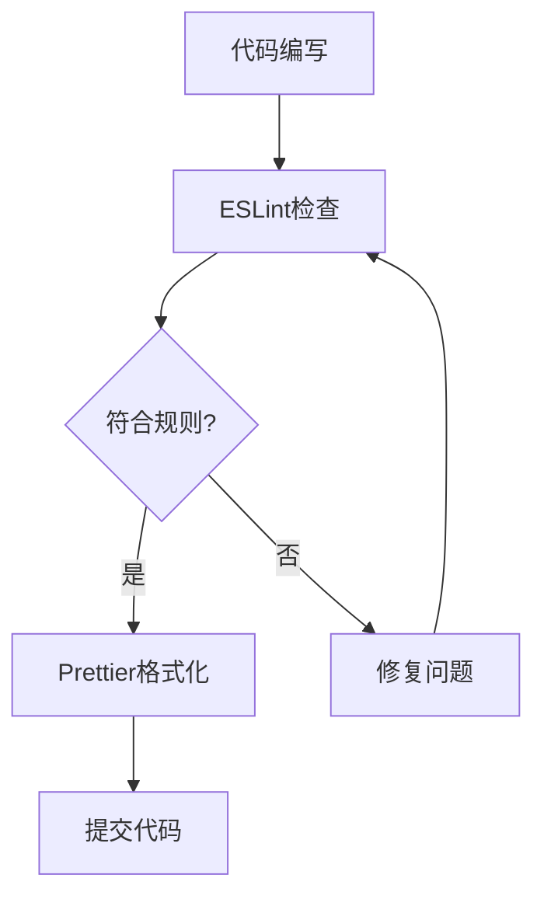

**Section sources**
- [.eslintrc.js](file://bear-jia-vue3/.eslintrc.js)
- [package.json](file://bear-jia-vue3/package.json)

### Prettier格式化配置
Prettier配置与ESLint集成，确保代码格式统一：
- 单引号
- 语句末尾分号
- 不使用制表符，使用空格缩进
- 缩进宽度为2
- 多行对象或数组的尾随逗号
- 打印宽度为100字符
- 自动换行策略为"auto"

**Section sources**
- [.eslintrc.js](file://bear-jia-vue3/.eslintrc.js)

## 命名规范
统一的命名规范有助于提高代码的可读性和可维护性。

### 变量命名
- 普通变量使用camelCase（小驼峰式）
- 常量使用UPPER_CASE（大写下划线）
- 布尔变量使用is、has、can等前缀表示状态
- 数组变量使用复数形式

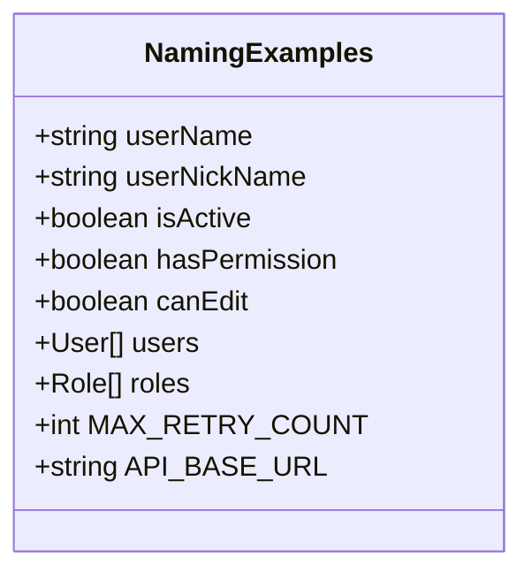

**Section sources**
- [main.js](file://bear-jia-vue3/src/main.js)
- [request.js](file://bear-jia-vue3/src/utils/request.js)

### 函数命名
- 函数名使用camelCase（小驼峰式）
- 动词开头，明确表达函数功能
- 异步函数以async结尾或使用动词的进行时形式
- 事件处理函数以handle开头

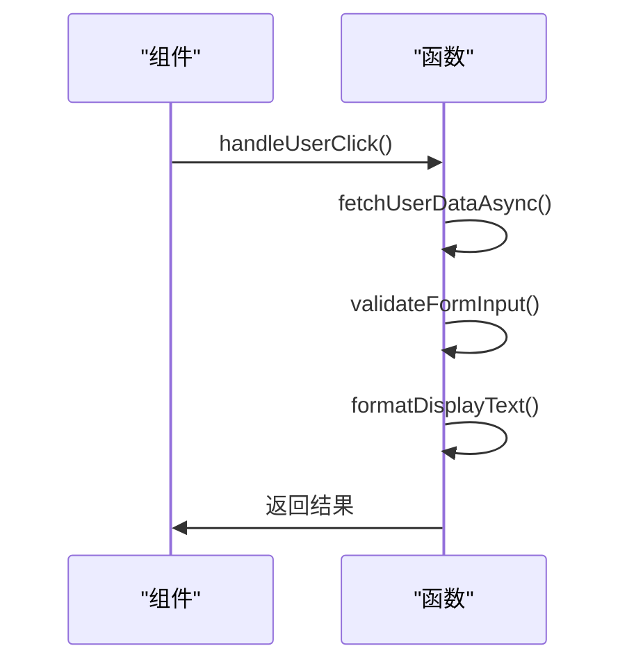

**Section sources**
- [index.vue](file://bear-jia-vue3/src/views/system/user/index.vue)

### 类和组件命名
- 类名使用PascalCase（大驼峰式）
- Vue组件文件名使用PascalCase
- 组件目录名与组件名一致
- 公共组件以"Base"或"Common"前缀

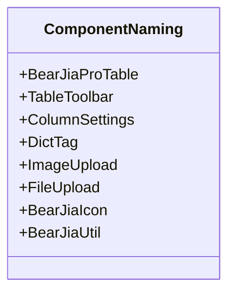

**Section sources**
- [package.json](file://bear-jia-vue3/package.json)
- [index.vue](file://bear-jia-vue3/src/views/system/user/index.vue)

### 文件命名
- Vue组件文件使用PascalCase命名
- 工具函数文件使用camelCase命名
- 配置文件使用kebab-case（短横线分隔）
- 测试文件与被测文件同名，后缀为.test或.spec

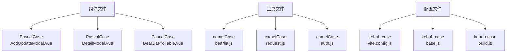

**Section sources**
- [project_structure](file://project_structure)

## 目录结构规范
清晰的目录结构有助于团队协作和代码维护。

### 前端目录结构
前端项目采用功能模块化组织，主要目录包括：
- src/api：API接口定义
- src/components：可复用组件
- src/views：页面视图
- src/utils：工具函数
- src/stores：状态管理
- src/directive：自定义指令

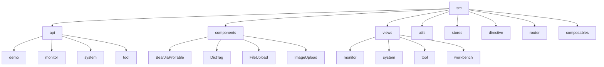

**Section sources**
- [project_structure](file://project_structure)

### 新功能模块创建
创建新功能模块时应遵循以下原则：
- API接口放在src/api对应模块目录
- 页面视图放在src/views对应模块目录
- 公共组件放在src/components目录
- 工具函数放在src/utils目录
- 状态管理放在src/stores目录

**Section sources**
- [project_structure](file://project_structure)

## 代码注释规范
良好的注释有助于理解代码意图和维护。

### 注释格式要求
- 文件头部注释包含文件描述、作者、创建日期
- 函数注释使用JSDoc格式
- 复杂逻辑添加行内注释
- TODO和FIXME标记需要说明

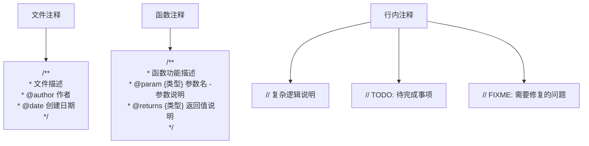

**Section sources**
- [BaseController.java](file://bearjia-admin-backend/src/main/java/com/javaxiaobear/base/framework/web/controller/BaseController.java)

### JSDoc使用规范
JavaScript/TypeScript函数应使用JSDoc注释，包含：
- 函数功能描述
- 参数类型和说明
- 返回值类型和说明
- 可选参数标记
- 异常情况说明

```mermaid
classDiagram
class JSDocExample {
+/**
+ * 获取用户列表
+ * @param {Object} params - 查询参数
+ * @param {string} params.userName - 用户名
+ * @param {string} params.nickName - 昵称
+ * @param {number} params.pageNum - 页码
+ * @param {number} params.pageSize - 每页数量
+ * @returns {Promise} 返回用户列表和分页信息
+ * @throws {Error} 网络错误或认证失败
+ */
+listUser(params)
}
```

**Section sources**
- [index.vue](file://bear-jia-vue3/src/views/system/user/index.vue)

### JavaDoc使用规范
Java类和方法应使用JavaDoc注释，包含：
- 类/方法功能描述
- 参数说明
- 返回值说明
- 异常说明
- 作者和版本信息

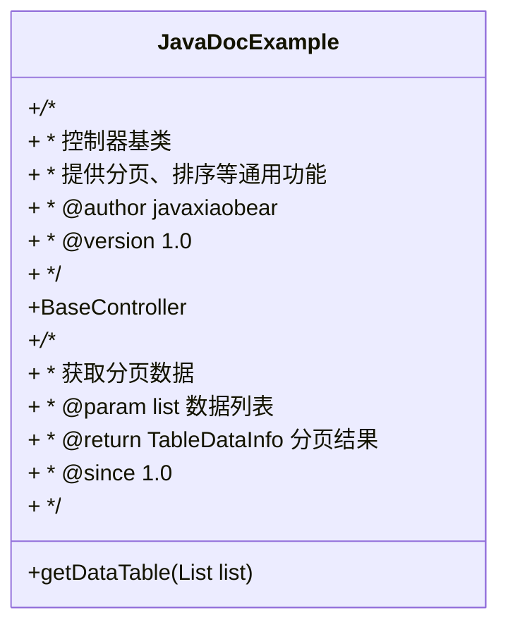

**Section sources**
- [BaseController.java](file://bearjia-admin-backend/src/main/java/com/javaxiaobear/base/framework/web/controller/BaseController.java)

## 提交信息规范
统一的提交信息格式有助于代码审查和版本管理。

### 提交类型前缀
提交信息应以类型前缀开头，说明变更性质：
- feat：新增功能
- fix：修复bug
- docs：文档更新
- style：代码格式调整
- refactor：代码重构
- test：测试相关
- chore：构建过程或辅助工具的变动

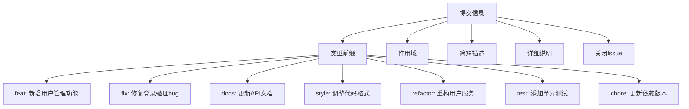

**Section sources**
- [package.json](file://bear-jia-vue3/package.json)

### 提交信息格式
完整的提交信息格式如下：
```
<类型>(<作用域>): <简短描述>

<详细说明>

<关闭的Issue>
```

**Section sources**
- [package.json](file://bear-jia-vue3/package.json)

## 组件开发规范
Vue组件开发应遵循统一的规范，确保组件的可复用性和一致性。

### Props定义规范
- Props应明确指定类型
- 必需Props应设置required: true
- 提供合理的默认值
- 添加Props描述注释

```mermaid
classDiagram
class ComponentProps {
+props : {
+ type : String,
+ required : true,
+ default : 'primary',
+ validator : (value) => ['primary', 'success', 'warning', 'danger'].includes(value)
+}
+/**
+ * 按钮类型
+ * @type {String}
+ * @default 'primary'
+ * @values 'primary', 'success', 'warning', 'danger'
+ */
+type
}
```

**Section sources**
- [index.vue](file://bear-jia-vue3/src/views/system/user/index.vue)

### 事件命名规范
- 事件名使用kebab-case（短横线分隔）
- 事件名应以动词开头
- 自定义事件前缀使用组件名
- 避免与原生事件冲突

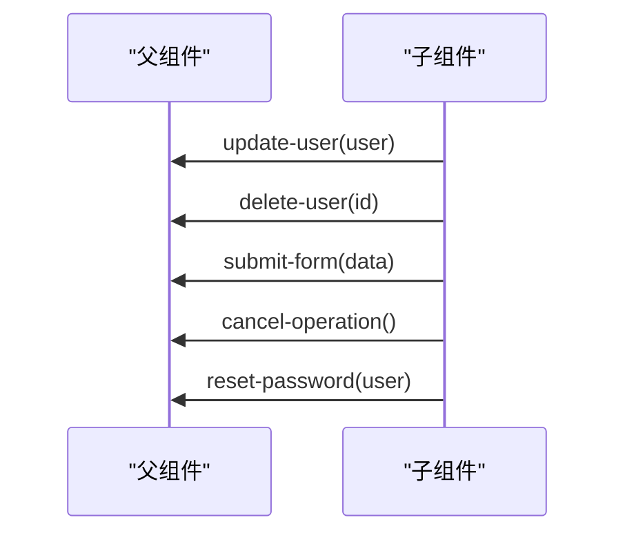

**Section sources**
- [index.vue](file://bear-jia-vue3/src/views/system/user/index.vue)

### 插槽使用规范
- 具名插槽使用kebab-case命名
- 作用域插槽传递必要的数据
- 提供插槽使用示例
- 避免过度使用插槽

```mermaid
classDiagram
class SlotUsage {
+<template #header>
+<template #footer>
+<template #actions="{ record }">
+<template #bodyCell="{ column, record }">
+<template #empty>
}
```

**Section sources**
- [index.vue](file://bear-jia-vue3/src/views/system/user/index.vue)

## API设计规范
RESTful API设计应遵循统一的原则，确保接口的一致性和易用性。

### URL命名规范
- 使用小写字母和短横线分隔
- 使用名词复数形式
- 层级关系使用斜杠分隔
- 避免动词出现在URL中

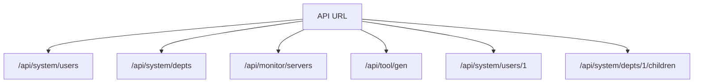

**Section sources**
- [index.vue](file://bear-jia-vue3/src/views/system/user/index.vue)

### HTTP方法使用
- GET：获取资源
- POST：创建资源
- PUT：更新资源（全量）
- PATCH：更新资源（部分）
- DELETE：删除资源

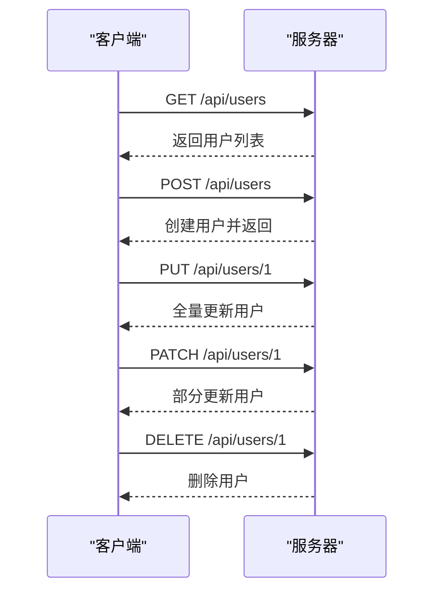

**Section sources**
- [request.js](file://bear-jia-vue3/src/utils/request.js)

### 状态码选择
- 200：成功
- 201：创建成功
- 204：删除成功
- 400：请求参数错误
- 401：未认证
- 403：无权限
- 404：资源不存在
- 500：服务器错误

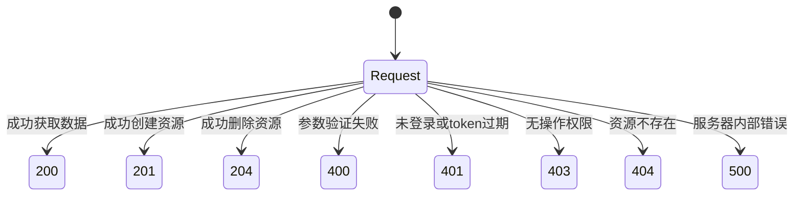

**Section sources**
- [request.js](file://bear-jia-vue3/src/utils/request.js)

## 工具配置说明
开发工具的正确配置有助于提高开发效率和代码质量。

### IDE集成配置
- VS Code推荐插件：Vetur、ESLint、Prettier、Volar
- WebStorm配置ESLint和Prettier
- IntelliJ IDEA配置Checkstyle和Formatter

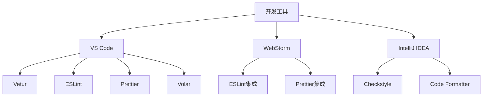

**Section sources**
- [.eslintrc.js](file://bear-jia-vue3/.eslintrc.js)
- [pom.xml](file://bearjia-admin-backend/pom.xml)

### 项目脚本说明
项目提供了多个npm脚本用于开发和构建：
- dev：开发模式启动
- build：生产环境构建
- build:prod：生产环境构建
- build:test：测试环境构建
- lint：代码检查
- lint:fix：自动修复代码问题
- format：代码格式化

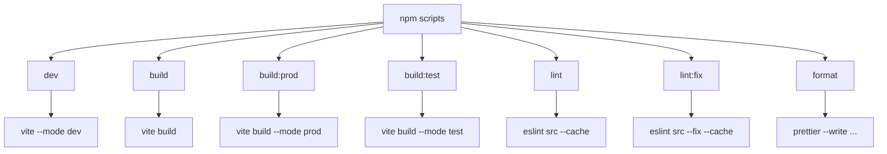

**Section sources**
- [package.json](file://bear-jia-vue3/package.json)