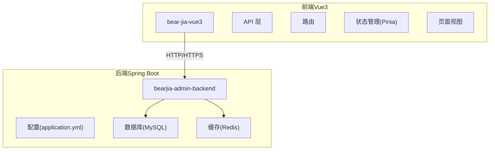
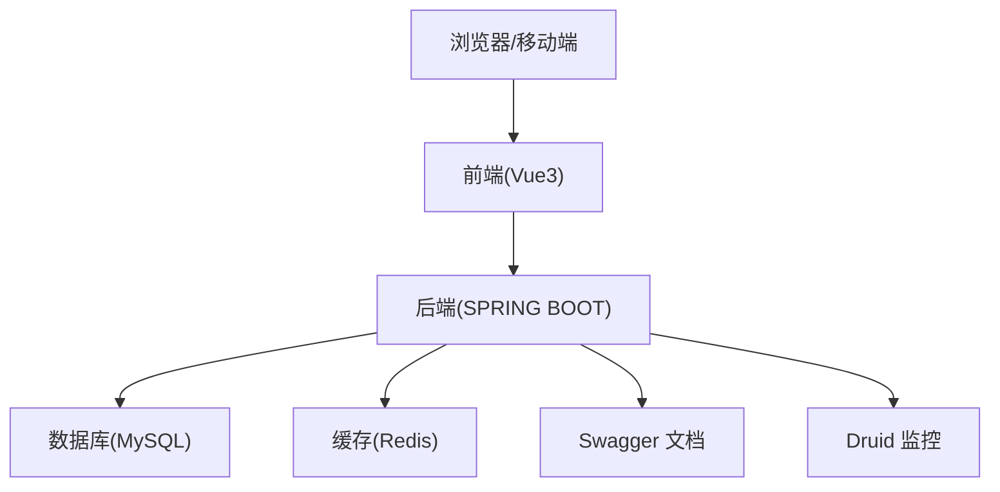
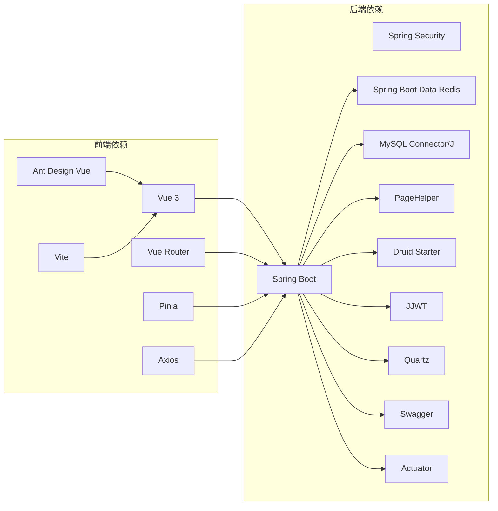

# 快速开始

<cite>
**本文引用的文件**
- [bear-jia-vue3/README.md](file://bear-jia-vue3/README.md)
- [bearjia-admin-backend/README.md](file://bearjia-admin-backend/README.md)
- [bear-jia-vue3/package.json](file://bear-jia-vue3/package.json)
- [bearjia-admin-backend/pom.xml](file://bearjia-admin-backend/pom.xml)
- [bear-jia-vue3/vite.config.js](file://bear-jia-vue3/vite.config.js)
- [bear-jia-vue3/.env](file://bear-jia-vue3/.env)
- [bear-jia-vue3/.env.test](file://bear-jia-vue3/.env.test)
- [bearjia-admin-backend/src/main/java/com/javaxiaobear/JavaXiaoBearApplication.java](file://bearjia-admin-backend/src/main/java/com/javaxiaobear/JavaXiaoBearApplication.java)
- [bearjia-admin-backend/src/main/resources/application.yml](file://bearjia-admin-backend/src/main/resources/application.yml)
- [bearjia-admin-backend/src/main/resources/sql/bear_jia.sql](file://bearjia-admin-backend/src/main/resources/sql/bear_jia.sql)
</cite>

## 目录
1. [简介](#简介)
2. [项目结构](#项目结构)
3. [核心组件](#核心组件)
4. [架构总览](#架构总览)
5. [详细组件分析](#详细组件分析)
6. [依赖分析](#依赖分析)
7. [性能考虑](#性能考虑)
8. [故障排查指南](#故障排查指南)
9. [结论](#结论)
10. [附录](#附录)

## 简介
本指南面向新开发者，提供从零开始搭建与运行 BearJia 管理系统的完整步骤，涵盖：
- 环境准备：Node.js、JDK、Maven、MySQL、Redis
- 项目克隆与依赖安装：前端使用 npm，后端使用 Maven
- 数据库配置：导入 bear_jia.sql，配置 application.yml 中的数据库与 Redis 连接
- 服务启动：前端使用 Vite，后端使用 Spring Boot
- 环境变量配置：.env 与 .env.test 的设置及环境差异
- 常见问题排查：端口冲突、依赖下载失败、数据库连接错误等
- 成功启动后的验证步骤与最佳实践建议

## 项目结构
本仓库包含三个主要子项目：
- bear-jia-vue3：基于 Vue3 + Vite 的前端管理后台
- bearjia-admin-backend：基于 Spring Boot 的后端服务
- h5：基于 uni-app 的小程序/移动端页面（非本次快速开始重点）

图表来源
- [bear-jia-vue3/README.md](file://bear-jia-vue3/README.md#L162-L185)
- [bearjia-admin-backend/README.md](file://bearjia-admin-backend/README.md#L64-L129)

章节来源
- [bear-jia-vue3/README.md](file://bear-jia-vue3/README.md#L162-L185)
- [bearjia-admin-backend/README.md](file://bearjia-admin-backend/README.md#L64-L129)

## 核心组件
- 前端（bear-jia-vue3）
  - 构建工具：Vite 5
  - 路由：Vue Router 4
  - 状态管理：Pinia
  - UI 组件库：Ant Design Vue 4
  - API 层：统一管理后端接口
- 后端（bearjia-admin-backend）
  - 框架：Spring Boot 2.7.18
  - 安全：Spring Security + JWT
  - ORM：MyBatis + PageHelper
  - 缓存：Redis
  - 定时任务：Quartz
  - 监控：Druid + Actuator
  - 代码生成：Velocity 模板引擎

章节来源
- [bear-jia-vue3/README.md](file://bear-jia-vue3/README.md#L212-L229)
- [bearjia-admin-backend/README.md](file://bearjia-admin-backend/README.md#L33-L62)
- [bearjia-admin-backend/pom.xml](file://bearjia-admin-backend/pom.xml#L40-L217)

## 架构总览
前后端分离架构，前端通过 RESTful API 与后端交互；后端使用 MySQL 存储业务数据，Redis 缓存热点数据与会话；系统提供 Swagger 文档与 Druid 监控面板。

图表来源
- [bearjia-admin-backend/README.md](file://bearjia-admin-backend/README.md#L33-L62)
- [bearjia-admin-backend/src/main/resources/application.yml](file://bearjia-admin-backend/src/main/resources/application.yml#L1-L134)

## 详细组件分析

### 环境准备
- 前端环境
  - Node.js：16.0+
  - 现代浏览器：Chrome 88+、Firefox 78+、Safari 14+、Edge 88+
- 后端环境
  - JDK：1.8+
  - Maven：3.6+
  - MySQL：5.7+ / 8.0+
  - Redis：3.0+

章节来源
- [bear-jia-vue3/README.md](file://bear-jia-vue3/README.md#L162-L174)
- [bearjia-admin-backend/README.md](file://bearjia-admin-backend/README.md#L162-L174)

### 项目克隆
- 使用 Git 克隆仓库，并进入项目根目录
- 前端目录：bear-jia-vue3
- 后端目录：bearjia-admin-backend

章节来源
- [bearjia-admin-backend/README.md](file://bearjia-admin-backend/README.md#L175-L182)

### 依赖安装
- 前端（bear-jia-vue3）
  - 使用 npm 安装依赖
  - 常用脚本：dev、build、preview、lint:fix、format
- 后端（bearjia-admin-backend）
  - 使用 Maven 构建（spring-boot-maven-plugin 已配置）

章节来源
- [bear-jia-vue3/package.json](file://bear-jia-vue3/package.json#L1-L64)
- [bearjia-admin-backend/pom.xml](file://bearjia-admin-backend/pom.xml#L219-L230)

### 数据库配置
- 导入数据库脚本
  - 路径：bearjia-admin-backend/src/main/resources/sql/bear_jia.sql
  - 建议使用 MySQL 8.0+，如使用 5.7 需注意 SQL 语法差异
- 配置 application.yml
  - 数据库连接：spring.datasource（用户名、密码、URL）
  - Redis 连接：spring.redis（host、port、password、database、timeout）
  - 项目上传路径：project.profile（可由环境变量覆盖）
  - JWT 密钥：token.secret（建议生产环境使用环境变量）

章节来源
- [bearjia-admin-backend/src/main/resources/sql/bear_jia.sql](file://bearjia-admin-backend/src/main/resources/sql/bear_jia.sql#L1-L50)
- [bearjia-admin-backend/src/main/resources/application.yml](file://bearjia-admin-backend/src/main/resources/application.yml#L1-L134)

### 服务启动
- 启动后端（Spring Boot）
  - 方式一：IDE 运行启动类
    - 类：JavaXiaoBearApplication
  - 方式二：命令行
    - 进入后端目录，执行 Maven 命令启动
- 启动前端（Vite）
  - 进入前端目录，执行 npm run dev
  - 默认前端访问地址：http://localhost:5173

章节来源
- [bearjia-admin-backend/src/main/java/com/javaxiaobear/JavaXiaoBearApplication.java](file://bearjia-admin-backend/src/main/java/com/javaxiaobear/JavaXiaoBearApplication.java#L1-L22)
- [bear-jia-vue3/vite.config.js](file://bear-jia-vue3/vite.config.js#L1-L9)
- [bear-jia-vue3/README.md](file://bear-jia-vue3/README.md#L87-L111)

### 环境变量配置
- 前端环境变量
  - .env：开发环境基础配置（如 VITE_APP_TITLE、VITE_APP_ENV、VITE_APP_BASE_API）
  - .env.test：测试环境配置（如 VITE_PORT、VITE_BASE_URL、VITE_API_DOMAIN）
- 后端环境变量
  - 项目上传路径：UPLOAD_PATH（可覆盖 application.yml 中的 project.profile）
  - JWT 密钥：JWT_SECRET（建议生产环境使用环境变量）

章节来源
- [bear-jia-vue3/.env](file://bear-jia-vue3/.env#L1-L7)
- [bear-jia-vue3/.env.test](file://bear-jia-vue3/.env.test#L1-L6)
- [bearjia-admin-backend/src/main/resources/application.yml](file://bearjia-admin-backend/src/main/resources/application.yml#L1-L134)

### 成功启动后的验证步骤
- 前端
  - 访问 http://localhost:5173，确认登录页加载正常
  - 控制台无明显错误
- 后端
  - 访问 http://localhost:8081（或后端配置的 server.port）
  - Swagger 文档：http://localhost:8081/swagger-ui/
  - Druid 监控：http://localhost:8081/druid/
  - 默认账号：admin / admin123（首次登录可能需要修改初始密码）

章节来源
- [bearjia-admin-backend/README.md](file://bearjia-admin-backend/README.md#L211-L217)
- [bearjia-admin-backend/src/main/resources/application.yml](file://bearjia-admin-backend/src/main/resources/application.yml#L1-L134)

## 依赖分析
- 前端依赖（节选）
  - Vue 3、Vue Router、Pinia、Axios、Ant Design Vue、Vite、ESLint、Prettier
- 后端依赖（节选）
  - Spring Boot Web、Security、DevTools、Redis、MySQL 驱动、PageHelper、Druid、JWT、Quartz、Swagger、Actuator

图表来源
- [bearjia-admin-backend/pom.xml](file://bearjia-admin-backend/pom.xml#L40-L217)
- [bear-jia-vue3/package.json](file://bear-jia-vue3/package.json#L1-L64)

章节来源
- [bearjia-admin-backend/pom.xml](file://bearjia-admin-backend/pom.xml#L40-L217)
- [bear-jia-vue3/package.json](file://bear-jia-vue3/package.json#L1-L64)

## 性能考虑
- 前端
  - 使用 Vite 构建，开发体验与生产打包性能优异
  - 合理使用组件懒加载与路由懒加载
- 后端
  - Redis 缓存热点数据与会话
  - Druid 连接池与慢查询监控
  - PageHelper 分页优化
  - Actuator 暴露健康与指标信息

章节来源
- [bearjia-admin-backend/README.md](file://bearjia-admin-backend/README.md#L24-L31)
- [bearjia-admin-backend/pom.xml](file://bearjia-admin-backend/pom.xml#L100-L120)
- [bearjia-admin-backend/src/main/resources/application.yml](file://bearjia-admin-backend/src/main/resources/application.yml#L70-L115)

## 故障排查指南
- 端口冲突
  - 前端：Vite 默认端口 5173，可在 .env.test 中调整 VITE_PORT
  - 后端：Spring Boot 默认端口 8081，可在 application.yml 中修改 server.port
- 依赖下载失败
  - 前端：检查网络与 npm 源；必要时使用代理或更换镜像源
  - 后端：Maven 使用阿里云公共仓库，确保网络可达
- 数据库连接错误
  - 确认 bear_jia.sql 已正确导入
  - application.yml 中的 spring.datasource.url、username、password 与实际数据库一致
  - MySQL 版本差异导致的 SQL 语法问题（建议使用 8.0+）
- Redis 连接错误
  - 确认 Redis 服务已启动
  - application.yml 中的 spring.redis.host、port、password 与实际一致
- 启动后端报错
  - 确认 JDK 1.8+ 已安装
  - 确认 pom.xml 中 spring-boot-maven-plugin 已启用
  - IDE 启动时排除 DataSourceAutoConfiguration（启动类已配置）

章节来源
- [bear-jia-vue3/.env.test](file://bear-jia-vue3/.env.test#L1-L6)
- [bearjia-admin-backend/src/main/resources/application.yml](file://bearjia-admin-backend/src/main/resources/application.yml#L1-L134)
- [bearjia-admin-backend/pom.xml](file://bearjia-admin-backend/pom.xml#L232-L257)
- [bearjia-admin-backend/src/main/java/com/javaxiaobear/JavaXiaoBearApplication.java](file://bearjia-admin-backend/src/main/java/com/javaxiaobear/JavaXiaoBearApplication.java#L1-L22)

## 结论
按照本指南完成环境准备、项目克隆、依赖安装、数据库与配置、服务启动与验证，即可快速搭建 BearJia 管理系统。建议在开发过程中结合 VS Code 插件与 ESLint/Prettier 规范，提升开发效率与代码质量。

## 附录
- 常用命令摘要
  - 前端：npm install、npm run dev、npm run build、npm run preview
  - 后端：mvn spring-boot:run
- 推荐开发工具
  - VS Code：ESLint、Prettier、Vetur/Volar、Debugger for Chrome
  - 浏览器：Chrome DevTools、Vue DevTools

章节来源
- [bear-jia-vue3/README.md](file://bear-jia-vue3/README.md#L87-L129)
- [bearjia-admin-backend/README.md](file://bearjia-admin-backend/README.md#L175-L217)