# 技术栈

<cite>
**本文档引用的文件**
- [package.json](file://bear-jia-vue3/package.json)
- [pom.xml](file://bearjia-admin-backend/pom.xml)
- [vite.config.js](file://bear-jia-vue3/vite.config.js)
- [application.yml](file://bearjia-admin-backend/src/main/resources/application.yml)
- [application-druid.yml](file://bearjia-admin-backend/src/main/resources/application-druid.yml)
- [mybatis-config.xml](file://bearjia-admin-backend/src/main/resources/mybatis/mybatis-config.xml)
- [JavaXiaoBearApplication.java](file://bearjia-admin-backend/src/main/java/com/javaxiaobear/JavaXiaoBearApplication.java)
- [user.js](file://bear-jia-vue3/src/stores/user.js)
- [index.js](file://bear-jia-vue3/config/vite/index.js)
- [plugins.js](file://bear-jia-vue3/config/vite/plugins.js)
- [request.js](file://bear-jia-vue3/src/utils/request.js)
- [auth.js](file://bear-jia-vue3/src/utils/auth.js)
- [vueRouter.js](file://bear-jia-vue3/src/router/vueRouter.js)
</cite>

## 目录
1. [技术栈概述](#技术栈概述)
2. [前端技术栈](#前端技术栈)
3. [后端技术栈](#后端技术栈)
4. [构建工具与配置](#构建工具与配置)
5. [开发环境要求](#开发环境要求)
6. [技术栈架构图](#技术栈架构图)

## 技术栈概述

本项目采用前后端分离的架构设计，前端使用现代化的Vue3技术栈，后端基于Spring Boot生态构建。系统通过JWT实现无状态认证，使用Redis进行缓存优化，Druid作为数据库连接池提供高性能的数据访问能力。前后端通过RESTful API进行通信，Axios作为HTTP客户端处理网络请求。

**Section sources**
- [package.json](file://bear-jia-vue3/package.json)
- [pom.xml](file://bearjia-admin-backend/pom.xml)

## 前端技术栈

### Vue3组合式API
项目前端采用Vue3作为核心框架，充分利用组合式API（Composition API）的优势。相比选项式API，组合式API提供了更好的逻辑组织能力，使代码更加模块化和可复用。通过`setup`函数和响应式API（如`ref`、`reactive`），开发者可以更灵活地组织组件逻辑。

Vue3的性能提升主要体现在：
- 更小的包体积
- 更快的渲染速度
- 更好的TypeScript支持
- 改进的响应式系统

**Section sources**
- [package.json](file://bear-jia-vue3/package.json)
- [main.js](file://bear-jia-vue3/src/main.js)

### Vite构建工具
项目使用Vite作为前端构建工具，替代传统的Webpack。Vite基于ES模块（ESM）的原生支持，利用浏览器对ESM的原生解析能力，实现了极速的开发服务器启动和热更新。

Vite的主要优势包括：
- **快速启动**：开发服务器启动时间极短，通常在毫秒级
- **即时热更新**：基于ESM的HMR（热模块替换），更新速度与应用大小无关
- **现代化的构建**：内置对TypeScript、JSX、CSS预处理器等的支持
- **生产优化**：基于Rollup的生产构建，提供优秀的代码分割和压缩

**Section sources**
- [vite.config.js](file://bear-jia-vue3/vite.config.js)
- [package.json](file://bear-jia-vue3/package.json)

### Pinia状态管理
Pinia作为Vue3推荐的状态管理库，替代了Vuex。它提供了更简洁的API和更好的TypeScript支持。项目中使用Pinia管理全局状态，如用户信息、权限、应用配置等。

Pinia的优势：
- 更小的体积
- 更简单的API
- 完美的TypeScript集成
- 模块化设计，无需嵌套模块
- 支持Vue DevTools

在项目中，`user.js`文件定义了用户状态管理store，处理登录、获取用户信息、登出等操作。

**Section sources**
- [user.js](file://bear-jia-vue3/src/stores/user.js)
- [package.json](file://bear-jia-vue3/package.json)

### Vue Router路由系统
Vue Router 4为Vue3提供路由功能，实现单页应用（SPA）的页面导航。项目通过路由系统管理不同视图的切换，支持路由懒加载、路由守卫等功能。

路由配置采用模块化设计，分离路由定义和路由实例，提高了代码的可维护性。

**Section sources**
- [vueRouter.js](file://bear-jia-vue3/src/router/vueRouter.js)
- [index.js](file://bear-jia-vue3/src/router/index.js)

### Ant Design Vue UI组件库
项目采用Ant Design Vue作为UI组件库，提供了一套高质量的企业级UI组件。版本为4.1.2，与Vue3完全兼容。

Ant Design Vue的优势：
- 丰富的组件库
- 一致的设计语言
- 良好的可访问性
- 强大的主题定制能力
- 完善的文档和社区支持

通过`unplugin-vue-components`插件实现组件的自动导入，无需手动引入每个组件，提高了开发效率。

**Section sources**
- [package.json](file://bear-jia-vue3/package.json)
- [plugins.js](file://bear-jia-vue3/config/vite/plugins.js)

### Axios HTTP客户端
Axios作为HTTP客户端，处理前后端的API通信。项目对Axios进行了封装，添加了请求拦截器和响应拦截器，实现了：
- 自动添加JWT令牌
- 统一的错误处理
- 请求超时控制
- 网络异常处理
- 下载文件支持

封装后的HTTP服务提供了更好的用户体验和更健壮的错误处理机制。

**Section sources**
- [request.js](file://bear-jia-vue3/src/utils/request.js)
- [package.json](file://bear-jia-vue3/package.json)

## 后端技术栈

### Spring Boot框架
后端基于Spring Boot 2.7.18构建，利用其自动配置、起步依赖等特性，快速搭建企业级应用。Spring Boot简化了Spring应用的初始搭建和开发过程，提供了开箱即用的特性。

核心优势：
- 约定优于配置
- 内嵌服务器（Tomcat）
- 自动配置
- 健康检查和监控
- 生产就绪特性

**Section sources**
- [pom.xml](file://bearjia-admin-backend/pom.xml)
- [JavaXiaoBearApplication.java](file://bearjia-admin-backend/src/main/java/com/javaxiaobear/JavaXiaoBearApplication.java)

### Spring Security安全框架
Spring Security提供全面的安全服务，包括认证和授权。项目中结合JWT实现无状态认证，避免了服务器端会话存储，更适合分布式系统。

安全配置包括：
- 基于角色的访问控制（RBAC）
- 方法级安全
- CSRF保护
- 安全头设置
- 异常处理

**Section sources**
- [pom.xml](file://bearjia-admin-backend/pom.xml)
- [application.yml](file://bearjia-admin-backend/src/main/resources/application.yml)

### JWT认证机制
使用JSON Web Token（JWT）实现无状态认证。JWT版本为0.9.1，通过`io.jsonwebtoken:jjwt`库实现。

JWT的优势：
- 无状态：服务器无需存储会话信息
- 可扩展：支持自定义声明
- 安全：支持数字签名和加密
- 跨域友好：适合微服务架构

Token配置在`application.yml`中定义，包括令牌头、密钥、有效期等。

**Section sources**
- [pom.xml](file://bearjia-admin-backend/pom.xml)
- [application.yml](file://bearjia-admin-backend/src/main/resources/application.yml)

### MyBatis持久层框架
MyBatis作为持久层框架，提供SQL到对象的映射。相比JPA/Hibernate，MyBatis给予开发者更多SQL控制权，更适合复杂查询场景。

配置特点：
- XML映射文件集中管理
- 支持动态SQL
- 驼峰命名自动转换
- 二级缓存支持

**Section sources**
- [pom.xml](file://bearjia-admin-backend/pom.xml)
- [mybatis-config.xml](file://bearjia-admin-backend/src/main/resources/mybatis/mybatis-config.xml)

### Redis缓存
集成Redis作为缓存解决方案，提高系统性能。Redis配置包括：
- 连接池设置
- 超时配置
- 数据库索引
- 密码保护

缓存用于存储会话信息、热点数据、验证码等，减少数据库压力。

**Section sources**
- [pom.xml](file://bearjia-admin-backend/pom.xml)
- [application.yml](file://bearjia-admin-backend/src/main/resources/application.yml)

### Druid数据库连接池
使用阿里巴巴的Druid作为数据库连接池，替代默认的HikariCP。Druid不仅提供连接池功能，还包含监控、防火墙、日志等功能。

核心特性：
- SQL执行监控
- 慢SQL记录
- 数据库密码加密
- Web监控界面
- 防火墙功能

Druid监控界面可通过`/druid/*`路径访问，需要提供配置的用户名和密码。

**Section sources**
- [pom.xml](file://bearjia-admin-backend/pom.xml)
- [application-druid.yml](file://bearjia-admin-backend/src/main/resources/application-druid.yml)

## 构建工具与配置

### Vite插件系统
Vite通过插件系统提供丰富的构建功能。项目中配置了多个关键插件：

- `@vitejs/plugin-vue`：支持.vue文件
- `@vitejs/plugin-vue-jsx`：支持JSX语法
- `unplugin-auto-import`：自动导入API
- `unplugin-vue-components`：组件自动导入
- `rollup-plugin-visualizer`：打包分析

这些插件共同提供了现代化的开发体验，包括自动导入、类型支持、性能分析等。

**Section sources**
- [plugins.js](file://bear-jia-vue3/config/vite/plugins.js)
- [package.json](file://bear-jia-vue3/package.json)

### Spring Boot自动配置
Spring Boot的自动配置机制通过起步依赖（Starter）简化了配置。项目中通过`application.yml`和`application-druid.yml`进行环境特定配置。

配置特点：
- 多环境支持（dev、prod、test）
- 环境变量覆盖
- 配置文件分离
- 敏感信息通过环境变量注入

**Section sources**
- [application.yml](file://bearjia-admin-backend/src/main/resources/application.yml)
- [application-druid.yml](file://bearjia-admin-backend/src/main/resources/application-druid.yml)

## 开发环境要求

### 前端环境
- **Node.js**: 16.x 或更高版本
- **npm/yarn/pnpm**: 包管理工具
- **浏览器**: 支持ES6+的现代浏览器（Chrome、Firefox、Edge等）

### 后端环境
- **Java**: JDK 1.8
- **Maven**: 3.6.3 或更高版本
- **数据库**: MySQL 5.7+ 或 MySQL 8.0
- **缓存**: Redis 6.0+

### 开发工具
- **IDE**: IntelliJ IDEA（推荐）或 Eclipse
- **前端编辑器**: VS Code
- **数据库工具**: Navicat、DBeaver等
- **API测试**: Postman、Swagger

**Section sources**
- [package.json](file://bear-jia-vue3/package.json)
- [pom.xml](file://bearjia-admin-backend/pom.xml)

## 技术栈架构图

```mermaid
graph TD
subgraph "前端"
A[Vue3] --> B[Vite]
A --> C[Pinia]
A --> D[Vue Router]
A --> E[Ant Design Vue]
A --> F[Axios]
end
subgraph "后端"
G[Spring Boot] --> H[Spring Security]
G --> I[JWT]
G --> J[MyBatis]
G --> K[Druid]
G --> L[Redis]
end
F --> |HTTP/REST| G
I --> |Token| F
L --> G
K --> |MySQL| M[(数据库)]
style A fill:#42b983,stroke:#389d70
style G fill:#61affe,stroke:#4a89dc
style M fill:#37474f,stroke:#263238
```

**Diagram sources**
- [package.json](file://bear-jia-vue3/package.json)
- [pom.xml](file://bearjia-admin-backend/pom.xml)
- [application.yml](file://bearjia-admin-backend/src/main/resources/application.yml)