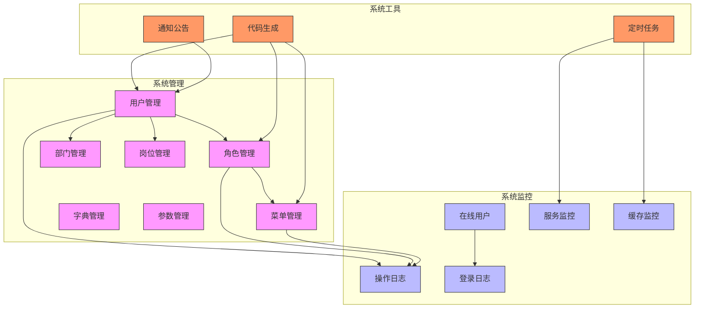

# 核心功能

<cite>
**本文档引用的文件**   
- [user.js](file://bear-jia-vue3\src\api\system\user.js)
- [role.js](file://bear-jia-vue3\src\api\system\role.js)
- [menu.js](file://bear-jia-vue3\src\api\system\menu.js)
- [dept.js](file://bear-jia-vue3\src\api\system\dept.js)
- [post.js](file://bear-jia-vue3\src\api\system\post.js)
- [dict/type.js](file://bear-jia-vue3\src\api\system\dict\type.js)
- [config.js](file://bear-jia-vue3\src\api\system\config.js)
- [notice.js](file://bear-jia-vue3\src\api\system\notice.js)
- [online.js](file://bear-jia-vue3\src\api\monitor\online.js)
- [server.js](file://bear-jia-vue3\src\api\monitor\server.js)
- [cache.js](file://bear-jia-vue3\src\api\monitor\cache.js)
- [operlog.js](file://bear-jia-vue3\src\api\monitor\operlog.js)
- [logininfor.js](file://bear-jia-vue3\src\api\monitor\logininfor.js)
- [gen.js](file://bear-jia-vue3\src\api\tool\gen.js)
- [job.js](file://bear-jia-vue3\src\api\monitor\job.js)
- [index.vue](file://bear-jia-vue3\src\views\system\user\index.vue)
- [index.vue](file://bear-jia-vue3\src\views\system\role\index.vue)
- [index.vue](file://bear-jia-vue3\src\views\system\menu\index.vue)
- [index.vue](file://bear-jia-vue3\src\views\system\dept\index.vue)
- [index.vue](file://bear-jia-vue3\src\views\system\post\index.vue)
- [index.vue](file://bear-jia-vue3\src\views\system\dict\index.vue)
- [index.vue](file://bear-jia-vue3\src\views\system\config\index.vue)
- [index.vue](file://bear-jia-vue3\src\views\system\notice\index.vue)
- [index.vue](file://bear-jia-vue3\src\views\monitor\online\index.vue)
- [index.vue](file://bear-jia-vue3\src\views\monitor\server\index.vue)
- [index.vue](file://bear-jia-vue3\src\views\monitor\cache\index.vue)
- [index.vue](file://bear-jia-vue3\src\views\monitor\operlog\index.vue)
- [index.vue](file://bear-jia-vue3\src\views\monitor\logininfor\index.vue)
- [index.vue](file://bear-jia-vue3\src\views\tool\gen\index.vue)
- [index.vue](file://bear-jia-vue3\src\views\monitor\job\index.vue)
- [permission.js](file://bear-jia-vue3\src\stores\permission.js)
- [auth.js](file://bear-jia-vue3\src\plugins\auth.js)
- [hasPermi.js](file://bear-jia-vue3\src\directive\permission\hasPermi.js)
- [vueRouter.js](file://bear-jia-vue3\src\router\vueRouter.js)
</cite>

## 目录
1. [系统管理](#系统管理)
2. [系统监控](#系统监控)
3. [系统工具](#系统工具)
4. [功能架构](#功能架构)
5. [访问控制](#访问控制)
6. [典型使用场景](#典型使用场景)

## 系统管理

系统管理模块是平台的核心功能域，负责用户、角色、权限等基础数据的维护和管理。该模块通过用户、角色、菜单、部门、岗位、字典和参数管理七个子模块，构建了一个完整的权限控制体系。

### 用户管理
用户管理功能用于维护系统用户的基本信息，包括用户账号、姓名、手机号、邮箱等。管理员可以通过该功能创建、编辑、删除用户，并为用户分配角色和部门。用户管理界面采用左右布局，左侧为部门树，右侧为用户列表，支持按部门筛选用户，提高了用户查找和管理的效率。

**业务目标**：统一管理所有系统用户，确保用户信息的准确性和完整性。

**用户场景**：系统管理员需要为新入职员工创建系统账号，并分配相应的部门和角色。

**操作流程**：
1. 在用户管理界面，点击"新增"按钮
2. 填写用户基本信息，包括用户名、姓名、手机号等
3. 选择用户所属部门
4. 为用户分配一个或多个角色
5. 保存用户信息

**Section sources**
- [user.js](file://bear-jia-vue3\src\api\system\user.js)
- [index.vue](file://bear-jia-vue3\src\views\system\user\index.vue)

### 角色管理
角色管理功能用于定义系统中的角色及其权限。每个角色可以被赋予不同的菜单权限和数据权限，通过角色与用户的绑定，实现权限的批量分配。角色管理支持数据权限范围的设置，包括"所有数据权限"、"本部门数据权限"、"本部门及以下数据权限"和"仅本人数据权限"等选项。

**业务目标**：通过角色抽象权限，简化权限管理，实现权限的批量分配和复用。

**用户场景**：系统管理员需要创建一个"部门经理"角色，该角色可以查看和管理本部门的所有数据。

**操作流程**：
1. 在角色管理界面，点击"新增"按钮
2. 填写角色名称和编码
3. 选择角色状态
4. 在权限分配页面，勾选该角色可以访问的菜单
5. 设置数据权限范围为"本部门及以下数据权限"
6. 保存角色信息

**Section sources**
- [role.js](file://bear-jia-vue3\src\api\system\role.js)
- [index.vue](file://bear-jia-vue3\src\views\system\role\index.vue)

### 菜单管理
菜单管理功能用于定义系统导航菜单的结构和权限。菜单采用树形结构组织，支持目录、菜单和按钮三级结构。每个菜单项可以设置路由地址、权限标识、图标等属性。权限标识（perms）是实现细粒度权限控制的关键，前端通过`v-hasPermi`指令根据权限标识控制按钮的显示和隐藏。

**业务目标**：定义系统的导航结构和权限控制点，实现菜单级别的访问控制。

**用户场景**：系统管理员需要添加一个新的"报表中心"菜单，并为特定角色开放访问权限。

**操作流程**：
1. 在菜单管理界面，点击"新增"按钮
2. 选择菜单类型为"目录"
3. 填写菜单名称"报表中心"，设置图标
4. 保存后，在"报表中心"目录下添加子菜单，如"销售报表"、"财务报表"等
5. 为每个子菜单设置唯一的权限标识
6. 在角色管理中，为需要访问报表的角色分配相应的菜单权限

**Section sources**
- [menu.js](file://bear-jia-vue3\src\api\system\menu.js)
- [index.vue](file://bear-jia-vue3\src\views\system\menu\index.vue)

### 部门管理
部门管理功能用于维护组织架构信息。部门采用树形结构组织，支持多级部门的创建和管理。每个部门可以设置负责人、联系电话等信息。部门信息不仅用于组织架构展示，还作为数据权限控制的基础，实现基于部门的数据隔离。

**业务目标**：维护企业组织架构，支持基于部门的数据权限控制。

**用户场景**：公司组织结构调整，需要在"技术部"下新增"前端开发组"和"后端开发组"两个子部门。

**操作流程**：
1. 在部门管理界面，选择"技术部"节点
2. 点击"新增"按钮
3. 填写部门名称"前端开发组"
4. 设置部门负责人和排序号
5. 保存部门信息
6. 重复上述步骤创建"后端开发组"

**Section sources**
- [dept.js](file://bear-jia-vue3\src\api\system\dept.js)
- [index.vue](file://bear-jia-vue3\src\views\system\dept\index.vue)

### 岗位管理
岗位管理功能用于定义组织中的岗位信息。与部门不同，岗位是基于职能的抽象，一个部门内可以有多个岗位，一个用户也可以担任多个岗位。岗位信息通常用于工作流审批、报表统计等场景。

**业务目标**：维护组织中的岗位信息，支持基于岗位的业务处理。

**用户场景**：人力资源部门需要添加新的"高级前端工程师"岗位，用于招聘和岗位管理。

**操作流程**：
1. 在岗位管理界面，点击"新增"按钮
2. 填写岗位编码"FE-SENIOR"和岗位名称"高级前端工程师"
3. 设置岗位排序和状态
4. 保存岗位信息

**Section sources**
- [post.js](file://bear-jia-vue3\src\api\system\post.js)
- [index.vue](file://bear-jia-vue3\src\views\system\post\index.vue)

### 字典管理
字典管理功能用于维护系统中的枚举数据和常量。字典分为字典类型和字典数据两级结构，字典类型相当于枚举类别，字典数据相当于具体的枚举值。通过字典管理，可以实现数据的标准化和集中维护，避免硬编码。

**业务目标**：集中管理系统的枚举数据，实现数据的标准化和可维护性。

**用户场景**：系统需要新增"客户等级"分类，包括"普通客户"、"VIP客户"、"超级VIP客户"三个等级。

**操作流程**：
1. 在字典管理界面，点击"新增"按钮创建字典类型
2. 填写字典类型"customer_level"和字典类型名称"客户等级"
3. 保存后，点击该字典类型右侧的展开按钮
4. 在字典数据区域，添加三个字典数据："普通客户"（值:1）、"VIP客户"（值:2）、"超级VIP客户"（值:3）
5. 设置每个字典数据的排序号

**Section sources**
- [type.js](file://bear-jia-vue3\src\api\system\dict\type.js)
- [index.vue](file://bear-jia-vue3\src\views\system\dict\index.vue)

### 参数管理
参数管理功能用于维护系统的配置参数。这些参数通常是影响系统行为的开关或阈值，如系统名称、登录尝试次数限制、会话超时时间等。参数管理支持参数的动态修改，无需重启系统即可生效。

**业务目标**：集中管理系统配置参数，支持运行时动态调整。

**用户场景**：安全策略要求将登录失败锁定时间从5分钟调整为15分钟。

**操作流程**：
1. 在参数管理界面，搜索"登录失败锁定时间"参数
2. 点击编辑按钮
3. 将参数值从"5"修改为"15"
4. 保存参数

**Section sources**
- [config.js](file://bear-jia-vue3\src\api\system\config.js)
- [index.vue](file://bear-jia-vue3\src\views\system\config\index.vue)

## 系统监控

系统监控模块提供了对系统运行状态的实时监控和管理功能，帮助管理员及时发现和解决系统问题，确保系统的稳定运行。

### 在线用户
在线用户功能显示当前登录系统的用户会话信息，包括用户名、登录IP、登录地点、浏览器类型等。管理员可以查看用户的在线状态，并对异常会话执行强退操作，增强了系统的安全性。

**业务目标**：实时监控用户登录状态，及时发现和处理异常登录。

**用户场景**：安全审计发现某个用户账号在异地同时登录，需要立即终止其中一个会话。

**操作流程**：
1. 在在线用户界面，通过用户名或IP地址搜索目标会话
2. 查看会话详情，确认登录地点和设备信息
3. 点击"强退"按钮
4. 确认操作，终止该用户会话

**Section sources**
- [online.js](file://bear-jia-vue3\src\api\monitor\online.js)
- [index.vue](file://bear-jia-vue3\src\views\monitor\online\index.vue)

### 服务监控
服务监控功能展示服务器的实时运行状态，包括CPU使用率、内存使用率、磁盘空间、系统负载等关键指标。通过图表化展示，管理员可以直观地了解服务器的健康状况。

**业务目标**：实时监控服务器资源使用情况，预防性能瓶颈。

**用户场景**：系统响应变慢，管理员需要检查服务器资源使用情况，定位性能瓶颈。

**操作流程**：
1. 在服务监控界面，查看CPU、内存、磁盘等指标的实时图表
2. 分析指标变化趋势，识别异常峰值
3. 根据监控数据，决定是否需要扩容或优化

**Section sources**
- [server.js](file://bear-jia-vue3\src\api\monitor\server.js)
- [index.vue](file://bear-jia-vue3\src\views\monitor\server\index.vue)

### 缓存监控
缓存监控功能专门用于监控Redis缓存服务的运行状态。展示Redis版本、运行模式、内存使用、客户端连接数等基本信息，并通过图表展示命令统计和内存使用趋势，帮助管理员优化缓存策略。

**业务目标**：监控缓存服务状态，优化缓存性能。

**用户场景**：缓存命中率下降，需要分析Redis命令执行情况，找出高频查询。

**操作流程**：
1. 在缓存监控界面，查看Redis基本信息
2. 分析命令统计饼图，识别高频执行的Redis命令
3. 根据分析结果，优化应用的缓存使用策略

**Section sources**
- [cache.js](file://bear-jia-vue3\src\api\monitor\cache.js)
- [index.vue](file://bear-jia-vue3\src\views\monitor\cache\index.vue)

### 操作日志
操作日志功能记录用户在系统中的关键操作，如新增、修改、删除等。每条日志包含操作人员、操作模块、操作内容、操作结果和操作时间等信息，是系统审计和问题追溯的重要依据。

**业务目标**：记录关键操作，支持安全审计和问题追溯。

**用户场景**：某条重要数据被意外删除，需要追溯操作人和操作时间。

**操作流程**：
1. 在操作日志界面，设置时间范围和操作类型筛选条件
2. 搜索相关操作记录
3. 查看日志详情，获取操作人、操作时间和具体操作内容
4. 根据日志信息进行问题处理

**Section sources**
- [operlog.js](file://bear-jia-vue3\src\api\monitor\operlog.js)
- [index.vue](file://bear-jia-vue3\src\views\monitor\operlog\index.vue)

### 登录日志
登录日志功能记录用户的登录和登出行为，包括登录时间、登录IP、登录结果等信息。通过登录日志，可以分析用户登录模式，发现异常登录尝试。

**业务目标**：监控用户登录行为，识别安全威胁。

**用户场景**：系统检测到大量失败的登录尝试，需要分析是否遭受暴力破解攻击。

**操作流程**：
1. 在登录日志界面，筛选登录结果为"失败"的记录
2. 按IP地址分组，识别高频尝试的IP
3. 分析登录时间分布，判断是否为自动化攻击
4. 对恶意IP执行封禁操作

**Section sources**
- [logininfor.js](file://bear-jia-vue3\src\api\monitor\logininfor.js)
- [index.vue](file://bear-jia-vue3\src\views\monitor\logininfor\index.vue)

## 系统工具

系统工具模块提供了一系列提高开发和运维效率的实用工具。

### 代码生成
代码生成功能通过读取数据库表结构，自动生成前后端代码框架，包括实体类、Mapper、Service、Controller和Vue页面等。支持自定义生成模板和配置，大幅提高开发效率。

**业务目标**：自动化生成基础代码，减少重复性工作。

**用户场景**：开发新功能需要创建多个数据库表，希望快速生成基础代码框架。

**操作流程**：
1. 在代码生成界面，点击"导入表"按钮
2. 选择需要生成代码的数据库表
3. 配置生成参数，如包名、作者、前端路径等
4. 点击"生成代码"按钮
5. 下载生成的代码压缩包

**Section sources**
- [gen.js](file://bear-jia-vue3\src\api\tool\gen.js)
- [index.vue](file://bear-jia-vue3\src\views\tool\gen\index.vue)

### 定时任务
定时任务功能用于管理系统的计划任务。支持Cron表达式配置执行时间，可以监控任务执行状态和日志。通过定时任务，可以实现数据同步、报表生成、缓存刷新等周期性工作。

**业务目标**：自动化执行周期性任务，提高系统自动化水平。

**用户场景**：需要每天凌晨2点执行数据备份任务。

**操作流程**：
1. 在定时任务界面，点击"新增"按钮
2. 填写任务名称"每日数据备份"
3. 配置Cron表达式"0 0 2 * * ?"
4. 选择任务执行类
5. 设置任务描述和状态
6. 保存任务

**Section sources**
- [job.js](file://bear-jia-vue3\src\api\monitor\job.js)
- [index.vue](file://bear-jia-vue3\src\views\monitor\job\index.vue)

### 通知公告
通知公告功能用于发布系统通知和公告。支持富文本编辑，可以设置公告标题、内容、发布人和发布时间。公告可以置顶显示，确保重要信息不被遗漏。

**业务目标**：统一发布系统通知，确保信息传达。

**用户场景**：系统即将进行维护，需要提前发布维护公告。

**操作流程**：
1. 在通知公告界面，点击"新增"按钮
2. 填写公告标题"系统维护通知"
3. 使用富文本编辑器编写公告内容，说明维护时间、影响范围等
4. 设置公告为"置顶"
5. 发布公告

**Section sources**
- [notice.js](file://bear-jia-vue3\src\api\system\notice.js)
- [index.vue](file://bear-jia-vue3\src\views\system\notice\index.vue)

## 功能架构



**Diagram sources**
- [index.vue](file://bear-jia-vue3\src\views\system\user\index.vue)
- [index.vue](file://bear-jia-vue3\src\views\system\role\index.vue)
- [index.vue](file://bear-jia-vue3\src\views\system\menu\index.vue)
- [index.vue](file://bear-jia-vue3\src\views\monitor\online\index.vue)
- [index.vue](file://bear-jia-vue3\src\views\tool\gen\index.vue)

## 访问控制

系统的访问控制基于RBAC（基于角色的访问控制）模型，通过用户、角色、菜单和权限的关联实现细粒度的权限管理。

### 权限控制机制
系统采用前后端分离的权限控制机制。后端通过Spring Security框架实现接口级别的权限验证，前端通过Vue指令实现UI元素级别的权限控制。

前端权限控制主要通过`v-hasPermi`指令实现，该指令检查当前用户是否拥有指定的权限标识。例如：
```vue
<a-button v-hasPermi="['system:user:add']" @click="openAddModal">新增</a-button>
```
当用户没有`system:user:add`权限时，该按钮将不会显示。

后端权限验证通过`@PreAuthorize`注解实现，例如：
```java
@PreAuthorize("@ss.hasPermi('system:user:list')")
@GetMapping("/list")
public TableDataInfo list(User user)
```

### 角色权限差异
系统预定义了多种角色，不同角色拥有不同的权限组合：

- **超级管理员（admin）**：拥有系统所有权限，可以管理所有用户、角色和配置。
- **系统管理员**：拥有系统管理模块的大部分权限，但不能修改核心安全配置。
- **部门经理**：可以管理本部门的用户和数据，但不能访问其他部门的数据。
- **普通用户**：只能查看和修改自己的信息，访问有限的功能模块。

权限的分配通过角色与菜单的关联实现。在角色管理界面，管理员可以为角色勾选可访问的菜单，系统会自动将菜单的权限标识分配给该角色。

**Section sources**
- [permission.js](file://bear-jia-vue3\src\stores\permission.js)
- [auth.js](file://bear-jia-vue3\src\plugins\auth.js)
- [hasPermi.js](file://bear-jia-vue3\src\directive\permission\hasPermi.js)
- [vueRouter.js](file://bear-jia-vue3\src\router\vueRouter.js)

## 典型使用场景

### 创建新用户并分配角色的完整流程

这是一个典型的系统管理操作，展示了用户管理、角色管理和权限控制的协同工作。

**场景描述**：人力资源部门新入职一名员工张三，需要为其创建系统账号，并分配"财务专员"角色。

**操作步骤**：

1. **登录系统**：使用超级管理员账号登录系统。

2. **进入用户管理**：在左侧导航菜单中，点击"系统管理" -> "用户管理"。

3. **创建用户**：
   - 点击"新增"按钮，打开用户创建表单。
   - 填写用户基本信息：
     - 用户账号：zhangsan
     - 用户姓名：张三
     - 手机号码：13800138000
     - 电子邮箱：zhangsan@company.com
     - 所属部门：选择"财务部"
   - 保持其他字段为默认值，点击"确定"保存。

4. **分配角色**：
   - 在用户列表中找到刚创建的"张三"用户。
   - 点击"分配角色"按钮（或编辑用户时在角色选择框中选择）。
   - 在弹出的角色选择对话框中，勾选"财务专员"角色。
   - 点击"确定"完成角色分配。

5. **验证权限**：
   - 使用张三的账号登录系统。
   - 验证是否可以访问财务相关的菜单和功能。
   - 验证是否无法访问非财务相关的敏感功能。

6. **通知用户**：
   - 将系统登录信息（账号、初始密码、登录地址）通过安全渠道通知张三。
   - 提醒张三首次登录后立即修改密码。

**关联功能**：
- 此流程涉及用户管理、角色管理、部门管理和权限控制等多个功能模块。
- 用户创建时会自动记录操作日志。
- 新用户登录时会生成登录日志。
- 用户的权限由其所属角色决定，实现了权限的集中管理。

**注意事项**：
- 创建用户时，应确保用户账号的唯一性。
- 分配角色时，应根据最小权限原则，只分配必要的角色。
- 应及时通知用户初始密码，并提醒其修改密码。
- 操作完成后，应检查操作日志，确保操作已正确记录。

**Section sources**
- [user.js](file://bear-jia-vue3\src\api\system\user.js)
- [role.js](file://bear-jia-vue3\src\api\system\role.js)
- [index.vue](file://bear-jia-vue3\src\views\system\user\index.vue)
- [index.vue](file://bear-jia-vue3\src\views\system\role\index.vue)
- [operlog.js](file://bear-jia-vue3\src\api\monitor\operlog.js)
- [logininfor.js](file://bear-jia-vue3\src\api\monitor\logininfor.js)